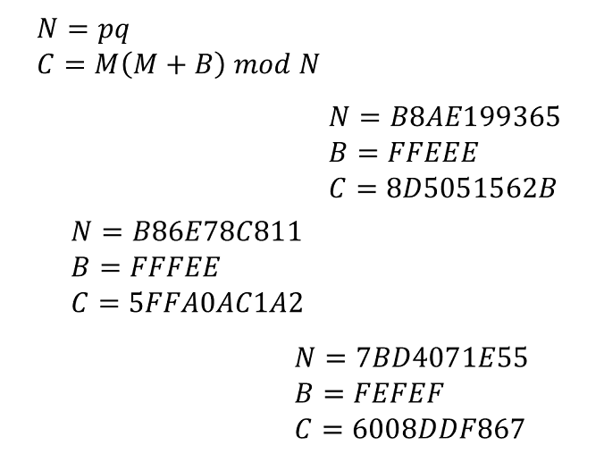

# Decrypt-It-easy

[题目地址](https://adworld.xctf.org.cn/challenges/details?hash=024ad405-8138-4085-ada2-9b5974be3aaa_2)

众所周知难题特别喜欢在题目名告诉你easy。

附件有3样东西，readme.txt，一个二进制文件，和一个程序。

- $ ./rnd crypt1.png ecrypt1.bin

纯粹的crypto太烧脑了，来点reverse玩玩。

```c
undefined4 Main(int param_1,int param_2)

{
  undefined4 uVar1;
  uint __seed;
  FILE *__stream;
  FILE *__stream_00;
  size_t sVar2;
  int iVar3;
  byte local_11 [13];
  
  if (param_1 < 3) {
    uVar1 = 1;
  }
  else {
    __seed = time((time_t *)0x0);
    srand(__seed);
    __stream = fopen(*(char **)(param_2 + 4),"rb");
    __stream_00 = fopen(*(char **)(param_2 + 8),"wb");
    while( true ) {
      sVar2 = fread(local_11,1,1,__stream);
      if (sVar2 != 1) break;
      iVar3 = rand();
      local_11[0] = local_11[0] ^ (byte)iVar3;
      fwrite(local_11,1,1,__stream_00);
    }
    fclose(__stream);
    fclose(__stream_00);
    uVar1 = 0;
  }
  return uVar1;
}
```

又是以当前时间作为种子的随机数。但这次没有更多信息了，加密只执行了一次，要么猜出来当时加密的时间，要么爆破随机数。这两个都不太可能，是时候学点Linux命令了：[stat](https://blog.csdn.net/K346K346/article/details/83832834)。我们知道附件的二进制文件是在程序运行时被创建的，所以它的创建时间就是随机数的种子。

- stat --printf=%Y  ecrypt1.bin
  > 1416667590

然后根据上面的逻辑写出逆向脚本。一定要用linux上的c程序，别的可能会因为随机数算法不同而出现乱七八糟的事。我没法运行，就把[wp](https://blogs.univ-poitiers.fr/e-laize/2014/12/08/seccon-2014-quals-crypto-decrypt-it/)的脚本放出来吧。

```c
#include <stdio.h>
#include <stdlib.h>
 
int main(int argc, char *argv[]) {
  FILE *cipher = fopen(argv[1], "rb");
  FILE *plain = fopen(argv[2], "wb");
  unsigned int seed = atoi(argv[3]);
  int c;
 
  srand(seed);
  c = (fgetc(cipher) & 0xff) ^ (rand() & 0xff);
  while (!feof(cipher)) {
    fputc(c, plain);
    c = (fgetc(cipher) & 0xff) ^ (rand() & 0xff);
  }
  fclose(plain);
  fclose(cipher);
}
```

把脚本命名为decode，编译后执行下面的命令。

- ./decode ecrypt1.bin crypt1.png 1416667590

得到下面的图片。密码学才刚刚开始。



现在有两种方法。第一种，暴力破解，因为使用的n很小，自然m也很小，说明把flag拆成了3份加密。我们知道flag的前缀为SECCON{，看一下前n个字符加密的结果是什么。

```python
from Crypto.Util.number import bytes_to_long
N, B, FLAG = 0xB8AE199365, 0xFFEEE, b'SECCON{'
for i in range(1, len(FLAG)+1):
  M = bytes_to_long(FLAG[0:i])
  print(FLAG[0:i].decode()+'\t'+hex(M * (M + B) % N))
```

- S       0x52fc213
<br>SE      0x54f0cb0bf
<Br>SEC     0x8c0ad9b877
<Br>SECC    0x704d68c1fb
<br>SECCO   0x8d5051562b
<Br>SECCON  0x2339eed575
<br>SECCON{ 0x1bce931b16

发现当m1为SECCO时，输出的结果等于c1。那么剩下的部分应该也是5个字符长。爆破接下来的2组flag。

```python
from Crypto.Util.number import bytes_to_long
N, B = 0xB86E78C811, 0xFFFEE
for i in range(32, 127):
  for j in range(32, 127):
    for k in range(32, 127):
      M = bytes_to_long(b'N{' + chr(i).encode() + chr(j).encode() + chr(k).encode())
      if ((M * (M + B) % N) == 0x5FFA0AC1A2):
        print('N{' + chr(i) + chr(j) + chr(k),end='')
for i in range(32, 127):
  for j in range(32, 127):
    for k in range(32, 127):
      for l in range(32, 127):
        M = bytes_to_long(chr(i).encode() + chr(j).encode() + chr(k).encode()+chr(l).encode()+b'}')
        if ((M * (M + B) % N) == 0x6008DDF867):
          print(chr(i) + chr(j) + chr(k) + chr(l) + '}')
```

但是又丑又慢。我们需要数学的帮助。既然n是pq的乘积，自然$C = M(M + B) \mod N$也可以表达成下面的两个式子。

$Mp * (Mp + B) ≡ C \mod p$<br>$Mq * (Mq + B) ≡ C \mod q$

这不就是crt吗？大佬直接手搓crt脚本。

```python
from Crypto.Util.number import long_to_bytes
def mul_inv(a, b):
  b0 = b
  x0, x1 = 0, 1
  if b == 1: return 1
  while a > 1:
    q = a // b
    a, b = b, a%b
    x0, x1 = x1 - q * x0, x0
  if x1 < 0: x1 += b0
  return x1
 
def chinese_remainder(n, a, lena):
  p = i = prod = 1; sm = 0
  for i in range(lena): prod *= n[i]
  for i in range(lena):
    p = prod // n[i]
    sm += a[i] * mul_inv(p, n[i]) * p
  return sm % prod
 
def bruteforce(p, q, C, B):
  for Mp in [m for m in range(p) if (C % p) == (m * (m + B) % p)]:
    for Mq in [m for m in range(q) if (C % q) == (m * (m + B) % q)]:
      print (long_to_bytes(chinese_remainder([p, q], [Mp, Mq], 2)))
bruteforce(868019, 913799, 0x8d5051562b, 0xffeee)
bruteforce(875543, 904727, 0x5ffa0ac1a2, 0xfffee)
bruteforce(597263, 890459, 0x6008ddf867, 0xfefef)
```

- ### Flag
  > SECCON{Ra_b1_N}