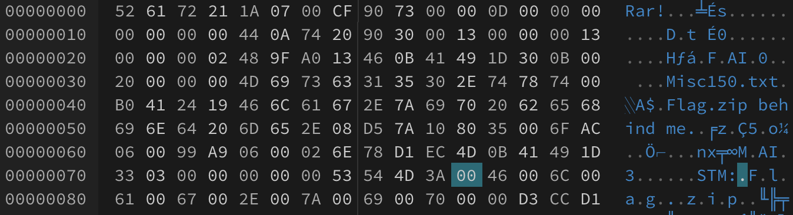

# 神奇的压缩文件

[题目地址](https://adworld.xctf.org.cn/challenges/details?hash=75a1dcaa-2ce3-44be-b5a3-43a2ce85362f_2)

没做出来，既缺工具也缺实力。就记录一下吧，新的知识点。

附件是一个rar。解压后有一个txt，里面只有一句话。

- Flag.zip behind me.

16进制打开，真的是字面意义上的behind。

确实有一个flag.zip，但是不知道为啥解压不出来。我尝试搜索了[rar格式](https://blog.csdn.net/Claming_D/article/details/105899397)，无果。没见过的知识点就不挣扎了。

wp说是NTFS流隐藏。

- [谈谈NTFS数据流文件](https://blog.csdn.net/vivilorne/article/details/3841509)
- [利用NTFS交换数据流隐藏文件](https://www.qingsword.com/qing/812.html)

建议看第二篇，第一篇是关于NTFS本身的介绍，关于隐藏的内容比较少。只需要知道NTFS流无法并命令行检测到，需要特殊的工具，比如AlternateStreamView等。我可没有，于是我去找了[第二种写法](https://blog.wujiaxing.cn/2019/09/25/e4a0a49e/)，里面并没有提到NTFS，直接用010Editor更改了一个选项就解压成功了。我尝试直接只用普通16进制编辑器对照上面的rar格式进行更改文件头，不行。010Editor的[枚举](https://github.com/jas502n/010-Editor-Template/blob/main/RAR.bt)里也没说每个值具体对应的是什么。行吧，跟着wp云写题。

得到flag.zip后开始扣题，解压了压缩包还是压缩包，且解压前后的文件hash没有变化，套娃套自己可还行。不过压缩包里有一些注释，注释本身没问题，是空白有问题，全选后发现每行的空白长度还不一样。复制下来发是空格和tab键，暗藏玄机，两种值那不就是二进制吗？tab为1，空格为0（不知道怎么判断出来的，可能是试出来的吧），把转换后的数据解码，就是flag了。云解题感觉我就是大佬(･･;)

- ### Flag
  > lctf{6d3677dd}