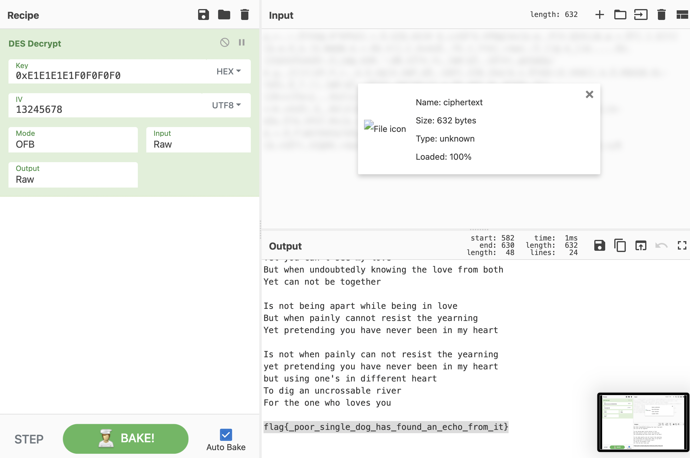

# easy_BlockCipher

[题目地址](https://adworld.xctf.org.cn/challenges/details?hash=b71d1d8b-e72c-4d96-bb06-ea047de66735_2)

这题做得我满头问号。

给了个附件。

```python
from Crypto.Cipher import DES

f = open('key.txt', 'r')
key_hex = f.readline()[:-1] # discard newline
f.close()
KEY = key_hex.decode("hex")
IV = '13245678'
a = DES.new(KEY, DES.MODE_OFB, IV)

f = open('plaintext', 'r')
plaintext = f.read()
f.close()

ciphertext = a.encrypt(plaintext)
f = open('ciphertext', 'w')
f.write(ciphertext)
f.close()
```

可以说是非常简单啊，同难度的题附件内容都复杂上天了，这题就这么点。但是简单也有简单的坏处，根本看不出来别的东西啊。整个脚本就是单纯des加密，iv已知key未知，ofb模式，除此之外就没什么骚操作了。看[wp](https://sm0ry.blog.csdn.net/article/details/123673445)，啊还能这样？

这题的解法需要脑洞。此题没有别的动作，说明未知的key不可能用任何方法恢复出来。但这题是有解的，说明我们必须以某种方法把key恢复出来。两个想法矛盾了，只能说明一点——key不需要任何方式恢复，可以直接被我们猜测到。说到猜测，爆破肯定是第一想法，但查询资料可知，des中存在弱密钥：

- 在 DES 的计算中，56bit 的密钥最终会被处理为 16 个轮密钥，每一个轮密钥用于 16 轮计算中的一轮，DES 弱密钥会使这 16 个轮密钥完全一致。

这4个弱密钥已知：

- 0x0000000000000000
<br>0xFFFFFFFFFFFFFFFF
<Br>0xE1E1E1E1F0F0F0F0
<br>0x1E1E1E1E0F0F0F0F

只有4个，不如把他们全部试一遍，不行再破解。cyberchef发现0xE1E1E1E1F0F0F0F0就是正确的key。



注意iv是13245678而不是12345678。之前看错了一直疑惑怎么没有。

- ### Flag
  > flag{_poor_single_dog_has_found_an_echo_from_it}