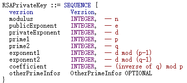

# equation-2

[题目地址](https://adworld.xctf.org.cn/challenges/details?hash=f03fa9a6-697c-47d4-a286-557b43754d6e_2)

完全看不懂writeup，什么玩意啊？

附件只有被加密的flag文件和一张图片。


是私钥，但是只有一部分。应该是openssl的，想要懂这道题就要了解私钥的格式。



每个部分以0241标签头分割。所以要把图片里的私钥拿下来base64解码后才能知道有哪些部分。这里是我第一个不懂的地方，有没有什么简单的办法把私钥拿下来？网上writeup都没有提及，难道直接抄下来？

- Os9mhOQRdqW2cwVrnNI72DLcAXpXUJ1HGwJBANWiJcDUGxZpnERxVw7s0913WXNtV4GqdxCzG0pG5EHThtoTRbyX0aqRP4U/hQ9tRoSoDmBn+3HPITsnbCy67VkCQBM4xZPTtUKM6Xi+16VTUnFVs9E4rqwIQCDAxn9UuVMBXlX2Cl0xOGUF4C5hItrX2woF7LVS5EizR63CyRcPovMCQQDVyNbcWD7N88MhZjujKuSrHJot7WcCaRmTGEIJ6TkU8NWt9BVjR4jVkZ2EqNd0KZWdQPukeynPcLlDEkIXyaQx

注意要转成hex，0241标签头在hex里。

- 3a cf 66 84 e4 11 76 a5 b6 73 05 6b 9c d2 3b d8 32 dc 01 7a 57 50 9d 47 1b <font color=red>02 41</font> 00 d5 a2 25 c0 d4 1b 16 69 9c 44 71 57 0e ec d3 dd 77 59 73 6d 57 81 aa 77 10 b3 1b 4a 46 e4 41 d3 86 da 13 45 bc 97 d1 aa 91 3f 85 3f 85 0f 6d 46 84 a8 0e 60 67 fb 71 cf 21 3b 27 6c 2c ba ed 59 <font color=red>02 40</font> 13 38 c5 93 d3 b5 42 8c e9 78 be d7 a5 53 52 71 55 b3 d1 38 ae ac 08 40 20 c0 c6 7f 54 b9 53 01 5e 55 f6 0a 5d 31 38 65 05 e0 2e 61 22 da d7 db 0a 05 ec b5 52 e4 48 b3 47 ad c2 c9 17 0f a2 f3 <font color=red>02 41</font> 00 d5 c8 d6 dc 58 3e cd f3 c3 21 66 3b a3 2a e4 ab 1c 9a 2d ed 67 02 69 19 93 18 42 09 e9 39 14 f0 d5 ad f4 15 63 47 88 d5 91 9d 84 a8 d7 74 29 95 9d 40 fb a4 7b 29 cf 70 b9 43 12 42 17 c9 a4 31

0241不算在内，第一个标签前面的应该不全，不考虑。中间有个0240，好像也可以作为分割。由此我们可以得到三段内容，对照上面的表分别是

- x1=d mod (p-1)
  > 00d5a225c0d41b16699c4471570eecd3dd7759736d5781aa7710b31b4a46e441d386da1345bc97d1aa913f853f850f6d4684a80e6067fb71cf213b276c2cbaed59
- x2=d mod (q-1)
  > 1338c593d3b5428ce978bed7a553527155b3d138aeac084020c0c67f54b953015e55f60a5d31386505e02e6122dad7db0a05ecb552e448b347adc2c9170fa2f3
- q的模逆元 mod p
  > 00d5c8d6dc583ecdf3c321663ba32ae4ab1c9a2ded6702691993184209e93914f0d5adf415634788d5919d84a8d77429959d40fba47b29cf70b943124217c9a431

然后就到我完全不理解的地方了。网上的writeup大部分都是这样解释怎么找到p，q和e的。

- d⋅e≡1 mod (p−1)(q−1)
<br>则有d⋅e≡1 mod (p−1)与d⋅e≡1 mod (q−1)
<br>x1⋅e≡1 mod (p−1) ，x2⋅e≡1 mod (q−1)
<br>(p-1)|(x1e-1)
<br>(q-1)|(x2e-1)
<br>记x1⋅e−1=r1⋅(p−1)；
<br>由于x1=d mod (p−1)，则x1<(p−1)；
<br>几乎可以看做x1⋅e=r1⋅(p−1)
<br>必有r1<e
<br>同理r2<e
<br>故e取65537

第一行是RSA关于d的定义：1 < d < (p-1)\*(q-1),e*d mod (p-1)(q-1) ＝ 1。第二行我就开始不理解了，我猜测可能是同余或者余数的某种性质，但是并没有搜到。第三行就更离谱了，完全不知道在干啥。第四和第五行的 ｜ 符号表示能整除，应该是对上面几行的总结。下面继续看就是些替换和证明，找到了e。那p和q呢？下面的脚本可以找到p和q。

```python
import gmpy2
from Crypto.Util.number import isPrime
from Crypto.PublicKey import RSA
x1="0xd5a225c0d41b16699c4471570eecd3dd7759736d5781aa7710b31b4a46e441d386da1345bc97d1aa913f853f850f6d4684a80e6067fb71cf213b276c2cbaed59"
x2="0x1338c593d3b5428ce978bed7a553527155b3d138aeac084020c0c67f54b953015e55f60a5d31386505e02e6122dad7db0a05ecb552e448b347adc2c9170fa2f3"
x3="0xd5c8d6dc583ecdf3c321663ba32ae4ab1c9a2ded6702691993184209e93914f0d5adf415634788d5919d84a8d77429959d40fba47b29cf70b943124217c9a431"
x1=int(x1,16)
x2=int(x2,16)
x3=int(x3,16)
def genKey(X1,X2):
    e=65537
    N1=X1*e-1
    N2=X2*e-1
    print(N1)
    for r in range(e):
        if N1%(e-r)==0:
            p=int(N1//(e-r)+1)
            if isPrime(p)==1:
                print("r1=",r)
                break
    for r in range(e):
        if N2%(e-r)==0:
            q=int(N2//(e-r)+1)
            if isPrime(q):
                print("r2=",r)
                break
    n=p*q
    phi=(p-1)*(q-1)
    d = int(gmpy2.invert(e, phi))
    privatekey = RSA.construct((n,e,d))
    with open("你要存储的私钥地址", "wb") as f:
        f.write(privatekey.export_key())
genKey(x1,x2)
```

代码我自己稍微改了一下，因为没有rsa库。最后还要用openssl帮忙解密。

- openssl pkeyutl -decrypt -in flag.enc -inkey private -out flag.txt

后面学好数学了我会补充的。天天说其实我自己心里也没有谱。

- ### Flag
  > 0ctf{Keep_ca1m_and_s01ve_the_RSA_Eeeequati0n!!!}