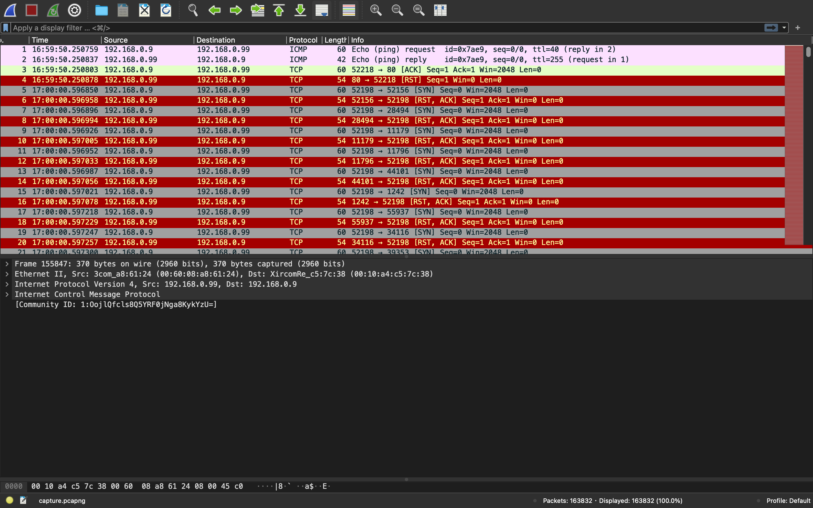

# 工控安全取证

[题目地址](https://adworld.xctf.org.cn/challenges/details?hash=c73dffad-7383-4cac-835c-e11652bdeca9_2)

没想出来到底为什么这道题分到Crypto。

附件解压是一个后缀名为log的文件。这种文件我第一次见，搜索得知流量日志可以直接改后缀名为pcapng，也就是wireshrak支持的格式，不会有任何问题。

163832个包多少是有点离谱了。题目要求“指出对方第4次发起扫描时的数据包的编号”，所以应该有什么特征区别了不同次数的扫描。我尝试过用端口号来区分，根本没用。不过最开始的icmp包倒是很特殊，过滤一下试试。

除去以153开头的那个包，其他的正好可以分成四层。但是第四层有不止一个包，内容也差不多，那就一个一个试吧。最后发现第155989个包是对的。也不知道为啥，看wirteup好像也没人知道。地址也不是最特殊的，难道就因为在最后？

- ### Flag
- > flag{155989}