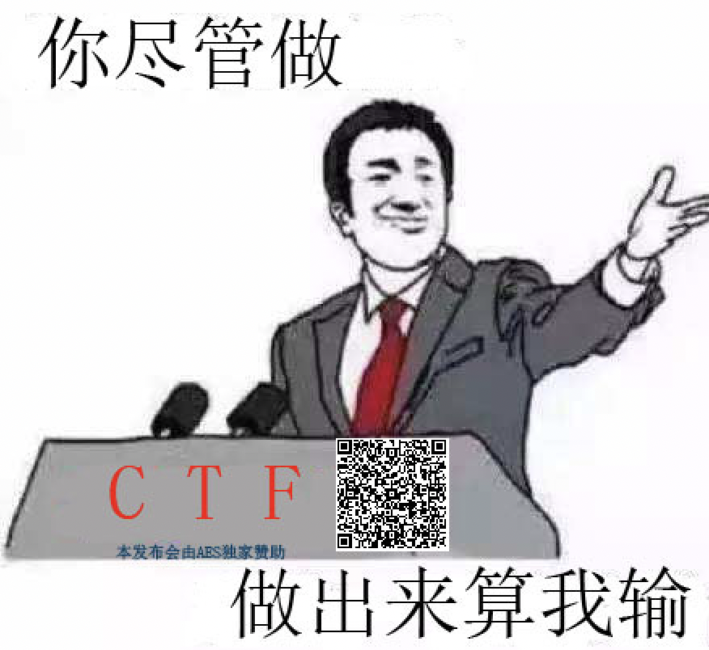
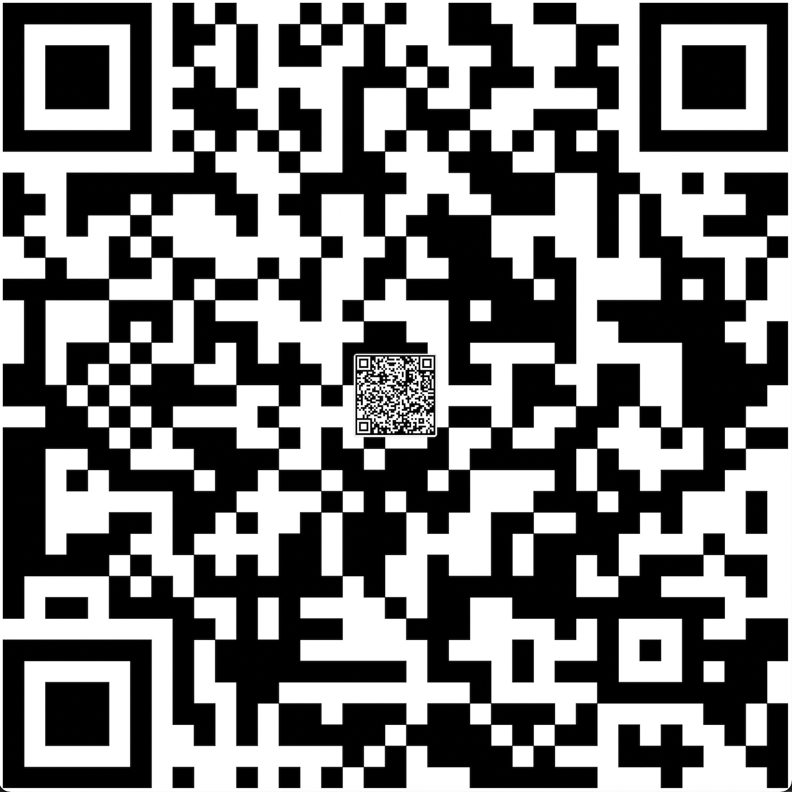

# 互相伤害!!!

[题目地址](https://adworld.xctf.org.cn/challenges/details?hash=a1480926-f70a-4618-9d39-133d42385d19_2&task_category_id=1)

misc说：“我到处都是提示你说你不知道怎么做？”

附件解压是pcapng。召唤wireshark。

全是tcp流，追踪发现传了很多图片。直接用wireshark自带的提取文件功能把tcp里传的图片全部拿出来。

然后你就成功得到了一堆图片！binwalk发现里面全部都有zip！鬼知道哪个是真的！换个思路，一个一个翻，发现其中一张图片有二维码。

misc钟爱二维码。如果直接用手机扫的话还要手抄下来，有点烦还容易错，于是我找了个[在线](https://qrcode-decoder.com/)的。成功出来一串看着像base64的玩意。

- U2FsdGVkX1+VpmdLwwhbyNU80MDlK+8t61sewce2qCVztitDMKpQ4fUl5nsAZOI7bE9uL8lW/KLfbs33aC1XXw==

但是解码后是乱码。这时候回过头看那张图，“本发布会由AES独家赞助播出”，莫非是AES？但是AES需要密码，难道那几个大字CTF就是密码？跑去另一个[网站](http://www.jsons.cn/aesencrypt/)试试。

- 668b13e0b0fc0944daf4c223b9831e49

还真是。但这个应该不是flag，题目描述说flag在flag{}里。然后就到了奇奇怪怪的提示时间。题目叫互相伤害，那一堆表情包里也正好有个跟互相伤害有关系的，同时其他的内容都是乱七八糟的。尝试提取那张图片的zip，解压发现要密码。说不定刚刚那个就是？输入进去提取成功，看来对了。

套娃？放大后截图那张小二维码，继续放到上面那个二维码网站解码，得到flag。

- ### Flag
  > 97d1-0867-2dc1-8926-144c-bc8a-4d4a-3758