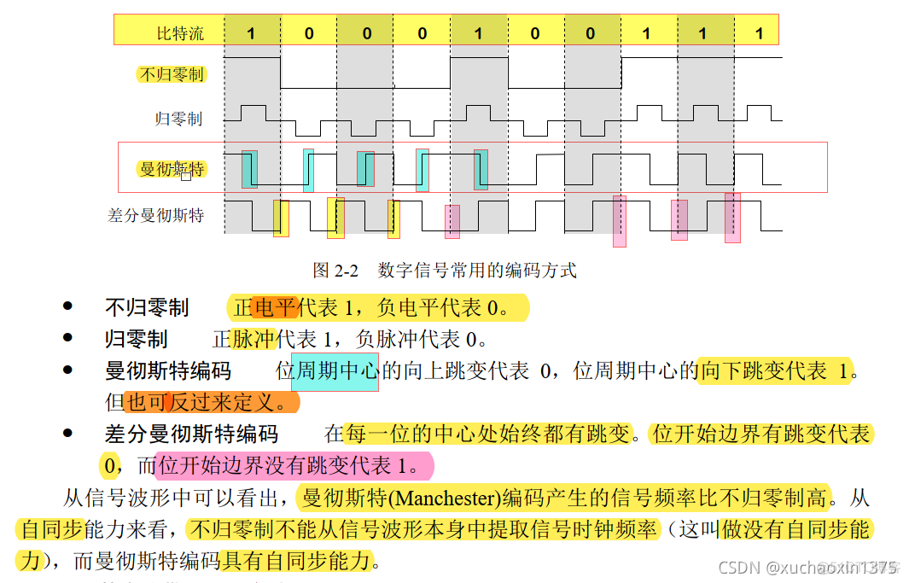

# 传感器1

[题目地址](https://adworld.xctf.org.cn/challenges/details?hash=d52b34da-9cfa-494d-8834-bfd7511f4e6a_2)

要接受我是脚本小子的事实。

题目描述超级直白，但我还是不懂它在说什么。还没开始就拉闸，wp呢？我的wp呢？

发现是差分曼彻斯特编码。这是个什么玩意？我搜到了一张比较好懂的图。谢谢这位CSDN博主。



冲浪啊，继续冲浪。冲浪撞到了一个大佬的脚本。

```python
import re 
def bintohex(s1):
    s2 = ''
    s1 = re.findall('.{4}',s1)
    print ('每一个hex分隔:',s1)
    for i in s1:
        s2 += str(hex(int(i,2))).replace('0x','')
    print ('ID:',s2)
def diffmqst(s):
    s1 = ''
    s = re.findall('.{2}',s)
    cc = '01'
    for i in s:
        if i == cc:
            s1 += '0'
        else:
            s1 += '1'
        cc = i  # 差分加上cc = i
    print ('差分曼切斯特解码:',s1)
    bintohex(s1)
def mqst(s):  #只能算曼切斯特编码,无法算差分
    mdict = {'5': '00', '6': '01', '9': '10', 'A': '11'}
    a1 = ''.join(mdict[i] for i in s)
    a2 = ''.join(mdict[i][::-1] for i in s)
    print ('曼切斯特解码:   ',a1 )
    print ('曼切斯特解码2:  ',a2)
    bintohex(a1)
    bintohex(a2)
hex1 = 'AAAAA56A69AA556A965A5999596AA95656'
bin1 = bin(int(hex1,16))[2:]
diffmqst(bin1)
mqst(hex1)
```

解码要去掉3E前缀。结果去掉左边5个右边4个即为传感器id。记得大写啊。

- ### Flag
  > flag{8845ABF3}