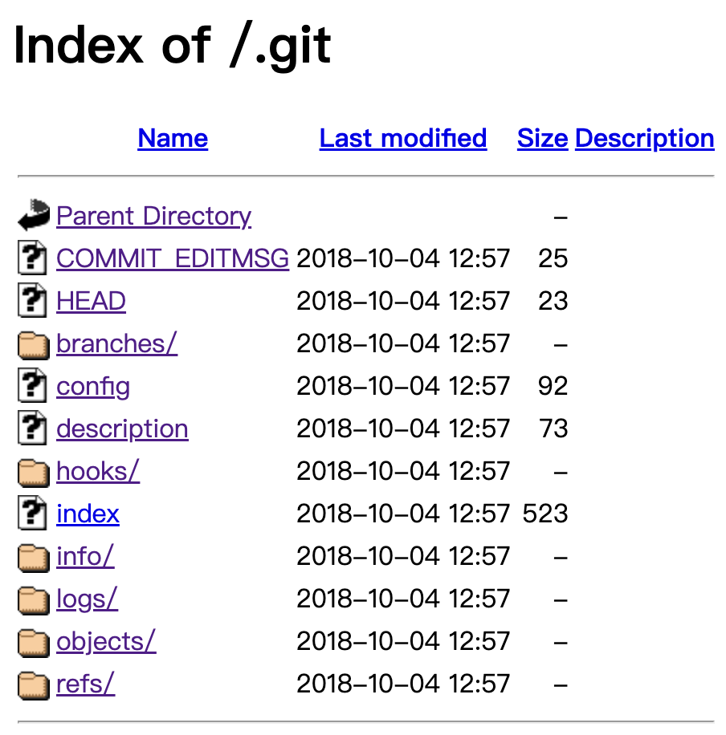

# mfw

[题目地址](https://adworld.xctf.org.cn/challenges/details?hash=52595c4f-b564-4c87-a2fa-390e2529b5b4_2)

喜闻乐见web环节，web总是在相同难度等级里解出人数最多的。


从about中可以得知使用了git和php这两个重要线索。看来又是跟php有关的漏洞挖掘，但是没有源码盲测很难。不过相信用GitHub的都知道在你使用git命令新建仓库时会在当前目录下创建一个.git文件夹，那么这里就试一下当前目录下有没有这么个东西。



确实有。那问题就出现了，我们是可以从git目录中还原出源码的。这里推荐一个git还原源码的工具：[GitHack](https://github.com/lijiejie/GitHack)。配置也很简单，如果不想克隆整个库的话也可以只下载GitHack.py和lib文件夹下的parser.py，就可以运行了。不过记得把GitHack.py里的from lib.parser import parse改成from parser import parse

- python3 GitHack.py http://61.147.171.105:65407/.git/ \[此处更改成你的.git文件夹地址]

这行命令就可以在当前目录下生成包含还原的源码的文件夹了。发现了一个index.php，看看是啥。

```php
<?php

if (isset($_GET['page'])) {
	$page = $_GET['page'];
} else {
	$page = "home";
}

$file = "templates/" . $page . ".php";

// I heard '..' is dangerous!
assert("strpos('$file', '..') === false") or die("Detected hacking attempt!");

// TODO: Make this look nice
assert("file_exists('$file')") or die("That file doesn't exist!");
```

只截取了一小部分，剩下的全是html了。可以发现页面的更改由get的page参数决定，而所有可能的page都在tempaltes文件夹下。查看templates文件夹可以发现有一个flag.php，只可惜里面空空如也。不过可以推测真正的flag在服务器的templates文件夹下，现在要找个办法让服务器帮我们读flag。

说到“让服务器帮忙执行”，最常见的做法就是执行系统命令。这也没有eval这类函数，还有哪里跟执行命令有关系呢？die肯定不行，难道assert有问题？

- ### assert
- > 检查一个断言是否为 false。assert() 会检查指定的 assertion 并在结果为 false 时采取适当的行动。
- 语法（PHP5）
- > assert(mixed $assertion, string $description = ?): bool

目前还没有啥问题，但是assert有一个特性：

- 如果 assertion 是字符串，它将会被 assert() 当做 PHP 代码来执行

熟悉的“当做 PHP 代码来执行”。这里肯定有问题，现在就是构建payload了。先解读上方的用法

```php
assert("strpos('$file', '..') === false") or die("Detected hacking attempt!");
```

assertion字符串为"strpos('$file', '..') === false"，如果这个表达式为false就会执行后面的die。

- ### strpos
- > 查找字符串在另一字符串中第一次出现的位置（区分大小写）,如果没有找到字符串则返回 FALSE。
- 语法
- > strpos(string,find,start)
- 参数
- > string	必需。规定被搜索的字符串。
- > find	必需。规定要查找的字符。
- > start	可选。规定开始搜索的位置。

所以这里的代码逻辑是过滤传入的参数，不能包含“.."。大家应该对sql注入有所耳闻，这种情况和sql注入很相似，$file可以由我们随意控制，由于assertion是字符串所以必定可以被闭合。那我们只要想办法闭合再拼接上system就行了。

- /?page='.system('cat+./templates/flag.php').'

第一个'闭合strpos第一个参数的第一个引号，.号拼接字符串system("cat+./templates/flag.php")，第二个.号闭合strpos第一个参数的第二个引号。所以assert里就变成了:

```php
assert("strpos(''.system('cat+./templates/flag.php').'', '..') === false") or die("Detected hacking attempt!");
```

这个payload让system('cat+./templates/flag.php')被包含在assert的字符串但却不在strpos的字符串里，故能顺利执行。

- ### Flag
- > cyberpeace{02cab9467a85b6f7f7623a210720ed33}