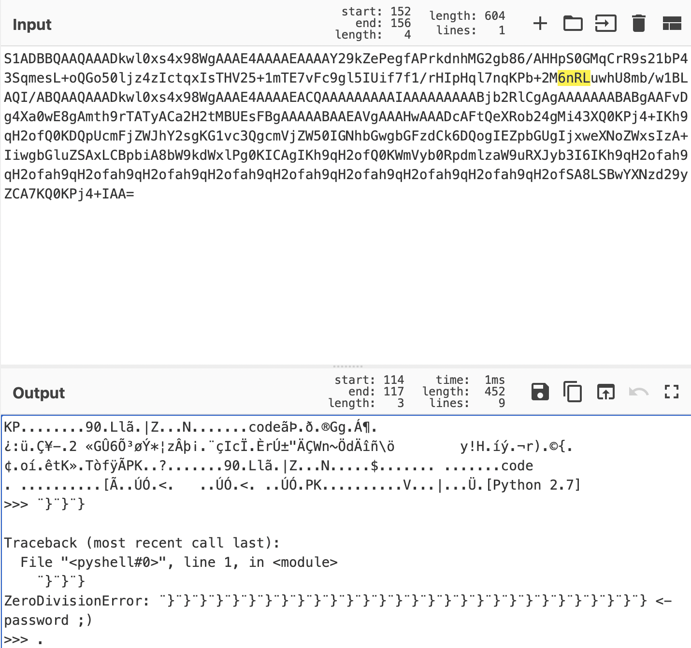

# picture2

[题目地址](https://adworld.xctf.org.cn/challenges/details?hash=531f0e73-5b3d-400c-9f6a-3a473ee97b99_2)

已经不认识菜这个字了。

附件是张png图片。但zsteg发现文件头不对，果断改成jpg。stegsolve里看了看各个通道及lsb，也没有，只发现了一些比较奇怪的黑点，也没办法拼成二维码。

有没有发现我漏做了哪个步骤？我之后还去用了outguess，结果不尽人意。走吧看wp去吧。看了发现binwalk可以提取。我其实看了，但是发现里面只有jpg和zlib，而之前zlib一般是没有东西的，我就没有-e提取……又菜运气还不好。

binwalk提取出了一串base64。

- S1ADBBQAAQAAADkwl0xs4x98WgAAAE4AAAAEAAAAY29kZePegfAPrkdnhMG2gb86/AHHpS0GMqCrR9s21bP43SqmesL+oQGo50ljz4zIctqxIsTHV25+1mTE7vFc9gl5IUif7f1/rHIpHql7nqKPb+2M6nRLuwhU8mb/w1BLAQI/ABQAAQAAADkwl0xs4x98WgAAAE4AAAAEACQAAAAAAAAAIAAAAAAAAABjb2RlCgAgAAAAAAABABgAAFvDg4Xa0wE8gAmth9rTATyACa2H2tMBUEsFBgAAAAABAAEAVgAAAHwAAADcAFtQeXRob24gMi43XQ0KPj4+IKh9qH2ofQ0KDQpUcmFjZWJhY2sgKG1vc3QgcmVjZW50IGNhbGwgbGFzdCk6DQogIEZpbGUgIjxweXNoZWxsIzA+IiwgbGluZSAxLCBpbiA8bW9kdWxlPg0KICAgIKh9qH2ofQ0KWmVyb0RpdmlzaW9uRXJyb3I6IKh9qH2ofah9qH2ofah9qH2ofah9qH2ofah9qH2ofah9qH2ofah9qH2ofah9qH2ofah9qH2ofah9qH2ofSA8LSBwYXNzd29yZCA7KQ0KPj4+IAA=

解码后发现了熟悉的pk……不对是kp前缀。



pk是zip，kp是啥？不管了，写成zip文件试试。

```python
from base64 import b64decode
data='S1ADBBQAAQAAADkwl0xs4x98WgAAAE4AAAAEAAAAY29kZePegfAPrkdnhMG2gb86/AHHpS0GMqCrR9s21bP43SqmesL+oQGo50ljz4zIctqxIsTHV25+1mTE7vFc9gl5IUif7f1/rHIpHql7nqKPb+2M6nRLuwhU8mb/w1BLAQI/ABQAAQAAADkwl0xs4x98WgAAAE4AAAAEACQAAAAAAAAAIAAAAAAAAABjb2RlCgAgAAAAAAABABgAAFvDg4Xa0wE8gAmth9rTATyACa2H2tMBUEsFBgAAAAABAAEAVgAAAHwAAADcAFtQeXRob24gMi43XQ0KPj4+IKh9qH2ofQ0KDQpUcmFjZWJhY2sgKG1vc3QgcmVjZW50IGNhbGwgbGFzdCk6DQogIEZpbGUgIjxweXNoZWxsIzA+IiwgbGluZSAxLCBpbiA8bW9kdWxlPg0KICAgIKh9qH2ofQ0KWmVyb0RpdmlzaW9uRXJyb3I6IKh9qH2ofah9qH2ofah9qH2ofah9qH2ofah9qH2ofah9qH2ofah9qH2ofah9qH2ofah9qH2ofah9qH2ofSA8LSBwYXNzd29yZCA7KQ0KPj4+IAA='
data=b64decode(data)
with open("ctf.zip",'wb') as f:
	f.write(data)
```

16进制打开发现跟zip文件的文件头504B0304就差了一点，除去python报错那段文件尾504B也符合。那把文件头改成zip形式试试。

现在可以解压了，但是要密码。上面python的报错有提示，我看着cyberchef的解码还以为密码是那一串}。事实证明我太天真了，密码是python里面整数除以0的报错提示（比如1//0，1/0不行）—— integer division or modulo by zero

结果我解压后就直接flag了，没有像网上那样还要用uuencode解码。

- ### Flag
  > CISCN{2388AF2893EB85EB1B439ABFF617319F}