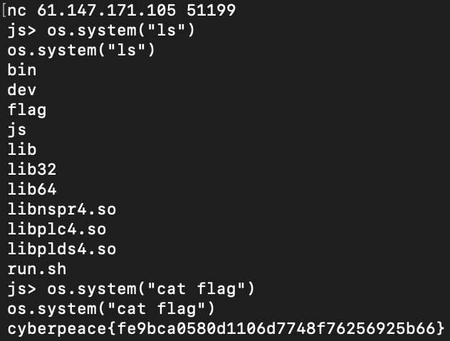

# monkey

[题目地址](https://adworld.xctf.org.cn/challenges/details?hash=05997c58-7d35-4f77-bff3-595c77563c02_2)

这题震惊我一整年。

这次的附件非常诡异，有很多之前没见过的so文件。我习惯先反编译然后再checksec查看下一步，结果反编译这一步让我感觉到事情不对劲。

ghidra疯狂编译，我的电脑温度也持续上升。好不容易反编译完了，我发现有几十万条？？？尝试找main，找是找到了但是这真的是人能逆向的程度吗？在自己的shell中运行发现功能跟其他见过的题比完善了不知道多少.

- js> adssf
 typein:1:1 ReferenceError: adssf is not defined
 Stack:
   @typein:1:1
 js> ?
 typein:2:0 SyntaxError: expected expression, got '?':
 typein:2:0 ?
 typein:2:0 ^
 js> print("test");
 test
 js> 

真的能执行命令我是没想到的，还有语法纠正。我尝试栈溢出，打了1000个字符都没用最后放弃。直接懵逼了。后来查阅才发现这是个命令行程序。

- jsshell，JavaScript shell
    > 是一个命令行程序，它被包含在SpiderMonkey源代码中。它在JavaScript中类似于Python的交互式提示符（即Python的命令行工具）
    - help([command ...]) \\\显示有关指定命令的简要帮助信息，或关于所有可用功能（如果没有指定）
    - dumpHeap([fileName[, start[, toFind[, maxDepth[, toIgnore]]]]]) \\\将所有现有对象（或特定的有趣子图）的图转储到文件中。 有关更多信息，请参阅此函数的C / C ++版本JS_DumpHeap。

我第一次遇见这种pwn，直接给你个shell可还行，我还以为要我pwn这个程序本身。我就说这怎么可能出现在ctf里。官方wp中发现可以打help，打下试试。

东西有点多，不过我们的目标是看远程机上的flag，那就只有用system相关命令了。搜一下有没有。

- os - interface object
  > os.getenv os.getpid os.system os.spawn os.kill os.waitpid os.file os.path

没有写作用，猜测os.system可以执行系统命令，毕竟大部分都是这样。直接连远程。

我去真的可以，继续震惊一整年。

- ### Flag
  > cyberpeace{fe9bca0580d1106d7748f76256925b66}