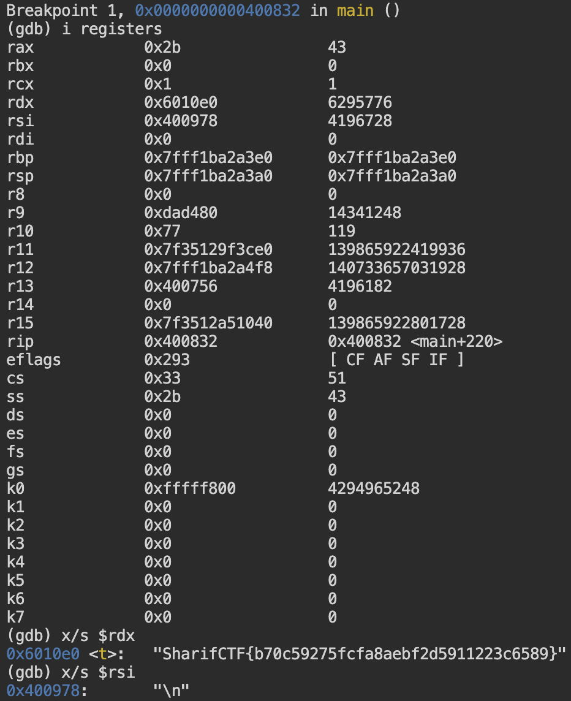

# getit

[题目地址](https://adworld.xctf.org.cn/challenges/details?hash=84657b0c-e01c-4426-b1a1-a5d1d630146b_2)

动态调试是个好东西。

运行一下附件，什么都没有发生。直接上ghidra，main函数如下。

```c
undefined8 main(void)
{
  char cVar1;
  size_t sVar2;
  FILE *__stream;
  long in_FS_OFFSET;
  uint local_48;
  int local_44;
  undefined8 local_38;
  undefined4 local_30;
  undefined2 local_2c;
  long canary;
  
  canary = *(long *)(in_FS_OFFSET + 0x28);
  local_48 = 0;
  while( true ) {
    sVar2 = strlen(s);
    if (sVar2 <= (ulong)(long)(int)local_48) break;
    if ((local_48 & 1) == 0) {
      cVar1 = -1;
    }
    else {
      cVar1 = 1;
    }
    t[(int)(local_48 + 10)] = cVar1 + s[(int)local_48];
    local_48 = local_48 + 1;
  }
  local_38 = 0x616c662f706d742f;
  local_30 = 0x78742e67;
  local_2c = 0x74;
  __stream = fopen((char *)&local_38,"w");
  fprintf(__stream,"%s\n",u);
  local_44 = 0;
  while( true ) {
    sVar2 = strlen(t);
    if (sVar2 <= (ulong)(long)local_44) break;
    fseek(__stream,(long)*(int *)(p + (long)local_44 * 4),0);
    fputc((int)t[*(int *)(p + (long)local_44 * 4)],__stream);
    fseek(__stream,0,0);
    fprintf(__stream,"%s\n",u);
    local_44 = local_44 + 1;
  }
  fclose(__stream);
  remove((char *)&local_38);
  if (canary != *(long *)(in_FS_OFFSET + 0x28)) {
                    /* WARNING: Subroutine does not return */
    __stack_chk_fail();
  }
  return 0;
}
```

不是很懂c语言对文件的操作，所以上网搜了一下。

- ### fprintf
  - 发送格式化输出到流 stream 中
  - 声明：int fprintf(FILE *stream, const char *format, ...)
  - 参数
    - > stream -- 这是指向 FILE 对象的指针，该 FILE 对象标识了流。
    - > format -- 这是 C 字符串，包含了要被写入到流 stream 中的文本。它可以包含嵌入的 format 标签，format 标签可被随后的附加参数中指定的值替换，并按需求进行格式化。format 标签属性是 %\[flags][width][.precision][length]specifier

- ### fopen
  - 使用给定的模式 mode 打开 filename 所指向的文件。
  - 声明：FILE *fopen(const char *filename, const char *mode)
  - 参数
      - > filename -- 字符串，表示要打开的文件名称。
      - > mode -- 字符串，表示文件的访问模式，可以是以下内容中的值：  
  - 模式
      - > "r" :打开一个用于读取的文件。该文件必须存在。
<br>"w"	:创建一个用于写入的空文件。如果文件名称与已存在的文件相同，则会删除已有文件的内容，文件被视为一个新的空文件。
<br>"a"	:追加到一个文件。写操作向文件末尾追加数据。如果文件不存在，则创建文件。
<br>"r+" :打开一个用于更新的文件，可读取也可写入。该文件必须存在。
<br>"w+" :创建一个用于读写的空文件。
<br>"a+" :打开一个用于读取和追加的文件。

- ### fseek
  - 设置流 stream 的文件位置为给定的偏移 offset，参数 offset 意味着从给定的 whence 位置查找的字节数。
  - 声明：int fseek(FILE *stream, long int offset, int whence)
  - 参数
    - > stream -- 这是指向 FILE 对象的指针，该 FILE 对象标识了流。
    - > offset -- 这是相对 whence 的偏移量，以字节为单位。
    - > whence -- 这是表示开始添加偏移 offset 的位置。它一般指定为下列常量之一：
  - 常量
    - > SEEK_SET:文件的开头
<br>SEEK_CUR:文件指针的当前位置
<br>SEEK_END:文件的末尾 

- ### fclose
  - 关闭流 stream。刷新所有的缓冲区。
  - 声明：int fclose(FILE *stream)
  - 参数：
    - > stream -- 这是指向 FILE 对象的指针，该 FILE 对象指定了要被关闭的流。

- ### remove
  - 删除给定的文件名 filename，以便它不再被访问。
  - 声明：int remove(const char *filename)
  - 参数：
    - > filename -- 这是 C 字符串，包含了要被删除的文件名称。

- ### fputc
  - 把参数 char 指定的字符（一个无符号字符）写入到指定的流 stream 中，并把位置标识符往前移动。
  - 声明：int fputc(int char, FILE *stream)
  - 参数：
    - > char -- 这是要被写入的字符。该字符以其对应的 int 值进行传递。
    - > stream -- 这是指向 FILE 对象的指针，该 FILE 对象标识了要被写入字符的流。

明白了这些函数，那main里面的逻辑就很清楚了。可以看到最后调用了remove，把刚刚写入的文件又删除了，自然什么都没有。分析一下写入文件的逻辑。

```c
sVar2 = strlen(t);
if (sVar2 <= (ulong)(long)local_44) break;
```

相当于写入t长度的内容。

```c
fseek(__stream,(long)*(int *)(p + (long)local_44 * 4),0);
fputc((int)t[*(int *)(p + (long)local_44 * 4)],__stream);
fseek(__stream,0,0);
fprintf(__stream,"%s\n",u);
local_44 = local_44 + 1;
```

fseek找到 p + (long)local_44 * 4 所对应的offset,接下来再此处放上一个字符。注意这个字符来自t。第二个fseek又把偏移设置回文件开头，写入一个字符串u。因为是w模式，所以无论前面做了什么都会被u字符串覆盖。u字符串的内容为*******************************************，显然没用。现在问题来了，我们要逆向哪里？

刚刚的代码仅仅是文件操作，以某种方式写入t，t很可能是flag。而上面一个while循环改变了t值。

```c
  while( true ) {
    sVar2 = strlen(s);
    if (sVar2 <= (ulong)(long)(int)local_48) break;
    if ((local_48 & 1) == 0) {
      cVar1 = -1;
    }
    else {
      cVar1 = 1;
    }
    t[(int)(local_48 + 10)] = cVar1 + s[(int)local_48];
    local_48 = local_48 + 1;
  }
```

正确的操作应该是针对这里进行逆向，或者偷个懒，既然第二个while循环在写入t，而t又是flag，那我直接在第二个while循环开始设个断点，直接看t不就行了吗？把断点设在sVar2 = strlen(t); ,由于是64位所以这个t必定在参数寄存器中。gdb中运行并使用 i registers查看全部的寄存器值。



当参数少于7个时，参数从左到右放入寄存器: rdi, rsi, rdx, rcx, r8, r9。x/s查看指定地址中的字符串。flag就在rdx里。

- ### Flag
  - > SharifCTF{b70c59275fcfa8aebf2d5911223c6589}"
