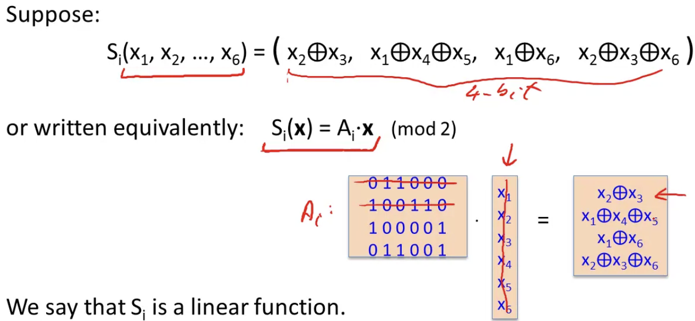

# Cryptography I

看到有人推荐这个课程我就来了： https://www.coursera.org/learn/crypto 。那么按照我的传统，自然是要写个笔记

## Discrete Probability (Crash Course)

这里教授只是稍微讲一下基础，更详细的内容参考 https://en.wikibooks.org/wiki/High_School_Mathematics_Extensions/Discrete_Probability

离散概率（Discrete Probability）通常定义于一个universe（不太懂怎么翻译），记做U。这里通常为有限集合，例如 $U=\{0,1\}^2=\{00,01,10,11\}$

U上的概率分布（probability distribution）定义为U上函数P，给universe中的每个元素赋值一个0到1之间的数字，这个数字称为该元素的权重（weight）或概率。函数P的唯一限制为 $\Sigma_{x\in U}P(x)=1$

例子：
1. 均匀分布(uniform distribution): $\forall x\in U,P(x)=\frac{1}{|U|},|U|$ 表示U中元素的的数量，或者说U的大小
2. $x_0$ 点处的点分布（point distribution）： $P(x_0)=1,\forall x\not ={x_0},P(x)=0$

因为U是个有限集合，所以可以将集合中所有元素的权重放到一个向量里，称为分布向量（distribution vector）： $(P(x_0),P(x_1),...,P(x_n))$

考虑子集（subset） $A\subseteq U$ ,定义A的权重为A中所有元素权重之和： $Pr[A]=\Sigma_{x\in A}P(x)\in[0,1]$ 。自然Pr[U]=1. 这个子集A叫做事件（event），Pr[A]称为该事件的概率

The union bound: 对于U中两个事件 $A_1$ 和 $A_2$ ，有 $Pr[A_1\cup A_2]\leq Pr[A_1]+Pr[A_2]$ 。当两个事件的并集为空集时，等号成立

随机变量（Random Variables）：一个随机变量X定义为函数 $X:U\rightarrow V$ 。该函数从universe映射到集合V，V是随机变量取值的地方。例如 $X:\{0,1\}^n\rightarrow\{0,1\}$ ，随机变量可能的值为0或1

均匀随机变量（uniform random variable）:定义U为某个有限集合，记 $r\leftarrow^R U$ 为U上的一个均匀随机变量。 $\forall a\in U,Pr[r=a]=\frac{1}{|U|}$ 。正式地说，r为恒等函数（identity function）， $r(x)=a,\forall x\in U$

随机算法(randomized algorithm):确定算法（deterministic algorithm）定义为 $y\leftarrow A(m)$ ，也就是一个输入永远映射到一个输出。而随机算法的定义则是 $y\leftarrow A(m;r)$ ，其中 $r\leftarrow^R\{0,1\}^n$ ，每次算法运行时都会重新采样。因此每次运行函数时，即使输入相同，也会因为不同的r得到不同的输出

独立性（independence）：如果Pr[A and B]=Pr[A]\*Pr[B]，则称事件A和B是独立的。两个随机变量X，Y在集合V中取值。若 $\forall a,b\in V$ ,Pr[X=a and Y=b]=Pr[X=a]\*Pr[Y=b]，则两者是独立的

异或两个 $\{0,1\}^n$ 中的字符串等同于两者按位相加再模2。异或有个非常重要的性质：假设Y是一个 $\{0,1\}^n$ 上的随机变量，X为 $\{0,1\}^n$ 上独立的均匀随机变量。那么 $Z=Y\bigoplus X$ 是一个 $\{0,1\}^n$ 上的均匀随机变量

生日悖论（birthday paradox）：让 $r_1,...,r_n\in U$ 均为独立同分布随机变量（independent identically distributed random variable）。那么当 $n=1.2\times|U|^{\frac{1}{2}}$ 时， $Pr[\exists i\not ={j}:r_i=r_j]\geq\frac{1}{2}$ 。简单来说就是某个大小为m的集合中元素全部独立同分布，那么当采样 $1.2\times|U|^{\frac{1}{2}}$ 个随机变量后，采样的变量里重复的可能性超过一半

## The one-time pad and stream ciphers

perfect secrecy：这里正式定义有点繁琐，简述就是，给定任意一个密文c，攻击者无法判断到底是加密 $m_i$ 还是加密 $m_j$ 得到的。one-time pad（OTP）就具有perfect secrecy。有意思的地方在于，只有当key的长度大于等于明文的长度时，该密码才有可能具有perfect secrecy。稍微提一嘴，做课后练习的时候遇见个题，整个明文/密文/密钥空间只有256，但是仍然可以为perfect secrecy。perfect secrecy只和能不能分辨出来到底是哪个明文加密出来的有关，和容不容易破解无关

这里提到了glibc的随机数生成器random函数也是可以预测的，因为其定义为 $r[i]\leftarrow(r[i-3]+r[i-31])\mod 2^{32}$ ，输出r[i]>>1。只是一些简单的线性运算，很容易预测

negligible以及non negligible：实际应用中，假设 $\epsilon$ 是一个常数，那么:
- $\epsilon$ non negligible： $\epsilon\geq\frac{1}{2^{30}}$
- $\epsilon$ negligible： $\epsilon\leq\frac{1}{2^{80}}$

理论上，假设 $\epsilon$ 是一个函数： $\epsilon:Z^{\geq 0}\rightarrow R^{\geq 0}$ ，则：
- $\epsilon$ non negligible： $\exists d:\epsilon(\lambda)\geq\frac{1}{\lambda^d}$ (对于大部分 $\lambda$ , $\epsilon\geq \frac{1}{poly}$ )
- $\epsilon$ negligible：  $\forall d,\lambda\geq\lambda_d: \epsilon(\lambda)\leq\frac{1}{\lambda^d}$ (对于较大的 $\lambda$ , $\epsilon\leq \frac{1}{poly}$ )

OTP has no integrity(OTP is malleable):指攻击者可以通过修改密文从而解码出与真正的明文不同却又有效的其他内容

## Real-World Stream Ciphers

RC4的弱点：
1. 最开始的256个字节输出为`\x00`的概率为 $\frac{2}{256}$ ，正常情况下应该为 $\frac{1}{256}$
2. 对于一段较长的RC4密文，`\x00\x00`出现的概率为 $\frac{1}{256^2}+\frac{1}{256^3}$ 。可以利用这点将RC4与其他PRG区分开来
3. 有密钥相关攻击

以及现代比较安全的流密码：Salsa20/12以及Sosemanuk。假如在CTF看到它们就不要想着去攻击密码实现本身了

## PRG Security Definitions

$G:K\rightarrow\{0,1\}^n$ 为一个PRG，A为一个 $\{0,1\}^n$ 上的统计测试（statistic test，简述就是一个函数，根据某个定义的规则返回1或0）。定义该PRG的advantage为 $Adv_{PRG}[A,G]=|Pr_{k\leftarrow^RK}[A(G(k))=1]-Pr_{r\leftarrow^R\{0,1\}^n}[A(r)=1]|\in[0,1]$ 。Adv越接近1，说明测试A可区分G与真正的随机；Adv越接近0则与之相反

安全的PRG的定义为，对于所有有效的统计测试A， $Adv_{PRG}[A,G]$ negligible。也可以将上面的定义换成 $\{0,1\}^n$ 上两个分布 $P_1,P_2$ ，若对于所有有效的统计测试 $|Pr_{x\leftarrow P_1}[A(x)=1]-Pr_{x\leftarrow P_2}[A(x)=1]|$ < negligible，则称 $P_1$ 和 $P_2$ computationally indistinguishable，记做 $P_1\approx_p P_2$ 。用这个定义可以轻松定义PRG的安全性： $\{k\leftarrow^R K:G(k)\}\approx_p$ uniform( $\{0,1\}^n$ )

关于PRG的安全性有两个相关定义，可预测性（predictable）和安全性（secure）。可预测性 $\Leftrightarrow$ 安全性。比如这样一个PRG，给定后半部分的bit，可以计算前半部分的bit。很容易看出这个PRG是不安全的，就算实际生活中搭建不出来这样的预测器，我们也能知道这样的预测器必定存在。因此它也是可预测的

## Semantic Security

Semantic Security(one-time key)：加密方法视为semantically secure，如果对于所有有效的adversary A， $Adv_{SS}[A,E]$ negligible。这里的Adversary有两个， $A_0$ 和 $A_1$ ,两者为同一个函数，输出0或1（所以就是同一个函数跑两次）。对于一组明文 $m_0,m_1$ 及其对应的密文 $c_0,c_1$，给 $A_0$ $c_0$ ,给 $A_1$ $c_1$ 。 $A_0$ 和 $A_1$ 需要各自根据获得密文输出结果。如果两者输出相同，说明两个A无法分辨不同的密文；反之则是可以。也可以说对于每组 $m_0,m_1\in M$ ，有{ $E(k,m_0)$ } $\approx_p$ { $E(k,m_1)$ }

## What are Block Ciphers?

伪随机函数(pseudo random function(PRF)):函数 $F:K\times X\rightarrow Y$ 定义在(K,X,Y)(key space,input space,output space)上，输入K中和X中一个元素，输出Y中的一个元素。需要保证存在某个高效的算法评估该函数（即能够快速输出，过程无需可逆）

伪随机排列（pseudo random permutation(PRP)）: 函数 $E:K\times X\rightarrow X$ 定义在(K,X)（key space，任意集合X）上，需满足：
1. 存在某个高效的算法评估E(k,x)
2. E(k,\*)为单射（one-to-one）
3. 存在某个高效的逆函数D(k,y)

PRP和块密码（block cipher）的定义句法上一致，因此后续课程教授会将两者混合使用。常见的PRP：3DES，AES... PRP同时也是PRF，只不过多加个X=Y且可逆的条件

安全的PRF定义：让 $F:K\times X\rightarrow Y$ 为一个PRF。构造两个集合：
1. Funcs[X,Y]: 从X到Y所有函数的集合
2. $S_F$ = { $F(k,\*),k\in K$ } $\subseteq$ Funcs[X,Y]。这里指随机从K选出一个k，固定该值并与全部可能x值组合，所形成的全部（固定k）的函数集合

该PRF是安全的，若一个Funcs[X,Y]中的随机函数无法与 $S_F$ 中的随机函数区分

通俗点说，假设有个人随机从X里选了一个x，然后把这个x放到一个机器里。机器里有两个函数，一个是来自Funcs[X,Y]的f(x)，一个是随机从K选择一个k后 $S_F$ 中对应这个k的函数。两者分别将x输入，给出输出。机器随机返回两个输出中的一个。要是那个人分辨不出来这是f(x)还是另外一个函数的输出，这个PRF就是安全的

PRP的安全定义与这个差不多，只不过从选随机函数变成了在集合X中选随机组合。只要那个人分辨不出来，该PRP就是安全的

PRF可以转换为PRG。让 $F:K\times$ { $0,1$ } $^n\rightarrow$ { $0,1$ } $^n$ 为一个安全的PRF。则 $G:K\rightarrow$ { $0,1$ } $^{nt}$ 是一个安全的PRG(t为用户参数)。可以这么构造:G(k)=F(k,0)||F(k,1)||...||F(k,t)

## The Data Encryption Standard

若 $f:K\times$ { $0,1$ } $^n\rightarrow$ { $0,1$ } $^n$ 是一个安全的PRF，那么使用f作为轮函数的3轮[feistel network](https://en.wikipedia.org/wiki/Feistel_cipher)（它还有个名字：Luby–Rackoff block ciphers） $F:K^3\times$ { $0,1$ } $^{2n}\rightarrow$ { $0,1$ } $^{2n}$ 是一个安全的PRP

查看feistel network的构造，每一轮交换R和L时都会调用轮函数 $f(k_i,R_i)$ 。因此只要保证f是安全的PRF且每次使用的 $k_i$ 互相独立没有任何关系，那么3轮的network足以构造出一个安全的PRP

教授在讲DES的时候提到了一个DES的错误S盒选择。DES和AES一样，都有个S盒用来替换（不过DES是6 bit替换4 bit）。但是为什么不直接异或而是要替换呢？答案是，要是直接异或的话，整个过程就是完全线性的了。之前说过异或在模2下就是加法，整个S盒替换就变成了矩阵乘法：



如果不来S盒替换破坏这种线性，那DES密码完全就是线性的了。简单的线性代数就能由密码恢复明文

## Exhaustive Search Attacks

DES可以通过爆破密钥的方式破解，所以人们想出了3-DES：用3个key将des用三次： $E(k_1,D(k_2,E(k_3,m)))$ 。很明显，用三次的后果就是比正常des慢三倍。那为啥不用2DES？两次加密只慢两倍，而且密钥也无法爆破。主要是因为 $E(k_1,E(k_2,m))$ 可以写成 $E(k_2,m)=D(k_1,c)$ 。每当发现这种两个变量在方程两边的式子时，说明这俩玩意就不独立了，通常存在meet-in-the-middle攻击

针对2DES的meet-in-the-middle攻击简述如下：
1. 构造一个表，表中为全部 $2^{56}$ 个key以及其对应的 $E(k_i,m)$
2. 然后用全部 $2^{56}$ 个key计算 $D(k_i,c)$ 。满足 $D(k_j,c)$ 结果等于 $E(k_i,m)$ 的一组 $(k_i,k_j)$ 就是要找的两个key

## More Attacks on Block Ciphers

Linear and differential attack:给出非常多的明文/密文对，在小于 $2^{256}$ 的时间复杂度里恢复key。假设c=DES(k,m)，对于随机的k和m，有 $Pr[m[i_1]\bigoplus...\bigoplus m[i_r]\bigoplus c[j_j]\bigoplus...\bigoplus c[j_v]=k[l_1]\bigoplus... k[l_u]]=\frac{1}{2}+\epsilon$ (对于DES， $\epsilon\approx 0.0000000477$ )。可以利用这个方程来找出某些key bits。假设给出 $\frac{1}{\epsilon^2}$ 个随机(m,c=DES(k,m))明文/密文对，有很大的概率 $k[l_1,...,l_u]=MAJ[m[i_1,...,i_r]\bigoplus c[j_j,...,j_v]]$ （MAJ表示集合中的众数，这个众数很有可能就是全部key bits的异或结果）。通常来说能靠这样恢复14 bits，剩下的42 bits需要爆破

## Block Ciphers From PRGs

可以从PRG搭建出一个PRF。让 $G:K\rightarrow K^2$ 为一个安全的PRG，定义一个1 bit的PRF： $F:K\times$ { $0,1$ } $\rightarrow K$ 为 $F(k,x\in[0,1])=G(k)[x]$ 。则F也是一个安全的PRF

但是这样太小了，可以按照下面的方法延展。既然 $G:K\rightarrow K^2$ ,也就是说一个bit的输入可以输出两个bit，那么拿出G(k)[0]和G(k)[1]，分别再放进G(k)，各自输出2个bit，拼在一起就是4个bit了。定义这个做法为 $G_1:K\rightarrow K^4$ ,过程写出来就是 $G_1(k)=G(G(k)[0])||G(G(k)[1])$ 。同时也有了2-bit PRF： $F(k,x\in$ {0,1} $^2$ )= $G_1(k)[x]$ 。易证 $G_1$ 也是一个安全的PRG。延展n次的话就得到了GGM PRF，虽然安全，但是性能太差了就没有实际运用

## Review: PRPs and PRFs

任何安全的PRP也是安全的PRF的前提是|X|足够大（比如AES的 $2^{128}$ ）。假设E是一个(K,X)上的PRP，那么任意一个adversary A请求该PRP q次后，有 $|Adv_{PRF}[A,E]-Adv_{PRP}[A,E]|$ < $\frac{q^2}{2|X|}$ 。说明 $Adv_{PRP}[A,E]$ negligible $\Rightarrow Adv_{PRF}[A,E]$ negligible

## Modes of Operation: One Time Key

ECB模式不满足Semantic Security。对于ECB，相同的明文输出相同的密文，然后拼接。adversary可以根据密文中是否有重复部分轻松分辨出 $m_0$ 和 $m_1$

## Security for Many-Time Key (CPA security)

CPA代表选择明文攻击（chosen plaintext attack）。many-time key的semantic security定义如下。B=(E,D)为(K,M,C)上一个密码。对于 $b\in$ {0,1}，定义EXP(b)为chal和adv，对于i=1,...,q，adv向chal发送 $(m_{i,0},m_{i,1})\in M,|m_{i,0}|=|m_{i,1}|$ ，chal随机返回 $E(k,m_{i,b})$ 。目前都和之前学过的semantic security相同，但是这次adv可以让 $m_{j,0}=m_{j,1}=m$ ,这样adv就能固定获得m的密文了。定义B在CPA下semantic secure，如果对于所有有效的adv，都有 $Adv_{CPA}[A,B]=|Pr[EXP(0)=1]-Pr[EXP(1)=1]|$ negligible

不难看出那些对于相同明文永远输出相同密文的密码一定没有CPA semantic security。解决办法之一为randomized encryption。对于相同的明文，每次在输出里混进几个随机bit。或者用nonce-based encryption，用相同密钥k配上不同的nonce，并保证每对(k,n)组合不重复即可

CPA security for nonce-based encryption与前一种差不多，只不过这次adversary可以选nonce交给chal加密，唯一要求是adv选的nonce不能重复

## Modes of Operation: Many Time Key (CBC)

假如加密的明文长度L大于0，且E为一个(K,X)上安全的PRP，那么 $E_{CBC}$ 在 $(K,X^L,X^{L+1})$ （表示输入L长度的明文块会输出L+1长度的密文块，因为要多加一个块记录IV）上的CPA具有semantic security。具体地说，假设有adversary A进行q次query，那么存在另一个攻击PRP本身的adversary B，使得 $Adv_{CPA}[A,E_{CBC}]\leq 2\times Adv_{PRP}[B,E]+2q^2L^2/|X|$ 。 $2q^2L^2/|X|$ 也叫error term，只有当 $q^2L^2<<|X|$ 时才安全。q表示k加密的明文数量，L表示最长的明文的长度。比如AES的 $|X|=2^{128}$ ，得到qL < $2^{48}$ 。所以加密 $2^{48}$ 个明文块后就需要更换key了

攻击者可预测IV的CBC不满足CPA-secure。adv可以给出明文0，chal返回 $c_1\leftarrow[IV_1,E(k,0\bigoplus IV_1)]$ ，adv随即计算 $m_0=IV\bigoplus IV_1$ (IV为预测的下一个IV)，与任意选择的另一个 $m_1\not ={m_0}$ 一起发送给chal。这个时候chal有两种选择，加密 $m_0$ 或者 $m_1$ 。若加密 $m_0$ ，结果为 $[IV,E(k,(IV\bigoplus IV_1)\bigoplus IV)]=[IV,E(k,IV_1)]$ ，结果等于最开始拿到的 $c_1$ 。这样就能判断加密的到底是哪个明文了

nonce-based CBC。key为 $(k,k_1)$ ，unique nonce要求(key,n)对只用于一个明文。加密最开始用 $k_1$ 加密nonce得到IV，然后接下来的步骤与普通CBC一致

## Modes of Operation: Many Time Key (CTR)

random ctr-mode:让F为一个安全的PRF，加密时指定IV和k，将第i个明文块与对应的F(k,IV+i)异或。这个模式可并行计算，不像CBC那样只能加密完一个再到另一个

nonce ctr-mode：多加个nonce，IV分为两部分，前面是随机的nonce，后面是counter

假如加密的明文长度L大于0，且F为一个(K,X,X)上安全的PRF，那么 $E_{CTR}$ 在 $(K,X^L,X^{L+1})$ 上的CPA具有semantic security。具体地说，假设有adversary A进行q次query，那么存在另一个攻击PRF本身的adversary B，使得 $Adv_{CPA}[A,E_{CTR}]\leq 2\times Adv_{PRF}[B,E]+2q^2L/|X|$ 。这里能加密的块数比CBC多，因为要求 $q^2L<<|X|$ ，而CBC这里是 $L^2$

可见CTR在各方面都比CBC好。另外，无论是one-time CAP还是many-time CPA均无法保证data integrity（密文不被篡改）

## Message Authentication Codes

安全的MAC定义：攻击者可选择 $m_1,m_2,...m_q$ 并获取其mac： $t_i\leftarrow S(k,m_i)$ 。目标是伪造一个新的有效的message/tag对(m,t)，保证 $(m,t)\not\in$ { $(m_1,t_1),...,(m_q,t_q)$ }。若攻击者无法实现这一点，且给出(m,t)，攻击者无法找到另一个有效的(m,t'),则该mac算法S是安全的。或者拿经典的adversary-chal定义：I=(S,V)为一个安全的mac算法，如果对于所有有效的A，都有 $Adv_{MAC}[A,I]=Pr[Chal\space outputs\space 1]$ negligible

## MACs Based On PRFs

假设有PRF $F:K\times X\rightarrow Y$ ，利用F定义一个MAC $I_F=(S,V)$ :
- S(k,m)=F(k,m)
- V(k,m,t)(验证函数，参数分别为密钥，消息，tag)：若t=F(k,m)，输出yes；否则no

如果F是一个安全的PRF且 $\frac{1}{|Y|}$ negligible，则 $I_F$ 也是一个安全的mac。具体地说，对于每个有效的攻击 $I_F$ 的adversary A，都存在另一个攻击F本身的adversary B，使得 $Adv_{MAC}[A,I_F]\leq Adv_{PRF}[B,F]+\frac{1}{|Y|}$

假如 $F:K\times X\rightarrow$ {0,1} $^n$ 是一个安全的PRF，则 $F_t(k,m)=F(k,m)[1...t],1\leq t\leq n$ 也是安全的PRF。基于PRF的mac也同理，不过要保证截取的w bit满足 $\frac{1}{2^w}$ negligible

## CBC-MAC and NMAC

上节课提到PRF可用作mac，但是只能处理少量数据。下面介绍可处理大量数据的encrypted [cbc-mac](https://en.wikipedia.org/wiki/CBC-MAC)（ECBC）。让 $F:K\times X\rightarrow X$ 为PRP，定义新的PRF $F_{ECBC}:K^2\times X^{\leq L}\rightarrow X$ 。其实理论上能加密任意大小的数据，给个bound L只是为了方便定义。具体实现和CBC差不多，将信息分为多个块，放入PRP函数求得密文。不同点在于，CBC输出当前块的密文并将该密文与下一个块异或再放入PRP；而ECBC直接异或，跳过输出步骤。最后一块的输出要再用PRP加密一起，且key要与之前用的key毫无相关性。最后这一步很重要，去掉这步单纯是raw cbc，不是安全的mac。可按照如下步骤伪造mac：
1. 选择任意one-block message $m\in X$
2. 获取m的tag t=F(k,m)
3. t为2-block message $(m,t\bigoplus m)$ 的伪造mac

另一种做法叫nested mac（NMAC）。让 $F:K\times X\rightarrow K$ 为PRF，定义新的PRF $F_{NMAC}:K^2\times X^{\leq L}\rightarrow K$ 。同样是把明文切成若干块，然后输入k和第一块明文，得到另一个key space下的输出。将其与第二块明文搭配，继续输出的key给第三块……一直到最后输出t，在t末尾添加固定的padding fpad（fixed pad）后搭配另外的随机 $k_1$ 输入进F，最后的输出就是tag。添加pad前面的步骤叫cascade，它不是安全的mac，只需一次mac query即可预测更长信息的mac

假如加密的明文长度L大于0，所有攻击 $F_{ECBC}$ 或 $F_{NMAC}$ 的adversary A进行q次query后，存在另一个攻击PRP/PRF本身的adversary B，使得：
- $Adv_{PRF}[A,F_{ECBC}]\leq Adv_{PRP}[B,F]+\frac{2q^2}{|X|}$
- $Adv_{PRF}[A,F_{NMAC}]\leq q\times L\times Adv_{PRF}[B,F]+\frac{q^2}{2|K|}$

假设mac内部的PRF F为PRP，则ECBC和NMAC均满足下面的extension attack： $\forall x,y,w:F_{BIG}(k,x)=F_{BIG}(k,y)\Rightarrow F_{BIG}(k,x||w)=F_{BIG}(k,y||w)$ 。 $F_{BIG}$ 表示 $F_{ECBC}$ 或 $F_{NMAC}$

## MAC Padding

信息无法分割为整数个block就没法放进PRP，所以要padding。第一个想法是往末尾添0，但是存在伪造攻击。假设有m0和m00，两者pad后的结果是一样的，自然tag就一样，但是信息本身不同。正确做法是pad `1000...`。但是要注意就算信息可以分割为整数块，也要在最后加上个dummy block，否则要是某个信息恰好结尾是100就又可以伪造了

或者用CMAC。CMAC有三个key $(k,k_1,k_2)$ ，f用作PRF，假如信息pad了话，在CBC-MAC的最后一步之前异或 $k_1$ ,否则 $k_2$

## PMAC and the Carter-Wegman MAC

PMAC——parallel mac，与前面两种mac不同的地方在于可以并行计算。让 $F:K\times X\rightarrow X$ 为PRF，定义新的PRF $F_{PMAC}:K^2\times X^{\leq L}\rightarrow X$ 。有一对key $(k,k_1)$ 。过程如下：将信息分为多块，每块与P(k,i)异或（i为当前信息块的索引，P就是个简单的函数，比如某个域上的乘法），除最后一块外都放入 $F(k_1,\*)$ 中计算结果。最后将所有的结果全部异或，异或结果再放入 $F(k_1,\*)$ ，最后的结果就是tag。安全分析就不抄那段话了，直接看公式： $Adv_{PRF}[A,F_{PMAC}]\leq Adv_{PRF}[B,F]+2q^2L^2/|X|$

one-time mac：顾名思义，一个key只能用来加密一条信息。让q为一个很大的质数， $key=(k,a)\in$ {1,...,q} $^2$ （[1,q]里两个随机整数）。定义 $P_{msg}(x)=m[L]\times x^L+...+m[1]\times x$ 为L次多项式。mac算法为 $S(key,msg)=P_{msg}(k)+a\mod q$

one-time mac可用来构造many-time mac。让(S,V)为(K_I,M,{0,1} $^n$ )上的安全one-time mac；让 $F:K_F\times$ {0,1} $^n\rightarrow$ {0,1} $^n$ 为一个安全的PRF。Carter-Wegman mac定义如下： $CW((k_1,k_2),m)=(r,F(k_1,r)\bigoplus S(k_2,m))$ ，其中r为随机选择的一个数

## Introduction

让 $H:M\rightarrow T$ 为一个哈希函数（|M|远远大于|T|）。H中一对消息 $(m_0,m_1)\in M$ 的碰撞（collision）定义为 $H(m_0)=H(m_1)$ 且 $m_0\not ={m_1}$ 。函数H抗碰撞（collision resistant）如果对于所有有效的算法A，都有 $Adv_{CR}[A,H]=Pr[A\space outputs\space collision\space for\space H]$ negligible

让I=(S,V)为(K,M,T)上针对短消息的MAC，再让 $H:M^{big}\rightarrow$ 。就有 $(K,M^{big},T)$ 上的 $I^{big}=(S^{big},V^{big})=S^{big}(k,m)=S(k,H(m));V^{big}(k,m,t)=V(k,H(m),t)$ 。如果I是安全的mac且H抗碰撞，则 $I^{big}$ 也是个安全的mac。比如 $AES_{2-block-cbc}(k,SHA-256(m))$

## Generic Birthday Attack

让 $H:M\rightarrow$ {0,1} $^n$ 为一个哈希函数（|M|>> $2^n$ ）。以下算法可在 $O(2^{\frac{n}{2}})$ hash下找到碰撞
1. 在M中选择 $2^{\frac{n}{2}}$ 个随机消息
2. 对于 $i=1,...,2^{\frac{n}{2}}$ ，计算 $t_i=H(m_i)\in$ {0,1} $^n$
3. 在第二步里的tag中寻找碰撞。如果没找到，返回第一步

## The Merkle-Damgard Paradigm

[Merkle–Damgard construction](https://en.wikipedia.org/wiki/Merkle%E2%80%93Damg%C3%A5rd_construction)：若MD内部使用的h（wikipedia里是f）抗碰撞，则整体H也抗碰撞

## Constructing Compression Functions

一些block cipher constructions：
- [Davies-Meyer Hash Function](https://en.wikipedia.org/wiki/One-way_compression_function#Davies%E2%80%93Meyer)
- [Miyaguchi–Preneel](https://en.wikipedia.org/wiki/One-way_compression_function#Miyaguchi%E2%80%93Preneel),有很多种变种

或者利用数论构造compression function。选择一个随机的2000 bit质数和随机的 $1\leq u,v\leq p$ 。对于m,h $\in$ {0,...,p-1}，定义 $h(H,m)=u^H\times v^m\mod p$ 。抗碰撞，但是计算过于缓慢

## HMAC

HMAC的构造： https://en.wikipedia.org/wiki/HMAC

## Timing attacks on MAC verification

有个python的mac库在比较mac tag时使用了==号来比较(`return HMAC(key,msg)==sig_bytes`)。问题在于python内部==是用个循环逐字节比对，有一个不同就break。这就导致了可以使用Timing attack，根据服务器的返回时间逐字节爆破tag。正确的做法应该是手动用for循环遍历两个tag，用按位或和异或保证每次比较都使用相同的时间。不过有些时候编译器会自作聪明给优化掉。第二种解决办法是：
```py
def Verify(key,msg,sig_bytes):
    mac=HMAC(key,msg)
    return HMAC(key,mac)==HMAC(key,sig_bytes)
```

## Definitions

认证加密系统（authenticated encryption system）（E，D）定义为：
- $E:K\times M(\times N)\rightarrow C$
- $D:K\times C(\times N)\rightarrow M\cup$ { $\perp$ }

{ $\perp$ }标记何时该密文应该被丢弃。该系统必须满足：
- CPA下的Semantic Security
- 密文完整性（ciphertext integrity）。攻击者无法在获取密文的情况下通过修改密文使其解密成其他明文

## Chosen Ciphertext Attacks

密码(E,D)为认证加密。那么(E,D)在选择密文攻击（chosen ciphertext attack，就是可任意选择密文给交互端解密）下安全。For any q-query eff. A, there exist eff. $B_1,B_2$ s.t. : $Adv_{CCA}[A,E]\leq 2q\times Adv_{CI}[B_1,E]+Adv_{CPA}[B_2,E]$

authenticated encryption无法抵御重放攻击和侧信道攻击

## Constructions From Ciphers and MACs

建议按照enc-then-mac的数学女结合加密和mac。首先加密m，得到c；然后在c的最后拼接上c的tag。mac-then-encrypt的做法是先获取m的tag，拼接到m后再一起加密。有被cca攻击的风险，但是当使用的密码是rand-CTR（one-time mac即可）或者rand-CBC时，是安全的

## Case Study: TLS 1.2

CRC是线性的。给出CRC(m)，就有 $CRC(m\bigoplus p)=CRC(m)\bigoplus F(p)$ （这个函数F据说是一个网上很容易查到的函数）

## CBC Padding Attacks

cbc padding oracle attack: https://en.wikipedia.org/wiki/Padding_oracle_attack 。encrypt-then-mac可以避免这类攻击

## Attacking Non-Atomic Decryption

一个攻击ssh的案例。ssh有个binary packet protocol，具体实现细节不重要，只需要知道cbc encryption的内容里前32 bit为packet len，最后有个plaintext的tag。当ssh接收到这样一个packet后，会只解密packet len，然后根据解密结果读入相应长度的字节。那么攻击者可以这么做：随便发送一个aes加密block，前32 bit会被服务器解密。攻击者一个字节一个字节地发过去，直到发送字节个数为packet len后，服务器返回mac验证失败。这时攻击者就能通过计算发送的字节数获取任意aes加密block的前32 bit明文了

不要使用任何未经验证的解密字段。一定要先验证

## Deterministic Encryption: SIV and Wide PRP

synthetic IV (SIV): https://crypto.stackexchange.com/questions/37069/why-is-synthetic-iv-siv-mode-considered-deterministic-authenticated-encryption

## Tweakable Encryption

tweakable block cipher: https://crypto.stackexchange.com/questions/6185/what-is-a-tweakable-block-cipher

XTS-aes tweakable block cipher: https://xilinx.github.io/Vitis_Libraries/security/2020.1/guide_L1/internals/xts.html