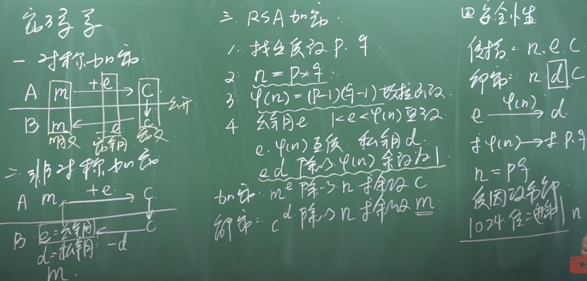

# RSA算法

Crypto不懂RSA做题完全等于坐牢，看一天都没看出什么东西。来吧，开始学RSA。首先先要知道RSA算法的加解密过程。光知道过程还是很简单的，背后的数学原理才是要命的。一张图就能知道加解密过程以及为什么RSA目前是安全的。

[来源](https://www.bilibili.com/video/BV1Ts411H7u9?spm_id_from=333.337.search-card.all.click)

接下来就该挖[原理](https://zhuanlan.zhihu.com/p/48249182)了。RSA需要非常好的数论基础，而数论学起来不难，用起来难上天。RSA相关的数论基础有素数，模运算，互质关系等，模运算就是求余。这里还有一个概念：同余。当两个整数a,b除以同一个正整数m，若得相同余数，则二整数a,b对m同余，记做$a\equiv b(\mod m)$。相信质数什么的大家肯定知道了，接下来还有啥呢？

欧拉函数，表示在小于等于n的正整数中，与n构成互质关系的数的数量。计算这个值的方法就叫做欧拉函数，记作$\phi(n)$。快去看上面那个链接的文章，我想记录一下文中提到的证明但不是很明显的东西（对于我这种数学过于垃圾的人）。

如果n是质数的某一个次方，即 $n = p^k$ (p为质数，k为大于等于1的整数)，则$\phi(p^k)=p^k-p^j=p^k(1-\frac{1}{p}),j=k-1$。p是质数，所以和p不是互质的数只有它自己。既然p和p不互素，那么p和m倍的p也不可能互素。换句话说就是和p互素的数中不能包含p作为因数。从0开始，每p个数字就有一个数字和p不互素，共有$\frac{p^k}{p}$个数字这么多。总共有$p^k$个数字，减掉就得到了与p互质的数的数目。$\frac{p^k}{p}$可以写成$p^j,j=k-1$，故得到了上面的式子。

往下走到密钥生成的步骤的第五步。ed ≡ 1 (mod φ(n))等价于ed - 1 = kφ(n)是因为一条有关同余的性质。a ≡ b(mod m)，则存在整数k，使得a-b=mk。这两者是等价的。最后一步得到了标准的贝祖等式：给定二个整数a、b，必存在整数x、y使得ax + by = gcd(a,b)。解这个方程要用扩展欧几里得算法。不用怎么理解，看一下就得了，实战中直接Crypto库的inverse函数打天下（最后你就会和我一样没了脚本一题也不会做了！）。

再往下到私钥解密的证明。作者由$m^e\equiv c(\mod m)$得出$c+kn+Remainder=m^e+Remainder$。我是这么变形的：$m^e\equiv c(\mod n),m^e-c=kn,m^e=kn+c,c=m^e-kn$。还是用了上面那个同余的性质，不过没有发现Remainder项。不管了反正也能得到正确答案。

接下来证明的内容非常详细，仔细看完全可以明白，看不懂只有可能是定理忘了，可以考虑跟我一样忘了什么定理就翻回去看，一边翻一边理解证明可以说毫无压力。

我觉得我又行了，做个题试试。