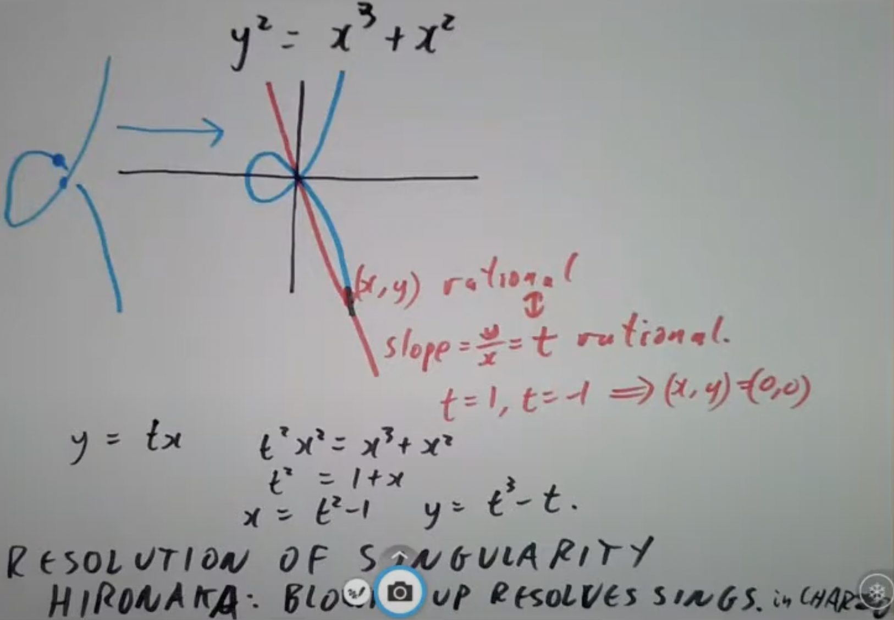

# Algebraic geometry

不知道给我干哪来了，这还是初中数学吗？但我真的需要看看相关定义。课程地址： https://www.youtube.com/watch?v=JZKDmTIFR7A&list=PL8yHsr3EFj53j51FG6wCbQKjBgpjKa5PX ，发现是我学抽象代数时的教授（但他的课我几乎听不懂，不过菲尔兹奖获得者的课我听懂了才见鬼）。补充一点课程里对我来说不是很明显的内容（出走半生，归来仍是初中数学基础）

## Introduction

拿代数表示一个毕达哥拉斯三角，谁都知道是 $x^2+y^2=z^2$ ,x，y和z均为整数且互质。假设任意两个数有公因数g，约掉就是另一组更小的解了（见6，8，10的情况）

把这个方程拿去模4，可知 $x^2,y^2,z^2\equiv 0,1\mod 4$ 。任意数字的平方模4要么是0要么是1，反正所有数模4只有0，1，2，3四种情况，设个代数算出全部可能的结果就能知道这点。在方程模4的情况下，z一定是奇数，要是是偶数的话， $z^2$ 也是偶数，根据刚刚得到的结论， $z^2\mod 4$ 只能是0。那 $x^2$ 和 $y^2$ 也只能是0，所以它们都是偶数，至少有个2作为公因子，不满足互质前提。要是z是奇数的话，x和y肯定一个奇一个偶，就说y是奇数x是偶数吧。来个经典因式分解， $y^2=(z-x)(z+x)$ ，发现z-x和z+x必定互质。假如它俩不互质的话，肯定会有个d同时整除于z-x和z+x，z-x和z+x的和与差也满足这个要求。(z−x)+(z+x)=2z；(z+x)−(z−x)=2x。由于x和z互质，d不能同时整除于x和z，那只能是这个2了。然而2也不行，因为z是奇数x是偶数

如果两个数互质且乘积是一个完全平方数，则这两个数也是完全平方数。来个数论最喜欢的质因数分解， $y^2=(p_1^{e_1}p_2^{e_2}...p_k^{e_k})^2=ab=(p_1^{a_1}p_2^{a_2}...p_k^{a_k})(p_1^{b_1}p_2^{b_2}...p_k^{b_k})$ 。完全平方数的特征就是其每个质因子的指数都是偶数，既然a和b互质，那么两者乘起来之时指数不会互相混淆（不会出现 $a_i+b_i=2$ ，但 $a_i$ 和 $b_i$ 中有一个是1的情况）。说明两者本来各个指数就是偶数，因此两者本身就是完全平方数。有了这个结论，可以把(z-x)记为 $r^2$ ，(z+x)记为 $s^2$ 。此时用r和s参数化此方程的解就很容易了

现在才是正片，来个几何解法。让 $X=\frac{x}{z},Y=\frac{y}{z}$ ，求方程 $X^2+Y^2=1$ ，X和Y均为有理数，的解。这样变形方程后就得到个圆的方程了。现在我们来盘盘这个圆

在圆上取一点(X,Y)，可与圆上的另一个点(-1,0)确定一条直线。直线会穿过y轴上点(0,t)。这条线的斜度即为t。根据斜度的定义， $t=\frac{Y}{X+1}$ ，反过来 $Y=t(X+1)$ 。原方程变形为 $t^2(X+1)^2+X^2=1$ ，变形得到 $(X+1)((t^2+1)X+t^2-1)=0$ 。神奇的事情发生了,X+1的解对应着之前的点(-1,0)； $((t^2+1)X+t^2-1)$ 的解对应着之前的点(X,Y)。这块再变形一下看得更清楚： $((\frac{Y}{X+1})^2+1)X+(\frac{Y}{X+1})^2-1$ ，此方程的解为 $Y=\sqrt{1-X^2}$ 。整个方程的解为 $X=\frac{1-t^2}{1+t^2},Y=\frac{2t}{1+t^2}$ 。更神奇的事情发生了，这意味着圆上的点几乎(除了(-1,0))一一对应着y轴上的点。在代数几何里这叫双有理等价(birational equivalence)。大概是说两个集合除了某些子集之外等价。这里随便取个有理数t就能代出X和Y进而求得原毕达哥拉斯方程解了。整个过程如图：

代数群（algebraic group）的非正式定义：群中的群操作（group operation）由多项式定义的群。也可以看作是一个从环到群的函子（functor）。得解释一下后面这个定义。取任意交换环R（代数几何里的环基本默认交换），将其映射到 $R^2$ 里的对（pairs）的集合： (x,y)，满足 $x^2+y^2=1$ 。只要R是个交换环，那么这个方程的解就能在特定的操作下形成一个群

总结一下几种看圆的方法
1. $R^2$ （real plane）的子集
2. 多项式 $x^2+y^2-1$ 。前两种都是代数集（algebraic set）
3. 在环 (polynomials with 2 variables)中由 $x^2+y^2-1$ 生成的理想，即所有在圆上消失的函数的理想。好今天我终于懂了点什么叫“由xx生成的理想”了（chatgpt配享太庙，错了另外说）。拿R[x,y]复习一下理想的定义：拿任意两个在理想中的多项式相加，其结果仍在理想中；拿理想中任意一个多项式与R[x,y]中任意一个多项式相乘，结果仍在理想中。由 $x^2+y^2-1$ 生成的理想指的是 $x^2+y^2-1$ 与R[x,y]中任意一个多项式相乘的全部结果的集合，或者说 $x^2+y^2-1$ 的全部倍数吧，可能不是很准确
4. 圆上的坐标环（coordinate ring） $\frac{R[x,y]}{x^2+y^2-1}$ 。坐标环可以理解成圆上所有函数的集合，不过在代数几何下只允许多项式。坐标环到底有什么实际意义我目前还不懂（问就是chatgpt用variety给我解释但是啥是variety呢？），不过这不也是个商环吗？在这个商环的意义下，两个多项式f和g是相等的（为0），如果f-g是 $x^2+y^2-1$ 的倍数（数论里的模）。看起来是起到了一个约束的作用，来上这么一下就从全部的多项式约束到仅在圆上的多项式了。但是为啥？模有个等价类的概念，把所有数按照模数分成那么几类，但是怎么约束的呢？商环是怎么保证就模个多项式后所有商环里的多项式就在圆上了呢？问了chatgpt好几个问题，还是没有完全明白……但我觉得我的思路一开始就错了，因为根据模的定义，所有是 $x^2+y^2-1$ 的倍数都被看成0，因此留在这个商环里的是所有不是 $x^2+y^2-1$ 倍数的多项式。等于是R[x,y]扣掉圆的边缘。我一直觉得你要表示个圆，就应该在白纸上拿黑笔画个圆吧？结果这个商环反着来，把整张纸涂黑，只留下一个圆是白色的。不知道这样思考对不对？
5. 光滑流形（smooth manifold）。啥玩意完全没听过，先不追究因为老师说这玩意不是所有时候都有用
6. 群或者代数群
7. 从环到群（集合）的函子

## Two cubic curves

本来还在想三次曲线（cubic curve）是什么玩意，图一出来就傻了：椭圆曲线？查了后才知道，椭圆曲线是三次曲线的特例，表现在没有奇点（singularity）和良好的群结构（想到了ecc的霉好回忆）。图中是一个“resolution of a singularity”的案例，奇点说白了就是曲线上的坏点（比如这张图里的曲线相交了）。其他奇点还有尖点，相碰但不相交的点等。resolution指我们将这个曲线映射成另一个没有奇点的曲线。其中的过程称为blowing up，可以解决特征为零的奇点（特征为零指不断让1加上自己，结果永远不会为0。典型域例子为实数，复数和有理数。特征不为零就是结果会为0，比如经典的Z/pZ）

最后开始引入椭圆曲线(elliptic curve)。之前一直在想椭圆曲线是在哪门课程里会提到啊，今天意外找到了。我就知道我总有一天会找到你的（

假如我们取三次曲线上任意两点a和b，再画一条线穿过两点，直线有可能相交于曲线上的另外一点，称之为a·b。此时我们得到了一个二元运算。假如a=b的话，取切线即可。但还有一种可能，若穿过两点a'和b'的直线不交于曲线上任意一点怎么办？于是我们引入一个无穷远点，这个点就是`a'·b'`的结果。目前还不是一个群操作，因为我们还没有选单位元(identity)。那就把无穷远点看成单位元吧。然而还不够，想要这个二元运算是群操作，需要在群中定义"a,b和c共线 $\Leftrightarrow$ a+b+c=0"。这里我把这个0理解成单位元，因为a+b表示画条线，假如这个线也交与c的话，是不是可以理解成a+b+c？之后都不会有交点了，所以交于无穷远点，所以a+b+c=0。因此刚才提到的a·b实际等同于-(a+b)。这个运算明显可交换且有逆元（群的定义），但是可结合吗？a+(b+c)是否等于(a+b)+c？直接用坐标来检验很痛苦，用一个条件会简单很多： $a_1+a_2+...+a_i=b_1+b_2+...+b_i\Leftrightarrow$ 存在一个有理函数，其极点全在 $a_i$ 上，其零点全在 $b_i$ 上。这个群就叫椭圆曲线,是阿贝尔簇（abelian varieties）的一维案例。阿贝尔簇指射影代数群(algebraic groups that are projective)，这个结构基本不会有什么缺失的点