# 初中数论学习

[课程地址](https://www.bilibili.com/video/BV1N5411P7ai?spm_id_from=333.337.search-card.all.click)

### 整除

性质：
传递性：若a|b,b|c，则a｜c
组合：a｜b，a｜c，则对任意整数m，n，都有a|mb+nc

组合性质很好理解。a整除于b，则a一定整除于m倍的b，c同理。

例题1:x，y是整数，5｜（x-y），求证5｜（6x-11y）

将6x-11y重写成x-y+5（x-2y）的形式，并将其拆分成两个部分：（x-y）和5（x-2y）。5｜x-y题目中已有给到，5｜5是肯定的，那么5肯定同样整除于（x-y）倍的5。5｜x-y且5｜5
（x-2y），因此5｜（6x-11y）

以上条件，求证5｜（3x+2y）

和第一小问一样，证明的关键点是怎么将要证明的式子拆分成5的倍数的式子的和。可以将3x+2y拆分为3（x-y）+5y，正好满足证明条件。

例题2:求证：若n为整数，6｜n（n+1）（n+2）。

单纯直接证明整个式子是否能被6整除似乎有点困难，那就可以将其拆分。n（n+1）（n+2）可以理解为连续3个数的乘积。将6拆分为$2*3$，如果2｜n（n+1）（n+2）且3｜n（n+1）（n+2）即证明6｜n（n+1）（n+2）。两个连续的数中必有一个数是2的倍数，三个连续的数中必有一个是3的倍数，由此易证6｜n（n+1）（n+2）。

6｜n（n+1）（2n+1）

还是将6分为$2*3$，此时关键点在于证明3｜n（n+1）（2n+1）。无法直接看出来n是否为3的倍数，分类讨论。当n等于3k时，是3的倍数；当n等于3k+1时，2n+1等于6k+3，是三的倍数；当n等于3k+2时，n+1等于3k+3，是3的倍数，故6｜n（n+1）（2n+1）。

习题：12｜n（n+1）（n+2）（n+3）

将12拆分为$3*4$，则此时证3｜n（n+1）（n+2）（n+3），4｜n（n+1）（n+2）（n+3）。连续三个数内必定有一个数是3的整数，连续4个数必定有1个数是4的倍数，故成立。

6｜n（4n+1）（7n+5）

6分成2*3然后分类讨论。中间需要一点变形但是还是很简单。

例题3:求所有整数n，使得n｜$n^2+4$

n｜$n^2+4$即$\frac{n^2+4}{n}$。稍微变形可得n+4/n。n+$\frac{4}{n}$是整数的条件是4/n为整数，即n｜4。n为正负1，2，4。

以上条件，n+1|$n^2+5$

如何让这个式子中像上一题一样包含a/n，可以让我们简单找a，a｜n就是符合要求的条件。题目还是可以重写成$\frac{n^2+5}{n+1}$。无法像上题一样化简，因为分母不是单项式。那么可以用换元法将n+1重写成m，n相应得m-1，$m^2$就代表$(m-1)^2$，原式等于$\frac{(m-1)^2+5}{m}$,展开可得$\frac{m^2-2m+6}{m}$，这样就和上一题一样了。不过解出的是m，记得还原成n。

### 同余

带余除法：对于任意的$a,b(b\not ={0})$,存在唯一的商q和余数r，使得a=bq+r

同余的定义：如果两个正整数a，b除以m（m为正整数）后余数相同，则称a，b关于模m同余。记作$a\equiv b$。$a\equiv b\equiv r \mod m$

性质1:$a\equiv b(\mod m)$等价于
(1)m|(a-b)

(2)存在整数k，使得a-b=mk

性质1由于a和b具有相同的余数，那么两者相减余数就相当于被消掉了，故可以被m整除

性质2（同余式相加）：若$a\equiv b(\mod m),c\equiv d(\mod m),a+c\equiv b+d(\mod m)$

性质2设a和b模m的余数是r1，c和d模m的余数是r2，那么a+c模m的余数是r1+r2，b+d模m的余数也是r1+r2，故成立

性质3（同余式相乘）：若$a\equiv b(\mod m),c\equiv d(\mod m)$,则有
（1）$ac\equiv bd(\mod m)$
（2）$a^n\equiv b^n(\mod m)$
 
对于（1），a可以被写为$k1*m+b$，c可以被写为$k2*m+d$。ac就等于$(k1*m+b)*(k2*m+d)=k1*k2*m^2+d1*dm+k2*bm+bd$。也就是$ac=k1*k2*m^2+d1*dm+k2*bm+bd$。$k1*k2*m^2+d1*dm+k2*bm$一定是m的倍数，不会对余数有任何影响，因此$ac\equiv bd$

对于（2），先假设有两个式子,$a\equiv b(\mod m)$和$a\equiv b(\mod m)$，两者相同，由（1）易证$a^2\equiv b^2(\mod m)$。向下推广，必定$a^n\equiv b^n(\mod m)$

例题2:已知n是任意正整数，求证$3|(n^3-n),5|(n^5-n)$

$3|(n^3-n)$，即证明$n^3\equiv n(\mod 3)$。

（1）$n\equiv 0(\mod 3),n^3\equiv 0(\mod 3),n^3\equiv n(\mod 3)$

（2）$n\equiv 1(\mod 3),n^3\equiv 1(\mod 3),n^3\equiv n(\mod 3)$

（3）$n\equiv 2(\mod 3),n^3\equiv 8(\mod 3),8\equiv 2(\mod 3),n^3\equiv n(\mod 3)$

第二小问同理，分类讨论5次。

之后题目还是截图吧，手写markdown太累了。

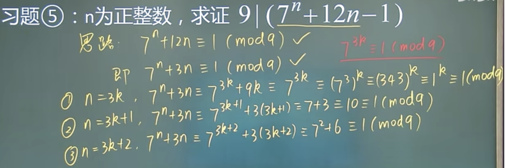

第二次讨论7的3k+1次方可以被分成7的3k次方\*7。7的3k次方在第一次讨论（红色字体）就已经被证出和1同余，那么7的3k次方*7相当于多了7倍的余数，也就是7。第3次讨论同理。

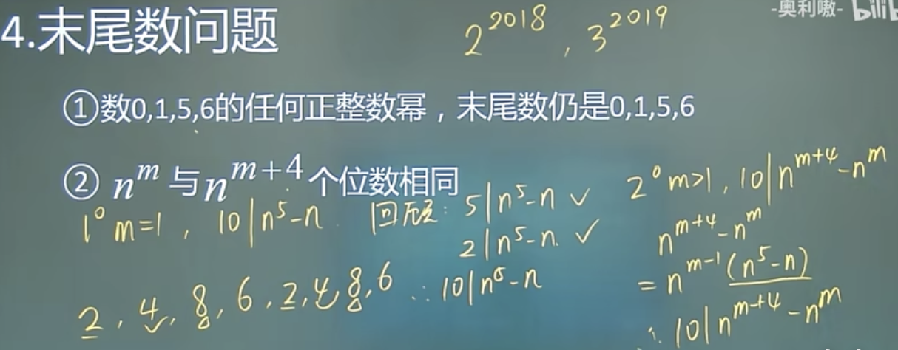

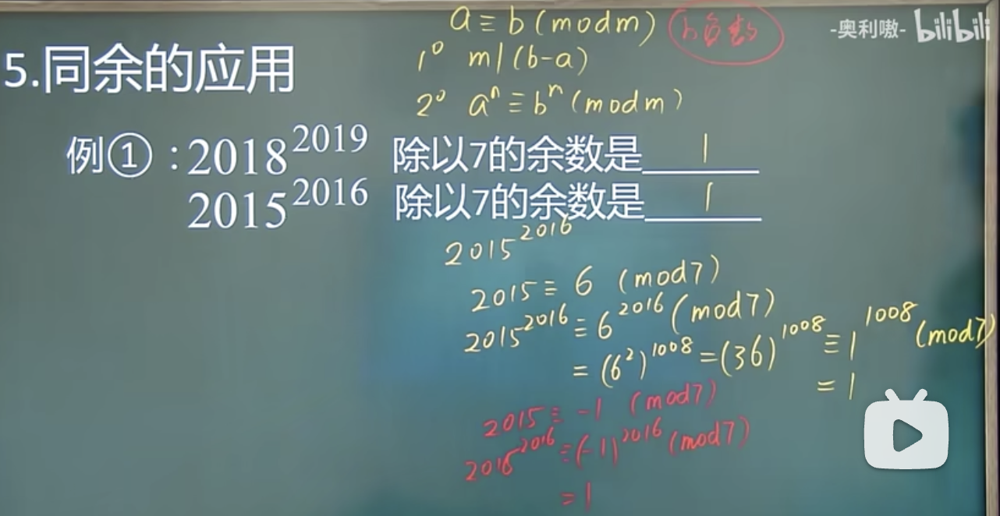

这题说明了同余中负整数的妙用。同余不一定仅仅代表a和b除以m的余数相同，同余的性质m
|(b-a)也可以作为同余的定义。

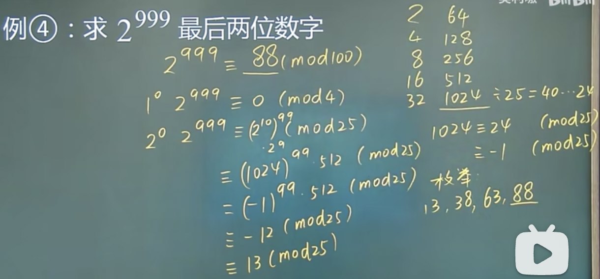

中国剩余定理之前简单的例子可以直接用枚举法。听起来很垃圾但是对简单情况来说更容易且更好理解。

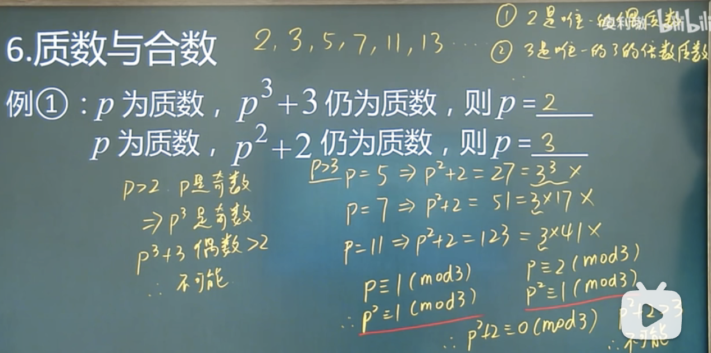

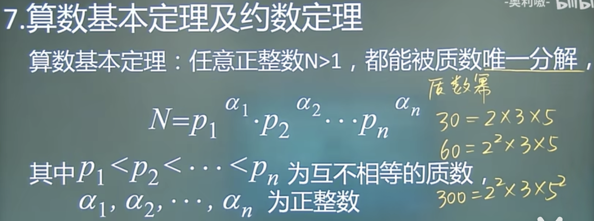

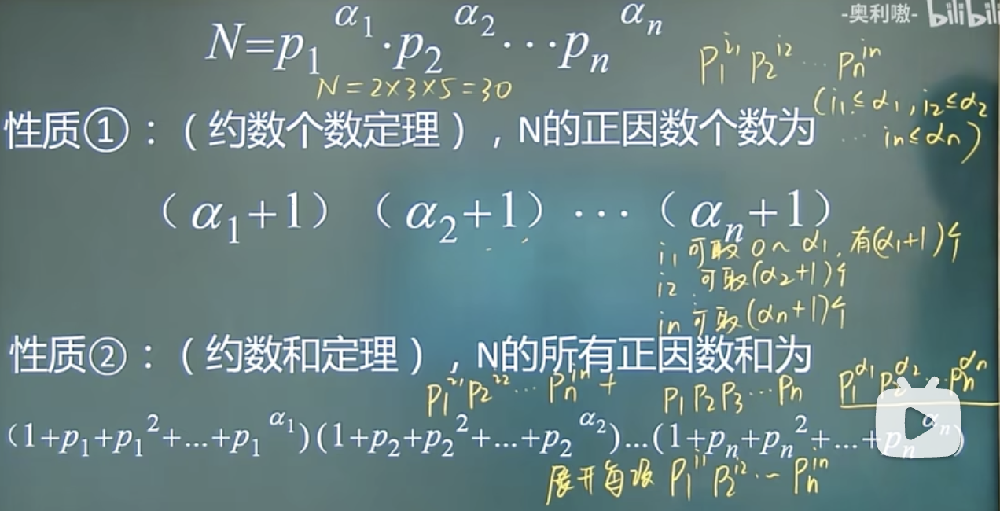

这个定理指的是N这个数字所有的正因数，不仅仅只是质数。比如30的因数5\*6。每个因数还可以被继续分为多个不同质数的乘积（上一个算数基本定理），也就是P1的i1次方\*P2的i2次方\*P3的i3次方\*Pn的in次方。再拿30的例子，6分解出来的质因数种类肯定只会在2，3，5的范围里，且i1,i2,i3,in等数量不会超过30的质因数的$\alpha1,\alpha2,\alpha3,\alpha n$,最多等于。i1不会超过$\alpha1$的数量，那i1只能有0-$\alpha1$个。每个i都是这样，乘起来就是全部的个数了。（好像和上个笔记的排列有关）

性质2的结果有点绕，但是把写出来的三个项展开后就就能发现只是普通的加法而已（还是要联系算数基本定理）

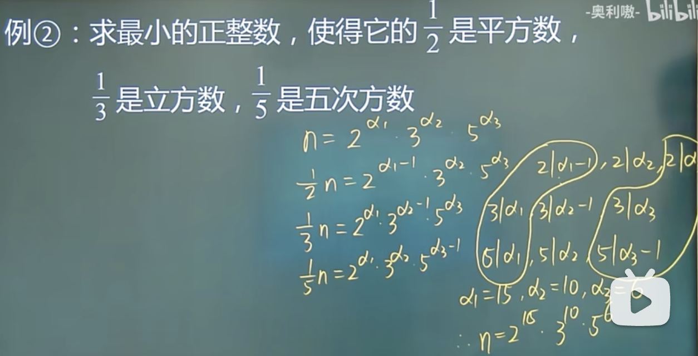

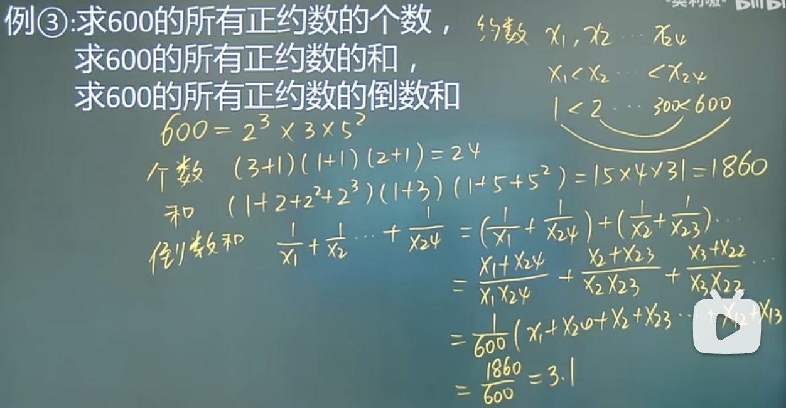

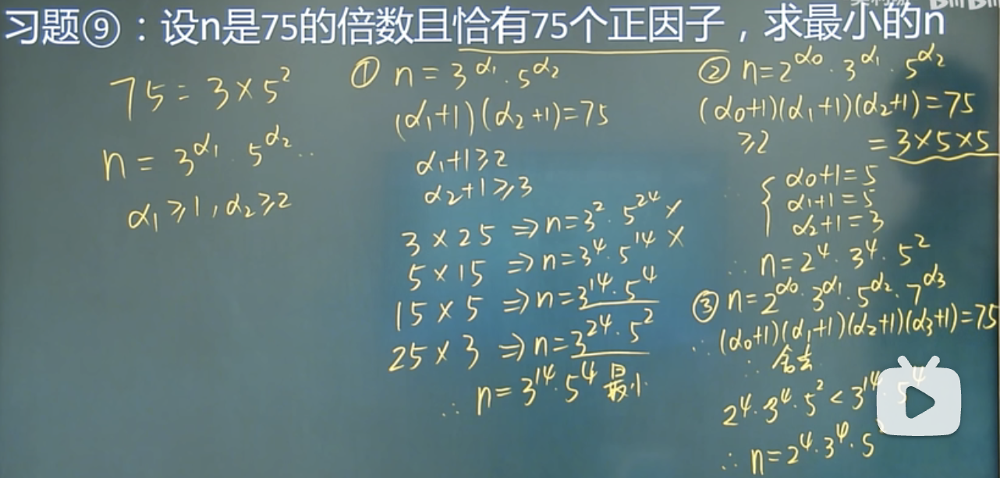

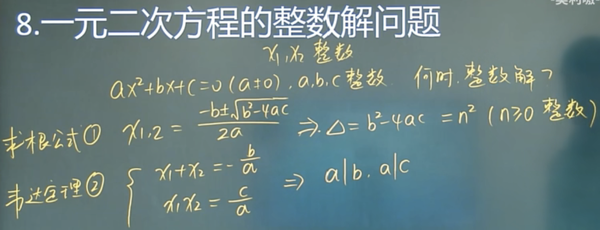

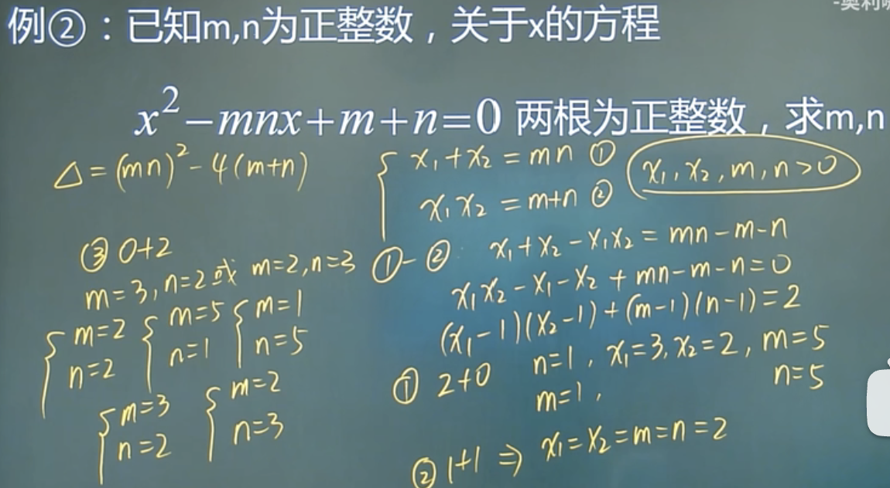

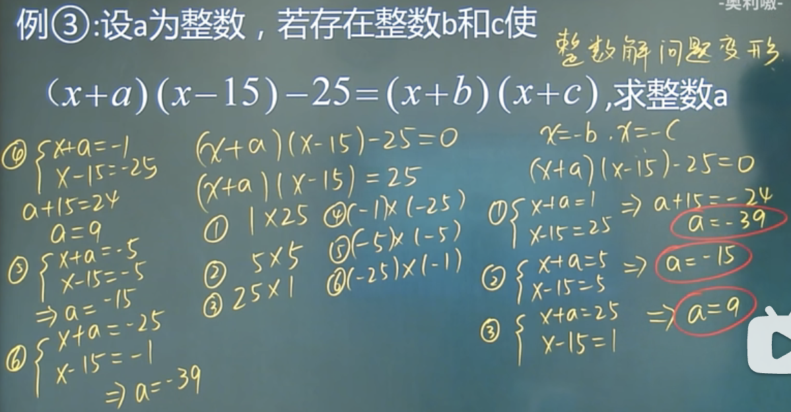