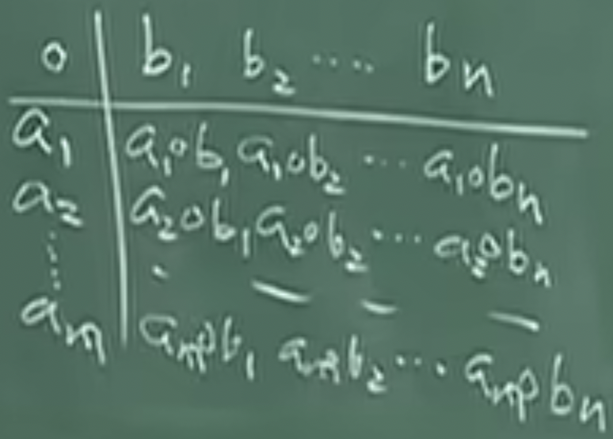

# 抽象代数

[课程地址](https://www.bilibili.com/video/BV1eE411b7Xq/)

抽象代数中有一个代数体系，简单的解释就是集合+运算。一切都要从运算和关系开始。集合和映射的概念是基础中的基础，不过这里要说明一点，集合不给出定义，否则会出现悖论。

## 2-1-1运算及关系2

定义 1.1.1:设 $A_0$ 为A的子集，定义 $A_0$ 到A的映射 $i:A_0\rightarrow A$ 使i(x)=x, $x\in A_0$ 。这类型的映射似乎啥也没干，有个名字：i为 $A_0$ 到A的嵌入式映射。

定义1.1.2:设 $A_0$ 为A的子集，f为A到B的映射，g为 $A_0$ 到B的映射。如果f(x)=g(x)， $\forall x\in A_0$ ，则称f为g的开拓，g为f（在 $A_0$ 上）的限制，记为 $g=f|_{A_0}$ 。还有一个很关键的东西：交换图。假如我们有：

$f_1:A_1\rightarrow A_2$<br>
$f_2:A_2\rightarrow A_3$<br>
$f_3:A_3\rightarrow C$<br>

则 $f_3f_2f_1:A_1\rightarrow C$ 。如果又有：

$g_1:A_1\rightarrow B$<Br>
$g_2:B\rightarrow C$<Br>

则 $g_2g_1:A_1\rightarrow C$ 。这种情况下， $f_3f_2f_1=g_2g_1$ ，有交换图：


当映射关系复杂时，交换图的表示方式会比公式简单。例1：设 $A_0$ ，A，B关系如1.1.2，f为g的开拓，则交换图为：


其中i为1.1.1中的嵌入式映射，由此可看出嵌入式映射的作用。

定义1.1.3:设 $A_1,A_2$ 为两个集合，则 $A_1\times A_2=\{(a,b)|a\in A_1,b\in A_2\}$ 。集合 $A_1\times A_2$ 称为 $A_1$ 与 $A_2$ 的直积。类似定义 $A_1,A_2...A_n$ 的直积。注意(a,b)是有序对。

接着是运算。运算从小学就有接触了，但是你能给出一个准确的定义吗？无论是加减还是乘除，它们的本质都是两个元素经过某种法则得到一个元素。于是有定义1.1.4:设A，B，D为三个非空集合，一个映射f， $A\times B\rightarrow D$ ，称为A与B到D的一个代数运算。 $A\times B$ 刚才学过，结果是有序对的集合，完全符合刚才说的“两个元素经过某种法则得到一个元素”。

例2:设V位线性空间，数域为P。V中的加法为 $V\times V\rightarrow V$ ；P与V的[数乘](https://zh.wikipedia.org/wiki/%E6%A0%87%E9%87%8F%E4%B9%98%E6%B3%95)（也叫纯量乘法）为 $P\times V\rightarrow V$ 。

例3:P为数域， $P^{n\times n}$ 为P上n阶方阵集合。矩阵加法，乘法都是 $P^{n\times n}$ 与 $P^{n\times n}$ 到 $P^{n\times n}$ 的代数运算。

特别地，如果A，B，D都相同，代数运算f被称为A上的二元运算。既然代数运算这么重要，有专门的符号表示才好。如果按照定义里面的映射方式，假如4个元素a，b，c，d运算，结果可能是 f(d,f(f(a,b),c))，太麻烦了。我们完全可以将两个元素间的运算简写为 $a\circ b$ ，甚至于直接ab（这里的ab不仅仅是乘法，也可以是加法等任意运算）。那刚才的结果就能写为d((ab)c)，假如有结合律的话还能简化为dabc。

运算有了，运算规律可不能少。定义1.1.5:设A上定义了二元运算，满足ab=ba， $\forall a,b\in A$ 。称二元运算满足交换律。

定义1.1.6:设A上定义了运算，满足a(bc)=(ab)c, $\forall a,b,c\in A$ ，称运算满足结合律。

定义1.1.7:设A上定义了两种运算 $\circ,+$ ，满足 $a\circ(b+c)=a\circ b+a\circ c,\forall a,b,c\in A$ 。称满足" $\circ$ "对“+”的左分配律。因为" $\circ$ "在“+”左边，相应的还有右分配律。以后统一称分配律。

如果A上有代数运算并满足结合律， $a^n,n\in N$ 就有了定义。如果进一步满足交换律，更有 $(ab)^n=a^nb^n$ 这一重要定理。

## 3-1-1运算及关系3

假如 $A\times B\rightarrow D$ ，且|A|< $\infty$ ,|B|< $\infty$ （||不是绝对值而是集合的阶，也就是元素数量），就能写出运算表。让 $A=\{a_1,a_2...a_m\},B={b_1,b_2...b_n}$ ，运算表如下：



如果A和B相等，得到的结果就是一个N\*N的方阵。这种情况下如果想看是否满足交换律，只需要看对角线是否对称。

那么如何构造集合？介绍一种构造新集合的方法——关系。关系指非空集合A中一种对两个元素而言的一种性质，使A中任何两个元素或有这种性质，或没有这个性质。简单来说就是“二者必居其一”。如A=R，有关系“>","="," $\geq$ "，随便选取 $a,b\in R$ ，这两个元素要么满足关系，要么不满足，不会出现看不出来的情况。如果我们将关系用R表示，a与b有关系R能记为aRb；无关系R记为 $a\not{R}b$ (R中间有一撇，打不出来)。将有元素的关系对构成 $A\times A$ 的子集R， $R=\{(a,b)|aRb\}$ 。反之， $A\times A$ 中一个子集R，则可定义关系R，使 $aRb\leftrightarrow (a,b)\in R$ 。明白这点后，前面那个啰嗦复杂的定义就能被简写为：

定义1.1.9:设A为非空集合，A中一个关系为 $A\times A$ 中的一个子集R。将关系抽象为一个集合，妙啊妙啊。

定义1.1.10:设非空集合A中定义了关系R。若R满足条件：

1. 反射性: $\forall a\in A,aRa$
2. 对称性: $aRb\rightarrow bRa$
3. 传递性: $aRb,bRc\rightarrow aRc$

则称R为等价关系。

例8: $P^{n\times n}$ 中的“[相似](https://zh.wikipedia.org/wiki/%E7%9B%B8%E4%BC%BC%E7%9F%A9%E9%99%A3)”关系是等价关系。 $A=T'ST$ ，T取单位矩阵即可满足反射性； $T'AT=S$ ，满足对称性；传递性也没有问题。

定义1.1.11: 设有非空集合A，A的一个划分（分类）是指A中一些子集合的集合，满足 $\forall a\in A$ ，a包含且只包含在一个子集合中。A中一个划分就是将A写成一些不相交的非空集合的并。 $A=\cup A_i,i\in I$ 。对于每一个i， $A_i$ 都不能是空集。以及， $\forall i,j\in I,i\not ={j},A_i\cap A_j$ 为空集，即不相同的两个子集中元素不能重复。

把分类和等价关系联系起来就得到了本课第一个定理。

定理1.1.1: A的一个分类决定A中一个等价关系。

定理自然需要证明一下。设 $A=\cup_{i\in I}A_i$ ，任意一个 $A_i$ 都非空集； $A_i\cap A_j$ 得到空集合， $i\not ={j}$ 。定义关系R： $aRb\leftrightarrow \exists i$ ，使 $a,b\in A_i$ （a与b在同一个类里）。关系很容易看出，但一定是等价关系吗？需要一条一条地看条件。

1. 反射性。这个肯定，a和a肯定是落到同一个类里面。
2. 对称性。如果a和b落到同一个类里，b与a自然也是落到同一个类里。
3. 传递性。有aRb，bRc。 $aRb\rightarrow \exists i,a,b\in A_i$ ; $bRc\exists j,b,c\in A_j$ 。马上就能看出 $A_i\cap A_j$ 不为空集合，那只能是i=j了。说明 $a,c\in A_j$ ，故aRc。

证明完毕，R为等价关系。

## 4-1-1运算及关系4

上节课的逆定理——A中一个等价关系能否决定A的一个分类呢？在探究答案之前，先看几个和等价关系有关的概念：等价类，商集合，自然映射。

定义1.1.12: 设非空集合A中有一个等价关系R。 $a\in A$ ，定义a的等价类 $^{-}a=\{b\in A|aRb\}$ (a上有一横，不知道怎么打)，或称为a所在的等价类，也能写为[a]。

定义1.1.13: 设非空集合A中定义了等价关系R，定义集合 $A/R=\{^{-}a|a\in A\}$ （重复的只取一个）。该集合称为A对R的商集合。

定义1.1.14: 映射 $\pi:A\rightarrow A/R,\pi(a)=^{-}a$ 。这种映射称为A到A/R的自然映射。

至此，我们就得出了逆定理。

定理1.1.2:A中一个等价关系决定A的一个分类。

证明不难。回忆分类的定义，“不相交的子集合的并”。A/R不就满足这个特点吗， $^{-}a$ 是一个子集合，而且不会重复。A/R就是A的一个分类， $\forall ^{-}a\in A/R,^{-}a\subseteq A,^{-}a\not ={\varnothing}$ (不为空集合)。那就可以这么写： $A=\cup_{a\in A}^{-}a$ (重复的只取一个，因为a的每个元素都要取等价类，所以并在一起一定是a)。还有最后一个问题要考虑，会不会出现 $^{-}a\not ={^{-}b}$ ，但是两者交在一起结果不是空集的情况（这种情况不符合分类的定义）？顺着这个思路想下去，如果能发现矛盾就能解决这一问题。既然 $^{-}a\cap ^{-}b$ 不是空集，那就在里面取出一个c。 $c\in ^{-}a,aRc;c\in ^{-}b,bRc$ 。利用等价关系的对称性和传递性，bRc，cRa，那么bRa。那这俩有关系，不正好说明它们是同一个等价类吗？ $^{-}a=^{-}b$ ，与前面矛盾。故 $^{-}a\not ={^{-}b}$ ，则 $^{-}a\cap ^{-}b=\varnothing$ 。最后得到A/R确实为A的一个分类。粗略看来，等价关系<->分类。

现在我们有集合A，A上定义了二元运算，还有等价关系R。利用之前学习的内容，可以轻松构造出另一个集合A/R。但是这个集合上有没有运算？最好是有，代数就是集合和运算，光有个集合没啥用。是否可以从A上的二元运算导出A/R的运算？可以，导出来的办法就很自然地给出了同余关系的定义。

定义1.1.15:设非空集合A定义了二元运算" $\circ$ "，又定义了等价关系R。如果R与" $\circ$ "满足条件 $a_1Rb_1,a_2Rb_2\Rightarrow a_1\circ a_2Rb_1\circ b_2$ ，则称R为" $\circ$ "的同余关系。基于此，假设R是" $\circ$ "的同余关系，A/R中有 $^{-}a,^{-}b$ 。然而这俩玩意都是等价类啊，怎么算？那拉个代表元出来试试。在A/R中有 $^{-}a\circ^{-}b$ (这里的 $\circ$ 头上也有个横，代表商集合上的运算，还是打不出来)，自然地就能定义 $^{-}a\circ^{-}b=^{---}a\circ b$ (这里整个 $a\circ b$ 上都有横线)，a和b分别为等价类 $^{-}a,^{-}b$ 中的代表元，这里就看为一个元素。至于为什么说“自然”，主要是两个等价类中的元素进行运算后，总是很自然地想让结果也在等价类里。既然 $^{-}a,^{-}b$ 都是等价类了，总不能只有一个元素吧？从 $^{-}a$ 中取出新的代表元 $c\not ={a}$ ；从 $^{-}b$ 中取出新的代表元 $d\not ={b}$ 。但是再怎么换代表元，所在的等价类是一样的啊，运算起来 $^{-}c^{-}\circ ^{-}d=^{---}c\circ d$ 。两种运算的结果 $a\circ b$ 和 $c\circ d$ 也许不一样，但同余关系告诉我们，两种结果所在的等价类是相同的。为啥呢？因为a，c同属 $^{-}a$ ;b，d同属 $^{-}b$ ，说明aRc，bRd。根据同余关系条件， $a\circ bRc\circ d$ ，那么 $a\circ b$ 和 $c\circ d$ 在一个等价类。

总结一下，有集合A和运算" $\circ$ "，等价关系R为" $\circ$ "的同余关系；就能从代数体系（集合与运算) $\{A;\circ\}$ 推出新的代数体系 $\{A/R;^{-}\circ\}$ 。

例10: 设Z中取正整数m，定义关系R满足 $aRb\Rightarrow m|b-a$ 。Z中关系R为等价关系，称为模m的同余关系。aRb记为 $a\equiv b\mod m$ 。Z中有+，\*，R为+，\*的同余关系。同余这个名字就是从这里来的。

例11: $P^{n\times n}$ （n大于等于2）中定义关系R， $ARB\Rightarrow |A|=|B|$ 。R为 $P^{n\times n}$ 中的等价关系，R对+不是同余关系，但对矩阵乘法是，归功于矩阵乘法的性质 $|A_1A_2|=|A_1||A_2|$ 。

## 5-1-2半群与群1

群简单来说，就等于非空集合+二元运算+性质。

定义1.2.1:设G为一个非空集合，G上有二元运算 $\circ$ ，满足结合律，则称 $\{G;\circ\}$ （或G）为一个半群。

例1:自然数集合N（这里不包括0），{N;+}为一个半群；{N;\*}也是一个半群。

定义1.2.2:设 $\{G;\circ\}$ 为半群，若元素 $e_1\in G$ ，满足 $\forall a\in G,e_1\circ a=a$ ，则称 $e_1$ 为G的左幺元。这里 $e_1$ 在a的左边，类似地还有右幺元： $e_2\in G,\forall a,a\circ e_2=a$ 。若 $e\in G$ 既是左幺元，又是右幺元，则e为G的幺元，G为幺半群。

定义1.2.3:设 $\{G;\circ\}$ 为幺半群，e为幺元， $a\in G$ 。若元素a'满足 $a'\circ a=e$ ，则称a'为a的左逆元。和上个定义类似，右逆元就是把元素放右边：有元素a''， $a\circ a''=e$ 。若 $b\in G$ 既是a的左逆元，又是a的右逆元： $a\circ b=b\circ a=e$ ，则称b为a的一个逆元，记为 $a^{-1}$ 。

那么把两个定义结合起来，每个元素都有逆元的幺半群就是群。这里用集合的观点也可以给出群的定义：非空集G定义了二元运算 $\circ$ ，满足以下条件的G称为群。

1. G对 $\circ$ 封闭
2. $\circ$ 满足结合律： $a(b\circ c)=(a\circ b)\circ c,\forall a,b,c\in G$
3. G存在幺元e： $e\circ a=a\circ e,\forall a\in G$
4. $\forall a\in G$ ，a存在逆元

如果再满足个交换律，这个群就是交换群，也叫阿贝尔群。还剩下一些命题需要考虑。

命题1.2.1:幺半群中的幺元唯一。证明非常简单，设e，e'都是半群G的幺元，把两者相乘，得到e=ee'=e'，完成。

命题1.2.2:设G为群，则G中任意元素的逆元都是唯一的。证明与上一个类似，设 $a\in G$ ， $a_1,a_2$ 都是a的逆元。则：

$(a_1a)a_2=ea_2=a_2$<br>
$a_1(aa_2)=a_1e=a_1$

群满足结合律，所以 $a_1=a_2$ ，逆元唯一。

## 6-1-2半群与群2

如果把上节课的群定义的3和4换成：

3': G中存在左幺元e
4': $\forall a\in G$ ，a存在左逆元b， $b\circ a=e$

1，2，3'和4'构成群的第二种定义。第三种定义为1，2，3''和4''，两个引号的定义就是把1个引号的定义的“左”换成“右”。接下来看群的几个基本性质。

命题1.2.3: 群满足左右消去律。

啥是消去律？我们看一个证明的过程就能明白了。假设 $a,b,c\in G$ ,满足ab=ac。用 $a^{-1}$ 左乘得 $a^{-1}(ab)=a^{-1}(ac)$ 。故 $(a^{-1}a)b=(a^{-1}a)c$ ,得b=c，故G满足左消去律。右消去律证明方法类似。

命题1.2.4:设G为群，则最任何 $a,b\in G$ ，方程ax=b，xa=b都存在唯一解。

证明和上一个命题类似，都只用证一个，另外一个步骤差不多。这里我们证ax=b。用 $a^{-1}b$ 代替x，左右相等，解存在。若 $c_1,c_2$ 均为ax=b的解，则 $ac_1=ac_2(=b)$ ,由消去律得 $c_1=c_2$ ，故解唯一。

命题1.2.5:设G为半群，若 $\forall a,b\in G$ ，方程ax=b,xa=b都有解，则G为群。

发现命题1.2.5是群的另一种定义，那我们套用1，2，3'和4'的定义方式，看看是否满足就能证明该命题了。首先G是半群，1和2直接成立。至于3'的证明，让我们任取 $a\in G$ ，方程xa=a有解 $e_a$ 。 $e_a$ 对于a有左幺元的性质，但是其他元素呢？比如另一个元素c？ $\forall c\in G$ ，我们构造方程ax=c，有解d，则c=ad。这里我们把c写成ad的形式，就能得到 $e_ac=e_a(ad)=(e_aa)d=ad=c$ , $e_a$ 为左幺元。剩下的4'之左逆元就很简单了。 $\forall b\in G$ ,左逆元的定义就是 $xb=e_a$ 。这不就是个方程吗，根据之前的条件，有解，x就是b的左逆，G为群。

命题1.2.6:有限半群G若满足左右消去律，则G为群。

这又是个群的定义，利用命题1.2.5证明。因为G有限，所以|G|\< $\infty$ (|G|表示G中的元素个数)。设 $G=\{a_1,a_2...a_n\}$ 。考虑方程 $a_ix=a_j$ ，即元素 $a_ia_1,a_ia_2...a_ia_n$ 。这些元素不会重复，假如有 $a_ia_l=a_ia_k$ ，用消去律就能得到 $a_l=a_k$ 。集合里元素不会重复，说明不会出现这种情况， $a_ia_1,a_ia_2...a_ia_n$ 互不相等，共有n个元素。G本来就只有n个元素，说明必有一个为 $a_j$ ，方程 $a_ix=a_j$ 有解。类似可证 $xa_i=a_j$ 也有解。故G为群。注意前提条件的“有限”很重要，比如自然数集N对乘法就不是群。它除了“有限”这个条件外，其他都满足。

关于群的记号肯定要了解一下。当 $a\in G$ ，n大于0时， $a^n$ 有定义。若G为群， $a^n$ 在n大于0时定义为 $aa...a$ ，共n个a。 $a^0=e,a^{-1}$ 为a的逆。 $a^{-n}=a^{-1}...a^{-1}$ ，共n个 $a^{-1}$ 。看来在G为群时， $a^m,m\in Z$ 都有定义。群中有幂的性质： $a^ma^n=a^{m+n},(a^m)^n=a^{mn}$ 。

像刚才这种符号为 $\circ$ 或是直接没有的G，一般称为乘法群。如果G为交换群，一般将运算写成加法。如果n大于0，na定义为a+...+a，共n个a。a的逆写为-a，幺元称为零元，记为0。(-n)a=(-a)+...+(-a)，共n个(-a)。0a=0（注意右边的0是G的幺元。这是个定义，和乘法群定义 $a^0=1$ 类似）。

## 7-1-2半群与群3

定义1.2.6:设G为群，G的阶指G中元素的个数，记为|G|。|G|< $\infty$ 时，称G为有限群； $|G|=\infty$ 时，成为无限群。有限群的运算可以用群表来表示。

定义1.2.7:设G为群， $a\in G$ ，若对任何 $n\in N,a^n\not ={e}$ ，称a的阶为无穷。若至少存在一个 $m\in N,a^m=e$ ，定义a的阶为min( $\{k\in N|a^k=e\}$ )。可以记为|a|。

关于阶有几个性质。

- a的阶为1 $\Leftrightarrow a=e$ 。
- a的阶与 $a^{-1}$ 的阶相等。

命题1.2.7:设G为群， $a\in G$ ，则a的阶为无穷 $\Leftrightarrow a^m\not ={a^n},\forall m,n\in Z,m\not ={n}$ 。 

证明非常简单。对于前半部分，我们假设a的阶无穷，但反设 $\exists m\not ={n}$ 使 $a^m=a^n$ 。既然两者不相等，总有一个数会大于另一个数，这里让m>n。两边同乘 $a^{-n}$ ，得到 $a^{m-n}=e$ ，与前提条件矛盾，故 $\forall m\not ={n},a^m\not ={a^n}$ 。至于剩下的一部分，我们假设 $\forall m\not ={n},a^m\not ={a^n}$ ，让n=0，就有了 $\forall m\in N,a^m\not ={a^0}=e$ 。这不就是定义1.2.7吗，直接得到a的阶是无穷。

命题1.2.8:设G为群, $a\in G$ ,a的阶为d。则：

1. $a^k=e\Leftrightarrow d|k$
2. $a^k=a^h\Leftrightarrow d|h-k$

这里只用证明1，毕竟2的条件 $a^k=a^h\Leftrightarrow a^{h-k}=e$ 。设k=dm，则 $a^k=a^{dm}=(a^d)^m=e^m=e$ 。另一方面，设 $a^k=e,k=dq+r;q,r\in Z,0\leq r$ \<d。如果r不等于0，则 $a^r=a^{k-qd}=a^k\*(a^d)^{-q}=e$ ( $a^k=a^{dq}\* a^r,a^r=\frac{a^k}{a^{dq}}=a^{k-qd}$ 。 $a^k,a^d$ 已经是幺元，q是什么已经不重要了)。r小于d，d又是a的阶。根据阶的定义，d应该是满足 $a^x=e$ 的最小解，现在又冒出来个r，与前提条件矛盾。故r=0，d|k。

命题1.2.9:设G为群， $a\in G$ ，a的阶为d。则：

1. $a^k$ 的阶为d/gcd(d,k)，k大于0。
2. $a^k$ 的阶为d $\Leftrightarrow gcd(d,k)=1$ 。

只需要证明1，2完全根据1推出来的。设 $a^k$ 的阶为q，证明的目标是q=d/gcd(d,k)。有一个办法，就是证明两者互相整除，都是1倍。设 $d=d_1(d,k),k=k_1(d,k)$ （最大公因数乘上约掉最大公因数剩下的数），则 $(a^k)^q=e=a^{(qk)}$ 。根据命题1.2.8，d|qk。代入 $d=d_1(d,k),k=k_1(d,k)$ ，得到 $d_1|k_1q$ 。这两个约掉最大公因数剩下的数肯定是互质的， $gcd(d_1,k_1)=1$ 。故 $d_1|q$ ，也就是d/gcd(d,k)|q。反之， $(a^k)^{d_1}=a^{kd_1}=a^{k_1(d_1k)d_1=a^{k_1d}=(a^d)^{k_1}}=e$ 。因 $a^k$ 的阶为q，故 $q|d_1=d/(d,k)$ 。两者互相整除，q=d/(d,k)。

命题1.2.11:设G为群， $a,b\in G$ ，a的阶为m，b的阶为n，且ab=ba，gcd(m,n)=1。则ab的阶为mn。

如何证明？设ab的阶为q， $(ab)^{mn}=a^{mn}b^{mn}=e\*e=e$ (没有ab=ba这个条件不能这么写，因为这相当于把所有的a写前面，所有的b写后面),故q|mn。另一方面， $b^{qm}=a^{qm}b^{qm}=(ab)^{qm}=((ab)^q)^m=e^m=e$ 。因b的阶为n，所以n|gm。加上gcd(m,n)=1，得到n|q。考虑 $a^{qn}$ 同理可得m|qn，又gcd(m,n)=1，mn|q，q=mn。

## 8-1-3子群与商群1

定义1.3.1:设G为群， $H\in G,H\not ={\emptyset}$ 。若H在G的运算构成群，则称H为G的子群。记为H\<G。

由H与G的运算一致这个特点，能推出来G的幺元 $e\in H$ 。假设H的幺元为e'，G的幺元为e，ee'=e'=e'e'由消去律得到e=e'。以及 $\forall h\in H$ ，h在G中的逆 $h^{-1}\in H$ ，也就是h在H中的逆。这条的证明方法与幺元类似。

定理1.3.1:设G为群，H为G的非空子集，则下列条件等价：
1. H\<G
2. $\forall a,b\in H,ab\in H,a^{-1}\in H$
3. $\forall a,b\in H,ab^{-1}\in H$

这个定理告诉我们如何判断一个非空子集是不是子群。证明很简单，首先1->2是显而易见的，基本就是定义。2->3也没有多复杂， $a,b\in H\Rightarrow a,b^{-1}\in H\Rightarrow ab^{-1}\in H$ 。最后绕回来，3->1，这个证明了就能完全证明3个条件的等价性了。根据3， $\forall a,b\in H,ab^{-1}\in H$ 。把b取为a就能得到 $aa^{-1}\in H$ ，即 $e\in H$ 。 通过 $e\in H,b\in H$ ,结合2就能推出 $b^{-1}\in H$ 。于是有 $ab^{-1}\in H\Rightarrow a(b^{-1})^{-1}=ab\in H$ ，满足群的定义之运算封闭。结合律甚至都不用看，肯定是有的。因为大集合里已经有了结合律，在小集合里只要运算封闭就有结合律。幺元和逆在刚刚证明时已经证明有了。完全满足群的定义，H\<G。

命题1.3.2:设H为群G的非空有限子集，则H\<G $\Leftrightarrow$ H对运算封闭。

H\<G推出`H对运算封闭`没啥好说的，就是定义；H对运算封闭刚才说了，满足结合律，那么H就为有限半群。现在H距离群就差个消去律了，这个消去律大集合有，小集合肯定也有，故H\<G。

命题1.3.3:设 $H_1$ \<G, $H_2$ \<G,则 $H_1\cap H_2$ \<G。

$e\in H_1\cap H_2,H_1\cap H_2\not ={\emptyset},\forall a,b\in H_1\cap H_2$ ,则 $a,b\in H_1;a,b\in H_2$ 。根据子群的定义， $ab^{-1}\in H_1,ab^{-1}\in H_2$ 。故 $ab^{-1}\in H_1\cap H_2$ ，根据定理1.3.1就能得到 $H_1\cap H_2$ \<G。

在讲商群之前，需要先了解一下陪集的定义。

定义1.3.2:设G为群，H\<G, $a\in G$ ，定义 $aH=\{ah|h\in H\},Ha=\{ha|h\in H\}$ 分别为a为代表元的H的一个左陪集（右陪集）。

## 9-1-3子群与商群2

定理1.3.4:设H为群G的子群，则由 $aRb\Leftrightarrow a^{-1}b\in H$ 所确定的关系R为等价关系，且a所在的等价类恰为以a为代表的H的左陪集aH。故H的全体左陪集（重复的只取一个）的集合{aH}是G的一个分类。

先证R为等价关系。已知R为关系， $\forall a\in G,a^{-1}a=e\in H$ ，故aRa（这一步证明自己和自己有关系R，有些关系自己和自己是没有的），反射性成立。若aRb, $a^{-1}b\in H$ ，则 $(a^{-1}b)^{-1}=b^{-1}a\in H$ （两个元素乘积取逆为分别取逆再倒转顺序），故bRa，对称性成立。若aRb，bRc，则 $a^{-1}b\in H,b^{-1}c\in H$ 。因H\<G，所以 $(a^{-1}b)(b^{-1}c)=a^{-1}c\in H$ 。故aRc，传递性成立。3条性质都成立，R为等价关系。

接下来证 $^{-}a=aH$ 。证明两个集合相等可以证明两者互相包含。对任何 $h\in H,a^{-1}(ah)=h\in H$ ，故aRah，即 $ah\in ^{-}a,aH\subseteq ^{-}a$ 。又 $\forall b\in ^{-}a$ ,aRb即 $a^{-1}b\in h$ ，故 $b=a(a^{-1}b)\in aH$ , $^{-}a\subseteq aH$ 。两个集合互相包含， $^{-}a=aH$ 。

由定理1.3.4,{aH}构成G的分类，记商集合G/R=G/H，称为G对H的左商集，或左陪集空间（右商集也类似）。

推论1.3.5:对 $a,b\in G,aH=bH\Leftrightarrow a^{-1}b\in H$ 。

定义1.3.3:设H\<G，则|G/H|称为H在G中的指数，记为[G:H]。

对于加法群，左陪集记为a+H，关系R为 $aRb\Leftrightarrow b-a\in H$ 。

定理1.3.6:（拉格朗日定理）设G为有限群，H\<G，则 $|G|=[G:H]\times |H|$ 。

证：[G:H]实际上就是左陪集的个数，而左陪集互不相交，因此把左陪集的元素的数量乘上左陪集的个数就是拉格朗日定理了。左陪集写为aH， $\forall a\in G$ ，做一个映射 $H\rightarrow aH,h\mapsto ah,h\in H$ 。根据H的定义，该映射为满射；又结合消去律，该映射为单射。这个映射是双射，故|H|=|aH|，自然就有 $|G|=[G:H]\times |H|$ 了。 

推论1.3.7:设G为有限群，H\<G,K\<G，且 $H\subseteq K$ （等同于条件H\<K，因为子群的子集合也是子群）。则[G:H]=[G:K][K:H]。

证：如果先让K对G用拉格朗日定理，再让H对K用拉格朗日定理，能得到|G|=[G:K]|K|=[G:K][K:H]|H|；单让H对G使用拉格朗日定理，得到|G|=[G:H]|H|。代入得到[G:K][K:H]|H|=[G:H]|H|。|H|是自然数，约掉它就能完成证明。

设H\<G,G/H=G/R，何时G中运算 $\rightarrow$ G/H的运算？答案是满足 $aRb\Leftrightarrow a^{-1}b\in H$ 的关系R为同余关系。即有 $a_1Rb_1$ 和 $a_2Rb_2$ 的情况下能得到 $a_1a_2Rb_2b_2$ 。但是这么写看不出来和H有什么关系，于是我们换种写法：有 $a_1^{-1}b_1\in H,a_2^{-1}b_2\in H$ 的情况下能推出 $a_2^{-1}a_1^{-1}b_1b_2\in H$ 。 $a_1^{-1}b_1$ 在H里没错，可惜剩下的两个被分开了，不能直接断定它们在H里了。没事我们变一下形，变为 $a_2^{-1}(a_1^{-1}b_1)a_2(a_2^{-1}b_2)$ 。看起来有点乱，但是我们整理一下， $(a_1^{-1}b_1)$ 和 $(a_2^{-1}b_2)$ 肯定在H里，再把处于末尾的 $(a_2^{-1}b_2)$ 忽略（因为肯定在H里，带不带上它不重要）。 $a_2$ 可以任意取，这里我们抽象为g，那么整个条件是不是等同于 $\forall g\in G,\forall h\in H,g^{-1}hg\in H$ 呢？

定义1.3.4:设G为群，H\<G，称H为G的正规子群，若 $\forall g\in G,h\in H,ghg^{-1}\in H$ ( $g^{-1}$ 放前面后面都一样）。记为 $H\lhd G$ 。

例5:平凡子群必为正规子群。

例6:若G为阿贝尔群，则任何子群均为正规子群。

例7: $SL(v)\lhd GL(v)$

## 10-1-3子群与商群3

定理1.3.8:设H\<G，则下列条件等价：

1. $H\lhd G$
2. $\forall g\in G,gH=Hg$
3. $\forall g_1,g_2\in G,g_1H\*g_2H=g_1g_2H$ ,其中 $g_1H\*g_2H=\{g_1h_1g_2h_2|h_1,h_2\in H\}$ 。对任何非空子集 $A,\subseteq G,AB=\{ab|a\in A,b\in B\}$ 。

证明这种等价条件最好的办法是走一圈，1->2->3->1。

1->2：对任何 $g\in G,h\in H$ , $ghg^{-1}\in H$ （正规子群的定义）。记 $ghg^{-1}=h_1$ ,则 $gh=h_1g\in Hg$ 。故 $gH\subseteq Hg$ 。同理可证， $Hg\subseteq gH$ 。

2->3： $\forall h_1,h_2\in H,h_1g_2\in Hg_2=g_2H$ （第二点），存在 $h_1'\in H$ 使 $h_1g_2=g_2h_1'$ ，故 $g_1h_1g_2h_2=g_1g_2h_1'h_2$ 。 $h_1'h_2$ 相乘肯定在H里面，故 $g_1g_2h_1'h_2\in g_1g_2H$ 。于是有 $g_1H\*g_2H\subseteq g_1g_2H$ 。又对任何 $h\in H,g_1g_2h=g_1eg_2h\in g_1H\*g_2H$ ，故 $g_1g_2H\subseteq g_1H\*g_2H$ 。于是3成立。

3->1：H\<G， $\forall g\in G,h\in H;ghg^{-1}=ghg^{-1}e\in gH\*g^{-1}H=gg^{-1}H=eH=H$ 。故 $ghg^{-1}\in H$ ,于是 $H\lhd G$ 。

定理1.3.9:设H\<G，则等价关系R： $aRb\Leftrightarrow a^{-1}b\in H$ 是G的同余关系 $\Leftrightarrow H\lhd G$ 。这时G/H对诱导的运算均成一个群，称为G对H的商群，记为G/H。

证：若 $H\lhd G$ ，则对任何 $a_1,a_2,b_1,b_2\in G$ ，且 $a_1Rb_1,a_2Rb_2$ ,即 $a_1^{-1}b_1\in H,a_2^{-1}b_2\in H$ 。则 $(a_1a_2)^{-1}b_1b_2=a_2^{-1}a_1^{-1}b_1b_2=a_2^{-1}(a_1^{-1}b_1)a_2(a_2^{-1}b_2)$ 。因 $H\lhd G,a_2^{-1}(a_1^{-1}b_1)a_2\in H$ ，故 $(a_1a_2)^{-1}b_1b_2\in H$ ，故R为同余关系。反之，若R为同余关系，则 $\forall g\in G,h\in H$ ，因 $g^{-1}(gh)=h\in H$ ，ghRg；又 $g^{-1}Rg^{-1}$ ,故 $ghg^{-1}Rgg^{-1}$ ，即 $ghg^{-1}Re$ 。故 $e^{-1}(ghg^{-1})\in H$ ，即 $ghg^{-1}\in H$ ，故 $H\lhd G$ 。

解下来证诱导运算部分。设 $H\lhd G$ ，因R为同余关系，G/R=G/H上有诱导的运算： $g_1H\*g_2H=g_1g_2H$ 。

结合律： $(g_1H\*g_2H)\*g_3H=g_1g_2H\*g_3H=g_1g_2g_3H$<br>
$g_1H\*(g_2H\*g_3H)=g_1H\*g_2g_3H=g_1g_2g_3H$

结合律成立。接下来是左幺元eH=H。 $\forall g\in G,eH\*gH=egH=gH$ ,左幺元为eH=H。

左逆元： $\forall g\in G,g^{-1}H\*gH=g^{-1}gH=eH$ ，gH的左逆元为 $g^{-1}H$ 。

以上是群的定义的1，2，3‘，4’，都满足故G/H为群。

## 11-1-4群的同态与同构1

定义1.4.1:设 $\{G_1;\circ\},\{G_2;\*\}$ 为群。f为 $G_1$ 到 $G_2$ 的映射。如果 $f(a\circ b)=f(a)\*f(b),\forall a,b\in G_1$ ，称f为 $G_1$ 到 $G_2$ 的同态映射，简称为同态。若同态f为单射，称f为单同态（满射则是满同态）。若同态f为双射，则称f为同构。这时称 $G_1$ 与 $G_2$ 同构，记为 $G_1\simeq G_2$ 。

命题1.4.1:设f： $G_1\rightarrow G_2,g:G_2\rightarrow G_3$ 为群同态。则 $gf:G_1\rightarrow G_3$ 为同态。如果f，g均为单同态（满同态），则gf为单同态（满同态）。若f，g为同构，则gf为同构。f为同构， $f^{-1}:G_2\rightarrow G_1$ 为同构。

命题1.4.2:设 $f:G_1\rightarrow G_2$ 为群的同态，则 $f(e_1)=e_2,f(a^{-1})=f(a)^{-1}$ （ $e_i$ 为 $G_i$ 的幺元）。

证： $f(e_1)f(e_1)=f(e_1e_1)=f(e_1)=f(e_1)e_2$ 。由消去律（消去一个 $f(e_1)$ ），得到 $f(e_1)=e_2$ 。又 $f(a^{-1})f(a)=f(a^{-1}a)=f(e_1)=e_2$ ，故 $f(a^{-1})=f(a)^{-1}$ 。

命题1.4.3:设 $f:G_1\rightarrow G_2$ 为群的同态，则 $f(G_1)$ < $G_2$ 。

证： $f(G_1)\not ={\emptyset}.\forall a',b'\in f(G_1),\exists a,b\in G_1$ ，使 $f(a)=a',f(b)=b'$ 。故 $a'(b')^{-1}=f(a)(f(b))^{-1}=f(a)f(b^{-1})=f(ab^{-1})\in f(G_1)$ 。故 $f(G_1)$ < $G_2$ （定理1.3.1的第3条，子群的等价条件）。

定义1.4.2:设 $f:G_1\rightarrow G_2$ 为同态，定义 $kerf=\{a\in G_1|f(a)=e_2\}$ 称为f的核。

命题1.4.4: $kerf\lhd G_1$ 。

证: $e_1\in kerf,kerf\not ={\emptyset}.\forall a,b\in kerf,f(ab^{-1})=f(a)f(b)^{-1}=e_2e_2^{-1}=e_2$ ，故 $ab^{-1}\in kerf$ ，因此kerf< $G_1$ 。又 $\forall g\in G_1,h\in kerf,f(ghg^{-1})=f(g)f(h)f(g)^{-1}$ 。因为h在核里面，所以等于幺元，原式就等于 $f(g)f(g)^{-1}=e_2$ 。故 $ghg^{-1}\in kerf,kerf\lhd G_1$ 。

定理1.4.6（群的同态基本定理）:设 $f:G_1\rightarrow G_2$ 的满同态，则 $G_1/kerf\simeq G_2$ 。

## 12-1-4群的同态与同构2

命题1.4.5:同态 $f:G_1\rightarrow G_2$ 为单同态 $\Leftrightarrow Rf=\{e_1\}$

证明一下上节课提到的定理1.4.6。记N=kerf，定义 $\phi:G_1/N\rightarrow G_2$ ，使 $\phi(aN)=f(a)$ 。若 $a_1N=a_2N$ ，则 $f(a_1)=f(a_2)$ 。这是因为根据推论1.3.5， $a_1^{-1}a_2\in N$ ，故 $f(a_1^{-1}a_2)=f(a_1)^{-1}f(a_2)=e_2$ ，故 $f(a_1)=f(a_2)$ ， $\phi$ 定义合理。接着， $\forall a,b\in N;\phi(aN\*bN)=\phi(abN)=f(ab)=f(a)f(b)=\phi(aN)\phi(bN)$ ， $\phi$ 为同态。既然f为满射， $\phi$ 也是满射。若 $a_1,a_2\in G_1$ ，设 $\phi(a_1N)=\phi(a_2N)$ ，即 $f(a_1)=f(a_2)\Rightarrow f(a_1^{-1}a_2)=e_2$ ,故 $a_1^{-1}a_2\in N$ ，即 $a_1N=a_2N$ ，故 $\phi$ 为单射（这段基本都是推论1.3.5）， $\phi$ 为同构， $G_1/kerf\simeq G_2$ 。

推论1.4.7:设 $f:G_1\rightarrow G_2$ 为群同态，则 $G_1/kerf\simeq f(G_1)$ 。

从推论1.4.7能看出来，群的同态像和自己的商群其实是一回事，无论它是不是满同态。

定理1.4.8:设 $f:G_1\rightarrow G_2$ 为满同态，N=kerf，则：

1. f建立 $G_1$ 包含N的子群与 $G_2$ 的子群之间的一一对应。
2. 上述对应将正规子群对应到正规子群
3. 若H< $G_1,N\subseteq H$ ，则 $G_1/H\simeq G_2/f(H)$

推论1.4.9：设 $N\lhd G,\pi$ 为自然同态( $\pi:G\rightarrow G/N$ )。则 $\pi$ 建立了G中包含N的子群到G/N的子群之间的一一对应，将正规子群对应到正规子群。若 $H\lhd G$ 且 $N\subseteq H$ ，则G/H $\simeq (G/N)/(H/N)$ 。记住 $\pi(H)=H/N$ 。

定理1.4.10:设 $N\lhd G,\pi:G\rightarrow G/N$ 为自然同态，H< G,则：

1. HN为G中包含N的子群，且 $HN=\pi^{-1}(\pi(H))$ ,即HN为 $\pi(H)$ 的原像。
2. $(H\cap N)\lhd H,ker(\pi|_H)H\cap N$
3. $HN/N\simeq H/H\cap N$

证： $N\subseteq HN$ 显然成立，因此第一条主要证明N是子群。 $\forall h_1,h_2\in H;n_1,n_2\in N$ ，则 $(h_1n_1)(h_2n_2)^{-1}=h_1n_1n_2^{-1}h_2^{-1}=h_1h_2^{-1}(h_2n_1n_2^{-1}h_2^{-1})$ 。由H< G, $h_1h_2^{-1}\in H$ ;由 $N\lhd G$ , $n_1n_2^{-1}\in N$ 。故 $h_2n_1n_2^{-1}h_2^{-1}\in N$ （N是正规子群，这是定义），就有 $(h_1n_1)(h_2n_2)^{-1}\in HN$ ，HN< G。又 $\pi(HN)=\pi(H)\pi(N)=\pi(H)$ （因为N是核）。根据定理1.4.8(1)建立的对应将HN映到 $\pi(H)$ ,故 $\pi^{-1}(\pi(H))=HN$ 。

接下来证明2。 $H\cap N\subseteq H,H\cap N$ < G,故 $H\cap N$ < H。利用正规子群定义，易证 $H\cap N\lhd H$ （ $h\in H,n\in H\cap N,hnh^{-1}$ ）。 $ker(\pi|H)=H\cap N$ (集合里的元素在 $\pi$ 下要等于幺元，又要在H里面，那两者交在一起就是结果了)。

最后是3。根据定义， $\pi(H)=\pi(HN)=HN/N$ 。由同态基本定理， $HN/N\simeq H/H\cap N$ ( $ker(\pi|H)=H\cap N$ )

## 13-1-5循环群

定义1.5.1:设G为群，若存在元素 $a\in G$ ，使 $G=\{a^n|n\in Z\}$ ,则称G为循环群。记为G=\<a\>,a为生成元。

例1:{Z;+}为循环群， $\pm 1$ 为生成元（加法群里面的 $a^n$ 指a的所有倍数）。

命题1.5.1:循环群为阿贝尔群。

命题1.5.2:循环群的子群为循环群。

证：设G=\<a\>,H < G, $H\not ={G}$ 。设 $H\not ={\{e\}}$ ，令 $m=min\{k\in N|a^k\in H\}$ 。下证H=< $a^m$ > ，首先< $a^m$ > $\subseteq H$ 。再设 $a^l\in H,l=qm+r,0\leq r$ < m。则 $a^r=a^{l-qm}=a^l\*(a^m)^{-q}\in H$ ，故r为0，否则与m为最小幂次的定义矛盾。最后 $H\subseteq$ < $a^m$ >。 

推论1.5.3:{Z;+}的任何子群形如mZ, $m\geq 0$ 。

证：设G< {Z;+},若G=Z，取m=1；若G={0}，取m=0；否则令 $m=min\{k\in N|k\in G\}$ 。用命题1.5.2的方法即可证G=\<m\>=mZ。

定理1.3.4:设G为循环群，若 $|G|=\infty$ ，则 $G\simeq \{Z;+\}$ 。若|G|=m>0，则 $G\simeq Z/mZ=Z_m(\simeq U_m)$ 。两个循环群同构 $\Leftrightarrow$ 它们的阶相同。

证：设G=\<a\>，定义 $\phi:Z\rightarrow G$ 使 $\phi(k)=a^k$ 。则 $\phi(k+l)=a^{k+l}=a^ka^l=\phi(k)\phi(l),\forall k,l\in Z$ 。故 $\phi$ 为同态，自然 $\phi$ 为满射（循环群每个元素都是a的若干次方）。由同态基本定理，得到 $G\simeq Z/ker\phi$ 。又根据推论1.5.3， $ker\phi$ < Z,有 $ker\phi=mZ,m\geq 0$ 。若m=0， $G\simeq Z,|G|=\infty$ ；若m大于0，则 $G\simeq Z/mZ=Z_m,|G|=m$ 。

现在问个问题。G为群,|G|=m,若n为m的正整数因子，是否存在H < G，使|H|=n?有点像拉格朗日定理的逆定理。

命题1.5.5:设G=\<a\>,|G|=m, $n\in N,n|m$ ，则G中存在唯一的n阶子群。

证：因 $G\simeq Z_m$ ，只需对 $Z_m$ 证。 $Z_m=\{^{-}0,^{-}1,^{-}2,...,^{---}m-1\}$ （这些数字上都有一横）。考虑群< $^{-}(\frac{m}{n})$ >={ $^{-}0,^{-}(\frac{m}{n}),2^{-}(\frac{m}{n}),...,(n-1)(\frac{m}{n})$ }。故|< $^{-}(\frac{m}{n})$ >|=n。这里证明了存在性，唯一性是课后作业。

可以回答刚才的问题了。如果群只是一般群，则不一定存在n阶子群，就算存在了也不一定唯一。

定理1.5.6:设G为有限群，|G|=m。则G为循环群 $\Leftrightarrow$ 对m的任何正整数因子n，存在唯一的n阶子群。

命题1.5.7:设|G|=m， $a\in G$ ，则a的阶d|m。

证：记 $H=\{a^k|k\in Z\}=\{e,a,...,a^{d-1}\}$ 。则H < G，|H|=d。有拉格朗日定理，d|m。另外提一嘴，如果把循环群写成加法群，就为： \<a\>={ma| $m\in Z$ }。

最后来探讨一个问题。假设G为任意群， $S\subseteq G$ 为非空子集，此时如何定义生成子群？

\<a\>={ $a^m|m\in Z$ }，令 $S_1=\{a,a^{-1}\}$ 。\<a\>为由 $S_1$ 中有限个元素之积组成的集合。令 $S^{-1}=\{a^{-1}|a\in S\}$ ,\<S\>={ $x_1x_2...x_m|x_i\in S\cup S^{-1},m\in N$ }为G的子群，成为由S生成的子群。若G=\<S\>，称S为一组生成元。\<S\>=G中包含S的最小子群=G中包含的子群之交。若G中存在有限集合S，使G=\<S\>，称G为有限生成群。有限群为有限生成群，反过来却不一定。

## 14-1-6变换群与置换群1

定义1.6.1:设A为非空集合， $S_A$ 为A的全变换群。 $S_A$ 的子群成为A的一个变换群。若|A|< $\infty$ ，|A|=n, $S_A=S_n$ ，称为n元对称群。 $S_n$ 子群称为n元置换群， $S_n$ 中的元素称为n元置换。

定理1.6.1（Cayley定理）:任何群都与一个变换群同构。

推论1.6.1:任何有限群都与一个置换群同构。

证：设G为群，考虑 $S_G$ 中子集合 $L_G=\{l_a|a\in G\},l_a$ 为G中变换，定义为 $l_a(g)=ag$ 。因为群有消去律，故 $l_a\in S_G$ ,称为a的左平移变换。接下来证明子群关系，运用定理1.3.1。对于 $a,b\in G$ ， $(l_b)^{-1}=l_{b^{-1}}$ 。 $l_a(l_b)^{-1}=l_al_{b^{-1}}=l_{ab^{-1}}\in L_G$ 。符合子群定义， $L_G$ < $S_G$ 。现在做出来了一个变换群，接下来证明 $L_G$ 和G有同构关系。作映射 $\phi:G\rightarrow L_G,\phi(a)=l_a$ 。这个映射既是单射也是满射（双射）， $\phi$ 为同态，故 $G\simeq L_G$ 。

刚才的是左平移变换，稍微看一下右平移变换也无妨。 $a\in G,r_a(g)=ga$ ，a放在右边就是右平移变换。 $R_G=\{r_a|a\in G\}$ ，类似地， $R_G$ < $S_G,G\simeq R_G$ 。

接下来研究 $S_n$ 。让A={1,2,...,n}。其中任意元素 $\sigma\in S_n$ 可记为 $\begin{pmatrix}1&2&...&n\\ i_1&i_2&...&i_n\end{pmatrix}$ ， $\sigma(1)=i_1,\sigma(2)=i_2,...,\sigma(n)=i_n$ 。这里的 $\sigma_n$ 为可逆变换，因此不会有重复元素，所以 $i_1,i_2,..,i_n$ 为1，2,...,n的排列。反之，任何1-n的排列同样对应一个 $S_n$ 中元素。

命题1.6.3: $|S_n|=n!$

为了计算方便，有时置换也记为 $\begin{pmatrix}j_1&j_2&...&j_n\\ \sigma \left(j_1\right)&\sigma \left(j_2\right)&...&\sigma \left(j_n\right)\end{pmatrix}$ ， $j_1...j_n$ 为1，2，...n的排列。

例2:在 $S_3$ 中， $f=\begin{pmatrix}1&2&3\\2&3&1\end{pmatrix},\phi=\begin{pmatrix}1&2&3\\ \:2&1&3\end{pmatrix}.f\phi=\begin{pmatrix}1&2&3\\2&3&1\end{pmatrix},\phi f=\begin{pmatrix}1&2&3\\ 3&1&2\end{pmatrix}.f\phi\not ={\phi f},S_3$ 不是阿贝尔群。计算 $f\phi$ 的顺序是从右到左，先把上面的123抄下来，根据 $\phi$ ，1等于2，再看f里面，2等于2，得到结果，后面的以此类推。算逆也很简单，把上下颠倒就行了，如 $f^{-1}=\begin{pmatrix}3&2&1\\ 1&2&3\end{pmatrix}$ 。

定义1.6.2:设 $\sigma\in S_n$ ,若存在 $i_1,i_2,...,i_r\in \{1,2,...,n\}$ ,使 $\sigma(i_1)=i_2,\sigma(i_2)=i_3,...,\sigma(i_{r-1})=i_r,\sigma(r)=i_1$ 。而对 $\forall k\not\in \{i_1,i_2,...,i_r\}$ , $\sigma(k)=k$ ，则称 $\sigma$ 为一个r阶轮换，或者称r-循环置换。 $i_1,i_2,...,i_r$ 称为 $\sigma$ 的文字。r为轮换 $\sigma$ 的长。记为 $\sigma=(i_1i_2...i_r)$ 。

## 15-1-6变换群与置换群2

命题1.6.4: $\sigma$ 的阶为r。

这个命题不需要证明，因为从 $i_r$ 到 $i_1$ 肯定要r次，剩下的元素变换r次肯定都会到 $i_1$ ，故阶为r。

定义1.6.3:设 $\sigma=(i_1i_2...i_r),\tau=(j_1j_2...j_s)$ 为 $S_n$ 中两个轮换。若 $\{i_1,i_2,...,i_r\}\cap\{j_1j_2,...j_s\}=\emptyset$ ，则称 $\sigma$ 与 $\tau$ 为不相交的轮换。不相交的轮换交换，例如 $\sigma\tau=\tau\sigma$ 。

定理1.6.6:任一 $S_n$ 中置换都可以表示成不相交的轮换之积。若不计轮换的次数，该表示法唯一。

证：设 $\sigma\in S_n,\sigma\not ={id}$ 。这里指的是不等于恒等，恒等代表该轮换可以写为一些一轮换的乘积，在这里没啥意义。任取 $a\in \{1,...,n\}$ ,考虑 $\sigma^0(a)=a,\sigma^1(a)=\sigma(a),\sigma^2(a),...,\sigma^k(a),...$ 。上述序列必定会重复（a是有限的）。设 $\sigma^m(a)$ 为第一个与前面出现重复的文字，我们断定： $\sigma^m(a)$ 与 $\sigma^0(a)$ 重复。事实上，若不然，设 $\sigma^m(a)$ 与 $\sigma^l(a)$ 重复，l大于0。则 $\sigma^{l-1}(a)\not ={\sigma^{m-1}(a)}$ （因为m是第一个出现重复的）。但 $\sigma(\sigma^{l-1}(a))-\sigma^l(a)=\sigma^m(a)=\sigma(\sigma^{m-1}(a))$ 。出问题了，前面说过 $\sigma^{l-1}(a)\not ={\sigma^{m-1}(a)}$ ，但它们在 $\sigma$ 作用下的像是一样的，这与置换元素不同像不同的定义矛盾。现有轮换 $\sigma_1=(a\sigma(a)...\sigma^{m-1}(a))$ ，则 $\sigma$ 与 $\sigma_1$ 在 $a,\sigma(a),...,\sigma^{m-1}(a)$ 作用相同。如果 $\{1,2,...,n\}=\{a,\sigma(a),...,\sigma^{m-1}(a)\}$ ，则 $\sigma=\sigma_1$ ，结论成立。如果找不到，任取 $b\notin \{a,\sigma(a),...,\sigma^{m-1}(a)\}$ ，由前面的证明，可得一个轮换 $\sigma_2=\{b\sigma(b)...\sigma^{j-1}(b)\}$ 。则 $\sigma$ 与 $\sigma_1\sigma_2(=\sigma_2\sigma_1)$ 在 $\{a,\sigma(a),...,\sigma^{m-1}(a)\}\cup\{b\sigma(b)...\sigma^{j-1}(b)\}$ 上的作用一致。总结上面的步骤，就是一个轮换无法表示一个置换，那就再找一个并再作一个轮换。并上后作用还是相等的。因为文字的数量是有限的，且在没用完之前都能一直重复上述步骤作下去，那就一直作直到用完所有的文字，这时就将 $\sigma$ 写成了不相交的轮换之积了。

唯一性易证，老师说可以当个小练习做一下（反正我不会）。

例3: $S_9$ 中一个元素 $\begin{pmatrix}1&2&3&4&5&6&7&8&9\\ 5&7&8&4&6&1&2&9&3\end{pmatrix}$ ，可以写为 $\begin{pmatrix}1&5&6\end{pmatrix}\begin{pmatrix}2&7\end{pmatrix}\begin{pmatrix}3&8&9\end{pmatrix}(4)$ 。这里的轮换很好找，例如轮换 $\begin{pmatrix}1&5&6\end{pmatrix}$ ，首先看1，1到5，那就去看5，5到6。6又回到了1，于是轮换为 $\begin{pmatrix}1&5&6\end{pmatrix}$ 。后面那个(4)是一轮换，恒等，所以最后的乘积写成 $\begin{pmatrix}1&5&6\end{pmatrix}\begin{pmatrix}2&7\end{pmatrix}\begin{pmatrix}3&8&9\end{pmatrix}$ 也可以。

命题1.6.5:设 $\sigma=\sigma_1\sigma_2...\sigma_s$ 为不相交的轮换之积。其中 $\sigma_i$ 为 $r_i$ 轮换。则 $\sigma$ 的阶为 $[r_1,r_2,...,r_s]$ （中括号表示最小公倍数）。

比如例3里的轮换有两种阶，3和2。于是置换的阶为6。

例4: $(i_1i_2...i_r)=(i_1i_r)(i_1i_{r-1})...(i_1i_3)(i_1i_2)$ 。2轮换称为对换。这里虽然都相交了一个 $i_1$ ，不过是没有问题的。 $i_2$ 变换后得到 $i_1$ ,往前看， $i_1$ 变换又得到 $i_3$ 。在这之后就没有 $i_3$ 了，没有问题。

命题1.6.6:任何置换都可写成对换的乘积。该命题中对换的个数的奇偶性不变。这意味着一个置换如果能写成偶数个对换的乘积，换其他的写法一定也是偶数个。

定义1.6.4:设 $\sigma\in S_n$ ，若 $\sigma$ 写成偶数个对换之积，则称 $\sigma$ 为偶置换，否则称为奇置换。

定义1.6.5: $A_n=\{\sigma\in S_n|\sigma为偶置换\}$ 。

命题1.6.7:奇置换乘奇置换为偶置换。奇置换与偶置换之积为奇置换。偶置换与偶置换乘积为偶置换。奇（偶）置换之逆为奇（偶）置换。

命题1.6.8: $A_n\lhd S_n,|A_n|=\frac{n!}{2}$ 。 $A_n$ 称为交错群。

子群这里很简单，两个偶置换相乘还是偶置换，乘上逆还是偶置换，符合子群的定义。正规子群类似 考虑条件 $ghg^{-1}$ ，g和 $g^{-1}$ 奇偶性一致，h是偶的则乘积永远是偶的，满足条件。

定义1.6.6:设G为群，若 $\sigma:G\rightarrow G$ 为群同构，称 $\sigma$ 为自同构。G的所有自同构构成的群称为自同构群。记为Aut G。Aut G< $S_G$ 。

## 16-1-6变换群与置换群3

命题1.6.8:设G为群， $a\in G$ ，定义 $\sigma_a$ 为G到G的映射： $\sigma_a(g)=aga^{-1}$ 。 $\forall g\in G$ ，令Inn G={ $\sigma_a|a\in G$ }。则Inn G $\lhd$ Aut G。Inn G中元素称为内自同构，Inn G称为内自同构群。

这既是个命题，也是个定义，因此需要证明。

证: Inn G $\not ={\emptyset}$ 。首先要证子群。对 $a,b\in G,\sigma_a,\sigma_b\in$ Aut G。原因如下： $\sigma_a(g_1g_2)=ag_1g_2a^{-1}=ag_1a^{-1}ag_2a^{-1}=\sigma_a(g_1)\sigma_a(g_2)$ 。 $\sigma_a$ 为同态，且为单射（根据消去律可得）。又对任何 $g_1\in G$ ， $\sigma_a(a^{-1}g_1a)=a(a^{-1}g_1a)a^{-1}=g_1$ ，为满射。因此 $\sigma_a\in$ Aut G， $\sigma_b$ 同理。又 $(\sigma_b)^{-1}(g)=\sigma_{b^{-1}}(g)$ ,因为 $\sigma_b(\sigma_b^{-1}(g))=b(\sigma_b^{-1}(g))b^{-1}=g$ ，其中 $\sigma_b^{-1}(g)=b^{-1}gb=\sigma_{b^{-1}}(g)$ 。于是有 $\sigma_b^{-1}=\sigma_{b^{-1}}$ 。现在看 $(\sigma_a\sigma_b^{-1})(g)=a(b^{-1}gb)a^{-1}=ab^{-1}g(ab^{-1})^{-1}=\sigma_{ab^{-1}}(g),\forall g$ 。故 $\sigma_a\sigma_b^{-1}\in$ Inn G，Inn G < Aut G。

然后是正规子群的证明。对任何 $a\in G,s\in$ Aut G, $s\sigma_a s^{-1}(g)=s(\sigma_a(s^{-1}g))=s(as^{-1}(g)a^{-1})=s(a)s(s^{-1}(g))s(a^{-1})=s(a)gs(a)^{-1}=\sigma_{s(a)}(g)$ 。故 $s\sigma_a s^{-1}=\sigma_{s(a)}$ 。这就有了Inn G $\lhd$ Aut G。作f： $G\rightarrow$ Inn G，使 $f(a)=\sigma_a$ 。易证f为群之间的满同态。根据同态基本定理，kerf={ $a\in G|\sigma_a=id$ }={ $a\in G|aga^{-1}=g,\forall g\in G$ }={ $a\in G|ag=ga,\forall g\in G$ }。这里的kerf称为G的中心。其实中心的条件就是随便来个g，满足ag=ga的a就是一个中心元素。记为C(G)。C(G) $\lhd$ G且根据同态基本定理，Inn G $\simeq G/C(G)$ 。

例5:若G为交换群，Inn G={id}，C(G)=G。因为交换群的情况下 $\sigma_a$ 的定义 $aga^{-1}$ 对所有元素都满足。

例6: $C(S_n)=\{id\}$ ，当n大于等于3时。Inn G $\simeq S_n$ 。

证：设 $\sigma\in S_n,\sigma\not ={id}$ 。存在i使 $\sigma(i)=j\not ={i}$ 。由n大于等于3， $\exists k,k\not ={i,j}$ 。则 $\sigma(ki)(k)=\sigma(i)=j$ 。换个顺序会怎么样呢？考虑 $(ki)\sigma(k)$ ，有两种情况：

1. k, $\sigma(k)=i$
2. i, $\sigma(k)=k$
3. $\sigma(k)$ ，其他情形

因 $k\not ={j},i\not ={j}$ 。若 $\sigma(k)=j$ ，则 $\sigma(i)=\sigma(k)$ 。而 $k\not ={i}$ ,与 $\sigma$ 为置换矛盾。故 $\sigma(ki)(k)\not ={(ki)\sigma(k)}$ 。因此 $\sigma(ki)\not ={(ki)\sigma}$ ， $\sigma\notin C(G)$ 。故C(G)={id}。

例7:4元群只有两种结构。一种为循环群，另一种为klein四元群。群表为：

```
 | e a b c
-----------
e| e a b c
a| a e c b
b| b c e a
c| c b a e
```

证：设群G，|G|=4,G中元素阶只能为1，2，4（命题1.5.7）。若G中存在4阶元，则G为4阶循环群。若G中无4阶元，设G={e,a,b,c},e为幺元。则a,b,c的阶均为2( $a^2=b^2=c^2=e$ )。G为交换群（假设有ab，求逆得到 $a^{-1}b^{-1}=(ba)^{-1}=ba$ ，因为群中任意元素的逆为其本身）。 $ab\not ={e}$ ，如果等于，则 $a=b^{-1}=b$ ，可是设的时候是没有相等元素的，故矛盾。同理， $ab\not ={a},ab\not ={b}$ ，否则用消去律也会得矛盾。故ab=c。同理，bc=a,ac=b。又从群表的运算中可看出结合律，于是定义了一个4阶群。

例8:6阶群只有两种结构。一种为循环群，另一种为 $S_3$ 。 $S_3$ 为非交换群中阶最小的群。

## 17-2-1环、子环与商环1

数域G：数的加法，数的乘法。对于加法：
- (a+b)+c=a+(b+c)
- 0+a=a+0=a
- -a+a=a-a=0
- a+b=b+a, $\forall a,b,c\in G$

能发现加法数域构成一个交换群。对于乘法：
- $a\times(b\times c)=(a\times b)\times c$

对于乘法，数域构成一个半群。还可以把加法和乘法结合起来：

- $a\times(b+c)=a\times b+a\times c$
- $(a+b)\times c=a\times c+b\times c$

数域P上的一元多项式的全体P[x]的加法:

- (f(x)+g(x))+h(x)=f(x)+(g(x)+h(x))
- f(x)+0=0+f(x)=f(x)
- f(x)-f(x)=-f(x)+f(x)=0
- f(x)+g(x)=g(x)+f(x)

和数域对于加法运算一样，多项式对于加法也构成一个交换群。对于乘法：
- (f(x)g(x))h(x)=f(x)(g(x)h(x))

加法和乘法配合起来：
- f(x)(g(x)+h(x))=f(x)g(x)+f(x)h(x)
- (f(x)+g(x))h(x)=f(x)h(x)+g(x)h(x)

数域P上的n阶方阵的全体 $P^{n\times n}$ 的加法：
- (A+B)+C=A+(B+C)
- A+0=0+A=A
- A+(-A)=-A+A=0
- A+B=B+A

乘法：
- (AB)C=A(BC)

加法和乘法配合起来：

- A(B+C)=AB+AC
- (A+B)C=AC+BC

能发现它们有什么共同点吗？

定义：设R是一个非空集合。如果R中有两种二元运算，且对于其中一种，R是一个交换群（用加法表示）。对于另一种，R是半群（用乘法表示）。而且两种运算满足分配律：

- a(b+c)=ab+ac
- (a+b)c=ac+ab

$\forall a,b,c\in R$ 。则称R是一个环。

例：整数模m的 $Z_m$ 是一个环。

接下来是一些记号。R对于加法的单位元记为0，称为R的零元。设 $a\in R$ ，a在加法运算下的逆元记为-a，称为R的负元。m个a连加记为ma，m个a连乘记为 $a^m$ 。规定0a=0，(-n)a=-(na)。由环的定义和这些记号又能得到：
- (m+n)a=ma+na
- m(-a)=-ma
- (mn)a=m(na)
- m(a+b)=ma+mb

$\forall a,b\in R;m,n\in Z$ 。上面是加法的，然后到乘法。
- $a^ma^n=a^{m+n}$
- (a^m)^n=a^{mn}, $\forall a\in R;m,n\in N$
- $(\sum_{i=1}^{n}a_i)(\sum_{j=1}^{m}b_j)=\sum_{i=1}^{n}\sum_{j=1}^{m}(a_ib_j)$
- a0=0a=0, $\forall a\in R$ ，0是R的零元。
- (-a)b=a(-b)=-ab
- (-a)(-b)=ab

定义：
- 交换环：R对于乘法是交换的环。
- 幺环：R对于乘法是幺半群。将此单位元记为1或e
- 交换幺环：R对于乘法是交换幺半群的环
- 除环：R中非零元的全体对于乘法构成群的环
- 域：R中非零元的全体对于乘法构成交换群的环


这节课的末尾留下了几个问题：

1. 不难发现数域一定是域，但是否存在不是数域的域？
2. 域是除环，是否存在非域的除环？

## 18-2-1环、子环与商环2

对于上节课的第一个问题，我们在 $Z_m$ 环里取m=p是素数。 $Z_p=\{0,1,...,p-1\}$ 。 $Z_p$ 肯定是一个环，且由于1是 $Z_p$ 的幺元和乘法交换的性质， $Z_p$ 是交换幺环。取 $a\in N,a\not ={0}$ 且a小于p。因为a小于p，所以a和p一定互素。一定存在 $l,h\in Z$ ，使得la+np=1。把la+np分开，la看成环里的一个元素，np看成环里的另一个元素。np是p的n倍，在 $Z_p$ 里面就是0。因此la+np=la+0=la= $l\circ a$ 。故a的逆元是l，即 $Z_p$ 是有限域。但数域最小都是有理数，因此 $Z_p$ 不是数域。一定存在非数域的域。

对于上节课的第二个问题，我们设C是复数域，满足 $C^{2\times 2}$ 中的子集:

$$H=\{\begin{pmatrix}\alpha &\beta \\ -\beta &\alpha \end{pmatrix}|\alpha,\beta\in C\}$$

H对于矩阵的加法是交换群。那么乘法呢？计算H中任意两个元素的乘积：

$$\begin{pmatrix}\alpha _1&\beta _1\\ -\beta _1&\alpha _1\end{pmatrix}\begin{pmatrix}\alpha _2&\beta _2\\ \:-\beta _2&\alpha _2\end{pmatrix}$$

=

$$\begin{pmatrix}α_1α_2-β_1β_2&α_1β_2+β_1α_2\\ -β_1α_2-α_1β_2&-β_1β_2+α_1α_2\end{pmatrix}$$

$\in H$ ，H是幺半群。现在尝试找逆，要能找到的话就是除环了。任取一个元素相乘：

$$\begin{pmatrix}\alpha &\beta \\ -\overline{\beta }&\overline{\alpha }\end{pmatrix}\begin{pmatrix}\overline{\alpha }&-\beta \:\\ -\overline{\beta }&\alpha \end{pmatrix}$$

=

$$\begin{pmatrix}\alpha \overline{\alpha }+\beta \overline{\beta }&0\cr 0&\alpha \overline{\alpha }+\beta \overline{\beta }\end{pmatrix}$$

=

$$\left(\alpha \overline{\alpha }+\beta \overline{\beta }\right)\begin{pmatrix}1&0\cr 0&1\end{pmatrix}$$

发现对于任意一个元素，都可以在H里找到一个元素，使其是幺元的倍数。因为除环考虑的是非零元，所以：

$$\begin{pmatrix}\alpha &\beta \cr -\overline{\beta }&\overline{\alpha }\end{pmatrix}\not ={0}\Leftrightarrow\alpha,\beta\not ={0}\Leftrightarrow |\alpha|^2+|\beta|^2\not ={0}\Leftrightarrow\alpha\overline{\alpha}+\beta\overline{\beta}\not ={0}$$

若:

$$\begin{pmatrix}\alpha &\beta \\ -\overline{\beta }&\overline{\alpha }\end{pmatrix}\not ={0}$$

则

$$\left(\alpha \overline{\alpha }+\beta \overline{\beta }\right)^{-1}\begin{pmatrix}\overline{\alpha }&-\beta \\ \overline{\beta }&\alpha \end{pmatrix}$$

是

$$\begin{pmatrix}\alpha &\beta \\ -\overline{\beta }&\overline{\alpha }\end{pmatrix}$$

的逆元。这就说明H是除环。取H中两个元素相乘，发现除环H对乘法不交换，说明H不是域。

题做完了，来到整环。

整环定义：无零因子的交换幺环。

啥是零因子？

零因子定义：设R是一个环， $a,b\in R$ 且 $a\not ={0},b\not ={0}$ 。若ab=0，则称a为R中的一个左零因子，b为R中的一个右零因子。都简称为零因子。

关于零因子，有命题：一个环R没有零因子 $\Leftrightarrow$ R满足左右消去律。

证明：设R没有零因子，ax=ay且a不等于0。那么ax-ay=a(x-y)=0。因为R没有零因子且a不等于0，只能说明x-y=0从而得到x=y。即R满足左消去律。同理R满足右消去律。

设R满足左右消去律，ax=0且a不等于0。那么ax=0=a0。利用左消去律，x=0。没有右零因子的证明同理。故R没有零因子。

对于无零因子的环，有一重要概念，即环的特征。

命题：设 $R\not ={0}$ 且为无零因子环。则R中所有非零元对于R的加法具有相同的阶且当这一个共同的阶有限时，阶必为素数。

证明：若R中非零元对于加法的阶都是无限，命题成立。反之，设 $a\in R^{\*}=R-{0}$ ；设阶为有限n。 $\forall b\in R^{\*}$ ，构造(na)b。因为a的阶是n，所以na=0，0=(na)b=a(nb)。这是个无零因子环，a不等于0，于是nb=0，b的阶小于等于n，设为m。则0=a(mb)=(ma)b。同理，ma=0。a的阶是n，那么m大于等于n。两者结合，m=n。反之若n不是素数，则存在 $n_1,n_2$ 小于n，满足 $n=n_1n_2$ 。则 $\forall a\in R^{\*},(n_1a)(n_2a)=n_1n_2a^2=na^2=(na)a=0$ 。但是 $(n_1a)(n_2a)$ 哪个单独拎出来都不是0，便与“R是无零因子环”这个条件矛盾，故n是素数。

## 19-2-1环、子环与商环3

环的特征定义：设R为无零因子环。若R中非零元的阶为无穷，则称R是特征0。若R中所有的非零元都是有限p阶的（p为素数），则称R的特征为p。环的特征记为ChR。

子环与理想定义：设R为环，$R_1$ 是R的非空子集。若 $R_1$ 对于R的加法和乘法构成环，则称 $R_1$ 是R的子环。若子环 $R_1$ 满足 $ra\in R_1,\forall r\in R,a\in R_1$ ，则称 $R_1$ 是R的左理想。若 $ar\in R_1,\forall a\in R_1,r\in R$ ，则称 $R_1$ 是R的右理想。若R的子环既是R的左理想，又是R的右理想，则称I是R的双边理想，简称理想。当R是交换环时，左理想，右理想和理想的定义等价。

命题：设R是一个环，则：
1. R的非空子集 $R_1$ 是R的子环的充要条件是 $a-b\in R_1,ab\in R_1,\forall a,b\in R_1$ 。
2. R的非空子集I是R的理想的充要条件是 $a-b\in R_1,xa,ay\in R_1,\forall a,b\in R_1;x,y\in R$ 。如果是一个幺环，刚才的条件 $xa,ay\in R_1\Leftrightarrow xay\in R_1$ 。如果是交换环,则 $xa,ay\in R_1\Leftrightarrow xa\in R_1$ 。

根据定义，不难发现0，R都是环R的理想。这两种情况称为平凡理想。

命题： $\{R_i\}_{i\in x}$ 是环R的理想。则 $\cap_{i\in x}R_i$ 也是R的理想（一组理想交起来依然是R的理想）。

证明： $0\in \cap_{i\in x}R_i\Rightarrow \cap_{i\in x}\not ={\emptyset}.\forall a,b\in \cap_{i\in x}R_i\Rightarrow a,b\in R_i,\forall i\Rightarrow a-b\in R_i,\forall i\Rightarrow a-b\in \cap_{i\in x}R_i$ . $\forall x,y\in R\Rightarrow xa,ay\in R_i,\forall i\Rightarrow xa,ay\in \cap_{i\in x}R_i\Rightarrow \cap_{i\in x}R_i$ 是R的理想。

设A是R的非空子集，则由上述命题，所有R中包含A的理想的交仍是R的理想。称为由A生成的理想，记为\<A\>。易知\<A\>是R中包含A的最小理想。

若R为交换幺环，则\<A\>={ $\sum_{i=1}^{n}x_ia_i|x_i\in R,a_i\in A,n\geq 1$ }。

事实上，记等式右边为L， $\forall a\in A,a=1\*a\Rightarrow A\in L$ 。易知：L是R的理想。另一方面，设I是R中包含A的理想。 $\forall x_i\in R,a_i\in A\Rightarrow x_ia_i\in I\Rightarrow \sum_{i=1}^{n}x_ia_i\in I,\forall n\Rightarrow L\subseteq I\Rightarrow L=$ \<A\>。

特别：当A只包含一个元素a是，记\<A\>=\<a\>，称为由a生成的主理想。若R为幺环，则\<a\>={ $\sum_{i=1}^{m}x_iay_i|\forall x_i,y_i\in R,m\geq 1$ }。若R为交换环，则\<a\>={ $ra+na|r\in R,n\in Z$ }。若R为交换幺环，则\<a\>={ $ra|r\in R$ }。