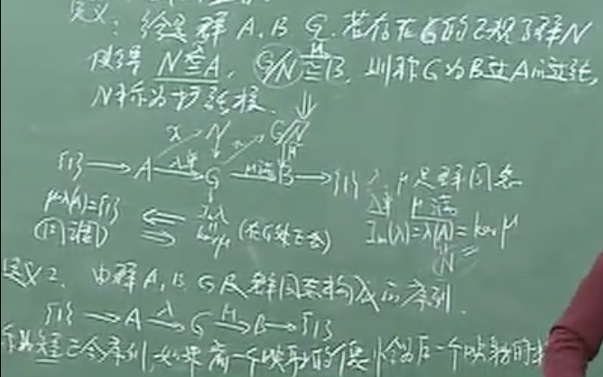
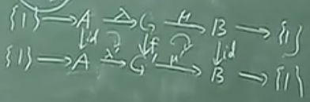
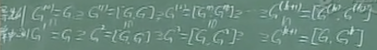
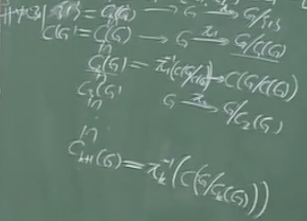
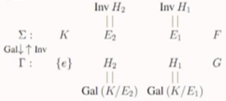
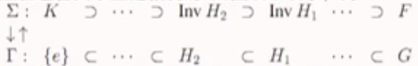

# 抽象代数

## 30-2-7环上的一元多项式2

定义2.7.1:元素a称为R上的代数元，如果存在R[x]上的非零多项式f(x)使得f(a)=0。否则称a为超越元。

可以这么看这个定义。如果有 $\phi:R[x]\rightarrow R_1$ ，它是个环同态。 $\phi(f(x))=f(a),\phi(R[x])=R[a]$ 。则 $ker\phi\not ={\{0\}}$ 表示a是代数元; $ker\phi=\{0\}$ 表示a是超越元。

命题4.7.3:若a是R上的超越元，则环R[a]与R上的多项式环R[x]同构。

现在我们给出环上多项式环的另一种定义。

定义2.7.2:设R为幺环且是环S的子环。如果在S中存在R上的超越元a使得S=R[a]，则称S为R上的一个多项式环。任何满足条件R[a]=S的元素s都称为S在R上的生成元。

定理2.7.4:设R为幺环，则R上的多项式环一定存在且R上任何两个多项式环都同构。

定理2.7.5:设 $R_1,R_2$ 为幺环。 $S_1$ 为 $R_1$ 上的一个多项式环，且 $x\in S_1$ 为一个生成元。若 $S_2$ 为幺环且包含 $R_2$ 作为其子环，且 $y\in S_2$ 。则任何 $R_1$ 到 $R_2$ 的满同态 $T_0$ 都可以唯一地扩充为 $S_1$ 到 $R_2[y]$ 的满同态T，使得T(x)=y。且T为同构当且仅当 $T_0$ 是同构且y是 $R_2$ 上的超越元。

推论2.7.6:设R是幺环， $S_1,S_2$ 是R上两个一元多项式环，分别以x，y为生成元。则存在唯一的 $S_1$ 到 $S_2$ 的环同构T，使得 $T|_R$ 为R上的恒等映射（称T为R-同构）。

这个推论其实是定理2.7.5的特殊情况。 $T_0=id$ 恒等映射： $R\rightarrow R$ 。 $S_1=R[x]$ 的所有R-同构构成群。

## 31-2-8整环上的多项式环1

假定R是一个整环，R上的一元多项式的次数和首项系数是有定义的。因此，如果S是R上的一个多项式环，则对任何S上的非零元素y，存在唯一的多项式 $f(x)\in R[x]$ 使得y=f(a)，这里a是S在R上的生成元。我们将f(x)的次数与首项系数称为y作为a的多项式的次数和首项系数。注意这样定义的次数和首项系数不但依赖y，而且依赖于生成元a。

定理2.8.1:设R是整环，S是R上的多项式环，生成元为a。设 $a'\in S$ 为非零元，a'作为a的多项式的次数为n。又设 $f(x)\in R[x]$ 为一个m次多项式。则f(a')作为a的多项式的次数是mn。a'也是S在R上的生成元的充分必要条件时a'作为a的多项式是线性的（即n=1）。而且其首项系数是R中的单位。这时S中的任何非零元作为a或a'的多项式具有相同的次数。

推论：设T是整环R上的多项式环R[x]的R-自同构（即 $T|_R=id$ ）。则 $T(x)=a_1x+a$ ，其中 $a_1$ 是R中的单位。反之，如果 $x'=a_1x+a$ ，且 $a_1$ 是单位，则存在唯一的R-自同构T使T(x)=x'。

下面介绍一下整环上的多项式的带余除法。

定理2.8.2:设R为整环，R[x]为R上的多项式环。设 $f(x),g(x)\in R[x]$ ，次数分别为m与n。令k=max(m-n+1,0)。设a为g(x)的首项系数，则存在多项式q(x),r(x)，使得 $a^kf(x)=q(x)g(x)+r(x)$ 。其中r(x)为零或者次数小于n。而且这样的q(x),r(x)是唯一的。

推论1（中国剩余定理最简单情形）:设 $a\in R$ 。则f(a)=0当且仅当x-a整除f(x)。

因为x-a次数为1，故存在q(x)及 $b\in R$ 使f(x)=q(x)(x-a)+b。因f(a)=b，故得结论。以后称满足f(a)=0d的元素a为f(x)的根。

推论2:设 $a_1,a_2,...,a_s$ 为f(x)的不同的根。则 $(x-a_1)(x-a_2)...(x-a_3)$ 整除f(x)，次数为m的多形式的不同根的个数最多为m。

## 32-2-8整环上的多项式环2

推论3:设F为域，则F[x]为欧几里得环。每个次数大于0的多项式 $f(x)\in F[x]$ 都可以分解成 $a\prod f_i(x)$ ，其中 $f_i(x)$ 是首一不可约多项式。上述分解出了顺序以外是唯一的。

证明只需做映射 $\sigma:F[x]-\{0\}\rightarrow N^{+}\cap \{0\},\sigma(f(x))=deg f(x)$

推论3说明任何域上的一元多项式环是唯一析因环。接下来的定理是它的推广。

定理2.8.3:设R为唯一析因环，则R上的一元多项式环R[x]也是唯一析因环。

一些证明需要的定义（证明今后我就不抄了，毕竟我看不懂抄了也没意思）。称一个非零多项式f(x)为本原的，如果f(x)的系数是互素的（即最大公因子为单位）。显然任意多项式f(x) $\not ={0}$ 都可以写成f(x)= $cf_1(x)$ 的形式，其中 $c\in R$ ，而 $f_1(x)$ 是本原多项式。只要取c为全部系数的最大公因子即可，上面的分解再相伴意义下是唯一的。我们称c为 $f_1(x)$ 的容度，记为c(f_1)。于是 $f_1(x)$ 是本原多项式当且仅当c(f)为单位。

引理2.8.4（Gauss引理）：设R为唯一析因环， $f(x),g(x)\in R[x]-\{0\}$ 。则c(fg)=c(f)c(g)（这里是容度）。特别地，两个本原多项式的乘积还是本原多项式（两种结论等价）。

引理2.8.5:如果g(x)整除bf(x)，其中 $b\in R^{\*}$ 且g(x)是本原多项式。则g(x)整除f(x)。

## 33-2-9多元多项式

定义2.9.1（多元多项式）：以下假定I是所有非负整数的集合， $I_n$ 是有序的n元非负整数序列的集合。对于(i)= $(i_1,i_2,...,i_n),(j)=(j_1,j_2,...,j_n)$ ，令(i)+(j)= $(i_1+j_1,i_2+j_2,...,i_n+j_n)$ 。设R为环，n为一个正整数，R上的一个n元多项式是指 $I_n$ 到R的一个映射f使f只在有限个点处的取值非零。如果f，g是两个n元多项式，定义h=f+g,k=f\*g为：

$h(i)=f(i)+g(i),k(i)=\Sigma _{(j)+(j')=(i)} f(j)\*g(j'),(i)\in I_n$

此处的映射表示一个多项式，(i)就表示一个n元项的各项次数。显然n=1时就是一元多项式的定义，则易见S在加法和乘法下构成一个环。设 $a\in R$ ，定义n元多项式 $f_a$ 使(i)=(0,0,...,0)时， $f_a(i)=a$ ；而 $(i)\not ={(0,0,...,0)}$ 时， $f_a(i)=0$ .于是 $f_0$ 是S的零元。如果R为幺环，1为单位元，则 $f_1$ 为S的单位元。又容易验证 $f_a+f_b=f_{a+b},f_a\*f_b=f_{ab}$ ,因此映射 $a\rightarrowtail f_a$ 是R到S的一个子环的同构。因此以后我们将a等同于 $f_a$ ，即，将R看成是S的子环。

现在我们引入另外一种n元多项式的记号。若 $1\leq v\leq n$ 为固定的整数，令 $j^{(v)}\in I_n$ 使 $j^{(v)}$ 的第v个整数为1，其余为0。再令 $x_v\in S$ 使 $x_v(j^{(v)})=1,x_v(i)=0,(i)\not ={j^{(v)}}$ 。容易看出，如果 $a\in R$ ，而 $i_1,i_2,...,i_n$ 是非负整数，则 $ax_1^{i_1}x_2^{i_2}...x_n^{i_n}$ 是S中这样的元素：其在 $(i_1,i_2,...,i_n)$ 处取值为a，而其余处取值为0。因此每个 $f\in S$ 都可以表达称有限个形如 $a_{(i)}x_1^{i_1}x_2^{i_2}...x_n^{i_n}$ 的元素的和。上面的这种元多项式称为单项式。因此以后我们将S记为 $R[x_1,x_2,...,x_n]$ 。

现在我们定义次数的概念。称单项式 $a_{(i)}x_1^{i_1}x_2^{i_2}...x_n^{i_n}(a_{(i)}\not ={0})$ 的次数为 $i_1+i_2+...+i_n$ 。若 $f\in R[x_1,x_2,...,x_n],f\not ={0}$ ，则称f中出现的单项式的次数的最大值为f的次数，记为deg f。如果f中所有单项式都有相同的次数，则称f为齐次多项式。如果f，g为齐次的，则fg或者为0或者为齐次的。

一个m次的多项式f可以唯一表示成 $f=f_0+f_1+...+f_m$ ，其中 $f_i$ 或为0或为i次的，而且 $f_m\not ={0}$ 。由此我们看出 $deg(fg)\leq deg(f)+deg(g)$ 。

定理2.9.1:设R为幺环，则R上的n元多项式环S是幺环，且R是S的子环。如果f，g是S中的非零元，则fg=0或deg(fg) $\leq$ deg f+deg g。如果R是整环，则S也是整环，而且对于非零多项式f，g，有deg(fg)=deg f+deg g。

与一元多项式类似，多元多项式也可以看作函数。设R为幺环，且是幺环 $R_1$ 的子环。则R上的任何n元多项式 $f(x_1,x_2,...,x_n)=\Sigma a_{(i)}x_1^{i_1}x_2^{i_2}...x_n^{i_n}$ 都可以看成是 $R_1$ 上取值在 $R_1$ 上的n元函数。即对于 $a_1,a_2,...,a_n\in R_1$ ，令 $f(a_1,a_2,...,a_n)=\Sigma a_{(i)}a_1^{i_1}a_2^{i_2}...a_n^{i_n}$ 称为f中用 $a_1$ 代替 $x_1,...,a_n$ 代替 $x_n$ 的结果。

对于固定的 $a_1,a_2,...,a_n$ ，映射 $f\rightarrowtail f(a_1,a_2,...a_n)$ 是 $R[x_1,x_2,...,x_n]$ 到 $R_1$ 的同态，其同态像记为 $R[a_1,a_2,...,a_n]$ ，它是 $R_1$ 中包含R与 $a_1,...,a_n$ 的最小子环。

定义2.9.2:元素 $a_1,a_2,...,a_n$ 称为在R上代数相关的，如果存在一个非零的n元多项式f使得 $f(a_1,a_2,...,a_n)=0$ 。否则称为代数无关的。

定义2.9.3:设R为幺环且是幺环 $R_1$ 的子环。称 $R_1$ 为R上的一个多项式环，如果存在 $R_1$ 中的代数无关元素 $a_1,a_2,...,a_n$ 使得 $R_1=R[a_1,a_2,...,a_n]$ 。任何满足上述条件的集合 $\{a_1,a_2,...,a_n\}$ 都称为一个生成元集。一般称 $R_1$ 为R上的 $a_1,a_2,...,a_n$ 多项式环。

根据定义， $R_1$ 是R上的多项式环当且仅当存在 $R[x_1,x_2,..,x_n]$ 到 $R_1$ 上的R-同构。特别的， $R[x_1,x_2,..,x_n]$ 本身是R上的多项式环。下面证明多项式环的唯一性，为此先给出下面的引理。

引理2.9.2:设R为幺环，且为幺环 $R_2$ 的子环。 $a_1,a_2,...,a_n\in R_2$ 且n大于1。令 $R_1=R[a_1,a_2,...,a_{n-1}]$ ，则 $R_2$ 是R上 $a_1,a_2,...,a_{n-1}$ 的多项式环当且仅当 $R_1$ 是R上 $a_1,a_2,...,a_{n-1}$ 的多项式环而且 $R_2$ 是 $R_1$ 上 $a_n$ 的多项式环。

定理2.9.3:设 $R_1$ 是幺环R上的 $a_1,a_2,...,a_n$ 的多项式环。设 $\overline{R}$ 为幺环且是幺环 $\overline{R_1}$ 的子环。又 $b_1,b_2,...,b_n\in \overline{R_1}$ 。则任何R到 $\overline{R}$ 上的满同态 $T_0$ 可以唯一地扩充为 $R_1$ 到 $\overline{R}[b_1,b_2,...,b_n]$ 的满同态T使得 $T(a_i)=b_i$ ，而且T是同构当且仅当 $T_0$ 是同构且 $b_1,b_2,...,b_n$ 是R上代数无关的。

推论1:设 $R_1,R_2$ 分别是R的 $a_1,a_2,...a_n$ 和 $b_1,b_2,...,b_n$ 的多项式环，则存在唯一的 $R_1$ 到 $R_2$ 的R-同构T使 $T(a_i)=b_i$ 。

推论2:设 $R_1$ 是环R上 $a_1,a_2,...,a_n$ 的多项式环。 $\sigma$ 是一个n元置换。则存在唯一的 $R_1$ 的R-自同构T使得 $T(a_i)=a_{\sigma(i)}$

定理2.9.4:唯一析因环上的n元多项式环也是唯一析因环。

定理2.9.5:设R为整环， $f(x_1,x_2,...,x_n)\not ={0}$ 是R上的n元多项式。又Q是R中的一个无限子集。则必存在 $a_1,a_2,...,a_n\in Q$ 使得 $f(a_1,a_2,...,a_n)\not ={0}$ 。

## 34-2-10对称多项式

定义2.10.1:多项式 $f(x_1,x_2,...,x_n)$ 称为对称的，如果对任何 $\sigma\in S_n$ ，有 $\sigma^{\*}(f)=f$ 。

显然，如果f，g是对称多项式，则f+g，fg也是。因此对所有对称多项式的集合构成 $R[x_1,x_2,...,x_n]$ 的一个子环 $S[x_1,x_2,...,x_n]$ 。显然 $R\in S[x_1,x_2,...,x_n]$ 。

例：设

$p_1=x_1+x_2+...+x_n$ 
$p_2=x_1x_2+...+x_1x_n+x_2x_3+...=\Sigma _{i\< j}x_ix_j$ 
$p_3=\Sigma _{i \< j \< k} x_ix_jx_k$ 
$p_n=x_1x_2...x_n$

这n个多项式都是对称多项式，称为初等对称多项式。

定理2.10.1（对称多项式基本定理）：初等对称多项式 $p_1,p_2,...,p_n$ 在R上代数无关，而且 $S[x_1,x_2,...,x_n]=R[p_1,p_2,...,p_n]$ .换言之，每个对称多项式都可以唯一地表示成初等对称多项式的多项式。

例：将整数环上的3元齐次多项式 $x_1^3+x_2^3+x_3^3$ 写成初等对称多项式的多项式。

解：由于 $x_1^3+x_2^3+x_3^3$ 的最高项为 $x_1^3$ ，故先令

$g_1=(x_1^3+x_2^3+x_3^3)-p_1^3=-3(x_1^2x_2+x_2^2x_1+...)-6x_1x_2x_3$

$g_1$ 的最高项为 $-3x_1^2x_2$ ，故再令：

$g_2=g_1-(-3p_1p_2)=3x_1x_2x_3=3p_3$

因此， $x_1^3+x_2^3+x_3^3=p_1^3-3p_1p_2+3p_3$

## 35-3-1域的基本概念1

子域定义：设E为域， $F\subseteq E$ 。称F为E的子域，如果E中加法、乘法限制到F上成一个域（F为E的子环，且F中非零元的逆都在F中）。称E为F的扩张（扩域）。

域同态定义：设E，F为域，映射 $\phi:F\rightarrow E$ 称为域同态，若 $\forall\alpha,\beta\in F,\phi(\alpha+\beta)=\phi(\alpha)+\phi(\beta),\phi(\alpha\beta)=\phi(\alpha)\phi(\beta),\phi(1)=1$ 。等号左边的 $\alpha,\beta$ 在F里，右边的在E里，即“保留加乘法”。1表示单位元。

引理： $\phi:F\rightarrow E$ 为域同态，则 $\phi$ 为单射。 $Im\phi=\phi(F)$ 是E的一个子域，且F同构于E的一个子域。

若域同态 $\phi:F\rightarrow E$ 是满射，则称 $\phi$ 为F到E的域同构。（域同态已经表明单射，再加个满射就是双射，于是就是同构了）称F与E同构，记为 $F\simeq E$ 。

命题：E的任意多个子域的交仍是E的子域。

素域定义：E的所有子域的交是E的唯一的最小子域，称为E的素域。域 $\pi$ 称为子域，若 $\pi$ 中没有非平凡子域。

定义映射 $\phi:Z\rightarrow \pi(n\rightarrow n\*1)$ （Z里面的n个1相加映射到 $\pi$ 里面的n个1相加）。易证 $\phi$ 是一个环同态。

## 36-3-1域的基本概念2

延续上节课 $\phi$ 是一个环同态的话题。它的核有两种情况。
1. $ker\phi=\{0\}$ 。

$\phi$ 可延拓为 $\overline{\phi}:Q\rightarrow \pi,\frac{n}{m}\rightarrow\frac{n\*1}{m\*1}=(n-1)(m-1)^{-1},m\not ={0}$ . $overline{\phi}$ 是一个域同态。则 $Q\simeq\overline{\phi(Q)}=\pi$

2. $ker\phi\not ={0},ker\phi$ 为Z的理想 $\rightarrow ker\phi$ 是Z的极大理想 $\rightarrow Im\phi$ 是 $\pi$ 的子域， $Im\phi\simeq \pi\simeq Z/ker\phi$

定理：Q，Z/< p >(p为素数)为素域，且任何素域必同构原Q或Z/< p >

定义：若域E的素域同构于Q，称E的特征为零(chE=0)；域E的素域同构于Z/< p >，称E的特征为p(chE=p)

命题: $I=\{n\in Z|n\*a=0,\forall a\in E^{\*}\}=\{n\in Z|n\*1=0\}$ 。那么 $chE=0\Leftrightarrow I=$ < 0 >; $chE=p\Leftrightarrow I=$ < p >

设F为E的子域，则E可看作F上的线性空间。此时有定义：E作为F上线性空间的维数称为E的扩张次数，记为[E:F]。若[E:F]是有限的，称E为F的有限扩张；否则称E为F的无限扩张。

定理：设K为E的扩张，E为F的扩张（K也是F的扩张）。则[K:F]=[K:E]\*[E:F]

## 37-3-2域的单扩张1

分式域定义：有交换整环R。若 $R\subset F$ (域)，且F中任何元素都可写成 $ab^{-1}(\frac{a}{b})=(a,b),a,b\in R,b\not ={0}$ 。则称F为R的分式域。

比如Q为Z的分式域,有 $\frac{2}{4},\frac{1}{2}$ 。两者明显相同。考虑 $R\times R^{\*}=\{(a,b)|a,b\in R,b\not ={0}\}$ ，称(a,b)～(c,d)若ad=bc。可以验证～是等价关系。进一步定义运算，(a,b)+(c,d)=(ad+bc,bd),正是平时使用的通分。(a,b)(c,d)=(ac,bd)。定义磨去等价关系的F= $R\times R^{\*}/～$ ，F为域。刚刚定义的运算都可以拿上来。加法的单位元为(0,1)，乘法的单位元为(1,1)。R是F的子环，故为分式域。

定理：设R为交换整环，则在同构意义上存在唯一的域F使得F为R的分式域。

## 38-3-2域的单扩张2

命题1： $S\subset E$ ,E是F的扩张, $s'\subset s$ 为有限子集。容易看出 $F(S')\subseteq F(S)$ 。如果把所有有限个F(S')并起来，结果为 $F(S)=\cup F(S'),S'\subset S$ 为有限。

命题2: $F(s)=F(s_1\cup s_2)=F(s_1)(s_2)=F(s_2)(s_1)$

推论：假如 $s=\{\alpha_1,...,\alpha_n\}$ ,则F(s)= $F(\alpha_1,...,\alpha_n)=F(\alpha_1)(\alpha_2)...(\alpha_n)$ 。有限扩张可以分为若干个单扩张。

定义：设K为F的扩张， $\alpha\in K$ 。对于 $F(\alpha)$ ,称 $\alpha$ 为超越元，若 $F(\alpha)\simeq F(x)$ 。称 $\alpha$ 为代数元，若 $F(\alpha)\simeq F[x]/$ < p[x] > .

把定义整理一下再看：K/F， $\alpha\in K$ 。称 $\alpha$ 是代数元，若存在非零多项式 $p(x)\in F[x]$ 使得 $p(\alpha)=0$ 。否则称 $\alpha$ 为超越元。 $\alpha$ 是代数元 $\Leftrightarrow [F(\alpha):F]$ < $\infty$ ,称 $F(\alpha)$ 为单代数扩张。 $\alpha$ 是超越元 $\Leftrightarrow [F(\alpha):F]=\infty$ ，称 $F(\alpha)$ 为单超越扩张。

命题： $[F(\alpha):F]=deg p(x)=deg(Irr(\alpha,F))$ 。 $Irr(\alpha,F)$ 表示 $\alpha$ 在F上的[最小多项式](https://zh.wikipedia.org/zh-cn/%E6%A5%B5%E5%B0%8F%E5%A4%9A%E9%A0%85%E5%BC%8F)。 $F(\alpha)$ 的一组F-基为 $1,\alpha,...\alpha^{n-1}$ .

命题：任何两个F单超越扩张同构。 $F(\alpha)\rightarrow^{\phi}F(\beta),\phi$ 为F-线性。

设 $k_1/F,k_2/F$ 为F的两个扩张。若有映射 $\phi:k_1\rightarrow k_2$ 是域同构且 $\phi|F=id_F$ ，则称 $k_1/F,k_2/F$ 为F的等价扩张。这个条件比同构还要严格。

## 39-3-3域的代数扩张1

代数基本定理：任何一个复系多项式f(x)(def f(x) $\geq$ 1)d都有至少一个复根。

定义：设E为F的扩张。称E为F的代数扩张，若E中任何一个元素都是F上的代数元。否则称E为F的超越扩张（E中至少含有一个超越元）。

定理：若E/F为有限扩张，则E/F为代数扩张。

证明前先看推论： 
1. $E=F(\alpha)$ ( $\alpha\in E/F$ 为F上代数元)。则 $F(\alpha)/F$ 为代数扩张。
2. $E=F(\alpha_1,...,\alpha_n)$ ( $\alpha_1,...,\alpha_n$ )为F上代数元。则 $F(\alpha_1,...,\alpha_n)/F$ 为代数扩张。

证明：对于 $[E:F]$ < $\infty$ ，需证明E中任何元 $\alpha$ 一定是F上代数元，即存在 $f(x\not ={0})=x^n+ax^{n-1}+...+a_n\in F[x]$ 使得 $f(\alpha)=0$ ,或者说 $\alpha^n+a_1\alpha^{n-1}+...+a_n\*1=0$ ，需证明存在n使得 $1,\alpha,...,\alpha^n$ 在F上线性相关。若不存在，则 $1,\alpha,...,\alpha^n$ 线性无关即 $\alpha$ 是F上超越元， $F(\alpha)/F$ 为超越扩张， [E:F] < $[F(\alpha):F]=\infty$ 。由于子空间的维数不可能大于全空间的位数，故矛盾。

命题：有E/F。令k= { $\alpha\in E|\alpha$ 为F上代数元}。则k为E的一个子域（ $F\subseteq k\subseteq E$ ），称为F在E中的代数闭包。

了解另外一个命题对证明上面的命题有帮助：有E/F。 $\alpha,\beta\in E$ 为F-代数元。则 $\alpha\pm\beta,\alpha\*\beta,\alpha/\beta(\beta\not ={0})$ 都是代数元。

## 40-3-3域的代数扩张2

定理：E/K和K/F都是代数扩张，则E/F也是代数扩张。

定义：称域E为代数闭域，若E上任何一个不可约多项式都是一次的。（或E中任何f(x),deg f(x) $\geq 0$ 都在E中分裂）

## 41-3-4 Galois群1

定义：有E/F，Gal(E/F)={ $\sigma\in Aut(E)|\sigma|_F=id_F$ } $\subset GL(E/F)（\subset Aut(E)）$ .称E/F为Galois群。

引理：假设E为一个域， $\Pi$ 为E的素域。则 $E/\Pi=Aut(E)$ 

例： 
1. $Q(\sqrt{2})/Q$ ，基为1和 $\sqrt{2}$ 。 $Gal(Q(\sqrt{2})/Q)=Aut(Q(\sqrt{2}))=\{id,\tau\}\simeq Z/2Z.\tau^2=id$
2. $Q(\sqrt[3]{2})/Q$ ，基为 $1,\sqrt[3]{2},\sqrt[3]{4}$ 。 $\sigma\in Gal(Q(\sqrt[3]{2})/Q)$ ={id}。这点可以通过计算得出： $\sigma(1)=1$ ，而 $\sigma(\sqrt[3]{2})=a,\sigma(\sqrt[3]{2^2})=a^2$ ，其中a未知，需要推算。 $\sigma(\sqrt[3]{2})^3=\sigma(2)=2$ ，于是有 $(\sigma(\sqrt[3]{2}))^3=2\rightarrow\sigma(\sqrt[3]{2})$ 。这里相当于考虑方程 $x^3=2$ ，得出 $\sigma(\sqrt[3]{2})=\sqrt[3]{2}$ 或 $\sqrt[3]{2} \omega$ 或 $\sqrt[3]{2} \omega^2$ ，其中 $\omega$ =[三次单位根](https://zh.wikipedia.org/wiki/%E5%8D%95%E4%BD%8D%E6%A0%B9)。但是后两个结果都不是自同构，于是只能为本身。

从以上两个例子可以看出一个引理：假设E/F为有限扩张，G=Gal(E/F)。那么 $|G|\leq [E:F]$

引理：任取m个互不相同元素 $\sigma_1,...,\sigma_m\in Gal(E/F)$ ，则若 $(b_1\sigma_1+...+b_n\sigma_n)(\alpha)=0,\forall\alpha\in E\Rightarrow b_i=0$ 。

## 42-3-4 Galois群2

定义：令G < Gal(E/F)， $F\subseteq E^G=\{\alpha\in E|\sigma(\alpha)=\alpha,\alpha\in G\}$ 。称 $E^G$ 为G的不变子域。

引理：G < Aut(E)的有限子群，则n=[E:F] $\leq$ |G|=m。 $G\subseteq Gal(E/F),F=E^G$

推论：G < Aut(E)的有限子群。则[E:F]=|G|。 $|G|\leq |Gal(E/F)|\leq[E:F]=[E:E^G]\leq |G|$

定义：若|Gal(E/F)|=[E:F](<  $\infty$ )=G < Aut(E), $F=E^G$ ，则称E/F为Galois扩张（有限）。

定义：若任何m次不可约多项式 $f(x)\in F[x]$ 在E中若有一个根，则必有m个根，f(x)在E[x]中可分解为一次因式乘积。称f(x)在E中分裂，E/F为正规扩张。

定义：E/F为有限扩张，若 $\exists f(x)\in F[x]$ 使得f(x)在E中分裂,根为 $\alpha_1...\alpha_n$ 。且 $E=F(\alpha_1...\alpha_n)$ 。称E/F为f(x)的分裂域。

设E/F为一个扩张，E/F为Galois扩张 $\Leftrightarrow \exists G$ < Aut(E)为有限子群，使得 $F=E^G$ $\Leftrightarrow$ E/F位有限（可分）正规扩张 $\Leftrightarrow$ E/F为F上某个可分多项式的分裂域。可分指的是多项式没有重复的根。

## 43-3-5 多项式的分裂域1

E/F为有限扩张，Gal(E/F)={ $\sigma\in Aut(E)|\sigma|_F=id_F$ }。我们知道|Gal(E/F)| $\leq$ [E:F],不过等号成立 $\Leftrightarrow F=\{\alpha\in E|\sigma(\alpha)=\alpha,\forall \sigma\in Gal(E/F)\}=E^{Gal(E/F)}$ 。此时称E/F位有限Galois扩张。

E/F为代数扩张，称E/F为正规扩张，若任意不可约多项式 $p(x)\in F[x]$ ，在E中有一个根，则p(x)在E[x]中可分解为一次因式（不一定要不同）乘积。称p(x)在E中分裂。

定义：设E/F为有限扩张。若存在 $f(x)\in F[x]$ 使得f(x)在E中分裂： $f(x)=(x-\alpha_1)...(x-\alpha_n)\in E[x]$ 。且 $E=F(\alpha_1,...,\alpha_n)$ 。很多情况下不需要添完所有的根，因为有些根可以利用之前已有的根生成。称E为f(x)的分裂域。

有4个命题。当E/F为有限扩张：
1. E/F为Galois扩张
2. $\forall G$ < Aut(E)，有限，使得 $F=E^G$ 。此时G=Gal(E/F)
3. E/F为有限可分正规扩张
4. E为F中某个可分多项式的分裂域

它们之间的关系是： $1\Leftrightarrow 2\Rightarrow 3\Rightarrow 4\Rightarrow 1$

引理： $\forall f(x)\in F[x].\exists E/F$ 使得f(x)在E中有一个根 $\alpha$ 。 $(x-\alpha)\in E[x]|f(x),f(x)=(x-\alpha)f_1(x)\in E[x]$

## 44-3-5 多项式的分裂域2

命题：设 $E,\overline{E}$ 为 $f(x)\in F[x]$ 的两个分裂域，则存在 $\sigma:E\rightarrow \overline{E}$ 为域同构满足 $\sigma|_F=id_F$ 。不同的 $\sigma$ 的个数小于等于[E:F]，等号成立 $\Leftrightarrow$ f(x)的不可约因式无重根。

定义：设 $f(x)\in F[x]$ 。若f(x)的每一个不可约因式都无重根，则称f(x)可分。

推论：设E为 $f(x)\in F[x]$ 的分裂域。则 $|Gal(E/F)|\leq [E:F]$ 。等号成立 $\Leftrightarrow$ f(x)可分。

定义：E/F为代数扩张。 $\forall\alpha\in E$ ，若 $Irr(\alpha,F)$ 可分，则称 $\alpha$ 为F上的可分元，否则称 $\alpha$ 为不可分元。称E/F为可分扩张，若E中任何元素在F上可分。

定理：E/F为代数扩张。则E/F为正规扩张 $\Leftrightarrow$ E/F为F上某个多项式的分裂域。

引理：假设 $F\subseteq E\subseteq K$ ,E/F为 $f(x)\in F[x]$ 的分裂域（ $E=F(\alpha_1...\alpha_n),f(\alpha_i)=0$ ）。 $\forall\tau\in Gal(K/F),\tau(E)=E,\tau\in Gal(E/F),\tau|_F=id_F$ . $f(\alpha_1)=0\Rightarrow f(\tau\alpha_1)=0$ . $\tau(E)=\tau(F(\alpha_1...\alpha_n))=F(\tau(\alpha_1)...\tau(\alpha_n))\subseteq E$

## 45-3-6 域的可分扩张1

定理：E/F为有限扩张，则E/F为正规扩张 $\Leftrightarrow$ E为F上一个多项式的分裂域

定义： 

1. $p(x)\in F[x]$ 且不可约。称p(x)可分，若p(x)在其分裂域上无重根。称 $f(x)\in F[x]$ 可分，若f(x)的所有不可约因式可分。
2. E/F为代数扩张，若 $\forall \alpha\in E,\exists\space Irr(\alpha,F)\in F[x]$ 。称 $\alpha$ 可分若 $Irr(\alpha,F)$ 可分。否则称 $\alpha$ 不可分。
3. 称E/F为可分扩张，若E中任何元素都在F上可分。否则称E/F不可分。
4. $f(x)\in F[x].f(x)=a_nx^n+a_{n-1}x^{n-1}+...+a_1x+a_0$ 。定义f(x)的形式微商 $f'(x)=D\space f(x)=na_nx^{n-1}+(n-1)a_{n-1}x^{n-2}+...+a_1$

性质： $D:F[x]\rightarrow F[x]$

1. D是线性变换。 $D(kf(x)+lg(x))=kDf(x)+lDg(x)$
2. D(x)=1,D(c)=0, $c\in F$
3. D(f(x)g(x))=(Df(x))g(x)+f(x) Dg(x)

这个D和微积分里的导数很像。

定理：设f(x)不可约，f'(x)等同于上面定义。则f(x)无重根 $\Leftrightarrow$ gcd(f(x),f'(x))=1。f(x)有重根 $\Rightarrow$ gcd(f(x),f'(x)) $\not ={1}\Rightarrow f(x)|f'(x)\Rightarrow f'(x)=0$

## 46-3-6 域的可分扩张2

定理： $p(x)\in F[x]$ 不可约。
1. p(x)不可分，则p'(x)=0
2. $\exists h(x)\in F[x]$ 是可分不可约多项式，使得 $p(x)=h(x^p)$

引理：若ch F=0，则任何 $f(x)\in F[x]$ 可分。

命题：若ch F=p且 $F=F^p$ ，则F上任何多项式可分。

推论：若F为有限域，则 $F=F^p$ ，即F上任何多项式可分。

定义：F为完备域，若F上任何多项式都可分。

命题：若F完备，则F上任何代数扩张都是可分扩张

命题：特征为零的域都是完备的。有限域都是完备的。

推论：完备域的代数扩张是完备域。

命题：设 $f(x)\in F[x]$ 可分，E为f(x)的分裂域。则E/F是可分扩张（正规）。

定理： $E=F(\alpha_1...\alpha_n),\alpha_i$ 可分。则E/F为可分扩张。

## 47-3-6 域的可分扩张3

定理：E为完备域 $\Leftrightarrow chE=0$ 或 chE=p. $E=E^p=\{\alpha^p|\alpha\in E\}$

E/F， $\alpha\in E.Irr(\alpha,F)=f(x)\in F[x]$ 可分 $\Rightarrow F(\alpha)/F$ 为可分扩张。

命题：设不可约 $f(x)\in F[x]$ 的一个分裂域为E， $\alpha\in E$ 为f(x)的一个根。定义映射 $\phi$ ，使 $F(\alpha)\rightarrow E$ （恒等映射）。或者不是恒等映射，使 $\alpha\rightarrow\beta$ ,只要 $\beta$ 为 $f(\alpha)$ 的根。这两种映射统称为I，则 $|I|\leq deg\space f(x)$ ，等号成立 $\Leftrightarrow f(x)$ 可分。

定理：chF=p. $F(\alpha)/F$ 为单代数扩张。则 $F(\alpha)$ 可分 $\Leftrightarrow F(\alpha)=F(\alpha^p)$

定理：设 $E=F(\alpha_1...\alpha_n)$ 为F的可分扩张，则 $\exists\theta\in E$ 使得 $E=F(\theta)$

## 48-3-6 域的可分扩张4

定理：可分扩张的可分扩张也是可分扩张。即 $F\subseteq K\subseteq E,K/F,E/K$ 可分 $\Leftrightarrow E/F$ 可分。

引理： $F(\beta)/F$ 可分且 $F(\beta)(\alpha)/F(\beta)$ 可分。则 $F(\beta,\alpha)/F$ 可分。

定理：E为有限域。 $E^{\*\}=$ E/{0} 为交换群（循环群）

## 49-4-1 群的生成元组1

有群G，其非空子集 $S\subseteq G$ 。S生成的群 $\triangleq$ G的包含S的最小子群 $\triangleq$ G中包含S的子群之交。由S生成的子群记为 < S > = $\{x_1x_2...x_n|x_i\in S\cup S^{-1},m\in N\}$ (m有限)

定义4.1.1:若群G中子集S使 G = < S >,则称S为群G的生成元组。

定义4.1.2:若群G中存在有限子集S，使G = < S >，则称G为有限生成群。

有限生成群不一定是有限群。例如G={Z;+}（整数加群），G = < {1} > = < 1 >。

## 50-4-1 群的生成元组2

有置换 $S_n,n\geq 3,|S_n|=n!$ 。该群内的元素非常多，如果我们能找到其生成元组则能更容易研究该群的性质。 $S_n$ 可由所有轮换生成。若有 $\sigma\in S_n$ ，若存在 $i_1,i_2,...,i_r\in \{1,...,n\}.\sigma(i_1)=i_2,\sigma(i_2)=i_3,...,\sigma(i_{r-1})=i_r,\sigma(i_r)=i_1$ 。注意r是n中的一部分，那么剩下的 $\sigma(k)=k,\forall k\notin \{i_1,i_2...i_r\}$ 。则称 $\sigma$ 为一个r-轮换，记为 $\sigma=(i_1i_2...i_r)$ （次序不重要，写成 $(i_2...i_ri_1)$ 也是同一个轮换。

有两个轮换 $\sigma=(i_1i_2...i_r),\tau=(j_1j_2...j_s)$ 。称 $\sigma$ 与 $\tau$ 不相交，若 $\{i_1i_2...i_r\}\cap \{j_1j_2...j_s\}=\emptyset$ 。此时两者交换， $\sigma\tau=\tau\sigma$

定理4.1.1:任何置换都可以写成不相交的轮换的积。若不计次序，写法唯一。

定理4.1.2: $S_n=$ <{ $(1\space i)|2\leq i\leq n$ }>

设G为群，H < G, $H\not ={G}$ 。令S=G｜H（G-H）={ $g\in G|g\notin H$ }。则< S > =G

$S_n=$ <{(1 2),(2 3),...,(n-1 n)}>

## 51-4-2群在集合上的作用1

设G为一个群，Z为非空集合。若存在 $f:G\times Z\rightarrow Z(g\in G,x\in Z;(g,x)\rightarrow f(g,x)(=\pi(g)))$ 满足：
1. f(1,x)=x,1为G中单位
2. $f(g_1g_2,x)=f(g_1,f(g_2,x)),\forall x\in Z,g_1,g_2\in G$

则称f决定了G在Z上的一个作用。

命题：{ $f:G\times Z\rightarrow Z|$ f为G在Z上的作用} $\leftrightarrow$ { $\pi:G\rightarrow S_z|\pi$ 为群同态}。两者一一对应，意味着我们可以从一个作用得到一个群同态，从那个群同态也能得到刚才的作用。

作用例子：有H < G,G/H有左陪集。 $g_1,g_2\in G,g_2H\rightarrow$ $g_1g_2H$ (作用 $g_1$ ); $g_1H\rightarrow$ $g_2g_1H$ (作用 $g_2.g_1H=\{g_1h|h\in H\};g_2g_1H=\{g_2g_1h|h\in H\}$ ).定义G在G/H上的左平移作 $G\times G/H\rightarrow G/H((g,g_1H)\rightarrow (gg_1)H)$ 。群同态为 $\pi:G\rightarrow S_{G/H}$

## 52-4-2群在集合上的作用2

定义：
1. 如果 $\forall x,y\in X,\exists g\in G$ 使得y=gx。则称作用是可逆的。
2. 若 $g\in G,\sigma_g(x)=f(g,x)=x,\forall x\in Z\Rightarrow g=1$ 。则称作用是有效的。
3. 若 $\forall g\in G,x\in X,f(g,x)=x$ 。则称作用平凡。

命题：G在X上作用有效 $\Leftrightarrow\pi_f$ 是单射。

## 53-4-2群在集合上的作用3

定义： $\forall x\in X$ ,称 $O_x=\{gx|g\in G\}$ 为x的轨道。

$\sigma^{-1}(x)=\{g\in G|gx=x\}=F_x$ 是G的一个子群，称为x的迷向子群。

引理：
1. $O_x$ 在G作用下不变。
2. $\forall x,y\in X$ ,则 $O_x=O_y$ 或 $O_x\cap O_y=\emptyset$ 。则X是一些不相同的轨道的不交并。所有不相同的轨道形成X的一个划分。
3. G在 $O_x$ 上作用是可逆的。G在X上作用可逆 $\Leftrightarrow$ X是一个单轨道。
4. G在 $O_x$ 上作用有效当且仅当 $F_x$ 中所包含的G的正规子群仅为{e}
5. G在X上作用可逆，则 $X=O_x=O_y,\forall x,y\in Z$ 。设 $y=g_0x$ ,则 $F_y=g_0F_xg^{-1}$ (共轭)

## 54-4-2群在集合上的作用4

定义：设G作用在X与X'上，若存在X到X'的一一对应 $\sigma$ ,满足 $\forall g\in G,x\in X,\sigma(gx)=g\sigma(x)$ 。称G在X与X'的作用等价。

设G在X上的作用可逆， $\forall x\in X$ 。则G在X上的作用与G在 $G/F_x$ 的作用等价。

例如G在G上的左平移作用和G在G上的右平移作用是等价的。

G在G上伴随作用： $g\in G,C_g=\{hgh^{-1}|h\in G\}$ 称为共轭类。 $C(g)=\{h\in G|hgh^{-1}=g\}=\{h\in G|hg=gh\}$ 称为中心化子。

有 $ad:G\rightarrow Int(G)=ad\space G.g\rightarrow ad\space g$ 。则 $C(G)=ker\space ad=\{h\in G|hg=gh,\forall g\in G\}$ ，称为中心。 $G/C(G)\simeq ad\space G$

G有限，设 $x...x_n$ 为G的所有不同共轭类的代表元。 $G=\cup{n}_{i=1}\space C_{x_i}$ . $|G|=\Sigma_{i=1}^{n}|C_{x_i}|=\frac{n}{2}_{i=1}\frac{|G|}{|C(X_i)|}.C_{X_i}～G/C(X_i)$ 

## 55-4-3 Sylow子群1

Cauchy定理：若p为素数，p||G|.则存在子群H使得|H|=p

定义：若 $|G|=p^k$ ，则称G为一个p-群（p为素数）

引理：设p-群G作用在X上。定义 $X_0=\{x\in X|gx=gx\space\forall g\in G\}$ .则：
1. $|X|\equiv|X_0|(\mod p)$
2. gcd(|X|,p)=1,则 $|X_0|\geq 1$
3. G伴随作用在G上。则 $C(G)\not ={\{1\}}$

Sylow第一定理：设 $|G|=p^l\*m.gcd(p,m)=1,l\geq 1$ 。则对任何 $1\leq k\leq l$ ,存在G的 $p^k$ 阶子群。 

## 56-4-3 Sylow子群2

定义： $|G|=p^l\*m,gcd(p,m)=1,l\geq 1$ 。则称G的 $p^l$ 阶子群为G的Sylow子群。

Sylow第二定理：
1. H < G, $|G|=p^l\*m,|H|=p^k$ 。则 $\exists G$ 的Sylow子群p使得 $H \subset gPg^{-1}$ (共轭子群)
2. G的所有Sylow p-子群是共轭的。即在共轭意义下，Sylow p-子群唯一。

Sylow第三定理：设G的Sylow p-子群有k个，则：
1. k|m, $k\equiv 1\mod p$
2. k=1 $\Leftrightarrow P\lhd G$

## 57-4-4 有限单群1

定义：设G为一个有限群。称G为（有限）单群，如果G只有{1}和G两个正规子群。

定理：设G为交换群，（|G|< $\infty$ ）。则G为单群 $\Leftrightarrow$ |G|=p,p为素数

## 58-4-4 有限单群2

命题：设q是|G|的因子中最小的，若H < G,[G:H]=q,则 $H\lhd G$

推论：|G|= $p^lq$ ，p和q均为素数，p > q.则G的sylow p-子群指数为q，为正规子群。

命题：|G|= $p^lm$ ,m < p（p+1 < m < 2p）。则G的sylow p-子群正规，G不是单群。

命题：|G|=pq, p > q， $q\not|p-1$ 。则Sylow q-子群的个数为1.

定理：|G| < 60,则G不是非Abel单群。

Feit–Thompson定理：任何奇数阶群都不是非Abel单群。

|G|=2k,k为奇数，则G有一个质数为2的（正规）子群

G为p-群，则G不是非Abel单群。

## 59-4-4 有限单群3

定理： $A_n(n\geq 5)$ 都是单群。

## 60-4-5 群的直积1

定义：给定群A，B，G。若存在G的正规子群N使得 $N\simeq A,G/N\simeq B$ ，则称G为B过A的扩张，N称为扩张模。

定义2:由群A，B，G及群同态构成的序列 $\{1\}\rightarrow A\rightarrow^{\lambda}G\rightarrow^{\mu} B\rightarrow \{1\}$ 称为短正合序列，如果前一个映射的像恰为后一个映射的核。

两个定义其实本质上是一样的，参考下方的图。可以说有扩张就有正合列，有正合列就有扩张。

设A，B，G，G'为群。
1. 若G为B过A的扩张， $G\simeq G'$ ，则G'也是B过A的扩张。
2. 若G，G'都是B过A的扩张且存在 $f:G\rightarrow G'$ (群同态)使下图为交换图，则f是群同构。

交换图指: $A\rightarrow A\rightarrow G'=A\rightarrow G\rightarrow G'$ , $G\rightarrow B\rightarrow B=G\rightarrow G'\rightarrow B$

## 61-4-5 群的直积2

以下 $N,A,B,\mu$ 的定义均与上一节正合列里的定义相同。

定义：若在G中存在子群H，使得 $H\cap N=\{1\}$ (平凡元)， $HN=\{hn|h\in H,n\in N\}=G$ 。则称G是H与N的半直积（非本质扩张），记为 $G=H\ltimes N(N\rtimes H)$ 或 $G=B\ltimes A$ 

定义2：若存在 $\eta:B\rightarrow G$ 群同态满足 $\eta(B)\cap N=\{1\}$ 且合成映射 $\mu\eta:B\rightarrow G\rightarrow B$ 为恒等映射。( $\eta(B)=H$ < G, $H\cap N=\{1\},HN=G.\eta(B)\simeq B$)

前两个定义是等价的。只不过一个找子群，一个找同态。

定义： $\mu|_H:H\rightarrow B$

引理： $\mu|_H$ 为群同态。

定义：如果上述的H是G的正规子群，则称G为H与N的（内）直积(平凡扩张)，记为 $G=H\times N$ .至于为什么这回没有“半”了，因为若 $\forall h\in H,n\in N,hn=nh\Rightarrow H\lhd G$ 。重点在于hn=nh，半直积里面就不一定了。

## 62-4-5 群的直积3

定理：任给群A，B，存在唯一B过A的平凡扩张。

## 63-4-6 可解群与幂零群1

总结一下找群G的正规子群的方法。
1. C(G)。若不是平凡的，即为G的正规子群。
2. Sylow定理。注意Sylow定理也可能找出非正规子群。
3. 同态核。建立群同态 $\pi:G\rightarrow B$ 。若此同态不是单射也非平凡，核就是G的正规子群。

定义：
1. 设G为一个群， $\forall h,k\in G$ ，称 $[h,k]=h^{-1}k^{-1}hk$ 为h，k的换位子。
2. 若有H,K < G,考虑< $\{h^{-1}k^{-1}hk|h\in H,k\in K\}$ >,称为H与K的换位子群。记为[H,K]

[h,k]有以下特点：
1. $[h,k]=1\Leftrightarrow hk=kh\Rightarrow hkh^{-1}=k$
2. $[h,k]^{-1}=(h^{-1}k^{-1}hk)^{-1}=k^{-1}h^{-1}kh=[k,h]$

引理：
1. 有 $f:G\rightarrow G'$ 为群同态。 $f([h,k])=f(h^{-1}k^{-1}hk)=f(h^{-1})f(k^{-1})f(h)f(k)=[f(h),f(k)]$
2. $[H,K]=\{1\}\Leftrightarrow H\subset C_G(K)\Leftrightarrow K\subset C_G(H)$
3. $[H,K]\subset K\Leftrightarrow H\subset N_G(K)$ （这是正规化子，之前上课时定义讲得很模糊我没抓住，建议看[wikipedia](https://zh.wikipedia.org/wiki/%E4%B8%AD%E5%BF%83%E5%8C%96%E5%AD%90%E5%92%8C%E6%AD%A3%E8%A7%84%E5%8C%96%E5%AD%90)）
4. $H\lhd G,K\lhd G\Rightarrow [H,K]\lhd G$ . $\forall g\in G,h\in H,k\in K$ . $g[h,k]g^{-1}=[ghg^{-1},gkg^{-1}]$ 。因为 $h^{-1}k^{-1}hk\in H\cap K$ ,所以 $[H,K]\subset H\cap K$ (不一定等于)
5. 若 $H\lhd G$ ,则 $[H,H]\lhd G,[G,G]\lhd G$

根据以上所学内容，有导出列： $G^{(0)}=G\supseteq G^{(1)}=[G,G]\supseteq G^{(2)}=[G^{(1)},G^{(1)}]\supseteq...\supseteq G^{(k+1)}=[G^{(k)},G^{(k)}]$ 。这些都是正规子群。也有降中心列: $G^1=G\supseteq G^2=[G,G]\supseteq G^3=[G,G^2]\supseteq...\supseteq G^{k+1}=[G,G^k]$ 和升中心列。前两者的关系如下图：

升中心列参考下图：

导出列和降中心列的一个差异在于，若已有一个降中心列和一个导出列，将导出列从任意地方截开，后半部分还是导出列。但降中心列截开后，后面的部分就不是降中心列了，需要针对被截开处的群重新计算。

定义：设G为一个群，有子群序列 $G=G_1\supset G_2\supset...\supset G_t\supset G_{t+1}=\{1\}$ 。若 $G_{i+1}\lhd G_i$ ,称此序列为次正规序列。若 $G_i\lhd G$ ,称此序列为正规序列。称t为序列的长度。

## 64-4-6 可解群与幂零群2

定义：若存在k使得 $G^{(k)}=\{1\}$ ，称G为可解群。若存在k使得 $G^k=\{1\}$ ，称G为幂零群。若存在k使得 $C_k(G)=G$ ,称G为

例：
1. $S_3,S_4$ 可解
2. Abel群是幂零群，也是可解群
3. Burnside猜想（F-T定理）：奇数阶群都是可解群

引理： $N\lhd G$ ,G可解 $\Leftrightarrow$ N可解，G/N可解（可解群的子群与商群均可解）。

定理：可解群过可解群的扩张是可解群。

例：
1. |G| < 60,则G可解
2. |G|=72=8\*9. $N\lhd G\rightarrow G/N$ ，是可解群。

定理：下列条件等价
1. G可解： $G=G^{(0)}\supset G^{(1)}\supset...\supset G^{(k)}\supset G^{(k+1)}=\{1\}$
2. 存在G的正规序列: $G=G_0\supset G_1\supset...\supset G_k=\{1\}$ 且 $G_i/G_{i+1}$ 为Abel群
3. 存在G的次正规序列 $G=G_0'\supset G_1'\supset...\supset G_k'=\{1\}$ 且 $G_i'/G_{i+1}'$ 为Abel群
4. 存在G的次正规序列 $G=G_0''\supset G_1''\supset...\supset G_k''=\{1\}$ 且 $G_i''/G_{i+1}''$ 为素数阶循环群 . $G_i''/G_{i+1}''$ 被称为因子。

## 65-4-6 可解群与幂零群3

引理：
1. G幂零， $G^t$ ={1} $\Rightarrow G^{(t)}$ ={1} $\Rightarrow$ G可解。
2. G幂零，则子群，商群（同态像）幂零
3. 幂零群过幂零群的中心/平凡扩张是幂零的
4. 幂零群有非平凡中心

3的中心扩张指，A，G均幂零且 $A\rightarrow^{\lambda}G\rightarrow B$ 并有 $Im(\lambda)=N\subset C(G)$

## 66-4-7 Jordan–Hölder定理

定理：下列条件等价
1. G幂零。 $G^s=$ {1}
2. 存在正规序列 $G=G_1\supset G_2\supset...\supset G_t=$ {1} ，使得 $[G,G_i]\supset G_{i+1}$
3. 存在正规序列 $G=G_1'\supset G_2'\supset...\supset G_s'=$ {1} 使得 $G/G_{i+1}\subseteq G/G_{i+1}$
4. $\exists k$ 使得 $C_k(G)=G\Rightarrow G^{k-i}\subset C_i(G)$

定义：设G为一个群，称G的一个次正规序列（正规序列） $G=G_1\supset G_2\supset...\supset G_s=$ {1}为合成序列（主序列），如果 $G_i/G_{i+1}$ 为单群。

引理：G有限，则G的合成序列一定存在。

定义：G的两个合成序列（主序列）

$G=G_1\supset G_2\supset...\supset G_s=$ {1}

$=H_1\supset H_2\supset...\supset H_s=$ {1}

为同构，如果合成因子一一对应，且对应的因子同构。（不一定要按顺序，只要能对应上就好）

Jordan–Hölder定理：G为有限群，G的任何两个合成序列（主序列）同构

## 67-4-8 自由幺半群与自由群1

自由群定义：给定集合X，构造群G。该群除了群公理外，不再有任何条件。（或者说这个构造的群除了满足群的基本定义外，其他啥都没有）

由非空集合生成自由幺半群的办法：设X为非空集合。令 $\overline{X}$ （这里应该是X上有个波浪线～，但是我打不出来，就用线段代替了）为所有X中字的集合：{ $x_1x_2...x_i|x_i\in X,i\geq 0$ }.当i=0时，称为空字,记为 $\Lambda$ 。在 $\overline{X}$ 中定义运算： $(x_1x_2...x_i)(y_1y_2...y_j)=x_1x_2...x_iy_1...y_j$ 。不难看出结合律成立，且 $\Lambda$ 为幺元。 $\overline{X}$ 为幺半群，称为由X生成的自由幺半群。 $X\hookrightarrow \overline{X}$ ( $\hookrightarrow$ 符号表示X到  $\overline{X}$ 有单射，X实际上可以看作 $\overline{X}$ 的子集合)

定理4.8.1:设X， $\overline{X}$ 如上，S为一个幺半群。设 $f:X\rightarrow S$ 为任一映射，则存在唯一的一个（幺半群）同态 $\phi:\overline{X}\rightarrow S$ 使得 $\phi(x)=f(x),\forall x\in X$ 。很多书上将该定理生成的交换图称为自由幺半群的定义。

## 68-4-8 自由幺半群与自由群2

令 $\overline{X}^{\*}=X\cup X',\overline{X}^{\*}$ 为 $X^{\*}$ 的自由幺半群。

相邻： $\overline{X}^{\*}$ 中两个元素 $w_1,w_2$ 称为相邻，如果存在 $g,h\in \overline{X}^{\*},x\in \overline{X}^{\*}$ 使 $w_1=gh,w_2=gxx'h$ 或 $w_1=gxx'h,w_2=gh$ (若 $w_1$ 与 $w_2$ 相邻， 则 $w_2$ 与 $w_1$ 相邻)

定义 $\overline{X}^{\*}$ 中关系～， $w_1～w_2\Leftrightarrow$ 存在 $v_1,v_2,...,v_l\in \overline{X}^{\*},v_1=w_1,v_l=w_2$ ，且 $v_i$ 与 $v_{i+1}$ 相邻， $1=i\leq l-1$

定理4.8.2:设X， $X^{\*}$ ， $\overline{X}^{\*}$ ,～如上。则～为 $\overline{X}^{\*}$ 中的等价关系，且对 $\overline{X}^{\*}$ 的运算为同余关系。且 $\overline{X}^{\*}/～$ 对于诱导的运算成为一个群。记为F(X)，称为由X生成的自由群。

## 69-4-8 自由幺半群与自由群3

定理4.8.3:设X为非空集合，G为群，f为X到G的映射。则存在唯一的群同态 $\phi:F(X)\rightarrow G$ ，使 $\phi(\overline{x})=f(x),x\in X,\overline{x}$ 为x的等价类。

引理4.8.4:设X，F(X)如上。有 $\alpha:X\rightarrow F(X),\alpha(x)=\overline{x}$ ，则 $\alpha$ 为单射。 $X\hookrightarrow F(X)$

推论4.8.5:设G为有限生成群，则G为某个自由群的商群。

这里证明一下这个推论，因为涉及到一个小小的定义。设 G=< $x_1,x_2,...,x_n$ >,令X={ $a_1,a_2,...,a_n$ }。令 $f:X\rightarrow G$ 使f(ai)=xi。由定理4.8.3，存在同态 $\phi:F(X)\rightarrow G,\phi$ 是满同态。于是 $G=F(X)/ker\phi$ 。如果 $ker\phi$ 为有限生成群， $ker\phi$ =< $g_1,g_2,...,g_m$ > . $g_1,g_2,...,g_m$ 称为 $x_1,x_2,..,x_n$ 的关系集。

例：令 $D_n$ 为保持平面上正n边形不变的旋转及反射生成的群，称为二面体群。取坐标系使原点为n边形的中心，原点到某个顶点的射线为x轴正方向。令a为旋转 $\frac{2\pi}{n}$ ，b为x轴的反射。则 $D_n=$ < a,b >, $|D_n|=2n$ 。 $\forall x\in D_n,|x|=\pm 1.|x|=1\Leftrightarrow x$ 为旋转。所有旋转构成 $D_n$ 子群D={ $a^m|m\in Z$ }, $D\lhd D_n,|D_n/D|=2$ 。 $a^n=b^2=id,baba=id$ 。这两个关系即为 $D_n$ 中a，b的关系集。

## 70-5-1 基本概念1

定义5.0.1:设R为幺环，M为交换群。如果映射 $R\times M\rightarrow M:(a,x)=ax,a\in R,x\in M$ 满足条件：
1. $a(x+y)=ax+ay,a\in R;x,y\in M$
2. (a+b)x=ax+bx, $a,b\in R,x\in M$
3. (ab)x=a(bx), $a,b\in R,x\in M$
4. 1\*x=x, $\forall x\in M$

则称M为一个左R模。类似地，若存在映射 $R\times M\rightarrow M,(a,x)\mapsto xa$ 满足：
1. (x+y)a=xa+ya
2. x(a+b)=xa+xb
3. x(ab)=(xa)b
4. x\*1=x

(这些条件其实和左R模的条件完全一样，只不过反过来。a，b与x的取值也与上面相同)称M为一个右R模。

如果M既是左R模，又是右R模，且(ax)b=a(xb), $\forall a,b\in R,x\in M$ 。称M为R双模，简称R模。

若R为交换幺环，M为左模，定义xa=ax, $x\in M,a\in R$ ,则M成为双模。

例1:若P为数域（域），V为P上线性空间。则V为P上的模。

例2:设M为Abel群，Z为整数环。定义 $Z\times M\rightarrow M$ 使 $(m,x)\rightarrow mx$ 。则M成为Z-模。

例3:设R为幺环，令 $R_+$ 为R的加法群。定义 $R\times R_+\rightarrow R_+:(r,x)\rightarrow rx,r\in R,x\in R_+$ 。类似地， $R_+\times R\rightarrow R_+:(x,r)\rightarrow xr,r\in R,x\in R_+$ 。则 $R_+$ 为R模。

例4:设V为数域，P上线性空间。设 $P[\lambda]$ 为P上一元多项式环。设A为V上线性变换，定义 $P[\lambda]\times V\rightarrow V:(f(\lambda),v)\mapsto f(A)(v)$ 。则V为 $P[\lambda]$ 左模。

例5:M为Abel群，设End M为M的全体自同态的集合。End M中可定义乘法（复合）。现定义(a+b)(x)=a(x)+b(x)。 $a,b\in End\space M,x\in M$ 。则 $a+b\in End\space M$ 。End M在上述加法与乘法下构成环（幺环）。现定义End M $\times M\rightarrow M:(\eta,x)\mapsto \eta(x)$ 。M成为End M左模。

模（一般指的是左模）的基本性质：
$\forall a\in R,x\in M$
1. a0=0x=0。第一个0是M里的零元，第二个0是R里的零元，第三个0是M的零元。(-a)x=a(-x)=-(ax)
2. $\forall a_i\in R,x_j\in M,1\leq i\leq m,1\leq j\leq n.(\Sigma _{i=1}^{m}a_i)x=(\Sigma _{i=1}^{m}a_i)a_ix;a(\Sigma _{j=1}^{n}x_j)=\Sigma _{j=1}^{n}ax_j$

## 71-5-1 基本概念2

定义5.0.2:设M为R上的模， $N\subseteq M$ 为子集合，满足：
1. N为M的加法子群
2. $\forall a\in R,x\in N$ ，有 $ax\in N$ 。

{0},M为平凡子模，N本身也为R模。（这里不知道是不是老师少写了，没有明确指明N是否就为子模。感觉可能是吧）

例：
1. M为Abel群，看成Z-模。M的子模 $\leftrightarrow$ M的子群。
2. R为幺环， $R_+$ 可看成R上的左模（右模，双模）。 $R_+$ 作为左模的子模 $\leftrightarrow$ R的左理想。右模的子模 $\leftrightarrow$ 右理想。双模的子模 $\leftrightarrow$ 双边理想。
3. 域F上的线性空间，作为模的子模即线性子空间。
4. V/P为线性空间，A为线性变换。V可看成 $P[\lambda]-$ 左模。这时V的子模 $\leftrightarrow$ A的不变子空间。

基本性质：
1. 任意多个子模的交仍为子模。
2. $N_1,N_2,...N_r$ 为M的子模，则 $N_1+N_2+...+N_r=$ { $x_1+x_2+...+x_r|x_i\in N_i,1=i\leq r$ }也为M的子模，称为 $N_1,N_2,...N_r$ 的和。
3. （也为生成子模的概念）设S为M的非空子集。包含S的M的最小子模=包含S的M的子模之交。称为由S生成的子模，记为< S >。S={ $y_1,y_2,...,y_r$ }, < S > $=Ry_1+Ry_2+...+Ry_r=$ { $a_1y_1+a_2y_2+...+a_ry_r|a_j\in R$ }。特殊情况下S={y}, < S > =Ry。S称为M的循环子模。若M中存在y，使M=Ry，则称M为循环模。

定理5.0.1:设M为幺环R上的模，N为M的子模。在N作为M的加法子群对应的商群M/N，定义(a,x+N) $\rightarrow ax+N$ ;则M/N $(R\times M/N\rightarrow M/N)$ 成为R模，称为M对N的商模。

定义5.0.3:设R为幺环，M，M'为R模。映射 $f:M\rightarrow M'$ 称为模同态，如果：
1. f(x+y)=f(x)+f(y), $\forall x,y\in M$
2. f(ax)=af(x), $\forall a\in R,x\in M$

例：
1. M为Abel群，看成Z-模。模同态 $\leftrightarrow$ 群同态。
2. M为模，N为子模，M/N为商模。 $\pi:M\rightarrow M/N,x\mapsto x+N$ . $\pi$ 为模同态，称为自然同态。
3. F域，F上线性空间之间模同态 $\leftrightarrow$ 线性变换。

基本性质：
1. $\eta:\rightarrow M'$ 是模同态，则 $\eta(M)$ 为M'的子模。
2. 模同态的复合仍为模同态。
3. 设 $\eta:\rightarrow M'$ 为模同态，则 $ker\eta=N=$ { $x\in M|\eta(x)=0$ }为M的子模。

## 72-5-1 基本概念3

设R为幺环，M为R模，M到M的模同态称为模自同态。设 $End_R\space M$ 为所有M的模自同态的集合。将M看成加法群， $End\space M$ 定义加法与乘法， $End\space M$ 称为环（M作为加法群的自同态环）。

定理5.0.2: $End_R\space M$ 为End M的子环，称为M的模自同态环。

例：
1. M为Abel群，看成Z-模。 $End_Z\space M=End\space M$
2. R为幺环， $R_+$ 为左R模，求 $End_R\space R^+$ 。 $\forall a\in R,$ 定义 $a_r:R_+\rightarrow R_+,a_r(x)=xa$ 。易证 $a_r\in End_R\space R_+$ 

模的同态基本定理：设R为幺环，M，M'为左R模。 $f:M\rightarrow M'$ 为满同态
1. kerf=N为M的子模模，且存在M/N到M'的模同构f使 $\overline{f}\circ\pi=f(\pi:M\rightarrow M/N,\overline{f}:M/N\rightarrow M')$
2. f建立了M中包含N的子模与M'的子模的一一对应。若 $M_1$ 为M中包含N的子模，则 $M/M_1\simeq M'/f(M_1)$

推论5.0.1:设 $M_1\supset N$ ，且都为M的子模。则 $M/M_1\simeq (M/N)/(M_1/N)$

推论5.0.2:设H，N为M的子模，则有 $(H+N)/N\simeq H/(H\cap N)$

## 73-5-2 自由模1

R为幺环，令 $R^{(n)}=R\times R\times...\times R=$ { $(a_1,a_2,...,a_n)|a_i\in R$ }

定义： 
1. $(x_1,x_2,...,x_n)+(y_1,y_2,...,y_n)=(x_1+y_1,x_2+y_2,...,x_n+y_n)$
2. $a(x_1,x_2,...,x_n)=(ax_1,ax_2,...,ax_n)$
3. $x_i,y_i\in R,a\in R$

记 $(x_1,x_2,...,x_n)$ 的第i个分量 $x_i$ 为 $ent_i\space x$ 。则:
1. $ent_i\space (x+y)=ent_i\space (x)+ent_i\space (y)$
2. $ent_i\space (ax)=aent_i\space (x)$

易证 $R^{(n)}$ 在上述运算成为左R模。

定义5.1.1:设R为幺环，R上的模M称为R上秩n的自由模，若M与 $R^{(n)}$ 模同构。

$R^{(n)}$ 中元素 $e_i$ 使得 $ent_j(e_i)=s_ij,1\leq i\leq n,1\leq j\leq n$ 。这样构造后，里面每个元素就与 $P^n$ 标准基一样：
$e_1=(1,0,...,0)$ 
$e_2=(0,1,...,0)$ 
... 
$e_n=(0,0,...,1)$

这组元素有以下特点：
1. 任何 $R^{(n)}$ 中元素可写成 $e_i$ 的组合。 $x=\Sigma _{i=1}^{n}ent_i(x)e_i$ 。换句话说, $e_1,e_2,...,e_n$ 生成 $R^{(n)}$
2. 任何 $R^{(n)}$ 中元素写成 $e_i$ 的组合，表示法唯一。 $\Sigma _{i=1}^nx_ie_i=0\Rightarrow x_i=0,1\leq i\leq n$

定理5.1.1:设M为幺环R的模，则M为R上秩n的自由模 $\Leftrightarrow$ 存在M中n个元素 $u_1,u_2,..,u_n$ 满足：
1. $u_1,u_2,..,u_n$ 生成M
2. 任一元素表示成 $u_1,u_2,..,u_n$ 组合时，表示法唯一。即： $\Sigma _{i=1}^na_iu_i=0,\Rightarrow a_i=0,a_i\in R$

满足1，2条件的 $u_1,u_2,..,u_n$ 称为M的一组基。

例：Z看成Z模，是秩1的自由模。元素2为“线性无关”的，但不构成一组基。

定理5.1.2:设R为幺环，M为R模。则M为秩n的自由模。 $u_1,u_2,..,u_n$ 为一组基 $\Leftrightarrow$ 对任何R模M'，及 $v_1,v_2,...,v_n\in M'$ ，存在唯一的从M到M'的模同态 $\eta$ 使 $\eta(u_i)=v_i$ (这正好也是“自由”的解释)

## 74-5-2 自由模2

设R为交换幺环，R上秩n的自由模为M， $u_1,u_2,...,u_n$ 为一组基。 $\forall x\in M$ ，x可唯一表示为 $\Sigma _{i=1}^{n}x_iu_i,x_i\in R$ 。将 $(x_1,x_2,...,x_n)'$ 称为x在 $u_1,u_2,...,u_n$ 下的坐标。记为

$$Crd(x;u_1,u_2,...,u_n)=(x_1,x_2,...,x_n)'=\begin{pmatrix}x_1\\ x_2\\ ...\\ x_n\end{pmatrix}$$

$$x=(u_1,u_2,...,u_n)\begin{pmatrix}x_1\\ x_2\\ ...\\ x_n\end{pmatrix}=(u_1,u_2,...,u_n)Crd(x)$$

定理5.1.3:设R为交换幺环，M为R上自由模， $u_1,u_2,...,u_n$ ， $v_1,v_2,...,v_m$ 为M的两组基。则n=m。

## 75-5-2 自由模3

(定理5.1.3的)

推论1.5.1: $R^{(n)}\simeq R^{(m)}\Leftrightarrow m=n$

推论1.5.2:R上每个自由模M，M'同构 $\Leftrightarrow$ 秩相同。

推论1.5.3:设M为R（交换幺环）上秩n自由模。 $u_1,u_2,...,u_n;v_1,v_2,...,v_n$ 是M的两组基。作矩阵A： $Col_j\space A=Crd(v_j;u_1,u_2,...,u_n),1\leq j\leq n$ 。同理，令矩阵B使 $Col_j\space B=Crd(u_j;v_1,v_2,...,v_n),1\leq j\leq n$ 。则 $AB=BA=I_n$ 。把A称为 $u_1,u_2,...,u_n$ 到 $v_1,v_2,...,v_n$ 的过渡矩阵。B则是反过来。（注意 $det\space A\not ={0}$ ）

这个推论可以这么用。设 $x\in M$ ,已知 $Crd(x;u_1,u_2,...,u_n)$ ,求 $Crd(x;v_1,v_2,...,v_n)$ 。

解： $x=(u_1,u_2,...,u_n)Crd(x;u_1,u_2,...,u_n)$ 。根据推论1.5.3的矩阵B的定义，有 $(u_1,u_2,...,u_n)=(v_1,v_2,...,v_n)B$ ,所以 $x=(v_1,v_2,...,v_n)BCrd(x;u_1,u_2,...,u_n)$ 。其中 $BCrd(x;u_1,u_2,...,u_n)$ 是列向量。故 $Crd(x;v_1,v_2,...,v_n)=BCrd(x;u_1,u_2,...,u_n)$

现在回到模自同态环。R为交换幺环，M为R模，为秩n自由模。求 $End_RM$ (自同态环)。感觉不是很好找，不过我们可以尝试找到其同构且我们熟悉的环。 $R^{n\times n}$ ，也经常记为 $M_n(R)$ ，为n阶方阵环。就有了下面的定理：

定理5.1.4:设M为交换幺环R上的秩n的自由模，则 $End_R(M)\simeq M_n(R)$

## 76-5-3 模的直和

定义5.2.1:设 $M_1,M_2,...,M_n$ 为R上的模，在集合 $M=M_1\times M_2\times...\times M_n$ 上定义加法： $(x_1,x_2,...,x_n)+(y_1,y_2,...,y_n)=(x_1+y_1,x_2+y_2,...,x_n+y_n)$ 。定义R与M中之乘法： $a(x_1,x_2,...,x_n)=(ax_1,ax_2,...,ax_n)$ 。易验证M成为模。称为 $M_1,M_2,...,M_n$ 的直和。记为 $M=M_1\bigoplus M_2\bigoplus...\bigoplus M_n$ 。令 $M_i'=$ { $x_i'=(0,...,0,x_i,0,...,0)|x_i\in M_i$ }(除第i个分量是 $M_i$ 的元素外，其余全是0)。 $M_i'$ 为M的子模，且 $x_i\rightarrow x_i'$ 为 $M_i$ 到 $M_i'$ 的同构。

定理5.2.1:设 $M_1,M_2,...,M_n,N$ 为R模。且 $\phi_i:M_i\rightarrow N$ 为模同态。则存在唯一的 $M=M_1\bigoplus M_2\bigoplus...\bigoplus M_n$ 到N的同态 $\phi$ ，使 $\phi(x_i')=\phi_i(x_i),\forall x_i\in M_i,1\leq i\leq n$

定理5.2.2:设N为R模， $M_1,M_2,...,M_n$ 为N的子模。满足条件：
1. $N=M_1+M_2+...+M_n$
2. $M_i\cap(\Sigma _{j\not ={i}}M_j)=$ {0}, $1\leq i\leq n$

则 $M_1\times M_2\times...\times M_n$ 到N的映射 $\phi((x_1,x_2,...,x_n))=\Sigma _{i=1}^{n}x_i$ 为模同构。

定义5.2.2:设N为R模，若N的子模 $M_1,M_2,...,M_n$ 满足定理5.2.2的1和2，则称N为 $M_1,M_2,...,M_n$ 的内直和，记为 $N=M_1\bigoplus M_2\bigoplus...\bigoplus M_n$

一些性质：
1. $N=M_1\bigoplus...\bigoplus M_n$ . $M_i=N_{i_1}\bigoplus...\bigoplus N_{i_{s_i}},1\leq i\leq n\Rightarrow N=N_{1_1}\bigoplus N_{1_2}\bigoplus...\bigoplus N_{1_{s_1}}$  
$\bigoplus...\bigoplus$  
$N_{n_1}\bigoplus...\bigoplus N_{n_{s_n}}=\Sigma_{i=1}^n\Sigma_{j=1}^{s_i}N_{i_{s_j}}$ 。可能有点绕，意思是N写成一些子模的内直和后，每个子模自己也写成它自己子模的内直和，最后把它们全部拼在一起。
2. $N=M_1\bigoplus M_2\bigoplus...\bigoplus M_n$ ,可以加括号（子模之间可以加括号再运算，不影响它还是直和）

定义5.2.3: $M_1,...,M_n$ 为N的子模，称 $M_1,,...,M_n$ 为无关的，若定理5.2.2的2成立。

$x_1...x_n\in N$ 线性无关，若 $a_i\in R$ 不全为0 $\Rightarrow\Sigma _{i=1}^n a_ix_i\not ={0}$

例： $x_1...x_n$ 线性无关 $\Rightarrow Rx_1,...,Rx_n$ 无关。

## 77-5-4 主理想整环上的有限生成模1

定理5.3.1:设D为主理想整环（p.i.d），M为R上自由模。则M的任何子模均为自由模。

## 78-5-4 主理想整环上的有限生成模2

推论5.3.1:设D为主理想整环，则D上的有限生成模的子模也是有限生成的。

定义5.3.1:设R为幺环，M为R模， $x\in M$ 。若存在 $a\in R,a\not ={0}$ 使ax=0，则称x为扭元。若 $\forall a\not ={0},a\in R,ax\not ={0}$ ，则称x为自由元或无关元。这里要求的幺环说明里面肯定有零元， $0\in M$ 为扭元。

若M中所有元素均为扭元，则称M为扭模。若M中的所有非零元均为自由元，则称M为无扭模。

例2:设M为有限交换群，将M看成Z模，则M为扭模。

例3:域上线性空间为无扭模。

例4:设F为域，V/F是有限维线性空间。A为V的线性变换，V可看成 $F[\lambda]-$ 模。 $f(\lambda)\* v=f(\lambda)v$ ,V为扭模。

例5:有理数域（Q）作为加法（Abel）群为Z模，是无扭模，但Q不是自由Z模。

定理5.3.2:主理想整环上有限生成无扭模一定是自由模（例5少了个有限生成条件）

## 79-5-4 主理想整环上的有限生成模3

定义5.3.2:设R为幺环，M为R模, $x\in M$ .annx={ $a\in R|ax=0$ }称为x的零化子。annx为R的理想。 $annx\not ={\emptyset}$ 。令TorM={ $x\in M|\exists a\not ={0},a\in R,$ 使ax=0 }={ $x\in M|annx\not ={\{0\}}$ }（TorM为所有扭元组成的集合）

定理5.3.3:设R为整环，M为R模。则TorM为M的子模，且 $\overline{M}=M/TorM$ (这里M上方应该为波浪线，但是我打不出来，不知道有没有影响)为无扭模。

定理5.3.4（中心定理）：设D为主理想整环，M为D上有限生成模。则存在M的自由子模N使 $M=TorM\bigoplus N$ （两者相交为{0}），且这样的N在同构意义下唯一。

## 80-5-5 主理想整环上的有限生成扭模1

以下讨论的D均为主理想整环。

引理5.4.1:设M为D上有限生成扭模，则：
1. $\forall a\in D,M(a)=$ { $x\in M|ax=0$ }为M的子模
2. M(0)=M,若a可逆，M(a)={0}
3. 若a|b，则 $M(a)\subseteq M(b)$
4. M(gcd(a,b))= $M(a)\cap M(b)$
5. 若a，b互素，则M(ab)= $M(a)\bigoplus M(b)$

定理5.4.1:设M为D上有限生成扭模。若 $a\in D$ 有分解（说明它既不等于0也不是单位） $a=up_1^{n_1}p_2^{n_2}...p_r^{n_r}$ ,u为单位。 $p_1,p_2...p_r$ 为互不相伴的素元素（或者说不可约元素，在唯一析因环里两者是一回事）。则 $M(a)=M(p_1^{n_1})\bigoplus M(p_2^{n_2})\bigoplus...\bigoplus M(p_r^{n_r})$

## 81-5-5 主理想整环上的有限生成扭模2

定义5.4.1:设M为D上有限生成扭模，p为素元素。令 $M_p=\cup _{i=1} ^{\infty}M(p^i)$ , $M_p$ 为M的子模。 $M(p)\subseteq M(p^2)\subseteq...\subseteq M(p^k)\subseteq...$ 。称 $M_p$ 为M的p-分支。

定义5.4.2:设R为幺环，M为R模， $x\in M$ . annx={ $a\in R|ax=0$ }. annM={ $a\in R|ax=0,\forall x\in M$ } 称为M在R上的零化子。 $annM=\cap _{x\in M}\space annx$ .annM为R的理想。R=D为主理想整环时， $\exists a_M\in D$ 使 $annM=$ < $a_M$ >。有 $M(a_M)=M$

引理5.4.2:设M为D模，则：
1. $\forall x\in M,\exists a_x\in D$ 使annx= < $a_x$ > . $\exists a_M\in D$ 使annM= < $a_M$ >.则 $a_M$ 为 $a_x$ 的最小公倍式
2. 若M=< $x_1,x_2,...,x_n$ >,则 $a_M$ 为 $ax_1,ax_2,...,ax_n$ 的最小公倍式。

推论：设M， $a_M$ 如引理5.4.2之2，则< $a_M$ >=annM为D的非平凡理想。

定理5.4.2:设M为D上有限生成扭模，annM=< a >, $a=up_1^{n_1}p_2^{n_2}...p_r^{n_r},n_i\geq 1$ 。其中u为单位， $p_1,...,p_r$ 为互不相伴的素元素。则：
1. 设p为素元素，则M的p分支有两种情形：
- p与某个 $p_i$ 相伴， $M_p=M(p_i^{n_i})$
- p与每个 $p_i$ 不相伴， $M_p=0$
2. $M=M_{p_1}\bigoplus M_{p_2}\bigoplus...\bigoplus M_{p_r}$

若M=Mp，称M为p-模。

## 82-5-5 主理想整环上的有限生成扭模3

推论：设M如5.4.2，N为M的子模。则 $N=N_{p_1}\bigoplus N_{p_2}\bigoplus...\bigoplus N_{p_r}$ ,且 $N_{p_j}=N\cap M_{p_j},1\leq j\leq r$

引理5.4.3:设M为秩n的自由模，N为M的子模，且M/N为p模（所有p模一定是自由模模掉一个子模）。则存在M的一组基 $e_1,e_2,...,e_n$ 及非负整数 $k_1,k_2,...,k_n$ 使 $p^{k_1}e_1,p^{k_2}e_2,...,p^{k_n}e_n$ 为N的一组基。

## 83-5-5 主理想整环上的有限生成扭模4

例1:R模 $M=M_1\bigoplus M_2$ ,则 $M_1\simeq M/M_2,M_2\simeq M/M_1$

例2:R模 $M=M_1\bigoplus...\bigoplus M_n$ 。设 $N_i\subseteq M_i,i=1,2,...,n$ . $N=\Sigma^{n}_{i=1}N_i$ 则：
1. $N=\bigoplus_{i=1}^{n}N_i$
2. $M/N\simeq\bigoplus_{i=1}^{n}(M_i/N_i)$

p模分解定理（定理5.4.3）：设D为主理想整环，M为D上有限生成p模。则：
1. M可分解成有限个循环p模的直和. $M=\bigoplus_{i=1}^{m}Dy_i$ . $ann(y_i)=$ < $p^{k_i}$ >, $k_i\geq 1$
2. 如果在上述分解中， $k_1\leq k_2\leq...\leq k_m$ ，则 $k_1,k_2,...,k_m$ 由M唯一决定。

## 84-5-5 主理想整环上的有限生成扭模5

推论5.4.2:设M为D上秩n自由模，N为M的子模，M/N为p模。设 $e_1,e_2,...,e_n$ 为M的基且 $p^{k_1}e_1,p^{k_2}e_2,...,p^{k_n}e_n$ 为N的基， $k_1\leq k_2\leq...\leq k_n$ 。则 $k_1,k_2,...,k_n$ 唯一。

## 85-5-5 主理想整环上的有限生成扭模6

定理5.4.4:设D为主理想整环，M为D上有限生成模。则M有分解 $M=Dx_1\bigoplus Dx_2\bigoplus...\bigoplus Dx_n$ 。其中 $ann(x_i)=$ {0}或 $ann(x_i)=$ < $p_i^{k_i}$ >。其中 $p_i$ 为素元素， $k_i\geq 1$ 。满足 $ann(x_i)=$ {0}的 $x_i$ 的个数称为M的秩。{ $p_i^{k_i}$ }称为M的初等因子。

引理5.4.4:设D为主理想整环，M为D模， $x,y\in M$ ,ann(x)=< a >,ann(y)=< b >,gcd(a,b)=1.则 $D(x+y)=Dx\bigoplus Dy,ann(x+y)=$ < ab >

定理5.4.5:设D为主理想整环，M为D上有限生成模。则M有分解： $M=Dz_1\bigoplus Dz_2\bigoplus...\bigoplus Dz_s$ 。其中 $ann(z_i)=$ < $d_i$ >, $1\leq i\leq s$ 满足 $d_i|d_{i+1},1\leq i\leq s-1$ 。 $d_1,d_2,...,d_s$ 称为M的不变因子，由M唯一决定。

## 86-5-6 主理想整环上有限生成模的应用1

应用之一：有限生成的Abel群。

G为有限生成Abel群，则为有限生成的Z-模。 $Z$ (这个Z和Z-模那个Z不一样，但我打不出来。于是就用放在latex里的Z代替了)为主理想整环。

定理5.5.1:设G为有限生成Abel群，则G有分解： $G=Dx_1\bigoplus...\bigoplus Dx_n\bigoplus Dy_1\bigoplus...\bigoplus Dy_s$ 。其中 $Dx_i\simeq Z,Dy_j\simeq Z_{d_j}$ . $d_j|d_{j+1},1\leq j\leq s-1$

若有 $G=Z\bigoplus...\bigoplus Z_s+Z_{d_1}\bigoplus...\bigoplus Z_{d_s}$ ，其中 $Z$ 到 $Z_s$ 共有n个，则n称为G的Betti数。 $d_1,d_2,...,d_s$ 称为G的扭系数。

定理5.5.2:设G为有限生成Abel群，则G有分解 $G=\bigoplus_{i,j}Z_{d_{i,j}}\bigoplus Z\bigoplus...\bigoplus Z$ (共n个 $Z$ )。其中 $d_{i,j}=p_i^{k_{ij}},k_{ij}\geq 1,p_i$ 为素数。{ $p_i^{k_{ij}}$ }称为G的初等因子。（这个跟定理5.5.1是等价的，5.5.1按不变因子写，这个按初等因子写）

初等因子与不变因子互相唯一决定。

定理5.5.3:设G，G'为有限生成Abel群，则下列条件等价：
1. G与G'同构
2. G与G'有相同的Betti数与扭系数
3. G与G'有相同的Betti数与初等因子

应用二：线性变换的标准形

V为域F上有限维线性空间。A为V上线性变换。取定基后，线性变换 $\leftrightarrow$ F上 $n\times n$ 矩阵。找基，使A在基下矩阵最简单。

将V看成 $F[\lambda]-$ 模， $f(\lambda)v=f(A)v$ .V为 $F[\lambda]-$ 有限生成扭模，annV=< $d(\lambda)$ >, $d(\lambda)$ 为A的最小多项式。 $V=F[\lambda]z_1\bigoplus F[\lambda]z_2\bigoplus...\bigoplus F[\lambda]z_s$ 满足 $ann\space z_i=$ < $d_i(\lambda)$ >使 $d_i(\lambda)|d_{i+1}(\lambda),1\leq i\leq s-1$ . $d_1,d_2,...,d_s(\lambda)$ 为V的不变因子。此为循环空间。

定理5.5.4:设V为F上n维线性空间，A为V上线性变换， $V=F[\lambda]z,ann\space z=$ < $d(\lambda)$ >, $d(\lambda)=a_0+a_1\lambda+...+a_{n-1}\lambda^{n-1}+\lambda^n$ 。则有：
1. $z,Az,...,A^{n-1}z$ 为V的一组基
2. A在上述基下的矩阵为

$$\begin{pmatrix}0&0&.&.&0&-a_0\cr 1&0&.&.&0&-a_1\cr -&-&-&-&-&-\cr 0&0&.&.&0&-a_{n-2}\cr 0&0&.&.&1&-a_{n-1}\end{pmatrix}$$

称为 $d(\lambda)$ 的相伴矩阵，V为循环空间。

## 87-5-6 主理想整环上有限生成模的应用2

定理5.6.5:设V为域上有限维线性空间，A为V上线性变换。将V看成 $F[\lambda]-$ 模。设不变因子为 $d_1(\lambda),d_2(\lambda),...,d_s(\lambda)$ ,满足 $d_i(\lambda)|d_{i+1}(\lambda),1\leq i\leq s-1$ 。则存在V的一组基使得A在这组基下的矩阵为 $diag(B_1,B_2,...,B_s)$ 。其中 $B_i$ 为 $d_i(\lambda)$ 的相伴矩阵。而且：
1. dim V= $\Sigma_{i=1}^s deg\space d_i(\lambda)$
2. $d_s(\lambda)$ 为A的极小多项式(A带入到 $\lambda$ 多项式后等于0的次数最低的)。
3. A的特征多项式 $f(\lambda)=\prod_{i=1}^{s}d_i(\lambda)$
4. f(A)=0

下设F为代数封闭域（复数域，代数数域）。 $F[\lambda]$ 中每个多项式都可分解为一次因式之积。

定理5.5.6:设V为代数闭域F上的有限维线性空间，A为V上线性变换。则V可分解成子空间直积： $V=F[\lambda]y_1\bigoplus F[\lambda]y_2\bigoplus...\bigoplus F[\lambda]y_s$ 。其中 $ann(y_i)=(\lambda-\lambda_i)^{r_i}$ (A的初等因子)。V中存在一组基使A在该基下矩阵为 $diag(C_1,C_2,...,C_s)$ ,其中 $C_i=$

$$\begin{pmatrix}\lambda_i&&&\cr \:\:\:1&\lambda_i&&\cr \:\:\:&.&.&\cr \:\:\:&&1&\lambda_i\end{pmatrix}_{r_i\times r_i}$$

## 88-5-7 主理想整环上的矩阵1

前面我们学过，当R为幺环，其自由模为 $R^{(n)}$ 。 $End_R(R^{(n)})\simeq R^{n\times n}$ 。

若D为主理想整环，其有限生成模 $\simeq$ 自由模的商模。即M/N（自由模模掉一个子模）。设M的一组基为 $e_1,e_2,...,e_m$ ，N的一组基 $f_1,f_2,...,f_n$ 。设A
, $Crd(f_j;e_1,e_2,...,e_m)=Col_jA$ 。问题：如何使A最简单？

若换一组基M： $e_1',e_2',...,e_m'$ ，也换N的一组基 $f_1',f_2',...,f_n'$ .此时 $Col_j(A_1)=Crd(f_)j;e_1',...,e_m'$ 。那么 $A_1$ 与A的关系是什么？

设 $e_1',e_2',...,e_m'$ 到 $e_1,e_2,...,e_m$ 有过渡矩阵P。 $f_1',f_2',...,f_n'$ 到 $f_1,f_2,...,f_n$ 的过渡矩阵为Q。 $(e_1,e_2,...,e_m)=(e_1',e_2',...,e_m')P$ , $(f_1,f_2,...,f_n)=(f_1',f_2',...,f_n')Q$ 。则 $(f_1',f_2',...,f_n')=(f_1,f_2,...,f_n)Q^{-1}=(e_1,e_2,...,e_m)AQ^{-1}=(e_1',e_2',...,e_m')PAQ^{-1}$ 。故 $A_1=PAQ^{-1}$ , A为 $m\times n$ 。下面考虑一般情形。

定义5.6.1:设D为主理想整环， $A,A_1$ 为D上 $m\times n$ 矩阵。若存在可逆矩阵 $P_{m\times m},Q_{n\times n}$ 使 $A_1=PAQ$ 则称 $A_1$ 与A等价。

所以这里我们要求的是矩阵在等价关系下的标准形。

有 $n\times n$ 的 $E_{ij}$ ，表示i行j列处=1，其余为0。定义三类可逆矩阵：
1. $P(i,j)=E_{ij}+\Sigma_{k\not ={i,j}}E_{kk}$ 。其实就是单位矩阵，但是在(i,i)和(j,j)的1变为0，且(j,i)和(i,j)处的0变为1.
2. $P(i(c))=cE_{ii}+\Sigma_{k\not ={i}}E_{kk}$ ,c可逆。单位矩阵，但把第i个1变为c，其余不变。
3. $P(j,i(a))=aE_{ij}+I,i\not ={j}$ 。同样也是单位矩阵，但是(j,i)处不是0而是a。

定义 $l:D^{\*}\rightarrow Z^{+}$ 。l(a)有2种情况：
1. =0,若a可逆。
2. =s, $a=p_1p_2...p_s,p_j$ 为素元素

定理5.6.1:设D为主理想整环，A为D上 $m\times n$ 矩阵。则A等价于下面形式的矩阵:

$$\begin{pmatrix}d_1&&&&&\cr &d_2&&&&\cr &&...&&&\cr &&&d_r&&\cr &&&&0&\cr &&&&&...\end{pmatrix}$$

(对角线上可能会有些非零元素，其余全是0)

$d_i$ 称为A的不变因子，其中 $d_i|d_{i+1},1\leq i\leq r-1$

## 89-5-7 主理想整环上的矩阵2

性质（上一节定义的l函数）：
1. a～b $\Rightarrow l(a)=l(b)$
2. a|b $\Rightarrow l(a)\leq l(b)$ . l(a)=l(b) $\Leftrightarrow a～b$
3. a|b, $b\not |a$ .则 l(a) < l(b).其实和上面一条一样，不过更严格

推论5.6.1:设M为D上秩m的自由模，N为M的子模。则M中存在一组基 $e_1,e_2,...,e_m$ 。且存在D中非零元素 $d_1,d_2,...,d_r$ 满足 $d_i|d_{i+1},1\leq i\leq r-1$ 使 $d_1e_2,...,d_re_r$ 为N的基

注1: $M/N\simeq \bigoplus_{i=1}^{m} (De_i/D(d_ie_i)),d_i|d_{i+1},d_j=0$ , j > r

## 90-5-7 主理想整环上的矩阵3

定义5.6.2:设A为D上 $m\times n$ 矩阵，A的一个k阶子式:

$$A\begin{pmatrix}i_1&i_2&...&i_k\cr j_1&j_2&...&j_k\end{pmatrix}$$

是指A中第 $i_1,i_2,...,i_k$ 行与 $j_1,j_2,...,j_k$ 列相交处的元素按原来位置组成的 $k\times k$ 阶矩阵的行列式。A中所有k阶子式的最大公因子称为A的k级行列式因子。记为 $D_k(A)$ ,规定 $D_0(A)=1$ 。有 $D_i(A)|D_{i+1}(A)$

定义5.6.3:矩阵A若存在r使得 $D_r(A)\not ={0},D_{r+1}(A)=0$ ，则称A的秩为r。记为r(A)=r

定理5.6.2:设A，B为D上的 $m\times n$ 矩阵。若A～B，则A与B有相同的行列式因子， $D_k(A)～D_k(B),\forall k$

## 91-5-7 主理想整环上的矩阵4

定理5.6.3:设A为D上的 $m\times n$ 矩阵， $D_k(A)$ 为A的k级行列式因子， $k=0,1,...,d_1,d_2,d_r$ 为A的不变因子。则：
1. $d_k=D_k(A)/D_{k\times 1}(A),k=1,...,r$
2. $d_1,d_2,...,d_r$ 在相伴意义下唯一
3. 设B也为D上 $m\times n$ 矩阵，则A与B等价 $\Leftrightarrow$ A与B有相同的不变因子 $\Leftrightarrow$ A与B有相同的行列式因子

例：求矩阵 

$$\begin{pmatrix}\lambda +1&2&-6\cr 1&\lambda &-3\cr 1&1&\lambda -4\end{pmatrix}\in Q[\lambda]^{3\times 3}$$

的不变因子

法1:初等变换。将矩阵按照定理5.6.1的方法化成标准形:

$$A=\begin{pmatrix}1&\lambda&-3\cr \lambda+1&-2&-6\cr 1&1&\lambda -4\end{pmatrix}$$

第二步要保证第一行的第一个元素能整除第一行其他的元素，1已经做到了。于是有：

$$\begin{pmatrix}1&0&0\cr \lambda+1&-\lambda^2-\lambda+2&3\lambda-3\cr 1&1-\lambda&\lambda-1\end{pmatrix}\rightarrow \begin{pmatrix}1&0&0\cr 0&\lambda^2+\lambda-2&3\lambda-3\cr 0&\lambda-1&\lambda-1\end{pmatrix}$$

$$\rightarrow \begin{pmatrix}1&0&0\cr 0&\lambda-1&\lambda-1\cr 0&(\lambda-1)(\lambda+2)&3\lambda-3\end{pmatrix}\rightarrow...\rightarrow \begin{pmatrix}1&0&0\cr 0&\lambda-1&0\cr 0&0&(\lambda-1)^2\end{pmatrix} $$

法2:行列式因子。 $D_1(A)=1,D_3(A)=$

$$\begin{pmatrix}\lambda +1&2&-6\\ 1&\lambda &-3\\ 1&1&\lambda -4\end{pmatrix}=(\lambda-1)^3$$

(上面那个是行列式所以应该是|xxx|的矩阵，但是我不知道怎么打)

求出所有二阶子式，发现都能被 $\lambda-1$ 整除。故 $D_2(A)=\lambda-1$ 。

## 92-5-7 主理想整环上的矩阵5

设V为域F上线性空间，dim V=n。A为V上线性变换。将V看成 $F[\lambda]$ 上的模。 $f(\lambda)v=f(A)v,f(\lambda)\in F[\lambda],v\in V$ .则V为 $F[\lambda]$ 的有限生成扭模。取V作为F上线性空间的基 $u_1,u_2,...,u_n$ ，则 $u_1,u_2,...,u_n$ 为V作为 $F[\lambda]-$ 模的生成元。令 $F[\lambda]^{(n)}$ 为 秩n的 $F[\lambda]-$ 自由模，取 $e_1,e_2,..,e_n$ 为 $F[\lambda]^{(n)}$ 的一组基，存在 $F[\lambda]^{(n)}$ 到V的（满）同态 $\eta$ ，使 $\eta(e_i)=u_i$ 。则 $V\simeq F[\lambda]^{(n)}/ker\eta$ 。记 $ker\eta=N$ ，下求N的一组基。

定理5.6.4:记V， $F[\lambda]^{(n)},u_1,u_2,...,u_n;e_1,e_2,...,e_n;\eta,N,A$ 如上。A在基 $u_1,u_2,...,u_n$ 下的矩阵为A。则N的一组基为 $f_i=\lambda e_i-(e_1,e_2,..,e_n)col_i\space A,1\leq i\leq n$

例：设D为p.i.d， $a_1,a_2,...,a_n\in D$ ,且 $a_1,a_2,...,a_n$ 的最大公因子为d。则存在可逆矩阵Q使 $(a_1,a_2,...,a_n)Q=(d,0,...,0)$

例：设 $a_1,a_2,...,a_n\in D$ ，D为主理想整环，且 $a_1,a_2,...,a_n$ 互素。那么存在可逆矩阵 $A_{n\times n}$ ，使 $row_1\space A=(a_1,a_2,...,a_n)$

## 93-6-1 Galois理论简介1

每一个多项式方程 $f(x) = 0$ ，都可以看作某个系数域F上的多项式方程，F是复数域C的子域.n次方程 $f(x) = 0$ 在复数域C中有n个根{ $a_1,...,a_n$ }，不妨设这里没有重根. 这个根集到自身的置换最多有n!个，它们构成一个群，同构于 $S_n$ . 但是这些根往往不是独立的，或者说根之间是有代数关系的. 这n!个置换中保持根之间在F中的全部关系(粗略地说，这里的“关系”，是指系数在F中的上述n个根的多项式等式关系) 都不变的置换个数一般少于n!个，它们又构成上述那个群的一个子群，同构于 $S_n$ 的一个子群，称为“方程 $f(x)=0$ 在F上的群”.

f(x)=0 既可以看作数域F上的多项式方程，又可以看作是F的某个扩域 $F_1$ 上的多项式方程， $F_1$ 仍是C的子域.当F扩大成 $F_1$ 时，根之间在方程系数域中的全部关系也就增加了，保持这全部关系都不变的置换就减少了，从而f(x)=0 在系数域上的群就缩小了.当这种群缩成么群时，即只有恒等置换才能保持根之间在F中的全部关系都不变，就表明方程的所有根都属于系数域了.

方程的系数域扩大的过程可以多次重复进行. 如果每次扩大时添加的都是原系数域的根式，则扩域中的元素都能用原域中的元素的加、减、乘、除和根式表出. 如果这种扩大系数域的方式能使方程f(x)在扩域上的群成为么群，那么方程f(x) = 0 的根就一定可以用原来系数域中元素的加、减、乘、除和根式表出，方程f(x)=0 也就有了“根式解”。这就是伽罗瓦探寻“方程可用根式解”的思路.

## 94-6-1 Galois理论简介2

用一个例子来说明Galois理论。设方程为 $x^4+bx^2+c=0$ 。这里b，c是独立的（或称在Q上是代数无关的，即b，c不能作为Q上任意2元多项式的根）。该方程的系数域可以看作是Q(b,c)，即有理数域添加b，c而成的域，记为F。

根据一元二次方程的求根公式，很容易知道这个4次方程的4个根分别为 $\alpha_1=\sqrt{\frac{-b+\sqrt{b^2-4c}}{2}},\alpha_2=-\sqrt{\frac{-b+\sqrt{b^2-4c}}{2}},\alpha_3=\sqrt{\frac{-b-\sqrt{b^2-4c}}{2}},\alpha_4=-\sqrt{\frac{-b-\sqrt{b^2-4c}}{2}}$ 。于是 $\alpha_1+\alpha_2=\alpha_3+\alpha_4=0$ 。这是根在F中的两个关系。

如果考虑这四个根所组成集合的所有置换，自然数量应该是4的阶乘，即24。但是否所有的置换都保持上面提到的关系不变呢？至于啥叫“关系不变”，我们取 $\sigma\in S_4$ ，应有 $\sigma(\alpha_1)+\sigma(\alpha_2)=0,\sigma(\alpha_3)+\sigma(\alpha_4)=0$ 。这样下来，保持上述两个关系不变的置换只有下边8个：

$$\sigma_1=\begin{pmatrix}\alpha _1&\alpha _2&\alpha _3&\alpha _4\cr \alpha _1&\alpha _2&\alpha _3&\alpha _4\end{pmatrix},\sigma_2=\begin{pmatrix}\alpha _1&\alpha _2&\alpha _3&\alpha _4\cr \alpha _2&\alpha _1&\alpha _3&\alpha _4\end{pmatrix},\sigma_3=\begin{pmatrix}\alpha _1&\alpha _2&\alpha _3&\alpha _4\cr \alpha _1&\alpha _2&\alpha _4&\alpha _3\end{pmatrix},\sigma_4=\begin{pmatrix}\alpha _1&\alpha _2&\alpha _3&\alpha _4\cr \alpha _2&\alpha _1&\alpha _4&\alpha _3\end{pmatrix}$$

$$\sigma_5=\begin{pmatrix}\alpha _1&\alpha _2&\alpha _3&\alpha _4\cr \alpha _3&\alpha _4&\alpha _1&\alpha _2\end{pmatrix},\sigma_6=\begin{pmatrix}\alpha _1&\alpha _2&\alpha _3&\alpha _4\cr \alpha _4&\alpha _3&\alpha _1&\alpha _2\end{pmatrix},\sigma_7=\begin{pmatrix}\alpha _1&\alpha _2&\alpha _3&\alpha _4\cr \alpha _3&\alpha _4&\alpha _2&\alpha _1\end{pmatrix},\sigma_8=\begin{pmatrix}\alpha _1&\alpha _2&\alpha _3&\alpha _4\cr \alpha _4&\alpha _3&\alpha _2&\alpha _1\end{pmatrix}$$

可以证明，这8个置换，也是24个置换中使根 $\alpha_1,\alpha_2,\alpha_3,\alpha_4$ 之间在F中全部关系都不变的仅有的置换，所构成的集合是有结构的。它们关于置换的乘法成群，称为该方程在F上的群，它同构于 $S_4$ 的一个子群。

我们再注意到 $\alpha_1^2-\alpha_3^2-\sqrt{b^2-4c}=0$ .它并不是根之间在F中的一个关系，因为 $\sqrt{b^2-4c}$ 不是F中的元素. 但如果把根式 $\sqrt{b^2-4c}$ 添加到F中去，形成扩域 $F_1=F(\sqrt{b^2-4c})$ ,则 $\alpha_1^2-\alpha_3^2-\sqrt{b^2-4c}=0$ 就是根之间在 $F_1$ 中的一个关系了. 由于 $\alpha_1+\alpha_2=0$ 和 $\alpha_3+\alpha_4=0$ 导致 $\alpha_1^2=\alpha_2^2,\alpha_3^2=\alpha_4^2$ ,所以，上面8个置换中的前4个使根之间在 $F_1$ 中的关系 $\alpha_1^2-\alpha_3^2-\sqrt{b^2-4c}=0$ 保持不变，但后4个置换则不能使之保持不变。可以证明，这前4个置换能使根之间在 $F_1$ 中的全部关系保持不变，从而构成方程在 $F_1$ 上的群. 它是上述8个置换构成的群的子群.

我们再注意到 $\alpha_3-\alpha_4-2\sqrt{\frac{-b-\sqrt{b^2-4c}}{2}}=0$ .它并不是根之间在 $F_1$ 中的一个关系，因为虽然 $\frac{-b-\sqrt{b^2-4c}}{2}\in F_1$ ，但它开平方后一般不再是 $F_1$ 中的元素. 可是，如果把 $F_1$ 中元素的根式 $\sqrt{\frac{-b-\sqrt{b^2-4c}}{2}}$ 添加到 $F_1$ 中去，形成扩域 $F_2=F_1(\sqrt{\frac{-b-\sqrt{b^2-4c}}{2}})$ ,则 $\alpha_3-\alpha_4-2\sqrt{\frac{-b-\sqrt{b^2-4c}}{2}}=0$ 就是根之间在 $F_2$ 中的一个关系. 这个关系只在前两个置换 $\sigma_1$ 和 $\sigma_2$ 下保持不变，而在后6个置换下都不能保持不变.可以证明, $\sigma_1$ 和 $\sigma_2$ 能使根之间在 $F_2$ 中的全部关系保持不变，从而构成方程在 $F_2$ 上的群，它是上述4个置换构成的群的子群。

我们再注意到 $\alpha_1-\alpha_2-2\sqrt{\frac{-b+\sqrt{b^2-4c}}{2}}=0$ .它并不是根之间在 $F_2$ 中的一个关系，因为 $\sqrt{\frac{-b+\sqrt{b^2-4c}}{2}}$ 不是 $F_2$ 中的元素。但如果把 $F_2$ 中元素 $\frac{-b+\sqrt{b^2-4c}}{2}$ 的根式 $\sqrt{\frac{-b+\sqrt{b^2-4c}}{2}}$ 添加到 $F_2$ 中去，形成扩域 $F_3=F_2(\sqrt{\frac{-b+\sqrt{b^2-4c}}{2}})$ ,则 $\alpha_1-\alpha_2-2\sqrt{\frac{-b+\sqrt{b^2-4c}}{2}}=0$ 就是根之间在 $F_3$ 中的一个关系。这个关系只在置换 $\sigma_1$ 和 $\sigma_3$ 下保持不变。但 $\sigma_3$ 不能使根之间在 $F_2$ 中的全部关系保持不变，从而也就不能使根之间在 $F_3(\supset F_2)$ 中的全部关系保持不变.

由于 $\sigma_1$ 是恒等置换，做此置换的效果与不做是一样的，所以它当然使根之间在 $F_3$ 中的全部关系保持不变. 于是方程在 $F_3$ 上的群仅由恒等置换 $\sigma_1$ 构成，它是么群，是上述{ $\sigma_1,\sigma_2$ } 的子群. 此时，根 $\alpha_1,\alpha_2,\alpha_3,\alpha_4$ 已都在方程的扩大的系数域 $F_3$ 中了，而由于扩大的过程中只添加了根式，所以 $F_3$ 中的所有元素(包括 $\alpha_1,\alpha_2,\alpha_3,\alpha_4$ )都可以用方程原来所在的域F中元素的加、减、乘、除和根式来表达.

从这个例子的讨论中我们看到，方程在系数域上的群，是方程在系数域中可解性的关键，因为这个群的大小表示出方程的根在系数域上不可区分的程度. 当这个方程在系数域上的群是最小的群幺群时，表明根在系数域上可以完全区分开，或者说，根就在系数域中.

设K是域F的有限扩张，则K的所有F-自同构的集合关于映射的乘法构成一个群，称为K在F上的伽罗瓦群，记为Gal(K/F).设G为域K的自同构群Aut K的一个子群，则集合 { $a\in K|g(a)=a,\forall g\in G$ }是K的一个子域，称为K的G-不变子域，记为Inv G.

若域F的有限扩张K满足 $Inv(Gal(K/F))=F$ ,则称K是F的伽罗瓦扩张.按照伽罗瓦群和不变子域的定义，一般有 $Inv(Gal(K/F))\supseteq F$ ,而等号成立的情况是特别值得注意的情况，这就是“K是域F的伽罗瓦扩张”的情况.“K是域F的伽罗瓦扩张”，将是伽罗瓦基本定理成立的
条件.

定理：设K是域F的扩域，则下边三个条件是等价的:
1. K是F的伽罗瓦扩张;
2. K是F的有限可分正规扩张;
3. K是可分多项式 $f(x)\in F[x]$ 的分裂城.

且此时有|Gal(K/F)|=[K:F].最后这个等式的左边表达的是“群中元素的个数”，右边表达的是“域的扩张次数”，在伽罗瓦扩张这一条件下，群和域的性质可以统一在这样一个等式中.

## 95-6-1 Galois理论简介3

伽罗瓦基本定理：设K是域F的伽罗瓦扩张，记Gal(K/F) 为G，记 $\Gamma$ 是G的所有子群的集合，记 $\Sigma$ 是域K与F间的所有中间域的集合，则有
1. 定义 $\Sigma$ 到 $\Gamma$ 映射 $Gal: E\mapsto Gal(K/E),\forall E\in\Sigma$ 。称之为伽罗瓦映射，则伽罗瓦映射是可逆映射，其逆映射为 $\Gamma$ 到 $\Sigma$ 的映射 $Inv:H\mapsto Inv\space H,\forall H\in\Gamma$
2. $\forall H_1,H_2\in \Gamma$ ,有 $H_2\subset H_1\Leftrightarrow Inv\space H_1\subset Inv\space H_2$
3. $\forall H_1,H_2\in \Gamma,H_2\subset H_1$ ,则有 $[H_1:H_2]=[Inv\space H_2:Inv\space H_1]$
4. $\forall H_1,H_2\in \Gamma,H_2\subset H_1$ ,则有 $H_2\lhd H_1\Leftrightarrow Inv\space H_2$ 是 $Inv\space H_1$ 的正规扩张

且此时 $Gal(Inv\space H_2/Inv\space H_1)\simeq H_1/H_2$

“1”中叙述的伽罗瓦映射及其逆映射，是本定理的核心内容. 群与域本来是不同的代数系统，现在在“K是F的伽罗瓦扩张”的条件下，子群集合 $\Gamma$ 与中间域集合 $\Sigma$ 之间建立了一一对应，这个一一对应也常称为“伽罗瓦对应”或“伽罗瓦组对”.下面的图表也许有助于理解这个一一对应

“2”给出了 $\Sigma$ 中顺序关系与 $\Gamma$ 中顺序关系之间的联系:即上述一一对应在包含关系上是相反的.用图表来表示, 为

应注意的是， $\Sigma$ 和 $\Gamma$ 对于包含关系一般不是全序集，而是偏序集，上图是对能排出顺序的一部分子集和中间域而言的

“3”进一步给出了上述两个反向序列间的定量关系：子群 $H_2$ 在 $H_1$ 中的指数等于扩域 $Inv\space H_2$ 对 $Inv\space H_1$ 的扩张次数。

本来，“子群在大群中的指数”与“扩域对基域的扩张次数”，是完全不同的两个概念，现在，在“伽罗瓦扩张”的条件下，却产生了相等的关系。上一定理最后的那个等式，是这里的特例，可以写作[G:{e}]=[Inv {e}:Inv G]，这是因为G=Gal(K/F),Inv {e}=K,Inv G=F

“4”进一步给出上述两个反向序列的正规关系:正规子群对应着正规扩张. 本来，从定义上看，“正规子群”与“正规扩张”，是毫无联系的两个概念。现在，在“伽罗瓦扩张”的条件下，这两者却产生了如此紧密的联系

下面讲“方程可用根式解”的充要条件。用伽罗瓦基本定理，可以给出“多项式方程可用根式解”的充要条件. 为此，先给出“多项式方程的伽罗瓦群”的概念.

方程的伽罗瓦群：设F(x)是域F上的多项式，即 $f(x)\in F[x]$ . 为了简单考虑，我们设F是特征为0的域，f(x)是无重根的多项式，记K是f(x)的分裂域，则Gal(K/F)称为方程f(x)=0对基域F的伽罗瓦群，记为G(f(x),F)。由于K是可分多项式 $f(x)\in F[x]$ 的分裂域，所以K是F的伽罗瓦扩张，从而可以用伽罗瓦基本定理.

事实上，方程的伽罗瓦群G(f(x),F)与f(x)=0的根集上的一个置换群（ $S_n$ 的子群）是同构的，后者就是我们在“95-6-1 Galois理论简介3”中提到的，伽罗瓦当年定义的“方程f(x)=0在
系数域F上的群”. 现在我们具体计算时，常常仍把方程的伽罗瓦群写成置换群，这样比较简单、方便.

设K是域F的扩张，如果有中间域序列 $F=F_0\subset F_1\subset...\subset F_i\subset F_{i+1}\subset...\subset F_m=K$ 使得每一 $F_{i+1}$ 是 $x^{n_{i+1}}-a_{i+1}\in F_i[x]$ 的分裂域，则称K是F的根式扩张.设多项式 $f(x)\in F[x]$ ，若有F的根式扩张K包含f(x)的分裂域，则称方程f(x)=0对F可用根式解.

由于 $F_{i+1}$ 是 $x^{n_{i+1}}-a_{i+1}$ 的分裂域,所以 $F_{i+1}$ 可以通过在 $F_i$ 中添加 $F_i$ 中元素 $a_{i+1}$ 的 $n_{i+1}$ 次根式 $\sqrt[n_{i+1}]{a_{i+1}}$ 及 $n_{i+1}$ 次本原单位根得到. 如果不计较单位根的添加，那么每一层只要在前一个中间域上添加一个根式，所以，每一层扩张也称“单根式扩张”. 相应地，上述根式扩张的中间域序列也称“单根式扩张列”，或形象地称为“根塔”

由于上述根塔是有限层的，所以K中任一元素可以从F中的元素出发，经过有限步的加、减、乘、除及开各种次方而得到。现在K是f(x)的分裂域，f(x)=0的根都在K中，因此f(x)=0的根都可以从F中的元素出发，经有限步的加、减、乘、除及开各种次方得到。这就是“方程可用根式解”的朴素的含义，只不过现在用严格的数学语言叙述出来罢了.

定理（“方程可用根式解”的充要条件）：设F是特征为0的域， $f(x)\in F[x]$ 是无重根的多项式，则方程f(x) = 0对F可用根式解的充要条件是，f(x)=0对基域F的伽罗瓦群G(f(x),F)为可解群.

这个定理也称为“方程可用根式解的伽罗瓦准则”.

## 96-6-1 Galois理论简介4

定理: 次数大于等于5的文字系数的多项式方程不能用根式解.

所谓文字系数，就是方程所有系数是独立的（或称代数无关的） ，从而n次方程的n个根也是独立的，于是根之间在方程系数域中没有任何代数关系，前面谈到的“保持根之间在方程系数域中的全部关系”的条件现在相当于没有条件。或者说，当n大于等于5时， $S_n$ 不是可解群。

“方程可用根式解的伽罗瓦准则”还可以说明，确有数字系数的5次及5次以上方程不可用根式解。

下面为伽罗瓦理论的另一种应用，规尺作图。

在平面上给定点集S = { $P_1,...,P_n$ }( $n\geq 2$ ).我们规定，除了在某些范围下选点以外，用圆规直尺可做且只可以做以下两件事: 
1. 过S中任两点作直线
2. 以S中任一点为圆心，以S中任两点的距离为半径作圆

如果平面上一点己是“1”中两直线的交点，或是“1”中一直线与“2”中一圆的交点，或是“2”中两圆的交点，则称“点P可用规尺直接从S作出”

如果有一串点 $P_1,...,P_r=P$ ，使得 $P_1$ 可用规尺直接从S作出，而且 $P_{i+1}$ 可用规尺直接从 $S\cup$ { $P_1,...,P_i$ } 作出(i=1,...,r-1) ，则称“点P可用规尺从S作出"

为了使用伽罗瓦理论，我们需要把规尺作图的几何问题代数化。

在平面上建立坐标系以后，点转化为坐标——两个实数组成的有序数组(a,b). 还可进一步转化为复数 $a+b\sqrt{-1}$

n=2的情形即已知两个点的情形，可把已知点作为(0,0)和(0,1)来建立坐标系，这样，用规尺作图1、2就可作出平面上的全部有理点，即坐标为有理数的点. 这个意思还可以进一步用代数语言叙述为: 已知两个点，就是已知复平面上的两个复数0，1. 由此用规尺作图1、2就可以作出复数域C的子域 $Q(\sqrt{-1})$ .在这个基域 $Q(\sqrt{-1})$ 的基础上用规尺在复平面上作指定点P就相当于作指定复数z，这也称为在欧几里得意义下作图.

n大于2的情形，就是已知 $Q(\sqrt{-1})$ 的一个扩域F。把F作为基域用规尺在复平面上作指定点P，就相当于作指定复数z。这也称为在非欧几里得意义下作图。

定理（可用规尺作图的伽罗瓦准则）：任给复数 $z_i=a_i+b_i\sqrt{-1},i=1,...,n$ 并记 $\overline{z_i}$ 是 $z_i$ 的共轭复数。记 $F=Q(\sqrt{-1},z_1,...,z_n,\overline{z_1},...,\overline{z_n})$ ，则复数z可用规尺从数集S={ $0,1,z_1,...,z_n$ }作出的充要条件是，存在二次根式扩张列 $F=F_1\subset F_2\subset...\subset F_t=K$ ,使 $z\in K$

这里的“二次根式扩张列”，是指每一 $F_{i+1}$ 是 $x^2-c_{i+1}\in F_i[x]$ 的分裂域，即每一层都是在前一层上添加一个二次根式得到的扩域，从而每一层的扩张次数也都是 $2:[F_{i+1}:F_i]=2$

二次根式也即平方根，故上述二次根式扩张列也称为平方根塔. 定理也可以简述为:P点可用规尺作图的充要条件是，与P点相应的复数在基域的一个平方根塔中

我们从规尺作图的定义来说明这一定理的内容. 作平面上的P点，如果它是两已知直线的交点，从代数角度看，就是要解两个一次方程联立的方程组，解就在基域中; 如果P点是一已知直线与一已知圆的交点，就是要解一个一次方程与二次方程联立的方程组，需要开平方，所以解在一个二次根式扩张中;如果P点是两个已知圆的交点，就是要解两个二次方程联立的方程组，也需要开平方，所以解同样在一个二次根式扩张中. 总之，P点“用规尺直接作出”，最多只需要一个二次根式扩张; P点“用规尺逐步作出”，最多也只需要一个二次根式扩张列，或者说，平方根塔

推论：若在欧几里得意义下z可用规尺作图，则z是有理数域Q上的代数元，且z在Q上的不可约多项式Irr(z,Q)是 $2^i$ (i是非负整数)次多项式.

这个推论成立的原因是，在欧几里得意义下作图，基域 $F=Q(\sqrt{-1})$ ，而 $\sqrt{-1}$ 也是Q中元素-1的平方根，所以如果在二次根式扩张列中再增加一层添加 $\sqrt{-1}$ 的二次根式扩张，就可以把基域看作是Q