# 数论学习

我又来学数论了，因为抽象代数真的太难了，英语又差，听又听不懂，学也学不好。撑了一会还是决定放弃转数论。使用这个[课程](https://www.youtube.com/watch?v=EzE6it9kAsI&list=PL8yHsr3EFj53L8sMbzIhhXSAOpuZ1Fov8)，仍然和学群论时是一个教授。虽然我群论啥也没听懂，但是听不懂数学顶级教授的课绝对是我太菜的问题。现在开始吧。

## Introduction to number theory

说到数论不得不提到质数。先介绍一种名叫Eratosthenes的方法。这个方法非常简单粗暴，把所有数字写在一张纸上，然后排除一定不是质数的0和1，于是第一个质数是2。接着把之后所有是2的倍数的数字全部划掉，它们不可能再是质数了。划完后找下一个没有被划掉的数字3，圈起来并继续划掉3的倍数。下一个圈起来的数是5……如此往复找质数就很容易了。但是一共有多少个质数呢？由此牵扯到数论的第一个定理：质数的数量是无限的。

这最早由Euclid提出，不过他最开始不是这么说的。希腊人不喜欢“无限”的概念，于是他换了一种说法：取有限的质数 $P_1...P_n$ ，可以找到另外一个不在此集合中的质数。他求出这些质数的乘积后加1, $P_1\*P_2\*...\*P_n+1$ ，然后找到这个数的一个素数因子 $P_{n+1}$ 。会发现这个素数因子不可能在已有的质数集合 $P_1...P_n$ 中，因为在已有的质数集合中的质数无论如何都不可能整除于其乘积+1。由此得出 $P_{n+1}$ 是一个新质数。

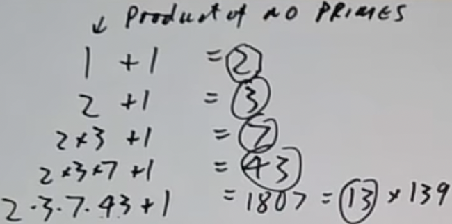

上图展示了这一流程。注意所有已知质数的乘积+1不一定是一个质数，比如最后一步。目前我们有了找质数的稳定方法，可是这个方法生成的质数不一定一个比一个大，怎么找大质数呢？有种Mersenne质数，其形如 $2^n-1$ 。试一下， $2^2-1=3,2^3-1=7,2^4-1=15=3\*5$ ,不对啊，这哪是质数？确实不是，因为使用的n不是质数。 $2^{ab}-1=(2^a-1)\*(2^{ab-a}+...+1)$ ，会被 $2^a-1$ 整除。好，从现在开始我们只取n为质数， $2^5-1=31,2^4-1=127,2^11-1=2047=23\*199$ 。又不是质数了。没错这个方法就是这样，虽然 $2^n-1$ ，n为质数时很多时候都是质数，不过总有一些例外。其实也是个不错的生成质数的方法了。不过这个方法可以一直用吗？换句话说，是否有无数多个Mersenne质数？这个问题目前还没有被解决，所以我就等着各位在国际数学界一展风采了:D

另一种长得很像的质数是费马质数，形如 $2^n+1$ 。 $2^0+1=2,2^1+1=3,2^2+1=5,2^3+1=9=3\*3$ 。这个不是质数，因为当 $2^{ab}+1$ 的a是奇数时，整个式子整除 $2^a+1$ 。为了防止这种情况发生，我们可以取这种质数， $2^{2^m}+1$ 。 $2^{2^0}+1=3,2^{2^1}+1=5,2^{2^2}+1=17,2^{2^3}+1=257,2^{2^4}+1=65537$ 。这些数都被称为费马质数。费马曾经以为所有形如 $2^{2^m}+1$ 构建的数都是质数，但是 $2^{2^5}+1$ 整除641。我们都知道费马也算数学界的传奇人物了，这个小错误完全有可能是因为他算错了，就这么朴实无华。至于费马质数的应用，你会在一个八杆子打不着的地方发现它们的身影——哪些正多边形可以只用尺子和圆规来构造？高斯发现如果一个数是费马质数，那么就可以。甚至说，所有你可以只用尺子和圆规来构造的多边形都是不同的费马质数于2的幂的乘积。人们往后推了几个情况，都没有再发现新的费马质数。关于费马质数是否有无限多个的问题仍然值得探讨，不过我们可以笃定，费马提出的这种方法并不是那么容易找质数。

到底有没有简单的方法来生成大质数？比如一个多项式f(n),结果永远是质数。这个多项式不能是f(n)=3这种无聊的玩意，即不能为常数项。欧拉找到一个， $n^2+n+41$ ，然而仅适用于41之前的情况。当n=41时，整个多项式自然就能整除41了。事实证明这样的多项式不存在。让 $f(n)=an^k+...+bn+c$ ，假如常数项c大于1，那么在n=c时f(n)绝对整除c，毕竟整个式子每一个项都是c的倍数。说明常数项只能等于1。但是常数项等于1时我们可以将 $f(n)$ 转为 $f(n+j)$ ，让常数项不等于1，重复刚才的论点。至此我们知道没有非平凡的多项式能永远生成质数。甚至说，人们到现在还没有找到能稳定生成质数的捷径，搞到最后第一种看起来傻瓜的方法竟然是最好用的。

看了这么久“是否有无限质数”，不如把目光放到有限的世界上来。有多少小于x的质数？这个问题可以用 $\Pi(x)$ 表示，此处的 $\Pi$ 不是3.14159那个，而是希腊字母里表示P的字母。正如无法找到永远生成质数的多项式，我们也无法准确知道 $\Pi(x)$ 的值，但是我们可以粗略估计。高斯提出了一个式子， $\Pi(x)\cong \frac{x}{log(x)}$ 。注意在数学的世界里，log总是代表以e为底的对数。这个式子直到19世纪才被证明，高斯确实牛逼。用不正规的理解就是，n是质数的几率大概为 $\frac{1}{log(n)}$ 。你可能会觉得，n要么就是质数，要么不是，怎么还有机率的？说n是质数的机率是xxx多少有点毛病。也对，这就靠意会了。

这个公式可以应用于刚刚提到的Mersenne质数：Mersenne质数的数量是无限的吗？按照公式和Mersenne质数的定义， $\frac{1}{log(2^n-1)}=\frac{k}{n}$ ,这是其中一个Mersenne数是质数的机率。把所有机率加起来， $\sum_n \frac{k}{n}=k(1+\frac{1}{2}+\frac{1}{3}+...)=\infty$ ，微积分经典调和级数，和为无限，那一共就有无限个Mersenne质数？有点问题，这个论点假设Mersenne质数是随机的，可是它们显然不是，都是 $2^n-1$ 结构的。更离谱的问题在于，当我们拿同样的方法找形如 $2^n-2$ 的数中有多少是质数时，结果应该也是无限个。这不是在搞笑吗， $2^n-2$ 明显整除2，除了n=2的情况时是个质数。所以这种机率只能用做一个方向指导，实际证明时要谨慎使用，你不知道能搞出来什么幺蛾子。这也是数论中的一个经验法则，所有用上概率参数的证明都非常简单，然而完全不严谨，还有可能给出错误答案，基本没用。

到底有多不严谨和模糊呢？拿费马质数举例子。 $2^{2^n}+1$ ， $\sum \frac{1}{log(2^{2^n}+1)}\approx k\frac{1}{2^n}<\infty$ 。这说明费马质数的数量应该是有限的。但是我们换种说法， $2^n+1$ , $\sum \frac{1}{log(2^n+1)}\approx k\frac{1}{n}=\infty$ ,这回又有无限多个了。两种形式都是费马质数，所以到底哪个是对的？谁也不知道。

另一位数学家同样发现了求小于x的质数的数量的公式 $Li(x)=\int^x_0\frac{1}{log(x)}dx$ 。此处的等于号并不是完全等于，有“大概”的意思，因为当x=1时，整个积分是发散的。黎曼更是有特别的想法，既然数质数这么难，不如我们数质数幂吧？ $p^n$ 应该算作质数的 $\frac{1}{n}$ 。由此有定义 $\Pi'(x)=$ 小于x的质数幂数量( $p^n$ 算作 $\frac{1}{n}$ )。黎曼真的找到了这个式子， $Li(x)-\sum_\rho Li(x^p)$ 。接着我们知道 $Li(x)\approx \frac{x}{log(x)}$ ，这也能解释上一个数学家的式子是哪里来的了。很神奇的地方是， $\Pi'(x)$ 显为一个非连续函数，但是它竟然可以用一系列连续函数的和表示。sum使用的 $\rho$ 不是p，这在数学中一般表示一个变量，这里特别表示[zeta函数](https://zh.wikipedia.org/wiki/%E9%BB%8E%E6%9B%BC%CE%B6%E5%87%BD%E6%95%B8)的零项(zeros of zeta function)。

我表示还是不懂 $\rho$ 是什么东西。首先要知道zeta函数长啥样： $\zeta(s)=\frac{1}{1^s}+\frac{1}{2^s}+\frac{1}{3^s}+...$ ， $\rho$ 就是满足 $\zeta(\rho)=0$ 条件的数。

似乎有点困难，温习算术基本定理来休息一下。任何大于等于1的整数都可以以独特的方式表达为素数的乘积。这在zeta函数中有使用，欧拉发现 $\frac{1}{1^s}+\frac{1}{2^s}+\frac{1}{3^s}+...+\frac{1}{90^s}=\frac{1}{1-2^{-s}}\frac{1}{1-3^{-s}}\frac{1}{1-5^{-s}}...$ ，这是所有质数的积。乍一看觉得很神奇，不过把式子写成级数后就很容易了。 $(1+\frac{1}{2^s}+\frac{1}{4^s}+\frac{1}{8^s}...)(1+\frac{1}{3^s}+\frac{1}{9^s}...)(1+\frac{1}{5^s}+...)$ ，把原式每一项写为一个级数之和，然后取出每个级数的一个项相乘。比如在第一个级数中取 $\frac{1}{2^s}$ ,第二个级数中取 $\frac{1}{9^s}$ ,第三个级数中取 $\frac{1}{5^s}$ ，剩下的级数都取1，就得到了 $\frac{1}{2^s}\*\frac{1}{(3^s)^2}\*\frac{1}{5^s}=\frac{1}{2\*3^2\*5}=\frac{1}{90}$ 。不难猜测第一个式子中的每一项都可以由无限级数乘积中的独特组合来表示，正是因为任何整数都能以唯一的方式写成素数幂的乘积。这个神奇的分解是欧拉给出的，他还将第一个式子用来证明质数有无限多个。取s=1，第一个式子就成了简单的调和级数，和无限，发散。既然第一个式子是无限的，第二个式子的素数乘积必然也是无限的。如果不是，其乘积一定是非0有限数，不可能等同于第一个式子的无限，因此素数的数量是无限多个。

接下来看看丢番图方程（Diophuntine equations)。此类方程专注于找整数解，最著名的一个莫过于 $x^2+y^2=z^2$ ，勾股定理；线性方程同样很常见， $27x+11y=1$ ；二次方程总不可能被排除, $2x^2=y^2$ 。这个方程变换一下相当于问 $\frac{y}{x}=\sqrt{2}$ ，根号2是有理数吗？换句话说，证明这个式子没有非0整数解等同于证明根号2不可能是有理数。还是很好解的，根据方程可以看出y一定是偶数，因为左项很明显就是偶数，如果是奇数就不可能有整数解了。两边同时除以2，得到 $x^2=\frac{y^2}{2}$ ，又出现了一个满足原方程的解。如果一个方程有解，那一定会有一个最小解，但是这么除下去没有个头，只能说明原方程根本无解。很经典的一个证明方法，[无穷递降法](https://zh.m.wikipedia.org/zh-cn/%E6%97%A0%E7%A9%B7%E9%80%92%E9%99%8D%E6%B3%95)。

气氛都到这里了不介绍一下“臭名昭著”的费马大定理我不是很认可。 $x^n+y^n=z^n$ ，要求n大于等于3，x，y，z都是非0项。自从费马家的书空白页太少，这个问题就一直是数学界最著名的问题之一。直到1990年被Wiles证明。这有很多变种，比如 $x^4+y^4+z^4=z^4$ ，你能看出来这个方程有没有解吗？答案是有，就是有亿点大。判断一个丢番图方程有没有解很困难，要么难以证明无解，要么有解但是很大，简直太难找了。不禁让人想问个问题：有没有一种算法可以解出所有丢番图方程？比如f(x,y,z...)，算法会直接告诉你无解或者给出解。然而是不可能的，已经有人证明了。

最后一种介绍的丢番图方程是[佩尔方程](https://zh.wikipedia.org/wiki/%E4%BD%A9%E5%B0%94%E6%96%B9%E7%A8%8B)……的变种。形如 $x^2=Dy^2\pm 1$ ，比如 $x^2=94y^2+1$ 。佩尔方程邪恶的地方在于看起来人畜无害的小系数最后可能会有大得离谱的解。

## Survey

暂时不知道这集的名称survey是什么意思，但是我知道要从模的同余开始。模的应用非常广泛，比如 $1234567=x^2$ 有解吗？这题太简单了，没有，因为任何一个平方数的个位只能是 $0^2,1^2,2^2...9^2$ 的个位，即0，1，4，9，6，5，6，9，4，1之间的一个，7不是，自然就不可能是平方数了。这涉及到模10的同余,同余记做 $a\equiv b\mod m$ ，意味着a-b整除于m。 $1，2，3，4，5，6，7\equiv 7\mod 10$ ， $x^2\not\equiv 7 \mod 10$ 。

有了同余这一利器，我们可以解决更复杂的问题。 $1000003=x^2+y^2$ 是否有解？倒是可以一个一个试，但是有简单方法不用不是傻子吗？ $x^2\equiv 0,1\mod 4,x^2+y^2=(01)+(01)=0,1,2\mod 4$ ，然而1000003模4不与0，1，2同余，故无解。至于为什么选模4，教授没有明说，个人觉得选别的也行，只要模的结果好算就得了。1000003模4一眼就看得出来是3，模10应该也是可以得出来一样的结论的。

说到同余怎么能不带费马小定理玩？当p为质数时， $x^p\equiv x\mod p$ ，另一种形式是 $x^{p-1}\equiv 1\mod p$ 。欧拉也有一个很像的定理，当x，m互质时， $x^{\phi(1)}\equiv 1\mod m$ 。 $\phi$ 是一个函数， $\Phi(m)=$ 1,...m-1中与m互质的数的数量。这两个定理堪称数论的基石，非常有用也不是很难。比如在n很大时，用于测试n是否是一个质数。使用费马小定理，验证 $2^n\equiv 2\mod n$ ？如果不满足，n绝对不是一个质数；如果满足，n也许是一个质数。满足的情况如果想进一步验证，可以将底数2换成别的继续试。同余还能和丢番图方程扯上关系。如果f(x,y,z)=0，那么 $f(x,y,z)\equiv 0\mod m$ 。这表示如果我们能以整数解的形式解出f(x,y,z)=0这样的多项式，那么任意找一个m都能满足同余条件。Hasse定理大概是其逆定理，不过不完全正确。对于线性方程大多数情况下逆定理成立，然而更高次的方程就不太行了。

看一个基础的二次方程， $x^2\equiv a\mod p$ 。这里的a也叫二次剩余。当p=7时， $0^2=0,1^2=1,2^2=4,3^2=9\equiv 2,4^2=16\equiv 2...$ ，能看出a的可能值只有0，1，2，4。有一个很好玩的符号， $(^a_p)$ ，当a是p的二次剩余时等于1，不是时等于-1，a能被p整除时等于0。二次剩余很重要的一个定理是二次互反律（quadratic reciprocity）：p,q都为质数时， $(^p_q):(^q_p)$ 之间有某种神奇的关系。如果 $x^2=p+qy$ 有解， $(^p_q)$ 为1；如果 $x^2=q+py$ 有解， $(^q_p)$ 为1。这俩方程很像，但好像真没别的联系了……吗？欧拉发现，当q或者p中有一个模4与1同余，则 $(^p_q)=(^q_p)$ ;当p，q模4都与3同余时， $(^p_q)\not =(^q_p)$ 。这恰恰说明两个式子之间有着奇妙的联系。

练习一下新学的二次互反律吧。3是71的二次剩余吗？我们将描述转换成方程的形式， $x^2\equiv 3\mod 71$ ,问题就变成了更数学的问题： $(^3_{71})=1$ ?又根据二次互反律，等同于问 $(^{71}\_3)=1$ ?可是无论是3还是71，它们模4都和3同余，只能是相反的情况。 $71\equiv 2\mod 3$ ，2不是一个平方数，所以 $(^{71}\_3)=-1$ 。既然两者相反，原问题 $(^3_{71})=1$ 。

现在让我们放宽视野，粗略认识数论的一个分支：加法数论（additive number theory)。论如其名，这是个讨论把东西加在一起会发生什么的分支。一个著名的问题goldback：是否所有大于等于4的偶数都是2个质数的和？比如12=5+7，14=7+7，16=5+11...这个问题非常难解决，有两位数学家证明了它的弱化版本——任何足够大的奇数都是3个素数的和。时间再往后推一点，又有一位数学家证明了其没那么弱化的版本——每个偶数都可以写为p+qr的形式，p，q，r都是质数。两个质数的乘积和单纯质数很接近了，然而还是弱化版本，这也是人类目前为止在这个领域的所有进展。另一个相似的未解之谜是孪生素数（twin prime）问题：在p为质数的前提下，是否能找到无限个形如p，p+2的质数？目前数学家们倒是证明了p，p加上几百的情况，可惜离2还有很长的路要走。以及素数的算术级数（arithmetic progressions)问题。一个素数算术级数的例子是5，11，17，23，29，长度为5，差为6。问题在于你能找到任意长度的算术级数吗？在你还没开始想之前，狄利克雷再甩给你一个问题：对形如a+nb的数取其算术级数，比如1+10n，要求所有个位为1的数。证明在任意算术级数中都有无限多个素数，当然a，b互质。

狄利克雷的问题其实是下面这个一般定理在1次时的特例( $a_0+a_1n$ ,能随意拆）。有多项式 $a_0+a_1n+a_2n^2+...$ ，这个多项式是否表示了无限多个质数？ $n^2+n=n(n+1)$ 的情况肯定不行，除了某些特殊的n值外，原多项式可以被因式分解，分解了不就很明显不是质数了吗？因此我们还要加个限制，多项式不能被因式分解。结果还是不行， $n^2+n+4$ 不会被分解，但是 $n^2+n$ 明显是个偶数，偶数加偶数还是偶数，整个多项式总是偶数，更不可能是质数了。那我们就直接假设当算术级数不能被分解，无法整除大于1的数时，是否能表示无限数量的素数？ $n^2+1$ 看起来满足这些要求，却也掩盖不了 $8^2+1=65$ 不是质数的事实。这个问题目前无人解答，学到这里这么多未解之谜出现了你不去试一下？

试完了吗？有点累？那推荐给你休闲数论（recreational number theory），下班放学休闲必备。完美数（perfect number）代表所有恰当因数（proper divisor，数字本身不算在内）之和是本身的数。6=1+2+3，28=1+2+4+7+14。休闲数论的创始人很会取名字，诸如友好数字（amicable numbers）。220和284是一对友好数字，220的所有真除数（proper divisor）相加等于284，284的所有真除数相加等于220。真除数指的是小余被除数的除数，这个除数必须整除于被除数且是正整数。比如20的5个真除数是1，2，4，5，10。玩了一会休闲数论，你的灵魂一定会问你：“啊这有什么用吗？”也许跟其他分支比起来就是没有用，但是休闲，不就是玩吗，玩要什么意义呢？ᶘ ᵒᴥᵒᶅ

代数数论（algebraic number theory）。一个很经典的代数例子是复数m+ni， $i=\sqrt{-1}$ 。这类数字被称为高斯整数（Gaussian ints），和普通整数很相似，比如它们都可以被拆分为独特的质数之积。不过高斯整数的质数就不是5什么的了，因为5=(2+i)(2-i)。这么看下来高斯整数简直太适合处理两个平方的和了， $(m+ni)(m-ni)=m^2+n^2$ 。平时熟悉的数也可以用奇奇怪怪的方式分解， $65=8^2+1^2=7^2+4^2=(8+i)(8-i)=(7+4i)(7-4i)$ ，进一步分解还能得到(2+i)(2-i)(3+2i)(3-2i)，最后一种是高斯整数的素数分解方式。费马继续来插一脚，如果p是质数， $p\equiv 1\mod 4$ ，则 $p=n^2+m^2$ 。

最后看一下组合数论（combinatorial number theory）就收工。n的partition表示所有能将n写为更小的正整数的和的形式的数量。 $p(n)=a_1+a_2+a_3$ 。我真不懂这个怎么表达，看例子。5=5=4+1=3+2=3+1+1=2+2+1=2+1+1+1=1+1+1+1+1,一共7种，所以p(5)=7。尝试证明这个定理：p(5n+4)整除5。一定要试试，因为教授说大概率做不出来ʕ •ᴥ•ʔ

## Divisibility and Euclid's algorithms

定义a|b为a整除于b，或者说b=xa，对于某些整数x。根据这个特性，a|0是板上钉钉的事，但是0|a是不可能的，除非a也是0。还能用整除符号定义某一类型数字，比如2|a对于所有偶数a都成立，6|n(n+1)(n+2)对于任何整数n都成立。这个似乎不是特别明显，但是仔细一想，n，n+1表示了两个相邻的数字，因此两者中必有一个是2的倍数，乘积自然也是2的倍数。同理，n,n+1,n+2表示了3个相邻的数据，类似地乘积必然是3的倍数。这个数既是2的倍数，也是3的倍数，2和3互质，故这个数也是6的倍数。虽然教授还没有讲这条定理，但相信大家不难看出这层关系。

有点感觉了？来试试证明这个： $8|n^2-1$ 。首先我们先代入几个数字，这也是数论中很重要的一部分—防止自己脑抽。代入0，1，2都成立，可以开始证明了。按照整除的定义，我们可以考虑把 $n^2-1$ 写成8x的形式来证明。原式想破脑袋都不可能拆出8来，于是我们从题目条件入手：n为奇数。怎么表达一个奇数？2m+1。现在代入事情就变得有点微妙了。 $(2m+1)^2-1=4m^2+4m+1-1=4(m^2+m)$ 。可以啊，这回是4的倍数了，能不能说完成了一半了呢？再仔细看括号里的式子，有点眼熟，因数分解得m(m+1)。这是偶数，刚刚见过了。至此我们证明了原式是4和2的倍数，可惜不能直接说是8的倍数，因为两者不互质。如果我们再变形一下式子呢？ $8\frac{m^2+m}{2}$ ,这不就是8的倍数了吗？而且由于 $m^2+m$ 是偶数，其除以2一定是整数。证明完成。

顺便了解一个关于正整数中理想数集（idea of Z）的定义。满足d｜x的所有x的集合被称为自然数的理想数集，在加法和减法下闭合。毋庸置疑，如果两个数都整除d，那相加相减后也会整除d，毕竟不可能突然冒出来个余数。

在我们了解欧拉除法（Elucid's division algorithm)前，我们需要理解一个理想数集的定理：假设I是一个理想数集，则I=某个d的所有倍数的集合（d来自定义的d｜x）。听起来有点废话，大多数人的直觉都能感知这一点。然而还是要实实在在证明一下的。首先我们需要一个前提，I中必须有大于0的元素。否则I=｛0｝，没有意思啊。接下来找到I中最小的正整数元素a，和任意一个不相同元素b。假设两者不是倍数关系，相除会得到b=aq+r，数论中除法的常见表示。根据除法的定义，余数r一定大于等于0，小于a。接着做个变形，r=b-aq。现在你看出来了吗？I根据理想数集的定义在减法下闭合，所以b-aq在I中，进而r也在I中。变形这步就是为了证明r在I中，因为这样我们就能发现一个矛盾点：r在I中，r小于a，但是我们已经假设a是I中最小的了。只有一种可能—r等于0，则a和b是倍数关系，证明原定理成立。

中场休息时间，最大公因数的定义是什么？这里就不写了，小学玩意大家都会。仔细想想，最大公因数的定义有没有不严谨的地方？比如a和b都是0？这种情况下没有概念上的最大公因数，因为任意数都整除于0。数学家们只好规定特殊情况：gcd(0,0)=0。还是不够，因为当只有其中一个是0时又是死胡同了。再加一条，gcd(0,a)=a,就算a等于0时同样成立。

下一个问题是如何找到最大公因数gcd(a,b)？笨方法：枚举1，2，3...a，找到最大整除于b的数。绝对有用，但是这也太慢了，假如a和b都有上百位呢？这么找下来都能到宇宙的尽头了。小学教了另一种方法，将a，b分解为质数乘积，后面干啥肯定都懂了吧。这个方法比上一个简单多了，然而分解这件事本身就很难，到几百位数字的情况后效率也不高。我们要找的高效方法就是大名鼎鼎的欧拉辗转相除法（Euclid‘s algorithm）。

尝试找gcd（78，14）：

78=14\*5+8<Br>
14=8\*1+6<br>
8=6\*1+2<br>
6=2\*3

那么最大公因数就是2。不难看出我们先用78/14，然后除数除以余数，循环往复，直到没有余数时，那一项的除数就是最大公因数。为什么这样可以找到gcd呢？要知道gcd（78，14）等同于gcd（14，8），因为8=78-14k，我们从原来的大数78减去14的倍数，这样肯定不会改变gcd。gcd（14，8）又等于gcd（8，6），一个道理。化简到最后等于gcd（2，0），根据之前的定理，便得到2。此算法可以保证给出一个结果，因为每次相除得到的余数都在递减，归功于每次被除数都在减小，而余数不能超过被除数。

那么辗转相除法到底有多快？嘴上说说而已吗？我们应该考虑该算法的最差情况用时。最差情况下gcd（a，b）每次得到的都是a=1\*b+r，即商次次都是1，这样我们往下递减的速度是最慢的。这类数有8和13，可以感受一下递减的速度。每次得到的余数为 $r_1,r_2,r_3;r_i=r_{i+1}+r_{i+2}$ 。有点熟悉，如果一时间想不起来就把满足这个条件的数列写出来：0，1，1，2，3，5，8，13，21，34...， $F_n=F_{n-1}+F_{n-2}$ ，著名的斐波那契数列。它的上限是 $2^n$ ，数列里每一项数字都小于或者等于 $2^n$ 数列里的内容；下限是 $2^{\frac{n}{2}}$ ，数列里每一项数字都大于或者等于 $2^{\frac{n}{2}}$ 数列里的内容。记为 $2^\frac{n}{2}$ 小于 $F_n$ 小于 $2^n$ 。辗转相除法所需要的步骤n约等于某个常数项\*log $F_n$ ，记为# steps of Euclid $\leq$ const\*log n=const \* #digits。

斐波那契数列这么有名，你知道它的通用公式吗？复习每一项的递归定义： $F_n=F_{n-1}+F_{n-2},F_0=0,F_1=1$ 。这其实是[有限差分](https://baike.baidu.com/item/%E6%9C%89%E9%99%90%E5%B7%AE%E5%88%86/2768735)的一个例子，和有限微分方程很像，除了这里是整数而不是实数。具有常数系数的一般有限差分方程看起来像 $F_n=a_1F_{n-1}+a_2F_{n-2}+a_3F_{n-3}$ , $a_1,a_2,a_3$ 都是常数。解这类型方程的通用办法就是“猜答案”。“猜”这个动词完全体现不出我们的水平，于是我们换一个动词——ansate。确实太高级了我甚至都找不到翻译。ansate其实表示的也是猜测，但这回是利用一些未知系数来猜测答案的形式。什么叫猜测答案的形式？有很多种办法，比如取 $n^\lambda$ （我不是很懂教授这里用lambda作为指数是否有什么特殊意义）。写得更详细一点就是 $a_{\lambda}n^\lambda+a_{\lambda-1}n^{\lambda-1}...$ 。把 $\lambda$ 看作实数，我们就有了几个未知系数 $\lambda,a_\lambda,a_{\lambda-1}...$ 。现在要做的就是调整这个式子让其能给出答案。顺便提一下解方程的通用思路，如果你有任何方程，例如微分方程或者差分方程，第一个要做的只是尝试一些简单的可能解，比如 $n^\lambda$ 这类的。而对于差分方程， $\lambda^n$ 非常有效，问题转化为 $\lambda$ 的什么值让式子有效。

原方程是 $F_n=F_{n-1}+F_{n-2}$ ，改成 $F_n=\lambda^n$ 。这意味着 $\lambda^n=\lambda^{n-1}+\lambda^{n-2}$ 。整体除以 $\lambda^{n-2}$ ，得到 $\lambda^2=\lambda+1$ 。就把 $\lambda$ 当成跟x一样的普通未知数来解，用求根公式得到 $\lambda=(\frac{1\pm \sqrt{5}}{2})$ 。这个答案怎么看起来怪怪的，确定这玩意的n次方是个整数？n=2时就已经不成立了。都到这了可不能放弃，我们对两个得到的答案进行[线性组合](https://zh.m.wikipedia.org/zh-cn/%E7%BA%BF%E6%80%A7%E7%BB%84%E5%90%88)， $a(\frac{1+\sqrt{5}}{2})^n+b(\frac{1-\sqrt{5}}{2})^n$ ，调整a，b的值尝试得到斐波那契数。那就从最简单的已知情况开始， $F_0=0$ ，这时a+b=0； $F_1=1$ ，这时 $a\frac{1+\sqrt{5}}{2}+b\frac{1-\sqrt{5}}{2}=1$ 。解这个二元一次方程，得到 $\sqrt{5}a=1,b=-a$ 。获得公式 $F_n=\frac{1}{\sqrt{5}}((\frac{1+\sqrt{5}}{2})^n-(\frac{1-\sqrt{5}}{2})^n)$ 。有趣的地方在于斐波那契数列都是整数，然而它的公式和整数八杆子打不着。

斐波那契额数列有很多有趣的特性。1，1，2，3，5，8，交替取 $5{F_n}^2\pm 4$ ：

$5\*1^2+4=9$<br>
$5\*2^2-4=16$<br>
$5\*3^2+4=49$<br>
$5\*4^2-4=121$

发现它们都是平方数。还有一个，取间隔数的乘积：

$1\*3=3$<Br>
$2\*5=10$<Br>
$3\*8=24$<Br>
$5\*13=65$

都和中间夹着的那个数的平方相差一。用数学语言表达就是 ${F_n}^2=F_{n-1}F_{n+1}\pm 1$ 。斐波那契数列还有很多有趣的特性，证明都不难，就当家庭作业了。

## More on Euclid's algorithm

上节课提到辗转相除法，可用于找gcd（a，b）。让gcd（a，b）=d，引出一个著名的方程ax+by=d。

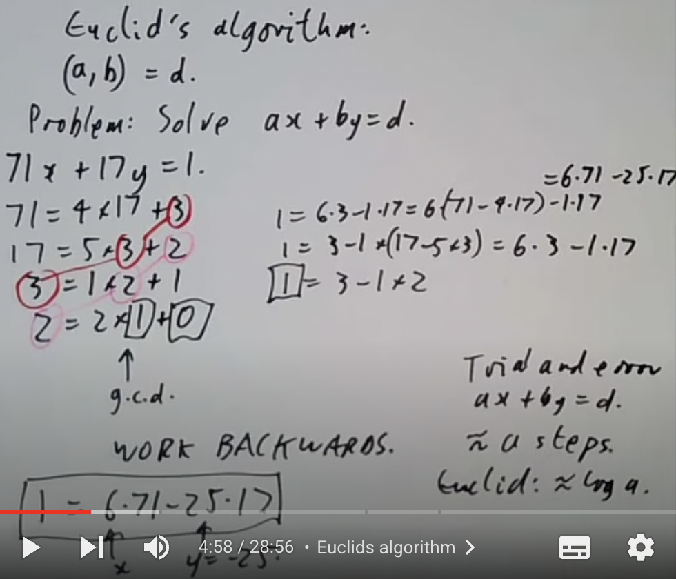

上图展示了如何利用辗转相除法找方程的解。关键思路在于每个式子的余数可以用上一个式子来表达。2=2\*1+0，这里的除数1正好是上一个式子的余数，所以可以被表达为1=3-1\*2。仔细一看，2又可以利用17=5\*3+2来表示。这样往上推并化简，得到1=6\*71-25\*17。正常试错法需要大概a步，而辗转相除法仅log a步。

形如ax+by=c的方程都可以用辗转相除法解吗？例如72x+26y=1？这个明显不可以，72和26都是偶数，线性组合怎么搞都搞不出1来。如果一个这样的方程可解，并且d|a,d|b，可得到d|c。d代表gcd（a，b），说明c能被gcd(a,b)整除。反过来可以说如果gcd(a,b)|c，那么方程可解。刚刚用辗转相除法直接解了ax+by=d的情况，但是ax+by=c，d｜c的情况改怎么做呢？这倒是不难，由条件可以直接得出gcd（a，b）z=c，z是正整数中的任意一个数。整体乘上这个z，得到axz+byz=dz=c。只需要先找到这个z，把原方程转换为ax+by=d，再代回去并把z乘回来就是解了。

总结一下，ax+by=c可解，当且仅当gcd(a,b)|c时。并且解不止一个，如果已经有了一组x，y解，通过x+kb，y-ka就能构造出更多的解。这个结论也适用于实数上有1个变量的多项式，ap+bq=c，a,b,c,p,q都是以x作为变量的多项式。该方程当且仅当gcd(a,b)|c成立时有解。简单说就是刚刚的规律推广到多项式也是可用的，别忘了多项式之间也可以做除法。但是这套规律在2个变量的多项式上就不成立了。xp+yq=1，p和q都是变量为x,y的多项式(不过不是式子里的x和y，那俩也是多项式）。方程里的gcd(x,y)是1，因为没有变量数高于1的多项式同时整除于其他两个高项多项式，这时候问题就来了。xp和yq的的常数项是0，方程右边却有常数项1，没有常数项怎么凭空变出来常数项？说明辗转相除法适用于变量数为1多项式，但不适用于2个变量的多项式，就算x和y是互质多项式。

做道例题尝试一下。如何解3个变量的线性方程？6x+10y+15z=1。观察题目，如果我们能找到两个互质的数，就能通过忽略剩下的一个变量直接解方程。可惜不行，6，10和15里没有互质的数。那考虑一下别的方法，先解6x+10y=2，构造这个方程源于gcd(6,10)=2。这要是不会刚刚的就白学了，解出6\*2+10\*(-1)=2。接下来构造2w+15z=1方程，2还是来自gcd(6,10)。gcd(2,15)=1，此方程可解，得2\*(-7)+15\*1=1。这不就有东西了吗？第二个方程的2可以用6\*2+10\*(-1)代替，代入并化简得6\*(-14)+10\*7+15\*1=1，简简单单解个线性方程，我感觉自己又行了。再总结一下，ax+by+cz=n当且仅当gcd(a,b,c)|n时有解，通过构造gcd(gcd(a,b),c)的辗转相除方程（这名字我自己编的，用于指代辗转相除法可解的方程。其实那种方程自己就有个名字的，但是我忘了(･･;)）求解。实际上学了辗转相除法的我们已经是这种线性方程的king了。同样的方法可用来解n个变量的线性方程。 $a_1x_1+a_2x_2+...+a_nx_n=m$ ，当且仅当 $gcd(a_1,...,a_n)|m$ 时可解。多个方程的线性方程组也行，不过教授没有介绍，他说我们用不到。好的，此时的我已经无脑相信教授了，正好我也懒得看:D。

这个算法挺不错的，效率也挺高，然而有个问题：用的是长除法，长除法的缺点在于慢和实现算法复杂。本着精益求精的精神，我们来学个更好的找gcd(a,b)的算法，避免长除法。

1. 从a，b拿出所有2的倍数（take out factors of 2，个人感觉意思和除以2的倍数差不多，下面所有相似内容的原文都是这句话），或者说除以所有2的倍数。这步过后可以假设a和b都是奇数（除以2的倍数），a大于等于b（两者可以交换顺序）。
2. 将a用a-b代替，现在a-b就是奇数了。
3. 如果a-b结果等于0，算法结束。
4. 如果不等于0，继续除以2的倍数，回到第2步。

该算法需要的步骤大概是log(a)，和欧几里得算法差不多，都是某个常数项乘以对数。这个算法需要的步骤可能会比欧几里得算法多一点，因为前者每次都要做减法然后除以2的倍数，而后者直接做除法。所以怎么看出来这个算法比欧几里得算法好的？这就是长除法的锅了，这个算法把步骤拆解为减法和除以2，对于电脑都是小菜一碟，需要的时间不多。而长除法复杂多了，省下来的步骤和时间全部在这里还回去了。实际使用要根据a和b的大小及硬件来决定。只要你愿意，这个算法也能用来解线性方程。

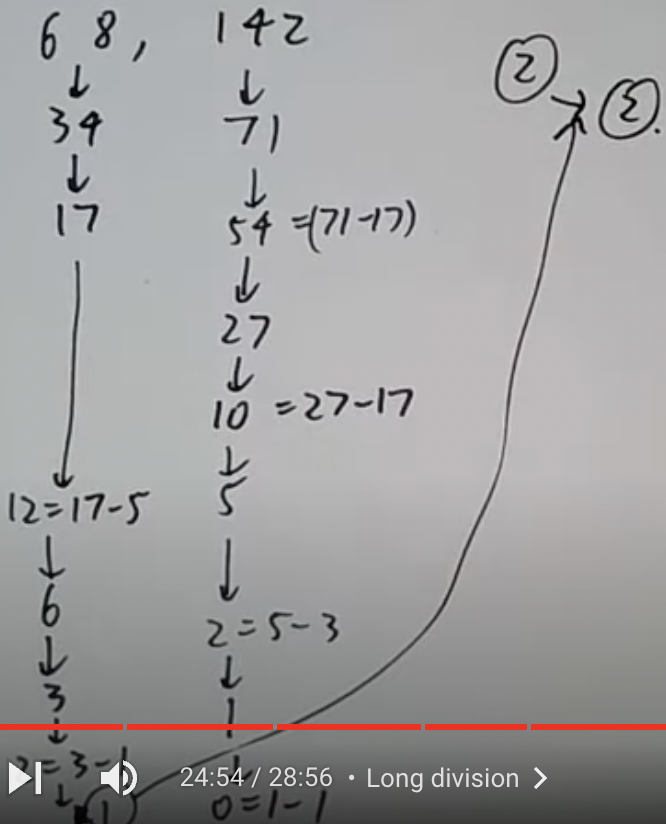

结果并不是1而是2，最后1-1=0中的1要乘上2，因为之前一直都在除以2。想解68x+142y=2的话，反着来就行了。

gcd的概念小学就学了，当时是不是还提到了个最大公倍数lcm？有没有什么办法可以快速找到两个数的lcm？ab保证是公倍数，但不一定是最小的。比如12和18，直接乘起来就太大了。lcm的算法很简单，lcm(a,b)= $\frac{ab}{gcd(a,b)}$ 。gcd学过高效算法，那剩下的还难吗？问题只有这个定理哪里来的。

提前用一下算术基本定理，之后的课程会有详细证明。

$a=2^{m_2}\*3^{m_3}\*5^{m_5}\*...$<br>
$b=2^{n_2}\*3^{n_3}\*5^{n_5}\*...$<br>
$ab=2^{n_2+m_3}\*...$<br>
$gcd(a,b)=2^{min(m_2,n_2)}\*3^{min(m_3,n_3)}\*...$<Br>
$lcm(a,b)=2^{max(m_2,n_2)}\*3^{max(m_3,n_3)}\*...$<br>
$n+m=min(n,m)+max(n,m)\rightarrow ab=gcd\*lcm$<br>

min(a,b)表示取a，b中的最大值，min(a,b）则是两者的最小值。教授的证明写的很清晰，都不用多说什么，抄下来就完事了。


## Primes

质数p是大于1且无法被除了1和本身的数整除的整数。根据质数的定义，1不是质数。这个小学就会了，1不是质数的根本原因是我们定义它不是质数；而我们定义它不是质数的原因很快就能知道了。

质数的定义允许负整数的存在，-2，-3，-5等。质数还有另一种我们不是特别熟悉的定义：1个不等于0的质数p，满足如果p=ab，a或者b是单位（unit，代表着有逆元的数）。整数中的单位是有1和-1。

回顾一下如何检查素数，比如101。笨方法是一个一个检查2，3...100的数中是否有整除于101的数。完全没有必要，我们可以简化一下。

1. 只检查素数。因为如果6整除于一个数，其素数因子2和3必定整除那一个数。
2. 只检查小余等于 $\sqrt{101}$ 的数。这是因为101=ab，如果a和b都大于等于 $\sqrt{101}$ ，那么ab一定大于101，矛盾了。

由此我们只需要检查2，3，5，7是否整除于101。不能，因此101是一个素数。用这种方法检查素数仅需要最多 $\sqrt{101}$ 步。

上节课挖算术基本定理的坑现在填。如果N大于等于1，N等于一组独特的素数组合的乘积。立刻就有人发现问题了：1呢？1总不可能是某些素数的乘积了吧？注意1是素数空集的乘积，因为按照惯例，空素数集合的总和为0等同于说空素数集合的乘积等于1。这个惯例方便了接下来的许多证明。

算术基本定理还有另一种说法。N不等于0，则N等于独特排列方式下的质数和单位的乘积。两种定义的“独特”忽略排列和单位，意为2\*3=3\*2=-2\*(-3)，这三种属于一种排列方式。

这里就证明第一种了，毕竟两种表达的意思是一样的，没必要都证明一遍。证明的简单部分为证明N=pqr；困难部分为证明其独特性。先来简单的吧。N大于等于1，如果N直接等于1或者某个素数，该情况下证明已经完成了。更普遍的情况是N=ab，a和b都大于1小于N。根据归纳法， $a=p_1p_2...$ , $b=q_1q_2...$ ，因为我们确定这些数都小于N，所以可以直接应用我们的归纳假设，把数字都表达为素数的乘积。于是 $N=p_1p_2...q_1q_2...$ 。到这里简单部分就结束了，每个正整数都是素数的乘积。

证明独特性需要攻克一个关键性质：p是质数，p|ab,则p|a或者p|b。证明如下，假设p不整除于a，那么gcd(a,p)=1，因为p是质数。根据辗转相除法，一定有某x和y，满足ax+py=1。整体乘上b，得到bax+bpy=b。p一定整除于bax，上面已经假设p整除于ab了；p也整除于bpy毕竟p肯定整除于自身。由此得到p整除于b。

有了上面的性质，独特性的证明倒也没那么难了。假设 $N=p_1p_2...=q_1q_2q_3...$ ，那么 $p_1|q_1q_2q_3...$ （其实就是把 $p_1|N$ 换了种说法）。推广上面的性质，如果p整除于很多数的乘积，那么其必定整除于其中一个数。由此得到 $p_1|q_i$ ，对于某个i。然而 $q_i$ 也是质数，只有可能 $p_i=q_i$ 。由此我们把 $p_1$ 和 $q_i$ 都从刚才的分解列表中划掉，现在：
  
$N=p_2p_3...=q_1q_2q_3...$
  
重复刚才的步骤，得到分解方式是唯一的的证明。

R上的多项式同样有相似结果。试想多项式 $f(x)=a_0+a_1x+...$ ，如果你不能将一个多项式写为更小阶的多项式的乘积，那么这个多项式就是多项式世界中的“素数”。多项式也有单位：常数项多项式（不等于0）。任何非0多项式都能写为素数多项式和常数项多项式的乘积，且也是唯一的。

还记得欧几里得质数生成法吗？（我都不记得我在这篇笔记里有没有写了(･_･;）用这种方法可以生成2，3，7，43，13等质数。问题是，这个方法可以生成全部的质数吗？这个问题很难，不过很简单（茅盾文学奖），因为几乎可以直接看出答案是“当然”。比如，101会出现在生成列表中吗？首先在第N步得到101的几率大概是 $\frac{1}{101}$ ，那么第N步得不到101的几率就是 $1-\frac{1}{101}$ 。由此得到小于等于N步得不到101的概率大约是 $(1-\frac{1}{101})^N$ 。只要N够大，整个式子接近于0。这就相当于你掷一个101面的骰子，掷几次可能得不到101，但是你掷它个几百万次，还得不到吗？相同的证明方法适用于任意其他数字，暗示着所有质数都会出现在欧几里得质数生成表中。既然这么明显，为什么还要说这个命题很难证明呢？想一下，算概率时我们假设得出的数字都是随机的，可是实际情况并不是这样。也许欧几里得生成法生成的数字中有不为人知的奇妙结构呢？这就是这个命题直觉上那么明显，然而却没有人能够给出证明的原因。

除了2和5，其余的质数个位一定都是1，3，7，9，因为如果不是就能被2或者5整除了。但是有没有无限个个位数是1的质数？换句话说，是否有无限个形如10n+1的质数？这个问题已被狄利克雷证明，后续课程会给出证明。现在要做的仅仅是看一些简单的情况。别看10n+1了，假如给出a和b，gcd(a,b)=1，a不等于0，有没有无数个形如an+b的质数？随便找一组a和b，那就4n+3吧。我们可以用一种欧几里德证明法的变体。假设我们找到一组 $p_1p_2...p_k$ 形成4n+3，然后整体乘上4减去1，得到 $4p_1p_2...p_k-1$ ，这个式子会形成4m+3。注意到4m+3不整除 $p_1p_2...p_k$ ，因为如果整除，那 $p_1p_2...p_k$ 就要整除 $4p_1p_2...p_k-1$ ，也就是要整除-1。同时整个式子一定有一个大于等于1的因子，其形式不是4m+1。这是因为以4m+1形式的数字的乘积的形式还是4m+1。既然式子很明显也不能被2整除，其必定有形如4m+3的素数因子。这个素数因子不能是我们之前已经知道的，得到一定有无限个形如4m+3的素数因子。3n+2形式的证明也差不多，就当作业了。

4n+1呢？这个更加棘手，需要利用到一个定理：如果 $p|m^2+1$ ，则p=2或者p=4n+1（继续挖坑后面填）。现在就能借助这一利器搭配欧几里得证明法来证明了。假设有 $p_1,p_2,...,p_k$ ，任何 $p_i$ 都形如4n+1。现在把它们乘起来再加1，得到 $p_1p_2...p_k+1$ 。现在没啥进展，这只能说明如果一个数整除平方数，那么这个数形为4n+1。于是我们做个平方， $(p_1p_2...p_k)^2+1$ 。然而这一步有被2整除的风险，通过往里面塞个2来解决： $(2p_1p_2...p_k)^2+1$ 。现在我们得到这个式子的所有因子：

1. 都形如4n+1或者2（刚才那个定理）
2. 不等于2（里面塞了个2）
3. 不等于 $p_1,p_2,...,p_k$ 

那只能是形如4n+1的新质数了。稍微推广一下得到的结论，有无限个个位是3或者7的质数。如果m和n的个位是1或者9，两者的乘积的各位同样是1或者9。形如 $(10p_1...p_k)+3$ 的数字一定有个位是3或者7的素数因子。因此如果把 $p_1...p_k$ 设为迄今为止你知道的所有个位数是3或者7的素数，最终会得到一个新的个位是3或者7的素数。问题是很难分开这两者，万一其中一个是有限的呢？不过狄利克雷已经解决了，继续挖坑后面看（这节课挖了三个坑了）。

另一个问题是素数间的差距。2和3中间差了1，23和29中间差了6。这个间隙有时候很大，有时候又特别小。我们能找到间隙的的上限吗？答案是没有，让我们取数字n的阶乘和某个小余等于n的数字的和，n!+2,3,4...n表示n!加上2或者3或者4等。明显这不是个质数，因为n!+k整除k，如果k大于等于1小余等于n。n-1稍微小于log(n!)，间隙的“平均”大小大概是log(N)。更进一步，有人证明了有无数个小于等于70000000的间隙，对于某些大数N。反过来，我们还能问有没有大于70000000的间隙。有一个猜想，有时候间隙的大小大约在 $(log N)^2$ 。这些目前都不是人类能证明的问题。

## Multiplicative functions

这节课是上节课的延伸，主题为算术函数（Arithmetical functions）。算术函数的定义很简单，这类函数的域为正整数，1，2，3……值域就比较广了，复数，实数，或者又是正整数。从一个简单的例子看起， $f(n)=n^k$ 。这个函数很明显满足f(mn)=f(m)f(n)，这个特点也叫strictly multiplicative（不知道咋翻译的屑）。很快我们就会看到non-strictly multiplicative函数是什么样的。

给出strictly multiplicative函数的另外一个例子。

```
n      1  2  3  4  5  6  7  8  9 ...
f(n)   1  0 -1  0  1  0 -1  0  1 ...
```

大佬肯定已经看出来了，f(n)的值取决于n：

```
1  如果 n=4m+1
-1 如果 n=4m+3
0  如果 n是偶数
```

关于strictly multiplicative的性质，之后的课程会有更详细例子。提前透露一点信息，其中一个很重要的符号为legendre符号, $f(n)=(^n_p)$ ，代表n模p是否为一个平方数。

再来一个strictly multiplicative函数的例子：Liouville函数，写为 $\lambda(n)=(-1)^\Omega(n)$ 。其中 $\Omega(n)=n$ 的质数因子数量（包括重复的）。"包括重复"意味着 $\Omega(60)=4$，因为 $60=2^2\*3\*5$ 。如果不想把重复的算上，可以用小写omega函数， $\omega(60)=3$ 。可以注意到 $\Omega(mn)=\Omega(m)+\Omega(n)$ ,意味着 $\lambda(mn)=\lambda(m)\lambda(n)$ 。另外小写omega函数是没有大写omega函数的性质的。

所以什么是non-strictly multiplicative函数呢（直接叫做multiplicative函数好了）？它的定义与strictly multiplicative函数完全一致，只不过多了一个条件：f(mn)=f(m)f(n),如果gcd(m,n)=1。乍一看会觉得，这条件能约束到多少函数？事实上很多函数都遵循这个性质。

第一个例子，因子函数（divisor function），记作 $d(n)=\sigma(n)$ 。 $\sigma(n)$ 代表n的因子数量。这个函数下，如果n是质数，则d(n)=2。如果n不是质数，情况就有点烦人了。d(60)是多少？为了得到答案，我们需要列出60全部的因子。那就趁现在练习一下之前学的算术基本定理，把60写为 $2^2\*3\*5$ 。由此可以得到60的因子一定形如 $2^a3^b5^c$ ,a小于等于2，b和c小于等于1。别忘了0的情况，最后得到60共有3\*2\*2=12个因子。同样的方法可以用作任何整数，只要我们知道其质数分解。通过60的例子，很容易得到下面的公式：

$n=p_1^{n_1}p_2^{n_2}...$<br>
$d=(n_1+1)(n_2+1)(...)$

通过公式就能清楚地看到d(mn)=d(m)d(n)，如果gcd(m,n)=1。如果两个数不互质，最简单的例子为d(4)=3,d(2)=2,然而d(4)不等于d(2)\*d(2)。

多来一点multiplicative函数的例子。 $\sigma(n)=$ n的全部因子的和。还是拿60做例子， $60=2^2\*3\*5$ ，因子形如 $2^a3^b5^c$ 。将全部可能加起来，得到 $(1+2+2^2)\*(1+3)\*(1+5)$ 。如果稍微有点难理解，把这个式子拆开，拆出前几项就能看出来为啥了。开始总结公式：

$n=p_1^{n_1}p_2^{n_2}...$<br>
$\sigma(n)=(1+p_1+...+p_1^{n_1})(1+p_2+...+p_2^{n_2})(1+...)$

注意到括号内是序列，求它们的和可以直接用公式：

$sum=\frac{t_1(r^n-1)}{r-1},r\not ={1}$ ，其中 $t_1$ 是序列的第一项，r是序列两项之间的比例差值。

回到我们手上的例子，应用公式可以化简为：

$\sigma(n)=\frac{p_1^{n_1+1}-1}{p_1-1}\frac{p_2^{n_2+1}-1}{p_2-1}...$

求出 $\sigma(n)$ 的难度和找到n的质数分解的难度差不多。试想这个情况，n=pq，此时 $\sigma(n)=(p+1)(q+1)=n+p+q+1$ 。如果你恰巧知道n是两个质数的积，又知道n的全部质数因子的和，你就可以构造二元一次方程来求出p和q。

下一个例子是rsa的老熟人。 $\phi(n)$ 等于小于等于n的数中与n互质的数的数量。如果n为质数，那么 $\phi(n)$ 固定等于n-1。经过一番证明可以得到 $\phi(mn)=\phi(m)\phi(n)$ ，如果gcd(m,n)=1。后面学到中国剩余定理时再提供详细证明。

刚刚给出的几个例子都可以一眼看出multiplicative，那么下面这个函数你能不能一眼看出呢？

$q(1-q)^{24}(1-q^2)^{24}(1-q^3)^{24}...$

很奇怪的一个函数。把它拆开得到：

$q-24q^2+252q^3+1472q^4+4830q^5-6048q^6$<br>
$=\sum \tau(n)q^n$

另外我不是很懂 $\tau$ 是什么函数，我只搜到了一个[类似的](https://math.fandom.com/zh/wiki/%E9%99%A4%E6%95%B0%E5%87%BD%E6%95%B0?variant=zh)。 $\tau(2)=24,\tau(3)=252,\tau(6)=6048$ 。就算不懂这是什么函数的我，也能算出来 $\tau(6)=\tau(2)\*\tau(3)$ 。 $\tau$ 是一个multiplicative函数， $\tau(mn)=\tau(m)\tau(n)$ ，如果gcd(m,n)=1。既然那个奇怪的函数是 $\tau$ 的和，自然也是一个multiplicative函数了。

接下来又是一个奇奇怪怪的函数：Moebius。

$\mu(n)=0$ ，如果n整除大于1的平方数。<br>
$\mu(n)=(-1)^{\omega(n)}$ ，如果n整除 $\omega(n)$ 个素数。

在探究这么个玩意有什么用之前，我们可以知道至少这是个multiplicative函数， $\mu(mn)=\mu(m)\mu(n)$ ，如果gcd(m,n)=1。不仅如此，它还和另一个臭名昭著的函数有关系。

$\zeta(n)=\frac{1}{1^n}+\frac{1}{2^n}+\frac{1}{3^n}+...$

当我们取这个函数的倒数时（注意下方使用s而不是n作为变量，因为这个变量可以是其他复杂的数）：

$\frac{1}{\zeta(s)}=\frac{1}{1^s}+\frac{\mu(2)}{2^s}+\frac{\mu(3)}{3^s}+...$

moebius函数神奇地出现在倒数中。考虑到 $\zeta$ 是数论界非常重要的函数之一，我们也不能小看moebius函数。

实战时间。回顾一下之前提过的完美数。

```
6=1+2+3
28=1+2+4+7+14
```

完美数要求一个数的恰当因子（因子最大只能是数字的一半，数字自己不算）之和等于数字本身。根据这个定义，能写出用于表达完美数的通用式子：

$2n=\sigma(n)$

n可以分解为 $p_1^{n_1}p_2^{n_2}...$ ， $\sigma(n)=(1+p_1+...+p_1^{n_1})(1+p_2+...)...$ 。欧几里得由此提出了完美数的公式：

$2^{p-1}(2^p-1)$

当p是质数且 $2^p-1$ 也是质数时，得到的结果是一个完美数。这个挺好证明的，第一步肯定是利用 $\sigma$ 拆开式子看看是什么：

$(1+2+4+...+2^{p-1})(2^p-1+1)$<br>
$=(2^p-1)\*2^p$<br>
$=2n$

别忘了第一个括号内的和直接用序列求和公式就能得到：

$\sum _1^{p-1}\:2^p=-2\left(1-2^{p-1}\right)$

这样得到 $-2+2^p$ ，加上最前面的1就是 $2^p-1$ 了。第二步化简得到的式子正好是2n，满足完美数字的要求。

欧拉提出了逆定理：所有偶完美数字都是这个形式的。让：

$n=2^ap^bq^c...$

p，q等都是奇素数。假设n是完美数字，那么它全部的因子就为：

$\{1,2,4,...,2^a\}\*\{1,p,p^2...p^b\}\*...$

取出特别的因子如 $p^b,p^{b-1}$ 和 $q^c$ 等，这些因子之和为：

$(1+2+...+2^a)(p^b+p^{b-1})q^c..$

化简得到：

$(2^{a+1}-1)(p+1)p^{b-1}q^c...$

整个式子又等同于：

$2n\*(1-\frac{1}{2^{a-1}})(1+\frac{1}{p})$

注意到 $(1-\frac{1}{2^{a-1}})(1+\frac{1}{p})$ 这部分只能小于等于1，因为想要满足完美数的定义的话，全部因子之和必须为2n，而前面已经有了个2n了。又注意到 $(1+2+...+2^a)$ 这个表达式是奇数，既然 $(1+2+...+2^a)(p^b+p^{b-1})q^c..$ 的结果为2n，那 $1+2+...+2^a$ 必须能被n的某个质因数整除。如果p是n的最小质因数，p一定小于等于 $1+2+...+2^a$，也即小于等于 $2^{a+1}-1$。这就意味着 $1+\frac{1}{p}$ 必须大于等于1。一边说最大为1，一边说最小为1，那唯一的可能只有1了。由于 $(1-\frac{1}{2^{a-1}})(1+\frac{1}{p})$ 只能等于1，意味着b必须等于1，代表我们不能有更多的质因数（还记得 $n=2^ap^bq^c...$ 吗，如果b是1，后续的c等等就不能比其更大了，也就没有更多质因数）。最后得到 $n=2^a\*2^{a-1}$ 。

有没有无限个偶完美数？这相当于问有没有无限个形如 $2^p-1$ 的素数。怎么感觉这种问题问了好多次了，反正都解不出来就对了。类似的问题还有“有没有奇完美数字？”，都是古老且无人可证明的问题。

## Binomial coefficients

首先肯定要看看二项式系数长什么样。

$(^n_k)$

读作n选k（n choose k）。第一个定义为，n个元素的集合中拥有k个元素的子集的数量（# k element of subsets of n-element set)。比如 $(^5_2)=10$,代表从5个元素中选2个元素有不重复的10种选法。第二种定义为取展开的二项式的系数，也是二项式系数名称的来源。把二项式这个名字拆开来看，“项”代表变量名。因此二项式自然有两个变量，通常是两个变量的和，如x+y。取x+y的n次幂再展开，就能得到：

$(x+y)^n=(^n_0)x^n+(^n_1)x^{n-1}y+(^n_2)x^{n-2}y^2+...$

第一眼看到这个的我直接懵了。还是要用一个具体的例子来学习，让n=5。

$(x+y)^5=x^5+5x^4y+10x^3y^2+...$

注意到系数1，5，10正好为 $(^n_0),(^n_1),(^n_2)$ 的值。定义二项式系数的第三种方法为公式直接定义。

$(^n_k)=\frac{n!}{(n-k)!k!}$

没啥特别的，就是个公式而已，方便计算。比如：

$(^5_2)=\frac{5!}{(5-2)!2!}=\frac{120}{6\*2}=10$

二项式系数还出现在杨辉三角中。刚刚粗略地看了一遍二项式系数出没的地方，现在教授要告诉你，这几种定义本质上是一样的。仔细看展开二项式 $(x+y)^5$ 的例子。

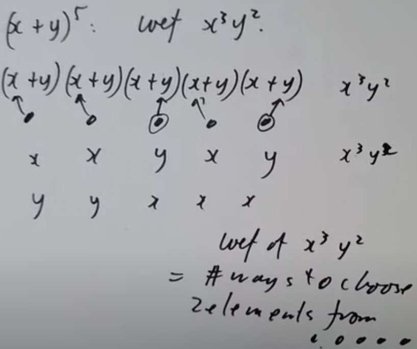

这张图展示了如何找 $(x+y)^5$ 展开后 $x^3y^2$ 的系数。每个(x+y)展开后都有两种选择，x和y。 $x^3y^2$ 可以看作拿出3个x 2个y，此时就能排列组合了。因此找 $x^3y^2$ 的系数等同于找从5个元素里取两个元素的搭配的数量，这不就和n选k那个定义是一样的吗？

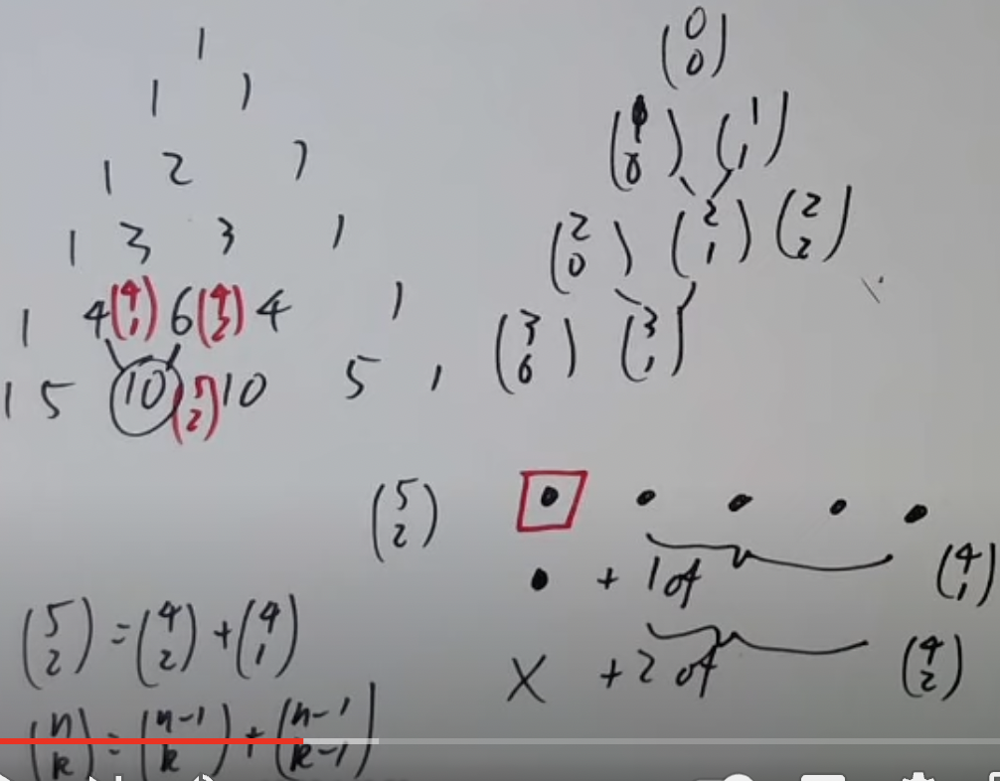

然后是杨辉三角的例子。杨辉三角中，上面两个数字的和是下面一个数字。把注意点放在其中一个小部分。

```
4    6
  10
```

不难发现 $(^4_1)=4,(^4_2)=6,(^5_2)=10$。这并不是巧合，如果我们在5个元素中选一个特别的元素（上图给的例子是第一个元素），然后再剩下4个元素中选1个与其搭配，就一共有 $(^4_1)$ 种搭配。接着我们把特殊元素扔掉，在剩下4个元素里选2个元素搭配，共有 $(^4_2)$ 种可能。最后我们会发现， $(^4_1)$ 和 $(^4_2)$ 加在一起完整表达了 $(^5_2)$ 的所有可能，由此 $(^5_2)=(^4_2)+(^4_1)$ 。推广到所有情况， $(^n\_k)=(^{n-1}\_k)+(^{n-1}\_{k-1})$ 。

我们只剩下最后一种情况了，公式。

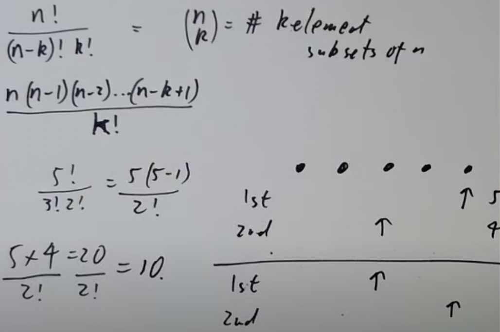

把公式展开得到：

$\frac{n(n-1)(n-2)...(n-k+1)}{k!}$

这个公式本质在于，如果我们有5个元素，随便选一个当第一个元素，选择第一个元素时就有5种选择。然后选第二个元素，这个元素肯定不能和第一个一样，那就有4种选择。我们应该有5\*4=20种选择，实际上却只有10种，说明我们数多了某些排列。假设我们选第5个元素为第一个，第3个元素为第二个，这种排列和选第3个元素为第一个，第5个元素为第二个是一样的。这告诉我们有k!种方式重新排序已有的组合，因此要除以k!。

至此我们发现所有定义本质上是一家人。其实二项式的情况还能推广到三项式。

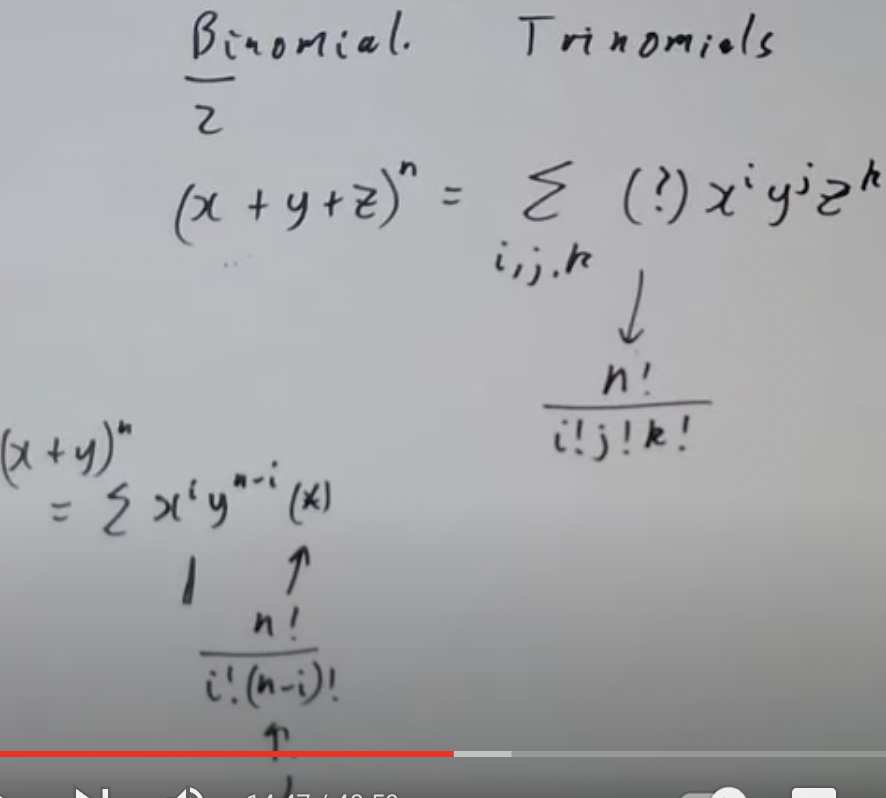

下方那个箭头表示n-i=j。此处不过多介绍，了解一下就好了，因为我们并不需要三项式系数。

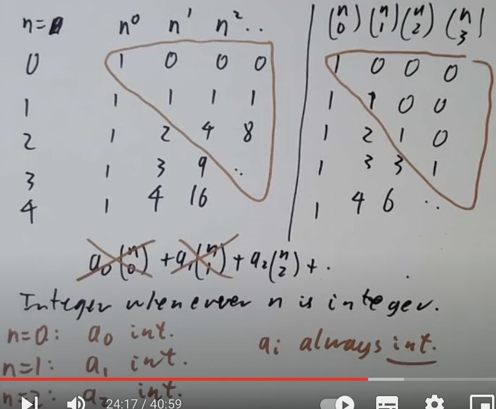

把二项式系数写出来，可以发现呈三角形状。这个特性可以用于下面的式子：

$a_0(^n_0)+a_1(^n_1)+a_2(^n_2)+...$

我们想让这个式子在n为整数时值也是整数。利用上面的特性可以看出，当n=0时， $a_0$ 必须也是整数，因为后面的 $(^n_1),(^n_2)...$ 都是0，此时整个式子的值完全取决于 $a_0$ 。把 $a_0$ 划掉，当n=1时，同样的方法得到 $a_1$ 必须是整数。一直往后推，得到 $a_i$ 永远是一个整数。由此，当有人说形如 $a_0(^n_0)+a_1(^n_1)...$ 这样的式子对于所有整数n值都为n时，相当于说 $a_i$ 都是整数。

二项式系数还有什么别的用处吗？当然，前提是我们需要知道怎么相加二项式系数：

$(^0_k)+(^1_k)+(^2_k)+...+(^n_k)=(^{n+1}_{k+1})$

利用杨辉三角可以看得更清楚。取杨辉三角斜着的一列，这一列最后一个数字的右下角就是整列的和。知道了二项式系数的加法，可以尝试用其找到下面这个式子的和：

$0^2+1^2+2^2+...+n^2=?$

这是大学里练习归纳法的一个经典例子，答案是 $\frac{n(n+1)(2n+1)}{6}$ 。问题在于当你真的拿归纳法去推导时，过程会十分混乱，相比于用二项式系数的方法。我们可以将式子用二项式系数来表达，比如：

$n^2=2\frac{n(n-1)}{2}+n=2(^n_2)+(^n_1)$

那么：

$1^2+...+n^2=2((^1_2)+...+(^n_2))+(^1_1)...(^n_1)=2(^{n+1}_3)+(^{n+1}_2)=\frac{n(n+1)(2n+1)}{6}$

当你想要相加很多多项式时，可以考虑一下将其写为二项式系数而不是n的幂这种形式。

补充一些二项式系数的性质。

$(^n_k)=(^n_{n-k})$

每当你在5个元素中选2个元素形成一种组合时，剩下的3个元素也会形成一种组合。既然有 $(^5_2)$ 种方式组合2个元素，那么也会有 $(^5_2)$ 种方式剩下3个元素。剩下的元素也能被表达为 $(^5_3)$ ，两者的值是一样的。

还是那个杨辉三角，如果你把每一行加起来，其结果一定是2的n次方。可以用二次项系数证明，刚才的叙述等同于：

$(^n_0)+(^n_1)+...+(^n_n)$

这个式子又等同于说，“拥有0个元素的集合的数量+拥有1个元素的集合的数量+...+拥有n个元素的集合的数量”。这意味着最后的结果是n的所有子集的数量。拥有n个元素的集合的子集数量只能是 $2^n$ ，组合证明完成。还有更简单的方法，我们把 $(x+y)^n$ 的值写为这样：

$(x+y)^n=\sum (^n_k)x^{n-k}y^k$

如果让x=y=1，这个式子就变成了：

$2^n=\sum_k (^n_k)$

正是我们想要的。

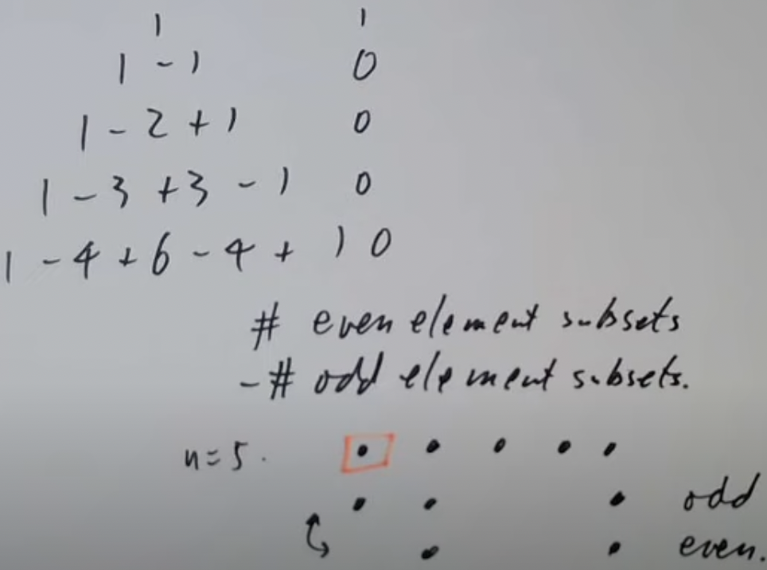

又又又是杨辉三角，这次是交替求和。可以发现除了第一行，剩下的行进行交替求和的结果都是0。因为每一行的交替求和相当于干这么一件事：“拥有偶数个元素的子集数量-拥有奇数个元素的子集数量”。继续让n=5，第一个元素为特殊元素。形成子集时我们可以考虑带上这个特殊元素或者不带上这个特殊元素，因此每一对奇偶子集的数量都是配对的，数量相减一定为0。

有很多关于二项式系数的求和公式，不过下面这个可能是最常见的。

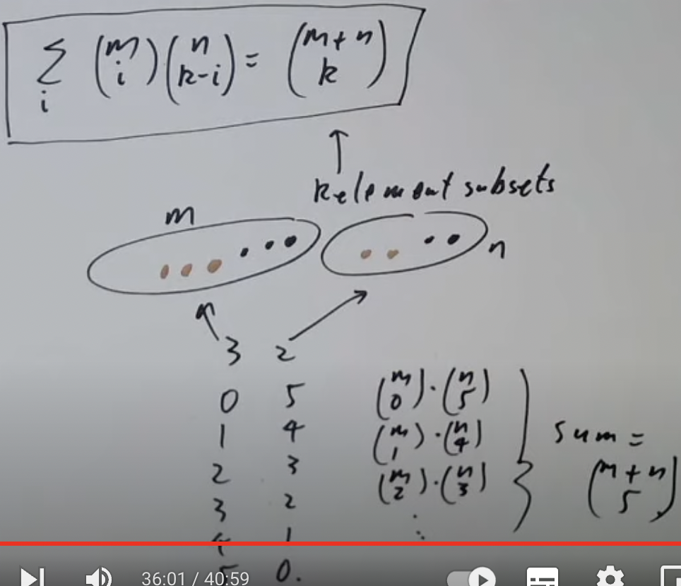

公式如下：

$\sum_i (^m_i)(^n_{k-i})=(^{m+n}_k)$

这个其实很好理解，假设我们有个大小为m的集合和另一个大小为n的集合，有多少种办法在两个集合里选出5个元素？很多，m选0个n选5个，m选1个n选4个……注意到第一种选法用二项式系数表示为 $(^m_0)(^n_5)$，第二种选法用二项式系数表示为 $(^m_1)(^n_4)$ 。一直往下写，就能得到 $\sum_i^5 (^m_i)(^n_{k-i})$ 。别忘了我们最初的目的，从大小为m的集合和另一个大小为n的集合选出5个元素，那它们的和自然等于 $(^{m+n}_5)$ 。

最后用一个很巧妙的找方程有多少个解的办法收尾。

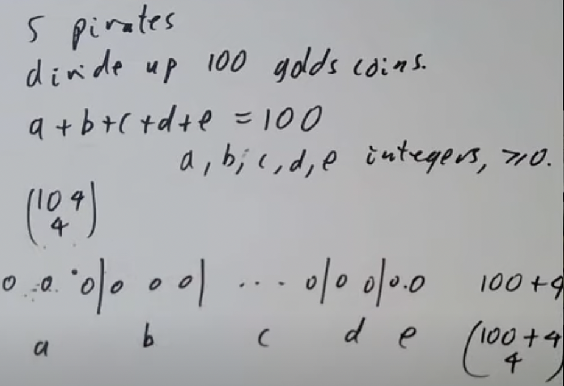

有5个海盗分100个金币，能写出方程a+b+c+d+e=100,其中a,b,c,d,e都是整数且大于等于0。这个方程的解的数量为 $(^{104}_4)$ 。为什么？我们把100个金币铺开，分配金币的问题等同于在这100个金币里放4条竖线。100个金币加4条竖线是104个东西，方程的解的数量就是找104个东西里放4条竖线的不同方式的数量。

## Applications of binomial coefficients

要用什么开头呢，嗯……杨辉三角，但是变异版本。这个版本的杨辉三角当顶上两个数的和为偶数时为0，奇数时为1。所以这玩意大概长这样：

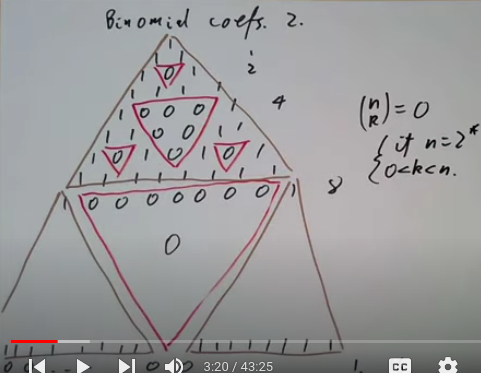

有点像一个很有名的分形。如果让第一行的编号是0，就会发现每当行号是2次幂时，我们会得到一行的0（排除两边的，那个无论怎样都是1）。用二项式系数表达就是， $(^n_k)=0$ ，如果 $n=2^k$ ,0<k<n。让三角再变异一次，变异成另一个质数3，当顶上两个数的和是3的倍数时为0。写出来就会是这样：

```
   1
  1 1
 1 2 1 
1 0 0 1
```

发现编号为3的行出现了整行0。这个规律适用于所有质数：当p为质数时， $(^p_k)=0$ ,0<k<p。再补充一点, $(^p_0)=(^p_p)=1$ 。注意此处的二项式系数得到的结果是模p后的，所以结果为0代表二项式系数的结果是p的倍数，结果为1代表二项式系数的结果模p余1。可以通过将二项式系数拆成公式来证明这一点。

$(^p_k)=\frac{p!}{k!(p-k)!}$

p!肯定是p的倍数，里面已经有了个p了。 $\frac{p!}{k!(p-k)!}$ 则不是p的倍数，除非k=p或者k=0。一个整除p的数除以一个不整除p的数，得到的结果一定整除p。因为q=ab，如果a不是p的倍数，想满足结果q是p的倍数的话，b就必须是p的倍数了。于是我们得到， $(^p_k)=\frac{p!}{k!(p-k)!}$ 整除p，如果0<k<p。

根据上面的三角形每当是质数的幂时此行为0的特性，我们可以猜测 $(^{p^n}_k)$ 整除p，如果0<k< $p^n$ 。证明之前要了确一个因式分解的结果：

$(x+y)^p=x^p+y^p+p(m)$

那个m代表分解后所有系数为5的东西。比如：

$(x+y)^5=x^5+y^5+[5(x^4y+2x^3y^2...)]$

单纯p次幂之前已经证明结果整除p了（还记得上节课说这种形式的二项式系数等同于杨辉三角形式的二项式系数吗？既然我们已经证明了杨辉三角，这种情况自然也一样）。现在看看 $p^2$ 次幂的情况。

$(x+y)^{p^2}$<br>
$=((x+y)^p)^p$<br>
$=(x^p+y^p+p(m))^p$<br>
$=x^{p^2}+y^{p^2}+p(n)$ ,此处的n表示p次幂后的m，不一样了然而还是不重要。

$p^2$ 次幂的情况经过变形与第一种情况无本质区别，并且我们可以对p的任何次幂使用一样的方法。由此得证 $(^{p^n}_k)=0$ ，如果0<k< $p^n$ 。

有时候人们想知道某个数的阶乘能除以多少次某个数。先用简单的情况练练手，8!可以除以多少次2？我们知道8!=2\*3\*4\*5\*6\*7\*8，里面有4个2的倍数，那么8!至少能除以 $2^4$ 。但是还不够，4和8里面还有 $2^2$ ，拿掉一个后都还剩下一个2，于是要再除以 $2^2$ 。还没完，8还藏着个 $2^3$ ，把 $2^2$ 拿掉后还剩一个2。最后把结果加起来，得到 $2^4\*2^2\*2=2^7$ 。这是最大整除于8!的2次幂。

当有人问你，n!可以除以多少次p时，你需要一个公式帮你估计这个数量。把n!展开，得到：

```
1...2...p...2p...n
```

根据8!那个例子的经验，至少可以整除 $[\frac{n}{p}]$ 个p。中括号表示取结果的整数部分，不是四舍五入，[5.9]=5。这样会漏掉那些包含 $p^2$ 的数字，所以我们还要加上 $[\frac{n}{p^2}]$ 部分。但是那些包含 $p^3$ 的数字怎么办呢？很明显这里有一个无限序列。n!可以除以以下这么多次p：

$[\frac{n}{p}]+[\frac{n}{p^2}]+[\frac{n}{p^3}]+...$

不给出具体数字的情况下我们无法知道这个序列的和。不过我们知道它肯定小于等于这个序列，由于[]符号的性质。

$\frac{n}{p}+\frac{n}{p^2}+\frac{n}{p^3}+...$<br>
$=\frac{n}{p-1}$

现在有人问你上面的问题，你就可以告诉他绝对不会大于 $\frac{n}{p-1}$ 这个数了。让我们看看谁会这么无聊问这个问题（doge）。

即使现实中你没有一个这么无聊的朋友，但是数学考试里可就不一样了，全是卧龙凤雏。某一天出题人在计算器上按出了1000!,却无法得到答案。出题人很生气，把计算器砸了接着问你1000!末尾有多少个0。两件事并没有任何的关系，总之题目在这了。这相当于问1000!里有5的多少次幂和2的多少次幂，取最小的数为结果。先算5：

$[\frac{1000}{5}]=200$<br>
$[\frac{200}{5}]=40$<br>
$[\frac{40}{5}]=8$<br>
$[\frac{8}{5}]=1$<br>
$[\frac{1}{5}]=0$<br>
$=249$

理论上第二步应该算 $[\frac{1000}{5^2}]$ 的,但是 $[\frac{200}{5}]$ 是等效的，还更容易算。2的情况不用多看， $[\frac{1000}{2}]=500$ ,这已经超过5的全部数量了。最后我们得到，1000!末尾正好有249个0。

人们不满足于知道某个数的阶乘能除以多少次某个数，人们又想探讨某个二项式系数能除以多少次某个数。这种情况仅是刚刚情况的延伸，通过一道题就能掌握方法了。请找到 $(^{100}_{40})$ 可以整除7的多少次幂。

$[\frac{100}{7}]=14$<br>
$[\frac{14}{7}]=2$<br>
$=16$<br><Br>
$[\frac{40}{7}]=5$<br><br>
$[\frac{60}{7}]=8$<br>
$[\frac{8}{7}]=1$<br>
$=9$<Br><br>
$16-5-9=2$

最大只能整除 $7^2$ 。结合公式看会更清楚。

$(^p_k)=\frac{p!}{k!(p-k)!}$

100是p，40是k，60是p-k。挺直白的对吧？问题继续升级， $(^n_k)$  大概有多大？我们有一种粗略的估计：

$(^n_k)\leq 2^n$
  
这个式子给出了二项式系数的上限，因为杨辉三角中第n行的和是 $2^n$ ，二 次项系数再大也不会大于这个数。下限也是有的，放在一起就是：

$2^{2n}\geq (^{2n}_n)\geq \frac{2^{2n}}{2n+1}$

此处换为了2n，影响不大。上限和下限都可以用一个基本事实串起来。 $2^{2n}$ 等于2n+1个系数 $(^{2n}_0),(^{2n}_1)...$ 的和。因为二项式系数和阶乘密切相关，因此对阶乘的估计越准确，二项式系数的结果就越准确。stierling公式给出n!的大致估计:

$n!\approx n^{n+\frac{1}{2}}e^{-n}\sqrt{2\pi}$
  
教授在课上是不打算用这个公式了，毕竟太难算了，上下限的粗略估计已经够了。各位课下想要得到二项式系数更准确的值时可以用这个。
  
再次看一下一个之前浅浅提过的问题。有多少小于等于n的素数？素数定理（Prime number theorem)告诉我们数量大约等于 $\frac{n}{log(n)}$ 。更准确的表述为素数数量的比例小于 $\frac{n}{log (n)}$ ，当n接近无限时，比例也接近无限。众所周知素数问题都很难证明，因此这里我们利用二项式系数来证明一个弱化版本。
  
把小于等于n的素数数量记为 $\pi(n)$ ,然后将原来的表述换为：
  
$\frac{1}{2}\frac{n}{log(n)}\leq \pi(n)\leq 2\frac{n}{log(n)}$
  
现在我们把 $\pi(n)$ 限制在了一个范围内。不会给出详细证明，仅仅提一下关键步骤，剩下的细节交给各位。证明上下限的关键点均为二项式系数 $(^{2n}_n)$ ，并找出整除它的素数。
  
先看一下如何估算特定间隔中的质数数量。假设n小于p（质数）小于2n，那么p正好整除于 $(^{2n}_n)$ 一次。因为 $(^{2n}_n)$ 展开得到 $\frac{2n!}{n!n!}$ ，p整除2n!(p小于2n，2n的阶乘里一定有p)却不整除n!n!（n小于p，阶乘里不会有p，p又是质数）。能知道n和2n之间所有质数的乘积满足：
  
$\Pi p\leq (^{2n}_n)\leq 2^{2n}$ ,n<p<2n
  
然后求n和2n之间所有质数的和，满足：
  
$\sum_{p}log(p)\leq 2^{2n}=2n log(2)$ ,n<p<2n
  
注意到 $\sum_{p}log(p)$ ,n<p<2n同时大于等于log(n)乘以[n,2n]之间素数的数量。总结以上得到n到2n间素数的数量小于等于 $2 log(2)\frac{n}{log(n)}$ 。变换一下，得到大概等于 $log(2)\frac{2n}{log(2n)}$ 。

现在再找上限 $\frac{2n}{log(n)}$ 就很简单了。把n分为几个间隔， $\frac{n}{8},\frac{n}{4},\frac{n}{2},n$ 等，利用刚刚得到的式子求出每个间隔间的素数大致数量再加起来就能得到 $\frac{2n}{log(n)}$ 了。

接下来是下限。先找个弱化版本，小于 $(^{2n}_n)$ 的质数的乘积下限：

$\Pi_{p^k\leq 2n} p\geq (^{2n}_n)$

证明这个式子等同于找p整除于 $(^{2n}_n)$ 的次数。之前已经学过了，等于：

$[^{2n}_p]-[^{n}_p]-[^{n}_p]$<br>
$+[^{2n}_{p^2}]-[^{n}_{p^2}]-[^{n}_{p^2}]$<BR>
$+...$

每一行的结果要么是1要么是0。因为 $[^{2x}_{p}]-[^{x}_{p}]-[^{x}_{p}]$ 等同于 $[2x]-[x]-[x]$ ，不是1就是0，取决于x的小数部分。（后面我真的看不懂了，反复听了10遍都不知道在讲啥。脑子不够用了）

要把素数乘积的下限转换为素数数量的下限。 $(^{2n}_n)$ 大于等于 $\frac{2^{2n}}{2n+1}$ 。先求个对数：

$\sum_{p^k\leq 2n} log(p)\geq log(\frac{2^{2n}}{2n+1})=2n log(2)-log(2n+1)$ 

为了得到我们想要的结果，可以对式子做一点简化。

1. 带有 $p^2,p^3$ 的项很小，因为正方形和立方体素数很罕见，基本可以忽略不计。
2. log(x)几乎可以看作常数项。虽然我们知道它肯定不是，但是对数在很大的基数下基本不会增长，所以看成常数项不会损失多少，还省很多力。
3. log(p)对于大多数素数大概等于log(2n)。

由此我们得到：

$\sum_{p\leq 2n} log(2n)\gtrapprox 2n log(2)$ 

log(2n+1)被忽略掉了，因为对结果影响不大。那么小于等于2n的素数数量大于等于 $\frac{2nlog(2)}{log(2n)}$ -某个小数字。这里的小数字是之前简化式子被忽略掉的所有项的总和。注意 $\frac{2nlog(2)}{log(2n)}$ 等同于 某个常数项\* $\frac{2n}{log(2n)}-()$ 。至此我们就证明完了素数数量的上下限（完全没看懂的我一脸懵逼）。

希望下一个应用会比较简单。观察 $^{2n}_n$ 的结果：

```
n：  0 1 2  3  4
结果：1 2 6 20 70
整除：1 2 3  4  5
结果：1 1 2  5 14
```

不难发现 $^{2n}_n$ 整除n+1。同时整除后的结果是著名的加泰罗尼亚数字（Atalan numbers）。这些数字代表有多少种方式乘以一个表达式，比如：

```
a           1
a b         1
(ab)c a(bc) 2
```

问题在于为什么加泰罗尼亚数字能和二项式系数扯上关系？先给出加泰罗尼亚的递归公式：

$C_0=1$<br>
$C_n=C_0C_{n-1}+C_1C_{n-2}+...+C_{n-1}C_{0}$

这个公式其实很直白，当你想找(abcd...)有多少种乘起来的方法时，你可以将其分解为`a(b...)+(ab)(...)+(abc)()+...`，(abc)就是 $C_2$ ,(abc)旁边的括号就是 $C_{n-3}$ 。然而还是看不出来和二项式系数有什么关系，这时就要借助一个巧妙的方法——生成函数法了。

定义函数 $f(x)=C_0+C_1x+C_2x^2$ ，如果我们取 $f(x)^2$ ，就会得到 ${C_0}^2+(C_1C_0+C_0C_1)x+(C_0C_2+C_1C_1+C_2C_0)x^2$ 。注意到这和f(x)大差不差， $C_2$ 根据公式展开本来就是 $C_1C_0+C_0C_1$ ，那么就能得到：

$1+xf(x)^2=f(x)$

一个简单的二次方程，公式一把梭：

$f(x)=\frac{1-\sqrt{1-4x}}{2x}$

接下来的公式有点多，直接放图吧。


这张图回顾了怎么用二项式系数算 $(1+x)^n$ ，并且说明同样的规律也适用于n不是整数的情况。还介绍了怎么利用阶乘的技巧简化表达式。

$1\times 3\times 5=\frac{1\times 2\times 3\times 4\times 5\times 6}{2\times 1\times 2\times 2\times 2\times 3}=\frac{6!}{2^3\times 3!}$

虽然举的例子看不出来简化了多少就是了。之前得到的结果变形一下就是：

$f(x)=\frac{1-\sqrt{1-4x}}{2x}$<br>
$\sum \frac{(2n-2)!}{n!(n-1)!} x^{n-1}$<br>
$\sum x^n\frac{(^{2n}_n)}{(n+1)}$

最后的n+1就是加泰罗尼亚数。因为这个函数的结果是整数，因此 $(^{2n}_n)$ 必定整除n+1。

## Congruences

还记得同余的定义吗？ $a\equiv b(\mod c)$ ，意味着a-b整除于c。同余意义下加法、减法和乘法均保留，如果 $a_1\equiv a_2,b_1\equiv b_2$ （省略mod c），那么：

$a_1+b_1\equiv a_2+b_2$<br>
$a_1\*b_1\equiv a_2\*b_2$<br>
$a_1-b_1\equiv a_2-b_2$

除法与幂不一定保留，比如：

$\frac{2}{2}\not\equiv \frac{0}{2}\mod 2$<br>
$a_1^{b_1}\not\equiv a_2^{b_2}$

任何数字模c得到的余数一定与c的剩余类的其中一个数同余。比如c=5，它的剩余类就是0，1，2，3，4，很容易看出任意数字a模5只能得到这些余数。额外地，剩余类在加法和乘法下封闭并形成一个环。环我没学过，不过教授说可以非正式地定义为有加法、乘法和减法的东西，遵循大学前学的代数的大部分规则。

举个小部分规则的例子。ab=0，那么a和b中至少有一个是0。这个在同余界就不成立， $2\*3\equiv 0\mod 6$ ，但是 $2\not\equiv 0\mod 6,3\not\equiv 0\mod 6$ 。不过这个规则在模素数的时候成立， $ab\equiv 0\mod p$ ，p是质数，那么p|ab，得到p|a或者p|b,因此 $a\equiv 0\mod p$ 或者 $b\equiv 0\mod p$ 。

m的剩余类是0，1，2，3，4...m-1数字的集合，如模5的剩余类是0，1，2，3，4。这些数字并无特殊意义，说-2，-1，0，1，2也行，0，1，2，4，8也行，只是第一种情况最简单。

有一种测试数字模9同余什么数的方法。357 mod 9=?

3+5+7=15<br>
1+5=6<br>
$357\equiv 6\mod 9$

所以为什么这样可以呢？把357拆开看， $357=3\*10^2+5\*10^1+7\*10^0$ 。因为10模9与1同余，整个式子 $3\*10^2+5\*10^1+7\*10^0\equiv 3\*1^2+5\*1+7\*1\mod 9$ 。这不就是3+5+7=15的由来吗？同样的事情应用在15上，得到1+5=6。模9常用于检验笔算乘法。比如笔算12345\*6789时，第一个数字 $12345\equiv 1+2+3+4+5\equiv 6\mod 9$ ，第二个数字 $6789\equiv 3\mod 9$ 。那么它们的乘积应该整除9。如果算出来的结果不是这样，笔算很有可能出了问题。

类似地还有一个检查模11结果的办法。 $1234\equiv ?\mod 11$ ？取其交替， $1234\equiv 4-3+2-1\equiv 2\mod 11$ 。还是拆开来看， $1234=1\*10^3+2\*10^2+3\*10+4\*1$ 。因为 $10\equiv -1\mod 11$ ，那么 $1\*10^3+2\*10^2+3\*10+4\*1\equiv 1\*(-1)^3+2\*(-1)^2+3\*(-1)+4\*1$ 。这样我们就得到了数字的交替总和。

同余可以用在很多地方。 $a^2\equiv 8$ 有多少种可能？我们知道a可能与8的剩余类中的任意一个数字同余，也就是0，1，2，3，4，5，6，7。取它们的二次幂再模8，得到0，1，4。于是 $a^2\equiv 0,1,4\mod 8$ 。利用这一点我们可以证明有无数个无法被写为 $a^2+b^2+c^2$ 形式的数字。如果数字 $a\equiv 7\mod 8$ ，那么这个数字一定无法写为 $b^2+c^2+d^2$ 的形式。想一下，刚刚提到一个数字的平方模8只能是0，1，4，取3个这样的数字加起来，模8只能得到0，1，2，3，4，5，6，并没有7。所以我们可以说诸如 $100000\not\equiv a^2+b^2+c^2$ ，跳过检查的繁琐步骤。因此在研究平方时，模8的同余是一个利器。

平方讲完了到立方。什么类型的数字可以被表示为 $a^3+b^3+c^3$ ？用同样的方法可以知道 $a^3\equiv -1,0,1\mod 9$ ，那么 $a^3+b^3+c^3\equiv \{-1,0,1\}+\{-1,0,1\}+\{-1,0,1\}=-3,-2,-1,0,1,2,3\mod 9$ 。 因此如果 $n\equiv 4,5\mod 9$ ，n就无法被写为 $a^3+b^3+c^3$ 的形式。

在看下一道题之前复习一下费马小定理。

$n^p\equiv n\mod p$ ，p为质数

题目如下， $\frac{1}{5}n^5+\frac{1}{3}n^3+\frac{7}{15}n$ 是整数。分数不好证明，整体乘上15，得到 $3n^5+5n^3+7n$ 。只要我们证明这个式子整除3和5，等于证明了其整除15，那么原式就是一个整数。根据费马小定理， $n^3\equiv n\mod 3$ ，那么 $3n^5+5n^3+7n\equiv 3n^5+5n+7n\equiv 3n^5+12n\equiv 0\mod 3$ 。非常轻松就证明了其整除3。5的证明差不多，还是借助费马小定理 $n^5\equiv n\mod 5$ ，得到 $3n^5+5n^3+7n\equiv 3n+5n^3+7n\equiv 10n+5n^3\equiv 0\mod 5$ 。有了费马小定理，轻松证明那个看起来怪怪的式子是整数。

光会用肯定不行，我们还要看看怎么证明费马小定理。借用一下上节课二项式系数的定理： $(^p_k)$ 整除p，如果 $1\leq k\leq p-1$ 。二项式还有个定理， $(x+y)^p\equiv x^p+y^p\mod p$ ，证明很简单，比如p=5，手动把 $(x+y)^5$ 拆开就知道了。结合这个定理和归纳法，就能证明费马小定理了。

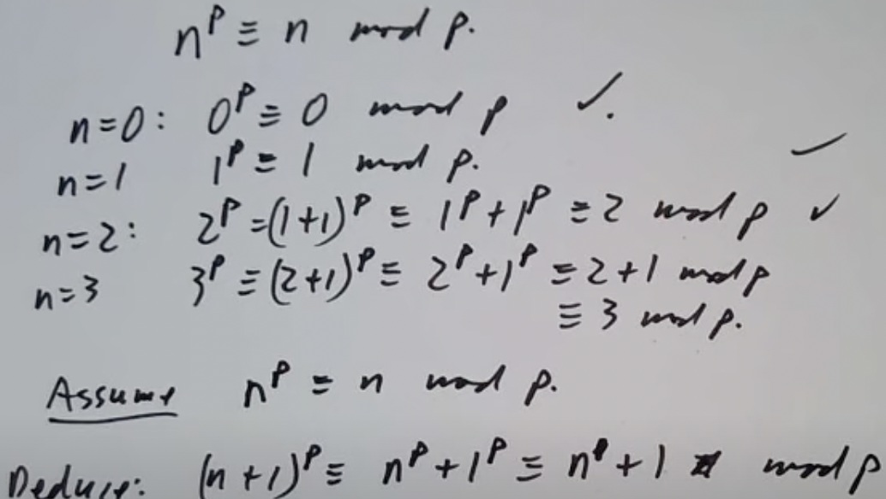

先代入前几个数字直接验证是否正确，然后假设 $n^p\equiv n\mod p$ 成立，推断n+1的情况同样成立，于是得证对所有正整数成立。

看一个问题。35是质数吗？目前为止最蠢的问题出现了，不过我们假装一下，假装35是一个1000位的数字。可以利用 $2^{35}\equiv 2\mod 35$ 来检查，如果不成立，35就不是一个质数。现在要找 $2^{35}$ 模35的值。笨方法，一个一个乘下去，2\*2=4,2\*4=8,2\*8=16,2\*16=32...这个方法明显有问题，这么乘下去会得到一个大得离谱的数字。再试一次，每次我们把结果模35。 $2\*32=64\equiv 29\mod 35,2\*29\equiv 23\mod 35...$ ，还是有点问题，这样仍然要算35次，数字越大需要的步骤就越多。还有更快速的方法吗？

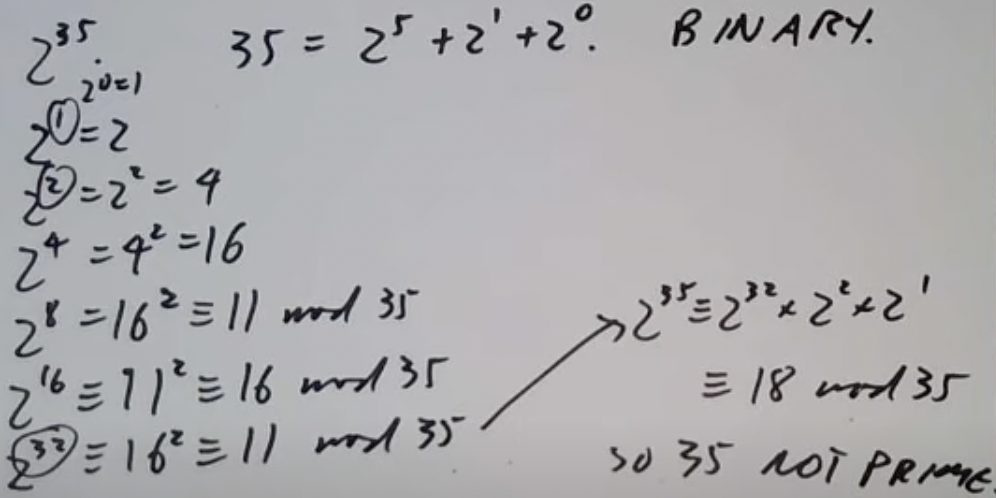

我们取2的2次方幂模目标数35的结果，然后把 $2^{35}$ 写为 $2^{32}\*2^2\*2^1$ 次方的形式，就很容易算出来结果了。

当 $2^p\not\equiv 2\mod p$ 时，我们可以直接说p不是质数；但是当 $2^p\equiv 2\mod p$ 时，我们却不能笃定p是一个质数。有一个有趣的数字，561，等于3\*11\*17。它有趣的地方并不在此，而是它无论模3-1，11-1还是17-1，都与1同余。这意味着 $a^{561}\equiv a\mod 3,a^{561}\equiv a\mod 11,a^{561}\equiv a\mod 17$ 。既然 $a^{561}\equiv a\mod 3,11,17$ ，我们就可以知道 $a^{561}\equiv a\mod 561$ 。因此当我们做测试时，最好多测几个质数，考虑人们已经证实有无限多个和561有类似性质的数了，万一手上测试的就是呢？

依稀记得前几节课说有无数个形如4n+1，n大于等于0，的质数。当时直接用了这个定理：如果 $p|n^2+1$ ，那么p=2或者 $p\equiv 1\mod 4$ 。同样的流程，先看对于前几个数成不成立。

```
n        1 2   3  4   5   6   7   8
n平方+1   2 5  10 17  26  37  50  65
质因数分解 2 5 2,5 17 2,13 37 2,5 5,13
```

确实模4都与1同余，除了2。变换一下 $n^2+1\equiv 0\mod p$ 的说法，等于说 $n^2\equiv -1$ 。又根据费马小定理， $1\equiv n^{p-1}$ 。前面说 $n^2\equiv -1$ ，那 $1\equiv n^{p-1}\equiv (-1)^{(p-1)/2}$ 。当(p-1)/2是奇数时，结果为-1；偶数时为1。已经知道结果是1了，因此(p-1)/2只能是偶数，于是得到 $p\equiv 1\mod 4$ 。

$1\equiv n^{p-1}$ 其实是费马小定理的变形，原来的费马小定理两边除以p。同余中除法并不保留，所以这样做是有条件的： $n\not\equiv 0\mod p$ 且p是质数。

## Fermat's theorem

这节课来看看费马小定理的应用。首先复习一下费马小定理：

$a^p\equiv a\mod p$ ,p为质数

以及其变种：

$a^{p-1}\equiv 1\mod p$ ,p是质数且gcd(a,p)=1。

再补充一个概念：a模p的阶定义为满足 $a^n\equiv 1\mod p$ 的最小正整数n。（Order of a mod p is smallest n>0 with $a^n\equiv 1\mod p$ ）。比如p=7，那么a的可能值就为1，2，3，4，5，6（0排除，因为无论0的多少次幂都不可能与1模p同余）。 $1^1\equiv 1$ ，阶就是1； $2^3\equiv 1$ ，阶就是3； $3^6\equiv 1$ ,阶就是6，等等。最后能得到这些1-6的阶分别为1，3，6，3，6，2，都整除于6。于是有定理：a模p的阶整除于p-1，在证明前需要了解一个概念： $a^{-n}$ 是什么？

变形一下就知道 $a^{-n}=(a^{-1})^n$ ，但是 $a^{-1}$ 是什么？换句话说，模定义下的逆元是什么？答案很简单，如果gcd(a,p)=1,那么a就有模p下的逆元，写为同余方程就是：

$ax\equiv 1\mod p$

写成另一种形式的方程：

$ax=1+py$

根据之前学的辗转相除法可以知道，如果gcd(a,p)=1，那么方程有解。此时我们把目光看向全部满足 $a^n\equiv 1\mod p$ 的整数n，能知道n在+，-下封闭，即 $a^m\equiv 1,a^n\equiv 1,a^{m+n}\equiv 1,a^{m-n}\equiv 1$ 。符合在加减法下闭合的集合被称为理想数集，该子集包含k的所有倍数。突然冒出来的k代表理想数集中的最小元素，说人话就是满足 $a^k\equiv 1$ 的最小k值。不难发现这个定义和a的阶完全一致，因此k就等于a的阶。

现在证明就呼之欲出了。 $a^n\equiv 1\mod p\iff$ a的阶整除于n。结合费马小定理 $a^{p-1}\equiv 1\mod p$ ，直接得出a的阶整除于p-1。

前面都是铺垫，现在才到应用时间。尝试证明这个定理：假如p，q都是质数，p整除于 $2^q-1$ ，那么 $p\equiv 1\mod q$ 。过程不难，根据定理给的前提，变形就能得到 $2^q\equiv 1\mod p$ 这个关键式子。刚刚学到的定理就派上用场了，可知2的阶整除于q。q是个质数，所以2的阶只能是1或者q。1不可能，2的1次方明显不与1同余，那只能是q了。又有费马小定理 $2^{p-1}\equiv 1$ 得出阶整除于p-1，代入即得q｜p-1。

再来一个，证明 $2^{13}-1$ （8191）是一个质数。根据前几节课的内容，我们可以检查全部小于 $\sqrt{8191}$ 也就是91的质数，不大，慢慢算还是可以的。但是时间就是金钱，有没有办法缩减这一繁琐的步骤？当然有，如果 $2^{13}-1$ 不是质数，那必有一个数q满足 $q|2^{13}-1$ ，根据定理知道 $q\equiv 1\mod 13$ 。那我们只需要看全部模13同余1的质数就好了。14和27不用看就知道不是质数，只剩下53和79，更大的就超过100了。此时我们只需要检查53和79是否整除于8191，简单了不少。

用费马小定理看费马质数。防止大家忘了定义，费马质数是形如 $2^n+1$ 的质数。注意如果n有一个奇数因子就不可能是质数了。因为 $x^{2n+1}+1$ 拆开得到 $(x+1)(x^{2n}-x^{2n-1}+...+1)$ 明显整除x+1。当n=ab，a是奇数时， $2^n+1=2^{ab}+1=(2^b)^a+1$ ，整除 $2^b+1$ 。所以在我们说 $2^n+1$ 是质数时，隐藏的信息为n是2的幂。当n为16时， $2^{16}+1=65537$ ，这个数是质数吗？

用和刚才一样的方法，如果 $2^{16}+1$ 不是质数，必有整数p满足 $p|2^{16}+1$ 。变形一下使其更具有普遍性， $p|2^{2^n}+1$ 。写为同余式就是 $2^{2^n}\equiv -1\mod p$ 。把两边平方得到 $2^{2^{n+1}}\equiv (-1)^2\equiv 1\mod p$ 。我们知道2模p的阶一定整除于 $2^{n+1}$ ，只能是 $1，2，4...2^n,2^{n+1}$ 中一个。不可能是 $2^n$ ，因为已知 $2^{2^n}\equiv -1\mod p$ ,也不能是任何比 $2^n$ 更小的数，那只能是 $2^{n+1}$ 了。再次结合费马小定理得到 $2^{p-1}\equiv 1\mod p$ 。既然2的阶 $2^{n+1}$ 整除于p-1，即 $2^{n+1}|p-1$ ，那么 $p\equiv 1\mod 2^{n+1}$ ，当 $p|2^{2^n}+1$ 时。

回到65537身上。 $2^{16}+1=65537$ ，如果有p|65537，则 $p\equiv 1\mod 2^5=32$ 。只需要检查小于等于 $\sqrt{65537}\leq 2^8+1=257$ 的质数。最后满足条件的只有97和193，完全不难。

欧拉正是利用这一方法发现 $2^{2^5}+1=2^32+1$ 不是质数。假如该断言成立，能找到整数p满足 $p|2^{2^5}+1$ ，即 $p\equiv 1\mod 2^{5+1}=64$ 。慢慢找满足模64余1的质数，193，257，449，577，641...幸运的是， $641|2^{2^5}+1$ ，意味着我们不用继续往下看了。有一种稍微简单的方式检查 $641|2^{2^5}+1$ 。

我们先算出 $2^{16}=65536=\equiv 154\mod 641$ 。接着我们发现 $2^{32}=(2^{16})^2=154^2\equiv -1\mod 641$ 。这一步背后的重点在于，如果我们想检查 $2^{2^n}+1$ 是否整除质数p，无需直接算 $2^{2^n}+1$ ，而是从2开始，重复以下步骤：

$2\equiv 2\mod p$<br>
$2^2\equiv a\mod p$<br>
$a^2\equiv b\mod p$<br>
$b^2\equiv c\mod p$

由于每次我们都模p缩减数字的大小，这个方法可以让检查的数字不会过于大。

最后以一个不是和费马小定理特别有关系的例子收尾。假设 $a^2\equiv b^2\mod m$ ，这是否意味着 $a\equiv \pm b\mod m$ ？不一定，当m=8时， $1^2\equiv 3^2\equiv 5^2\equiv 7^2\mod m$ ，然而 $1\equiv -7,3\equiv -5$ 。不过这条在m为质数的情况下成立，如果 $a^2\equiv b^2$ ，那么 $a^2-b^2\equiv 0$ ，因式分解得到 $(a+b)(a-b)\equiv 0$ 。之前学过，如果 $ab\equiv 0\mod p$ ，p是质数，则a模p同余0或者b模p同余0。这种情况下就是a-b模p同余0或者a+b模p同余0。

升级版：假如 $a^2\equiv b^2\mod m^2$ ，是否说明了 $a\equiv \pm b\mod m$ ？仍然不对，选择两个不能为2的质数p，q，构造条件 $a\equiv b\mod p^2,a\equiv -b\mod q^2$ 。此时 $a^2\equiv b^2\mod p^2,q^2$ ，可以说 $a^2\equiv b^2\mod (pq)^2$ 。会发现在开始的那两个条件的限制下， $a\not\equiv \pm b\mod pq$ 。

## Euler's theorem

看一个费马小定理的延伸。如果p整除于 $a^q-1$ ，p，q都是质数，那么要么 $p\equiv 1\mod q$ ，要么 $a\equiv 1\mod p$ 。还是类似的证明方式，把条件写为同余的形式 $a^q\equiv 1\mod p$ ，那么a的阶整除于q。q是质数，那a的阶只能是1或者q。如果a的阶是1，得到 $a^1\equiv 1\mod p$ ，证明其中一种情况。如果阶是q，根据费马小定理 $a^{p-1}\equiv 1\mod p$ ，可知q|(p-1)，即 $p\equiv 1\mod q$ ，证明完毕。

形如 $\frac{x^q-1}{x-1}$ 的数字划分模p同余1的素数（divides out primes 1 mod p）。假设我们让q=5， $\frac{x^5-1}{x-1}=x^4+x^3+x^2+x+1$ 。找到一个数字p整除于这个式子，可得出要么 $p\equiv 1\mod 5$ ，要么 $x\equiv 1\mod p$ 。如果是第二种情况， $x^4+x^3+x^2+x+1\equiv 5\mod p$ ，考虑到前面假设p整除这个式子，p|5。推断出p要么模5同余1，要么整除5。如果硬要让5｜x，p就不整除于 $x^4+x^3+x^2+x+1$ 了。最终得到结论：如果5｜x， $p|x^4+x^3+x^2+x+1$ ，那么p模5同余1。

借用以上结论可以证明有无数个模10余1的质数。让 $p|(10x)^4+(10x)^3+(10x)^2+(10x)+1$ ，x=我们已知的所有个位数为1的质数的积。必然有 $p\equiv 1\mod 10$ ，同余5和2都不可能，因为10x里面已经有5和2这两个因子了。第二点更重要，x不可能是任何已知的质数，那只能是新的个位数为1的质数了。

欧拉定理要从一个问题开始： $a^x\mod m$ 等于？使用函数法，让x->2x mod m，并让m=12。注意到2的幂中有一个循环， $2\times 2\equiv 4\mod 8,4\times 2\equiv 8\mod 12,8\times 2\equiv 4\mod 12$ 。写出费马小定理的弱化版本：如果给出a，m，那么 $a^x\equiv a^y$ ,x<y。这是因为当我们写出 $1\rightarrow a\rightarrow a^2\rightarrow a^3\rightarrow a^x\rightarrow a^y$ 时，是可以写出无限个幂次的，然而模m得到的剩余系数量的大小却是有限的。那么我们一定能找到两个数字不同却结果相同的幂。假如gcd(a,m)=1，可知a是可逆的，就有 $a^x\equiv a^y\rightarrow a^{y-x}\equiv 1\mod m$ 。于是得到最终结论：如果gcd(a,m)=1，那么必有一个大于0的x，满足 $a^x\equiv 1\mod m$ 。这便是费马小定理的弱化版本了。

让m=13，a=5，观察a的幂：

$1\rightarrow 5\rightarrow 25\equiv 12\rightarrow 8\rightarrow 1$

如果让某一个数字每次都乘上a呢？比如2:

$2\rightarrow 10\rightarrow 11\rightarrow 3\rightarrow 2$

4呢？

$4\rightarrow 7\rightarrow 9\rightarrow 6\rightarrow 4$

发现循环同样出现。当a可逆时，这些循环要么无交集（disjoint），要么就是相同的。还发现循环都有相同的大小，这是因为当我们把4的循环里的6写为 $7\times a^2$ 时就会知道都是互相对应着的，故是一样的大小。

与13互质的数模13会形成不相交的循环并集（disjoint union of cycles），大小为5的阶。既然这些数字可以写为不相交的循环并集，5的阶一定整除于与13互质的数的数量。互质这个前提告诉我们这些数一定有逆元，类似地，对于其他数，如果gcd(a,m)=1，那么a的阶整除于 $\phi(m)$ ，即与m互质的数的数量。最后我们得到了欧拉定理：

$a^{\phi(m)}\equiv 1\mod m$ ，要求gcd(a,m)=1。

欧拉定理的特殊情况就是费马小定理。如果m为质数，则 $\phi(m)=m-1$ 。

来用一用欧拉定理：尝试找到 $7^{403}$ 的最后两位数。不知道为什么要找，总之找了再说。先算 $\phi(100)=40$ ,这一步不是很难，我们只要找末尾是1，3，7，9的数就好了。根据欧拉定理， $7^{40}\equiv 1\mod 100$  。拆一下原式 $7^{403}\equiv (7^{40})^{10}\times 7^3\equiv 7^3\mod 100\equiv 343\mod 100$ ，那 $7^{403}$ 的最后两位数就是43了。

最后来一个休闲数论的内容。 $7^{7^{7^{7}}}$ 的最后一位是什么？完全没有任何意义，纯粹做来玩。这题相当于问 $7^{7^{7^{7}}}\mod 10$ ，干脆直接看作 $7^x\mod 10$ ，把那堆玩意扔一边去。首先要找 $x\mod \phi(10)$ ，这样能直接从x里减去5的倍数。 $\phi(10)=4$ ，但是想消除倍数还要看x代表的值 $7^{7^{7}}$ 。重复刚才的步骤，找 $7^7\mod \phi(4)=2$ 的值，同样为了消倍数。  $7^7\equiv 1\mod \phi(4)=2$ ，因为7模2余1，7的7次方还是模2余1。下一步， $7^{7^{7}}\equiv 7^1\equiv 3\mod 4$ ，因为 $7^7\equiv 1\mod \phi(4)=2$ ，可以直接替换。回到原点， $7^{7^{7^{7}}}\equiv 7^3\equiv 343\equiv 3\mod 10$ 。解决此题。

## Wilson's theorem

前面两个定理介绍的都是幂的情况，威尔逊定理则关注阶乘。

$(p-1)!\mod p$

假设我们现在什么也不知道，笨却也是最好的方法肯定是一个一个数字测试。

```
m     (m-1)!      (m-1)! mod m
1       1               1
2       1              -1
3       2              -1
4       6               2
5      24              -1
6     120               0
7     720              -1
8    5040               0
9   90320               0
```

发现当m是质数时，(m-1)! mod m的结果总是-1。这便是威尔逊定理：

$(p-1)!\equiv -1\mod p$ ，当p为质数

再尝试一次，让p=11。问题出现了，没有计算器的情况下算11-1的阶乘有点烦人，而且教授懒得算。看来用另外的一个比较聪明的方法更好。写出小于11的全部正整数，分析一下它们的乘积模11是多少。值得注意的一个现象：

$2\times 6\equiv 1\mod 11$<br>
$3\times 4\equiv 1\mod 11$<br>
$5\times 9\equiv 1\mod 11$<br>
$7\times 8\equiv 1\mod 11$

这几组数字乘在一起模11都是1，意味着影响最后模的结果的数只剩下1和10。

$(11-1)!\equiv 1\times 10\equiv -1\mod 11$

1和10这么特殊的原因在于与它们配对的数就是自己。

$10^2\equiv 1\mod 11$<br>
$1^2\equiv 1\mod 11$

从上面的例子我们可以看到，随便找一个小于质数p的正整数a，必能在小于质数p的范围内再找到一个 $a^{-1}$ ，满足 $a\times a^{-1}\equiv 1\mod p$ 。如果 $a\not ={a^{-1}}$ ，则两者互相抵消，不会影响最后模的结果。如果 $a\equiv a^{-1}$ ，则可以写为 $a^2\equiv 1$ ，也就是 $a^2-1\equiv 0$ 。因式分解得 $(a+1)(a-1)\equiv 0$ 。前面学过，当p是质数时，如果p整除这个形式的式子，代表着 $a-1\equiv 0$ 或者 $a+1\equiv 0$ 。既然这样，必有 $a\equiv \pm 1$ 。

这就是为什么威尔逊定理对于全部素数都成立了。当我们求`(p-1)!`时，因子 $1,2,...,(p-2),(p-1)$ 中除了p-1和1都能互相配对后抵消，留下 $(p-1)^{-1}\equiv (p-1)$ 。因此 $(p-1)!\equiv 1\times (p-1)\equiv -1\mod p$ 。

质数有这个定理，很难不让人猜测合数有没有类似的。比如， $(m-1)!\equiv 0\mod m$ ?简单分析一下，当m是质数时，可以把m分解为ab，a大于等于1，b小于m。(m-1)!肯定会包括a和b，所以肯定就整除ab=m了！看起来很合理，实际上当m=4时出大问题。因为4=2\*2，但是(4-1)!里面只有1个2，无法整除4。不过这也是唯一的反例，当m不是质数且不等于4时， $(m-1)!\equiv 0\mod m$ 是成立的。教授把证明这个当成作业布置了，快去试试吧。

学完定理后自然接上应用时间。请找到 $\sqrt{-1}$ 。不是复数里的i，这里代表解 $x^2\equiv -1\mod p$ 。这个方程并不是每次都有解，比如p=3时。更详细地，如果 $p\equiv 3\mod 4$ 且p是奇数，则无解。因为原方程 $x^2\equiv -1\mod p$ 告诉我们 $x^4\equiv 1\mod p$ ，代表x的阶是4。通过费马小定理可以知道 $x^{p-1}\equiv 1$ ，结合之前学的内容，4|p-1。那么 $p\equiv 1\mod 4$ ，如果原方程有解。 $p\equiv 3\mod 4$ 是个什么东西？肯定无解。p要求不是奇数是因为，假如p=2，之前的叙述"原方程 $x^2\equiv -1\mod p$ 告诉我们 $x^4\equiv 1\mod p$ "就不成立了，毕竟模2余1和余-1是一个意思。

再来一个问题，是上一个问题的逆定理。如果 $p\equiv 1\mod 4$ ，-1有 $\sqrt{}$ 吗？手动检查几个情况。
  
p=5, $2^2\equiv -1$<br>
p=13, $5^2\equiv -1$<br>
p=17, $4^2\equiv -1$
  
这三个都能找到，尝试一般性证明。如果我们知道"如果 $p\equiv 1\mod 4$ ，那么 $(\frac{p-1}{2})!$ 是 $\sqrt{-1}$ "这条定理，一切就迎刃而解了。不如先证明这个好了。当p=13时， $(\frac{p-1}{2})!$ 是1，2，3，4，5，6的乘积。剩下的7，8，9，10，11，12与它们则是配对的关系， $6\equiv -7\mod 13,5\equiv -8\mod 13$ 等等。所以 $(p-1)!\equiv (\frac{p-1}{2})!\times (\frac{p-1}{2})!\times (-1)^6\mod 13$ 。威尔逊定理又告诉我们 $(p-1)!$ 是-1，就有 $(-1)\equiv ((\frac{p-1}{2})!)^2$ 。此处省略掉-1的6次方。不难看出当 $\frac{p-1}{2}$ 是偶数时，刚才的结果都成立。最后得出，当 $\frac{p-1}{2}$ 是偶数时， $p\equiv 1\mod 4$ ，毕竟满足 $p\equiv 1\mod 4$ 的数才能满足 $\frac{p-1}{2}$ 是偶数。总结一下，p（奇数）有-1的平方根，当且仅当 $p\equiv 1\mod 4$ ，平方根是 $(\frac{p-1}{2})!$ 。

（后面一段笔记写了但是没保存下来，气死我了，直接学下一课）

## The Chinese remainder theorem

中国剩余定理揭示了同余方程的解的数量。都到这里了要是不会线性同余方程岂不爆炸？线性同余方程形如 $ax\equiv b\mod m$ ，根据欧几里得的辗转相除法，这样的方程只有在b整除gcd(a,m)时可解。比如 $6x\equiv 7\mod 45$ 不用解就知道无解，因为gcd(6,45)=3,而7明显不整除3。换一个， $6x\equiv 3\mod 45$ 。这下有解了。把方程写成这种形式:6x=3+45y，两边同时除以3，得到 2x=1+15y。利用辗转相除法就能算出来 $x\equiv 8\mod 15$ 了。就一个解吗？对于这个方程是，然而对于原方程 $6x\equiv 7\mod 45$ 就不是了。原方程有3个解，8，8+15，8+30。当gcd(a,m)=1时，同余方程有唯一解；当gcd(a,m)>1时，同余方程可能无解或者有很多解。

更一般的情况，我们想解 $f(x)\equiv 0\mod m$ ，f是基于x的多项式。例如 $x^3\equiv 5\mod 60$ 。这时就要分类讨论了。

1. m是质数。这种情况比较简单，因为 gcd(a,m)=1，所以a有模m下的逆元，或者 $a\equiv 0$ 。
2. $m=p^n$ 。m等于某个质数的幂。这时我们就要把m简化到m=p。后续课程会讲。
3. m是任意数字，可质因数分解为 $p_{1}^{n_1}p_{2}^{n_2}p_{3}^{n_3}...$ 可利用CRT将m简化为 $m=p^n$ 。

今天先看第3种情况。给出一个线性同余方程组：

$x\equiv a_1\mod m_1$<Br>
$x\equiv a_2\mod m_2$

需要找到一个同时满足两个方程的x。举个例子：

$x\equiv 1\mod 6$<Br>
$x\equiv 2\mod 10$

在解题前一定要先判断是否有解。第一个方程告诉我们x是奇数，第二个方程告诉我们x是偶数。哪有数又是奇数又是偶数的，此题无解。

刚才的方程组的两个模数不互质，会出现问题。如果 $m_1$ 和 $m_2$ 互质，我们应该能轻松地解出来。写成下面的形式：

$x=a_1+m_1y_1=a_2+m_2y_2$

变形一下：

$m_1y_1-m_2y_2=a_2-a_1$

这不就是个线性方程吗，在 $gcd(m_1,m_2)=1$ 时有解。这就是为什么前面提到要求 $m_1$ 和 $m_2$ 互质了。如果不互质，可能会没有解，可能会有很多解。

两个方程的线性同余方程组有模 $m_1,m_2$ 下唯一的解，如果 $gcd(m_1,m_2)=1$ 。练习一下：

$x\equiv 1\mod 17$<br>
$x\equiv 3\mod 21$

第一步还是变形：x=1+17y=3+21z,-21z+17y=2。先用辗转相除法解-21z+17y=1，得到z=4，y=5。乘上2就得到了-21z+17y=2的解：z=8，y=10。这不就得到答案了，x=171。

加量不加价，解有3个方程的同余方程组。

$x\equiv a_1\mod m_1$<br>
$x\equiv a_2\mod m_2$<br>
$x\equiv a_3\mod m_3$

几个模数也需要互质，注意是两两互质而不是3个互质。像下面这样：

$gcd(m_1,m_2)=1$<br>
$gcd(m_2,m_3)=1$<br>
$gcd(m_3,m_1)=1$

这样限制比3个互质严格。试想 $m_1=6,m_2=15,m_3=10$ ，$gcd(m_1,m_2,m_3)=1$ ，但是随便挑出两个都是不互质的。解法差不多，先解前两个方程，找到 $x\equiv b\mod m_1m_2$ 的解；然后把这个解和剩下的 $x\equiv a_3\mod m_2$ 放在一起，又是一个同余方程组，解了就能得到 $x\equiv c\mod m_1m_2m_3$ 了。可以看出来只要两两互质，多少个方程的线性同余方程组都能这么解出来。

孙子曾有这么一道题。有一堆不知道其数目的物品，按照3个一组分剩下2个，按照5个一组分剩下3个，按照7个一组分剩下两个。这个放到今天就是个简单的同余方程组：

$x\equiv 2\mod 3$<Br>
$x\equiv 3\mod 5$<Br>
$x\equiv 2\mod 7$

变形为x=2+3y=3+5z。刚刚已经学过怎么解了，得到y=2，z=1。那么x=8。前两个方程就能合并为一个： $x\equiv 8\mod 15$ 。把这个和第三个合在一起，变形得到 $x=2+7y=8+15z$ 。一样的套路，解得y=-6,z=-12，x=-82。我们需要正整数解，把3个模数乘起来，3\*5\*7=105,把最小解-82加上k个105就是解。最小正整数解就是-82+105=23。

给出CRT的一个可选抽象证明。

$x\equiv a_1\mod m_1$<Br>
$x\equiv a_2\mod m_2$

当 $gcd(m_1,_2)=1$ 时，解这个方程组等同于找模 $m_1m_2$ 的解。之前都是用辗转相除法解的，这次直接数试一下。写出 $0,1,2,...,m_1m_2-1$ 这些数，这个集合的大小为 $m_1m_2$ 。再写出 $0,...,m_1-1$ ，这个集合大小为 $m_1$ ；写出 $0,...,m_2-1$ ,套路都知道了，这个集合大小为 $m_2$ 。大小为 $m_1$ 的集合乘以大小为 $m_2$ 的集合，结果集合的大小正好是 $m_1m_2$ 。如果在原来大小为 $m_1m_2$ 的集合里选一个数x映射到另外的两个集合，就能得到 $x\mod m_1$ 和 $x\mod m_2$ 。它们的映射关系是不是双射呢？（提供一个[链接](https://www.zhihu.com/question/65496334)，怕有人和我一样基础不牢）。

如果它既是单射又是满射，根据定义就是双射了。首先它是个单射，单射告诉我们如果x和y有相同的像，则x=y。证明不复杂，假设有：

$x\rightarrow x\mod m_1,m\mod m_2$<br>
$y\rightarrow y\mod m_1,m\mod y_2$

它们不相等，但它们的像是一样的。那我们就能知道x-y整除于 $m_1,m_2$ 。因为 $m_1,m_2$ 互质，x-y同样整除于 $m_1m_2$ 。这只能x=y了，因为我们在大小为 $m_1m_2$ 的那个集合取的数，不可能有同余却不一样的数。既然单射了，在两个相同大小的集合间的映射就也是满射了。满射告诉我们对于大小是 $m_1m_2$ 的结果集合的每个数，在大小为 $m_1m_2$ 的那个集合里必有一个元素可以映射过去。说明在 $m_1$ 集合里取出一个 $a_1$ ， $m_2$ 集合里取出一个 $a_2$ ，我们一定能在 $m_1m_2$ 集合里找到一个能映射过去的值。这便是CRT的存在性的抽象证明。

教授给了个例子。


最上面是两个模数互质的例子。会发现每组数的配对都不重复，而且单双数都有。但是不互质的情况就不是这样了。不是单射，因为出现了重复的一组；也不是满射，因为这些数字配对要么全是单数，要么全是双数。

现在我们想解 $x^2\equiv x\mod 10^n$ 。

$6^2\equiv 36\mod 10$<Br>
$76^2\equiv 5776\mod 10^2$<Br>
$1787109276^2\equiv ...1787109376\mod 10^{10}$

无论模10的多少次方，都有平凡解 $0^2\equiv 0\mod 10^n$ 和 $1^2\equiv 1\mod 10^n$ 。

$5^2\equiv 25$<br>
$25^2\equiv 625$<br>
$625^2\equiv ...625$<br>
$8212890625^2\equiv ...8212890625$

为什么会发生这种情况呢？首先要意识到，解 $x^2\equiv x\mod 10^n$ 这个方程相当于解一个同余方程组：

$x^2\equiv x\mod 5^n$<br>
$x^2\equiv x\mod 2^n$

因为10不是素数并等于2\*5。幸好 $gcd(5^n,2^n)=1$ ，满足我们的要求。第一个方程有两个解， $x\equiv 0,x\equiv 1$ ；第二个方程有同样的解。把它们搭配组合起来就是不同解了，全是0没意思，全是1也没意思，一个1一个0才好玩，比如模 $2^n$ 的取解0，模 $5^n$ 的取解1。就能得到x=6，76，376； $5,5^2,5^3$ ; $2,2^2,2^3$ 。或者换种交叉方式， $2^n$ 的取解1，模 $5^n$ 的取解0，也能得到不同的答案：5，25，625...直接这么看， $5^2=25,25^2=625,625^2=...0625$ 。为什么重复平方都能得到答案？仔细看这个方程组：

$x\equiv 0\mod 5^n$<br>
$x\equiv 1\mod 2^n$

两边同时平方，得到：

$x^2\equiv 0\mod 5^{n+1}$<br>
$x^2\equiv 1\mod 2^{n+1}$

其实应该是 $5^{2n}$ 和 $2^{2n}$ 的，只不过n+1才是我们需要的。然后变形就能知道 $x=1+2^ny$ ，平方得到 $x^2=1+2\times 2^ny+(2^ny)^2$ 。注意到 $2^ny+(2^ny)^2$ 可被 $2^{n+1}$ 整除。这就是为什么每当我们找到一个解后，平方就能把 $x^2\equiv x\mod 10^n$ 这个方程的解扩大一位。这里教授留了个问题，5可以通过无限平方扩大解，但是为什么6不可以呢？

最后再看个问题就下课。 $f(x)\equiv 0\mod m$ 这个方程有多少个解？CRT已经教了我们如何简化为质数次幂，还能告诉我们有多少个解。当gcd(m,n)=1时，模mn的解的数量等同于模m的解的数量乘上模n的解的数量。更多质因数分解的情况也适用。

## Euler's totient function

totient这个词并没有什么意义，数学家可喜欢给函数取名字了。 $\phi(n)$ 是模n的剩余系中与n互质的数的数量。之前看过演示就不专门写了，大家应该都知道，假如p是一个质数， $\phi(p)=p-1$ 。还有一个特性是，如果gcd(m,n)=1，则 $\phi(mn)=\phi(m)\phi(n)$ 。这个性质之前也看过，multiplicative。和刚刚学的CRT有关系，当gcd(m,n)=1,如果我们能找到一对数ab，a是模m的余数，b是模n的余数，则能找到一个模mn的余数c。这个c与mn互质，仅当a和m互质且b与n互质时。与mn互质的数c有 $\phi(mn)$ 个，与m互质的数a有 $\phi(m)$ 个，与n互质的数b有 $\phi(n)$ 个，这就是欧拉函数的multiplicative性质。

看看任意n下 $\phi(n)$ 是什么。日常质因数分解， $n=p_{1}^{n_1}p_{2}^{n_2}p_{3}^{n_3}...$ 。 $\phi(n)$ 就等于 $\phi(p_{1}^{n_1})\times \phi(p_{2}^{n_2})...$ 。找质数幂的totient不难，等同于在 $0...p^m-1$ 中找到与 $p^m$ 互质的数的数量。与 $p^m$ 互质的数意思是不整除p的数。我们知道有 $p^{m-1}$ 个数整除p，那不整除于p的数的数量一定是`总数-整除p的数的数量`，即 $p^m-p^{m-1}=p^m(1-\frac{1}{p})$ 。最后就能知道 $\phi(n)=p_{1}^{n_1-1}(p_1-1)\times p_{2}^{n_2-1}(p_2-1)...$ ，变形即是公式：

$\phi(n)=n(1-\frac{1}{p_1})(1-\frac{1}{p_2})(...)$

还能用[容斥原理](https://baike.baidu.com/item/%E5%AE%B9%E6%96%A5%E5%8E%9F%E7%90%86/10146840)考虑:

$\phi(6)=6-\frac{6}{2}-\frac{6}{3}+\frac{6}{6}$

先假设 $\phi(6)$ 就等于6，然后减去整除2的数的数量，减去整除3的数的数量。这样还不够，因为6被减了两次，于是再加上整除6的数的数量。分解即得：

$6(1-\frac{1}{2})(1-\frac{1}{3})$

放一张图就懂了，下面是30的情况。

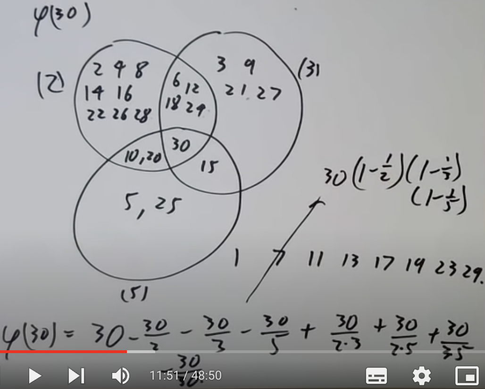

甚至还能用概率取考虑。用概率的视角看，找 $\phi(30)$ 的值就等于找与30互质的数的概率。有3种事件：

A:数字整除2，概率二分之一<br>
B:数字整除2，概率三分之一<Br>
C:数字整除5，概率五分之一

它们都是独立事件，因此:

$P(A\cap B)=P(A)\times P(B)$<br>
$P(B\cap C)=P(B)\times P(C)$<br>
$P(A\cap C)=P(A)\times P(C)$<br>
$P(A\cap B\cap C)=P(A)\times P(B)\times P(C)$

我们要找的是没有任何事件发生的概率，即：

$1-P(A)-P(B)-P(C)+P(A\cap B)...$<Br>
$=(1-P(A))(1-P(B))(1-P(C))$<br>
$=(1-\frac{1}{2})(1-\frac{1}{3})(1-\frac{1}{5}))$

那 $\phi(30)$ 就是30乘上这个概率得到的数字了。 $30(1-\frac{1}{2})(1-\frac{1}{3})(1-\frac{1}{5}))=8$ ，这个数字没错。

浅浅提一下卡迈克尔猜想（carmichael conjecture）。这个猜想觉得，如果给定一个n，是否能找到一个不等于n的m，使 $\phi(m)=\phi(n)$ ？答案应该是可以。“应该”这个词表示这个猜想其实没有被证明，只不过人们找不到什么特别好的反例。试想当n是奇数时， $\phi(n)=\phi(2n)$ ，告诉我们一半的n都能确保找到m。留给各位未来的数学家证明了。

有一个起源于高斯的问题。可不可以找到满足 $\phi(n)$ 是2的幂的n？高斯曾经提出一个定理，我们仅可以用尺子和圆规画出那些边数量是2次幂的多边形。那就找找看吧， $\phi(n)=2^k$ ，质因数分解n得到 $n=p_{1}^{n_1}p_{2}^{n_2}...$ ， $\phi(n)$ 就等于 $p_{1}^{n_1-1}(p_1-1)\times...$ 。如果 $p_i$ 不等于2， $n_i$ 就要等于1。要是不等于的话， $\phi(n)$ 就能整除 $p_i$ ， $p_i$ 又不等于2，就不是2的幂了。以及 $p_i-1$ 需要时2次幂，即费马质数。这些条件的限制下， $n=2^{a}\times p_1\times p_2\times...$ ，每个 $p_i$ 都是唯一的。得到结论，能用尺子和圆规画出的多边形的边数是 $2^n$ 乘上费马质数子集。

$\phi(n)$ 能有多大？上限很好找， $\phi(n)$ 怎么着都会小于n，前提是n不等于1。 $\frac{\phi(n)}{n}\leq 1$ ，很接近1，我们能让 $\frac{\phi(n)}{n}$ 变得有多小呢？首先找出公式：

$\frac{\phi(n)}{n}=(1-\frac{1}{p_1})(1-\frac{1}{p_2})(...)$

$p_i|n$ 。 $\frac{\phi(n)}{n}$ 能有多小完全取决于 $(1-\frac{1}{2})(1-\frac{1}{3})(1-\frac{1}{5})(1-\frac{1}{7})...$ 能有多小。很眼熟啊，要么接近0，要么有一个下限。取整个式子的倒数：

$\frac{1}{1-\frac{1}{2}}\frac{1}{1-\frac{1}{3}}\frac{1}{1-\frac{1}{5}}...$

展开即得：

$(1+\frac{1}{2}+\frac{1}{2^2}+\frac{1}{2^3}...)(1+\frac{1}{3}+\frac{1}{3^2}+\frac{1}{3^3}...)...(1+\frac{1}{p}+\frac{1}{p^2}+\frac{1}{p^3}...)$

求个总和：

$\sum \frac{1}{n}$ ，n是全部小于等于p的质因子。

总和至少为 $\sum_{n\leq p} \frac{1}{n}$ 。微积分里学过， $1+\frac{1}{2}+\frac{1}{3}+\frac{1}{4}+...\rightarrow \infty$ 。我们这个类似， $\prod_p (1-\frac{1}{p})\rightarrow 0$ ，因此 $\phi(n)/n$ 可以变得非常小，只要你愿意，多小都行，不过永远大于0。

换一个问题， $\phi(n)/n$ 的平均值是多少？相当于问数字与n互质的几率。这就不得不问另一个问题了，随机选择两个数字m，n，这两个数字互质几率有多高？“随机选择”不是一个很好的词，这么多数字，说“随机”好像没有意义。那我们就把随机选择的边界控制在小于等于N。现在有点意义了，只不过结果会根据N的变化有所改变。逐步思考，两者都被2整除的几率为 $(1-\frac{1}{4})$ ，都被3整除的几率是 $(1-\frac{1}{3^2})$ ，都被5整除的几率是 $(1-\frac{1}{5^2})$ 。把这些几率乘起来，得到mn互质的概率大约为 $(1-\frac{1}{2^2})(1-\frac{1}{3^2})(1-\frac{1}{5^2})$ 。现在要考虑这个式子乘起来的积是什么。

取倒数，得到：

$(1+\frac{1}{2^2}+\frac{1}{2^4}+...)(1+\frac{1}{3^2}+\frac{1}{3^4}+...)(1+\frac{1}{5^2}+\frac{1}{5^4}+...)(...)$

求和得到 $\sum_n \frac{1}{n^2}$ ，这个和是发散的。欧拉说和是 $\frac{\pi^2}{6}$ ，这个课程不会讲具体的证明方式，因为有亿点复杂。借助欧拉的结论，原式的积应该为 $\frac{6}{\pi^2}$ ，说明mn互质的概率是 $\frac{6}{\pi^2}$ ？

对欧拉函数使用函数生成。生成一个 $\sum \frac{\phi(n)}{n^s}$ ，即 $\frac{\phi(1)}{1^s}+\frac{\phi(2)}{2^s}+...=\zeta(s-1)/\zeta(s)$ 。回顾一下， $\zeta(s)=\frac{1}{1^s}+\frac{1}{2^s}+...=\frac{1}{1-2^{-s}}\frac{1}{1-3^{-s}}\frac{1}{1-5^{-s}}...$ 。那么 $\zeta(s-1)=\prod_p \frac{1}{1-p^{1-s}}$ 。两个函数相除，得到 $\frac{\zeta(s-1)}{\zeta(s)}=\prod_p(1+\frac{p-1}{p^s}+\frac{p-1}{p^{2s}}...)$ 。注意到 $\frac{p-1}{p^s}$ 就是 $\phi(p)$ ， $\frac{p-1}{p^{2s}}$ 就是 $\phi(p^2)$ 。 $\phi(mn)=\phi(m)\phi(n)$ ，则 $\frac{\zeta(s-1)}{\zeta(s)}=\sum_n \frac{\phi(n)}{n^s}$ 。

还需要学习另一个和 $\phi$ 相关的式子。 $\sum_{d|n} \phi(d)=n$ 。 $\phi(\frac{n}{d})=$ a模n的剩余类且gcd(a,n)=d。模n的剩余系的总数则是 $\sum_{d|n} \phi(\frac{n}{d})$ 。

## Numerical calculation

numerical calculation，直译过来是"数字计算"。之前学的内容都是数字计算的经典例子：

1. 解方程 ax+by=c
2. n是质数吗？如果不是，质因数分解n
3. 解方程 $f(X)\equiv 0\mod p$ ，比如 $x^2+1\equiv 0\mod p$
4. 探究 $a^b\mod m$

我们希望能找到计算的它们的算法，算法的耗时越短越好。比如，a+b。可能会觉得这玩意太简单了，但是我们的问题是计算a+b的用时。应该和数字的位数有关，表示为 $\bigcirc$ (数字的位数)。 $\bigcirc$ 这个符号表示某个常数项值，有可能是数字的位数，2倍数字的位数等等，具体是啥倒不重要。可缩减表示为 $\bigcirc(N)$ ，N表示a和b两个数字在10进制表示下的长度。一般地，当有人写 $\bigcirc(N^2), \bigcirc(exp(N))$ 时，符号 $\bigcirc$ 表示该算法的最长用时，N表示输入的长度。

实现算法时，尽量保证算法的用时为多项式时间，即 $\bigcirc(N^k)$ 。N会根据输入的长度变化，但k是固定的常数项。比如a\*b的算法用时为 $\bigcirc(N^2)$ 。算法越快越好，这个显然太慢了。介绍两种更快的算法。

第一种，快速傅立叶变换（fast fourier transform）。这种算法在算a\*b时，会先将a和b分别进行快速傅立叶变换，耗时 $\bigcirc(N\times log(N))$ ，得到a和b（我打不出来，这里的a和b顶上有一个箭头）。得到接着进行逐点相乘(pointwise multiply),耗时 $\bigcirc(N)$ ，得到ab（这里的ab顶上也有一个箭头，这个箭头可能表示经过快速傅立叶变化后的数字）。最后进行快速逆傅立叶变化（虽然叫逆，不过和快速傅立叶变化做的差不多），得到结果ab，耗时 $\bigcirc(N\times log(N))$ 。

快速傅立叶变化在初等数论课程中难度过高，这里就不介绍了。第二种方法利用之前学的CRT。如果我们想找到一个模ab的余数，过程约等于找到模a的余数乘上模b的余数。当我们想找mn的乘积时，先选择若干个小质数，2，3，5，7，9等等，让这些小质数的乘积大于mn，就把乘积叫做P吧。现在我们可以找mn模P的余数就好了，因为mn小于P。利用CRT把模数缩小，要找的就是mn模2，3，5，7...，大概需要质数数量这么多步。质数数量取决于输入有多大，于是就约等于 $\bigcirc(N)$ 。找到2，3，5，7...等模数的余数后，就能根据CRT重建mn了。

常见的算法耗时有 $\bigcirc(N),\bigcirc(N\times log(N)),\bigcirc(N\times log(N^3)),\bigcirc(N\times log(log(N))$ 等等。一个有点陷阱的问题： $\bigcirc(N\times log(log(N))$ 耗时的算法好，还是 $\bigcirc(100N)$ 耗时的算法好？不细想可能会觉得，后者吧，因为100是常数项，而log(log(N))是会一直增长的。再一想觉得不对劲啊，log(log(N))比100大的前提是N要多大呢？答案是一个过分大的数字，整个宇宙都装不下。因此实际情况下，我们总是把前者看成比后者更好。log(log(N))在极大多数情况下都能被看作一个常数项，约等于3。

一个算法有多少步是可被接受的？在1960年有人写了本书，里面把1000000步以内看作"极少"， $10^4$ 看作"需要考虑"， $10^{12}$ 看作极限。现在都2022年了，时代变了， $10^{12}$ 已经是"极少"了， $10^{18}$ 是可能，极限大概在 $10^{24}$ 到 $10^{30}$ 之间。

再介绍一种名叫"俄罗斯农民"（Russian peasant）的算法。下面是利用该算法计算13\*5的步骤：

```
x  13       5    *
   6       10
x  3       20    *
x  1       40    *
   0      =65
```

把13不断除以2，保留商的整数部分，直到结果为0。13，3，1这3步除以2有余数，标记出来。然后根据13除了多少次2，将5乘以相应次数的2，把标记了的地方的值加起来，就是结果。这个算法的本质将数字转成了2进制，例如13=1101，和上方相对应。不要急着学习这个算法，这个算法非常垃圾，还不如直接乘起来。演示这个算法仅仅是因为其背后的思想还是值得学习的。

一个老生常谈的问题，怎么找 $a^b\mod m$ ？

1. 直接 $a\times a\times a...$ ，算出结果后再模。不太行，耗时达到离谱的 $\bigcirc(exp(N))$ 。
2. 每乘一下就模一次m，缩减结果的值。比之前的好多了，然而不够好。
3. 利用Russian peasant exponentiation。刚才的Russian peasant算法有多慢，这个就有多快。如何计算  $2^{13}$ ?

```
x  13       2    *
   6        4（2的2次方）
x  3       16    * （2的4次方）
x  1      256    * （2的8次方）
   0    2*16*256=8192
```

再结合快速傅立叶变化等算法算乘积，这算法能快上加快。

算 $a^n$ 至少需要算多少次乘法？这个问题的答案通常记为l(n)。一个似乎很明显的想法是，l(2n)=l(n)+1,然而不完全对。l(191)=l(2\*191)=11。甚至于 l(n)还能大于l(2n)。还有一个至今无人解出的猜想， $l(2^n-1)\leq n-1+l(n)$ 是否永远成立？这个课程真的介绍了很多给大家成为名垂千古的数学家的机会。

你一般是怎么算多项式的值呢？比如 $3x^4+2x^3+5x^2+x+7$ 。可以借助Horner's method简化计算的过程为 (((3x+2)x+5)x+1)x+7，所需的步骤只有原来的一半。

（本来这里还有一节"More numerical calculation"的，但是我笔记写了又没保存下来。我真的爆炸了，不过那节课也没什么新东西，损失不是特别大（咬牙切齿））

## Factoriztion

设想下面这种情况。我们知道一个数n，并且知道n不是质数，可以写为两个数的乘积。我们该怎么把n写为xy呢？

1. 写出所有小于等于 $\sqrt{n}$ 的质数。这个讲过很多遍了，数字一大就拉闸。
2. 利用费马分解法（上节课讲了但是我笔记丢了，啊！！！）。费马分解法尝试将n写为 $a^2-b^2$ 的形式，在n的两个因子x和y非常近的时候很好用。当然我们知道，很多情况下n的两个因子都不是特别近，导致该方法并不是特别好用。

我们需要学点别的方法。是时候请出pollard的p分解法了，先看看算法的简述。该算法尝试找到n的一个质数因子p，首先生成一些随机数 $u_1,u_2,...,u_k$ ，并假设其中两个随机数模p同余。把两个同余的随机数称为 $u_i,u_j$ ，两者相减的结果与n取gcd，得到的结果可能是p。即 $gcd(u_i-u_j,n)$ 有概率是p。

从上面的简述可以知道，这是一个概率算法。一个很重要的问题是，我们到底要取多少个随机数，或者说k要多大，才有几率得到两个与p同余的数？这和著名的[生日问题](https://zh.wikipedia.org/zh-cn/%E7%94%9F%E6%97%A5%E5%95%8F%E9%A1%8C)很像。假如一个房间里有30个人，那么其中两个人同生日的概率有70%。借助这个问题的结论可以推出，如果我们在n的集合里随机挑选出 $\sqrt{n}$ 个数，那么其中两个数有很高的概率同余。那么算法的重要问题就有答案了。在 $u_1..u_k$ 中尝试选出2个随机数模p同余，为了让几率较高，需要让 $k=\sqrt{p}$ 。

不对，仔细思考一下，我们只是解决了几率的问题，怎么通过比较找到两个同余的数还不知道呢？"找到两个同余的数"这个步骤需要大概p这么多步，遇到大的n不就和最开始第一种的笨方法一样了吗？

pollard发明这个算法时早就想到了，他也想出了一个绝妙的方法。最开始生成随机数 $u_0$ ，然后让 $u_1=f(u_0),u_2=f(u_1),u_3=f(u_2)...$ 。其中f是某个多项式，比如 $f(x)=x^2+1$ 。这样就在随机数之间建立了一种关系：如果 $u_i\equiv u_j\mod p$ ，则 $u_{i+1}\equiv u_{j+1}\mod p$ 。因为 $u_{i+1}=f(u_i),u_{j+1}=f(u_j)$ 。于是我们在检查同余数时，只需要检查 $u_1-u_2,u_2-u_4,u_3-u_6,u_4-u_8...$ 。当我们检查 $u_4-u_8$ 时，同时也检查了 $u_3-u_7,u_2-u_6,u_1-u_5$ ，每一个都是这样的情况。该算法的平均用时为n的最小质数因子的平方根，大约小于 $^4\sqrt{n}$ 。

下面要介绍的分解算法还是和pollard有关系，并且打CTF Crypto的大家都不会陌生。pollard's p-1分解法，适用于找到n的质数因子p且p-1是[光滑数](https://zh.m.wikipedia.org/zh-cn/%E5%85%89%E6%BB%91%E6%95%B8)，即p-1可被分解为多个小质数的乘积。典型的例子是65537， $65537-1=2^{16}$ 。

这个方法是怎么工作的呢？选择一个m，m是很多小质数的乘积。比如 $m=2^4\*3^2\*5\*7\*11\*13\*17\*19$ 。再随机选择一个a，除了0和1啥都行。然后我们求 $gcd(a^m-1,n)$ 。n是我们要分解的数。如果质数p是n的一个因数并满足 $p-1|m$ ，那么 $p|a^m-1$ 。因为 $a^m\equiv 1\mod p$ ，根据费马小定理就有m=p-1。于是我们用fast expontation快速求出 $a^m-1$ 这段，进而找到p。

举个例子。让 $m=2^2\*3\*5$ ，要分解的n=119，a=2。求 $a^m\mod n$ 的值，我这里就省略教授用fast expontation求答案的过程了，只需要知道 $a^m=(((a^2)^2)^3)^5$ ，一个一个求就好了。最后会得 $a^m\equiv ((a^4)^3)^5=(50)^5\equiv 50\mod 119$ 。那么 $gcd(a^m-1.119)=(50-1,119)=7$ ，7是119的一个质数因子。同时注意到7-1是2，2，3，5中两个数的乘积。

## Cryptography

密码学的一切起源于两个叫Alice和Bob的人。在他们聊天的时候，一个叫Eve的坏人总想知道他们的信息。Alice和Bob该怎么安全通信呢？Diffie Hellman提出了陷阱门函数（trapdoor function)的概念。这类函数f非常好计算，好计算的部分被称为公钥；但其逆却十分难找，除非你知道某种密钥。实现这一点的函数通常从一个有限集合映射到另一个有限集合，并且两个有限集合的大小都很大。这样就让爆破变得困难。

有了陷阱门函数的概念，A和B想通信时只需要这么做：A选择一个陷阱门函数f(A)，并公开f(A)作为公钥。B用A的公钥给A发消息，被Eve截获了也没用，Eve也没法解密。A则知道关于陷阱门函数的密钥，因此可以解密。A给B发消息同理，B发给A一个陷阱门函数，A用那个函数加密信息发给B，B再解密。

理想非常美好，问题是去哪里找这样一个陷阱门函数？答案是RSA!简述一下这个函数的加密流程。

1. 找到两个大质数p和q，相乘得到pq=n。再找个e。
2. 要加密的明文称为m。 $c=m^e\mod n$ ,c就是加密结果。
3. 解密需要用到d， $d=inverse(e,\phi(n))$ 。然后 $m=c^d\mod n$

n和e是公钥，pq是这里的"陷阱门"。不知道pq就没办法找到 $\phi(n)$ ，找不到 $\phi(n)$ 就没有d，没有d就没法解密。

整个算法建立在容易找大质数但难以分解大数的基础上。
