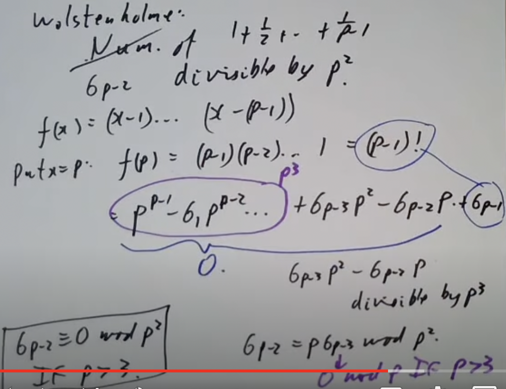
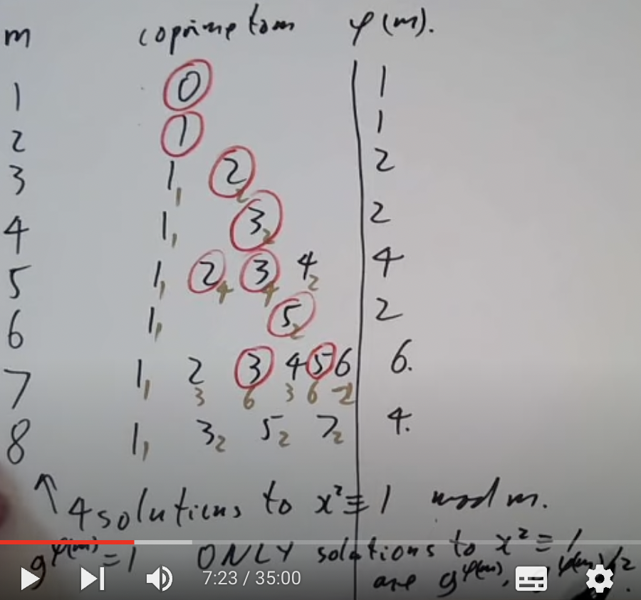

# 数论学习

## Congruences modulo a prime

如何解方程 $f(x)\equiv 0\mod m$ ？有3种情况：

1. 将模m转换为模质数p的n次幂 $p^n$ （CRT）
2. 将 $p^n$ 转换为p （牛顿法/hensel引理）
3. 当p为质数时就可以解了。

今天就来看看第三种情况。有笨方法，直接代入x=0,1,2...p-1看哪个满足方程。这个方法就不用过多考虑了。在探讨比较好的方法前，我们需要停下来思考一下，用了这么多节课把一个方程缩减到模质数的情况是为了什么？相比普通的数，质数有什么优点吗？

1. 没有0除数（no zero divisors）。我们知道如果 $ab\equiv 0\mod p$ ，就暗示着要么 $a\equiv 0\mod p$ ，要么 $b\equiv 0\mod p$ 。
2. 有逆元。如果 $a\equiv 0\mod p$ ，就能找到逆元b满足 $ab\equiv 1\mod p$ 
3. n次的多项式的根小于等于n。我们在代数中学过，一个n次多项式最多有n个根，但是放到模里面就不一定了。 $x^2-1\mod 8$ 有4个根，1，3，5，7。如果模数不是质数，一个n次的多项式指不定能有多少根。模质数就不一样了，根的数量保证小余等于n。
4. 有费马小定理 $x^p\equiv x\mod p$ 可用。
5. 模质数p有原根（primitive roots）。这个会在后面的课程中讲到。

第三点也是一个定理。这个定理之前没见过，证明一下。假设有n次多项式f(x)，其根为a，即f(a)=0。接着我们把f(x)除以另一个多项式(x-a)，商为g(x),余数是r。即f(x)=(x-a)g(x)+r。如果让x=a，就有f(a)=(a-a)g(a)+r，因为f(a)=0,(a-a)明显也是0，r也只能是0。说明当a是一个多项式的根时，多项式可被(x-a)整除，f(x)=(x-a)g(x)。利用归纳法，多项式f有小于等于n个根，多项式g有小于等于n-1个根，因为g是n-1次多项式。如果f还有一个根b满足f(b)=0，说明(b-a)g(b)=0，告诉我们b=a或者b是g的一个根。这里运用了模质数p没有0除数的性质。从`b=a或者b是g的一个根`这点就能立刻看出多项式f的根的数量只能小于等于n。

wolstenholme定理说， $1+\frac{1}{2}+\frac{1}{3}+...+\frac{1}{p-1}$ 的分子可被大于2的质数p整除。这个定理其实很好证明， $1,\frac{1}{2},...,\frac{1}{p-1}$ 全部都是模p的非零数。如果取它们的倒数1，2，3，...,p-1，这些数也会以某种顺序同余上方的数。并不是说倒数之间互相同余，都看得出来 $\frac{1}{2}$ 不和2同余，只是说2会与其中某一个数同余，其余的数也是这样。也就是说 $1+\frac{1}{2}+...+\frac{1}{p-1}\equiv 1+2+...+p-1=\frac{p(p-1)}{2}\equiv 0$ ，如果p=2，分数的上下就会抵消，因此原式当p不等于2时成立。

wolstenholme定理还有更好的变种， $1+\frac{1}{2}+\frac{1}{3}+...+\frac{1}{p-1}$ 的分子可被 $p^2$ 整除。证明我直接截图了，已超出能力范围。



这节课还剩三分之一，开始考虑方程 $f(x)\equiv 0\mod p$ 。要问自己三个问题：

1. 是否有解？
2. 有多少个解？
3. 解是什么？

有一种巧妙的方法解答第一个问题。我们求 $gcd(f(x),x^p-x)$ 就能知道了，因为 $x^p-x=x(x-1)...(x-(p-1)),f(x)=\prod_{f(a)=0} (x-a)$ 。对于第二个问题，解的数量就等于 $gcd(f,x^p-x)$ 的次数。

举个例子就会清晰很多了。请找出 $x^3-x^2+x-1\mod 3$ 的解的数量。方法告诉我们要找 $gcd(x^3-x^2+x-1,x^3-x)$ ，这个 $x^3-x$ 是根据模数3构造出来的。根据欧几里得法，我们要拿 $x^3-x$ 除以 $x^3-x^2+x-1,x^3-x$ ，得到 $x^3-x=1\*(x^3-x^2+x-1)+x^2+x+1$ 。除数拿出来继续除以余数，得到 $x^3-x^2+x-1=(x+1)(x^2+x+1)-(x-1)$ 。重复以上步骤，得到 $x^2+x+1=(x-1)(x-1)+0$ ，余数为0，那么gcd就是x-1。x-1是1次多项式，所以有1个根。

这个方法确实很巧妙，然而有个致命问题。使用欧几里得法找到gcd(f,g)的时间大概等于f的次数+g的次数， $x^p-x$ 这个多项式可有p次，p大了还是慢，可能还不如直接爆破找根呢。

我们需要加快找gcd的速度。关键点在于 $x^p-x$ 是一个[稀疏多项式](https://www.zhihu.com/question/55656686)，f(x)的次数很小。当我们有一个稀疏多项式和另一个小次数多项式时，可以利用俄罗斯农民法加速找gcd。将问题转换为 $x^p\mod f(x)$ ，接着用俄罗斯农民法找到 $x^p$ 。找到后再减去x就是答案了。这样的速度还是挺快的。

$f(x)=x^2-a$ ，什么时候a模p（奇数）是一个平方数？还是先找 $gcd(x^2-a,x^p-x)$ ,不过把 $x^p-x$ 换成 $x^{p-1}-1$ 比较好，x=0时有点烦。继续欧几里得， $x^{p-1}-1=(x^2-a)(x^{p-3}+ax^{p-5}+a^2x^{p-7}+...+a^{(p-3)/2})+a^{(p-1)/2}-1$ 。余数是 $a^{(p-1)/2}-1$ ，所以如果 $a^{(p-1)/2}-1\not\equiv 0\mod p$ ，原方程无根；如果 $a^{(p-1)/2}-1\equiv 0$ ，原方程有根。

于是我们就有了下面的结论。 $a^{(p-1)/2}\equiv 1$ ，如果a模p是平方数； $a^{(p-1)/2}\equiv -1$ ,如果a模p不是平方数。至此我们有了一个比较快的方法来检查a是否是平方数。不过这个方法其实不够好，后期会学一个更快的方法。

例子：如果d整除于p-1，则方程 $x^d-1\equiv 0\mod p$ 恰好有d个根。如果d|p-1，那么 $(x^{p-1}-1)$ 能被 $x^d-1$ 整除，这是因为如果 $y=x^d,n=\frac{p-1}{d}$ , $(y^n-1)$ 能被y整除。那么就有 $gcd(x^{p-1},x^d-1)=x^d-1$ ，这是个d次多项式，根据之前学的内容，原方程一定有d个根。

最后看看模7和11的立方。如果模11，全部数字都是立方， $x^3\equiv 1$ 有1个解。如果模7， $1^3=2^3=4^3=1,3^3=5^3=6^3=6$ 。因为3|7-1,所以有3个同余1的立方。结合两者，说明模某个质数同余1的立方的数量取决于p-1是否可被3整除。

## Chevalley-Warning theorem

标题的定理阐述了以下事实：如果 $f(x_1...x_n)$ 是d次多项式且d小于变量的数量，则 $f(x_1...x_n)\equiv 0\mod p$ 的解的数量能被p整除。证明这个定理需要借助另一个引理：如果i小于p-1，则有 $0^i+1^i+2^i+...+(p-1)^i\equiv 0\mod p$ 。先把主线搁置在一边，证明支线定理。

让 $s=0^i+1^i+2^i+...+(p-1)^i$ ，我们要证明当i小于p-1时， $s\equiv 0$ 。首先我们选择一个a，满足 $a\not\equiv 0,a^i\not\equiv 1$ 。我们确定能够找到这样一个a，因为 $a^i\equiv 1$ 是个i次多项式，根据前提条件，i小于p-1。总共有p-1个值不同余0，也就是说一定能找到一个不是 $a^i\equiv 1$ 的根的值。确定a存在后，把0，1...p-1拿出来，分别乘上a，得到0，a,2a...(p-1)a。由于a有一个逆，所以这两个集合是一样的，只不过顺序乱了。既然它们是一样的，其i次方的和也是一样的。

$0^i+1^i+2^i+...+(p-1)^i=0^i+a^i+(2a)^i+...$

第二个式子可以分解为 $a^i(0^i+1^i+...)$ ，所以有 $s=a^is$ ，等同于说 $(a^i-1)s=0$ 。前面已经限定 $a^i\not\equiv 1\mod p$ ， $(a^i-1)s=0$ 就能告诉我们 $s\equiv 0$ ，完成。

回到主线。次数小于n的多项式f满足 $f(x_1...x_n)\equiv 0\mod p$ 的解有多少？注意到 $1-f(x_1...x_n)^{p-1}$ 有两种情况：

1. 如果 $f(x_1...x_n)$ 同余0，则 $1-f(x_1...x_n)^{p-1}\equiv 1$
2. 如果 $f(x_1...x_n)\not\equiv 0$ ,则 $1-f(x_1...x_n)^{p-1}\equiv 0$ 。因为根据费马小定理， 如果 $f(x_1...x_n)\not\equiv 0$ 。其p-1次幂模p就会同余1。

现在我们就可以通过求和获取解的数量了。 $\sum_{x_1,x_2...x_n} 1-f(x_1...x_n)^{p-1}$ ，因为 $1-f(x_1...x_n)^{p-1}$ 这个表达式总会在 $x_1,x_2...x_n$ 里面有一个是解时等于1，反之等于0，所以其结果同余解的数量。把它展开就得到了 $\sum_{x_1...x_n} \*x_1^{n_1}x_2^{n_2}...$ ， \*是每一项展开时的系数。 $x_1^{n_1}x_2^{n_2}...$ 这个部分的次数为 $n_1+n_2...+n_n$ ，小于f的次数n乘上p-1（最开始整体抬升了p-1的幂）。所以一定有一个 $n_i$ 小于p-1。

如果这是我们继续求总和， $\sum_{x_1,x_2,...,x_n} x_1^{n_1}...x_i^{\*}x_n^{n_n}$ ，有一个 $x_i$ 的幂\*将会小于p-1。根据刚才学的引理，由于\*小于p-1，就有 $sum_{x_i} x_i^\*\equiv 0\mod p$ 。 $x_1^{n_1}...x_i^{*}x_n^{n_n}$ 里有一项是0，整体就是0，总和也是0，故整体模p同余0，得出 $f(x_1...x_n)\equiv 0\mod p$ 这个方程的解的数量能被p整除。

## Primitive roots

原根的概念有关阶和欧拉定理。当gcd(a,m)=1时，回忆a模m的阶，是满足 $a^n\equiv 1\mod m$ 的最小正整数。欧拉定理则是 $a^{\phi(m)}\equiv 1\mod m$ 。a的阶整除于 $\phi(m)$ 。原根的定义是，当a的阶等于 $\phi(m)$ 时，a就被称作原根。也可以换个定义方式，a的所有幂 $a^0,a^1,...,a^{\phi(m)-1}$ 正好形成于m互质的剩余类。

必须要问的问题是，什么数字有原根？有多少原根？举例子是最笨但也是最好理解的方法。



红圈圈起来的是原根。发现8是第一个没有原根的数，最下面也能检验这一点。 $x^2\equiv 1\mod 8$ 有4个解，如果一个数有原根的话，那么 $x^2\equiv 1$ 这个方程的解只可能是 $g^{\phi(m)}$ 和 $g^{\frac{\phi(m)}{2}}$ 。

接着看9。如果g是9的一个原根，说明g也是3的一个原根。因为g的所有幂可以形成模9的所有剩余类，3又整除于9，里面肯定也包含3的剩余类。所以找9的原根应该从3看起。3有原根2，5和8，9的原根则是2和5，8不是。剩下的看都不用看，连3的原根都不是何来是9的原根。

然后是10。

```
10:   1   3   7   9
5:    1   2   3   4
```

10和5的数字互相对应上了，只不过是以不同的顺序：3对3，7对2。中国剩余定理让我们可以把10拆为2\*5，所以模10的数字可以用模5结合模2的数字替代。模2后与2互质的数只有1，那么模10与10互质的剩余类就等于模5与5互质的剩余类。既然5有2个原根2和3，对应着10就有两个原根3和7。事实上这对所有形如2n的模数都适用。如果n是奇数，模n与n互质的剩余类对应着模2n与2n互质的剩余类。如果g是模n的一个原根，那么g或者g+n（都是奇数）里有一个是模2n的原根。也就是说，如果n是奇数且n有原根，则2n也有原根。

现在是11。阶一定整除于 $\phi(11)=10$ ，所以可能的阶只有1，2，5，10。如果g有阶d，那么 $g^d\equiv 1$ 这个方程最多有d个解（之前提了一嘴，d次多项式模质数时解的数量不会大于次数）。那么在与11互质的数里面，阶为1的数最多有1个，阶为2的数最多有2个，阶为5的数最多有5个。也就是最多有1+2+5=8个数的阶不等于10。总共有10个数，意味着最少有10-8=2个数阶为10，这些数就是我们要找的原根了。

12没有原根。把12拆成4\*3，再代入方程 $x^2\equiv 1$ 。模4的解有2，模3的解至少有2个，那模12的解至少有4个。之前说过，这种情况下是不可能有原根的。适用于所有形如`4*奇数`的m，这样的m没有原根。

13照葫芦画瓢。阶整除于 $\phi(13)=12$ ，可能的阶为1，2，3，4，6，12。具有这些阶的元素加起来得到 1+2+3+4+6=16。16？这已经大于12了。看来之前我们算的有些草率，需要更仔细一点。我们判断最多有6个阶为6的元素，但不一定。先假设最少有1个阶为6的元素g，再看g的所有可能幂 $1,g,g^2,g^3,g^4,g^5$ ，是 $x^6\equiv 1$ 的所有可能根。那么6阶的元素必须是 $1,g,g^2,g^3,g^4,g^5$ 其中一个。但是仔细看这些数字，只有g和 $g^5$ 的阶是6，也就是说6阶的元素最多只有2个。这里告诉我们最多只有 $\phi(d)$ 个d阶元素。因为如果g是d阶元素， $x^d\equiv 1$ 的解有可能是g的所有次幂 $g^0,g^1...g^{d-1}$ 。 从里面选一个 $g^k$ ，这个 $g^k$ 仅当gcd(k,d)=1时是d阶元素。现在回到原来算元素的地方， $\phi(1)+\phi(2)+\phi(3)+\phi(4)+\phi(6)=1+1+2+2+2=8$ 。那就有至少12-8=4个12阶的元素。

有一个相关定理等待我们证明。如果p是质数，p有原根。这个定理的证明基于以下两个定理：

1. $x^d\equiv 1\mod p$ 有最多d个根（p是质数）。
2. $\sum_{d|n} \phi(d)=n$ ，这条对于任何n都成立，后面再证明。

第一步先看那些阶为d且d|p-1的元素，候选数字有1,2...d,p-1。阶为d的元素的数量最多有 $\phi(1)+\phi(2)+...+\phi(d)...$ 个。根据第二条定理， $\phi(1)+\phi(2)+...+\phi(d)...$ 总和为p-1（这里把p-1看为定理里的n）。全部满足d|p-1的数字d最多也有 $\phi(1)+\phi(2)+...+\phi(d)...$ 个。这时就说明阶为d的元素的数量必须等于 $\phi(1)+\phi(2)+...+\phi(d)...$ 了。如果是更小的数量，那 $\phi(1)+\phi(2)+...+\phi(d)...$ 的和就会小于p-1，无法同时满足”d|p-1的数字d最多也有 $\phi(1)+\phi(2)+...+\phi(d)...$ 个“这个条件。总结一下，如果d|p-1，就有正好 $\phi(d)$ 个元素阶为d。如果让d=p-1， $\phi(p-1)\geq 1$ ，至少有一个原根。

现在证明刚才用的定理 $\sum_{d|n} \phi(d)=n$ 。让n=12，写出12的所有剩余类i。尝试找到k，满足 $ki\equiv 0$ 。

```
i   0   1   2   3   4   5   6   7   8   9   10   11
k   1  12   6   4   3  12   2  12   3   4    6   12
```

能发现有 $\phi(d)$ 个元素阶为d，d|12。比如d=6，正好有两个元素2和10阶为6。2=2\*1,10=2\*5，发现1和5都是与6互质的数字。类似地，让d=4，两个阶为4的元素为3和9。3=3\*1,9=3\*3，1和3都是与4互质的数。这样的规律适用于任何n。对于加法阶k的元素模n，k|n，数量为 $\phi(k)$ 。因为这些数字由 $\frac{n}{k}\*(1,...)$ 给出，括号里的数字是与k互质的数。完成定理 $\sum_{d|n} \phi(d)=n$ 的证明。

14=2\*奇质数，有原根。15没有原根，15=3\*5，3和5在 $x^2\equiv 1$ 这个方程上均有2个解，2\*2=4，模15由4个解，无原根。如果m=pq且pq都是奇偶数，p不等于q，则m无原根。

16也没有原根。8|16，如果ab有原根，a也有原根，但我们已经知道8没有原根，说明16也没有。

整理目前知道的内容。如果m能被8，4p，pq整除且p不等于q，都是奇质数时，m没有原根。把满足这些条件的数字拿掉后，还剩下1，2，4， $p^n,2p^n$ (p是奇数)。

讲了那么久原根的存在性，到底怎么找原根啊？当模数是p时，尝试分解 $p-1=q_1,q_2...$ ，然后随机选择一个a，计算 $a^{\frac{p-1}{q_1}},a^{\frac{p-1}{q_2}}...$ 。如果全部都不同余1，则a是一个原根。比如11,p-1=10=2\*5。随机选择2，计算 $2^{\frac{10}{2}}\equiv -1,2^{\frac{10}{5}}\equiv 4$  。都不是1所以2时是一个原根。如果用这个方法找到一个原根后，找到其他的就不用这么麻烦了。假设a是模m的一个原根，a的阶是 $\phi(m)$ ，想让 $a^b$ 的阶也是 $\phi(m)$ 的前提是b和 $\phi(m)$ 互质。借助这个结论继续找11的原根。 $\phi(11)=10$ ,找满足 $gcd(b,10)=1$ 的b，有1，3，7，9。刚才找到的原根是2，剩下的原根就是 $2^1,2^3,2^7,2^9\mod 11$ 。顺便得到计算原根数量的公式： $\phi(\phi(m))$ ，前提是已知原根数量不等于0。

## Primitive roots for prime powers

上节课说到，有原根的数字一定在 $1,2,4,p^n,2p^n$ 中（p为奇质数）。这节课来看n大于1的情况。先看 $p^2$ 是否一定有原根。

选择p的一个原根g，根据原根的定义可得 $g^{p-1}\equiv 1\mod p$ 。 $\phi(p)=p-1,\phi(p^2)=p(p-1)$ 。既然g的阶模p是p-1，那么g模 $p^2$ 的阶可能为p-1或者p(p-1)，因为根据欧拉定理其阶必须整除于p(p-1)，又因为它是模p的一个原根，其阶必须整除p-1。如果阶是p(p-1)，那证明完成，阶等于 $\phi(p^2)$ ，g也是 $p^2$ 的一个原根。如果阶是p-1，

如果阶是p-1，即 $g^{p-1}\equiv 1\mod p^2$ 这种情况，就构造 $(g+p)^{p-1}$ 。利用泰勒级数展开，得到 $(g+p)^{p-1}=g^{p-1}+(p-1)p+(^{p-1}_2)p^2+...$ ，整个式子与 $1+(p-1)p\mod p^2$ 同余。 1+(p-1)p 肯定不与1同余，说明g+p的阶不是p-1，那g+p的阶只能是p(p-1)了。两种情况下都有原根，得到结论：模 $p^2$ 下g和g+p中至少有一个是原根。

$p^2$ 证明完了证 $p^n$ ，这次关注所有大于等于3的n且p是奇质数，因为 $2^3$ 次方之前已经看过是没有原根的。这条的证明等同于证明下面的定理：如果g是模 $p^2$ 的原根且p是奇质数，则g也是模 $p^n$ 的原根（n大于等于1）。如果要用归纳法的话，我们需要证明g是模 $p^n$ 的原根，然后证明g是模 $p^{n+1}$ 的原根。可以通过证明 $g^{(p-1)p^{n-1}}=1+tp^n$ （t不整除p）来做到这点，因为这将表明 $g^{(p-1)p^{n-1}}$ 是模 $p^{n+1}$ 的原根。该式子在n=1时成立，提高两边的幂，得到 $g^{(p-1)p^{n}}=1+ptp^m+(^{p}_2)t^2p^{2m}+...$ 。这里就看出来为什么p不能等于2了，如果p=2， $(^{p}_2)$ 就不能整除p了，就算剩下的项都能被p的较大幂整除也没用。只要p大于2， $1+ptp^m+(^{p}_2)t^2p^{2m}+...$ 就等于 $1+tp^{m+1}+(...)$ ，又回到了我们要的形式。

例题：请找出 $3^7$ 的原根。3的原根是-1，然而-1不是 $3^2$ 的原根。没关系，g不是原根g+p就是原根，-1+3=2，2是 $3^2$ 的原根。于是2将是3的任何次幂的原根，包括 $3^7$ 。

现在的我们有5种方式告诉别人一个数字有原根。

1. m有原根（平平淡淡才是真）
2. m有 $\phi(\phi(m))$ 个原根。如果这条不满足就是0个原根。
3. $m=1,2,4,p^n,2p^n$ ，p为奇质数
4. $x^2\equiv 1\mod m$ ，这点告诉我们 $x\equiv \pm 1\mod m$
5. 满足威尔逊定理 $\prod_{a\mod m} a\equiv -1\mod m,gcd(a,m)=1$ 。

之前学中国剩余定理时，我们可以把m简化到 $p^n$ 的情况。如果是奇质数还好，一定有原根；假如我们把m简化成了 $2^n$ 呢？在n很大的情况下，5“差点”成为一个原根，“差点”指的是任何模 $2^n$ 与 $2^n$ 互质的数字都形如 $\pm 5^k$ 。如果同余正的 $5^k$ ，则数字模4同余1；如果同余负的 $5^k$ ，则数字模4同余-1。一个一个试：

$5\equiv 5\mod 8$<br>
$5^2\equiv 9\mod 16$<br>
$5^4\equiv 17\mod 32$<br>
$5^8\equiv 33\mod 64$

总结出 $5^{2^n}\equiv 1+2^{n+2}\mod 2^{n+3}$ ，表明5模 $2^{n+3}$ 有阶 $2^{n+1}$ 。模 $2^{n+3}$ 与其互质的数共有 $2^{n+2}$ 个，每个数字都形如 $\pm 5^k$ 。

讲了这么多原根，这个原根有什么用吗？当然，你可以用原根求对数，不过在数论里被称为指数（indices）。假如g是模p的一个原根，任何模p不同余0的数字a都形如 $g^n\mod p$ 。也就是说我们可以基于此求个对数 $n=log_g a$ 。在计算机还没有被发明的年代，人们会借助对数算乘法。比如两个数a和b， $a=g^n,b=g^m$ ，那么 $ab=g^{m+n}$ 。幂也可以这么算， $a^k=(g^n)^k=g^{nk}$ 。

原根还可用于检测一个数p是否是质数。质因数分解p-1，然后找p的原根g，其阶为p-1。怎么证明阶是p-1？只需要检查g是否有整除于 $\frac{p-1}{q}$ 的阶，q是p-1的一个质因数。如果能找到 $g^{\frac{p-1}{q}}\not\equiv \mod p$ ，说明g的阶恰好是p-1，意味着p必须是素数。比如101， $101-1=2^2\*5^2$ ，找g满足 $g^{100/2}\not\equiv 1,g^{100/5}\not\equiv 1$ 。如果能找到说明101是质数。这个方法其实不是特别好，因为其依赖p-1的质因数分解结果，数字一大还是难以分解。

## Quadratic equations mod p

之前解的都是1次同余方程，是时候尝试一下二次同余方程 $ax^2+bx+c\equiv 0\mod p$ 了。根据我们平时解二次同余方程的方法，先凑平方（compeleting the square），得到 $a(x+b/2)^2\equiv \frac{b^2-4ac}{4a}$ 。这一步有除以2的操作，要是p是奇质数还好，没有影响；要是p=2呢？这确实是个问题，不过p=2时可能的根只有0和1，都不用除以2了，直接代入试一下是不是根就好了。因此后续我们只考虑p是奇质数的情况。 $b^2-4ac$ 这段是我们平时熟悉的判别式，称作d，然后解 $x^2\equiv d$ 。只有判别式能找到根的情况下原式才能找到根，因为解原式的下一步是把a移到右边，形成 $(x+b/2)^2\equiv \frac{b^2-4ac}{4a^2}$ ，上下都有平方，判别式能找到根才有解。

正式解之前先判断是否有解。利用判别式d，检查是否 $d^{(p-1)/2}\equiv 1\mod p,d\not\equiv 0$ 。只有同余1了才有解。假设我们检查了有解，那该用什么方法解 $x^2\equiv d$ 呢？

1. 试错法。让x=0，1，2...时间长了总能找到的。这个方法似乎解各种方程都能见到，总之不好就对了。
2. 套方法。有几种方法可以解任何多项式方程 $f(x)\equiv 0$ 。分别为Berlekamp方法和Cantor-Zassenhouse方法。
3. 猜答案。为了让我们听起来专业一点，把这个方法称为“ansatz”。

第三种方法让x等于某个关于d的函数，比如 $x=\*^d,d^{\*},a_0+a_1d+a_2d^2$ ，什么都行，只要后期能找到答案。由于原式可以转换为 $x=d^{1/2}$ ，或许 $d^{\*}$ 比较好。让 $x=d^k$ ，k某个整数。乍一看觉得有点问题，都已有 $x=d^{1/2}$ 了，k是整数怎么行呢？不急，数学就是有化腐朽为神奇的能力。结合 $x^2\equiv d$ 和  $x=d^k$ ，得到 $d^{2k}\equiv d$ ，也就是 $d^{2k-1}\equiv 1$ 。怎么有点眼熟，我们已经知道 $d^{(p-1)/2}\equiv 1$ ，两者结合一下，很容易就能解出 $k=(\frac{p-1}{2}+1)/2$ 。如果想让k是整数的话， $\frac{p-1}{2}$ 就要是奇数，即 $p\equiv 3\mod 4$ 。这个猜法可不得了，一下子就得出了一半方程的解。

要是 $p\equiv 1\mod 4$ 呢？那 $d^{(p-1)/2}\equiv 1$ 中的(p-1)/2就是偶数，两边开方得到 $d^{(p-1)/4}\equiv \pm 1$ 。两边再乘上d， $d^{(p+3)/4}\equiv \pm d$ 。假设是正d且(p+3)/4是偶数，那就把左边开方， $(d^{(p+3)/8})^2\equiv d$ ，这样就找到d的平方根了。对于两个特殊的条件(p+3)/4是偶数和结果是正d，前者要求 $p\equiv 5\mod 8$ ，后者不是什么大问题。我们知道-1也有平方根，也学过怎么找，只要不断尝试 $a^{(p-1)/4}$ ，每次都有50%的概率找到-1的平方根。找到-1的平方根后再找-d的平方根，两者相乘就有 $\sqrt{d}=\sqrt{-d}\sqrt{-1}$ ，把负数的情况转换为正数的情况。

最差的情况是 $p\equiv 1+2^k$ ,也就是费马质数。解 $x^2\equiv d\mod p$ 时先找原根g，使 $g^{2^k}\equiv 1$ 。d的阶一定是2的某次幂，因为它整除于 $2^k$ ，那就假设d的阶为 $2^i,i\in Z$ 。注意到 $g^{2^{k-i}}$ 的阶也是 $2^i$ ， $d=g^{2^{k-i}\*a}$ （a是奇数），因为两者的阶都是 $2^i$ 。两边乘上 $g^{2^{k-i}}$ ，得到 $g^{2^{k-i}}d=g^{2^{k-i}\*b}$ (b是偶数) 。变形一下就能求d的平方根了： $\sqrt{d}=g^{-2^{k-i-1}}\times \sqrt{g^{2^{k-i}\*b}}$ 。

一般情况下，假设 $p-1=2^k\*n$ ，n是奇数。选择g满足g的阶为 $2^k$ 。这个不难找，只要我们一直尝试 $g=a^n$ （a是随机数），总有一个g的阶会是 $2^k$ 。接着用欧几里得法解 $2^k\*s+nt=1$ ，利用这个方程就可以每个元素写为2次幂阶的元素与奇数阶元素的积了。例如：

$y=y^1=(y^n)^t\times (y^{2^k})^s$

$(y^n)$ 的阶是2次幂， $(y^{2^k})$ 是奇数次阶。前者可用之前的方法解，后者可用方法3解。找到这两个的平方根后y的平方根也不难找了。

来个实例，解方程 $x^2\equiv 2\mod 41$ 。 $p-1=40=2^3\times 5$ 。找阶为 $2^3$ 次方的元素，随便拿一个随机数a，求其5次方，比如3， $3^5\equiv 38\mod 41$ ，38的阶是 $2^3$ 。欧几里得法解方程 $2^3\*s+5t=1$ ，得到s=-3，t=5。把2写为 $(2^8)^{-3}\times (2^5)^5$ ，目标转换为求 $2^8$ 和 $2^5$ 的平方根。前者很简单， $\sqrt{2^8}=2^4$ ，但是 $2^5$ 的平方根是多少？

为了找到这个平方根，我们要解个新的方程 $x^2\equiv 32$ 。可以通过不断平方来得到1：

$32^2\equiv 40$<br>
$40^2\equiv 1$

因此32的阶为4。让 $32=38^2$ 乘上某个数，即 $32=38^2\times 40$ 。 $38^2$ 的平方根明显就是38，40不知道但是其阶一定小于4。 $40=38^4$ 乘上某个数，发现这回 $40=38^4\times 1$ 。这下简单了， $38^4$ 的平方根就是 $38^2$ 。现在我们成功将32写为各种数的乘积， $32=38^2\times 38^4,\sqrt{32}=38\*38^2\equiv 14$ 。回到上面一个方程， $\sqrt{2}=(2^4)^{-3}\times 14^5\equiv 24$ 。

## Roots of polynomials modulo a prime

介绍适用于 $f(x)\equiv 0\mod p$ 的算法，也就是上节课提到的Cantor-Zassenhouse法。

1. 使用欧几里得法找两个多项式f和g的最大公因数gcd(f,g)。这个方法在f和g的次数很小时很快，如果两者是那种30次多项式就很慢了。这时就需要Russian-Peasant算法加速幂乘速度。
2. 回忆一下Russian-Peasant算法。如果我们想计算 $a^n$ ，首先把n写为二进制， $n=2^{a_0}+2^{a_1}+2^{a_2}...$ ，然后计算 $a^1,a^2,a^4,a^8...$ 。最后把相应的乘起来就好了。比如 $a^{13}=a^8\*a^4\*a^1,13=2^3+2^2+2^0$ 。如果是模p，记得每一步缩减p；模多项式则是每一步缩减多项式。

结合两者就有了快速除法。多项式f除以多项式g，f次数非常大但大多数系数都是0；g次数则较小。假设 $f=x^n+...$ ，n非常大，算除法时我们不是直接除，而是利用Russian-Peasant先算 $x^n\mod g$ ，速度非常快。如果f里面有几个非零系数，就对每个系数都用Russian-Peasant。

所以如何找f的根呢？回忆之前学的 $x^p-x=x(x-1)(x-2)...(x-(p-1))$ (由费马小定理得来， $x^p-x$ 这个式子从x到p-1都是根，于是就能根据根写出后面的式子)，那么 $gcd(x^p-x,f)=(x-r_1)(x-r_2)...$ ， $r_1,r_2$ 是f的根且不相同。这样就能快速找到根的数量等于 $gcd(x^p-x,f)$ 的次数。就算 $x^p-x$ 次数很高，我们也能通过Russian-Peasant模f来快速计算出最大公因数。

根的数量解决了，根是什么？注意到我们可以分解 $x^p-x=x(x^{p-1}-1)=x(x^{(p-1)/2}-1)(x^{(p-1)/2}+1)$ ,还是有前提p为奇质数，如果p=2直接尝试根0，1就好了，做这么多没有意义。 $x(x^{(p-1)/2}-1)$ 和 $(x^{(p-1)/2}+1)$ 都会是f的一些根的乘积，但不是全部。接着计算 $gcd(f,x^{(p-1)/2}-1)$ 和 $gcd(f,x^{(p-1)/2}+1)$ ,两者的结果都是 $\prod (x-r_i)$ , $r_i$ 是不同的根。If we are lucky,some roots of f roots of $x^{(p-1)/2}-1$ ,some roots of $x^{(p-1)/2}+1$ 。（这段我看不懂，大家看英文原文吧）。求gcd就能得到一个次数小于f的多项式，然后重复以上步骤就能得到根。如果f的根都是 $x^{(p-1)/2}-1$ 的根，这时求gcd不会有任何进展， $gcd(f,x^{(p-1)/2}-1)=f$ 。我们需要将f(x) 改为f(x+1)，再求 $gcd(f(x+1),x^{(p-1)/2}-1)=f$ 。还是有几率无法降低次数，再不行就f(x+2)，增加的数字可以是随机的，直到能够降低次数为止。

例子：解方程 $x^4-x^2-2\equiv 0\mod 5$ 。分解 $x^5-1=x(x^2-1)(x^2+1)$ ,能得到 $x(x^{\frac{p-1}{2}}-1)(x^{\frac{p-1}{2}}+1)$ 。看一下有多少个根, $gcd(f,x^5-1)=x^2+1$ ，看来有2个根。求gcd找根， $gcd(x^2+1,x^{\frac{5-1}{2}}-1)=1$ ，这个不行，没有得到任何有意义的信息。将x变为x+1，继续求 $gcd((x+1)^2+1,x^{\frac{5-1}{2}}-1)=x+1$ , $(x+1)^2+$ 的根是x=-1。那么原来式子 $x^2+1$ 的根就是-1-1=-2。

还可以通过分解多项式为不可约因子来找根。不会详细解释，只会介绍一些大致思路。1次因子中(x-a)整除于 $x^p-x$ ，(x-a)是任意的一个1次因子。任何2次不可约多项式整除于 $x^{p^2}-x$ 。基本是同样的方法，把 $x^{p^2}-x$ 写为 $x(x^{\frac{p^2-1}{2}}-1)(x^{\frac{p^2-1}{2}}+1)$ ，求 $gcd(f,x^{\frac{p^2-1}{2}}-1)$ ，如果我们幸运的话，这样就能得到f的因式分解结果；如果不走运，就把f改为f+1。一般的，任何n次不可约多项式都整除于 $x^{p^n}-x$ 。一切的前提都是p不等于2。