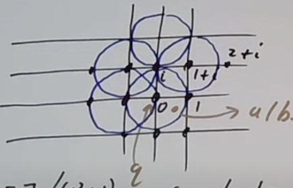
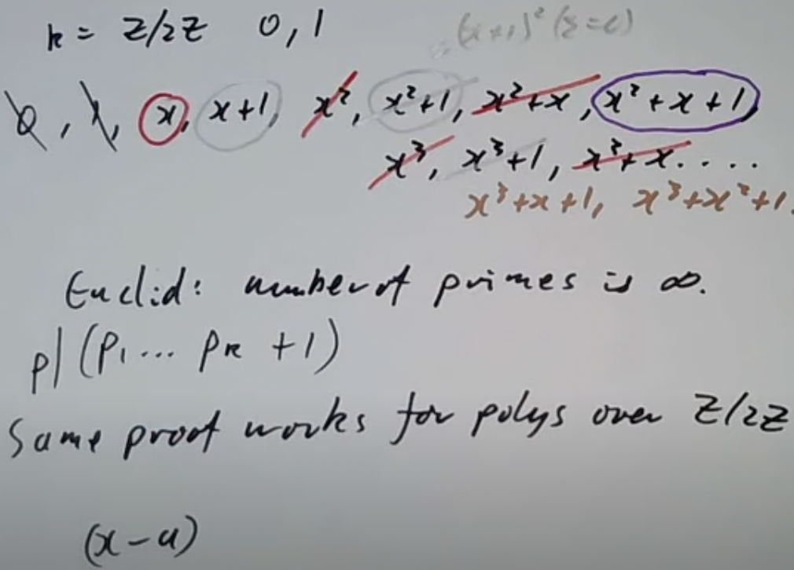
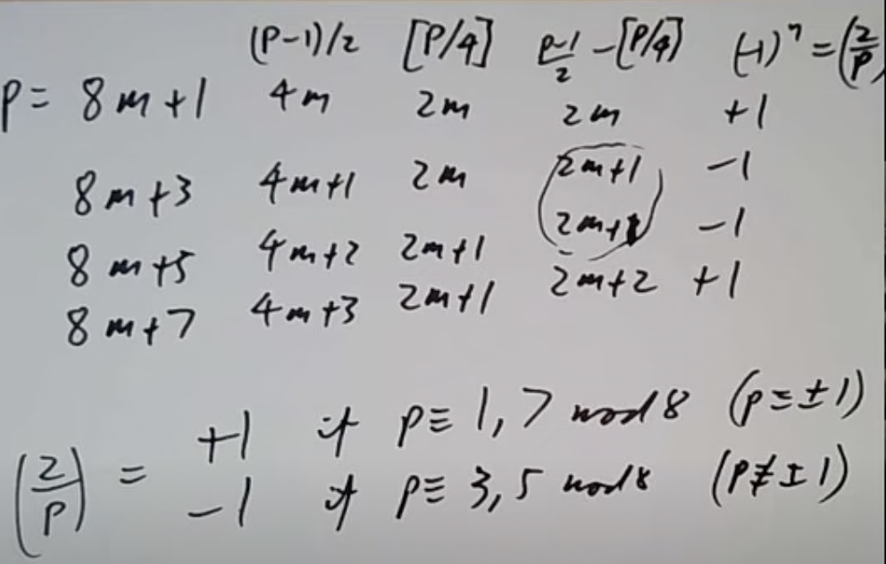
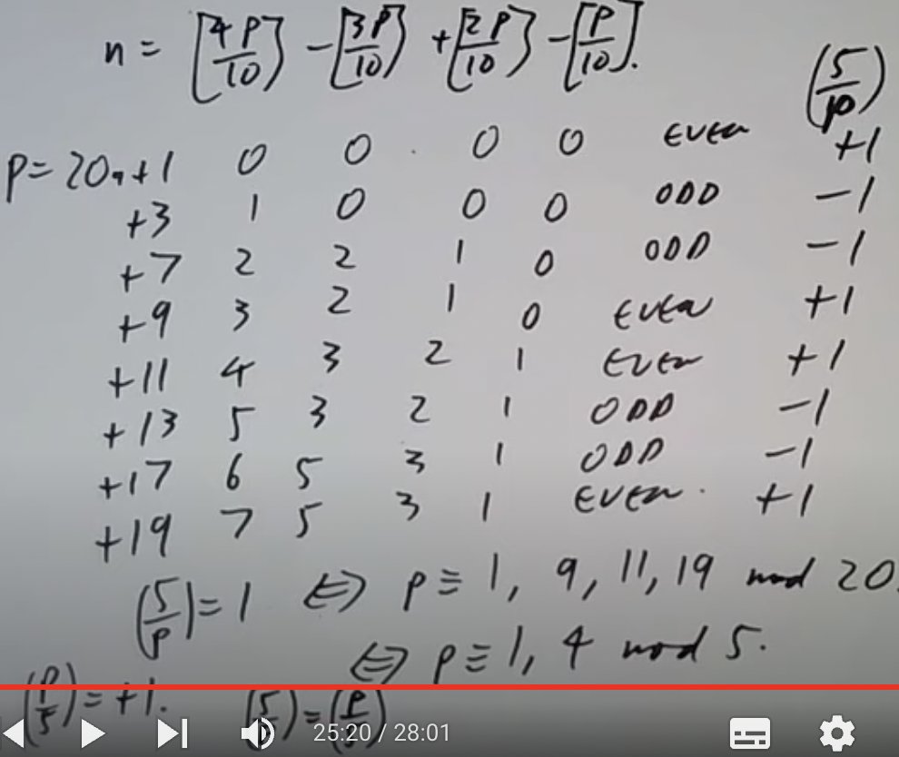
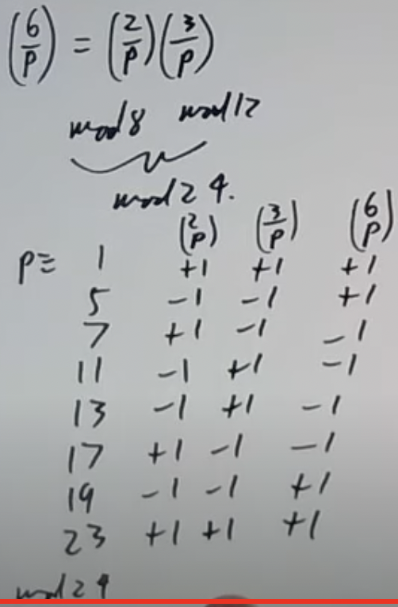
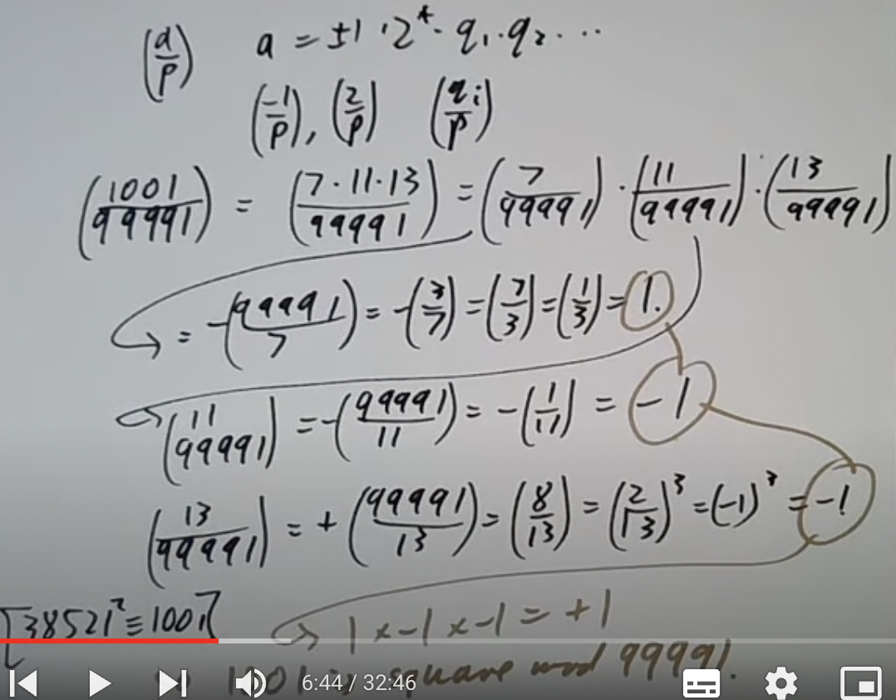
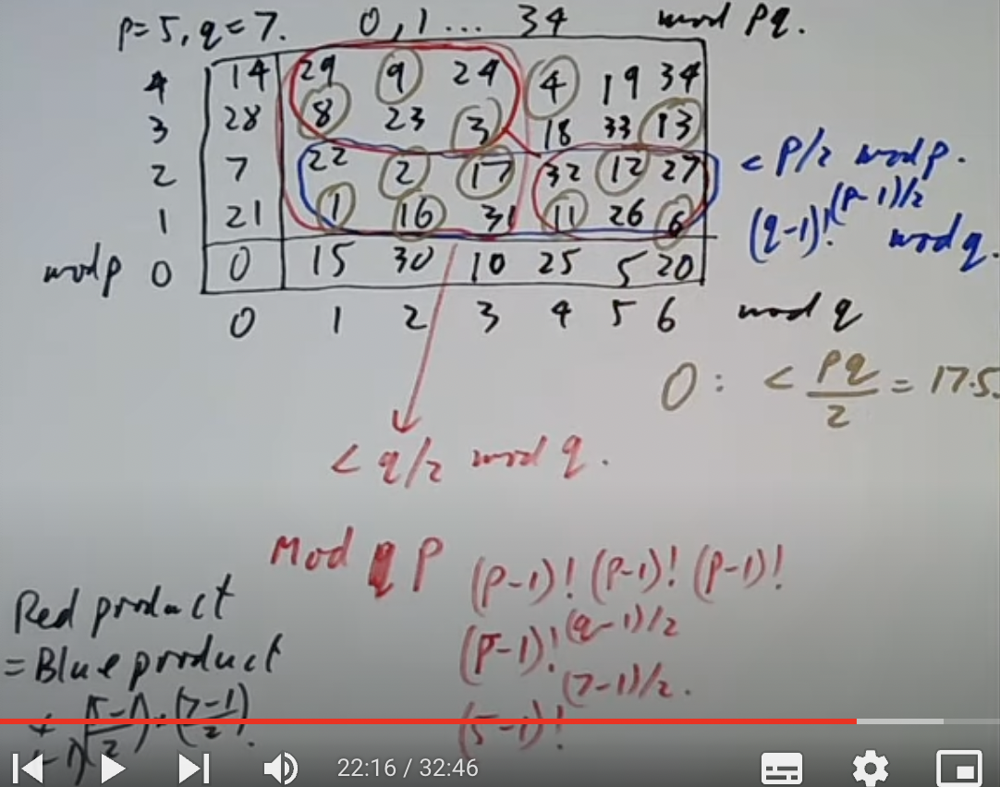
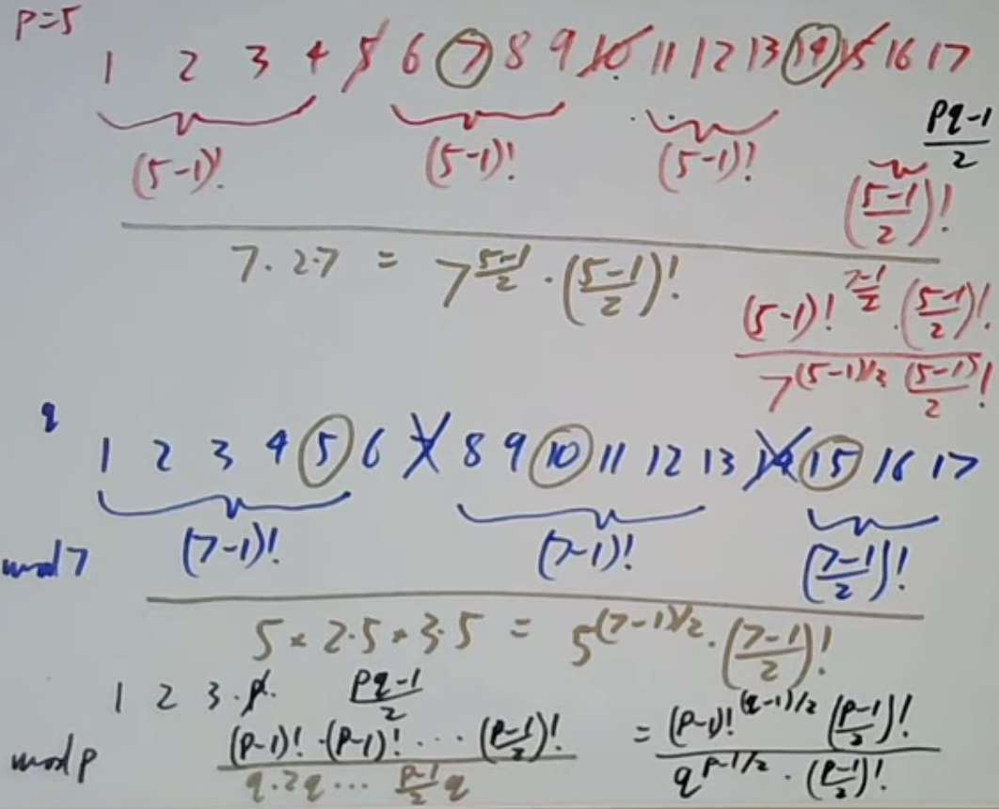

# 数论学习

## Congruences modulo a prime

如何解方程 $f(x)\equiv 0\mod m$ ？有3种情况：

1. 将模m转换为模质数p的n次幂 $p^n$ （CRT）
2. 将 $p^n$ 转换为p （牛顿法/hensel引理）
3. 当p为质数时就可以解了。

今天就来看看第三种情况。有笨方法，直接代入x=0,1,2...p-1看哪个满足方程。这个方法就不用过多考虑了。在探讨比较好的方法前，我们需要停下来思考一下，用了这么多节课把一个方程缩减到模质数的情况是为了什么？相比普通的数，质数有什么优点吗？

1. 没有0除数（no zero divisors）。我们知道如果 $ab\equiv 0\mod p$ ，就暗示着要么 $a\equiv 0\mod p$ ，要么 $b\equiv 0\mod p$ 。
2. 有逆元。如果 $a\equiv 0\mod p$ ，就能找到逆元b满足 $ab\equiv 1\mod p$ 
3. n次的多项式的根小于等于n。我们在代数中学过，一个n次多项式最多有n个根，但是放到模里面就不一定了。 $x^2-1\mod 8$ 有4个根，1，3，5，7。如果模数不是质数，一个n次的多项式指不定能有多少根。模质数就不一样了，根的数量保证小余等于n。
4. 有费马小定理 $x^p\equiv x\mod p$ 可用。
5. 模质数p有原根（primitive roots）。这个会在后面的课程中讲到。

第三点也是一个定理。这个定理之前没见过，证明一下。假设有n次多项式f(x)，其根为a，即f(a)=0。接着我们把f(x)除以另一个多项式(x-a)，商为g(x),余数是r。即f(x)=(x-a)g(x)+r。如果让x=a，就有f(a)=(a-a)g(a)+r，因为f(a)=0,(a-a)明显也是0，r也只能是0。说明当a是一个多项式的根时，多项式可被(x-a)整除，f(x)=(x-a)g(x)。利用归纳法，多项式f有小于等于n个根，多项式g有小于等于n-1个根，因为g是n-1次多项式。如果f还有一个根b满足f(b)=0，说明(b-a)g(b)=0，告诉我们b=a或者b是g的一个根。这里运用了模质数p没有0除数的性质。从`b=a或者b是g的一个根`这点就能立刻看出多项式f的根的数量只能小于等于n。

wolstenholme定理说， $1+\frac{1}{2}+\frac{1}{3}+...+\frac{1}{p-1}$ 的分子可被大于2的质数p整除。这个定理其实很好证明， $1,\frac{1}{2},...,\frac{1}{p-1}$ 全部都是模p的非零数。如果取它们的倒数1，2，3，...,p-1，这些数也会以某种顺序同余上方的数。并不是说倒数之间互相同余，都看得出来 $\frac{1}{2}$ 不和2同余，只是说2会与其中某一个数同余，其余的数也是这样。也就是说 $1+\frac{1}{2}+...+\frac{1}{p-1}\equiv 1+2+...+p-1=\frac{p(p-1)}{2}\equiv 0$ ，如果p=2，分数的上下就会抵消，因此原式当p不等于2时成立。

wolstenholme定理还有更好的变种， $1+\frac{1}{2}+\frac{1}{3}+...+\frac{1}{p-1}$ 的分子可被 $p^2$ 整除。证明我直接截图了，已超出能力范围。


这节课还剩三分之一，开始考虑方程 $f(x)\equiv 0\mod p$ 。要问自己三个问题：

1. 是否有解？
2. 有多少个解？
3. 解是什么？

有一种巧妙的方法解答第一个问题。我们求 $gcd(f(x),x^p-x)$ 就能知道了，因为 $x^p-x=x(x-1)...(x-(p-1)),f(x)=\prod_{f(a)=0} (x-a)$ 。对于第二个问题，解的数量就等于 $gcd(f,x^p-x)$ 的次数。

举个例子就会清晰很多了。请找出 $x^3-x^2+x-1\mod 3$ 的解的数量。方法告诉我们要找 $gcd(x^3-x^2+x-1,x^3-x)$ ，这个 $x^3-x$ 是根据模数3构造出来的。根据欧几里得法，我们要拿 $x^3-x$ 除以 $x^3-x^2+x-1,x^3-x$ ，得到 $x^3-x=1\*(x^3-x^2+x-1)+x^2+x+1$ 。除数拿出来继续除以余数，得到 $x^3-x^2+x-1=(x+1)(x^2+x+1)-(x-1)$ 。重复以上步骤，得到 $x^2+x+1=(x-1)(x-1)+0$ ，余数为0，那么gcd就是x-1。x-1是1次多项式，所以有1个根。

这个方法确实很巧妙，然而有个致命问题。使用欧几里得法找到gcd(f,g)的时间大概等于f的次数+g的次数， $x^p-x$ 这个多项式可有p次，p大了还是慢，可能还不如直接爆破找根呢。

我们需要加快找gcd的速度。关键点在于 $x^p-x$ 是一个[稀疏多项式](https://www.zhihu.com/question/55656686)，f(x)的次数很小。当我们有一个稀疏多项式和另一个小次数多项式时，可以利用俄罗斯农民法加速找gcd。将问题转换为 $x^p\mod f(x)$ ，接着用俄罗斯农民法找到 $x^p$ 。找到后再减去x就是答案了。这样的速度还是挺快的。

$f(x)=x^2-a$ ，什么时候a模p（奇数）是一个平方数？还是先找 $gcd(x^2-a,x^p-x)$ ,不过把 $x^p-x$ 换成 $x^{p-1}-1$ 比较好，x=0时有点烦。继续欧几里得， $x^{p-1}-1=(x^2-a)(x^{p-3}+ax^{p-5}+a^2x^{p-7}+...+a^{(p-3)/2})+a^{(p-1)/2}-1$ 。余数是 $a^{(p-1)/2}-1$ ，所以如果 $a^{(p-1)/2}-1\not\equiv 0\mod p$ ，原方程无根；如果 $a^{(p-1)/2}-1\equiv 0$ ，原方程有根。

于是我们就有了下面的结论。 $a^{(p-1)/2}\equiv 1$ ，如果a模p是平方数； $a^{(p-1)/2}\equiv -1$ ,如果a模p不是平方数。至此我们有了一个比较快的方法来检查a是否是平方数。不过这个方法其实不够好，后期会学一个更快的方法。

例子：如果d整除于p-1，则方程 $x^d-1\equiv 0\mod p$ 恰好有d个根。如果d|p-1，那么 $(x^{p-1}-1)$ 能被 $x^d-1$ 整除，这是因为如果 $y=x^d,n=\frac{p-1}{d}$ , $(y^n-1)$ 能被y整除。那么就有 $gcd(x^{p-1},x^d-1)=x^d-1$ ，这是个d次多项式，根据之前学的内容，原方程一定有d个根。

最后看看模7和11的立方。如果模11，全部数字都是立方， $x^3\equiv 1$ 有1个解。如果模7， $1^3=2^3=4^3=1,3^3=5^3=6^3=6$ 。因为3|7-1,所以有3个同余1的立方。结合两者，说明模某个质数同余1的立方的数量取决于p-1是否可被3整除。

## Chevalley-Warning theorem

标题的定理阐述了以下事实：如果 $f(x_1...x_n)$ 是d次多项式且d小于变量的数量，则 $f(x_1...x_n)\equiv 0\mod p$ 的解的数量能被p整除。证明这个定理需要借助另一个引理：如果i小于p-1，则有 $0^i+1^i+2^i+...+(p-1)^i\equiv 0\mod p$ 。先把主线搁置在一边，证明支线定理。

让 $s=0^i+1^i+2^i+...+(p-1)^i$ ，我们要证明当i小于p-1时， $s\equiv 0$ 。首先我们选择一个a，满足 $a\not\equiv 0,a^i\not\equiv 1$ 。我们确定能够找到这样一个a，因为 $a^i\equiv 1$ 是个i次多项式，根据前提条件，i小于p-1。总共有p-1个值不同余0，也就是说一定能找到一个不是 $a^i\equiv 1$ 的根的值。确定a存在后，把0，1...p-1拿出来，分别乘上a，得到0，a,2a...(p-1)a。由于a有一个逆，所以这两个集合是一样的，只不过顺序乱了。既然它们是一样的，其i次方的和也是一样的。

$0^i+1^i+2^i+...+(p-1)^i=0^i+a^i+(2a)^i+...$

第二个式子可以分解为 $a^i(0^i+1^i+...)$ ，所以有 $s=a^is$ ，等同于说 $(a^i-1)s=0$ 。前面已经限定 $a^i\not\equiv 1\mod p$ ， $(a^i-1)s=0$ 就能告诉我们 $s\equiv 0$ ，完成。

回到主线。次数小于n的多项式f满足 $f(x_1...x_n)\equiv 0\mod p$ 的解有多少？注意到 $1-f(x_1...x_n)^{p-1}$ 有两种情况：

1. 如果 $f(x_1...x_n)$ 同余0，则 $1-f(x_1...x_n)^{p-1}\equiv 1$
2. 如果 $f(x_1...x_n)\not\equiv 0$ ,则 $1-f(x_1...x_n)^{p-1}\equiv 0$ 。因为根据费马小定理， 如果 $f(x_1...x_n)\not\equiv 0$ 。其p-1次幂模p就会同余1。

现在我们就可以通过求和获取解的数量了。 $\sum_{x_1,x_2...x_n} 1-f(x_1...x_n)^{p-1}$ ，因为 $1-f(x_1...x_n)^{p-1}$ 这个表达式总会在 $x_1,x_2...x_n$ 里面有一个是解时等于1，反之等于0，所以其结果同余解的数量。把它展开就得到了 $\sum_{x_1...x_n} \*x_1^{n_1}x_2^{n_2}...$ ， \*是每一项展开时的系数。 $x_1^{n_1}x_2^{n_2}...$ 这个部分的次数为 $n_1+n_2...+n_n$ ，小于f的次数n乘上p-1（最开始整体抬升了p-1的幂）。所以一定有一个 $n_i$ 小于p-1。

如果这是我们继续求总和， $\sum_{x_1,x_2,...,x_n} x_1^{n_1}...x_i^{\*}x_n^{n_n}$ ，有一个 $x_i$ 的幂\*将会小于p-1。根据刚才学的引理，由于\*小于p-1，就有 $sum_{x_i} x_i^\*\equiv 0\mod p$ 。 $x_1^{n_1}...x_i^{*}x_n^{n_n}$ 里有一项是0，整体就是0，总和也是0，故整体模p同余0，得出 $f(x_1...x_n)\equiv 0\mod p$ 这个方程的解的数量能被p整除。

## Primitive roots

原根的概念有关阶和欧拉定理。当gcd(a,m)=1时，回忆a模m的阶，是满足 $a^n\equiv 1\mod m$ 的最小正整数。欧拉定理则是 $a^{\phi(m)}\equiv 1\mod m$ 。a的阶整除于 $\phi(m)$ 。原根的定义是，当a的阶等于 $\phi(m)$ 时，a就被称作原根。也可以换个定义方式，a的所有幂 $a^0,a^1,...,a^{\phi(m)-1}$ 正好形成于m互质的剩余类。

必须要问的问题是，什么数字有原根？有多少原根？举例子是最笨但也是最好理解的方法。


红圈圈起来的是原根。发现8是第一个没有原根的数，最下面也能检验这一点。 $x^2\equiv 1\mod 8$ 有4个解，如果一个数有原根的话，那么 $x^2\equiv 1$ 这个方程的解只可能是 $g^{\phi(m)}$ 和 $g^{\frac{\phi(m)}{2}}$ 。

接着看9。如果g是9的一个原根，说明g也是3的一个原根。因为g的所有幂可以形成模9的所有剩余类，3又整除于9，里面肯定也包含3的剩余类。所以找9的原根应该从3看起。3有原根2，5和8，9的原根则是2和5，8不是。剩下的看都不用看，连3的原根都不是何来是9的原根。

然后是10。

```
10:   1   3   7   9
5:    1   2   3   4
```

10和5的数字互相对应上了，只不过是以不同的顺序：3对3，7对2。中国剩余定理让我们可以把10拆为2\*5，所以模10的数字可以用模5结合模2的数字替代。模2后与2互质的数只有1，那么模10与10互质的剩余类就等于模5与5互质的剩余类。既然5有2个原根2和3，对应着10就有两个原根3和7。事实上这对所有形如2n的模数都适用。如果n是奇数，模n与n互质的剩余类对应着模2n与2n互质的剩余类。如果g是模n的一个原根，那么g或者g+n（都是奇数）里有一个是模2n的原根。也就是说，如果n是奇数且n有原根，则2n也有原根。

现在是11。阶一定整除于 $\phi(11)=10$ ，所以可能的阶只有1，2，5，10。如果g有阶d，那么 $g^d\equiv 1$ 这个方程最多有d个解（之前提了一嘴，d次多项式模质数时解的数量不会大于次数）。那么在与11互质的数里面，阶为1的数最多有1个，阶为2的数最多有2个，阶为5的数最多有5个。也就是最多有1+2+5=8个数的阶不等于10。总共有10个数，意味着最少有10-8=2个数阶为10，这些数就是我们要找的原根了。

12没有原根。把12拆成4\*3，再代入方程 $x^2\equiv 1$ 。模4的解有2，模3的解至少有2个，那模12的解至少有4个。之前说过，这种情况下是不可能有原根的。适用于所有形如`4*奇数`的m，这样的m没有原根。

13照葫芦画瓢。阶整除于 $\phi(13)=12$ ，可能的阶为1，2，3，4，6，12。具有这些阶的元素加起来得到 1+2+3+4+6=16。16？这已经大于12了。看来之前我们算的有些草率，需要更仔细一点。我们判断最多有6个阶为6的元素，但不一定。先假设最少有1个阶为6的元素g，再看g的所有可能幂 $1,g,g^2,g^3,g^4,g^5$ ，是 $x^6\equiv 1$ 的所有可能根。那么6阶的元素必须是 $1,g,g^2,g^3,g^4,g^5$ 其中一个。但是仔细看这些数字，只有g和 $g^5$ 的阶是6，也就是说6阶的元素最多只有2个。这里告诉我们最多只有 $\phi(d)$ 个d阶元素。因为如果g是d阶元素， $x^d\equiv 1$ 的解有可能是g的所有次幂 $g^0,g^1...g^{d-1}$ 。 从里面选一个 $g^k$ ，这个 $g^k$ 仅当gcd(k,d)=1时是d阶元素。现在回到原来算元素的地方， $\phi(1)+\phi(2)+\phi(3)+\phi(4)+\phi(6)=1+1+2+2+2=8$ 。那就有至少12-8=4个12阶的元素。

有一个相关定理等待我们证明。如果p是质数，p有原根。这个定理的证明基于以下两个定理：

1. $x^d\equiv 1\mod p$ 有最多d个根（p是质数）。
2. $\sum_{d|n} \phi(d)=n$ ，这条对于任何n都成立，后面再证明。

第一步先看那些阶为d且d|p-1的元素，候选数字有1,2...d,p-1。阶为d的元素的数量最多有 $\phi(1)+\phi(2)+...+\phi(d)...$ 个。根据第二条定理， $\phi(1)+\phi(2)+...+\phi(d)...$ 总和为p-1（这里把p-1看为定理里的n）。全部满足d|p-1的数字d最多也有 $\phi(1)+\phi(2)+...+\phi(d)...$ 个。这时就说明阶为d的元素的数量必须等于 $\phi(1)+\phi(2)+...+\phi(d)...$ 了。如果是更小的数量，那 $\phi(1)+\phi(2)+...+\phi(d)...$ 的和就会小于p-1，无法同时满足”d|p-1的数字d最多也有 $\phi(1)+\phi(2)+...+\phi(d)...$ 个“这个条件。总结一下，如果d|p-1，就有正好 $\phi(d)$ 个元素阶为d。如果让d=p-1， $\phi(p-1)\geq 1$ ，至少有一个原根。

现在证明刚才用的定理 $\sum_{d|n} \phi(d)=n$ 。让n=12，写出12的所有剩余类i。尝试找到k，满足 $ki\equiv 0$ 。

```
i   0   1   2   3   4   5   6   7   8   9   10   11
k   1  12   6   4   3  12   2  12   3   4    6   12
```

能发现有 $\phi(d)$ 个元素阶为d，d|12。比如d=6，正好有两个元素2和10阶为6。2=2\*1,10=2\*5，发现1和5都是与6互质的数字。类似地，让d=4，两个阶为4的元素为3和9。3=3\*1,9=3\*3，1和3都是与4互质的数。这样的规律适用于任何n。对于加法阶k的元素模n，k|n，数量为 $\phi(k)$ 。因为这些数字由 $\frac{n}{k}\*(1,...)$ 给出，括号里的数字是与k互质的数。完成定理 $\sum_{d|n} \phi(d)=n$ 的证明。

14=2\*奇质数，有原根。15没有原根，15=3\*5，3和5在 $x^2\equiv 1$ 这个方程上均有2个解，2\*2=4，模15由4个解，无原根。如果m=pq且pq都是奇偶数，p不等于q，则m无原根。

16也没有原根。8|16，如果ab有原根，a也有原根，但我们已经知道8没有原根，说明16也没有。

整理目前知道的内容。如果m能被8，4p，pq整除且p不等于q，都是奇质数时，m没有原根。把满足这些条件的数字拿掉后，还剩下1，2，4， $p^n,2p^n$ (p是奇数)。

讲了那么久原根的存在性，到底怎么找原根啊？当模数是p时，尝试分解 $p-1=q_1,q_2...$ ，然后随机选择一个a，计算 $a^{\frac{p-1}{q_1}},a^{\frac{p-1}{q_2}}...$ 。如果全部都不同余1，则a是一个原根。比如11,p-1=10=2\*5。随机选择2，计算 $2^{\frac{10}{2}}\equiv -1,2^{\frac{10}{5}}\equiv 4$  。都不是1所以2时是一个原根。如果用这个方法找到一个原根后，找到其他的就不用这么麻烦了。假设a是模m的一个原根，a的阶是 $\phi(m)$ ，想让 $a^b$ 的阶也是 $\phi(m)$ 的前提是b和 $\phi(m)$ 互质。借助这个结论继续找11的原根。 $\phi(11)=10$ ,找满足 $gcd(b,10)=1$ 的b，有1，3，7，9。刚才找到的原根是2，剩下的原根就是 $2^1,2^3,2^7,2^9\mod 11$ 。顺便得到计算原根数量的公式： $\phi(\phi(m))$ ，前提是已知原根数量不等于0。

## Primitive roots for prime powers

上节课说到，有原根的数字一定在 $1,2,4,p^n,2p^n$ 中（p为奇质数）。这节课来看n大于1的情况。先看 $p^2$ 是否一定有原根。

选择p的一个原根g，根据原根的定义可得 $g^{p-1}\equiv 1\mod p$ 。 $\phi(p)=p-1,\phi(p^2)=p(p-1)$ 。既然g的阶模p是p-1，那么g模 $p^2$ 的阶可能为p-1或者p(p-1)，因为根据欧拉定理其阶必须整除于p(p-1)，又因为它是模p的一个原根，其阶必须整除p-1。如果阶是p(p-1)，那证明完成，阶等于 $\phi(p^2)$ ，g也是 $p^2$ 的一个原根。如果阶是p-1，

如果阶是p-1，即 $g^{p-1}\equiv 1\mod p^2$ 这种情况，就构造 $(g+p)^{p-1}$ 。利用泰勒级数展开，得到 $(g+p)^{p-1}=g^{p-1}+(p-1)p+(^{p-1}_2)p^2+...$ ，整个式子与 $1+(p-1)p\mod p^2$ 同余。 1+(p-1)p 肯定不与1同余，说明g+p的阶不是p-1，那g+p的阶只能是p(p-1)了。两种情况下都有原根，得到结论：模 $p^2$ 下g和g+p中至少有一个是原根。

$p^2$ 证明完了证 $p^n$ ，这次关注所有大于等于3的n且p是奇质数，因为 $2^3$ 次方之前已经看过是没有原根的。这条的证明等同于证明下面的定理：如果g是模 $p^2$ 的原根且p是奇质数，则g也是模 $p^n$ 的原根（n大于等于1）。如果要用归纳法的话，我们需要证明g是模 $p^n$ 的原根，然后证明g是模 $p^{n+1}$ 的原根。可以通过证明 $g^{(p-1)p^{n-1}}=1+tp^n$ （t不整除p）来做到这点，因为这将表明 $g^{(p-1)p^{n-1}}$ 是模 $p^{n+1}$ 的原根。该式子在n=1时成立，提高两边的幂，得到 $g^{(p-1)p^{n}}=1+ptp^m+(^{p}_2)t^2p^{2m}+...$ 。这里就看出来为什么p不能等于2了，如果p=2， $(^{p}_2)$ 就不能整除p了，就算剩下的项都能被p的较大幂整除也没用。只要p大于2， $1+ptp^m+(^{p}_2)t^2p^{2m}+...$ 就等于 $1+tp^{m+1}+(...)$ ，又回到了我们要的形式。

例题：请找出 $3^7$ 的原根。3的原根是-1，然而-1不是 $3^2$ 的原根。没关系，g不是原根g+p就是原根，-1+3=2，2是 $3^2$ 的原根。于是2将是3的任何次幂的原根，包括 $3^7$ 。

现在的我们有5种方式告诉别人一个数字有原根。

1. m有原根（平平淡淡才是真）
2. m有 $\phi(\phi(m))$ 个原根。如果这条不满足就是0个原根。
3. $m=1,2,4,p^n,2p^n$ ，p为奇质数
4. $x^2\equiv 1\mod m$ ，这点告诉我们 $x\equiv \pm 1\mod m$
5. 满足威尔逊定理 $\prod_{a\mod m} a\equiv -1\mod m,gcd(a,m)=1$ 。

之前学中国剩余定理时，我们可以把m简化到 $p^n$ 的情况。如果是奇质数还好，一定有原根；假如我们把m简化成了 $2^n$ 呢？在n很大的情况下，5“差点”成为一个原根，“差点”指的是任何模 $2^n$ 与 $2^n$ 互质的数字都形如 $\pm 5^k$ 。如果同余正的 $5^k$ ，则数字模4同余1；如果同余负的 $5^k$ ，则数字模4同余-1。一个一个试：

$5\equiv 5\mod 8$<br>
$5^2\equiv 9\mod 16$<br>
$5^4\equiv 17\mod 32$<br>
$5^8\equiv 33\mod 64$

总结出 $5^{2^n}\equiv 1+2^{n+2}\mod 2^{n+3}$ ，表明5模 $2^{n+3}$ 有阶 $2^{n+1}$ 。模 $2^{n+3}$ 与其互质的数共有 $2^{n+2}$ 个，每个数字都形如 $\pm 5^k$ 。

讲了这么多原根，这个原根有什么用吗？当然，你可以用原根求对数，不过在数论里被称为指数（indices）。假如g是模p的一个原根，任何模p不同余0的数字a都形如 $g^n\mod p$ 。也就是说我们可以基于此求个对数 $n=log_g a$ 。在计算机还没有被发明的年代，人们会借助对数算乘法。比如两个数a和b， $a=g^n,b=g^m$ ，那么 $ab=g^{m+n}$ 。幂也可以这么算， $a^k=(g^n)^k=g^{nk}$ 。

原根还可用于检测一个数p是否是质数。质因数分解p-1，然后找p的原根g，其阶为p-1。怎么证明阶是p-1？只需要检查g是否有整除于 $\frac{p-1}{q}$ 的阶，q是p-1的一个质因数。如果能找到 $g^{\frac{p-1}{q}}\not\equiv \mod p$ ，说明g的阶恰好是p-1，意味着p必须是素数。比如101， $101-1=2^2\*5^2$ ，找g满足 $g^{100/2}\not\equiv 1,g^{100/5}\not\equiv 1$ 。如果能找到说明101是质数。这个方法其实不是特别好，因为其依赖p-1的质因数分解结果，数字一大还是难以分解。

## Quadratic equations mod p

之前解的都是1次同余方程，是时候尝试一下二次同余方程 $ax^2+bx+c\equiv 0\mod p$ 了。根据我们平时解二次同余方程的方法，先凑平方（compeleting the square），得到 $a(x+b/2)^2\equiv \frac{b^2-4ac}{4a}$ 。这一步有除以2的操作，要是p是奇质数还好，没有影响；要是p=2呢？这确实是个问题，不过p=2时可能的根只有0和1，都不用除以2了，直接代入试一下是不是根就好了。因此后续我们只考虑p是奇质数的情况。 $b^2-4ac$ 这段是我们平时熟悉的判别式，称作d，然后解 $x^2\equiv d$ 。只有判别式能找到根的情况下原式才能找到根，因为解原式的下一步是把a移到右边，形成 $(x+b/2)^2\equiv \frac{b^2-4ac}{4a^2}$ ，上下都有平方，判别式能找到根才有解。

正式解之前先判断是否有解。利用判别式d，检查是否 $d^{(p-1)/2}\equiv 1\mod p,d\not\equiv 0$ 。只有同余1了才有解。假设我们检查了有解，那该用什么方法解 $x^2\equiv d$ 呢？

1. 试错法。让x=0，1，2...时间长了总能找到的。这个方法似乎解各种方程都能见到，总之不好就对了。
2. 套方法。有几种方法可以解任何多项式方程 $f(x)\equiv 0$ 。分别为Berlekamp方法和Cantor-Zassenhouse方法。
3. 猜答案。为了让我们听起来专业一点，把这个方法称为“ansatz”。

第三种方法让x等于某个关于d的函数，比如 $x=\*^d,d^{\*},a_0+a_1d+a_2d^2$ ，什么都行，只要后期能找到答案。由于原式可以转换为 $x=d^{1/2}$ ，或许 $d^{\*}$ 比较好。让 $x=d^k$ ，k某个整数。乍一看觉得有点问题，都已有 $x=d^{1/2}$ 了，k是整数怎么行呢？不急，数学就是有化腐朽为神奇的能力。结合 $x^2\equiv d$ 和  $x=d^k$ ，得到 $d^{2k}\equiv d$ ，也就是 $d^{2k-1}\equiv 1$ 。怎么有点眼熟，我们已经知道 $d^{(p-1)/2}\equiv 1$ ，两者结合一下，很容易就能解出 $k=(\frac{p-1}{2}+1)/2$ 。如果想让k是整数的话， $\frac{p-1}{2}$ 就要是奇数，即 $p\equiv 3\mod 4$ 。这个猜法可不得了，一下子就得出了一半方程的解。

要是 $p\equiv 1\mod 4$ 呢？那 $d^{(p-1)/2}\equiv 1$ 中的(p-1)/2就是偶数，两边开方得到 $d^{(p-1)/4}\equiv \pm 1$ 。两边再乘上d， $d^{(p+3)/4}\equiv \pm d$ 。假设是正d且(p+3)/4是偶数，那就把左边开方， $(d^{(p+3)/8})^2\equiv d$ ，这样就找到d的平方根了。对于两个特殊的条件(p+3)/4是偶数和结果是正d，前者要求 $p\equiv 5\mod 8$ ，后者不是什么大问题。我们知道-1也有平方根，也学过怎么找，只要不断尝试 $a^{(p-1)/4}$ ，每次都有50%的概率找到-1的平方根。找到-1的平方根后再找-d的平方根，两者相乘就有 $\sqrt{d}=\sqrt{-d}\sqrt{-1}$ ，把负数的情况转换为正数的情况。

最差的情况是 $p\equiv 1+2^k$ ,也就是费马质数。解 $x^2\equiv d\mod p$ 时先找原根g，使 $g^{2^k}\equiv 1$ 。d的阶一定是2的某次幂，因为它整除于 $2^k$ ，那就假设d的阶为 $2^i,i\in Z$ 。注意到 $g^{2^{k-i}}$ 的阶也是 $2^i$ ， $d=g^{2^{k-i}\*a}$ （a是奇数），因为两者的阶都是 $2^i$ 。两边乘上 $g^{2^{k-i}}$ ，得到 $g^{2^{k-i}}d=g^{2^{k-i}\*b}$ (b是偶数) 。变形一下就能求d的平方根了： $\sqrt{d}=g^{-2^{k-i-1}}\times \sqrt{g^{2^{k-i}\*b}}$ 。

一般情况下，假设 $p-1=2^k\*n$ ，n是奇数。选择g满足g的阶为 $2^k$ 。这个不难找，只要我们一直尝试 $g=a^n$ （a是随机数），总有一个g的阶会是 $2^k$ 。接着用欧几里得法解 $2^k\*s+nt=1$ ，利用这个方程就可以每个元素写为2次幂阶的元素与奇数阶元素的积了。例如：

$y=y^1=(y^n)^t\times (y^{2^k})^s$

$(y^n)$ 的阶是2次幂， $(y^{2^k})$ 是奇数次阶。前者可用之前的方法解，后者可用方法3解。找到这两个的平方根后y的平方根也不难找了。

来个实例，解方程 $x^2\equiv 2\mod 41$ 。 $p-1=40=2^3\times 5$ 。找阶为 $2^3$ 次方的元素，随便拿一个随机数a，求其5次方，比如3， $3^5\equiv 38\mod 41$ ，38的阶是 $2^3$ 。欧几里得法解方程 $2^3\*s+5t=1$ ，得到s=-3，t=5。把2写为 $(2^8)^{-3}\times (2^5)^5$ ，目标转换为求 $2^8$ 和 $2^5$ 的平方根。前者很简单， $\sqrt{2^8}=2^4$ ，但是 $2^5$ 的平方根是多少？

为了找到这个平方根，我们要解个新的方程 $x^2\equiv 32$ 。可以通过不断平方来得到1：

$32^2\equiv 40$<br>
$40^2\equiv 1$

因此32的阶为4。让 $32=38^2$ 乘上某个数，即 $32=38^2\times 40$ 。 $38^2$ 的平方根明显就是38，40不知道但是其阶一定小于4。 $40=38^4$ 乘上某个数，发现这回 $40=38^4\times 1$ 。这下简单了， $38^4$ 的平方根就是 $38^2$ 。现在我们成功将32写为各种数的乘积， $32=38^2\times 38^4,\sqrt{32}=38\*38^2\equiv 14$ 。回到上面一个方程， $\sqrt{2}=(2^4)^{-3}\times 14^5\equiv 24$ 。

## Roots of polynomials modulo a prime

介绍适用于 $f(x)\equiv 0\mod p$ 的算法，也就是上节课提到的Cantor-Zassenhouse法。

1. 使用欧几里得法找两个多项式f和g的最大公因数gcd(f,g)。这个方法在f和g的次数很小时很快，如果两者是那种30次多项式就很慢了。这时就需要Russian-Peasant算法加速幂乘速度。
2. 回忆一下Russian-Peasant算法。如果我们想计算 $a^n$ ，首先把n写为二进制， $n=2^{a_0}+2^{a_1}+2^{a_2}...$ ，然后计算 $a^1,a^2,a^4,a^8...$ 。最后把相应的乘起来就好了。比如 $a^{13}=a^8\*a^4\*a^1,13=2^3+2^2+2^0$ 。如果是模p，记得每一步缩减p；模多项式则是每一步缩减多项式。

结合两者就有了快速除法。多项式f除以多项式g，f次数非常大但大多数系数都是0；g次数则较小。假设 $f=x^n+...$ ，n非常大，算除法时我们不是直接除，而是利用Russian-Peasant先算 $x^n\mod g$ ，速度非常快。如果f里面有几个非零系数，就对每个系数都用Russian-Peasant。

所以如何找f的根呢？回忆之前学的 $x^p-x=x(x-1)(x-2)...(x-(p-1))$ (由费马小定理得来， $x^p-x$ 这个式子从x到p-1都是根，于是就能根据根写出后面的式子)，那么 $gcd(x^p-x,f)=(x-r_1)(x-r_2)...$ ， $r_1,r_2$ 是f的根且不相同。这样就能快速找到根的数量等于 $gcd(x^p-x,f)$ 的次数。就算 $x^p-x$ 次数很高，我们也能通过Russian-Peasant模f来快速计算出最大公因数。

根的数量解决了，根是什么？注意到我们可以分解 $x^p-x=x(x^{p-1}-1)=x(x^{(p-1)/2}-1)(x^{(p-1)/2}+1)$ ,还是有前提p为奇质数，如果p=2直接尝试根0，1就好了，做这么多没有意义。 $x(x^{(p-1)/2}-1)$ 和 $(x^{(p-1)/2}+1)$ 都会是f的一些根的乘积，但不是全部。接着计算 $gcd(f,x^{(p-1)/2}-1)$ 和 $gcd(f,x^{(p-1)/2}+1)$ ,两者的结果都是 $\prod (x-r_i)$ , $r_i$ 是不同的根。If we are lucky,some roots of f roots of $x^{(p-1)/2}-1$ ,some roots of $x^{(p-1)/2}+1$ 。（这段我看不懂，大家看英文原文吧）。求gcd就能得到一个次数小于f的多项式，然后重复以上步骤就能得到根。如果f的根都是 $x^{(p-1)/2}-1$ 的根，这时求gcd不会有任何进展， $gcd(f,x^{(p-1)/2}-1)=f$ 。我们需要将f(x) 改为f(x+1)，再求 $gcd(f(x+1),x^{(p-1)/2}-1)=f$ 。还是有几率无法降低次数，再不行就f(x+2)，增加的数字可以是随机的，直到能够降低次数为止。

例子：解方程 $x^4-x^2-2\equiv 0\mod 5$ 。分解 $x^5-1=x(x^2-1)(x^2+1)$ ,能得到 $x(x^{\frac{p-1}{2}}-1)(x^{\frac{p-1}{2}}+1)$ 。看一下有多少个根, $gcd(f,x^5-1)=x^2+1$ ，看来有2个根。求gcd找根， $gcd(x^2+1,x^{\frac{5-1}{2}}-1)=1$ ，这个不行，没有得到任何有意义的信息。将x变为x+1，继续求 $gcd((x+1)^2+1,x^{\frac{5-1}{2}}-1)=x+1$ , $(x+1)^2+$ 的根是x=-1。那么原来式子 $x^2+1$ 的根就是-1-1=-2。

还可以通过分解多项式为不可约因子来找根。不会详细解释，只会介绍一些大致思路。1次因子中(x-a)整除于 $x^p-x$ ，(x-a)是任意的一个1次因子。任何2次不可约多项式整除于 $x^{p^2}-x$ 。基本是同样的方法，把 $x^{p^2}-x$ 写为 $x(x^{\frac{p^2-1}{2}}-1)(x^{\frac{p^2-1}{2}}+1)$ ，求 $gcd(f,x^{\frac{p^2-1}{2}}-1)$ ，如果我们幸运的话，这样就能得到f的因式分解结果；如果不走运，就把f改为f+1。一般的，任何n次不可约多项式都整除于 $x^{p^n}-x$ 。一切的前提都是p不等于2。

## Groups and number theory

（我就是因为学不会群论才来学数论的，给我整这一出？）

群是具有二元运算的集合，例如 $a\times b,a\*b,ab,a+b$ 等。还要满足以下几个条件：

1. 有恒等元素（Identity）。比如乘法的群里面，恒等元素是1，1\*a=a\*1=a;加法的群里面，恒等元素是0，0+a=a+0=a。
2. 有逆元（Inverse）。乘法群里如果a的逆元是 $a^{-1}$ ，则两者满足 $aa^{-1}=1=a^{-1}a$ 。加法群里则是-a，a+(-a)=(-a)+a=0。
3. 满足结合律（Associative）。乘法群里(ab)c=a(bc)；加法群里(a+b)+c=a+(b+c)。
4. 对于初等群论，大部分的群都满足交换律（Commutative），满足这一条的群被称为阿贝尔群。ab=ba，a+b=b+a。

在数论中，对于我们最重要的群有以下两个：

1. 加法下的整数模m，写为Z/mZ。Z表示整数，mZ表示整数是m的倍数。
2. 乘法下的整数模m与m互质的数，写为 $(Z/mZ)^/*$ 。\*表示我们使用与m互质的数。

复习一下子群的定义。 $H\in G$ ，H可以看作是同样操作下G的子集，粗略看就是子集+群的结合体。比如一个群Z/6Z,包含元素0，1，2，3，4，5。它的子集可以是Z/6Z群本身，也可以只有0这个元素，或者0，3，再或者0，2，4。这也是取子群的常见方式，选定一个元素，然后取它的所有正负幂；如果是在加法下，就取它的所有和与差。比如我们选2，就取它的所有倍数，2，4，6，6又回到0。

群论的基本定理之一为拉格朗日定理（lagrange）。该定理说，子群H的阶整除于群G的阶。阶表示群里元素的数量。H的陪集的定义为 $aH=\{ah_1,ah_2...\},H=\{h_1,h_2...\}$ 。任意两个陪集有相同的阶，比如陪集H和aH，H里面的元素h乘上a可以得到aH里面的元素ah，ah乘上逆元 $a^{-1}$ 也可以映射回h。如果我们随机取出两个陪集，这两个陪集要么是一样的，要么不相交。可以简单证明一下，假设两个陪集H和aH有相同的元素， $ah_1\in H$ ，意味着 $a_h1$ 等于陪集H里的某个元素， $ah_1=h_2$ ，那么 $a=h_2h_1^{-1}\in H$ ，说明aH完全等于H。最后我们能得到，G由相同大小的不相交的陪集组成，因此陪集的阶整除于G的阶。

拉格朗日定理有一个常见的应用：元素 $g\in G$ 的阶整除于G的阶（G的阶可写为|G|)。元素g的阶表示满足 $g^n=1$ 的最小的正整数n。比如有一个元素g，我们取它的幂来形成一个子群 $1,g,g^2,g^3...g^{n-1}$ ，乘到 $g^n=1$ 。那么除去 $g^n=1$ 这个元素，前面的元素形成一个阶为n的子群。所以g的阶整除于G的阶。

可以利用群得出费马小定理。取群 $(Z/pZ)^{\*}$ ，即模p与p互质的整数，其阶为p-1，又有元素x满足 $x^n=1$ 的阶整除于p-1，就有 $x^{p-1}\equiv 1$ 。欧拉定理同样可以这么得出。 $x^{\phi(m)}\equiv 1\mod m,gcd(m,x)=1$ 。让 $\phi(m)$ 等于 $(Z/mZ)^{\*}$ 群的阶，套用刚才证明便可得到结果。

关于阿贝尔群还有一个小小的证明。 $a^{|G|}\equiv 1$ 。证明这个要看 $g_1,g_2...g_n,n=|G|$ ， $g_1,g_2...g_n$ 都是G的元素。注意到 $ag_1,ag_2...ag_n$ 也是G的元素，因此有 $g_1,g_2...g_n=ag_1,ag_2...ag_n=a^ng_1...g_n$ 。 $g_1,g_2...g_n$ 等元素都有逆元，两边乘山逆元就有 $1=a^n,n=|G|$ 。

介绍一下循环群的概念。如果一个群有一个生成器（generator），那么这个群是循环群。生成器指的是群内所有元素都是g的幂（乘法下）。如果是加法下，比如Z，生成器就指的是元素g的倍数。Z群的生成器是1和-1，任何其他元素都可以被写为n\*1的形式。类似地，Z/mZ也是一个循环群，生成器是1。也可以是别的满足 $gcd(a,m)=1$ 的元素a，所以Z/mZ有 $\phi(m)$ 个生成器。

刚刚都是很明显的循环群，也有不明显的。如 $(Z/pZ)^{\*}$ ，这个群的生成器是原根。例如 $(Z/7Z)^{\*}$ 的生成器是3。 $(Z/p^nZ)^{\*}$ 对于奇数的p是循环群。

同构的定义有点抽象。G和H是同构的，如果两者“本质上是一样的”。这个“本质上一样”表示当我们将元素重新标记（relabel）并保持加或乘法时一样。例如 $(Z/7Z)^{\*}$ 与Z/6Z是同构的。

```
Z/6Z    0       1       2       3       4       5
Z/7Z    1       3     3^2=2   3^3=6   3^4=4   3^5=5
        1       3       2       6       4       5
```

Z/6Z在加法下，Z/7Z在乘法下。Z/6Z的恒等元素是0，Z/7Z的恒等元素是1，对应上。Z/6Z的生成器是1，Z/7Z的生成器是3，对应上。Z/6Z剩下的元素由n倍的1组成，Z/7Z的元素由n次幂的3组成。发现都能对应上，因此两者是同构的， $3^{a+b}=3^a3^b$ 。Z/4Z和 $(Z/8Z)^{\*}$ 则不是同构的，虽然它们有相同的元素，但不能意义对应上。Z/4Z有生成器1， $(Z/8Z)^{\*}$ 没有。

群论还能证明威尔逊定理。群论里的威尔逊定理表示为：G是有限阿贝尔群，其全部元素的积是g，如果正好有1个元素g的阶是2，反之积是1。威尔逊定理是一种特殊情况，如果让 $G=(Z/pZ)^{\*}$ ，则里面的元素有1，2，3...p-1，积就是(p-1)!，结果要看有多少个二阶元素，解方程 $x^2\equiv \mod p$ ，既然p是质数，x只能等于正负1。1的阶是1，那二阶元素只有-1了。因此(p-1)!的结果是二阶元素g，-1。

证明如下。查看G的元素，有 $1,g,g^{-1},h,h^{-1},a=a^{-1},b=b^{-1}...$ ，代表有恒等元素1，任意有逆的元素g和h等，一些逆等于其本身的元素a和b等。因为有逆的元素与其逆相乘等于1，所以全部元素的积等于那些逆等于自身的元素，即满足 $g^2=1(g=g^{-1})$ 的元素g。那我们就要找有多少个这样的g，或者说 $g^2=1$ 有多少个解。如果是一个解，那乘积就是1；如果是两个解，这两个解必定为1和g，乘积是1\*g=g。如果有两个以上的解，除了1和g还有个a和ag，这种情况就有4个解，乘积等于1\*g\*a\*ag=1。如果有4个以上的解，b,bg,ba,bag;c,cg,ca,cag，每4个一组，b那组的乘积就是 $b^4\*g\*a\*ag=1$ ，因为 $b^2=1$ ，所以 $b^4=1$ ，剩下的 $g^2,a^2$ 也是1。其余的组也一样，乘积都是1。因此解再多，乘积都是1。

## Products of groups

如果我们有两个群G和H，就能取它们的乘积来形成另一个群。 $G\times H(g,h),g\in G,h\in H,(g_1,h_1)\*(g_2,h_2)=(g_1g_2,h_1h_2)$ 。加法操作下的群同理， $(g_1,h_1)+(h_2,h_2)=(g_1+g_2,h_1+h_2)$ 。例如乘法下的实数群 $R^{\*}$ 就能被看为两个群的乘积： $\pm 1\times$ 正实数。或者说 $R^{\*}\cong \{-1,+1\}\times$ 正实数。

群论下的CRT有两种形式。一种在加法下， $Z/mnZ\cong Z/mZ\times Z/nZ$ ；一种在乘法下， $(Z/mnZ)^{\*}\cong (Z/mZ)^{\*}\times (Z/nZ)^{\*}$ 。一般的，如果阿贝尔群G阶为mn，gcd(m,n)=1，那么 $G=A\times B$ ，其中A等于满足ma=0的元素a的集合，B等于满足nb=0的元素b的集合。有以下几个特性：

1.  $A\cap B=\{0\}$ 。假设还有另一个g也在 $A\cap B$ 里，意味着mg=ng=0，说明g=0。
2.  A+B=G。任何元素 $g\in G$ 可被写为g=a+b的形式， $a\in A,b\in B$ 。

如果G是一个有限阿贝尔群，那么可以被写为质数幂阶的群的乘积。还能更进一步，说G可以被写为循环群的乘积。比如 $(Z/41Z)^{\*}$ 的阶为 $40=2^3\*5$ ，那么就可以被写为8阶的循环群和5阶的循环群的乘积，就有 $(Z/41Z)^{\*}\cong Z/5Z\times Z/8Z$ 。又比如 $(Z/8Z)^{\*}$ 阶为4，就能被写为两个阶为2的群，{1,-1}和{1,5}的乘积。事实上形如 $(Z/2^nZ)^{\*}$ 的群都能被写为一个2阶群与一个 $2^{n-2}$ 阶群的乘积。2阶群指的是{1,-1}， $2^{n-2}$ 阶群指的是模 $2^n$ 下5的幂的群。

做道题练练手。请找到满足 $x^n\equiv 1\mod 1000000$ ，gcd(x,1000000)=1,的最小整数n。第一感肯定是用欧拉定理， $\phi(1000000)=\phi(2^6\*5^6)=2^5\*(5-1)\*5^5$ 。但是不对，这个答案不是最小的。正确做法是把 $(Z/1000000Z)^{\*}$ 写为几个循环群的乘积。根据CRT，这个群与 $(Z/2^6Z)^{\*}\times (Z/5^6Z)^{\*}$ 同构。既然5是一个奇素数， $(Z/5^6Z)^{\*}$ 这个群有原根，能被写为 $Z/(5-1)\*5^5Z$ ，再用CRT就能拆解为 $Z/4Z\times Z/5^5Z$ 。 $(Z/2^6Z)^{\*}$ 群也能拆解为 $Z/2Z\times Z/2^4Z$ 。原群被拆解为4个群的乘积，那满足原方程的n至少是 $2^2,2^4,4,5^5$ 的lcm，即 $2^4\*5^5$ ，这个答案比欧拉定理得出的小多了。

## Rings in number theory

"复习"一下环的定义。环是可以做加、减乘法并满足通常的代数规则的东西。常见的环有整数，实数，复数，整数模n等。更准确地说，是加法下的阿贝尔群，满足以下性质：

1. 0+a=a+0=a
2. a+(-a)=0=(-a)+a
3. (a+b)+c=a+(b+c)

乘法下满足以下性质（我们只考虑交换环，即满足交换律的环）：

1. a\*1=1\*a=a
2. (ab)c=a(bc)
3. ab=ba
4. a(b+c)=ab+ac

准备看商环，却发现商群还没讲。补一下商群的定义。假设H是加法下G的子群，G/H等于等价类的集合，或着说是等价类的代表的集合（set of representativves of equivalence)，有点“让H的所有元素等于0（make all elements of H equal to 0）”的意思。群内元素也有同余的概念， $a\equiv b\mod H$ ，表示a-b的结果在H里。且群里的同余也有类似的性质：

1. $a\equiv b\rightarrow b\equiv a$
2. $a\equiv a$
3. $a\equiv b,b\equiv c\rightarrow a\equiv c$
4. $a\equiv b,c\equiv d,a+c\equiv b+d,ac\equiv bd$

举个例子。让G为整数（Z），H为m乘上整数（mZ）。G/H就等于模m的整数（Z/mZ）。其等价类有：

{-2m,-m,0,m,2m...}<Br>
{-2m+1,-m+1,1...}

第一个等价类模m都是0，第二个则都是1。考虑等价类是一件有点烦人的事情，于是我们选择从每个类里找出代表。第一个等价类选0，第二个等价类选1，这些代表组成的集合就是G/H的商。G/H={0,1...m-1}。

环的情况其实也差不多，只不过需要考虑更多细节。假设R是一个环，如何定义R/I呢？这里就不能简单定义I是R的子环了，需要让I是理想的（Ideal）。

1. I是R在加法下的子群，这样加法下的R/I就能被很好定义了。
2. 乘法需要被明确定义。即满足 $a\equiv b,c\equiv d,ac\equiv bd$ 。易证当I在乘法下对于R的所有元素封闭（就是I里的任意元素乘上R里的任意元素都会得到I里的元素，不会超出I的范围。平时说的I乘法下封闭是指I里的元素乘上另外的I里的元素不会超出I的范围）时有该性质。

满足这两条后R/I就是一个环了。比如R=Z，I=mZ，Z/mZ就是一个环。又比如让R=R[x]，实数上的多项式； $I=x^2+1$ 的倍数。通常把 $x^2+1$ 的所有倍数用 $(x^2+1)$ 表示，这么写表示 $f(x^2+1)$ （括号的千种用法）。这时的R/I是什么呢？我们知道任何多项式都是 $x^2+1$ 的倍数加上一些线性多项式，所以R/I就是形如a+bx的元素的集合。a和b都是实数，x从哪里来呢？构造 $x^2+1=0$ ，这样解出来就能得到 $x=\sqrt{-1}$ ，x=i（ $i^2=-1$ ) ，R/I是形如a+bi元素的集合，R/I是复数。

有没有考虑过环上的CRT？群上的CRT说， $Z/mnZ\cong Z/mZ\times Z/nZ,gcd(m,n)=1$ 。这里的mZ和nZ都是Z上的理想，那么就选出R的两个理想I和J，有映射关系 $R\rightarrow R/I\times R/J$ 。这里涉及到了环的乘法，假设有两个环R和S， $R\times S$ 就等于所有(r,s)对的集合， $r\in R,s\in S$ 。(r,s)对之间的加法和乘法也很明显， $(r_1,s_1)+(r_2,s_2)=(r_1+r_2,s_1+s_2),(r_1,s_1)(r_2,s_2)=(r_2r_2,s_2s_2)$ 。

$R\rightarrow R/I\times R/J$ 这个映射关系何时是满射呢？答案是当I+J=R时。I+J是i+j的集合， $i\in I,j\in J$ 。这也意味着有某 $i\in I,j\in J$ ，满足i+j=1。假设 $(a,b)\in R/I\times R/J$ ，能否找到 $r\in R$ ，满足其像 $a\in R/I,b\in R/J$ ？可以，不过要让r=a+i=b+j。这个式子倒是可以解出 $i\in I,j\in J$ ，变形一下就有i-j=b-a了。

目前我们进一步完善了映射关系。当I+J=R， $R\rightarrow R/I\times R/J$ ，还是一个满射关系。但是我们更需要同构关系，当前的满射不是同构，因为有很多 $r\in R$ 会在 $r\in I\cap J$ 时映射到0。注意到 $I\cap J$ 也是R的理想，我们让R除去这个就能得到同构关系了， $R/I\cap J\rightarrow R/I\times R/J$ 。当我们让R为整数时，就能得到 $\frac{Z}{mnZ}\cong \frac{Z}{mZ}\times \frac{Z}{nZ}$ （ $mZ\cap nZ=mnZ,gcd(m,n)=1$ ）,这就是CRT。

在整数Z里我们学过，每一个整数都有独特的质因数分解形式。由4步思路证明：

1. 除法的定义：a=qb+r,|r|<|b|
2. 欧几里得法找gcd(a,b)
3. 如果p是质数且p|ab,就有p|a或p|b
4. 得到每一个整数都有独特的质因数分解形式

现在我们要将这些步骤一般化为环。R是一个欧几里得环，如果它具有带余除法操作。在R中，如果我们有a和b，能够把a写为bq+r， |r|<|a|。但是R上的绝对值是什么？定义||为一个函数，将R映射为大于等于0的整数，且有 $|x|=0\leftrightarrow x=0$ 。解决了第一步的除法定义，接下来是第二步。

欧几里得法的定义为，假设有a和b，能找到线性组合c=ax+by,满足c整除a，b。欧几里得算法本身和平时的没有区别，直接快进到下一步。

第三步是证明如果p是质数，不是单位（unit）或者0，则当p=ab时，a或b是单位，推断出 $p|ab\rightarrow p|a or p|b$ 。证明也和整数很像。如果 $p\nshortmid a$ ，则gcd(p,a)=1，有xp+ya=1。整体乘上b，得到 $xpb+yab=b$ 。发现xpb和yab都可以被p整除，自然p|b。

最后一步也与整数差不多。假设一个数有两个质因数分解形式，则有 $p_1p_2...p_m=q_1q_2...q_n$ 。既然它们相等，随便抽一个质数，例如 $p_1$ ，一定整除另外的 $q_1q_2...q_n$ 。 $p_1$ 是个质数， 整除 $q_1q_2...q_n$ 代表它一定整除其中一个质数。可是质数想要整除另一个质数那就只能是其本身了。划掉两个相同的质数，剩下的重复以上步骤就能得知两种分解其实是一样的了。

综上所述，欧几里得环意味着唯一分解。例如之前提到的实数上的多项式R[x]，每一个多项式都可以被写为独特的不可约多项式的乘积。实数上的不可约多项式都是线性的，形如(x-a)；或者是二次的，形如 $(x^2+bx+c)$ 。还有另一个比较有趣的例子：高斯整数。高斯整数形如m+ni， $m,n\in Z,i=\sqrt{-1}$ ，是复数的子环。取Z上的多项式形成的环除以 $x^2+1$ 的所有倍数就能形成高斯整数了（ $Z/[x]/(x^2+1)$ ）。

目前看不出高斯整数和欧几里得环有什么关系。现在要证明高斯整数的欧几里得性，即证明给定a和b时，能找到q和r满足a=qb+r， $0\leq |r|$ <b，b不等于0。我们希望绝对值是整数，所以绝对值函数的定义需要与普通整数的定义不同， $|x+iy|=x^2+y^2$ ，正是复数与原点的距离。此时变形一下， $\frac{a}{b}=q+\frac{r}{b}$ ，需要满足 $\frac{r}{b}$ 小于1，即复数 $\frac{a}{b}$ 与复数q之间的距离最多为1。看图可能会更清晰一点。



将来会学习如何将数字写为平方和的形式，这里剧透一下。 $|x+iy|=x^2+y^2$ ，容易看出 $(x+iy)(a+ib)=xa-yb+i(ay+xb)$ 。高斯整数的绝对值还有一个性质，|xy|=|x||y|。结合刚刚的式子就有 $(x^2+y^2)(a^2+b^2)=(xa-yb)^2+(ay+xb)^2$ 。如果两个整数m和n可被写为2个平方的和，则它们的乘积mn也可以。这里把 $(x^2+y^2)$ 看成m， $(a^2+b^2)$ 看成n就很明显了。

Z/pZ这个环很特殊，里面任意一个非0元素都有1个逆元素。换句话说，随便找个满足gcd(a,p)=1的元素a，一定能找到满足 $ab\equiv 1\mod p$ 的元素b。这来自欧几里得算法，只需要解ax+py=1，这个x就是逆元。这样的环我们称之为域，域单纯就是一个其中所有非0元素都有逆的环。

举几个域的例子。

```
域                      不是域
实数                     整数
复数                     Z/mZ（m不是质数）
Z/pZ（p是质数）           k[x]/(f)
k[x]/(f)
```

注意到k[x]/(f)（任意域k上的多项式/f的全部倍数）既是域又不是域。k[x]/(f)是不是域取决于f是否可约，不可约就是域，可约就不是域。原因和Z/pZ是域但是Z/mZ不是域差不多。

k[x]具有带余除法，因此有独特分解形式。可用第一节课提到的方法找到里面的不可约多项式。剩下的内容就截图了，包含当k=Z/2Z时找不可约多项式的步骤以及任意域上都有无限多个不可约多项式（证明这个也是用之前学过的欧几里得的方法）。



## Fields in number theory

环拥有加，减，乘法操作，以及0和1，满足高中代数的基本规则。域有环的所有性质，额外再多个除法操作a/b，b不等于0。有理数，实数，复数和Z/pZ（p为质数）都是常见的域。如果在任意域上有一个多项式f(x)，系数在k域中，则f有最多n个根，n为f的次数。

将之前学的一些定理一般化为域。第一个定理有关原根。质数p一定有原根g，g的阶在 $(Z/pZ)^{\*}$ 中为p-1。进而有 $(Z/pZ)^{\*}$ 中的每个元素都是g的幂， $(Z/pZ)^{\*}$ 是循环群，生成器（原根）是g。在域中这个定理叙述如下：假设k是一个域，G是 $k^{\*}$ 的有限子群（\*表示k在乘法下的非0元素）。则G是循环群。

证明的关键点在于明白 $x^d-1=0$ 最多有d个根，因此G最多有d个d阶元素。你可能会觉得这个很眼熟，因为我们在证明非域下的该定理时用过，套用当时的论点就能得到G是循环群的证明（ $\sum_{d|n}\phi(d)=n$ ）。这个定理告诉我们，如果k是一个有限域， $k^{\*}$ 就是循环群。"k是有限域"这点很重要，如果k是无限域。 $k^{\*}$ 永远不可能是循环群。

Z和k[x]某种意义上很相似。首先两者都是[唯一分解整环](https://zh.m.wikipedia.org/zh-cn/%E5%94%AF%E4%B8%80%E5%88%86%E8%A7%A3%E6%95%B4%E7%92%B0)（unique factorization domain），Z有质数，k[x]有不可约多项式。其次Z/pZ是一个域，k[x]/fk[x] (f是不可约多项式)也是一个域。

（这节课教授默认我们有扎实的抽象代数基础，我没有，跳过一些需要抽象代数的基础的内容）

看一下有限域f的结构。 $F^{\*}$ 是循环群，因此有生成器g，如果f是以g为根的最小多项式，那么F=(Z/pZ)/(f)。换一种操作方式结果就不一样了， $F^{+}$ 通常不是循环群，除非F=Z/pZ。

有限域中的费马小定理有些不太一样。有限域F的阶为 $p^n$ ，n是f的次数, $x^{p^n}=x$ 对于每一个 $x\in F$ 都成立。证明需要借用拉格朗日定理并分情况讨论。如果x=0，这样就太明显了不用再看了；如果x不等于0，则 $x\in F^{\*}$ ，根据拉格朗日定理， $x^{|F^{*}|}=1$ ，即 $x^{p^n-1}=1$ ，变形一下就得到费马小定理了。F[x]中同样有关于费马小定理的恒等式：

$x^{p^n}-x=\prod_{\alpha\in F} (x-a)$

回到之前说的Z和Z/pZ[x]的类比里。除了两者都是唯一分解整环，Z/pZ和Z/pZ[x]/f都是域这两点之外，刚才的费马小定理也是一个相同点。还不止，欧拉定理也能做类比。Z/mZ中 $x^{\phi(x)}\equiv 1,gcd(x,m)=1$ ；Z/pZ[x]/f(f是可约多项式)中， x的非0元素阶次幂=1。（ $x^{order of non-zero elements}=1$ ） 。不能落下CRT， $Z/mnZ=Z/mZ\times Z/nZ$ ；有限域中 $\frac{Z}{pZ}[x]/f\*g\cong \frac{Z}{pZ}[x]/f\times \frac{Z}{pZ}[x]/g,gcd(f,g)=1$ 。没完，威尔逊定理还没看呢。Z/pZ中 $\prod_{\alpha\not ={0},\alpha\in Z/pZ} \alpha=-1$ ；有限域F中 $\prod_{\alpha\not ={0,\alpha\in F}}$ ，这条对于那些-1是唯一2阶元素的群成立。

最后一个知识点。任意一个有限群都可以由(Z/pZ)[x]/(f)生成，而且对于任意质数p，都正好有一个 $p^n$ 阶的有限域，n大于等于1。

## Quadratic residues

如果a不等于0，对于某些x满足 $x^2\equiv a\mod p$ 的a被称为二次剩余（quadratic residue）。反之，如果 $x^2\equiv a\mod p$ 没有解，则a被称为二次非剩余（quadratic non residue）。比如p=7:

```
x=      0       1       2       3       4       5       6
x^2     0       1       4       2       2       4       1
```

注意到模7的剩余系中任意非0数字平方只能是1，2，4中的一个，因此二次剩余为1，2，4；二次非剩余为3，5，6。

表示二次剩余一般用勒让德符号 $(\frac{a}{p})$ 。p为奇质数，这个式子的值取决于a是不是二次剩余。如果是，则值为1；如果不是，则值为0；如果a是0，则值为0。

数学家们采用这个符号肯定是因为其有特别的性质。第一个性质说， $(\frac{a}{p})\equiv a^{(p-1)/2}\mod p$ ， $a^{(p-1)/2}$ 之前学过，查看这个式子是+1还是-1就能判断a是否是平方数，证明要用欧拉定理。这次来学个新证明，选择p的一个原根g，使其满足 $g^{p-1}\equiv 1,g^{(p-1)/2}\equiv -1$ 。因为p剩余系内任何非0数都可以由原根g的幂生成，所以我们可以把a写为 $g^n$ 。这时候就能发现，a是二次剩余等同于说n为偶数，因为n为偶数时可以把 $g^n$ 写为平方的形式 $a=(g^{n/2})^2$ 。把变形后的式子取(p-1)/2次幂，得到 $((g^{n/2})^2)^{(p-1)/2}$ ，最后就能得出结论， $(g^n)^{(p-1)/2}\equiv 1$ ，如果1是偶数； $(g^n)^{(p-1)/2}\equiv -1$ ，如果n是奇数。

第二个性质是， $(\frac{a}{p})$ 是从 $(Z/pZ)^{\*}\rightarrow \{+1,-1\}$ 的同态。同态仅仅是一种复杂的方式说明保留乘法，即f(ab)=f(a)f(b)。有两种证明，第一种要用原根， $(\frac{a}{p})=a^{(p-1)/2}$ ，易看出 $(ab)^{(p-1)/2}\equiv a^{(p-1)/2}b^{(p-1)/2}$ 。不过原根多少是有点烦的，可以看另一种。

假如一个数a是二次剩余，那么它一定有正好两个平方根，前提是我们限制了是非0整数。这样的话p的非0剩余系当中正好有一半的数字是二次剩余，即 $\frac{p-1}{2}$ 个二次剩余。剩下的 $(p-1)-\frac{p-1}{2}$ 肯定就是非二次剩余的数量了。此时我们有两堆数字，一堆是二次剩余，一堆非二次剩余，我们可以通过将二次剩余乘上一个非二次剩余a来映射到非二次剩余。映射基于以下三条信息：

1. 二次剩余\*二次剩余=二次剩余
2. 二次剩余\*非二次剩余=非二次剩余
3. 非二次剩余\*非二次剩余=二次剩余

第一条压根就不用证，第二条证起来很简单，把乘积的非二次剩余除以除数的非二次剩余，商就是二次剩余。第三条则有点棘手，不过转个弯就能证明了。二次剩余和非二次剩余的映射是双射也是同构关系，那么在非二次剩余中挑选一个数b；在二次剩余中选一个x；再任选一个非二次剩余a，就能根据已有的信息推测出b=xa。那么a\*b=a\*x\*a，结果一定是二次剩余，因为x已知是二次剩余，两个a乘起来是一个平方，肯定也是二次剩余。

第三个性质是， $\frac{-1}{p}=1$ ，如果 $p\equiv 1\mod 4$ ； $\frac{-1}{p}=-1$ ,如果 $p\equiv 3\mod 4$ 。这个的证明非常简单，直接套性质1， $\frac{-1}{p}=(-1)^{\frac{p-1}{2}}\mod p$ 就能看出来了。为什么一个直接套性质1就能得到的东西要专门拿出来讲呢？因为这个性质让数学家们不禁问一个问题：为什么一个数字是不是平方会取决于p模某个数是多少？是不是所有的 $\frac{a}{p}$ 都取决于p模某个数的值呢？

让a=2，看 $(\frac{2}{p})$ 在不同p下的值。当p=3，5，11，13，19，29时，值为-1；当p=7，17，23，31时，值为1。似乎 $(\frac{2}{p})=1$ ,如果 $p\equiv 1,7\mod 8$ ； $(\frac{2}{p})=-1$ ,如果 $p\equiv 3,5\mod 8$ 。接下来就要证明我们的猜想其实是对的。

证明需要借助高斯引理。 $(\frac{a}{p})=(-1)^n$ ，其中n等于模p的同余类中 $a,2a...\frac{p-1}{2}a\mod p$ 在p/2，p中的数字的数量。（n=# residue classes a,2a... $\frac{p-1}{2}a$ congruent to something mod p between p/2,p） 。有点看不太明白？举个例子就知道了。求 $(\frac{2}{17})$ ，写出2的前 $\frac{p-1}{2}$ 个倍数：2，4，6，8，10，12，14，16。在p/2和p之间的数为10，12，14，16，即4个，因此 $(\frac{2}{17})=(-1)^4=1$ 。再比如求 $\frac{7}{17}$ ，写出7的前 $\frac{p-1}{2}$ 个倍数:7，14，21，28，35，42，49，56，模17得到7，14，4，11，1，8，15，5。挑出那些大于 $\frac{17}{2}$ 小于17的数，共有3个，因此 $\frac{7}{17}=(-1)^3=-1$ 。

证明高斯引理的主要想法在于1到p-1的数字内有 $\frac{p-1}{2}$ 对数字，分别是{1,p-1},{2,p-2},{a,-a}...现在从每对数字内挑选出一个数乘起来，得到 $1\*2\*3...\frac{p-1}{2}$ 。或者我们也可以取出一个数字a，求它的倍数，得到 $(a\*1)\*(2\*a)\*(3\*a)...(\frac{p-1}{2}a)$ 。两个乘积不相等，它们区别于某个符号 $(-1)^n$ 。为了让两个乘积相等，我们需要将在 $\frac{p-1}{2}$ 和p之间的数乘上-1，即n的值等于1a，2a..中模p在 $\frac{p}{2}$ ,p之间的数的数量。两个乘积相等后就能整体除去1到 $\frac{p-1}{2}$ 的乘积了，得到 $1\equiv a^{(p-1)/2}(-1)^n\mod p$ 。 $a^{(p-1)/2}$ 我们知道等于 $(\frac{a}{p})$ ， $(-1)^n$ 只有等于 $(\frac{a}{p})$ 才能让整体值等于1，于是 $(\frac{a}{p})=(-1)^n$ 。

高斯引理在计算勒让德符号时非常好用，在用之前先提个符号[x]。这个符号表示x的整数部分，x=[x]+r，r大于等于0小余1。 $[\pi]=3,[7]=7,[-\pi]=-4$ 。嗯？为什么是-4？很多人的第一反应都是-3，但是仔细看看定义，r在0和1之间而不是0和-1之间，求负数的整数部分时要小心一点。

有了这个符号就能计算出 $(\frac{2}{p})$ 了。 $(\frac{2}{p})=(-1)^n$ ，n等于2，4，6...p-1中在p/2和p之间内的数的数量，即 $n=\frac{p-1}{2}$ 减去0到 $\frac{p}{2}$ 之间的数的数量。0到 $\frac{p}{2}$ 之间的数的数量为 $[\frac{p}{4}]$ ，就有 $n=\frac{p-1}{2}-[\frac{p}{4}]$ 。n是什么取决于 $\frac{p-1}{2}$ 和 $[\frac{p}{4}]$ 是奇数还是偶数，它们是奇数还是偶数又取决于p模8是什么。分类讨论即可得到结果。



完成全部证明后就能放心地用于梅森素数了。梅森素数形如 $2^p-1$ ,p是质数。一般情况下，当p很大的时候很难测试 $2^p-1$ 是不是质数，但是一切在我们学过二次剩余符号后改变了。如果 $q|2^p-1$ ，那么 $q\equiv 1\mod p$ ，因为2模q的阶是p，所以p一定整除于模q的非0剩余类的数量。说明q只能等于p+1,2p+1,3p+1,4p+1，然而q需要是奇数，因此只剩下2p+1和4p+1。最小的是2p+1，这时就可以问，什么时候q=2p+1整除 $2^p-1$ ?如果p和2p+1都是质数（p大于3），且 $p\equiv 3\mod 8$ ,那么 q=2p+1整除 $2^p-1$ , $2^p-1$ 不是质数。举两个例子，p=11， $2^{11}-1$ 能被23=2\*11+1整除；p=83， $2^{83}-1$ 能被167=2\*83+1整除。

为什么能够成立呢？如果 $p\equiv 3\mod 8$ ，则 $q=2p+1\equiv 7\mod 8$ ，因此2是q的二次剩余，就有欧拉准则的 $2^{(p-1)/2}\equiv 1\mod q$ 。(p-1)/2就是p啊，这不就等于说 $2^p\equiv 1\mod q$ ，即 $2^p-1\equiv 0\mod q$ ，证明完毕。

## Calculation of the Legendre symbol

勒让德符号是multiplicative函数， $(\frac{-2}{p})=(\frac{-1}{p})(\frac{2}{p})$ 。我们计算 $(\frac{-2}{p})$ 时可以根据另外两个的结果推断出来。

```
p=                  1             3           5               7
```
$(\frac{-1}{p})$
```
                    1            -1           1              -1 
```
$(\frac{2}{p})$
```
                    1            -1          -1               1 
```
$(\frac{-2}{p})$
```
                    1            1           -1              -1 
```

如果不能把勒让德符号拆成另外两个勒让德符号的积，就要用上节课学的高斯引理。比如 $(\frac{3}{p})$ ，需要依次计算 $3,6,9...\frac{p-1}{2}\*3$ ，这其中有多少数字在 $\frac{p}{2}$ 到p的范围里？在0-p范围内的数字有 $[\frac{p}{3}]$ 个，在0- $\frac{p}{2}$ 的范围内的数字有 $[\frac{p/2}{3}]$ 个，那么在 $\frac{p}{2}$ 到p的范围内的数字数量自然就是 $[\frac{p}{3}]-[\frac{p/2}{3}]$ 了。需要知道这个数字是奇是偶，因为 $[\frac{p/2}{3}]$ 这里除以了6，所以我们要看p模12是什么。


$(\frac{5}{p})$ 等于多少？还是用高斯引理，不过这次考虑的比较复杂，需要考虑模p后的余数结果。 $5,10...\frac{p-1}{2}\*5$ 这些数分布在0,p/2,p,3p/2,2p,5p/2这些分段中，模了p后在p/2到p之内的是原本在`p/2到p`和`3p/2到2p`两个区间内的数字。0-2p内的数字有 $[\frac{4p}{10}]$ 个；0-3p/2之间的数字有 $[\frac{3p}{10}]$ 个；0-p之间的数字有 $[\frac{2p}{10}]$ 个；0-p/2之间的数字有 $[\frac{p}{10}]$ 个。因此总数n就等于 $[\frac{4p}{10}]-[\frac{3p}{10}]+[\frac{2p}{10}]-[\frac{p}{10}]$ 。知道这个式子是奇是偶取决于p模20等于几。



最后再算个简单的。 $(\frac{6}{p})=(\frac{2}{p})(\frac{3}{p})$ 。我们知道 $(\frac{2}{p})$ 取决于模8是什么， $(\frac{3}{p})$ 模12是什么。那根据中国剩余定理， $(\frac{6}{p})$ 取决于模24是什么。



结论是， $(\frac{6}{p})=1\iff p\equiv 1,5,19,23\mod 24$ 。

## Quadratic reciprocity

勒让德符号有以下性质：

1. $(\frac{ab}{p})=(\frac{a}{p})(\frac{b}{p})$
2. $(\frac{a+np}{p})=(\frac{a}{p})$

这节课要学的二次互反律是数论中一个非常有名的定理。

$(\frac{p}{q})(\frac{q}{p})=(-1)^{(p-1)/2\*(q-1)/2}$

也可以换种表述方法。 $(\frac{p}{q})=(\frac{q}{p})$ 除非 $p\equiv q\equiv 3\mod 4$ 。如果情况是后者，则 $(\frac{p}{q})=-(\frac{q}{p})$ 。

有了二次互反律，我们就能计算出任意勒让德符号的值。比如 $(\frac{a}{p}),a=\pm 1\*2^{\*}\*q_1\*q_2...$ 。先看原勒让德符号能不能分解出 $(\frac{-1}{p}),(\frac{2}{p})$ 这种简单的符号，如果不能，则将a分解为质因数，得到若干个 $(\frac{q_i}{p})$ 。如果 $q_i$ 大于p，则将 $q_i$ 模p，缩减 $q_i$ 大小；如果 $q_i$ 小于p，则利用二次互反律把 $(\frac{q_i}{p})$ 转换为 $(\frac{p}{q_i})$ ，然后就是 $q_i$ 大于p的情况了。看例题。



对于较小的a，例如上节课计算的 $(\frac{3}{p})$ 和 $(\frac{5}{p})$ ,我们有没有计算方法？当然可以跟上节课一样分类讨论，但是有点烦人。有了二次互反律，算 $(\frac{13}{p})$ 都比之前的简单。我们可以把 $(\frac{13}{p})$ 转换为 $(\frac{p}{13})$ ，因为 $13\equiv 1\mod 4$ 。现在只需要看模13的平方，0-6的平方都看一下，分别对应1，4，9，3，12，10。7-12不需要看了，因为7的平方和6一样，8的平方和5一样，等等。于是就能得出结论，13模p是一个平方，当 $p\equiv 1,4,9,3,12,10\mod 13$ （p不等于2和13）。

另一个例子需要分类讨论。 $(\frac{7}{p})$ 什么时候等于1？注意 $7\equiv 3\mod 4$ ，因此 $(\frac{7}{p})=-(\frac{p}{7})$ ，如果 $p\equiv 3\mod 4$ ； $(\frac{7}{p})=(\frac{p}{7})$ ，如果 $p\equiv 1\mod 4$ 。第一种情况下 $p\equiv 3,5,6\mod 7$ 时原式等于1；第二种情况下 $p\equiv 1,2,4\mod 7$ 时原式等于1。结合两种情况再利用CRT，能得出 $p\equiv 1,9,21,3,19,27\mod 28$ 时原式等于1。

当然要学习一下怎么证明二次互反律了。证明的关键思路在于，求 $(Z/pqZ)^{\*}$ （p和q是不同的奇素数）,即模pq后与p和q互质的数。将这些数分成 $\frac{(p-1)(q-1)}{2}$ 对数字，每一对由{a,-a}组成。接着从每一对中取出一个数，求这些数的乘积。有3种方式求出乘积 $\prod^{\*} a$：

1. 0<a< $\frac{pq}{2}$
2. 0<a< $\frac{q}{2}$
3. 0<a< $\frac{p}{2}$

取p=5，q=7，则我们要排列 $0,1...34\mod pq$ 这些数字。按照CRT的方式写出来，红圈，蓝圈和金圈分别是 0<a< $\frac{q}{2}$ ， 0<a< $\frac{p}{2}$ 和 0<a< $\frac{pq}{2}$ 。注意红圈乘积=蓝圈乘积 $\times (-1)(\frac{5-1}{2})(\frac{7-1}{2})$ ，因为红蓝圈的乘积区别于橙色圈圈起来的几个数字，两个圈内的数字仅区别于符号，所以要乘上对应数量 $(-1)^{(\frac{5-1}{2})(\frac{7-1}{2})}$。



接下来正式算乘积。写出小于 $\frac{pq-1}{2}$ 的正整数，先算p=5的乘积。我们需要划去所有是5的倍数的数字，然后将剩下的乘起来。结果需要除去7的倍数。q=5的乘积的计算类似，看图。



底部总结了计算任意pq乘积的方法。假设我们模p，先列出所有数 $1,2,3...p...\frac{pq-1}{2}$ ，然后划去p的倍数，相乘结果再除去q的倍数。会得到 $\frac{(p-1)!(p-1)!...(\frac{p-1}{2})!}{q\*2q...\frac{p-1}{2}q}=\frac{(p-1)!^{(q-1)/2}(\frac{p-1}{2})!}{q^{(p-1)/2}\*(\frac{p-1}{2})!}$ 。

最后是总结部分。三个乘积仅互相区别于符号，任意两个符号相乘都等于第三个。一张图表明它们之间的关系。


## Gauss sums

这节课主要学高斯和，以及如何用高斯和证明二次互反律 $(\frac{p}{q})(\frac{q}{p})=(-1)^{(p-1)/2\*(q-1)/2}$ ,p和q都是不同的奇质数。在学习证明之前，肯定要看一下什么是高斯和。

$\tau=\sum_{x\mod p} (\frac{x}{p})\epsilon^x$

我们先考虑 $q\equiv 1\mod p$  的情况，q模p不同余1时后面再讲。我们知道 $(Z/qZ)^{\*}$  是一个循环群，其阶能被p整除。 $\epsilon$ 则是满足 $\epsilon\in (Z/qZ)^{\*}$ 且阶正好是p的元素。也就是说， $\epsilon^p\equiv 1$ 。有性质 $1+\epsilon+\epsilon^2+...+\epsilon^{p-1}\equiv 0$ 和 $1+\epsilon^i+\epsilon^{2i}+...+\epsilon^{(p-1)i}\equiv 0$ (i模p不等于0)。

仔细看会发现，高斯和与伽玛函数很相似。

$\Gamma(s)=\int^{\infty}_{0} e^{-t}t^{s-1}dt$

高斯和是求和符号，伽玛函数是积分。其实积分某种意义上就是求和啊，完全可以互相类比。 $\epsilon^x$ 类比 $e^{-t}$ ，两者都有下面的性质：

$\epsilon^{x+y}=\epsilon^x\epsilon^y$<br>
$e^{-(t_1+t_2)}=e^{-t_1}e^{-t_2}$

$(\frac{x}{p})$ 类比 $t^{s-1}$ 。归功于下面的性质：

$(\frac{xy}{p})=(\frac{x}{p})(\frac{y}{p})$<br>
$t^{s_1s_2}=t^{s_1}t^{s_2}$

虽然它们不完全相同，但是它们在形式上非常相似。高斯和有以下性质：

$\tau^2=(-1)^{(p-1)/2}p$

$\tau=\sum_{x\mod p} (\frac{x}{p})\epsilon^x$ ，那么 $\tau^2$ 就是 $\tau^2=\sum_{x,y} (\frac{x}{p})(\frac{y}{p})\epsilon^{x+y}$ 。根据勒让德符号的性质，可以写为 $\sum_{x,y\not ={0}} (\frac{xy}{p})\epsilon^{x+y}$ ，取x和y都不等于0是为了不让勒让德符号消失。接着把所有的x都乘上一个y，得到 $\sum_{x,y\not ={0}} (\frac{x}{p})\epsilon^{xy+y}$ ，因为 $(\frac{xy^2}{p})=(\frac{x}{p})$ 。接着一个简单的因式分解，得到 $\sum_{x,y} (\frac{x}{p})\epsilon^{(x+1)y}$ 。最后把式子拆成 $\sum_{x} (\frac{x}{p})\sum_{y}\epsilon^{(x+1)y}$ 。回忆我们刚才看到的 $\epsilon$ 求和的性质，可知 $\sum_{y}\epsilon^{(x+1)y}$ 这段当 $x+1\not\equiv 0\mod p$ 时等于0；只有在 $x+1\equiv 0$ 时等于p。为了让整个式子不是0，x只能等于-1，原式就化简为 $(\frac{-1}{p})p$ 。这便是我们要证明的了， $(\frac{-1}{p})=(-1)^{(p-1)/2}$ 。

高斯和的第二个性质如下：

$\tau^q=(\frac{q}{p})\tau$

还是先写出普通的高斯和 $\tau=\sum_{x\mod p} (\frac{x}{p})\epsilon^x$ (末尾根据其实还有个模q)。它的q次方则是 $\tau^q=\sum_{x\mod p} (\frac{x}{p})^q\epsilon^{qx}$ 。这里利用另一个性质 $(a+b)^q=a^q+b^q\mod q$ 。这个式子等于 $\sum_{x\mod p} (\frac{x}{p})\epsilon^{qx}$ ，即除去 $(\frac{x}{p})^q$ 的q次方。因为q是个奇数，勒让德符号不是1就是-1，这两个数的奇数次方等于本身。接着我们改变量， $x\rightarrow xq^{-1}$ ，就有 $\sum_{x} (\frac{xq^{-1}}{p})\epsilon^x$ 。这个式子正好等于 $\sum_{x} (\frac{q^{-1}}{p})(\frac{x}{p})\epsilon^x=(\frac{q^{-1}}{p})\tau=(\frac{q}{p})\tau$ 。证明完成。

现在结合高斯和的两个性质，就能轻松证明二次互反律。 已知 $\tau^{q-1}=(\frac{q}{p})$ ， 构造 $(\tau^2)^{(q-1)/2}$ ，代入即得：

$((-1)^{(p-1)/2}p)^{(q-1)/2}=(\frac{q}{p})$

把幂乘进去得到：

$(-1)^{\frac{p-1}{2}\frac{q-1}{2}}p^{(q-1)/2}=(\frac{q}{p})\mod q$

因为是模q，中间那段 $p^{(q-1)/2}=(\frac{q}{p})$ 。这便是二次互反律了。最后的问题，我们假设 $q\equiv 1\mod p$ ，为了让 $\epsilon^p\equiv 1,\epsilon \not\equiv 1$ 。但要是 $q\not\equiv 1\mod p$ 呢？答案是我们将Z/qZ这个域更换为更大的包含 $\epsilon^p\equiv 1$ 的域。怎么换呢？取多项式 $\frac{x^p-1}{x-1}$ ，除去x-1是因为我们不想要x-1的根。这个多项式等于 $x^0+x^1+...+x^{p-1}$ 。再取这个多项式的一个不可约因子f(x)，构造域(Z/qZ)[x]/f(x)，阶为 $q^a$ ，a为f(x)的阶。这个域一定包含一个 $\epsilon$ ，满足 $\epsilon^p\equiv 1,\epsilon\not\equiv 1$ 。

## Jacobi symbol

勒让德符号有一个变种：雅可比符号。

$(\frac{a}{b})$

写法和勒让德符号完全相同，区别在于，勒让德符号的b只能是质数，而雅可比符号的b可以是任何正奇数。如下：

$(\frac{a}{b})=(\frac{a}{p_1p_2...p_n})=(\frac{a}{p_1})(\frac{a}{p_2})...(\frac{a}{p_n})$

还有另一个变种——克罗内克符号（Kronecker Symbol）。这个符号对于所有a和b都有定义。这个符号以后再讲，现在先看雅可比符号的几个性质。

1. $(\frac{a_1a_2}{b})=(\frac{a_1}{b})(\frac{a_2}{b})$
2. $(\frac{a}{b_1b_2})=(\frac{a}{b_1})(\frac{a}{b_2})$
3. $(\frac{-1}{b})=1$ ,如果 $b\equiv 1\mod 4$ ; $(\frac{-1}{b})=-1$ ，如果 $b\equiv 3\mod 4$
4. $(\frac{2}{b})=1$ ,如果 $b\equiv \pm 1\mod 8$ ; $(\frac{2}{b})=-1$ ，如果 $b\equiv \pm 3\mod 8$
5. $(\frac{a+nb}{b})=(\frac{a}{b})$
6. (\frac{a}{b})=(-1)^{\frac{a-1}{2}\frac{b-1}{2}}(\frac{b}{a})
7. 通常来说， (\frac{a}{b+na})\not ={(\frac{a}{b})} 。不过当 $a\equiv 0,1\mod 4$ 时， $(\frac{a}{b+4na})=(\frac{a}{b})$

前1-5条都很好证明，和勒让德符号的证明相似。而第六点，即雅可比符号的二次互反律，则需要好好证明一番。

根据雅可比符号的定义， $a=p_1p_2...$ ， $b=q_1q_2...$ ， $p_i,q_i$ 都是奇质数。那么：

$(\frac{a}{b})=\prod_{i,j} (\frac{p_i}{q_i})$<Br>
$(\frac{b}{a})=\prod_{i,j} (\frac{q_i}{p_i})$

两者相乘就有：

$(\frac{a}{b})(\frac{b}{a})=\prod_{i,j} (\frac{p_i}{q_i})(\frac{q_i}{p_i})$

因为雅可比符号基于勒让德符号，此处可以使用勒让德符号的二次互反律。整个式子的值等于 $\prod_{i,j} (-1)$ ，如果 $p_i,q_i\equiv 3\mod 4$ 。能总结出，原式值等于 $(-1)^{mn}$ 。m= $p_i\equiv 3\mod 4$ 的数量，n= $q_j\equiv 3\mod 4$ 的数量。当 $a\equiv 1\mod 4$时，m是偶数；当 $b\equiv 1\mod 4$ 时，n是偶数。相反，当 $a\equiv 3\mod 4$时，m是奇数；当$b\equiv 1\mod 4$ 时，n是奇数。于是 $(-1)^{mn}=(-1)^{\frac{a-1}{2}\frac{b-1}{2}}$

关于雅可比符号一定要认识这样一点：当 $(\frac{a}{b})=1$ 时，不代表a一定是一个平方。a可能是，但不一定是，区别于勒让德符号的"一定是"。不过当 $(\frac{a}{b})=-1$ 时，a绝对不是一个平方。

之前计算勒让德符号 $(\frac{a}{b})$ 时，如果a小于b，要用二次互反律将其倒过来，得到 $\pm (\frac{b}{a})$ 。问题是这仅对于质数a有效，如果a=pq，我们就要将其拆为 $(\frac{p}{b})(\frac{q}{b})=\pm (\frac{b}{p})(\pm (\frac{a}{q}))$ 。a要是不大倒还好，可是万一a很大呢？这就体现出雅可比符号的作用了，它无需分解a，过程如下，某种意义上有点像欧几里德算法。


不用分解确实让计算变得简单了很多，有没有更快的，不用做除法的方法？当然有，下面的方法只做减法和除以2的操作，虽然使用的步骤更多，但在计算机里是快上加快。


有了这个快速方法，现在我们有了新的素数测试方法。如果p是质数，则 $(\frac{a}{p})\equiv a^{\frac{p-1}{2}}\mod p$ 。 $(\frac{a}{p})$ 可以用快速雅可比计算， $a^{\frac{p-1}{2}}$ 可以用russian peasant快速计算。这个方法相比于费马小定理的方法，不会误判。

仔细一想，感觉雅可比符号的定义有点乱。当p为质数时， $(\frac{a}{p})=1$ 表示a是平方；反之 $(\frac{a}{p_1p_2...})=(\frac{a}{p_1})(\frac{a}{p_2})...$ 。为什么有两个定义啊，能不能统一为一个定义？当然可以。zolotorov说， $(\frac{a}{b})=$ Z/bZ上\*a的符号的排列。（sign of permutation \*a on Z/bZ）。排列表示集合之间的双射， $(Z/bZ)\rightarrow ^{\times a} (Z/bZ)$ 。这个定义的前提是gcd(a,b)=1，如果gcd(a,b)>1， $(\frac{a}{b})=0$ 。

关于符号的排列，这边就放截图了。


因此zolotorov说， $(\frac{a}{b})=\epsilon(a)$ , $\epsilon(a)$ 表示Z/bZ上a的排列乘积（the permutation multiplication by a on Z modulo bZ)。有两种情况需要检查，第一种情况是当b为质数时。注意两边都是multiplicative的，因此能够检查 $(\frac{g}{b})=\epsilon(g)$ ,当g为b的原根时。能继续推导出， $(\frac{g^i}{b})=\epsilon(g^i)$ 。g是b的原根这点又告诉我们， $(\frac{g}{b})=(g)^{\frac{b-1}{2}}\mod b=-1$ 。

第二种情况，b不是素数，可以简化为 $(\frac{a}{pq})$ ,p和q都是质数。让 $\sigma=$ Z/pZ上关于a的乘积（mult by a on Z/pZ）， $\tau=$ Z/qZ上关于a的乘积(mult by a on Z/qZ)。那么 $(\frac{a}{p})=\epsilon(\sigma),(\frac{a}{q})=\epsilon(\tau)$ 。回忆CRT， $(Z/pqZ)\cong (Z/pZ)\times (Z/qZ)$ 。也就是说我们要检查 $\epsilon(\sigma\times\tau)=\epsilon(\sigma)\times\epsilon(\tau)$ 。

这里有个坑，假设 $\sigma$ 是x的排列， $\tau$ 是y的排列，通常 $\epsilon(\sigma\times\tau)\not ={\epsilon(\sigma)\epsilon(\tau)}$ 。成立的式子应该为 $\epsilon(\sigma\times\tau)=\epsilon(\sigma)^{|y|}\*\epsilon(\tau)^{|x|}$ 。如果在|x|和|y|都是奇数的情况下，即p和q都是奇数，就有 $\epsilon(\sigma)^{|y|}=\epsilon(\sigma),\epsilon(\tau)^{|x|}=\epsilon(\tau)$ ，于是 $\epsilon(\sigma\times\tau)=\epsilon(\sigma)\times\epsilon(\tau)$ 在p和q都是奇数时成立。

还有最后一个坑。 $(\frac{a}{b})$ 等于a在Z/bZ上的符号，但通常情况下并不等于a在 $(Z/bZ)^{\*}$ 上的符号（除非b是质数）。
