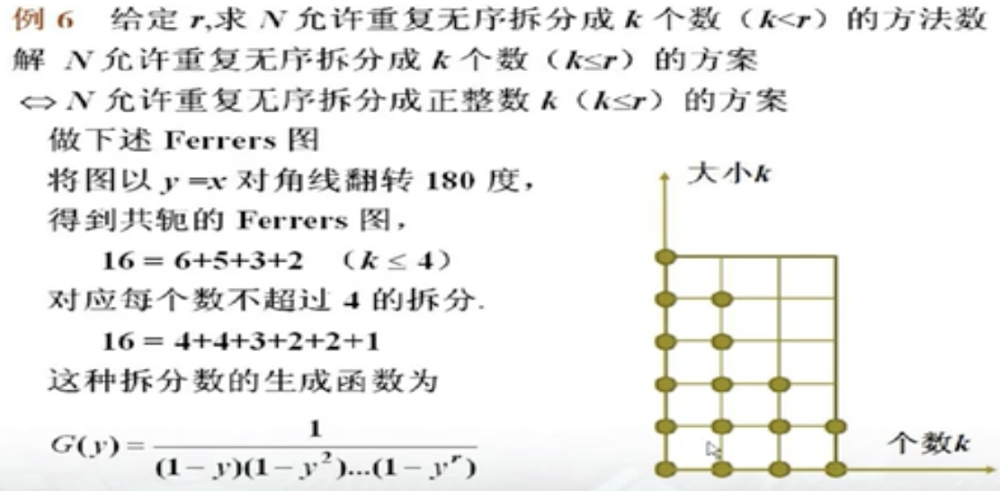

# 离散数学

怎么能忘了离散呢？据说学好了这个对计算机有帮助。emm，那就看看吧。教程： https://www.bilibili.com/video/BV1BW411n7gw

前面的几节课先不记，都是打基础的逻辑学和集合论。看了几节课后发现竟然涉及到了一些抽象代数里的东西。当时记的笔记插入的数学公式是坏的，趁这个机会再来一遍（我发现我真的好喜欢重复学习，就喜欢这种知识划过脑袋却没留下任何痕迹的感觉）

## 等价关系和划分

设 $A\not ={\emptyset}$ 且 $R\subseteq A\times A$ ,若R是自反、对称、传递的，则说R是等价关系

设R是 $A\not ={\emptyset}$ 上等价关系。 $\forall x\in A$ ，则x关于R的等价类是 $[x]_R=$ { $y|y\in A\wedge xRy$ } 。简称为x的等价类，简记为[x]

设R是 $A\not ={\emptyset}$ 上等价关系，A关于R的商集（简称A的商集）是A/R={ $[x]_R|x\in A$ }。显然 $\cup A/R=A$ 。比如集合{1,2,3,4,5,8}关于模3的商集为 $A/R_3=$ {{1,4},{2,5,8},{3}}，可以看作是将A中的每个元素按照模3的同余关系分成几个集合

$A\not ={\emptyset}$ 的一个划分是集族（个人浅浅理解为装着集合的集合） $B\subseteq P(A)$ （集族B里的元素都是A的子集合，P(A)表示A的幂集，正好是A的全体子集合构成的集合）满足：
1. $\emptyset\not\in B$
2. $\forall x,y(x,y\in B\wedge x\not ={y}\Rightarrow x\cap y=\emptyset)$
3. $\cup B=A$

B中元素称为划分块

设 $A\not ={\emptyset}$ ，则：
1. R是A上等价关系 $\Rightarrow$ A/R是A的划分
2. 集族B是A的划分 $\Rightarrow$ 同块关系 $R_B$ ， $xR_By\Leftrightarrow \exists z(z\in B\wedge x\in z\wedge y\in z)$ 是A上等价关系。  $R_B$ 称为由划分B所定义的等价关系

把n元集分成k个非空子集的分法总数{ $^n_k$ } 称为stirling子集数

设B和C都是集A的划分，若B的每个划分块都含于C的某个划分块中，则说B为C的加细

## 序关系

偏序关系及偏序集定义： https://baike.baidu.com/item/%E5%81%8F%E5%BA%8F%E9%9B%86/4328855

偏序集例子：集族B={ $\emptyset$ ,{a},{b}}，偏序集 < B, $\subseteq$ > = $I_B\cup$ { < $\emptyset$ ,{a} > , < $\emptyset$ ,{b} > }

A中两个元素有偏序关系，称x与y可比。若x与y可比且不相等，则说x严格小于y。若x严格小于y，且不存在z，使得x严格小于z，z严格小于y，则称y覆盖x。比如整数集，1严格小于2，2中间没有其他的数了，就叫2覆盖1。反之3没有覆盖1

哈斯图： https://zh.wikipedia.org/wiki/%E5%93%88%E6%96%AF%E5%9C%96

全序关系（线序关系）及全序集（线序集）： https://baike.baidu.com/item/%E5%85%A8%E5%BA%8F%E5%85%B3%E7%B3%BB/943310

拟序关系： https://baike.baidu.com/item/%E6%8B%9F%E5%BA%8F%E5%85%B3%E7%B3%BB/18882239

设A不为空集， < 是A上拟序关系。若x < y,x=y,y < x中有且仅有一式成立，则称 < 具有三歧性。同时称 < 为A上的拟线序关系（拟全序关系）。称 < A, < >为拟线序集

链的定义在 https://zh.wikipedia.org/wiki/%E5%85%A8%E5%BA%8F%E5%85%B3%E7%B3%BB 中有提到。反链： https://zh.wikipedia.org/wiki/%E5%8F%8D%E9%93%BE

设 < A, $\leq$ > 为偏序集。A中最长链长度为n。则：
1. A中存在极大元
2. A存在n个划分块的划分，使得每个划分块都是反链

设 < A, $\leq$ > 为偏序集，若|A|=mn+1，则A中要么存在长度为m+1的反链，要么存在长度为n+1的链

良序关系/良序集： https://zh.wikipedia.org/wiki/%E8%89%AF%E5%BA%8F%E5%85%B3%E7%B3%BB

## 图的基本概念

大部分概念： 
- https://zhuanlan.zhihu.com/p/558416065
- https://zhuanlan.zhihu.com/p/62056687 （这个后面找的，更全，和下面的内容有重复）

补充：
- [正则图](https://baike.baidu.com/item/%E6%AD%A3%E5%88%99%E5%9B%BE/10038215)
- [度序列](https://zh.wikipedia.org/wiki/%E5%BA%A6_(%E5%9B%BE%E8%AE%BA))
- [可图化](https://oi-wiki.org/graph/concept/) （这里面有很多概念，不止这一个）
- 可简单图化充要条件：[Havel定理](https://github.com/BBuf/ACM_template/blob/master/%E5%9B%BE%E8%AE%BA/Havel-Hakimi%E5%AE%9A%E7%90%86.md)
- [完全图](https://baike.baidu.com/item/%E5%AE%8C%E5%85%A8%E5%9B%BE/10073908)
- [竞赛图](https://cmwqf.github.io/2020/04/22/%E6%B5%85%E8%B0%88%E7%AB%9E%E8%B5%9B%E5%9B%BE/)
- [柏拉图图](https://academic-accelerator.com/encyclopedia/zh-cn/platonic-graph)
- [彼得森图](https://baike.baidu.com/item/%E5%BD%BC%E5%BE%97%E6%A3%AE%E5%9B%BE/1505830)
- [图运算](https://songningsdut.github.io/html/notes/graph-theory/basic/04-operation.html)

## 通路与回路

https://zhuanlan.zhihu.com/p/62056687 也包含通路与回路的大部分概念。补充：
- 简单通路、回路；复杂通路、回路；初级通路（路径）、回路（圈）： https://blog.csdn.net/Deam_swan_goose/article/details/103754880

## 无向图与有向图的连通性

是的 https://zhuanlan.zhihu.com/p/62056687 还能用

## 无向图的连通度（上）

https://zhuanlan.zhihu.com/p/62056687 杀疯了

## 无向图的连通度（下）

同上。另外这两节课ppt都不动啊，如果之后还这样就考虑换一个课程

## 欧拉图

继续同上。这节课ppt稍微正常了一点

## 哈密顿图

还能同上，但是补充：
- 哈密顿通路、回路： https://zh.wikipedia.org/zh-cn/%E5%93%88%E5%AF%86%E9%A0%93%E8%B7%AF%E5%BE%91
- 无向哈密顿图的充分条件二： https://baike.baidu.com/item/%E5%93%88%E5%AF%86%E9%A1%BF%E5%9B%BE/2587317

找着找着找到了第8（7？）章使用的ppt： http://123.56.88.210/ppt/lisan_8.pdf

## 树

找到了复旦大学的课件，是差不多的内容： https://fdjpkc.fudan.edu.cn/_upload/article/files/3a/1b/d7d0f9114d958bed297cf245d0ab/2b82b79a-021a-4a64-b2ca-e2eb503a2ef9.pdf

补充：
- [Cayley公式](https://zhuanlan.zhihu.com/p/555689383)

## 图的矩阵表示

这回又找到了天津大学的课件： https://cic.tju.edu.cn/faculty/hyh/discretemathematics/09.pdf

照着上面的北京大学pdf的url翻，真给我找到了其他课的pdf，比如这节课的： http://123.56.88.210/ppt/lisan_10.pdf ，虽然稍微有点不一样

这节课后面大部分ppt又不动了，且上面找的pdf似乎不全

## 平面图的概念

http://123.56.88.210/ppt/lisan_11.pdf ，部分定理的安排顺序不同

## 欧拉公式与平面图的判断

是上节课的续， http://123.56.88.210/ppt/lisan_11.pdf 仍然可用

## 平面图的对偶图、外平面图

对偶图看ppt没懂，看了百度百科后懂了： https://baike.baidu.com/item/%E5%AF%B9%E5%81%B6%E5%9B%BE/10506149

## 平面图与哈密顿图

还是那个ppt，顺序可能稍有不同。另外这几节课麦克风有点问题，听着很糊

## 点着色与色多项式

http://123.56.88.210/ppt/lisan_12.pdf ，另外声音终于恢复正常了

## 平面图着色与边着色

继续用上节课的ppt

## 支配集、点覆盖集、点独立集

http://123.56.88.210/ppt/lisan_13-1.pdf 。视频安排的讲课顺序有点跳跃（快到一半的时候又跳回去讲了一遍开始的内容）

## 二部图中的匹配

http://123.56.88.210/ppt/lisan_13-2.pdf

## 中国邮递员问题和货郎担问题

- [中国邮递员问题](https://zhuanlan.zhihu.com/p/401982790)
- [货郎担问题（旅行推销员问题）](https://zh.wikipedia.org/wiki/%E6%97%85%E8%A1%8C%E6%8E%A8%E9%94%80%E5%91%98%E9%97%AE%E9%A2%98)

## 二元运算及其性质1

没找到离散数学二的课件，但是找到了[这个](https://pan.baidu.com/link/zhihu/7Nh2zXuThninTmJWBlUth2kWMUahh1UwZR10==)，以后要是没有笔记的课程都可以在这里找相关内容。不是完全一样，但是重要的定义，定理和性质都没落下（并没有），能用。以下是一些补充：
- [吸收律](https://zh.wikipedia.org/wiki/%E5%90%B8%E6%94%B6%E5%BE%8B)
- [幂等元](https://zhidao.baidu.com/question/361443008925294972.html)
- [可逆元](https://zh.wikipedia.org/wiki/%E5%8F%AF%E9%80%86%E5%85%83)

## 代数系统

代数系统的分类补充：
- 同种的：构成成分与公理都相同

## 代数系统的同态与同构

今后这里记的都是对上面pdf的补充

同态映射的分类：
1. 按映射性质：
- 单同态（单射）
- 满同态 $V_1～V_2$ （满射）
- 同构 $V_1\cong V_2$ （双射）
2. 按载体分：自同态（自己映射到自己）
3. 综合
- 单自同态
- 满自同态
- 自同构

同态性质：
- 同态的合成仍旧是同态
- 同态像是映到的代数系统的子代数
- 满同态映射（在同态像中）保持原代数系统的下述性质：交换，结合，幂等，分配，吸收；单位元，零元，逆元（没有消去律）

## 同余关系与商代数

课程好像中间缺了什么东西，pdf也是。这里是补充：
- [同余、商代数、积代数](https://zhuanlan.zhihu.com/p/395603054)

然后同余类又给我忘了，这回不记正式定义了。总之这么想，在模3下，全部整数只有3类，以余数为0，1或2区分。所以模3一共有三个同余类，共同构成了一个商集。然后再在商集里面定义新的运算，满足规定的条件（用新运算在商集里的运算结果，等于先在原有代数里运算，再把结果放进商集）后就构成了一个代数结构，即为商代数。商代数保持原有代数的交换、结合、幂等、分配、吸收律（没消去律）；单位元、零元、逆元。同余是一种等价关系，任何等价关系都能这样定义出商集

同态、同余关系与商代数的联系：
- 同态映射导出同余关系
    - 假设有 $f:A\rightarrow B$ 为两个代数系统间的同态映射，则可导出等价同余关系R，满足 $aRb\Leftrightarrow f(a)=f(b)$
- 商代数是原代数的同态像（也叫自然映射）
- 同态基本定理：代数系统的同态像同构于它的商代数（任何同态像在同构意义下是商代数）。设 $V_1=$ < $A,o_1,o_2,...,o_r$ > 与 $V_2=$ < $B,o_1',o_2',...,o_r'$ > 是同类型的代数系统，对于 $i=1,2,...,r$ , $o_i$ 与 $o_i'$ 都是 $k_i$ 元运算， $f:A\rightarrow B$ 是 $V_1$ 到 $V_2$ 的同态，关系R是f导出的 $V_1$ 上的同余关系，则 $V_1$ 关于同余关系R的商代数同构于 $V_1$ 在f下的同态像，即 $V_1/R\cong$ < $f(A),o_1',o_2',...,o_r'$ >

怎么也没想到抽象代数里没学会的在这里学会了

## 半群与独异点

广群只要求V= < $S,\circ$ > , $\circ$ 具有封闭性。若 $\circ$ 还可结合，就是半群；若再加个单位元e，就是独异点（幺半群）。幂运算的定义、规则均与平时实数的定义相同

若干子半群的非空交集仍为子半群；若干子独异点的交集仍为子独异点

## 直积、商代数与同态

设V= < S,\* > ，V'= < $S^S,\circ$ > ( $S^S=$ { $f|f:s\rightarrow s$ } ), $\circ$ 为函数合成，则V‘也是半群，且存在V到V'的同态

设V= < S,\*,e > 为独异点，则存在 $T\subseteq S^S$ ，使得 < S,\*,e > 同构于 < $T,\circ,I_S$ （恒等函数）>

另外找到个ppt： http://123.56.88.210/ppt1/chap9.pdf 。不知道为啥有些内容是一样的，有些内容却又完全没有

## 群的定义和性质

方程ax=b和ya=b在群G中有解且有唯一解

设G是有限半群，且不含零元。若G中成立消去律，则G是群

## 子群1

- [（元素）生成子群](https://zhuanlan.zhihu.com/p/596801739)
- B生成子群：< B > = $\cap$ { $H|H\leq G,B\subseteq H$ }, $B\subseteq G$ 。 < B > = { $b_1^{e_1}b_2^{e_2}...b_n^{e_n}|b_i\in B,e_i=\pm 1,i=1,2,...,n,n\in Z^+$ }。相当于从子集B中拿出任意多个元素（及其逆），其所有可能的运算结果整体构成的子群
- [中心](https://zh.wikipedia.org/wiki/%E4%B8%AD%E5%BF%83_(%E7%BE%A4%E8%AE%BA))
- 元素的正规化子：N(a)={ $x|x\in G,xa=ax$ }, $a\in G$ 。所有与a可交换的元素的集合。中心 $C\subseteq N(a)$
- 子群的正规化子:N(H)={ $x|x\in G,xHx^{-1}=H$ }, $H\leq G$ 。 $xHx^{-1}$ 是一个集合，等于{ $xhx^{-1}|h\in H$ }。注意是集合相等而不是元素一一对应的相等。正规化子也是子群
- 共轭子群： $xHx^{-1}=$ { $xhx^{-1}|h\in H$ },其中 $H\leq G,x\in G$
- $H,K\leq G$ ,则 $H\cap K\leq G;H\cup K\leq G\Leftrightarrow H\subseteq K$ 且 $K\subseteq H$

## 子群2

设 $A,B\leq G$ ,定义AB={ $ab|a\in A,b\in B$ }，则：
1. $AB\leq G\Leftrightarrow AB=BA$ 。注意这点意味着ab=b'a'，不一定a=a'或b=b'，只是两者运算结果一致
2. $AB\leq G\Rightarrow AB=$ < $A\cup B$ >

子群格可在 http://123.56.88.210/ppt1/chap9.pdf 的最后一页找到

## 变换群与置换群

- [变换群,Cayley定理](http://cslabcms.nju.edu.cn/problem_solving/images/d/d5/%E4%BB%A3%E6%95%B0%E7%B3%BB%E7%BB%9F-5%E5%8F%98%E6%8D%A2%E7%BE%A4%E4%B8%8E%E7%BD%AE%E6%8D%A2%E7%BE%A4.pdf)
- [置换（群），（不交）轮换，对换](https://pan.baidu.com/link/zhihu/7Nh2zXuThninTmJWBlUth2kWMUahh1UwZR10==)
- 轮换指数： $C_k(\sigma):$ k轮换的个数

## 群的分解1

- [拉格朗日定理](https://zh.wikipedia.org/wiki/%E6%8B%89%E6%A0%BC%E6%9C%97%E6%97%A5%E5%AE%9A%E7%90%86_(%E7%BE%A4%E8%AB%96))

## 群的分解及正规子群

- [共轭关系/共轭（元素）类](https://zhuanlan.zhihu.com/p/609614737)
- 群的分类方程：G为群，C为中心，G中至少含两个元素的共轭类有k个， $a_1,a_2,...,a_k$ 为代表元素，则 $|G|=|C|+[G:N(a_1)]+[G:N(a_2)]+...+[G:N(a_k)]$
- 正规子群判定定理： $N\leq G$ ,则下述条件等价：
1. N是G的正规子群
2. $\forall g\in G,gNg^{-1}=N$
3. $\forall g\in G,\forall n\in N,gng^{-1}\in N$

或是利用其他判定方法：|N|=t,N是G的唯一t阶子群，以及指数为2的子群
- 商群：G/H={ $Ha|a\in G$ },HaHb=Hab

## 商群与群同态

性质：|G/H|=[G:H],商群的阶是|G|的因子，保持群G的性质，交换性，循环性等

G为Abel群，|G|=n，素数p整除n，则G中有p阶元

[群同态](https://zhuanlan.zhihu.com/p/163548084)，性质：
- $f(e_1)=e_2,f(x^{-1})=f(x)^{-1}$ 。 |f(a)|整除|a|，同构条件下|f(a)|=|a|
- $H\leq G_1\Rightarrow f(H)\leq G_2$ , $H\unlhd G_1$ ,f为满同态， $f(H)\unlhd G_2$

[同态核](https://zhuanlan.zhihu.com/p/163548084)的性质：
- kerf={ $e_1$ } $\Leftrightarrow$ f为单同态
- kerf $\unlhd G_1,\forall a,b\in G_1,f(a)=f(b)\Leftrightarrow akerf=bkerf$

[(群)同态基本定理](https://zhuanlan.zhihu.com/p/163548084)

- EndG：G的自同态的集合
- AutG：G的自同构的集合
- InnG：G的内自同构的集合。内自同构： $f_x:G\rightarrow G,f_x(a)=xax^{-1}$

关系： $InnG\subseteq AutG\subseteq EndG$ 。EndG为独异点，AutG为群，InnG为AutG的正规子群， $I_G=f_e$ 属于InnG

## 环的定义和性质

[除环](https://baike.baidu.com/item/%E9%99%A4%E7%8E%AF/9813468)

## 子环、理想、商环和环同态

- [子环](https://zhuanlan.zhihu.com/p/613871606)
- [理想](https://zh.wikipedia.org/wiki/%E7%90%86%E6%83%B3_(%E7%8E%AF%E8%AE%BA))
- [商环](https://zh.wikipedia.org/wiki/%E5%95%86%E7%8E%AF)
- [环同态、同态核、性质](https://zh.wikipedia.org/wiki/%E7%8E%AF%E5%90%8C%E6%80%81)。补充性质：
    - f(1)=1
    - S是 $R_1$ 的子环，则f(S)是 $R_2$ 的子环
    - T是 $R_2$ 的子环，则 $f^{-1}(T)$ 是 $R_1$ 的子环
    - D是 $R_1$ 的理想，则f(D)是 $f(R_1)$ 的理想
    - I是 $R_2$ 的理想，则 $f^{-1}(I)$ 是 $R_1$ 的理想
- 同态基本定理：环R的任何商环R/D是R的同态像，若R～R'，则 $R'\cong R/kerf$

## 格的定义和性质

- [正因子格](http://123.56.88.210/ppt1/chap9.pdf)
- [格的性质](https://pan.baidu.com/link/zhihu/7Nh2zXuThninTmJWBlUth2kWMUahh1UwZR10==)

## 子格格同态及直积

- [格同态及其性质](https://math.fandom.com/zh/wiki/%E6%A0%BC%E5%90%8C%E6%80%81?variant=zh)
- [完备（完全）格](https://zh.wikipedia.org/wiki/%E5%AE%8C%E5%85%A8%E6%A0%BC)
- [格的理想](https://math.fandom.com/zh/wiki/%E6%A0%BC%E7%9A%84%E7%90%86%E6%83%B3?variant=zh)
- 理想格：L的所有理想的集合关于包含关系构成格 $I_0(L)=I(L)\cup$ { $\emptyset$ }。理想格不一定完备，但是 $I_0(L)$ 是完备格。任何格L都可嵌入完备格 $I_0(L)$ ，即与 $I_0(L)$ 的子格同构

## 特殊的格

- [模格](https://math.fandom.com/zh/wiki/%E6%A8%A1%E6%A0%BC?variant=zh)
    - L为模格当且仅当L不含有与五角格同构的子格
- [分配格](https://baike.baidu.com/item/%E5%88%86%E9%85%8D%E6%A0%BC/15547454)
    - 设L为模格，L为分配格当且仅当：若 $\forall a,b,c\in L$ ，有 $(a\wedge b)\vee(b\wedge c)\vee(c\wedge a)=(a\vee b)\wedge(b\vee c)\wedge(c\vee a)$ 。一般格成立不等式 $\leq$
- [有界格](https://zh.wikipedia.org/wiki/%E6%9C%89%E7%95%8C%E6%A0%BC)
    - $a\wedge b=0,a\vee b=1$ ，则a与b互为补元

## 有补格、布尔格

- [有补格](https://baike.baidu.com/item/%E6%9C%89%E8%A1%A5%E6%A0%BC/2203999)
- 布尔格（布尔代数）：有补分配格。设 < $B,\*,\circ,\Delta,a,b$ > 是代数系统，其中 $\*,\circ$ 为二元运算， $\Delta$ 为一元运算，a，b为0元运算。如果满足以下算律：
    - 交换律： x\*y=y\*x, $x\circ y=y\circ x$
    - 分配律： $x\*(y\circ z)=(x\*y)\circ(x\*z)$ ， $x\circ(y\*z)=(x\circ y)\*(x\circ z)$
    - 同一律： $x\*b=x,x\circ a=x$
    - 补元律： $x*\Delta x=a,x\circ\Delta x=b$

则 < $B,\*,\circ,\Delta,a,b$ > 构成布尔格

## 布尔代数

- [布尔代数的性质,原子,有限布尔代数的表示定理](http://ws.nju.edu.cn/courses/dm/courseware/20150504-Boolean_Algebra.pdf)
    - 注意视频里提到的“双重否定律”在这个课件里叫“双重补律”；D.M律指代德摩根律
- [布尔代数的同态](https://zh.wikipedia.org/wiki/%E5%B8%83%E5%B0%94%E4%BB%A3%E6%95%B0)

## 两个计数原则、排列组合

- [鸽巢原理](https://zh.wikipedia.org/wiki/%E9%B4%BF%E5%B7%A2%E5%8E%9F%E7%90%86)
- [Ramsey定理](https://zh.wikipedia.org/wiki/%E6%8B%89%E5%A7%86%E9%BD%90%E5%AE%9A%E7%90%86)
- 加法法则：事件A有m种产生方式，事件B有n种产生方式。则“事件A或B”有m+n种产生方式。使用条件为事件A与B产生方式不重叠，适用于分类选取问题。可推广到k种事件
- 乘法法则：事件A有m种产生方式，事件B有n种产生方式。则“事件A与B”有mn种产生方式。使用条件为事件A与B产生方式相互独立，适用于分布选取问题。可推广到k种事件
- 集合的排列：从n元集S中有序、不重复选取的r个元素称为S的一个r排列。S的所有r排列的数目记作P(n,r)。P(n,r)= $\frac{n!}{(n-r)!},n\geq r$ 。若n < r，等于0
    - S的r环排列数= $\frac{P(n,r)}{r}$

## 排列与组合

- 集合的组合：从n元集S中无序、不重复选取的r个元素称为S的一个r组合。S的所有r组合的数目记作C(n,r)。C(n,r)= $\frac{P(n,r)}{r!},n\geq r$ 。若n < r，等于0
    - C(n,r)=C(n,n-r)
- 多重集的排列：多重集可表示为S={ $n_1\*a_1,n_2\*a_2,...,n_k\*a_k$ },0 < $n_i\leq+\infty$
    - r排列的计数结果：全排列r=n, $n_1+n_2+...n_k=n$ , $N=\frac{n!}{n_1!n_2!...n_k!}$ 。若 $r\leq n_i$ ，为 $k^r$
    - 组合数为N=C(k+r-1,r),当 $r\leq n_i$
- 放球问题：r个相同的球放到n个不同的盒子里，每个盒子球数不限，求放球方法数, N=C(n+r-1,r)

## 二项式定理与组合恒等式

- [二项式定理](https://zh.wikipedia.org/wiki/%E4%BA%8C%E9%A1%B9%E5%BC%8F%E5%AE%9A%E7%90%86)
- 组合恒等式（递推式）
    - $(^n_k)=(^n_{n-k})$
    - $(^n_k)=\frac{n}{k}(^{n-1}_{k-1})$
    - $(^n_k)=(^{n-1}\_k)+(^{n-1}\_{k-1})$

## 组合恒等式2

- 简单和： $\Sigma_{k=0}^n(^n_k)=2^n$
- 交错和： $\Sigma_{k=0}^n(-1)^k(^n_k)=0$
- 变系数和
    - $\Sigma_{k=0}^nk(^n_k)=n2^{n-1}$
    - $\Sigma_{k=0}^nk^2(^n_k)=n(n+1)2^{n-2}$
- 变上项求和： $\Sigma^n_{l=0}(^l_k)=(^{n+1}_{k+1}),n,k\in N$
- 积： $(^n_r)(^r_k)=(^n_k)(^{n-k}_{r-k})$
- 积之和
    - $\Sigma_{k=0}^r(^m_k)(^n_{r-k})=(^{m+n}_r),r=min(m,n)$
    - $\Sigma_{k=0}^m(^m_k)(^n_k)=(^{m+n}_m)$

## 多项式定理、组合计数应用

- [多项式定理](https://zh.wikipedia.org/wiki/%E5%A4%9A%E9%A1%B9%E5%BC%8F%E5%AE%9A%E7%90%86)
- 恒等式
    - $\Sigma(^n_{n_1n_2...n_i})=t^n$
    - $(^n_{n_1n_2...n_i})=\frac{n!}{n_1!n_2!...n_i!}$
    - $(^n_{n_1n_2...n_i})=\frac{n-1}{(n_1-1)n_2...n_i}+\frac{n-1}{n_1(n_2-1)...n_i}+...+\frac{n-1}{n_1n_2...(n_i-1)}$

## 递推方程的公式解法1

这解法怎么感觉在线性代数里见过？

- [递推方程（公式）](https://baike.baidu.com/item/%E9%80%92%E6%8E%A8%E5%85%AC%E5%BC%8F/3799173)
- 常系数线性齐次递推方程
    - $H(n)-a_1H(n-1)-a_2H(n-2)-...-a_kH(n-k)=0$
    - $H(0)=b_0,H(1)=b_1,H(2)=b_2,...,H(k-1)=b_{k-1}$
    - 其中 $a_1,a_2,...,a_k$ 为常数， $a_k\not ={0}$ ，称为k阶常系数线性齐次递推方程， $b_0,b_1,...,b_{k-1}$ 为k个初值。第n个项是前面的项的线性组合
- 特征方程： $x^k-a_1x^{k-1}-...-a_k=0$ 。特征方程的根称为递推方程的特征根。如斐波那契数列的递推方程 $f_n=f_{n-1}+f_{n-2}$ ，特征方程为 $x^2-x-1=0$
    - q是非零复数，则 $q^n$ 是递推方程的解 $\Leftrightarrow$ q是它的特征根
    - $h_1(n),h_2(n)$ 是递推方程的解， $c_1,c_2$ 是任意常数，则 $c_1h_1(n)+c_2h_2(n)$ 是递推方程的解。可推广到k个特征根的情况
    - 设 $q_1,q_2,...,q_k$ 是递推方程不等的特征根，则 $H(n)=c_1q_1^n+c_2q_2^n+...+c_kq_k^n$

## 递推方程的公式解法2

若q是递推方程的e重特征根（e个重复的特征根），则 $q^n,nq^n,...,n^{e-1}q^n$ 是递推方程的线性无关的解

设 $q_1,q_2,...,q_t$ 是递推方程不相等的特征根，且 $q_i$ 的重数为 $e_i$ ，令 $H_i(n)=(c_{i1}+c_{i2}n+...+c_{ie_i}n^{e_i-1})q_i^n$ 。那么通解为 $H(n)=\Sigma_{i=1}^tH_i(n)$

设 $\overline{H(n)}$ 是对应齐次方程的通解， $H^{\*}(n)$ 是一个特解，则 $H(n)=\overline{H(n)}+H^{\*}(n)$ 是递推方程的通解

f(n)为指数函数 $\beta^n$ 。若 $\beta$ 不是特征根，则特解为 $P\beta^n$ 。若 $\beta$ 是e重特征根，则特解为 $Pn^e\beta^n$

## 生成函数的定义和性质

- [生成函数](https://www.cnblogs.com/zwfymqz/p/10521686.html)
    - 例如，给定正整数k，序列{ $k^n$ }的生成函数为 $G(x)=1+kx+k^2x^2+k^3x^3+...=\frac{1}{1-kx}$
    - 线性性质
        1. $b_n=\alpha a_n$ ，则 $B(x)=\alpha A(x)$
        2. $c_n=a_n+b_n$ ，则 $C(x)=A(x)+B(x)$
    - 乘积性质： $c_n=\Sigma_{i=0}^na_ib_{n-i}$ ，则C(x)=A(x)\*B(x)
    - 移位性质
        1. 向后移位： $b_n=0$ ,若n < l；等于 $a_{n-l}$ ,若 $n\geq l$ 。则 $B(x)=x^lA(x)$ 。相当于B(x)序列最低的项就是 $x^l$ ，前面的都是0
        2. 向前移位： $b_n=a_{n+l}$ ，则 $B(x)=\frac{A(x)-\Sigma_{n=0}^{l-1}a_nx^n}{x^l}$
    - 求和性质：
        1. 向前求和： $b_n=\Sigma_{i=0}^na_i$ ，则 $B(x)=\frac{A(x)}{1-x}$
        2. 向后求和： $b_n=\Sigma_{i=n}^{\infty}a_i$ ，且 $A(1)=\Sigma_{n=0}^{\infty}a_i$ 收敛，则 $B(x)=\frac{A(1)-xA(x)}{1-x}$
    - 写了这么多后发现这里有： https://blog.csdn.net/shulianghan/article/details/109326582
    - [生成函数与序列的对应](https://blog.csdn.net/shulianghan/article/details/109326582)
- 牛顿二项式系数： $(^r_n)=0$ ，如果n < 0；等于1，如果n=0；等于 $\frac{r(r-1)...(r-n+1)}{n!}$ ，如果n大于0。其中r为实数，n为整数
- 牛顿二项式定理：设 $\alpha$ 为实数，则对一切x，y，|x/y| < 1有 $(x+y)^{\alpha}=\Sigma_{n=0}^{\infty}(^{\alpha}_n)x^ny^{\alpha-n}$

## 生成函数与组合计数1

- 生成函数的应用
    - [求解递推方程](https://blog.csdn.net/shulianghan/article/details/109329784)
    - [计数多重集的r组合数](https://blog.csdn.net/shulianghan/article/details/109332046)
    - [不定方程的解的个数](https://blog.csdn.net/shulianghan/article/details/109353385)
        - 参考 https://hanshuliang.blog.csdn.net/article/details/109356165 和 https://hanshuliang.blog.csdn.net/article/details/109356246 ，比如1克砝码2个，2克砝码1个，4克砝码2个，求能称出哪些数量，以及对应的方案数量。其实就是不定方程 $x_1+2x_2+4x_3=r$ 。不好描述，直接把生成函数放出来： $G(y)=(1+y+y^2)(1+y^2)(1+y^4+y^8)$ 。如果砝码可以放两边而不是同一边，能拓展成带负数次幂的生成函数： $G(y)=(y^{-2}+y^{-1}+1+y+y^2)(y^{-2}+1+y^2)(y^{-8}+y^{-4}+1+y^4+y^8)$ 。
    - 正整数的拆分
        - [重复有序拆分 | 不重复有序拆分](https://blog.csdn.net/shulianghan/article/details/109377530)
        - [有限制条件的无序拆分](https://hanshuliang.blog.csdn.net/article/details/109371794)
            - Ferrers图：

## 生成函数与组合计数2

- [指数生成函数](https://zhuanlan.zhihu.com/p/601482420)
    - [性质、多重集排列计数](https://cloud.tencent.com/developer/article/2247960)

## Catalan数与Stirling数

- [卡塔兰数](https://zh.wikipedia.org/wiki/%E5%8D%A1%E5%A1%94%E5%85%B0%E6%95%B0)
- [第一类/二类斯特林数](https://zhuanlan.zhihu.com/p/350774728)

## 包含排斥原理、对称筛公式

- [包含排斥原理、对称筛公式及其应用](http://123.56.88.210/ppt1/W9b.pdf)

## 棋盘多项式

- [棋盘多项式定义、性质](https://baike.baidu.com/item/%E6%A3%8B%E7%9B%98%E5%A4%9A%E9%A1%B9%E5%BC%8F/12709565)
    - 补充链接（应用）： http://123.56.88.210/ppt1/W9b.pdf

## Burnside引理与Polya定理

- [不动置换类和轨道（之间的关系）/Burnside引理+应用/Polya定理](http://123.56.88.210/ppt1/W9b.pdf)