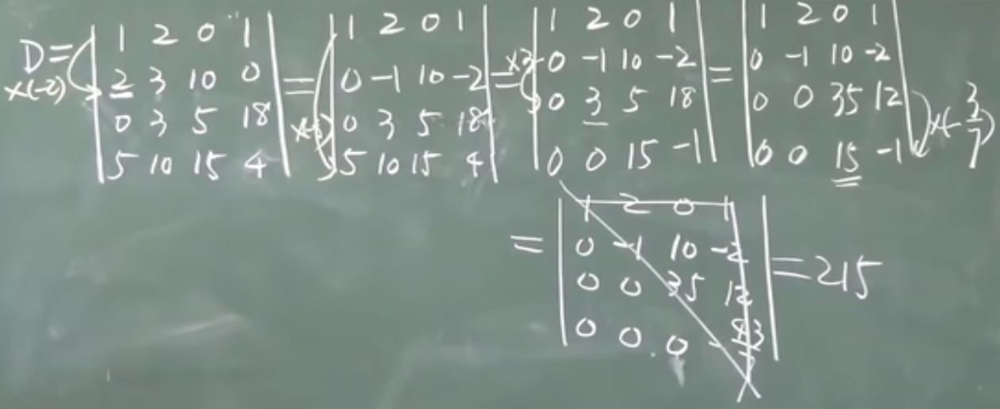
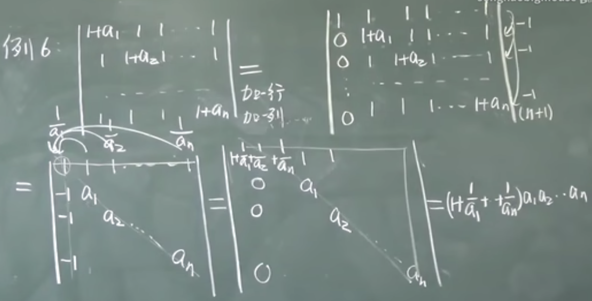

# 线性代数

某人觉得自己线性代数学的不好（去年学的感觉太少了完全不够，重新来一遍！），所以有了这篇笔记

课程： https://www.bilibili.com/video/BV1aW411Q7x1/?spm_id_from=333.337.search-card.all.click

## 1.1 二阶三阶行列式

定义二阶行列式（2行2列4个元素）,其中 $a_{ij}$ 中i为行标，j为列标:

$$\begin{vmatrix}a_{11}&a_{12}\cr a_{21}&a_{22}\end{vmatrix}=a_{11}a_{22}-a_{12}-a_{21}$$

从左上角到右下角叫主对角线，从左下角到右上角叫次对角线

三阶行列式：

$$\begin{vmatrix}a&b&c\cr d&e&f\cr g&h&i\end{vmatrix}=aei+fbg+hdc-ceg-bdi-fha$$

排列：由1，2,...,n组成的一个有序数组叫n级排列。排列中间不能缺数，n级排列有 $n(n-1)...3\times 2\times 1=n!$ 种

逆序：大数排在小数的前面。如4213

逆序数：逆序的总数。如4213，计算每个数后面有多少个比它小的数。4后有3个，2后有一个，所以逆序数为3+1=4。记为N(4213)=3+1=4

偶/奇排列：若逆序数是偶/奇数就称为偶/奇排列

n级标准排列（自然排列）：N(1,2,...,n)=0. $N(n(n-1)...321)=n-1+n-2...+2+1=\frac{n(n-1)}{2}$

对换：交换两个数。54123对换1和2就是54213

定理：
1. 排列经过一个对换后奇偶性改变
2. n级排列中，奇排列，偶排列各占 $\frac{n!}{2}$

## 1.1 n阶行列式

n阶行列式计算(3种定义)：
1. 按行展开：行标取标准排列，列标取排列的所有可能，从不同行不同列取出3个元素相乘。符号由列标排列的奇偶性决定（偶为正，奇为负），共有n!项

$$\begin{vmatrix}a_{11}&a_{12}&...&a_{1n}\cr a_{21}&a_{22}&...&a_{2n}\cr ...&...&...&...\cr a_{n1}&a_{n2}&...&a_{nn}\end{vmatrix}=\Sigma_{j_1j_2...j_n}(-1)^{N(j_1j_2...j_n)}a_{1j_1}a_{2j_2}...a_{nj_n}$$

2. 按列展开：列标取标准排列，行标取排列的所有可能，从不同行不同列取出3个元素相乘。符号由行标排列的奇偶性决定。 $\Sigma_{i_1i_2...i_n}(-1)^{N(i_1i_2...i_n)}a_{i_11}a_{i_22}...a_{i_nn}$

3. 既不按行也不按列： $\Sigma(-1)^{N(i_1...i_n)+N(j_1...j_n)}a_{i_1j_1}a_{i_2j_2}...a_{i_nj_n}$

常将行列式记为 $D=|a_{ij}|$ 。特别的， $|a_{11}|=a_{11}$ 。下三角（指一个矩阵对角线及主对角线左下角为任意元素，右上角全为0），上三角（与下三角类似，只不过反过来）和对角形（矩阵只有主对角线有任意元素，其余全为0）行列式等于主对角线元素相乘。

## 1.2 行列式的性质

转置：将矩阵的行和列交换。将转置后的矩阵记为 $D^T(D')$ . $(D^T)^T=D$

$$D=\begin{vmatrix}1&2&3\cr 1&1&1\cr 8&8&8\end{vmatrix},D^T=\begin{vmatrix}1&1&8\cr 2&1&8\cr 3&1&8\end{vmatrix}$$

行列式的性质：
1. $|D^T|=D$ (矩阵转置行列式值不变)。对行成立的性质，对列也成立
2. 矩阵两行互换，行列式值变号
3. 矩阵两行（列）相等，|D|=0
4. 矩阵某一行都乘以k，等于用k乘以|D|. 

$$\begin{vmatrix}1&2&3\cr 4k&5k&6k\cr 7&8&9\end{vmatrix}=k\begin{vmatrix}1&2&3\cr 4&5&6\cr 7&8&9\end{vmatrix}$$

推论：某一行都有公因子k，k可提到外面。行列式所有元素均有公因子k，k往外提n次

5. 矩阵两行成比例，D=0

$$\begin{vmatrix}1&2&3\cr 1&1&1\cr 8&8&8\end{vmatrix}=8\begin{vmatrix}1&2&3\cr 1&1&1\cr 1&1&1\end{vmatrix}$$

推论：某一行全为0，D=0
6. 若矩阵的某一行为两数之和，则其行列式（是和的那一行）可拆为两个行列式之和。但其余保持不变

$$\begin{vmatrix}1&2&3\cr 7+8&2+3&9+10\cr 8&8&9\end{vmatrix}\begin{vmatrix}1&2&3\cr 7&2&9\cr 8&8&9\end{vmatrix}\begin{vmatrix}1&2&3\cr 8&3&10\cr 8&8&9\end{vmatrix}$$

7. 某一行（列）乘以一个数，加到另一行（列）去，D不变

对于某些纯数字的矩阵来说，计算它的行列式可以利用性质7尝试将其化为上三角行列式后直接将其主对角线乘起来。

建议先处理第一列（拿第一行第一个元素消完第一列剩下元素），然后第二列（拿第二行第二个元素消完第二列剩下元素）。这样不会导致做到最后乱套。且第n列处理完后（第n列除前n个元素已全为0），第n行不再参与运算（否则运算后之前消好的0又没了）。

## 1.3 行列式按行展开

余子式：选定矩阵的某个元素，将其所在行和列去掉后，剩余元素组成的矩阵的行列式称为之前选定元素的余子式。

$$\begin{vmatrix}1&1&0&3\cr 1&1&1&1\cr 2&2&3&4\cr 5&5&6&6\end{vmatrix}$$

矩阵中，第三行第二列的元素2的余子式为

$$M_{32}=\begin{vmatrix}1&0&3\cr 1&1&1\cr 5&6&6\end{vmatrix}$$

代数余子式则是在余子式的基础上加个符号。还是拿第三行第二列的元素2举例，它的代数余子式是

$$A_{32}=(-1)^{3+2}\begin{vmatrix}1&0&3\cr 1&1&1\cr 5&6&6\end{vmatrix}$$

定理（按某行（列）展开）： 对于n阶方阵， $D=a_{i1}A_{i1}+a_{i2}A_{i2}+...+a_{in}+A_{in}$ 或 $D=a_{1j}A_{1j}+a_{2j}A_{2j}+...+a_{nj}A_{nj}$

该定理可用于计算高阶行列式时降阶。选择0较多的行（列）展开会更容易计算。

异乘变零定理：某行元素与另一行元素的代数余子式乘积之和=0

k阶子式：在一个矩阵中画k条横线和k条竖线，线的2k处交叉点的数字所组成的行列式被称为k阶子式。如下列矩阵选择一二行和三四列：

$$\begin{vmatrix}1&2&3&4\cr 1&1&2&5\cr 1&1&0&8\cr 9&9&9&10\end{vmatrix}$$

所形成的二阶子式为：

$$\begin{vmatrix}1&2\cr 1&1\end{vmatrix}$$

余子式：还是上面那个矩阵，但是选择没有被线画过的剩余的元素，所组成的行列式为余子式。

$$\begin{vmatrix}0&8\cr 9&10\end{vmatrix}$$

代数余子式：在余子式前加上符号，符号由选取的行数和列数决定。

$$(-1)^{1+2+1+2}\begin{vmatrix}0&8\cr 9&10\end{vmatrix}$$

拉普拉斯展开定理：取定k行，由k行元素所组成的所有k阶子式与代数余子式乘积之和=D

行列式相乘：假设 $D_1$ 和 $D_2$ 是两个n阶行列式，则它们的乘积可以表示成一个n阶行列式（同阶才可用）

$$\begin{vmatrix}1&1&1\cr 2&0&0\cr 0&0&3\end{vmatrix}\times\begin{vmatrix}1&2&3\cr 1&3&2\cr 3&2&1\end{vmatrix}=\begin{vmatrix}5&7&6\cr 2&4&6\cr 9&6&3\end{vmatrix}$$

拿第一个行列式的每一行与第二个行列式的每一列相乘。 $2=2\times 1+0\times 1+0\times 3,4=2\times 2+0\times 3+0\times 2,6=2\times 3+0\times 2+0\times 1$

## 1.4 行列式的计算2

矩阵按照特殊的规则加行加列后(加边法)行列式不变。当矩阵只有箭头处有元素，其余元素为0时，称此矩阵为三叉形行列式。

范德蒙德行列式：形如以下的矩阵有更简便的方式计算行列式

$$\begin{vmatrix}1&1&1&...&1\cr x_1&x_2&x_3&...&x_n\cr ...&...&...&...&...\cr x_1^{n-2}&x_2^{n-2}&...&...&x_n^{n-2}\cr x_1^{n-1}&x_2^{n-1}&...&...&x_n^{n-1}\end{vmatrix}=\Pi _{1\le j<i\le n}(x_i-x_j)$$

反对称行列式：
1. 主对角线全为0
2. 上下位置的元素关于主对角线对应成相反数。 $a_{ij}=-a_{ji}$ .如：

$$\begin{vmatrix}0&1&2&3\cr -1&0&-5&6\cr -2&5&0&-8\cr -3&-6&8&0\end{vmatrix}$$

若是奇数阶反对称行列式，D=0

对称行列式:
1. 主对角线元素无要求
2. 上下对应相等。 $a_{ij}=a_{ji}$ 如：

$$\begin{vmatrix}1&1&-1\cr 1&2&0\cr -1&0&3\end{vmatrix}$$

## 1.5 克莱姆(Cramer)法则

假设有以下方程组：
1. $x_1+x_2+x_3=1$
2. $x_1-x_2+5x_3=6$
3. $-x_1+x_2+6x_3=9$

将其系数拿出来作为系数行列式：

$$D=\begin{vmatrix}1&1&1\cr 1&-1&5\cr -1&1&6\end{vmatrix}$$

额外的，还有以下定义：

$$D_1=\begin{vmatrix}1&1&1\cr 6&-1&5\cr 9&1&6\end{vmatrix}$$

$D_i$ 表示将原本的系数行列式D的第i列换为方程右边的常数项。

克莱姆法则（定理）：
1. 方程个数=未知数个数
2. D不为0
3. $x_j=\frac{D_j}{D}$

当方程组右边的常数项均为0，如：
1. $x_1+x_2+x_3=0$
2. $x_1-x_2+5x_3=0$
3. $-x_1+x_2+6x_3=0$

则这种方程组被称为齐次线性方程组，至少有一个变量全等于0的解（零解）。

定理：若齐次方程组的方程个数=未知数个数且系数行列式D不为0，则方程组只有零解。齐次方程（方程数量=未知数数量）有非零解 $\Leftrightarrow D=0$

## 2.1 矩阵概念

由

$$\begin{pmatrix}a_{11}&a_{12}&...&a_{1n}\cr a_{21}&a_{22}&...&a_{2n}\cr ...&...&...&...\cr a_{m1}&a_{m2}&...&a_{mn}\end{pmatrix}$$

组成的数表称为 $m\times n$ 矩阵。m是行数，n是列数。 $a_{ij}$ 仍然叫做元素。矩阵常用大写字母表示，因此上面的矩阵可表示为 $A_{m\times n}$ 。若：

1. 矩阵中所有元素都是实数，则矩阵是实矩阵
2. 包含复数，则矩阵是复矩阵
3. 元素全是0，则叫做零矩阵
4. 矩阵只有一行，则叫行矩阵
5. 只有一列，则叫列矩阵
6. 行数=列数，则叫做n阶方阵。记做 $A_{n\times n}$ 或 $A_n$
7. 矩阵主对角线上的元素是1，其余为0，则叫单位阵。记做E或I。 $E_n$ 表示主对角线有n个一。注意主对角线和次对角线的概念只在方阵里有
8. 有两个矩阵形状相同: $A_{3\times 5},B_{3\times 5}$ ，则称为同型矩阵。在此基础上，若两个矩阵内元素都相等，则两个矩阵相等，A=B。矩阵相等的前提是同型矩阵
9. 矩阵内所有元素取相反数，则矩阵称为负矩阵。如将矩阵A中所有元素取相反数，则结果为-A。