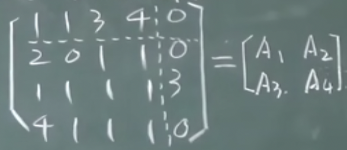
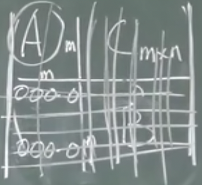
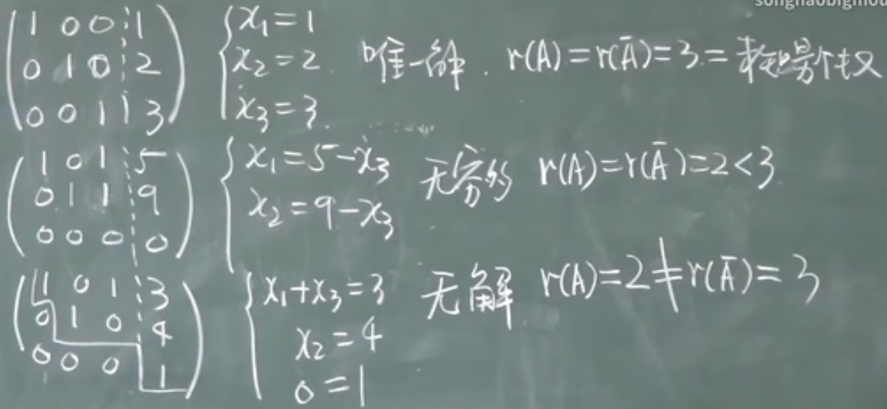
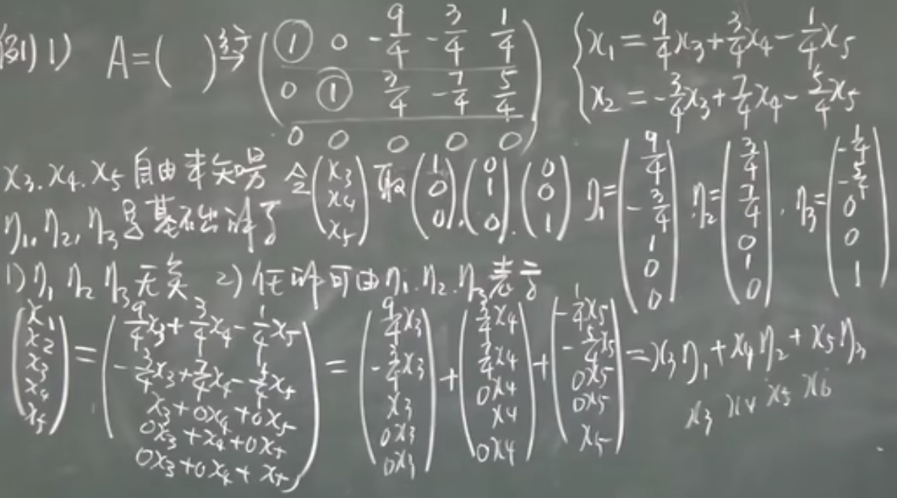
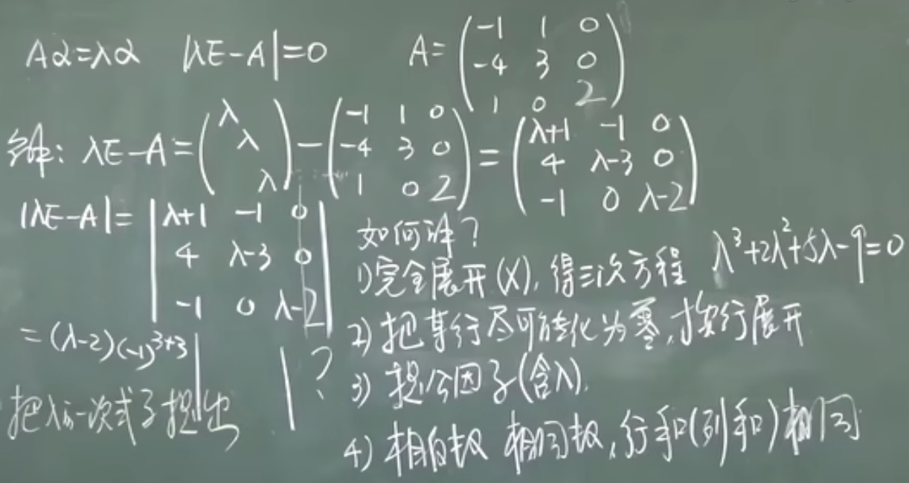
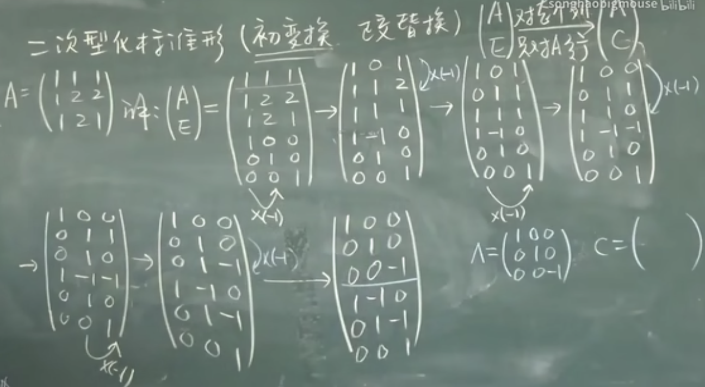

# 线性代数

某人觉得自己线性代数学的不好（去年学的感觉太少了完全不够，重新来一遍！），所以有了这篇笔记

课程： https://www.bilibili.com/video/BV1aW411Q7x1/

## 1.1 二阶三阶行列式

定义二阶行列式（2行2列4个元素）,其中 $a_{ij}$ 中i为行标，j为列标:

$$\begin{vmatrix}a_{11}&a_{12}\cr a_{21}&a_{22}\end{vmatrix}=a_{11}a_{22}-a_{12}-a_{21}$$

从左上角到右下角叫主对角线，从左下角到右上角叫次对角线

三阶行列式：

$$\begin{vmatrix}a&b&c\cr d&e&f\cr g&h&i\end{vmatrix}=aei+fbg+hdc-ceg-bdi-fha$$

排列：由1，2,...,n组成的一个有序数组叫n级排列。排列中间不能缺数，n级排列有 $n(n-1)...3\times 2\times 1=n!$ 种

逆序：大数排在小数的前面。如4213

逆序数：逆序的总数。如4213，计算每个数后面有多少个比它小的数。4后有3个，2后有一个，所以逆序数为3+1=4。记为N(4213)=3+1=4

偶/奇排列：若逆序数是偶/奇数就称为偶/奇排列

n级标准排列（自然排列）：N(1,2,...,n)=0. $N(n(n-1)...321)=n-1+n-2...+2+1=\frac{n(n-1)}{2}$

对换：交换两个数。54123对换1和2就是54213

定理：
1. 排列经过一个对换后奇偶性改变
2. n级排列中，奇排列，偶排列各占 $\frac{n!}{2}$

## 1.1 n阶行列式

n阶行列式计算(3种定义)：
1. 按行展开：行标取标准排列，列标取排列的所有可能，从不同行不同列取出3个元素相乘。符号由列标排列的奇偶性决定（偶为正，奇为负），共有n!项

$$\begin{vmatrix}a_{11}&a_{12}&...&a_{1n}\cr a_{21}&a_{22}&...&a_{2n}\cr ...&...&...&...\cr a_{n1}&a_{n2}&...&a_{nn}\end{vmatrix}=\Sigma_{j_1j_2...j_n}(-1)^{N(j_1j_2...j_n)}a_{1j_1}a_{2j_2}...a_{nj_n}$$

2. 按列展开：列标取标准排列，行标取排列的所有可能，从不同行不同列取出3个元素相乘。符号由行标排列的奇偶性决定。 $\Sigma_{i_1i_2...i_n}(-1)^{N(i_1i_2...i_n)}a_{i_11}a_{i_22}...a_{i_nn}$

3. 既不按行也不按列： $\Sigma(-1)^{N(i_1...i_n)+N(j_1...j_n)}a_{i_1j_1}a_{i_2j_2}...a_{i_nj_n}$

常将行列式记为 $D=|a_{ij}|$ 。特别的， $|a_{11}|=a_{11}$ 。下三角（指一个矩阵对角线及主对角线左下角为任意元素，右上角全为0），上三角（与下三角类似，只不过反过来）和对角形（矩阵只有主对角线有任意元素，其余全为0）行列式等于主对角线元素相乘。

## 1.2 行列式的性质

转置：将矩阵的行和列交换。将转置后的矩阵记为 $D^T(D')$ . $(D^T)^T=D$

$$D=\begin{vmatrix}1&2&3\cr 1&1&1\cr 8&8&8\end{vmatrix},D^T=\begin{vmatrix}1&1&8\cr 2&1&8\cr 3&1&8\end{vmatrix}$$

行列式的性质：
1. $|D^T|=D$ (矩阵转置行列式值不变)。对行成立的性质，对列也成立
2. 矩阵两行互换，行列式值变号
3. 矩阵两行（列）相等，|D|=0
4. 矩阵某一行都乘以k，等于用k乘以|D|. 

$$\begin{vmatrix}1&2&3\cr 4k&5k&6k\cr 7&8&9\end{vmatrix}=k\begin{vmatrix}1&2&3\cr 4&5&6\cr 7&8&9\end{vmatrix}$$

推论：某一行都有公因子k，k可提到外面。行列式所有元素均有公因子k，k往外提n次

5. 矩阵两行成比例，D=0

$$\begin{vmatrix}1&2&3\cr 1&1&1\cr 8&8&8\end{vmatrix}=8\begin{vmatrix}1&2&3\cr 1&1&1\cr 1&1&1\end{vmatrix}$$

推论：某一行全为0，D=0
6. 若矩阵的某一行为两数之和，则其行列式（是和的那一行）可拆为两个行列式之和。但其余保持不变

$$\begin{vmatrix}1&2&3\cr 7+8&2+3&9+10\cr 8&8&9\end{vmatrix}\begin{vmatrix}1&2&3\cr 7&2&9\cr 8&8&9\end{vmatrix}\begin{vmatrix}1&2&3\cr 8&3&10\cr 8&8&9\end{vmatrix}$$

7. 某一行（列）乘以一个数，加到另一行（列）去，D不变

对于某些纯数字的矩阵来说，计算它的行列式可以利用性质7尝试将其化为上三角行列式后直接将其主对角线乘起来。

建议先处理第一列（拿第一行第一个元素消完第一列剩下元素），然后第二列（拿第二行第二个元素消完第二列剩下元素）。这样不会导致做到最后乱套。且第n列处理完后（第n列除前n个元素已全为0），第n行不再参与运算（否则运算后之前消好的0又没了）。

## 1.3 行列式按行展开

余子式：选定矩阵的某个元素，将其所在行和列去掉后，剩余元素组成的矩阵的行列式称为之前选定元素的余子式。

$$\begin{vmatrix}1&1&0&3\cr 1&1&1&1\cr 2&2&3&4\cr 5&5&6&6\end{vmatrix}$$

矩阵中，第三行第二列的元素2的余子式为

$$M_{32}=\begin{vmatrix}1&0&3\cr 1&1&1\cr 5&6&6\end{vmatrix}$$

代数余子式则是在余子式的基础上加个符号。还是拿第三行第二列的元素2举例，它的代数余子式是

$$A_{32}=(-1)^{3+2}\begin{vmatrix}1&0&3\cr 1&1&1\cr 5&6&6\end{vmatrix}$$

定理（按某行（列）展开）： 对于n阶方阵， $D=a_{i1}A_{i1}+a_{i2}A_{i2}+...+a_{in}+A_{in}$ 或 $D=a_{1j}A_{1j}+a_{2j}A_{2j}+...+a_{nj}A_{nj}$

该定理可用于计算高阶行列式时降阶。选择0较多的行（列）展开会更容易计算。

异乘变零定理：某行元素与另一行元素的代数余子式乘积之和=0

k阶子式：在一个矩阵中画k条横线和k条竖线，线的2k处交叉点的数字所组成的行列式被称为k阶子式。如下列矩阵选择一二行和一二列：

$$\begin{vmatrix}1&2&3&4\cr 1&1&2&5\cr 1&1&0&8\cr 9&9&9&10\end{vmatrix}$$

所形成的二阶子式为：

$$\begin{vmatrix}1&2\cr 1&1\end{vmatrix}$$

余子式：还是上面那个矩阵，但是选择没有被线画过的剩余的元素，所组成的行列式为余子式。

$$\begin{vmatrix}0&8\cr 9&10\end{vmatrix}$$

代数余子式：在余子式前加上符号，符号由选取的行数和列数决定。

$$(-1)^{1+2+1+2}\begin{vmatrix}0&8\cr 9&10\end{vmatrix}$$

拉普拉斯展开定理：取定k行，由k行元素所组成的所有k阶子式与代数余子式乘积之和=D

行列式相乘：假设 $D_1$ 和 $D_2$ 是两个n阶行列式，则它们的乘积可以表示成一个n阶行列式（同阶才可用）

$$\begin{vmatrix}1&1&1\cr 2&0&0\cr 0&0&3\end{vmatrix}\times\begin{vmatrix}1&2&3\cr 1&3&2\cr 3&2&1\end{vmatrix}=\begin{vmatrix}5&7&6\cr 2&4&6\cr 9&6&3\end{vmatrix}$$

拿第一个行列式的每一行与第二个行列式的每一列相乘。 $2=2\times 1+0\times 1+0\times 3,4=2\times 2+0\times 3+0\times 2,6=2\times 3+0\times 2+0\times 1$

## 1.4 行列式的计算2

矩阵按照特殊的规则加行加列后(加边法)行列式不变。当矩阵只有箭头处有元素，其余元素为0时，称此矩阵为三叉形行列式。

范德蒙德行列式：形如以下的矩阵有更简便的方式计算行列式

$$\begin{vmatrix}1&1&1&...&1\cr x_1&x_2&x_3&...&x_n\cr ...&...&...&...&...\cr x_1^{n-2}&x_2^{n-2}&...&...&x_n^{n-2}\cr x_1^{n-1}&x_2^{n-1}&...&...&x_n^{n-1}\end{vmatrix}=\Pi _{1\le j<i\le n}(x_i-x_j)$$

反对称行列式：
1. 主对角线全为0
2. 上下位置的元素关于主对角线对应成相反数。 $a_{ij}=-a_{ji}$ .如：

$$\begin{vmatrix}0&1&2&3\cr -1&0&-5&6\cr -2&5&0&-8\cr -3&-6&8&0\end{vmatrix}$$

若是奇数阶反对称行列式，D=0

对称行列式:
1. 主对角线元素无要求
2. 上下对应相等。 $a_{ij}=a_{ji}$ 如：

$$\begin{vmatrix}1&1&-1\cr 1&2&0\cr -1&0&3\end{vmatrix}$$

## 1.5 克莱姆(Cramer)法则

假设有以下方程组：
1. $x_1+x_2+x_3=1$
2. $x_1-x_2+5x_3=6$
3. $-x_1+x_2+6x_3=9$

将其系数拿出来作为系数行列式：

$$D=\begin{vmatrix}1&1&1\cr 1&-1&5\cr -1&1&6\end{vmatrix}$$

额外的，还有以下定义：

$$D_1=\begin{vmatrix}1&1&1\cr 6&-1&5\cr 9&1&6\end{vmatrix}$$

$D_i$ 表示将原本的系数行列式D的第i列换为方程右边的常数项。

克莱姆法则（定理）：
1. 方程个数=未知数个数
2. D不为0
3. $x_j=\frac{D_j}{D}$

当方程组右边的常数项均为0，如：
1. $x_1+x_2+x_3=0$
2. $x_1-x_2+5x_3=0$
3. $-x_1+x_2+6x_3=0$

则这种方程组被称为齐次线性方程组，至少有一个变量全等于0的解（零解）。

定理：若齐次方程组的方程个数=未知数个数且系数行列式D不为0，则方程组只有零解。齐次方程（方程数量=未知数数量）有非零解 $\Leftrightarrow D=0$

## 2.1 矩阵概念

由

$$\begin{pmatrix}a_{11}&a_{12}&...&a_{1n}\cr a_{21}&a_{22}&...&a_{2n}\cr ...&...&...&...\cr a_{m1}&a_{m2}&...&a_{mn}\end{pmatrix}$$

组成的数表称为 $m\times n$ 矩阵。m是行数，n是列数。 $a_{ij}$ 仍然叫做元素。矩阵常用大写字母表示，因此上面的矩阵可表示为 $A_{m\times n}$ 。若：

1. 矩阵中所有元素都是实数，则矩阵是实矩阵
2. 包含复数，则矩阵是复矩阵
3. 元素全是0，则叫做零矩阵
4. 矩阵只有一行，则叫行矩阵
5. 只有一列，则叫列矩阵
6. 行数=列数，则叫做n阶方阵。记做 $A_{n\times n}$ 或 $A_n$
7. 矩阵主对角线上的元素是1，其余为0，则叫单位阵。记做E或I。 $E_n$ 表示主对角线有n个一。注意主对角线和次对角线的概念只在方阵里有
8. 有两个矩阵形状相同: $A_{3\times 5},B_{3\times 5}$ ，则称为同型矩阵。在此基础上，若两个矩阵内元素都相等，则两个矩阵相等，A=B。矩阵相等的前提是同型矩阵
9. 矩阵内所有元素取相反数，则矩阵称为负矩阵。如将矩阵A中所有元素取相反数，则结果为-A。

## 2.2 矩阵运算1

加法（减法同理，只有同型矩阵才能相加减）：两个矩阵对应元素相加（减）

$$\begin{pmatrix}1&1&1\cr 1&1&1\end{pmatrix}+\begin{pmatrix}0&2&3\cr -1&1&1\end{pmatrix}=\begin{pmatrix}1&3&4\cr 0&2&2\end{pmatrix}$$

数乘：一个数乘以矩阵，等于这个数乘上矩阵的所有元素

$$k\begin{pmatrix}1&2&3\cr 4&5&6\cr 7&8&9\end{pmatrix}=\begin{pmatrix}k&2k&3k\cr 4k&5k&6k\cr 7k&8k&9k\end{pmatrix}$$

提公因子：矩阵所有元素均有公因子，公因子可外提一次（上面的过程反过来）

乘法：矩阵相乘前提是第一个矩阵的列数=第二个矩阵的行数。然后拿第一个矩阵的每一行乘上第二个矩阵的每一列，结果放到对应位置上（类似行列式）。注意：
1. 矩阵乘法中 $AB\not ={BA}$ ,且AB有意义时，BA不一定有意义
2. 只在极少数的情况下AB=BA，这时候我们说A，B是可交换的。可交换的矩阵必定是同阶方阵
3. AB我们可以说A左乘B，也可以说B右乘A
4. AB=0无法推出A=0或B=0
5. $AB=AC,A\not ={0}$ 无法推出B=C
6. 零矩阵与任何矩阵相乘都得0，不过要注意能否相乘和结果的形状
7. 任何矩阵与E相乘，等于本身。AE=A

矩阵乘法运算律：
1. 结合：(AB)C=A(BC)
2. 分配：(A+B)C=AC+BC. C(A+B)=CA+CB
3. k(AB)=(kA)B=A(kB)

注意矩阵乘法的左右顺序永远不变。(A+B)C=AC+BC而不是(A+B)C=CA+CB

$$\begin{pmatrix}2&1&0\cr 1&0&1\end{pmatrix}\begin{pmatrix}1&0&1\cr 0&1&1\cr 0&1&1\end{pmatrix}=\begin{pmatrix}2&1&3\cr 1&1&2\end{pmatrix}$$

结果第一行第一列的2=2\*1+1\*0+0\*0,第一行第二列的1=2\*0+1\*1+0\*1...以此类推。结果矩阵的行数=第一个矩阵的行数；结果矩阵的列数=第二个矩阵的列数

一个方便记忆的口诀：中间相等（相乘前提）取两头（结果矩阵的形状）。 $A_{3\times 4}\times B_{4\times 5}=C_{3\times 5}$

线性方程组转矩阵乘法：
1. $x_1=y_1-y_2$
2. $x_2=y_1+y_2$

$$\begin{pmatrix}x_1\cr x_2\end{pmatrix}=\begin{pmatrix}1&-1\cr 1&1\end{pmatrix}\begin{pmatrix}y_1\cr y_2\end{pmatrix}$$

1. $y_1=z_1+z_2+2z_3$
2. $y_2=z_1-2z_2+z_3$

$$\begin{pmatrix}y_1\cr y_2\end{pmatrix}=\begin{pmatrix}1&1&2\cr 1&-2&1\end{pmatrix}\begin{pmatrix}z_1\cr z_2\cr z_3\end{pmatrix}$$

（省略z的方程组）

$$\begin{pmatrix}z_1\cr z_2\cr z_3\end{pmatrix}=\begin{pmatrix}1&1\cr 1&0\cr -1&1\end{pmatrix}\begin{pmatrix}u_1\cr u_2\end{pmatrix}$$

则整体可写为：

$$\begin{pmatrix}x_1\cr x_2\end{pmatrix}=\begin{pmatrix}1&-1\cr 1&1\end{pmatrix}\begin{pmatrix}1&1&2\cr 1&-2&1\end{pmatrix}\begin{pmatrix}1&1\cr 1&0\cr -1&1\end{pmatrix}\begin{pmatrix}u_1\cr u_2\end{pmatrix}$$

## 2.2 矩阵运算2

幂： $A^k=AA...A$ (k个方阵A相乘)。特别的， $A^0=E$ 。有以下性质：
1. $A^{k_1}A^{k_2}=A^{k_1+k_2}$
2. $(A^{k_1})^{k_2}=A^{k_1k_2}$
3. 一般来说， $(AB)^k\not ={A^kB^k}$
4. $(A+B)^2\not ={A^2+2AB+B^2}$ ; $(A-B)^2\not ={A^2-2AB+B^2}$ ; $(A+E)^2=A^2+2AE+E^2$ ; $(A-E)^2=A^2-2AE+E^2$

转置：与行列式转置定义相同，将行和列交换。 $A_{m\times n},(A^T)_{n\times m}$

$$A=\begin{pmatrix}1&2&3\cr 1&1&1\end{pmatrix},A^T(A')=\begin{pmatrix}1&1\cr 2&1\cr 3&1\end{pmatrix}$$

性质：
1. $(A^T)^T=A$
2. $(A+B)^T=A^T+B^T$
3. $(kA)^T=kA^T$
4. $(AB)^T=B^TA^T$

## 2.3 特殊矩阵

1. 数量矩阵：主对角线元素全是a，其余元素全为0. 
    - 矩阵把公因子a提出来后等于aE
    - 0矩阵和单位矩阵都是特殊的数量矩阵
    - 数量矩阵相加减、乘，结果还是数量矩阵
    - (aE)B=B(aE)=aB
2. 对角形矩阵：主对角线上的元素为 $a_1,a_2,...,a_n$ ，其余全是0
    - 数量矩阵是一种特殊的对角形
    - 写为 $diag(a_1,a_2,...,a_n)$
    - 其和，差，积是其主对角线对应元素相加，相减、乘所得到的对角形
3. 上三角形矩阵：矩阵主对角线右上方为任意元素，左下方全为0
4. 下三角形矩阵：矩阵主对角线左下方为任意元素，右上方全为0
    - 与3统称为三角形矩阵
    - 对角形既是上三角也是下三角
    - 数和三角形的乘积、和、差、商均是三角形
5. 对称矩阵：以主对角线为轴，上下元素对应相等。对主对角线上的元素没有要求。 $a_{ij}=a_{ji},A^T=A$ 。当一个矩阵的转置为本身时说明它是一个对称矩阵。
    - 两个同阶对称矩阵的和、差、数乘仍然是对称的，但乘积不一定
    - A，B对称，AB对称 $\Leftrightarrow$ AB可交换
    - $AA^T$ 与 $A^TA$ 都是对称矩阵
6. 反对称矩阵：以主对角线为轴，上下元素对应成相反数且主对角线元素全为0。 $a_{ij}=-a_{ji}$ 。 $A^T=-A$
    - 两个同阶反对称矩阵的和差数乘仍然是反对称矩阵，但两个反对称的乘积一般不是反对称

## 2.4 逆矩阵1

永远不要把矩阵放在分母上。矩阵是一个数表。不过行列式无所谓，行列式是个值。

方阵的行列式(行列式是方阵的一个属性)。有矩阵：

$$\begin{pmatrix}2&2&2\cr 3&3&3\cr 1&1&1\end{pmatrix}$$

其行列式记为：

$$|A|=\begin{vmatrix}2&2&2\cr 3&3&3\cr 1&1&1\end{vmatrix}$$

性质：
1. $|A^T|=|A|$
2. $|kA|=k^n|A|$
3. |AB|=|A|\*|B| ,A,B同阶

伴随矩阵（只有方阵才有伴随矩阵）：
1. 求所有元素的代数余子式
2. 按行求的代数余子式按列放（转置）

如矩阵：

$$\begin{pmatrix}1&1&1\cr 2&1&3\cr 1&1&4\end{pmatrix}$$

求每个元素的代数余子式： 

$A_{11}=1\space A_{12}=-5\space A_{13}=1$  
$A_{21}=-3\space A_{22}=3\space A_{23}=0$  
$A_{31}=2\space A_{32}=-1\space A_{33}=-1$ 

按列放置为矩阵:

$$\begin{pmatrix}1&-3&2\cr -5&3&-1\cr 1&0&-1\end{pmatrix}$$

此矩阵即为伴随矩阵。记为 $A^{\*}$ 。按行求按列放。

定理(对任何方阵都成立)：
1. $AA^{\*}=A^{\*}A=|A|E$
2. $|A^{\*}|=|A|^{n-1}$

## 2.4 逆矩阵2

逆矩阵：A为n阶方阵。若存在同阶方阵B使得AB=BA=E，则B为A的逆矩阵，记做 $A^{-1}=B$ 。性质：
1. 未必所有方阵均可逆
2. 若方阵可逆，则其逆矩阵唯一
3. 可逆矩阵一定是方阵
4. A可逆， $A^{-1}$ 可逆， $(A^{-1})^{-1}=A$
5. 若A，B均可逆，则AB也可逆，且 $(AB)^{-1}=B^{-1}A^{-1}$
6. 若A可逆，则 $A^T$ 可逆，且 $(A^T)^{-1}=(A^{-1})^T$ .若k不为0，则kA也可逆，且 $(kA)^{-1}=\frac{1}{k}A^{-1}$
7. 若A可逆，则 $|A^{-1}|=|A|^{-1}$
8. A可逆，则 $A^{\*}$ 可逆。 $(A^{\*})^{-1}=\frac{1}{|A|}A$

若矩阵A的行列式 $|A|\not ={0}$ ，则称该矩阵非奇异或非退化或满秩，且该矩阵可逆。A可逆的充要条件即为 $|A|\not ={0}$ ，逆矩阵 $A^{-1}=\frac{1}{|A|}A^{\*}$ 。此为求逆矩阵的两种方法之一，伴随矩阵法

推论：A为n阶方阵，B也为n阶方阵。若已知AB=E(或BA=E)，则可判断A可逆， $A^{-1}=B$

除了伴随矩阵法，求逆矩阵还可以用初等变换法。初等变换会在后续的课程中学习。

有关 $A^{\*}$ 的新内容：
1. $A^{\*}=|A|A^{-1}$
2. $(A^{\*})^{\*}=|A|^{n-2}A$
3. $((A^{\*})^{\*})^{\*}=|A|^{n^2-3n+3}A^{-1}$

## 2.5 分块矩阵

将矩阵根据自己的需求灵活分为几块。但要求分块划线横平竖直

对角形分块矩阵；只有主对角线上有块

$$\begin{pmatrix}A_1&&&\cr &A_2&&\cr &&...&\cr &&&A_t\end{pmatrix}$$

分块矩阵的运算：
1. 加法：

$$\begin{pmatrix}A_1&A_2\cr A_3&A_4\end{pmatrix}+\begin{pmatrix}B_1&B_2\cr B_3&B_4\end{pmatrix}=\begin{pmatrix}A_1+B_1&A_2+B_2\cr A_3+B_3&A_4+B_4\end{pmatrix}$$

2. 数乘：

$$k\begin{pmatrix}A_1&A_2\cr A_3&A_4\end{pmatrix}=\begin{pmatrix}kA_1&kA_2\cr kA_3&kA_4\end{pmatrix}$$

3. 乘法(保证分块后 $A_{ik}$ 与 $B_{kj}$ 可乘)：

$$\begin{pmatrix}A_1&A_2\cr A_3&A_4\end{pmatrix}\begin{pmatrix}B_1&B_2\cr B_3&B_4\end{pmatrix}=\begin{pmatrix}A_1B_1+A_2B_3&A_1B_2+A_2B_4\cr A_3B_1+A_4B_3&A_3B_2+A_4B_4\end{pmatrix}$$

计算分块矩阵的行列式。有以下分块矩阵：

$$H=\begin{pmatrix}A&C\cr 0&B\end{pmatrix}$$

A为m阶方阵，B为n阶方阵，均可逆。则求|H|需要借助拉普拉斯定理，取后n行后n列作为子式，然后乘上其代数余子式。|H|=|B||A|

首先拉普拉斯定理可以得出行列式，其次就要明白为什么选后n行后n列。分块后的矩阵C和0矩阵都不是方阵，自然不能从那里选，因此取后n行。取后n列是因为，要是取到前m列的话，交叉处有大部分0，不如取后n列方便。剩下的代数余子式符号为正，省略即可。

其逆矩阵：

$$H^{-1}=\begin{pmatrix}A^{-1}&-A^{-1}CB^{-1}\cr 0&B^{-1}\end{pmatrix}$$

以及任意对角形分块矩阵的逆：

$$\begin{pmatrix}A_1&&&\cr &A_2&&\cr &&...&\cr &&&A_s\end{pmatrix}^{-1}=\begin{pmatrix}A_1^{-1}&&&\cr &A_2^{-1}&&\cr &&...&\cr &&&A_s^{-1}\end{pmatrix}$$

标准形:从左上角开始的一串不间断的1，其余全是0.不一定是方阵

$$D=\begin{pmatrix}1&&&&&\cr &...&&&&\cr &&1&&&\cr &&&0&&\cr &&&&...&\cr &&&&&0\end{pmatrix}_{m\times n}=\begin{pmatrix}E_r&0_{r(n-r)}\cr 0_{(m-r)r}&0_{(m-r)(n-r)}\end{pmatrix}$$ 

(等于分块后 $2\times 2$ 矩阵)

分块矩阵的转置：
1. 把子块视作元素求转置
2. 对每个子块分别求转置

$$A=\begin{pmatrix}A_1&A_2&A_3\cr A_4&A_5&A_6\end{pmatrix},A^T=\begin{pmatrix}A_1^T&A_2^T\cr A_3^T&A_4^T\cr A_5^T&A_6^T\end{pmatrix}$$

以下矩阵是标准形：

$$\begin{pmatrix}1&&\cr &1&\cr &&0\end{pmatrix},\begin{pmatrix}1&0&0&0\cr 0&1&0&0\cr 0&0&1&0\end{pmatrix},\begin{pmatrix}1&&&\cr &1&&\cr &&1&\cr &&&1\end{pmatrix},\begin{pmatrix}0&&\cr &0&\cr &&0\end{pmatrix}$$

以下矩阵不是标准形：

$$\begin{pmatrix}0&&\cr &1&\cr &&1\end{pmatrix},\begin{pmatrix}1&&&\cr &1&&\cr &&0&\cr &&&1\end{pmatrix}$$

## 2.6 初等变换1

初等变换分为初等行变换和初等列变换。初等行/列变换又分为三种（初等变换与行列式的变换没有任何关系，但是当变换的矩阵A为方阵时又有点关系）：
1. 交换矩阵的两行（列）。 $A\rightarrow B,|A|=-|B|$
2. 用非零数k乘某一行（列）. $A\rightarrow B,k|A|=-|B|$
3. 某一行（列）的l倍加到另一行（列）上去. $A\rightarrow B,|A|=|B|$

初等变换的本质是对矩阵的变化。任何矩阵都可通过初等变换化为标准形。若A经初等变换得到B，则称两个矩阵是等价的。记做 $A\cong B$ 。等价的性质：
1. 反身性。 $A\cong A$
2. 对称性。 $A\cong B\rightarrow B\cong A$
3. 传递性。 $A\cong B,B\cong C\Rightarrow A\cong C$

任意矩阵A都等价于标准形。假设有一个4乘4的矩阵，其标准形有5种。全是0，一个1，两个1...说明任意4阶方阵都属于这5种之一。后面会学到1的数量其实就是矩阵的秩。假如只有一个1的话，说明后3行都可以用第一行来表示，多行之间线性相关。

## 初等变换2

初等方阵：对E做一次初等变换得到的矩阵。
1. 若将E交换i，j两行，则形成的初等方阵记为E(i,j)。|E(i,j)|=-1
2. 若用非零数k乘上i行，则记为E(i(k)).|E(i(k))|=k
3. 若某行l倍加到另一行，则记为E(i,j(k)),表示第j行的k倍加到第i行上去.|E(i,j(k))|=1

初等方阵均可逆。 $E^{-1}(i,j)=E(i,j),E^{-1}(i(k))=E(i(\frac{1}{k})),E^{-1}(i,j(l))=E(i,j(-l))$ 。其逆、转置矩阵也是初等方阵。

定理：设A是任意一个矩阵，用第i种初等方阵左乘A，相当于对A实施第i种初等行变换。若用第i种初等方阵右乘A，相当于对A实施第i种初等列变换

不难看出乘上初等方阵其实就是对A实施了初等方阵对应的初等变换。为啥不直接做初等变换？因为做变换后，比如A变换成B，数学上不能用等于号连接，而是A->B。不是很方便。要是用初等方阵的话，直接写EA=B，这回就能用等于号了。

任给矩阵A，都存在初等矩阵 $P_1,P_2,...,P_s$ , $Q_1,Q_2,...,Q_t$ 使 $P_s...P_1AQ_1...Q_t$ 为标准形。或者说，任意矩阵A都可通过初等变换化为标准形

A，B等价 $\Leftrightarrow$ 存在可逆P，Q使得PAQ=B

A可逆 $\Leftrightarrow$ A的标准形为E

A可逆 $\Leftrightarrow A=P_1...P_s$ （A可表示为一些初等矩阵的乘积） 

## 2.6 初等变换3

用初等变换求逆矩阵。基于以下两条等式：
- $Q_1Q_2...Q_tA=E$
- $Q_1Q_2...Q_tE=A^{-1}$

可知当我们使用初等变换将A化成E时，同样的变换放到E上就能将其化成 $A^{-1}$ 。这就是初行变换法，只做行变换。

## 2.7 矩阵的秩1

k阶子式：矩阵任取k行k列， $k^2$ 个交点处的数构成k阶矩阵。其行列式的值就为k阶子式

矩阵的秩：矩阵内非零子式的最高阶数

秩代表了矩阵的“结构”的复杂度。如矩阵：

$$\begin{pmatrix}1&1&1\cr 2&2&2\cr 3&3&3\end{pmatrix}$$

发现第二和第三行都可以用第一行的倍数来表示，第二和第三行其实是多余的，没有提供额外的信息。所以此矩阵的秩是1.而矩阵：

$$\begin{pmatrix}1&1&1\cr 3&7&4\cr 6&1&3\end{pmatrix}$$

就和上面的不一样了，它每行之间没有任何关系。所以其秩为3.

## 2.7 矩阵的秩2

矩阵的秩记为r(A).规定:
1. r(0)=0
2. 若有矩阵 $A_{m\times n}$ ,则 $0\leq r(A)\leq min(m,n)$ .若r(A)=m,说明它取了所有的行，称为行满秩。若r(A)=n,说明它取了所有的列，称为列满秩。行满秩列满秩统称为满秩。或者说，r(A)=min(m,n)称为满秩。如果r(A) < min(m,n)，称为降秩。若A为方阵，A满秩 $\leftrightarrow$ A可逆

定理：r(A)=r $\Leftrightarrow$ 有一个r阶子式不为0且所有r+1阶子式为0。

阶梯形矩阵：
1. 若矩阵有零行，零行应在非零的下边
2. 自上而下，从左起的第一个非零元（首非零元）的左边的零的个数随行数增加而严格增加。

行简化阶梯形。首先它是个阶梯形，其次满足：
1. 非零行的首非零元是1
2. 首非零元所在的列的其余元素是0

阶梯形矩阵的秩等于非零行的行数。初等变换不改变矩阵的秩。一般求矩阵的秩就用初等变换将其化为阶梯形后再数非零行的个数。

秩的性质：
1. $r(A)=r(A^T)$
2. 任意矩阵乘以可逆矩阵，秩不变.假设有矩阵 $A_{m\times n}$ ,P为m阶可逆方阵，Q为n阶可逆方阵。则r(A)=r(PA)=r(AQ)=r(PAQ)

## 3.1 n维向量及其运算

由n个数 $a_1,...,a_n$ 组成的有序数组 $(a_1,a_2,...,a_n)$ 称为向量。这n个数称为n个分量。有n个分量说明向量的维数是n。可以写作行，称为行向量；也可以写作列，称为列向量。

其他：
1. 分量全是0的向量叫做零向量。
2. 某个向量的所有分量取负数，称为负向量
3. 设m，n均为向量。若对应向量相等，叫做两个向量相等。前提是它们是同维向量
4. 两个向量是同维的才能相加。对应分量相加
5. 向量的乘法（数乘）：k分别乘上每个分量
6. 向量的减法：对应分量相减
7. $k\alpha=0\Leftrightarrow k=0\space or\space \alpha=0$

## 3.2 向量间的线性关系1

线性组合： $\beta,\alpha_1,\alpha_2,...,\alpha_n$ 都是m维向量。若存在 $k_1,k_2,...,k_n$ 使 $\beta=k_1\alpha_1+k_2\alpha_2+...+k_n\alpha_n$ ，就叫 $\beta$ 是 $\alpha$ 向量组的线性组合，或者说 $\beta$ 可以由 $\alpha$ 向量组线性表示。 $k_1,k_2,...k_n$ 叫组合系数

性质：
1. 零向量可由任意向量组表示
2. 向量组中任一向量可由向量组表示
3. 任意向量都可由 $\epsilon_1=(1,0,...,0),\epsilon_2=(0,1,...,0),...,\epsilon_n=(0,0,...,1)$ 向量组线性表示。该向量组称为n维单位向量组或者n维基本单位向量组

有些题会给出1个向量组，问其能否组成另外一个n维向量。这种题一般就是组方程组看能不能解出组合系数。不管给的向量是行还是列， $\alpha_1,...,\alpha_n$ 均按列构成方程组的系数。 $\beta$ 也是按列构成右边的常数项

向量组等价：两个同维向量组可以相互线性表示（一个向量组里的任意向量都可以由另一个向量组表示，反之亦然）。记做{ $\alpha_1,...,\alpha_m$ } $\cong$ { $\beta_1,...,\beta_n$ }.性质：
1. 反身性：{ $\alpha_1,...,\alpha_m$ } $\cong$ { $\alpha_1,...,\alpha_m$ }
2. 对称性：{ $\alpha_1,...,\alpha_m$ } $\cong$ { $\beta_1,...,\beta_n$ },{ $\beta_1,...,\beta_n$ } $\cong$ { $\alpha_1,...,\alpha_m$ }
3. 传递性：{ $\alpha_1,...,\alpha_m$ } $\cong$ { $\beta_1,...,\beta_n$ }, { $\beta_1,...,\beta_n$ } $\cong$ { $\gamma_1,...,\gamma_s$ }。则 { $\alpha_1,...,\alpha_m$ } $\cong$ { $\gamma_1,...,\gamma_s$ }

## 3.2 向量间的线性关系2

$\alpha_1,...,\alpha_n$ 是n个m维向量。若存在一组不全为0的 $k_1,...,k_n$ 使得 $k_1\alpha_1+k_2\alpha_2+...+k_n\alpha_n=0$ ,就称 $\alpha_1,...,\alpha_n$ 线性相关。线性无关定义类似，把肯定词换成否定词。一些结论：
1. 向量组中两向量成比例，则该向量组线性相关
2. 含零向量的任意向量组必线性相关
3. 一个零向量必相关
4. 一个非零向量必线性无关
5. 一个向量 $\alpha$ 相关 $\Leftrightarrow\alpha=0$
6. $\alpha_1,...,\alpha_r$ 相关，则 $\alpha_1,...,\alpha_r,\alpha_{r+1}...\alpha_s$ 相关。部分组相关 $\rightarrow$ 整体组相关。整体组无关 $\rightarrow$ 部分组无关
7. 线性无关的向量组，其接长向量组也线性无关。接长向量组指把每个向量的维数增加（添加新的分量）。线性相关的向量组，其截短向量也相关。截短向量组指把每个向量的维数减少（划掉已有分量）
8. n个n维向量所构成的行列式D不等于0 $\Leftrightarrow$ 向量组线性无关. $D=0\Leftrightarrow$ 向量组线性相关
9. n维单位向量组线性无关

注意区分线性组合和线性相关。两种都可以用列方程组的方法来验证，但是线性组合 $\leftrightarrow$ 方程有解，不是线性组合 $\leftrightarrow$ 方程无解。而线性相关 $\leftrightarrow$ 方程组有非零解，线性无关 $\leftrightarrow$ 方程组只有零解

## 3.2 线性相关线性无关

定理：
1. $\alpha_1,...,\alpha_s$ 线性相关 $\Leftrightarrow$ 至少一个向量可由其余向量表示
2. $\alpha_1,...,\alpha_s$ 线性无关， $\alpha_1,...,\alpha_s,\beta$ 线性相关.则 $\beta$ 可由 $\alpha_1,...,\alpha_s$ 唯一表示
3. 替换定理： $\alpha_1,...,\alpha_s$ 线性无关，可由 $\beta_1,...,\beta_t$ 线性表示。则s小于等于t，并且可以适当排列向量的次序使得这个向量组与 $\beta$ 向量组是等价的。当 $\alpha_1,...,\alpha_s$ 可由 $\beta_1,...,\beta_t$ 线性表示且s大于t时， $\alpha_1,...,\alpha_s$ 线性相关。推论：
    - m大于n，m个n维向量一定线性相关。n+1个n维向量一定线性相关
    - 若存在两个等价（两个可以相互线性表示的线性无关组）的线性无关向量组，则两者所含的向量个数相同

## 3.3 向量组的秩1

极大线性无关组：从 $\alpha_1...\alpha_s$ 向量组取出部分 $\alpha_1...\alpha_r$ ， 若：
1. $\alpha_1...\alpha_r$ 线性无关
2. 每个向量均可由 $\alpha_1...\alpha_r$ 线性表示

则 $\alpha_1...\alpha_r$ 称为原来向量组的极大线性无关组，简称极大无关组。极大无关组中向量个数就是原向量组能找到的无关向量的最大个数，该向量组是所有线性无关组所含向量个数最多的一个。极大线性无关组不是唯一的。注：
1. 全是0的向量组没有极大线性无关组
2. 一个线性无关的向量组，它的极大线性无关组就是它本身
3. 任何一个向量组和其极大无关组等价
4. 一个向量组的任意两个极大无关组，所含向量个数相同

向量组中的子向量组是极大线性无关组的充要条件：
1. $\alpha_1...\alpha_r$ 线性无关
2. 任r+1个向量都是相关的

向量组的秩：其极大无关组含向量的个数。记做 $r(\alpha_1,\alpha_2,...,\alpha_s)$ 。注：
1. 规定若全是0向量，它的秩就是0
2. $0\leq r(\alpha_1...\alpha_s)\leq$ min(向量的个数,向量的维数)
3. $\alpha_1...\alpha_s$ 无关 $\Leftrightarrow r=s$
4. $\alpha_1...\alpha_s$ 相关 $\Leftrightarrow$ r < s

定理： $\alpha_1...\alpha_s$ 可由 $\beta_1...\beta_t$ 表示。 $r(\alpha_1...\alpha_s)\leq r(\beta_1...\beta_t)$ 。特别的，若两个向量组等价，那么它们的秩相等。但有相同的秩不一定等价。

## 3.3 向量组的秩2

有一个矩阵。其行所组成的向量叫行向量。行向量组的秩叫行秩。类似的，其列所组成的向量叫列向量。列向量组的秩叫列秩。有：
1. 矩阵行秩=列秩=r(A)
2. $r(AB)\leq min$ {r(A),r(B)}

定理：对矩阵A仅做初等行变换，化成矩阵B，那么A的列向量组与B的列向量组有完全相同的线性关系。或者说，初等行变换不改变矩阵列向量的线性关系

例题：求 $\alpha_1,\alpha_2,\alpha_3,\alpha_4$ 四个向量的一个极大无关组，并把其余的向量用极大无关组线性表示。解题步骤：
1. 无论向量是行向量还是列向量，均按列构成矩阵
2. 只用初等行变换将矩阵化成行简化阶梯形
3. 首非零元所在的列（对应到原来的向量）构成极大线性无关组
4. 其余向量表示系数直接写出。矩阵除去首非零元所在的列（极大线性无关组），若还有其他的列，则排除零元素后拿列剩下的元素即为系数。如有 $\alpha_1,\alpha_2,\alpha_3,\alpha_4$ 4个向量，按列构成矩阵：

$$\begin{pmatrix}1&2&-2&3\cr -2&-4&4&-6\cr 2&8&-2&0\cr -1&0&3&-6\end{pmatrix}$$

其行简化阶梯形：

$$\begin{pmatrix}1&0&-3&6\cr 0&1&\frac{1}{2}&-\frac{3}{2}\cr 0&0&0&0\cr 0&0&0&0\end{pmatrix}$$

则 $\alpha_1,\alpha_2$ 构成极大线性无关组， $\alpha_3=-3\alpha_1+\frac{1}{2}\alpha_2,\alpha4=6\alpha_1-\frac{3}{2}\alpha_2$

再来个例子。若行简化阶梯形为：

$$\begin{pmatrix}1&0&0&0&1\cr 0&1&3&0&1\cr 0&0&0&1&2\cr 0&0&0&0&0\end{pmatrix}$$

则 $\alpha_1,\alpha_2,\alpha_4$ 是极大线性无关组。 $\alpha_3=0\alpha_1+3\alpha_2+0\alpha_4,\alpha_5=\alpha_1+\alpha_2+2\alpha_4$ （忽略全为0的行）

## 4.2 线性方程组有解判定

系数矩阵：方程组中每个方程的系数所组成的行向量组所组成的矩阵

增广系数矩阵：在系数矩阵的基础上在右边添加一个列向量，用虚线分割。记做 $\overline{A}$ 。此矩阵的列数=未知数的个数

如何利用增广系数矩阵判断方程组是否有解：

矩阵解方程步骤：
1. 写出增广系数矩阵
2. 只使用行变换化为阶梯形
3. 看r(A)是否等于 $r(\overline{A})$ 。判断是有唯一解，无穷多解还是无解
4. 只使用行变换化为行简化阶梯形，忽略零行。非零行的首非零元放在方程左边，其余变量挪到右边，得到一般解。构成的方程组称为同解方程组，首非零行所处的列所代表的未知量为约束未知量，其余为自由未知量

## 4.3 齐次方程组的解

齐次方程组解的情况：
1. 有唯一的零解 $\Leftrightarrow$ r(A)=n
2. 有非零解 $\Leftrightarrow$ r(A) < n.一旦找到一个非零解说明有无穷多个解
3. 方程个数小于未知数个数，则方程有非零解
4. 方程个数=未知数个数。其有非零解 $\Leftrightarrow |A|=0$ .只有零解 $\Leftrightarrow |A|\not ={0}$

## 4.4 方程组解的结构1

对于齐次线性方程组Ax=0：
1. 若 $\eta_1$ 和 $\eta_2$ 均为方程的解，则 $\eta_1+\eta_2$ 也是解
2. 若 $\eta$ 是解，则 $c\eta$ 也是解

基础解系：若有一组解 $\eta_1...\eta_s$ 线性无关且任何解都可由 $\eta_1...\eta_s$ 线性表示，则这组解被称为基础解系（齐次线性方程解集的极大线性无关组）

如何找齐次方程组的基础解系：

找到自由未知量后，取线性无关的解再计算即可。例子中取了：

$$\begin{pmatrix}1\cr 0\cr 0\end{pmatrix},\begin{pmatrix}0\cr 1\cr 0\end{pmatrix},\begin{pmatrix}0\cr 0\cr 1\end{pmatrix}$$

不过任何线性无关的向量组都可以，取这个只是因为它最简单。基础解系里解的个数是n(未知数个数)-r(A)，组成的方程不在左边的均为自由未知量

若有两个矩阵 $A_{m\times n},B_{n\times s}$ 且 $AB=0_{m\times s}$ 。则 $r(A)+r(B)\leq n$

## 4.4 方程组解的结构2

有一个非齐次线性方程组Ax=b。若将其结果为变为0，得到Ax=0，则该齐次方程组叫非齐次线性方程组的导出组。性质：
1. $\alpha_1,\alpha_2$ 是Ax=b的解，则 $\alpha_1-\alpha_2$ 是Ax=0的解(非齐次线性方程组的两个解相减是其导出组解)
2. $\alpha_0$ 是Ax=b的解。 $\eta$ 是Ax=0的解。则 $\alpha_0+\eta$ 是Ax=b的解

若 $\alpha_0$ 是Ax=b的一个解（特解）， $\eta$ 是Ax=0的通解（能用基础解系表示出来的解）。 $\eta=C_1\eta_1+C_2\eta_2+...+C_{n-r}\eta_{n-r}$ ,其中 $\eta_1,\eta_2$ 是Ax=0的基础解系。则 $\alpha_0+C_1\eta_1+C_2\eta_2+...+C_{n-r}\eta_{n-r}$ 是Ax=b全部的解（通解）。或者说，Ax=b的一个特解+Ax=0的基础解系的线性组合是Ax=b的通解

如果已经得到了Ax=b中A的增广矩阵 $\overline{A}$ 矩阵的行简化阶梯形，那么Ax=0的行简化阶梯形就不用另外算了，结果等于 $\overline{A}$ 的行简化阶梯形但去掉最右边的常数项。因此假如得到Ax=b的解 $x_1=1-2x_3-3x_4,x_2=5+6x_3+7x_4$ ,直接去掉常数项就是Ax=0的解。 $x_1=-2x_3-3x_4,x_2=6x_3+7x_4$

## 5.1 矩阵的特征值与特征向量1

只有方阵才有特征值和特征向量。

有n阶方阵A。对于一个数 $\lambda$ （可为0），若存在一个非零列向量 $\alpha$ 使 $A\alpha=\lambda\alpha$ ,那么 $\lambda$ 就叫特征值， $\alpha$ 叫对应于 $\lambda$ 的特征向量。

先看怎么求特征值。根据定义，有 $\lambda\alpha-A\alpha=0$ 。提出 $\alpha$ 并补上E得到 $(\lambda E-A)\alpha=0$ 。要求解 $(\lambda E-A)x=0$ ，有非零解的充分必要条件为 $|\lambda E-A|=0$

$\lambda E-A$ 称为特征矩阵； $|\lambda E-A|$ 叫特征多项式（注意这是个行列式）； $|\lambda E-A|=0$ 叫特征方程。该方程的根即为特征值，或叫特征根。有：
1. $\lambda$ 是A的特征值， $\alpha$ 是 $\lambda$ 对应的特征向量。若c不为0，则 $c\alpha$ 也是 $\lambda$ 对应的特征向量。对应 $\lambda$ 的特征向量不是唯一的，但一个特征向量 $\alpha$ 只能对应一个特征值
2. 若 $\alpha_1,\alpha_2$ 都是 $\lambda$ 的特征向量，则 $c_1\alpha_1+c_2\alpha_2$ 也是 $\lambda$ 的特征向量

## 5.1 矩阵的特征值与特征向量2

如何计算 $|\lambda E-A|=0$ 的 $\lambda$

$\lambda E-A$ 可能容易出错，用 $A-\lambda E$ 也是一样的。n阶对角型矩阵的特征值是主对角线上的元素

## 5.1 特征值和特征向量的性质

特征值和特征向量的基本性质：
1. A和 $A^T$ 有相同的特征值。但特征向量不一定相同
2. 对于一个矩阵A，若：
- $\Sigma|a_{ij}|$ < 1,i=1,...,n（矩阵A的每行元素绝对值之和小于1）
- $\Sigma|a_{ij}|$ < 1,j=1,...,n（矩阵A的每列元素绝对值之和小于1

则所有特征值的模(用模是因为特征值可能是复数)均小于1. $|\lambda_k|$ < 1
3. 已知矩阵A的n个特征值为 $\lambda_1,\lambda_2,...,\lambda_n$ .则：
- $\Sigma_{i=1}^{n}\lambda_i=\Sigma_{i=1}^{n}a_{ii}$ (所有的特征值之和等于矩阵A的主对角线元素之和). $\Sigma_{i=1}^{n}a_{ii}$ 也被称为矩阵A的迹，记做tr(A)
- $\lambda_1\lambda_2...\lambda_n=|A|$ (所有的特征值相乘等于A的行列式)

证明3需要用到的引理:
- 有方程 $x^3+bx^2+cx+d$ 。若已知根为1，2，3，则方程可写为(x-1)(x-2)(x-3)=0
- 方程 $(x+c_1)(x+c_2)(x+c_3)...(x+c_n)$ 展开等于 $x^n+(c_1+c_2+...+c_n)x^{n-1}+...+c_1c_2...c_n$ 。若x取0，则除常数项外的内容全都为0。因此若想知道常数项，x取0则可。

根据3可得，A可逆的充要条件是其所有特征根都不为0

4. 有n阶方阵A互不相同的特征值 $\lambda_1,\lambda_2...\lambda_m$ 对应的特征向量 $\alpha_1,\alpha_2...\alpha_m$ 线性无关
5. 设 $\lambda_1,\lambda_2...\lambda_s$ 是矩阵A的s个互异（每个数不一样）特征值。假设 $\alpha_{i1},\alpha_{i2},...,\alpha_{ir}$ 是对应于 $\lambda_i$ 的线性无关的特征向量，则所有特征向量均线性无关（这里视频里没有明确给出定理，不好写。不过大概意思是，假设 $\lambda_1$ 对应了r个线性无关特征向量， $\lambda_2$ 对应了m个线性无关特征向量， $\lambda_3$ 对应了n个线性无关特征向量， $\lambda_s$ 对应了j个线性无关特征向量……那么这些特征值对应的所有特征向量放在一起也是线性无关的）
6. $\lambda$ 是A的特征多项式的k重特征根，则A对应的线性无关的特征向量最多是k个。特别的,若 $\lambda$ 是A的单根，那么 $\lambda$ 对应的线性无关的特征向量仅有一个。（k重特征根对应的线性无关的特征向量的个数小于等于K。k重指的是有k个特征根相等，如 $\lambda_1=\lambda_2=\lambda_3$ 就叫三重特征根）。n阶矩阵A所有线性无关的特征向量的个数最多为n个

其它性质（前提 $\lambda$ 是A的特征值）：
1. $k\lambda$ 是kA的特征值
2. $\lambda^k$ 是 $A^k$ 的特征值.当A可逆时, $\frac{1}{\lambda}$ 是 $A^{-1}$ 的特征值，即k为负的情况
3. $\lambda$ 是A的特征值，f(x)是A的表达式.那么 $f(\lambda)$ 是f(A)的特征值。比如2是A的特征值，则 $A^5+6A^2+A+3E$ (有关A的多项式)的特征值就是把A换成特征值2组成的多项式的值（单位阵E换成1）
4. $\frac{1}{\lambda}|A|$ 是 $A^{\*}$ 的特征值. $\frac{1}{\lambda}|A|^{n-2}$ 是 $(A^{\*})^{\*}$ 的特征值
5. A是四阶方阵满足|3E+A|=0，则A的一个特征值是-3。这里重点在于可以直接套 $|\lambda E-A|=0$ 得到一个特征根。把3E+A提出个-1变成-3E-A即可。同理，E+2A可以提出个-2。甚至于，若|A|=0，还能提出-1然后凑0E-A，则一个特征根就是0.

## 5.2 相似矩阵的矩阵可对角化的条件

相似：有A，B两个n阶方阵。若存在n阶可逆方阵P使得 $P^{-1}AP=B$ ，则说A相似B，记做A∽B。性质：
1. 反身性：A∽A
2. 对称性：A∽B $\rightarrow$ B∽A
3. 传递性：A∽B，B∽C $\Rightarrow$ A∽C
4. 若A∽B，则A，B有相同的特征值。且|A|=|B|,tr(A)=tr(B),r(A)=r(B).注意其逆命题不成立，有相同的特征值不一定相似
5. A∽B，则A可逆 $\Leftrightarrow$ B可逆。若A，B都可逆，则 $A^{-1}∽B^{-1}$
6. A∽B,则 $A^m∽B^m$

A相似于对角形 $\Leftrightarrow$ A有n个线性无关的特征向量

如果A有n个互异的特征根（即全是单根），那么A一定相似于对角形（此为充分条件）。A相似于对角形 $\Leftrightarrow r_i$ 重特征根的基础解系有 $r_i$ 个。阶数减去r重根的个数等于对应重根矩阵的秩，那么就能对角化（有n个线性无关的特征向量）

## 5.3 实对称矩阵的对角化1

对角化：有方阵A，若能找到方阵P使得 $P^{-1}AP$ 等于一个对角形，则称能把A对角化。

内积：有两个向量，将两个向量的所有分量对应相乘再相加，得到的数就叫这两个向量的内积。记做 $(\alpha,\beta)=$ 。例：

$$\alpha=\begin{pmatrix}1\cr 2\cr 3\end{pmatrix},\beta=\begin{pmatrix}0\cr 0\cr 8\end{pmatrix}.(\alpha,\beta)=1\times 0+2\times 0+3\times 8=24$$

当两个向量都是列向量时，常写成 $\alpha^T\beta$ ;当两个向量都是行向量时，常写成 $\alpha\beta^T$ 。这样展开就是一个行向量乘上一个列向量。性质：
1. $(\alpha,\alpha)\geq 0$ . $(\alpha,\alpha)=0\Leftrightarrow \alpha=0$
2. 对称性： $(\alpha,\beta)=(\beta,\alpha)$
3. $(k\alpha,\beta)=k(\alpha,\beta),(\alpha,k\beta)=k(\alpha,\beta),(k\alpha,k\beta)=k^2(\alpha,\beta)$
4. $(\alpha+\beta,\gamma)=(\alpha,\gamma)+(\beta,\gamma),(\alpha,\beta+\gamma)=(\alpha,\beta)+(\alpha,\gamma),(k_1\alpha+k_2\beta,\gamma)=k_1(\alpha,\gamma)+k_2(\beta,\gamma),(\alpha,k_1\beta+k_2\gamma)=k_1(\alpha,\beta)+k_2(\alpha,\gamma),(k_1\alpha_1+k_2\alpha_2,m_1\beta_1+m_2\beta_2)=k_1m_1(\alpha_1,\beta_1)+k_1m_2(\alpha_1,\beta_2)+k_2m_1(\alpha_2,\beta_1)+k_2m_2(\alpha_2,\beta_2)$

向量的长度（范数，模）： $\alpha$ 的长度记做 $||\alpha||=\sqrt{(\alpha,\alpha)}$ .易得 $(\alpha,\alpha)=||\alpha||^2$ .

长度代表点到原点的距离。若 $||\alpha||=1$ ，则这种向量称为单位向量。若一个向量不是单位向量，我们可以将其单位化（标准化），让它的长度变为1. $\frac{1}{||\alpha||}\alpha$

## 5.3 实对称矩阵的对角化2

性质：
1. $||\alpha||\geq 0.||\alpha||=0\Leftrightarrow \alpha=0$
2. $||k\alpha||=|k|\*||\alpha||$
3. 柯西-施瓦茨不等式: $|(\alpha,\beta)|\leq ||\alpha||\*||\beta||$
4. 三角不等式： $||\alpha+\beta||\leq ||\alpha||+||\beta||$

正交（垂直）： $(\alpha,\beta)=0$ ,记做 $\alpha\perp\beta$ .显然零向量和任何向量都正交。 $(\alpha,\alpha)=0\Leftrightarrow \alpha=0$

正交向量组：不含零向量的向量组 $\alpha_1...\alpha_s$ 两两正交

标准正交向量组：向量组中每个向量的长度都是1，满足：
- $(\alpha_i,\alpha_i)=1$
- $(\alpha_i,\alpha_j)=0$

如果 $\alpha_1...\alpha_s$ 是正交向量组，那么 $\alpha_1...\alpha_s$ 一定是线性无关的。逆命题不成立。

施密特正交化：给一组线性无关的 $\alpha_1...\alpha_s$ ，求一组正交的 $\beta_1...\beta_s$ 使得这组向量和原来的向量组等价。拿 $\alpha_1,\alpha_2,\alpha_3,\alpha_4$ 举例，找到 $\beta_1,\beta_2,\beta_3,\beta_4$ 的公式如下：

$\beta_1=\alpha_1$  
$\beta_2=\alpha_2-\frac{(\alpha_2,\beta_1)}{(\beta_1,\beta_1)}\beta_1$ 
$\beta_3=\alpha_3-\frac{(\alpha_3,\beta_1)}{(\beta_1,\beta_1)}\beta_1-\frac{(\alpha_3,\beta_2)}{(\beta_2,\beta_2)}\beta_2$ 
$\beta_4=\alpha_4-\frac{(\alpha_4,\beta_1)}{(\beta_1,\beta_1)}\beta_1-\frac{(\alpha_4,\beta_2)}{(\beta_2,\beta_2)}\beta_2-\frac{(\alpha_4,\beta_3)}{(\beta_3,\beta_3)}\beta_3$

得到 $\beta_1,\beta_2,\beta_3,\beta_4$ 后再单位化即可

## 5.3 实对称矩阵的对角化3

正交矩阵：A为n阶方阵，若 $A^TA^=E$ ，则该矩阵称为正交矩阵.若A为正交矩阵，性质：
1. |A|=1或-1
2. $A^{-1}=A^T$ 且 $A^{-1}$ 和 $A^T$ 均为正交矩阵
3. A，B均正交，则AB也正交
4. $\alpha,\beta$ 是A的列向量。 $(A\alpha,A\beta)=(\alpha,\beta)$

A正交 $\Leftrightarrow$ A的列（行）向量组是标准正交向量组

n阶实对称矩阵（元素全为实数的对称矩阵）的n个特征值都是实数，对应的特征向量都是实向量

实对称矩阵A的不同特征值所对应的特征向量一定正交

正交相似：A和B均为同阶方阵，若存在正交矩阵P使得 $P^{-1}AP=B$ ，就叫A和B正交相似

若A为实对称矩阵，一定存在正交矩阵Q，使得 $Q^{-1}AQ$ 等于对角型。其中对角形矩阵的对角线上为矩阵A的特征值。说明n阶实对称矩阵A一定有n个线性无关的特征向量

n阶实对称矩阵A的每个特征值 $\lambda_i$ 的重数 $k_i$ 等于对应的 $\lambda_i$ 的线性无关特征向量的个数

给定实对称矩阵A，找正交矩阵Q使得 $Q^{-1}AQ$ 等于对角型的步骤：
1. 求特征值
2. 求特征向量
3. 特征向量正交化并单位化
4. 做成列，构成Q。特征值按列构成顺序组成Q

其中第三步注意：
1. 若实对称矩阵的三个特征根都是单根，其对应的特征向量已经正交了，只需单位化即可。
2. 若一个单根，一个二重根，正交化时只需对重根对应的特征向量进行正交化，单根对应的无需参与正交化
3. 要是三重根，3个特征向量均需参与正交化

## 6.1 二次型定义

二次型：多项式的每一项均为二次。如 $x^2+xy+y^2$ , $x_1^2+2x_1x_2+x_2^2+x_3^2-x_1x_3$ 。是平方的项就叫平方项，比如 $x_2^2,x_3^2$ 。由两个变量相乘得到二次的项叫做交叉项，如 $x_1x_3$ .由n个变量组成的二次型 $f(x_1,x_2,...,x_n)$ 叫做n元二次型

如何将二次型写为矩阵表达式：
1. 平方项的系数做成主对角线上的元素
2. 交叉项的系数除以2，放到两个对称的相应位置上

比如有 $x_1^2+2x_1x_2+x_2^2-x_2x_3+2x_3^2-2x_1x_3$ ,写成矩阵就是：

$$\begin{pmatrix}x_1&x_2&x_3\end{pmatrix}\begin{pmatrix}1&1&-1\cr 1&1&-\frac{1}{2}\cr -1&-\frac{1}{2}&2\end{pmatrix}\begin{pmatrix}x_1\cr x_2\cr x_3\end{pmatrix}$$

中间矩阵的构造：对角线元素1，1，2按顺序对应所有平方项的系数（ $x_1^2,x_2^2,x_3^2$ ），第一行第二列的1和第二行第一列的1对应交叉项 $2x_1x_2$ 的系数除以二；第二行第三列的 $-\frac{1}{2}$ 和第三行第二列的 $-\frac{1}{2}$ 对应交叉项 $x_2x_3$ 的系数除以二……

该表达式写为 $X^TAX$ ，其中A叫做二次型的矩阵，A的秩就叫二次型的秩。显然二次型的矩阵一定对称

从矩阵表达式推回二次型也是一样的道理，但有一种特殊情况。已知:

$$f(x_1,x_2,x_3)=\begin{pmatrix}x_1&x_2&x_3\end{pmatrix}\begin{pmatrix}1&1&2\cr 1&0&1\cr 3&1&-1\end{pmatrix}\begin{pmatrix}x_1\cr x_2\cr x_3\end{pmatrix}$$

发现中间的矩阵不是对称的矩阵。第一行第三列的元素不等于第三行第一列的元素。这里对应的项为 $2x_1x_3+3x_3x_1=5x_1x_3$ ，因此真正的二次型的矩阵为：

$$\begin{pmatrix}1&1&\frac{5}{2}\cr 1&0&1\cr \frac{5}{2}&1&-1\end{pmatrix}$$

标准型： $d_1y_1^2+d_2y_2^2+...+d_ny_n^2$ （只有平方项）

线性替换：若 $f(x)=X^TAX$ 不是标准型，可引入线性替换X=CY,得到 $f(x)=X^TAX=(CY)^TACY=Y^T(C^TAC)Y$ 。若矩阵 $B=C^TAC$ 是对角形，那么换成Y做变量的对角形后它就是一个对角形。因为X为变量不是对角形，我们引入X=CY，变成Y的二次型后就变成标准型了。比如， $x_1=y_1-y_2，x_2=y_2$ , $x_1^2+2x_1x_2+x_2^2$ 不是标准型.这里的X和Y有线性关系C，可用矩阵C表示，即X=CY

当 $|C|\not ={0}$ ，叫做可逆（非退化，满秩，非奇异）替换。反之，|C|=0就叫退化。有时候替换不止要做一次，如有 $X^TAX$ ，做线性替换 $X=C_1Y$ ,得到 $X^TAX=(C_1Y)^TAC_1Y=Y^T(C_1^TAC_1)Y$ 。然后再引入线性替换 $Y=C_2Z$ ,得到 $Y^T(C_1^TAC_1)Y=(C_2Z)^TC_1^TAC_1C_2Z=Z^T(C_2^TC_1^TAC_1C_2)Z=Z^T(C_1C_2)^TA(C_1C_2)Z$ 。最终针对X的替换为 $X=C_1Y=C_1C_2Z$ ，可直接省略中间那步，写成 $X=C_1C_2Z$

线性替换乘积的矩阵等于各线性替换矩阵的乘积，且非退化线性替换的乘积仍是非退化线性替换

二次型经过线性替换以后得到的表达式仍然是一个新的二次型。简单来说，就是有 $f(x)=X^TAX$ ,做线性替换X=CY,得到 $Y^T(C^TAC)Y$ 中的 $C^TAC$ 也是二次型矩阵（对称）

合同：有A，B两个n阶方阵。若存在可逆矩阵C使得 $C^TAC=B$ ，就叫两个矩阵合同。符号为 $\simeq$ .性质：
1. 反身性： $A\simeq A$
2. 对称性： $A\simeq B\rightarrow B\simeq A$
3. 传递性： $A\simeq B,B\simeq C\Rightarrow A\simeq C$

以下性质均基于 $A\simeq B$ 的前提：
1. r(A)=r(B)
2. $A^T=A\Leftrightarrow B^T=B$
3. 若A，B均可逆，则 $A^{-1}\simeq B^{-1}$
4. $A^T\simeq B^T$

目前学了4种矩阵之间的关系：等价，相似，正交相似，合同。正交相似一定相似和合同；合同，相似，正交相似一定等价

## 6.2 二次型化标准型（配方法）

配方法：和高中时学的差不多，尝试把多项式写为多个平方的和。看下面一个例子：

$x_1^2-3x_2^2+4x_3^2-2x_1x_2+2x_1x_3-6x_2x_3$ 
$=x_1^2-2x_1(x_2-x_3)+(x_2-x_3)^2-(x_2-x_3)^2-3x_2^2+4x_3^2-6x_2x_3$ 
$=(x_1-x_2+x_3)^2-(4x_2^2+4x_2x_3+x_3^2)+x_3^2+3x_3^2$ 
$=(x_1-x_2+x_3)^2-(2x_2+x_3)^2+4x_3^2$ 
$=y_1^2-y_2^2+4y_3^2$

此处也体现了线性替换的概念。但注意，替换的结果并不是 $y_1=x_1-x_2+x_3$ 这种，因为这样是Y=CX。需要将其转换为X=CY的形式

注意：
1. 先从 $x_1$ 开始，然后再是 $x_2,x_3...$ 。按顺序配方
2. 假如配方 $x_1$ 完成后，后面不能再出现 $x_1$ （不要配着配着后面漏了一个）

配方法的特殊情况是当二次型仅有交叉项式时。如 $2x_1x_2-4x_1x_3+10x_2x_3$ ，目前没有任何平方项可以开始配方。这类题先做替换：

$x_1=y_1-y_2$ 
$x_2=y_1+y_2$ 
$x_3=y_3$ 

这样就得到了 $2y_1^2-2y_2^2+6y_1y_3+14y_2y_3$ ，可以按照上个例子进行配方了

假如是4个变量的交叉项也是一样的道理。如 $2x_1x_2-4x_1x_3+10x_2x_3+5x_3x_4+x_1x_4$ ，替换为：

$x_1=y_1-y_2$ 
$x_2=y_1+y_2$ 
$x_3=y_3$ 
$x_4=y_4$

能看出这类题的统一规律是，前两个换成 $y_1-y_2$ 和 $y_1+y_2$ ，后面的直接换个字母即可。这个技巧是固定的

## 6.2 二次型化标准型（初等变换法和正交替换法）

初等变换法：
1. 对A，E做同样的初等列变换
2. 只对A做相应的初等行变换（比如列变换是交换1，3列，对应的行变换就是交换1，3行）
3. A化成对角型时，E化成的就是C（线性替换的C）

例题：

C为结果下面的那个矩阵。

规范形： $y_1^2+...+y_p^2-y_{p+1}^2...-y_r^2$ ,即系数遵循1到-1到0的规律
- $x_1^2+x_2^2+x_3^2$ 是规范形（可以只有系数1）
- $x_1^2-x_2^2+x_3^2$ 不是规范形
- $x_1^2+x_2^2+x_4^2$ 不是规范形（ $x_3$ 的系数为0且在正数系数1中间）

项的个数（r）记做二次型的秩（即化成规范形后，1和-1的总数）。也是原来矩阵的秩r(A)

任意一个二次型都可以通过非退化的线性替换化成规范形。规范形中1，-1和0的个数由原来的二次型决定。1永远化不成-1，反之亦然。正项的个数（1的数量）叫做正惯性指数，负项的个数叫做负惯性指数。正惯性指数减负惯性指数叫做符号差

任意一个矩阵A都与下列矩阵合同:

$$\begin{pmatrix}1&&&&&&&&\cr &...&&&&&&&\cr &&1&&&&&&\cr &&&-1&&&&&\cr &&&&...&&&&\cr &&&&&-1&&&\cr &&&&&&0&&\cr &&&&&&&...&\cr &&&&&&&&0\end{pmatrix}$$

合同的充要条件：两个矩阵有相同的正惯性指数，负惯性指数和秩

正交替换法：有二次型矩阵A
1. 求特征值 $\lambda_1...\lambda_n$
2. 求特征向量，然后正交化并单位化
3. C等于向量组所组成的列向量。对角形为列向量对应的 $\lambda$ 放在对角线上形成的矩阵

完全等同于`5.3 实对称矩阵的对角化`

## 6.3 有定性

正定： $f(x_1,x_2,x_3)=x_1^2+2x_2^2+x_3^2$ ,当X不等于零时(指的是向量 $(x_1,x_2,x_3,...,x_n)\not ={0}$ ，有一个分量不为0即可)，二次型f一定大于0

半正定： $f(x_1,x_2,x_3)=x_1^2+2x_2^2$ ，当X不等于零时，f一定大于等于0（可取 $X=(0,0,1)$ ）

负定： $f(x_1,x_2,x_3)=-x_1^2-x_2^2-x_3^2$ ,当X不等于零时，f一定小于0

半负定： $f(x_1,x_2,x_3)=-x_1^2-2x_2^2$ ，当X不等于零时，f一定小于等于0

不定： $f(x_1,x_2,x_3)=x_1^2-x_2^2+x_3^2$ ，当X不等于零时，f的值不确定是正的还是负的。前4种都叫有定的

$f(x_1...x_n)=a_1x_1^2+...+a_nx_n^2$ ,其正定 $\Leftrightarrow a_i$ > 0

## 6.3 有定性的判别

正定二次型经过一次非退化线性替换仍是正定

$f(x)=X^TAX$ 正定 $\Leftrightarrow$ ：
1. 标准形是 $d_1y_1^2+d_2y_2^2+...+d_ny_n^2,d_i$ > 0
2. 正惯性指数是n
3. $A\simeq E$
4. n个特征值均大于0
5. 各阶顺序主子式均大于0

$f(x)=X^TAX$ 正定 $\Rightarrow$ |A| > 0

n阶顺序主子式指矩阵取左上角 $n^2$ 个元素构成的行列式。如矩阵:

$$\begin{pmatrix}2&1&0\cr 1&1&0\cr 0&0&1\end{pmatrix}$$

其1，2，3阶顺序主子式分别为：

$$\begin{pmatrix}2\end{pmatrix},\begin{pmatrix}2&1\cr 1&1\end{pmatrix},\begin{pmatrix}2&1&0\cr 1&1&0\cr 0&0&1\end{pmatrix}$$

若A正定，性质：
1. $A^{-1}$ 也正定
2. $A^{\*}$ 也正定
3. $A^{k}$ 也正定
4. B正定（半正定），A+B正定
5. A的主对角线元素全大于0