# 线性代数学习

没找到别的适合我这个水平的数论课程了，所以来学线性代数。

### Cauchy-Schwarz 不等式

如果$\vec{x},\vec{y}\in \real^n$，那么$|\vec{x}·\vec{y}|<=||\vec{x}||\vec{y}||$

$|\vec{x}·\vec{y}|=||\vec{x}||\vec{y}||\iff\vec{x}=c\vec{y}$

在向量的运算中，·表示点乘，x表示叉乘，和平时的理解有点不一样。

点乘中，交换律和分配律这类运算规律同样适用。一个n维向量的模长为$||\vec{v}||=\sqrt{v^2+v^2+v^2+...v+v^2}$，v表示v1，v2，v3，vn……也就是等于v这个向量与自己的点乘的开方。$||\vec{v}||^2=\vec{v}·\vec{v}$
 
### 三角不等式

$||\vec{x}+\vec{y}||<=||\vec{x}||+||\vec{y}||$

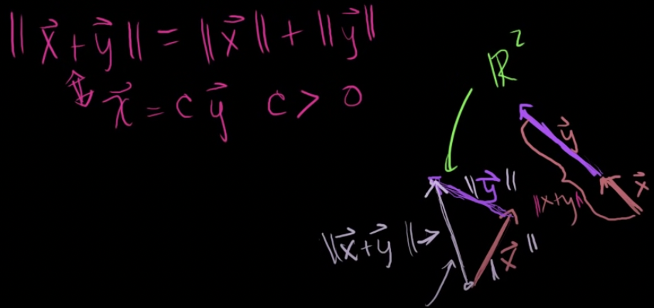

加上这张图会更简单。其实就是初中学的三角形三条边的性质：两边之和大于第三边。这里还多了个等于的情况，因为向量y和向量x可能共线。

$(\vec{a}·\vec{b})=||\vec{a}||||\vec{b}||cos\theta$。$\theta$为两个向量之间的夹角。证明要用余弦定理，视频里的证明有点乱就不放了。这个公式在二维向量的情况下相信大家已经都用过很多次了，推广到多维同样适用。

另外还有一点新概念。当夹角为90度的时候，上面公式的值为0，因为cos 90等于0。如果x向量和y向量都不是0，则我们说两者垂直并正交。如果两者中有一个是0，则我们说两者正交。0向量与任何向量都正交，包括自己。

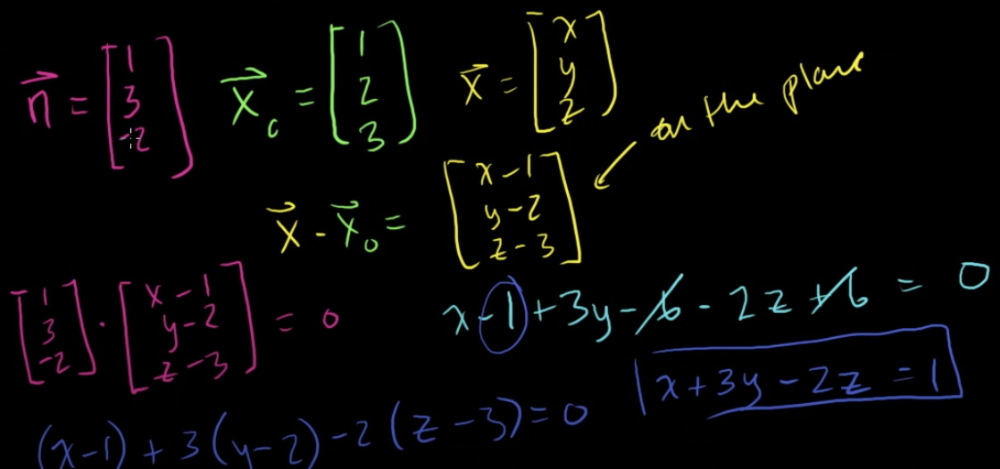

这张图讲了如何利用法向量和一个点在r3中定义一个平面。方法就是把表示那个点的向量与向量x相减，结果再与法向量进行点乘，最终结果化简就是所求的方程。

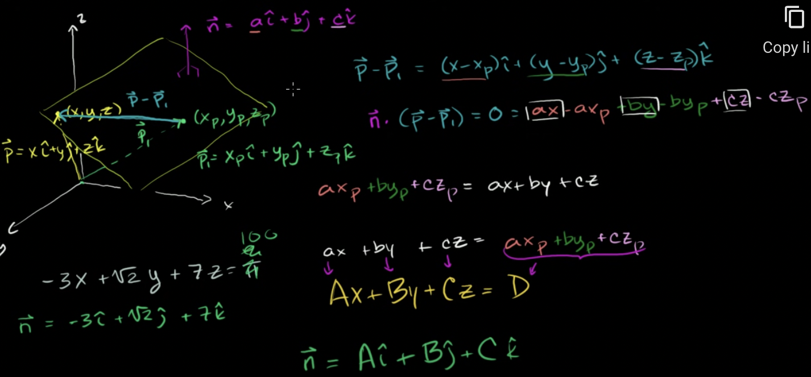

关于平面标准方程的补充。通过标准方程找法向量很简单。标准方程为$Ax+By+Cz=D$，那么$\vec{n}=Ai+Bj+Ck$,其中i，j和k是标准向量。

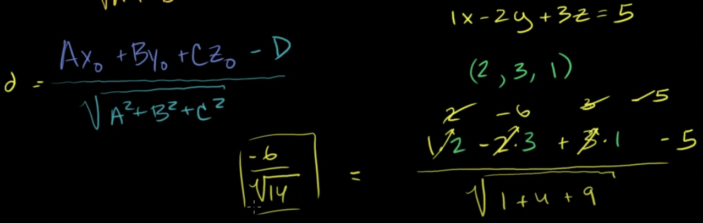

上图展示了如何找到不在平面上的点与平面的距离。

### 叉乘

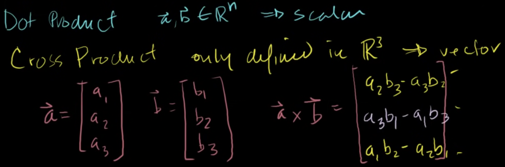

叉乘的使用范围没有点乘广。点乘在任意维度的向量中都被定义，而叉乘仅存在于三维向量，即$R^3$。叉乘表示为$\vec{a}$ x $\vec{b}$,结果是一个三维向量，这个向量与a和b都正交。如何计算图中有写，稍微有点复杂。同时还有个跟点乘相对的公式:$||\vec{a}$ x $\vec{b}||=||\vec{a}||||\vec{b}||sin\theta$。

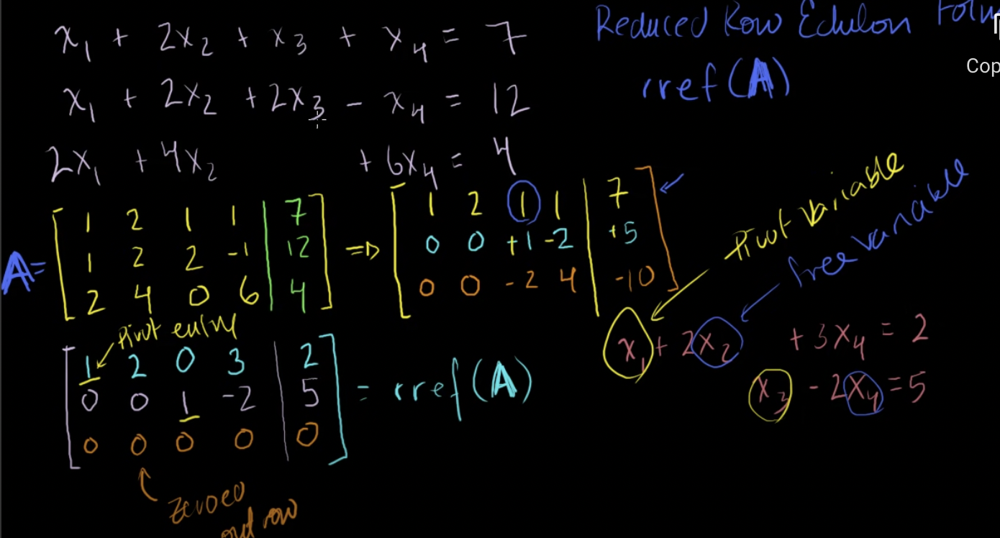

???怎么突然就用矩阵来解方程了？还是不定方程，我都还没学……会。没事以后还能补。

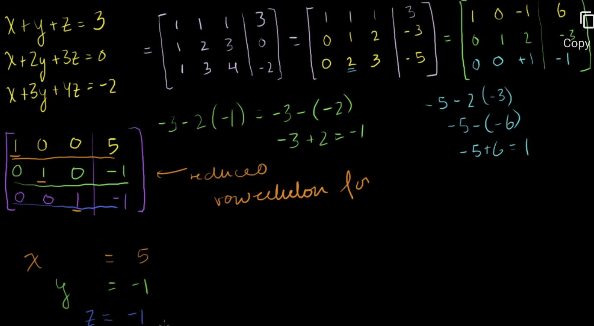

这个正常了，使用矩阵解3元一次方程组。思路也很简单，首先把第一个方程的x作为主元，剩下两行在x的位置需要利用相加相减等方法消去数字，得到0。第二个方程的y作为主元，第三个方程的z作为主元。最后得到的矩阵就是这个方程组的解。其实和平常解的方法是一样的，都是尽量消元，只是矩阵解法要保证主元所在的列只有自己不是0。

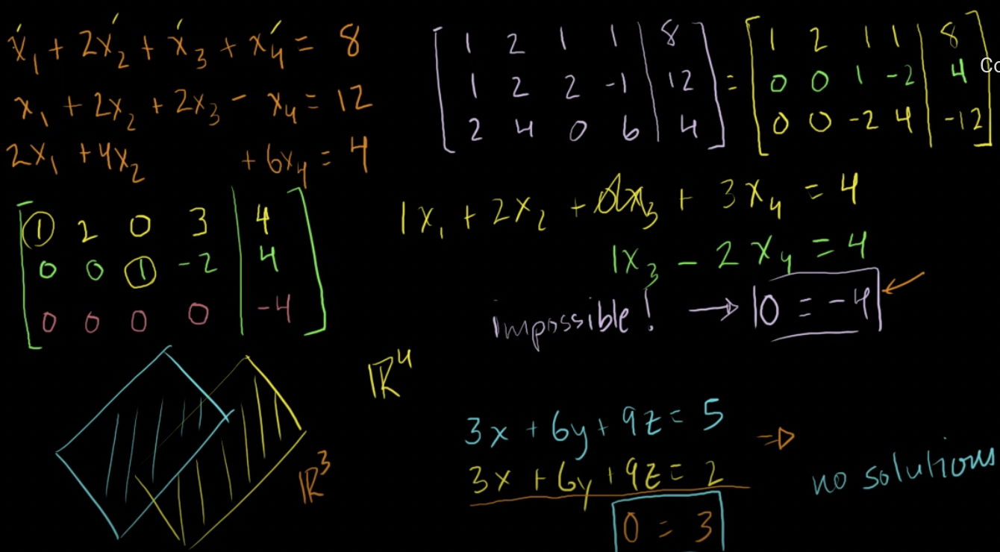

这种情况下方程组无解。此方程的增广矩阵消元到最后得到了0=-4，而这是不可能的，从而无解。有解的情况是0=0。如果一个方程组消元后的矩阵最后一行全是0且等于0，并有无关主元的自由变量，那么该方程组有无数个解；如果没有则恰好有一个解。

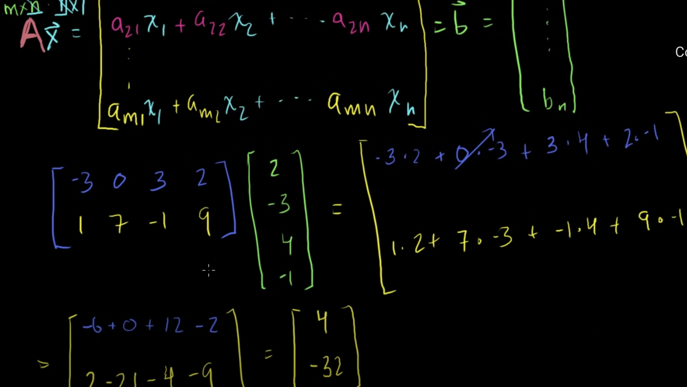

以上是如何求一个矩阵的向量的乘积。矩阵的列数必须和向量的标量的数量相同。

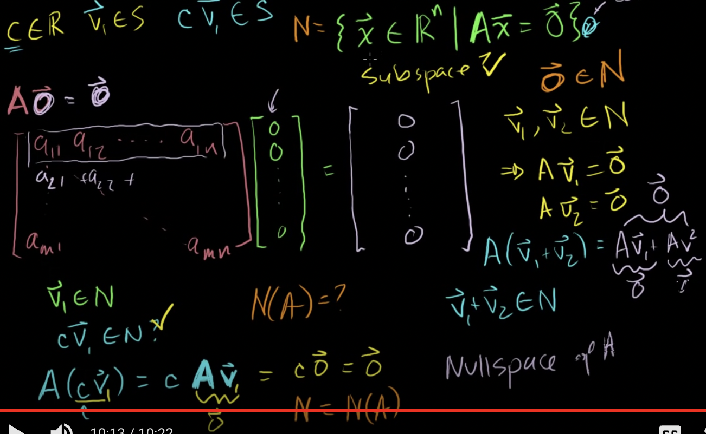

首先先来复习一下子空间的定义。子空间S满足$\vec{0}\in S;\vec{v1},\vec{v2}\in S\rArr \vec{v1}+\vec{v2}\in S;C\in \real,C\vec{v}\in S$。即子空间S中有向量0；如果向量v1和v2都在S中，则v1+v1也在S中，对加法封闭；C是任意实数，向量v1在S中，C乘v1在S中，对乘法封闭。N(A)指的是找到满足方程$A\vec{x}=0$的$\vec{x}$所构成的集合，即零空间。

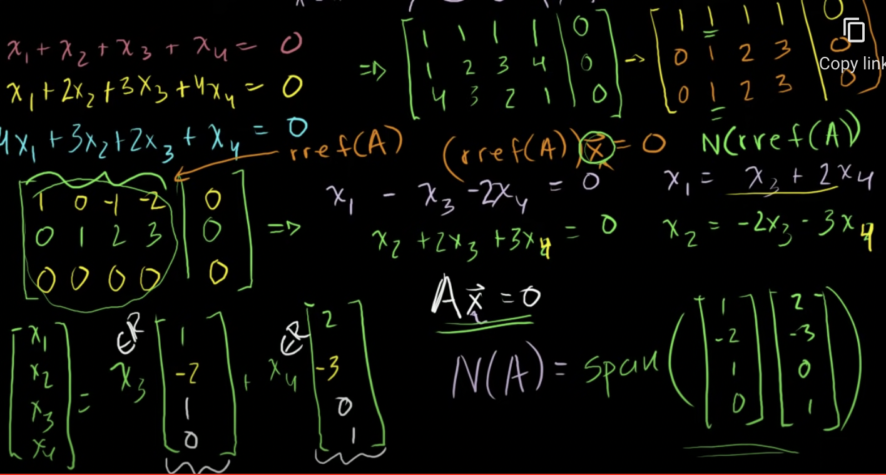

这张图算出来矩阵A的零空间是两个矩阵张成的空间，而那两个矩阵由矩阵A的增广矩阵得来.我看不懂但我大受震撼。

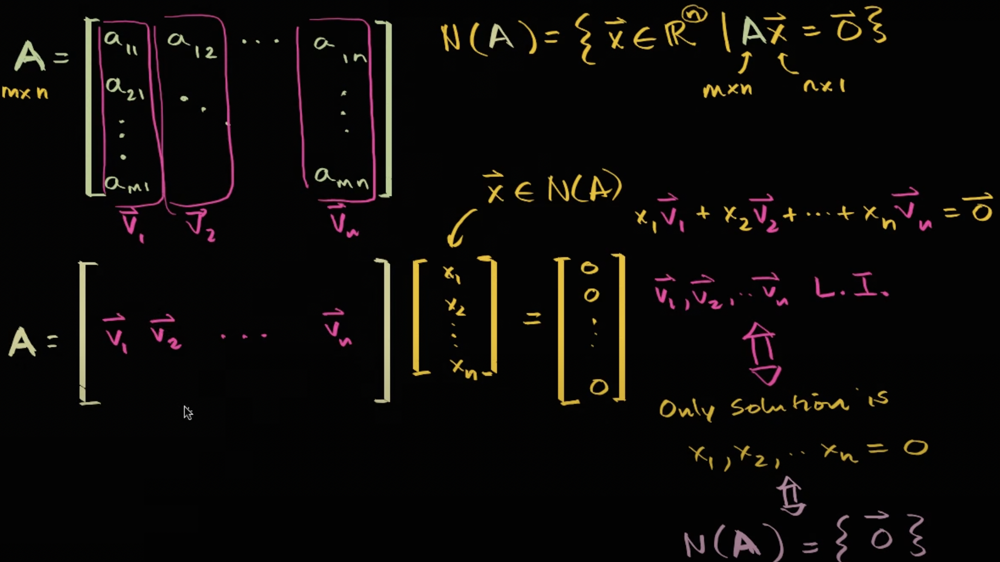

如何利用矩阵A的零空间来判断矩阵A是否线性无关？如果矩阵A得零空间仅包含一个元素，即向量0，意味着方程的解只有0，因此矩阵线性无关。线性相关代表一组向量中的一部分可以用各种线性组合来构成这组向量中的另一个向量；线性无关代表无论如何线性组合都无法构成另一个。

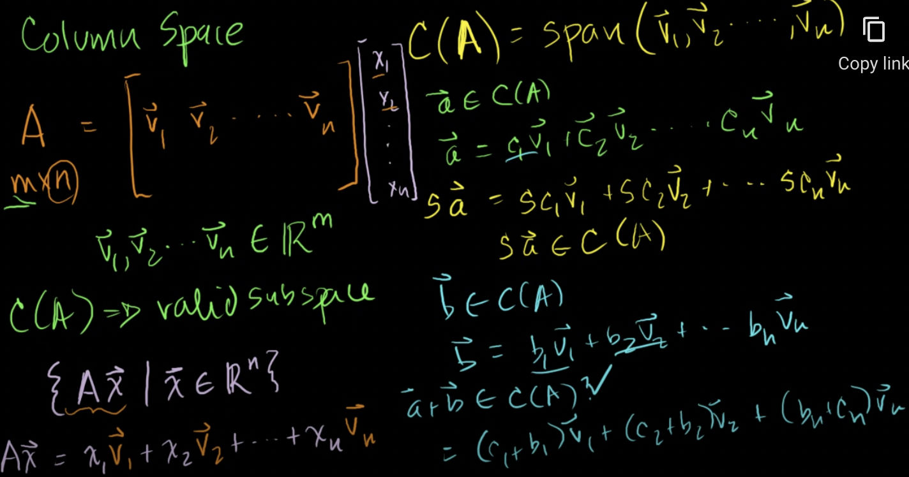

一个矩阵的列空间是其所有列向量所张成的空间。

一个子空间的维数等于该子空间一个基底的元素的个数。对于给定的子空间的所有基底，都含有相同数量的元素。任意一个矩阵的零度等于其自由变量的数量（该矩阵行简化阶梯形中非主列的个数。矩阵的秩（rank）等于矩阵的行简化阶梯形的主列的数量。就记一下概念了，这个课程还没教过什么是行简化阶梯形。

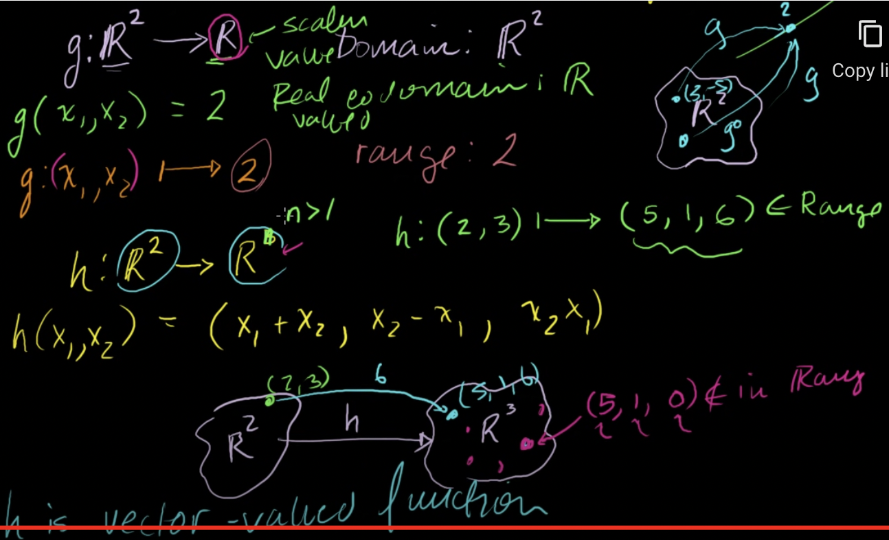

函数大家肯定都不陌生，不过初中学的函数只提到了值域（range）这个概念，而现在引入了上域（codomain）。值域是上域的子集合，拿视频里的向量函数h来举例最容易理解。h(x1,x2)=(x1+x2,x2-x1,x2*x1)接收一个二维向量，返回三维向量，那么它的上域就是就是$R^3$中的任意向量，比如(5,1,0)。但(5,1,0)这个向量是不可能成为h函数的输出的，所以不在值域内。

函数可以看作是两块区域间的映射。比如有$R^n$和$R^m$两块区域，$R^n$中的任意元素经过任意变换可以得到$R^m$中的任意元素，这就是一种映射关系。线性代数中可以把向量之间的映射看作一种变换，用T表示。

### 线性变换

线性变换$T:R^n\rArr R^m$满足$\vec{a},\vec{b}\in R^n;T(\vec{a}+\vec{b})=T(\vec{a})+T(\vec{b});T(c\vec{a})=cT(\vec{a})$

矩阵与向量的乘积是线性变换。利用这一点我们可以将任何线性变换表达成矩阵和向量的乘积。

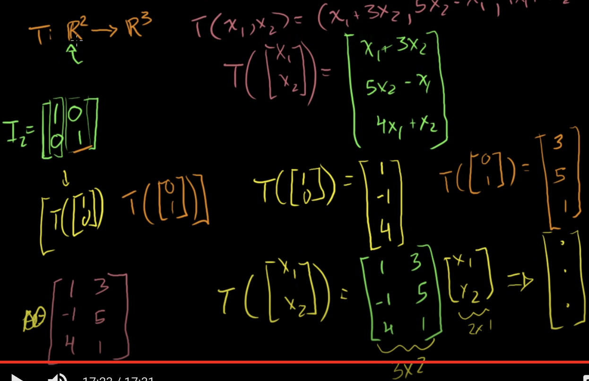

$T:R^2\rArr R^3$，第一步是找到$R^2$的标准矩阵，即图中所示矩阵I2。I2可以看作是两个列向量的组合，对每个列向量进行要求的线性变换，得到的矩阵就是线性变换的矩阵。任意二维向量乘上那个矩阵就可以得到这个二维向量在指定变换下的结果。

T(A)是A在T下的像（image），$\{T(\vec{x})\in y | \vec{x}\in A\}$。像是从定义域的一个子集到值域的一个子集；原像是从值域的一个子集到定义域的一个子集。

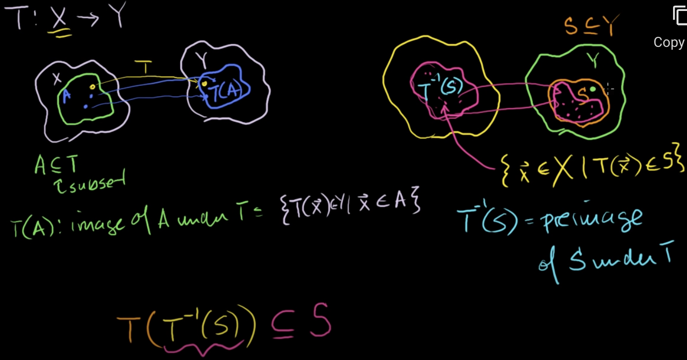

像和原像和函数与反函数的概念差不多，只是原像中的值不必全部都映射到像中，只要有一部分就可以了。举个例子，假设我们有一个在T转换下的像a，并求出了这个像的原像，那么这个原像的像b是像a的一个子集。

假如有$T(B)=\{0\}$,那么B是变换T的核（kernel），记作Ker(T)。即以下集合中的元素被称为变换T的核。$\{x\in R^2 | T(\vec{x}=\{\vec{0}\}\}$。定义域$R^2$中满足T变换下得到0的向量集合。如果这个变换$T=A\vec{x}$，那么$ker(T)=N(A)$

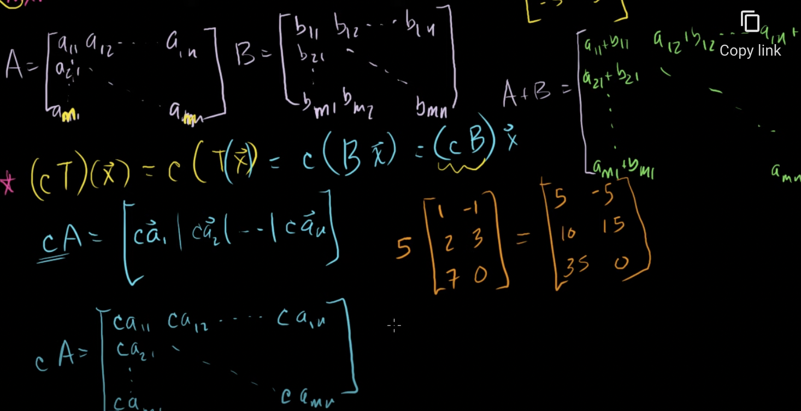

上图展示了矩阵与矩阵的加法和矩阵与标量的加法。非常简单的定义，矩阵相加就是把每一个对应的元素相加，矩阵与标量相乘就是把矩阵的每一项与标量相乘。

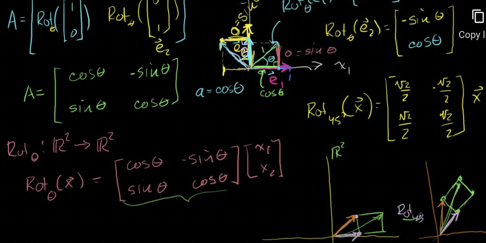

利用矩阵构建出想要的线性变换。首先判断要映射的维数，如这里是$R^2$到$R^2$，需要一个2x2的单位矩阵（即除了左上到右下的对角线上是一，其余都是0）。找到矩阵后在单位矩阵上作想要的变换。例如延y轴缩放x倍的操作只需要在矩阵的每一个列向量表示y的分量上乘以x就得到了缩放变换。上图是旋转$\theta$角度的变换，利用了单位圆的知识。

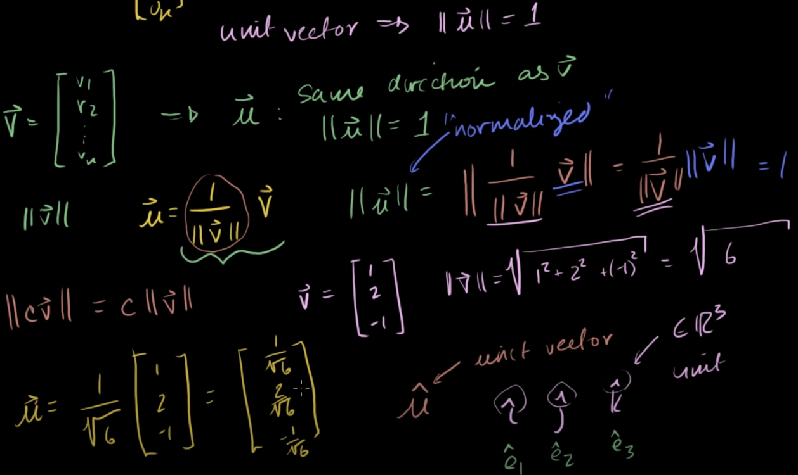

为什么现在才学单位向量……单位向量的定义是模长为1，与普通向量的表达方式不同，顶上不是箭头而是一个小三角。找单位向量先求出要标准化的向量的模长，然后用模长的倒数乘以原向量，即可得到单位向量。

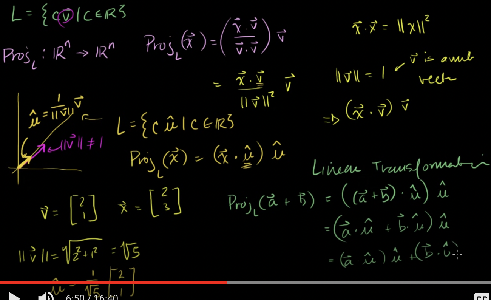

投影这个名字非常形象，它求的就是$\vec{x}$向量在某一条直线上的“影子”。想象有一根竹竿斜着插在土地上，太阳正好与地面垂直。这根竹竿就是向量，影子就是它的投影。求投影有个公式:求向量x在直线L上的投影，$Proj(\vec{x})=(\frac{\vec{x}\vec{v}}{\vec{v}\vec{v}})\vec{v}$。向量v是构成直线L的向量，简单理解为与L同方向的向量。如果向量v是单位向量，$\vec{v}\vec{v}=||\vec{v}||^2$，即等于1，可以省去分母。也可以用矩阵表达，因为投影本身是一种线性变换。

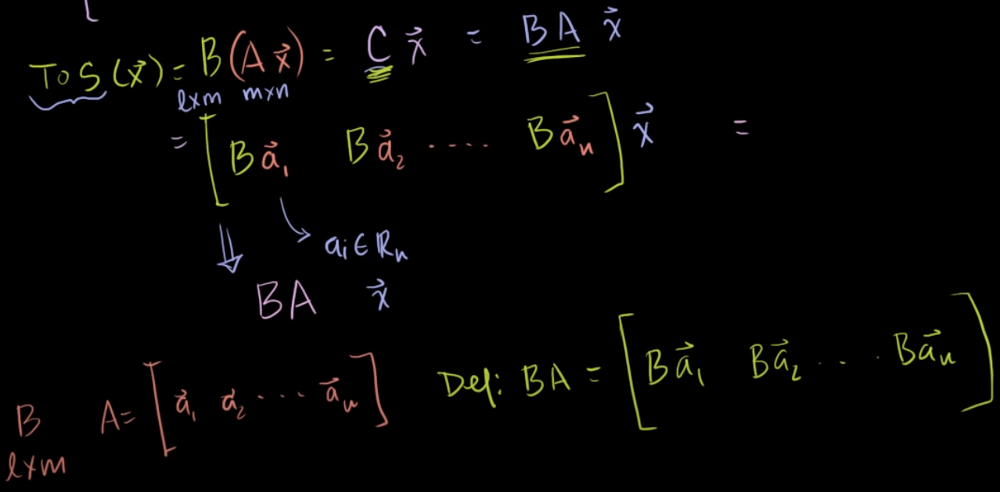

函数可以复合，变换的概念很像函数，所以有没有复合变换呢？当然有。有一种变换T将向量x从$R^m$映射到$R^n$，得到向量y；变换S将向量y从$R^n$映射到$R^l$，这就是复合变换，可以表示为$T\circ S=B(A\vec{x})=C\vec{x}=BA\vec{x}$。B和A分别为T和S变换的矩阵；复合变换可以整体看作线性变换，用矩阵C表示。$B(A\vec{x})$也可以表达成$BA\vec{x}$，故$C\vec{x}=BA\vec{x}$。由此我们得到了矩阵相乘的定义：B是一个l x m矩阵，A由u个列向量组成(m x u矩阵)，则$BA=[B\vec{a1},B\vec{a2}...B\vec{au}]$。乘法定义的条件是A的列数等于B的行数。矩阵相乘符合结合律，$(AB)C=A(BC)$；也符合分配律，$A(B+C)=AB+AC$。一定要记得矩阵不符合交换律，$AB\not ={BA},A(B+C)\not ={(B+C)A},AB+AC\not ={BA+CA}$，甚至很多情况都是未定义。

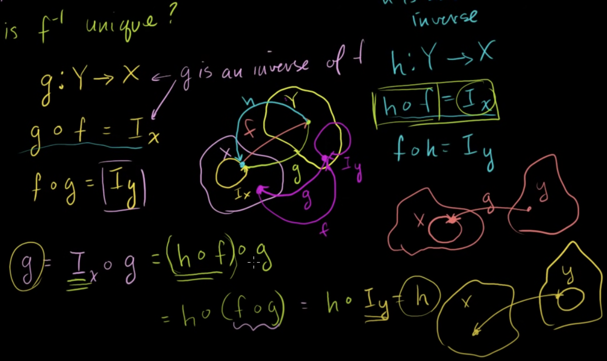

不知道是不是因为我没有认真看，这个单位函数怎么这么怪呢？看起来单位函数的定义是映射到自己的函数，即$f(x)=x$。可以表达为$f\circ g=Iy$，g是f的反函数。相当于从y映射到x后又映射回了y，满足自己映射自己的定义。借助单位函数我们可以知道f的反函数是唯一的。假设函数g和h都是f的反函数，那么$g=Ix\circ g=(h\circ f)\circ g$，这是单位函数的定义。$h\circ (f\circ g)=h\circ Iy$，得证g和h相同，故反函数是唯一的。

### 满射(Surjective,onto)和单射(injective,one-to-one)

上面提到过，值域不等于上域，即值域的大小小于等于上域。如果一个函数的值域完全等于上域，即上域中任意的y都是至少一个x的像，那么我们说次函数满射。单射指的是一个函数的值域最多是一个x的像。如果同时有两个x得到同一个y，那么这个函数就不满足单射。如果一个函数的值域既完全覆盖上域也不会有x重复得到一个y，那么这个函数既满射也单射。对于一个从x映射到y的函数f，当且仅当这个函数是满射和单射的时候，此函数可逆。

先来看看如何判断一个函数是否满射。函数可以被看作一种变换，用T表示。当且仅当$C(A)=R^m$，T的矩阵A的每一个列向量都是主列，即拥有m个主变量。更好的记法是矩阵A得列变量可以张成$R^m$。还有另一种判断方式。我们知道Rank(A)=C(A)的基向量数，那满射的条件也可以记作$T为满射\iff Rank(A)=m$。

假设$A\vec{x}=\vec{b}$有解，则其解集满足$\{\vec{x}+n|n\in N(A)\}$。变换T是单射的条件为其矩阵的秩等于n，也就是其零空间中只能有0向量，所以只有一个解；如果零空间只包含0向量，就说明它所有的列都是线性无关的，意味着它们都是基的一部分。还可以反过来说，如果矩阵的秩为n就意味着其所有列向量都是线性无关的，则零空间中就只有0向量，故只有一个解。

把满射和单射的条件结合起来并简化一下，我们就得到了变换可逆性的判断条件。$T:R^n\rArr R^m,T(X)=A(m*n)\vec{x}$仅在矩阵A的行简化阶梯形等于n*n的单位矩阵时可逆。

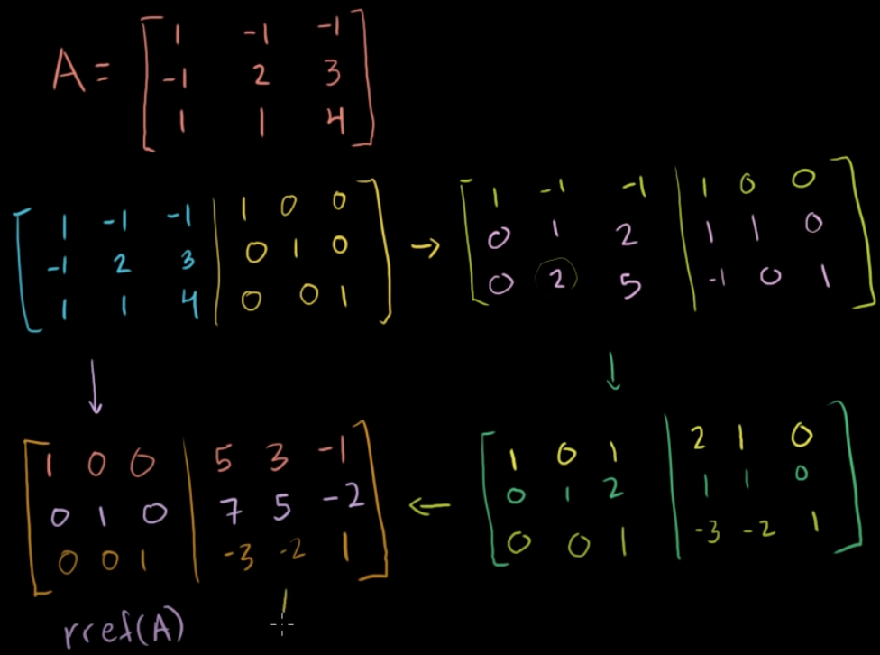

一个找逆矩阵的办法。首先将矩阵A加上单位矩阵转化为增广矩阵，然后逐步将矩阵A化为行简化阶梯形（能成功转化证明矩阵A可逆，否则不可逆）。如果可逆则最开始的单位矩阵经过转化后就成为了矩阵A的逆矩阵。

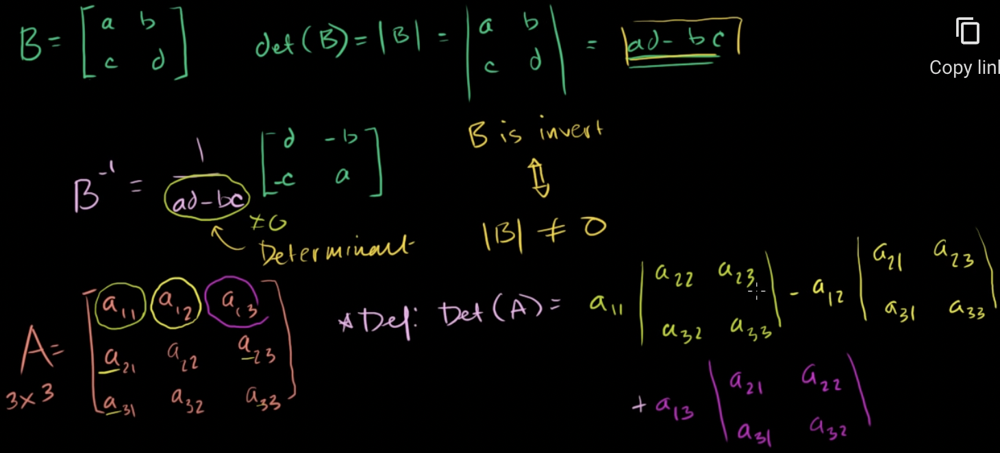

无论是2\*2还是3\*3矩阵，只要矩阵的行列式为0则该矩阵就没有对应的逆矩阵。

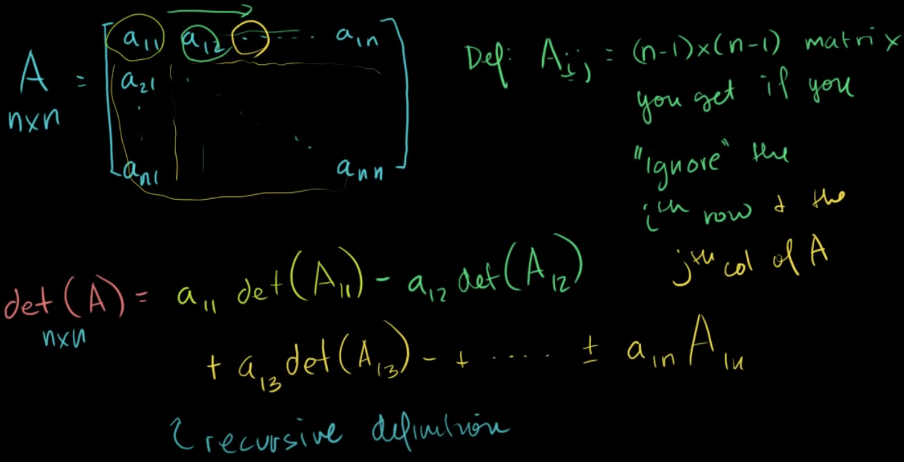

虽然2*\2和3\*3矩阵的行列式都被定义了，但是n\*n怎么办？不可能全部都定义一遍吧。于是数学家们利用了将复杂问题转换为已知问题的思想，给出了n\*n矩阵的递归定义法。具体做法就是先选择一列，从左往右不断缩减所要求的矩阵，直到矩阵被缩小到2\*2。

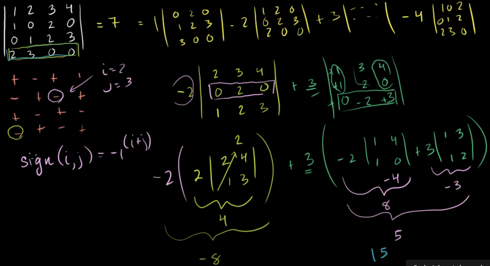

选择0较多的行会比较轻松。比如这道题选第一行也能做，第四行也能做，但是选择第四行会比第一行轻松。另外行列式的符号是交错的，如果怕忘记可以看左边那个符号表，对照着写符号就不容易错了。

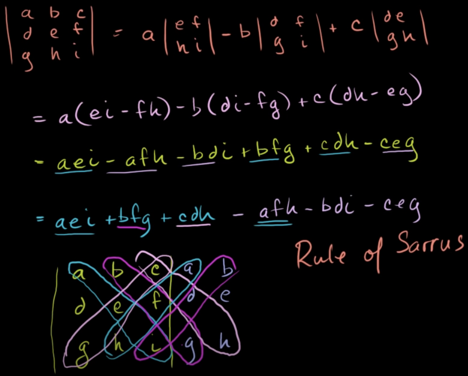

公式有点难记，那这个规律就是帮助记忆3\*3矩阵的行列式的。把原矩阵多写两列，你会发现行列式的结果就是几个对角线的和与差。

假如一个n\*n的矩阵A中的一列与k相乘，相乘后的行列式$det(A')=k*det(A)$，即k倍的原行列式。如果每一列都与k相乘，则$det(kA)=k^n*det(A)$。

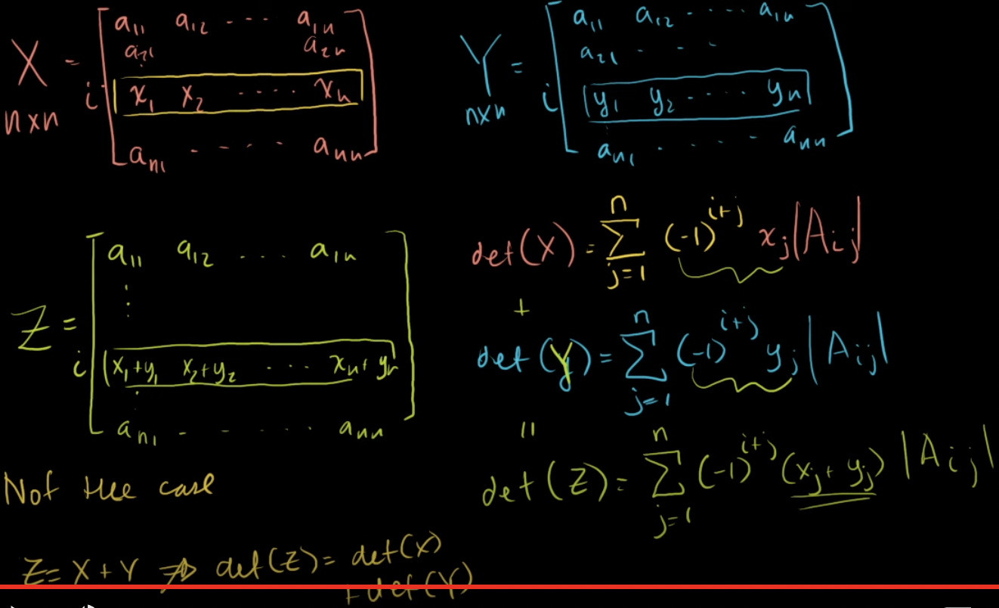

这种行列式加法仅适用于这种情况：正好有3个n\*n矩阵，分别为X，Y，Z，X和Y只有一行不一样，Z在X和Y不一样的那一行正好等于x+y。否则以上规律不适用。

如果一个矩阵包含重复的列，则这个矩阵不可能通过行变换化成单位矩阵，或者说不可逆。

假设有一个n\*n的矩阵B，第j个列向量为$\vec{r}j$。如果我们把这个向量加上c倍的任意一个B矩阵的其他列向量，矩阵B的行列式不变。

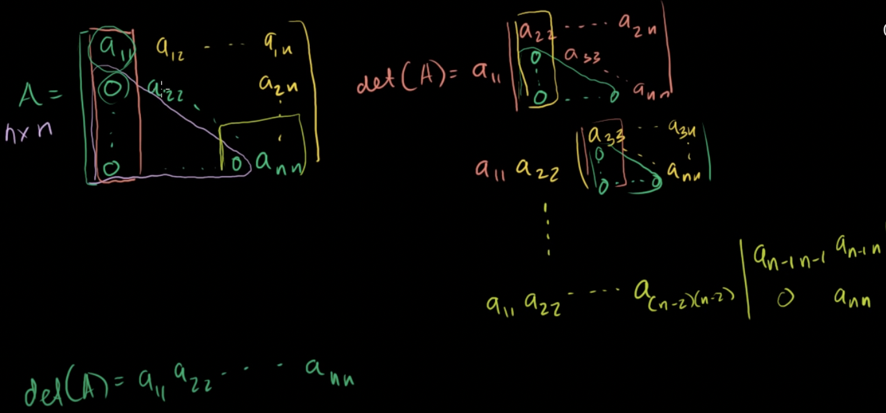

像上图那样的三角矩阵（以从左上到右下的对角线为分割，下面的部分全是0，上面的部分包括对角线为任意数字）的行列式仅仅就是对角线的乘积。如果下面全是0则叫“上三角形矩阵”；如果反过来上面全是0则叫“下三角形矩阵”。下三角形矩阵的行列式同样是对角线的乘积。

2\*2矩阵的行列式还有这么一个意义：其行列式的绝对值等于其列向量组成的平行四边形的面积。