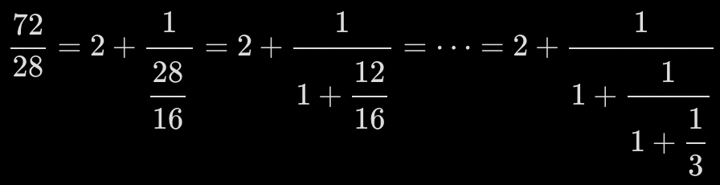
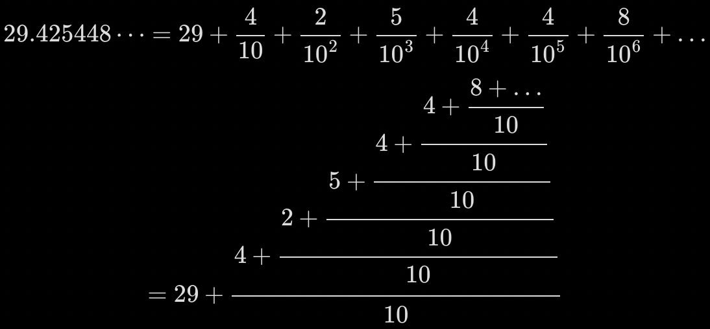
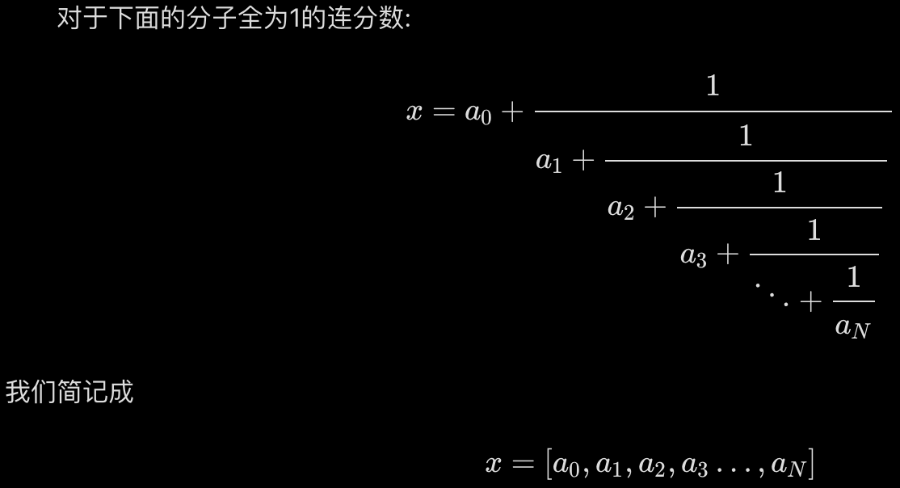
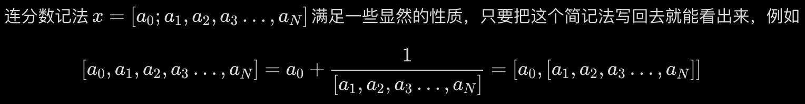
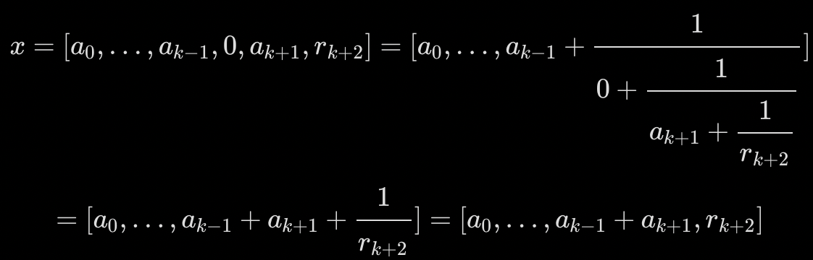
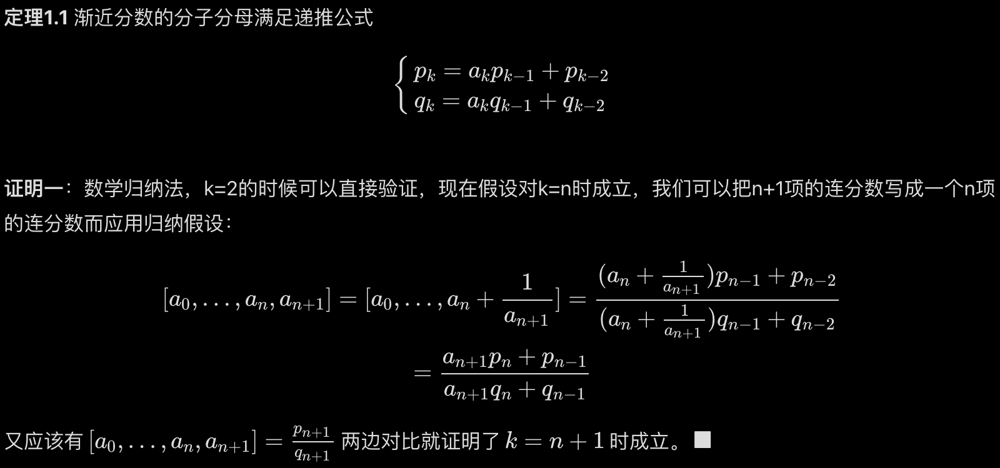
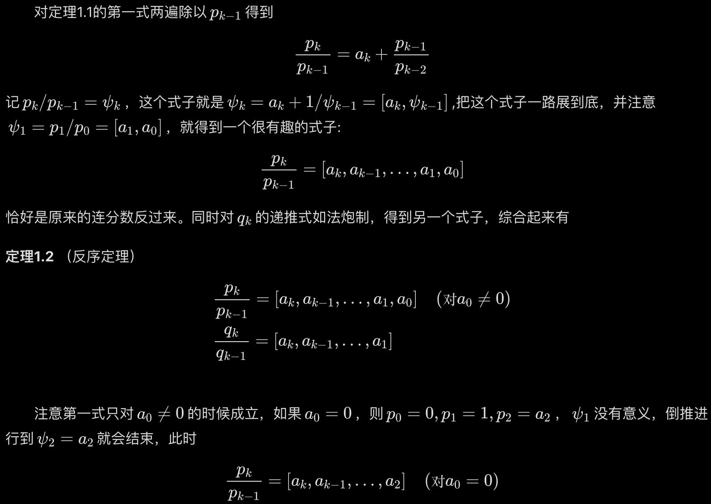

# 连分数学习

虽然在做题的时候还没有遇见过[连分数](https://chaoli.club/index.php/2756/0)，但是学习一下也无妨，因为数论真的又难又多又杂，学点没那么抽象找点自信（或者继续懵逼）。

### 一、绪论

求两个数a，b的最大公因数很容易就能想到辗转相除法。事实上辗转相除法和连分数有共通之处，如果我们把辗转相除的过程写为分数。

$gcd(72,28)=?$ 
$\frac{72}{28}=2+\frac{16}{28}$ $\frac{28}{16}=1+\frac{12}{16}$ $\frac{16}{12}=1+\frac{4}{12}$ $\frac{12}{4}=3+0$

这个时候注意一下上面一串式子中，上一个式子右边的分数就是下一个式子左边分数的倒数，我们就可以把这几个式子写到一起:

(截图吧，markdown写数学公式真的累)

连分数在求近似上非常有用。对很多实际应用来说，我们希望得到一些分子分母比较小的分数来近似描述一些数据，这个时候我们就可以考虑连分数了，如果把一个分数展成连分数，再把连分数这一串中的最后一个分数或者最后几个分数去掉，就得到了一个原来分数的近似。十进制小数也可以写成类似连分数的形式：

和连分数区别是这个在展开时反着往上长。

#### 1.2 记法、约定、基本概念

连分数非常长，写起来很不方便，因此我们需要能够简洁描写连分数，节省篇幅的记号。

在一些书上为了区分整数和分数部分，会将a0后面的逗号写成分号，记为$x=[a_0;a_1,a_2,a_3…,a_N]$不过这个区分对本文来说没什么必要，所以就都用逗号了。这些ak称之为连分数元素或项。也有分子不一定是1的记法。

分子固定为1的记法有如下性质。

另外我好像没看出来这是什么性质。多加了个括号方便看出余项？

我们把从$a_k$算起到最后的一串连分数称作第k个余项（或者余式）。用$r_k$表示。一个连分数原则上其最后一项$a_N$不能为0,中间一项也不为0，因为：

中间的0项只是把他左右两项粘成一项，没有额外的研究意义。基于此，我们今后可以约定对$k≥1，a_k≠0$,同时所有$a_k$都是正数,防止计算中出现0分母。

0确实没有意义，拿上面那个举例子，$\frac{1}{0+\frac{1}{a_k+1+\frac{1}{r_k+2}}}$,等同于$\frac{1}{\frac{1}{a_k+1+\frac{1}{r_k+2}}}$,也就是$a_k+1+\frac{1}{r_k+2}$，（把下面的部分看为一个整体分数，1除以分数相当于求倒数，那$\frac{1}{n}$的倒数就是n),然后又变回了去掉0项的连分数，等于0毫无意义。

我们把连分数保留到$a_k$的近似记作$s_k$，称作一个连分数的第k个近似或者第k个截断，把$s_k=[a0,…,ak]$写成分数$p_k/q_k$,就称为连分数的第k个渐近分数或者k阶渐近分数。

### 1.3 基础结论

以下定理基本只依赖于形式上的连分数$[a_0,a_1,…,a_N]$而与具体数值无关

完了我就开始看不懂了。怎么得出来的？然后看了一下又明白了。$\frac{a_0a_1+1}{a_1}=\frac{a_0a_1}{a_1}+\frac{1}{a_1}=a_0+\frac{1}{a_1}$。其实就是通分，两个异分母的分数要通分才能相加。一般通分要找最小公倍数，但是这里都是未知数，所以直接乘以对方一定不会错。小学知识我都忘了我是怎么敢来学这个的？

多算几个，数学好的人就能得到下面的递推公式。

这数学归纳法我总是跟不上。我知道数学归纳法的步骤先是证明有限的数字，此处是k=2时成立。这个容易因为直接代入就行了。接下来要假设n项成立并根据成立的结论推导n+1项。关键在于将n+1项的内容用第n项表示。比如上面的证明假设k=n时成立，接着把k=n+1的情况用n表示。第$a_{n+1}$项也可以表示为$a_n+\frac{1}{a_{n+1}}$,然后整体作为第n项。就是手动拆一下。因此这个用第n项表达的连分数是可以直接应用公式的，因为假设k=n时成立。把公式套进去就得到了右边的式子。但是下面的式子怎么来的？右边的式子不可能可以化简成那个吧，所以我认为是直接在原n+1项的式子上使用的公式。又因为整个式子应该等于公式，因此成立。我看不懂但我大受震撼。

还有第二种证明，太难了不看了。自学就是这么摆烂。

怎么连除法也看不懂了……上面提到的式子是$p_k=a_kp_{k-1}+p_{k-2}$，那除以$p_{k-1}$不应该等于$\frac{p_k}{p_{k-1}}=a_k+\frac{p_{k-2}}{p_{k-1}}$吗，怎么是反过来的？不过接下来展开式子的操作还是很容易理解的，这么看来我每个知识点只能懂一半。