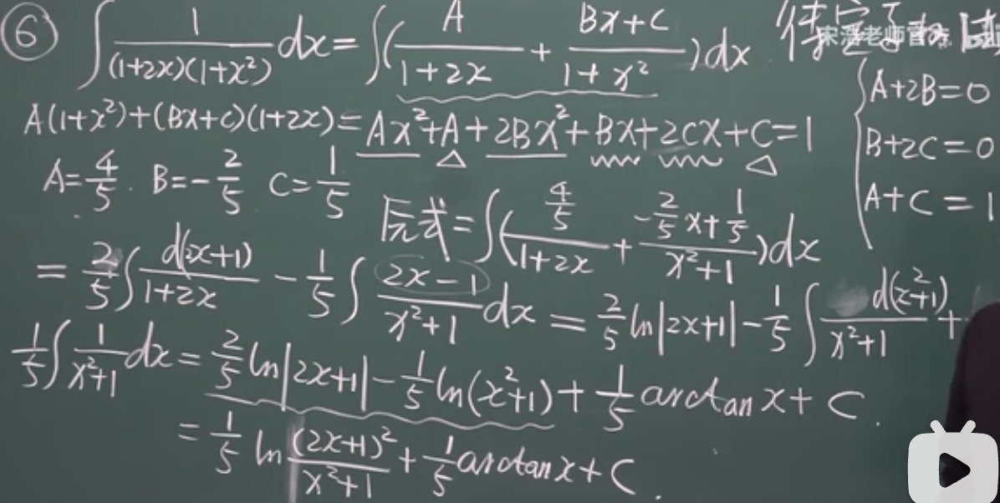

# 高等数学

我也真是个人才，高数都没学竟敢去学抽象代数。之前觉得高数没用，极限，积分什么的ctf用不上（想当初我是为了搞crypto才学的数学，我对数学一点兴趣都没有。结果现在数学兴趣起来了crypto还是不会。当然数学也不会。我到底在干什么？）。后面发现高数内容很多，有些东西是有用的。好的我来了。

课程地址：https://www.bilibili.com/video/BV1Eb411u7Fw

## 1.1 映射

映射：对X，Y两个非空集合，有法则f，使对X中的每个元素x，都有唯一的y与之对应。则f叫做映射，记做 $f:X\rightarrow Y$ .y叫做像，与之对应的x叫做原像。X叫定义域，记作 $D_f$ ;像的集合叫做值域，记做 $R_f$ 。 $R_f\in Y,R_f\not ={Y}$

映射三要素：
1. X，f, $R_f$
2. $x\in X$ ，对应的y是唯一的。两个x可以对应同一个y，但是一个x不能对应两个y

满射： $R_f=Y$ 。单射： $x_1\not ={x_2},f(x_1)\not ={f(x_2)}$ .一一映射：单射+满射。逆映射：设 $f:X\rightarrow Y$ 为单射。对于每个 $y\in R_f$ ，都有唯一的 $x\in X$ 满足 $f(x)=y$ .逆映射为 $g:R_f\rightarrow X$ .记做 $f^{-1}$ . $D_{f^{-1}}=R_f,R_{f^{-1}}=X$

复合映射：有 $g:X\rightarrow Y_1$ 和 $f:Y_2\rightarrow Z$ ，且 $Y_1\in Y_2$ .取 $x\in X$ ， $f(g(x))\in Z$ 。记做 $f\circ g:X\rightarrow Z$ . $R_g\subset D_f$

## 1.1 函数

函数是数集到数集的映射。有 $D\subset R$ （R为实数域，区别于接下来的Range R）, $f:D\rightarrow R$ .定义函数 $y=f(x),x\in D$ .x叫自变量，y叫因变量，定义域记为D或 $D_f$ .值域记为 $R_f=f(D)$

构成函数的两要素：定义域 $D_f$ 以及对应规则f

[x]表示不超过x的最大整数

## 1.1 函数的几种特性

1. 有界性
- 上界： $\exists k_1,f(a)\leq k_1$ . $k_1$ 叫f(x)在x上的一个上界。上界不唯一，可以有无穷个
- 下界： $\exists k_2,f(a)\geq k_1$ . $k_2$ 叫f(x)在x上的一个下界。下界不唯一，可以有无穷个
- 有界：存在正数M， $|f(x)|\leq M$ （ $-M\leq f(x)\leq M$ ）。有界 $\Leftrightarrow$ 既有上界也有下界
- 无界：任给正数M， $\exists x_1\in X$ 使得 $|f(x_1)|$ > M
2. 单调性
- 单调增： $x_1$ < $x_2$ ， $f(x_1)$ < $f(x_2)$
- 单调减： $x_1$ < $x_2$ ， $f(x_1)$ > $f(x_2)$
3. 奇偶性：D（定义域）关于原点对称
- 偶： f(-x)=f(x).图像关于y轴对称
- 奇： f(-x)=-f(x)。图像关于原点对称
4. 周期性：存在正数l使得f(x+l)=f(x),那么函数就叫周期函数，l就叫周期。通常所说的周期指的都是最小正周期
- 并非每个周期函数都有最小周期，比如D(x)，其定义为当x为有理数时等于1，x为无理数时等于0。该函数任何正有理数r都是周期，不存在最小的正有理数周期

## 1.1 反函数 复合函数 初等函数

设 $f:D\rightarrow f(D)$ 为单射，则 $f^{-1}=f(D)\rightarrow D$ 就叫f的反函数。若f单调增/减且单射，则 $f^{-1}$ 一定存在且也是单调增/减。f和 $f^{-1}$ 关于y=x对称

复合函数：y=f(t),t=g(x).y=(g(x))就是复合函数，t为中间变量。g的值域必须落在f的定义域里

运算：有f(x)和g(x)，两者结合在一起的定义域为 $D=D_f\cap D_g\not ={\emptyset}$
- $(f\pm g)(x)=f(x)\pm g(x)$
- $(f\*g)(x)=f(x)\*g(x)$
- $(\frac{f}{g})(x)=\frac{f(x)}{g(x)},g(x)\not ={0}$

例题：任给一个函数f(x)，其定义域为(-l,l)，如何把f(x)表示成g(x)+h(x)，同时g(x)为偶函数，h(x)为奇函数？

可以利用函数的特性构造方程组。变换一下，得到f(-x)=g(x)-h(x).结合f(x)=g(x)+h(x)，得到 $g(x)=\frac{1}{2}[f(x)+f(-x)],h(x)=\frac{1}{2}[f(x)-f(-x)]$

初等函数：
- 幂函数： $y=x^{\mu}$
- 指数函数： $y=a^x$
- 对数函数： $y=log_ax$ .若底数是e则称为 $lnx$
- 三角、反三角函数

初等函数为基本初等函数经过有限次的运算和有限次的复合的函数

## 1.2 数列极限的定义

数列： $x_1,x_2,x_3,...,x_n...$ 就叫一个数列，记做{ $x_n$ }。每个数叫项， $x_n$叫一般项，也叫通项

数列极限：设{ $x_n$ }是数列， $\forall\epsilon$ > 0, $\exists N$ ，使得n > N时， $|x_n-a|$ < $\epsilon$ .a就是极限

## 1.2 收敛数列的性质

收敛数列是有极限的数列；发散数列就是没有极限的数列。收敛数列 $\Leftrightarrow$ 数列有极限。收敛数列的极限唯一,且一定有界。但有界不一定收敛

收敛数列具有保号性。数列{ $x_n$ }的极限是a，且a大于0（小于0）。 $\exists N$ > 0，当n > N时， $x_n$ > 0（< 0）

推论：若数列从某项起 $x_n\geq 0(\leq 0)$，且 $x_n$ 的极限为a，则a大于等于0(小于等于0)

收敛数列的任一子数列收敛于同一极限。子数列为原数列里随意取数得到的数列（但是要保持顺序,类似subsequence的定义）。数列{ $x_n$ }的子数列记为{ $x_{n_k}$ }。若数列有两个子数列收敛于不同的极限，则原数列一定发散

## 反三角函数介绍

sin： $x\in(-\infty,\infty),y\in [-1,1]$

arcsin: $x\in[-1,1],y\in[-\frac{\pi}{2},\frac{\pi}{2}]$

cos: $x\in(-\infty,\infty),y\in [-1,1]$

arccos: $x\in[-1,1],y\in[0,\pi]$

arctan: $x\in(-\infty,\infty),y\in (-\frac{\pi}{2},\frac{\pi}{2})$

arccotangent(cot x=cos x/sin x): $x\in(-\infty,\infty),y\in(0,\pi)$

sec(1/cos),cec(1/sin)

## 1.3 函数极限

$x\rightarrow a$ (有限数)， $f(x)\rightarrow b$ .f(x)在 $x_0$ 的去心邻域（ $x_0$ 的邻域除去 $x_0$ ，邻域是指 $x_0$ 的附近区域）内有定义. $\exists A$ , $\forall\epsilon$ > 0, $\exists\delta$ > 0,使得0 < $|x-x_0|$ < $\delta$ 时,|f(x)-A| < $\epsilon$ 。就叫 $lim_{x\rightarrow x_0}f(x)=A$ ,或者说 $f(x)\rightarrow A(x\rightarrow x_0)$ .A就是函数的极限，任给大于0的 $\epsilon$ ,是函数值和它的极限之间的距离.常数的极限等于常数

左极限： $lim_{x\rightarrow x_0^-}f(x)=A$ .右极限： $lim_{x\rightarrow x_0^+}f(x)=A$ 。左极限表示从左边逼近，右极限表示从右边逼近。 $x\rightarrow x_0,f(x)$ 极限存在 $\Leftrightarrow$ 左右极限均存在且相等。注意函数在 $x_0$ 处有没有定义和在 $x_0$ 处有没有极限没有关系

当 $x\rightarrow\infty$ , $\forall\epsilon$ > 0, $\exists$ 正数X，使得|x| > X时,|f(x)-A| < $\epsilon$ 。就叫 $lim_{x\rightarrow \infty}f(x)=A$ 。注意有限数的 $\delta$ 和无限的X都不是唯一的，但是 $\delta$ 越小越好，X越大越好

性质：
1. 当x趋于 $x_0$ 时，函数极限是唯一的
2. 如果 $lim_{x\rightarrow x_0}f(x)=A$ , $\exists M$ > 0, $\delta$ > 0,使得0 < $|x-x_0|$ < $\delta$ 时， $|f(x)|\leq M$ ,就叫局部有界性。M为界， $x-x_0$ 就是范围
3. 局部保号性：如果 $lim_{x\rightarrow x_0}f(x)=A$ ,并且A大于0（或者小于）。那么存在 $\delta$ > 0,使得0 < $|x-x_0|$ < $\delta$ 时，f(x) > 0
4. 如果存在 $lim_{x\rightarrow x_0}f(x)=A$ （函数极限），{ $x_n$ }是趋于 $x_0$ 的一个数列，那么 $lim_{n\rightarrow\infty}f(x_n)=lim_{x\rightarrow x_0}f(x)$ （前者为数列极限）。但是反着来看不成立，数列有极限不代表函数有极限，也不一定相等。可以将数列看成函数自变量的子集，子集有极限不代表整个集合就有极限；但是整个集合有极限其子集肯定也是有的

## 1.4 无穷小与无穷大

无穷小：趋于0叫无穷小。注意很小的负数不是无穷小，而是无穷大；很小的小数也不是无穷小，它是确定的而不是趋于0.可以从正数趋于0，也可以从负数。本身是0也是无穷小。具体定义为， $x\rightarrow x_0(x\rightarrow\infty)$ 的极限为0，就叫f(x)是 $x\rightarrow x_0(x\rightarrow\infty)$ 时趋于无穷小。无穷小+无穷小，无穷小-无穷小，无穷小乘无穷小，任意常数c倍的无穷小，都是无穷小

无穷大：趋于正无穷或者负无穷，统称为无穷大。 $lim_{x\rightarrow x_0(x\rightarrow \infty)}f(x)=\infty$ .无穷大+无穷大（无穷大-无穷大）不一定是无穷大，因为可能一个是正无穷，一个是负无穷； $\frac{\infty}{\infty}$ ，无穷小乘无穷大不确定；无穷大乘无穷大，任意非0常数c倍的无穷大都是无穷大

f(x)无穷大（小），那么 $\frac{1}{f(x)}$ 无穷小（大）

## 1.5 极限运算准则

定理：
1. 有限个无穷小的和还是无穷小
2. 有界函数与无穷小的乘积是无穷小，有限个无穷小的乘积还是无穷小
3. lim f(x)=A,lim g(x)=B(这里lim没具体写趋于的数，表示两者的x只要趋于的是同一个东西就成立)，则：
- $lim[f(x)\pm g(x)]=lim\space f(x)\pm lim\space g(x)=A\pm B$
- $lim[f(x)\* g(x)]=lim\space f(x)\* lim\space g(x)$ .有限个相加相乘都成立
- $lim\frac{f(x)}{g(x)}=\frac{lim\space f(x)}{lim\space g(x)},B\not ={0}$
- lim f(x)存在，那么lim[cf(x)]=clim f(x)
- $lim[f(x)]^n=[lim\space f(x)]^n$
4. 存在两个都趋于无穷大的数列的极限分别为A和B，计算方法和定理三的前三条相同
5. $\phi(x)\geq\psi(x)$ ,则 $lim\phi(x)\geq lim\psi(x)$

$lim_{x\rightarrow\infty}\frac{a_0x^m...}{b_0x^n...}$ （x趋于极限，多项式的比值的极限）有3种情况：
- m=n， $\frac{a_0}{b_0}$
- n > m,0
- m > n, $\infty$

$lim_{x\rightarrow x_0}f[g(x)]=lim_{u\rightarrow u_0}f(u)$ ，若里面的函数有极限，直接带进去即可

## 1.6 极限存在准则 两个重要极限

夹逼准则（草什么鬼名字，之前接触好像叫三明治准则）:两个数列{ $x_n$ },{ $y_n$ }，若满足：
- $\exists n_0\in N$ ,使得n > $n_0$ 时， $y_n\leq x_n\leq z_n$
- $lim_{n\rightarrow\infty}y_n=lim_{n\rightarrow\infty}z_n=a$

则 $lim_{n\rightarrow\infty}x_n=a$

其他准则：若 $g(x)\leq f(x)\leq h(x)$ ，且 $lim\space g(x)=lim\space h(x)=A$ ,则 $lim\space f(x)=A$ .其实就是上面定理的数列换成函数

单调有界数列必有极限。收敛必有界，有界不一定收敛

重要极限：
1. $lim_{x\rightarrow 0}\frac{sin(x)}{x}=1$ 。这个x可以是整体，比如 $lim_{x\rightarrow 1}\frac{sin(x^2-1)}{x^2-1}=lim_{x^2-1\rightarrow 0}\frac{sin(x^2-1)}{x^2-1}=1$ 。倒过来x比sin x也是成立的。另外，当x趋于0时，不仅sin x比x是1，arcsin x，tan x也是
2. $lim_{x\rightarrow\infty}(1+\frac{1}{x})^x=e$ .同样，x可以是整体。比如 $lim_{x\rightarrow\infty}(1-\frac{1}{x})^x=lim_{x\rightarrow\infty}[(1+\frac{1}{-x})^{-x}]^{-1}=e^{-1}$ 。衍生结论： $lim_{x\rightarrow 0}(1+x)^\frac{1}{x}=e$

{ $x_n$ }收敛 $\Leftrightarrow\forall\epsilon,\exists N$ ,当m大于N，n大于N时，有 $|x_n-x_m|$ < $\epsilon$

## 1.7 无穷小的比较

- $lim\frac{\beta}{\alpha}=0$ ,则 $\beta$ 是 $\alpha$ 的高阶无穷小，记做 $\beta=0(\alpha)$
- $lim\frac{\beta}{\alpha}=\infty$ ,则 $\beta$ 是 $\alpha$ 的低阶无穷小
- $lim\frac{\beta}{\alpha}=c\not ={0}$ ，则两者是同阶无穷小
- $lim\frac{\beta}{\alpha^k}=c\not ={0}$ ，则 $\beta$ 是 $\alpha$ 的k阶无穷小
- $lim\frac{\beta}{\alpha}=1$ ,则 $\beta$ 和 $\alpha$ 是等价无穷小，记做 $\beta～\alpha$ .比如sin x和x; $\sqrt[n]{1+x}-1$ 和 $\frac{1}{n}x$ ; cos x-1 和 $-\frac{1}{2}x^2$ 就是等价无穷小，求极限时可以替换(注意x仅当趋于0时等价)

高阶低阶通俗来讲就是“谁趋近于0的速度更快”。高阶就是 $\beta$ 快，低阶就是 $\alpha$ 快

定理：
1. $\beta$ 与 $\alpha$ 等价 $\Leftrightarrow\beta=\alpha+0(\alpha)$
2. $\alpha～\overline{\alpha},\beta～\overline{\beta}$ ,且 $lim\frac{\overline{\beta}}{\overline{\alpha}}$ 存在，则 $lim\frac{\beta}{\alpha}=lim\frac{\overline{\beta}}{\overline{\alpha}}$
- 求两个无穷小比的极限时，分子和分母可用等价无穷小替换。只有比可以替换，乘，除都不行
- 如果分子或分母是若干因子的乘积，那么可对其中一个或几个因子作等价无穷小替换。注意相加不行

## 1.8 函数的连续性与间断点

增量（改变量,因此不一定是正的，还能是负的）： $\Delta y=f(x_0+\Delta x)-f(x_0)$

连续： $lim_{\Delta x\rightarrow 0}\Delta y=lim_{\Delta x\rightarrow 0}(f(x_0+\Delta x)-f(x_0))=0$ 或 $lim_{x\rightarrow x_0}f(x)=f(x_0)$ .人话就是，需要满足三个条件：
- 在 $x_0$ 处有极限
- 在 $x_0$ 处有定义
- 在 $x_0$ 处极限值等于函数值

左连续： $lim_{x\rightarrow x_0^-}f(x)=f(x_0)$

右连续： $lim_{x\rightarrow x_0^+}f(x)=f(x_0)$

即从左边逼近和从右边逼近。连续 $\Leftrightarrow$ 左右均连续。连续的几何意义是一个连续不间断的图像。能拿笔在纸上一笔画出一个函数就是连续

一些三角函数等式(积化和差，和差化积。两者是逆向关系)：
- $cos(\alpha+\beta)=cos(\alpha)cos(\beta)-sin(\alpha)sin(\beta)$
- $cos(\alpha-\beta)=cos(\alpha)cos(\beta)+sin(\alpha)sin(\beta)$
- $sin(\alpha\pm\beta)=sin(\alpha)cos(\beta)\pm cos(\alpha)sin(\beta)$
- $sin(\alpha)cos(\beta)=\frac{1}{2}[sin(\alpha+\beta)+sin(\alpha-\beta)]$
- $cos(\alpha)cos(\beta)=\frac{1}{2}[cos(\alpha+\beta)+cos(\alpha-\beta)]$
- $sin(\alpha)sin(\beta)=-\frac{1}{2}[cos(\alpha+\beta)-cos(\alpha-\beta)]$
- $sin(\alpha)+sin(\beta)=2sin(\frac{\alpha+\beta}{2})cos(\frac{\alpha-\beta}{2})$
- $cos(\alpha)+cos(\beta)=2cos(\frac{\alpha+\beta}{2})cos(\frac{\alpha-\beta}{2})$
- $cos(\alpha)-cos(\beta)=-2sin(\frac{\alpha+\beta}{2})sin(\frac{\alpha-\beta}{2})$

间断点（其实就是把连续的三个条件否定）：
- 在 $x_0$ 处无定义。此为无穷间断点
- $lim_{x\rightarrow x_0}f(x)$ 不存在。此为振荡间断点
- $lim_{x\rightarrow x_0}f(x)\not ={f(x)}$ 。此为可去间断点。还有一种跳跃间断点，表现为图像从中间分为上下两半

第一类间断点：左右极限都存在（无需相等）。有可去、跳跃间断点

第一类间断点：左右极限至少一个不存在。有振荡、无穷间断点

## 1.10 闭区间连续函数的性质2

若f(x)在[a,b]上连续（前两个需要在 https://www.bilibili.com/video/BV1UW411k7Jv/?p=13&t=2020 找到），则有：
- 有界性：f(x)在a到b上一定有界
- 最值性：必有最大值和最小值
- 介值定理：若f(a)=A,f(b)=B且不同，那么对于在A和B之间的C，至少存在一点 $\xi\in(a,b)$ ，使得 $f(\xi)=C$

## 2.1 导数定义

导数的切线定义（还有个速度定义，不过和这个差不多）：在函数上取一点x；再取一点大于x的 $x_0$ .此时 $lim_{x\rightarrow x_0}\frac{f(x)-f(x_0)}{x-x_0}$ 等同于 $lim_{\Delta x\rightarrow 0}\frac{\Delta y}{\Delta x}$ ,表示x处的变化量

导数的标准定义：y=f(x)在 $x_0$ 的某个邻域内有定义（包含 $x_0$ ,不是极限时的去心邻域）。在 $x_0$ 处取 $\Delta x$ ,就有 $\Delta y=f(x_0+\Delta x)-f(x_0)$ 。如果 $f'(x_0)=lim_{\Delta x\rightarrow 0}\frac{\Delta y}{\Delta x}=lim_{\Delta x\rightarrow 0}\frac{f(x_0+\Delta x)-f(x_0)}{\Delta x}$ 存在，就叫叫 $x_0$ 点处可导，极限值即为导数值,记做 $f'(x_0)$ ,也能写做 $y'|_{x=x_0}$ (导函数)，或者 $\frac{dy}{dx}|_{x=x_0}$ ,再或者 $\frac{df(x)}{dx}|_{x=x_0}$ .注意后面那种表示方式不是分数，代表y函数对x求导，只不过多加了个d。它们是一体的

## 2.1 常用求导公式举例

二项式定理： $(x+y)^n=C^n_nx^n+C^{n-1}_nx^{n-1}y+C^{n-2}_nx^{n-2}y^2+...+C^0_ny^n$ 。中间的系数也可以由杨辉三角得到

1. 常数求导等于0，x求导等于1
2. $x^n$ (n为正整数)求导有两种情况：
- n=1则结果为1
- n > 1则结果为 $nx^{n-1}$
3. $x^{\mu}$ ( $\mu$ 为实数)： $(x^{\mu})'=\mu x^{\mu-1}$ 。和上面一个一样结论
4. 三角函数求导：
- (sin x)'=cos x
- (cos x)'=-sin x
5. $(a^x)'=a^xln(a)$
6. $(log_ax)'=\frac{1}{xln(a)}$ , $(lnx)'=\frac{1}{x}$

## 2.1 单侧导数

左导数（从左边逼近）： $f'_-x_0=lim_{h\rightarrow 0^-}\frac{f(x_0+h)-f(x_0)}{h}$

右导数（从右边逼近）： $f'_+x_0=lim_{h\rightarrow 0^+}\frac{f(x_0+h)-f(x_0)}{h}$

某点可导 $\Leftrightarrow$ 左右导数存在且相等

## 2.1 导数的几何含义

图像光滑（图像切线不能垂直于x轴）

过点 $M(x_0,y_0)$ 的切线： $y-y_0=f'(x_0)(x-x_0)$ 。斜率就是其导数

法线：与切线垂直的线。若切线的斜率是 $f'(x_0)$ ，发现的斜率就是 $-\frac{1}{f'(x_0)}$ . $y-y_0=-\frac{1}{f'(x_0)}(x-x_0)$

## 2.1 可导与连续的关系

可导一定连续，但连续不一定可导

## 2.2 求导法则（和差积商）

- (u+v)'=u'+v'
- (u-v)'=u'-v'
- (uv)'=u'v+uv'。这里两者都是函数，但是有一个是常数也成立。(cv)'=cv'
- $(\frac{u}{v})'=\frac{u'v-uv'}{v^2}$
- y=tan x, $y'=sec^2x$
- y=sec x, $y'=sec(x)\tan(x)$
- y=sin x, $y'=cos(x)$
- y=cos x, $y'=-sin(x)$
- y=cot x, $y'=-csc^2x$
- y=csc x, $y'=-csc(x)cot(x)$

## 2.2 反函数的求导法则

x=f(y)在 $I_y$ 内单调且可导， $f'(y)\not ={0}$ 。其反函数的导数为 $[f^{-1}(x)]'=\frac{1}{f'(y)}$ 。反函数的导数＝原函数的导数的倒数，也可以说 $\frac{dy}{dx}=\frac{1}{\frac{dx}{dy}}$

一些函数的求导结果：
- (arcsin x)'= $\frac{1}{\sqrt{1-x^2}}$
- (arccos x)'= $-\frac{1}{\sqrt{1-x^2}}$
- (arctan x)'= $\frac{1}{1+x^2}$
- (arccot x)'= $-\frac{1}{1+x^2}$
- $(log_ax)'=\frac{1}{xlna}$

## 复合函数求导法则

u=g(x)在x处可导，y=f(u)在u处可导，那么y=f[g(x)]也可导。 $\frac{dy}{dx}=f'(u)g'(x)$ 。或者写做 $\frac{dy}{dx}=\frac{dy}{du}\*\frac{du}{dx}$ 。多层的复合函数也是这个道理

$y=e^{x^3}$ ,求 $\frac{dy}{dx}$ 时，设 $y=e^u,u=x^3$ ,分别求导再乘起来： $e^u3x^2$ ，u再替换回去，最终结果 $3x^2e^{x^3}$

也可以用简化版的洋葱法则。不要管什么du，dx，直接从最外层到最内层依次求导，然后相乘。比如 $y=e^{sin\frac{1}{x}}$ ，最外层是 $e^n$ (n为替代的变量，不重要)，求导数就是 $e^{sin\frac{1}{x}}$ ；然后下一层是 $sin\frac{1}{x}$ ，求导为 $cos\frac{1}{x}$ ，最后一层是 $\frac{1}{x}$ ，导数为 $-\frac{1}{x^2}$ 。所以最终结果为 $e^{sin\frac{1}{x}}cos\frac{1}{x}(-\frac{1}{x^2})$

有些时候如果看不出来函数的层级就要用别的方法了。如 $y=x^x$ ,转换成 $e^{lnx^x}$ 即可使用洋葱法则（这种 $y=u^v$ 的两边同时求对数即可）

## 复合函数求导（补充）

之前那题 $y=x^x$ 还能这么做：两边同时取ln，得到ln y=x ln x，两边对x求导，得到 $\frac{1}{y}y'$ =ln x+1(这里左边是隐函数求导，还没学)。最后把y移过去，得到 $y'=x^x(ln\space x+1)$

## 导数公式表

之前讲过，这里再记一遍，方便到时候回来查表。
1. (C)'=0
2. $(x^{\mu})'=\mu x^{\mu-1}$
3. 三角函数求导
- (sin x)'=cos x
- (cos x)'=-sin x
- (tan x)'= $sec^2x$
- (cot x)'= $-csc^2x$
- (sec x)'=sec x\*tan x
- (csc x)'=-csc x\*cot x
- $(arcsinx)'=\frac{1}{\sqrt{1-x^2}}$
- $(arccosx)'=-\frac{1}{\sqrt{1-x^2}}$
- $(arctanx)'=\frac{1}{1+x^2}$
- $(arccotx)'=-\frac{1}{1+x^2}$
4. $(a^x)'=a^xln\space a$
5. $(e^x)'=e^x$
6. $(log_ax)'=\frac{1}{xlna}$
7. $(lnx)'=\frac{1}{x}$

和差积商：
1. $(u\pm v)'=u'\pm v'$
2. (cu)'=cu'
3. (uv)'=u'v+uv'
- (uvw)'=u'vw+uv'w+uvw'
4. $(\frac{u}{v})'=\frac{u'v-uv'}{v^2}$

反函数： $\frac{dy}{dx}=\frac{1}{\frac{dx}{dy}}$

## 高阶导数

对一个函数求多次导数就叫高阶导数。一次导数记为 $y'=\frac{dy}{dx}$ ,两次导数记为 $y''=\frac{d}{dx}(\frac{dy}{dx})$ ,或者 $\frac{d^2y}{dx^2}$ ,以此类推。不过从4阶以上的导数就不写'了，记做 $y^{(4)}$

一些函数的n阶导数：
- $y=sin(x),y^{(n)}=sin(x+n\frac{\pi}{2})$
- $y=cos(x),y^{(n)}=cos(x+n\frac{\pi}{2})$
- $y=e^x,y^{(n)}=e^x$
- $(x^{\mu})^{(n)}=\mu(\mu-1)...(\mu-n-1)x^{\mu-n}$
- $(u\pm v)^{(n)}=u^{(n)}\pm v^{(n)}$
- $(u+v)^{(n)}=\Sigma_{k=0}^nC^k_nu^{n-k}v^k$
- $(uv)^{(n)}=\Sigma_{k=0}^nC^k_nu^{(n-k)}v^{(k)}$

## 隐函数求导

拿例题来看比较好理解。 $e^y+xy-e=0$ ，求 $\frac{dy}{dx}$ 。这里发现y没法单独提出来写成x的表达式，故需要进行隐函数求导（之前学的都是能提出来的，为显函数求导）。做法为两边同时对x求导，过程中谨记y=f(x)，是x的函数（只不过函数表达式写不出来）

$e^y$ 求导:首先 $e^y$ 整体是个函数，然后y又是x的函数，套复合函数求导的做法，得到 $e^y\*y'$

xy求导：x和y都是x的函数，这是个相乘求导。x求导为1，y求导为y，结果为y。那么整体结果为y+xy'

剩下的e求导是0，左边的0求导也是0.最后结果为 $e^yy'+y+xy'=0$ 。此时提出y'，跟解方程一样，得到 $y'=-\frac{y}{e^y+x}$ 。注意到结果里仍然有y，但是也没有更好的办法了，因为y写不成x的函数

高阶隐函数求导和普通求导差不多，这里简述一下。假设已求出一阶导 $y'=\frac{2}{2-cosy}$ ，此时再导一次就是二阶导： $y''=-\frac{2}{(2-cosy)^2}siny\frac{2}{2-cosy}=-\frac{4siny}{(2-cosy)^3}$ 。中间对2-cosy求导时，结果是siny\*y'。这里y'已知，直接带入即可

前面提过求ln对 $y=u^v$ 的题有奇效，还有另一种题也可以这么做： $y=\frac{ab}{cd}$

## 参数方程求导

若x和y均是t的函数且两者构成一个参数方程，求y对x的导数 $\frac{dy}{dx}$ 。因为两者都和t有关系，因此一阶导数为 $\frac{\frac{dy}{dt}}{\frac{dx}{dt}}$ 。假如是求二阶导，就先求出一阶导，然后二阶导： $\frac{d(\frac{dy}{dx})}{dx}=\frac{\frac{d(\frac{dy}{dx})}{dt}}{\frac{dx}{dt}}$ 。分子的 $\frac{d(\frac{dy}{dx})}{dt}$ 中的 $\frac{dy}{dx}$ 刚才已经求出来了，直接带入继续求对t的导即可

## 微分的定义

假设有 $x_0$ ，变化一个较小的值后得到 $x_0+\Delta x$ 。那么 $\Delta y=f(x_0+\Delta x)-f(x_0)$ 。微分问的就是当x发生一个很小的变化后，y会发生什么变化

举个例子，有 $y=x^2$ 。若将 $x_0$ 增加个 $\Delta x$ ，其 $\Delta y$ 为 $(x_0+\Delta x)^2-x_0^2=2x_0\Delta x+(\Delta x)^2$ 。容易看出当 $\Delta x$ 很小时， $(\Delta x)^2$ 也会很小，故为一个高阶无穷小，记做 $0(\Delta x)$ 。如果把 $2x_0$ 看成一个整体，记为A，那么 $\Delta y=A\Delta x+0(\Delta x)$ , $A\Delta x$ 为线性主部

引出微分定义：y=f(x)在某个范围内有定义， $x_0\rightarrow x_0+\Delta x$ .那么函数值变化量的精确值为 $\Delta y=f(x_0+\Delta x)-f(x_0)$ 。若其可表示成 $\Delta y=A\Delta x+0(\Delta x)$ 的话（A不依赖 $\Delta x$ ，只与x有关，相对于 $\Delta x$ 来说可以看作是常数），就叫y=f(x)在 $x_0$ 处可微。线性主部记为 $dy=A\Delta x$ ，为变化量的近似值，里面的A就是导数； $\Delta x$ 就是dx

微分和导数差不多，微分求的是dy,导数求的是 $\frac{dy}{dx}$ 。因此微分是总的变化量，导数是平均每个增加的x变化多少(变化率)

可微 $\Leftrightarrow$ 可导。dy=f'(x)dx。导数可以看做是微分的商，简称微商

## 基本微分公式与法则

微分的和差积商(本质就是dy=f(x)dx，理解了就不用记)：
- d(u+v)=du+dv
- d(cu)=cdu(c为常数)
- d(uv)=vdu+udv
- $d(\frac{u}{v})=\frac{vdu-udv}{v^2}$

复合函数微分：若y=f(u),u=g(x),那么 $dy=y'_xdx=f'(u)g'(x)dx=f'(u)du$ 。因为y是u的函数，u又是x的函数，最终也是x的函数。 $y'_x$ 表示y对x求导，因此应用链式法则。这个公式也被称为微分形式不变性，因为当y直接是x的函数时，式子能成立；y间接是x的函数时，式子也能成立

## 微分在近似计算中的应用

$\Delta y=f(x_0+\Delta x)-f(x_0)$ 为精确值; $dy=f'(x_0)\Delta x$ 为近似值。 $\Delta y\approx dy$ ，即 $f(x_0+\Delta x)\approx f'(x_0)\Delta x+f(x_0)$

用微分公式时记得 $\Delta x$ 取越小越好，太大了误差也大，就没有意义了

以下公式均基于 $x\rightarrow 0$
1. $(1+x)^{\alpha}\approx 1+\alpha x$
2. $sinx\approx x$
3. $tanx\approx x$
4. $e^x\approx 1+x$
5. $ln(1+x)\approx x$

意义：用x的多项式近似复杂函数

## 微分中值定理

费马引理：f(x)在 $x_0$ 的邻域 $U(x_0)$ 有定义，并且在 $x_0$ 处可导。如果 $f(x)\leq f(x_0),\forall x\in U(x_0)$ （大于等于也成立），则 $f'(x_0)=0$ 。简单来说，极值点处如果可导，那么导数为0

驻点：导数为0的点。驻点不一定是极值点

罗尔定理：f(x)满足：
1. 在[a,b]连续
2. 在(a,b)可导
3. f(a)=f(b)

则至少 $\exists\xi\in(a,b),f'(\xi)=0$

拉格朗日中值定理：函数满足：
1. [a,b]连续
2. (a,b)可导

则(a,b)至少有一点 $\xi$ ，使得 $f(b)-f(a)=f'(\xi)(b-a)$ 。罗尔定理是拉格朗日中值定理的一种特殊情况

如果f(x)在区间I上连续，在I内可导并且导数恒为0，则f(x)是常数

## 柯西中值定理

若f(x)和F(x)满足：
1. [a,b]连续
2. (a,b)可导
3. $\forall x\in(a,b),F'(x)\not ={0}$

那么至少有一点 $\xi$ 满足 $\frac{f(b)-f(a)}{F(b)-F(a)}=\frac{f'(\xi)}{F'(\xi)}$

拉格朗日定理就是柯西中值定理中F(x)=x的特殊情况

## 洛必达法则

洛必达法则用来处理 $\frac{0}{0}$ 或 $\frac{\infty}{\infty}$ 类型的极限

定理1条件：
1. 当 $x\rightarrow a$ 时， $f(x)\rightarrow 0,F(x)\rightarrow 0$
2. 在a的去心邻域内，f'(x)和F'(x)都存在，且 $F'(x)\not ={0}$
3. $lim_{x\rightarrow a}\frac{f'(x)}{F'(x)}$ 存在（或者为无穷大）

则 $lim_{x\rightarrow a}\frac{f(x)}{F(x)}=lim_{x\rightarrow a}\frac{f'(x)}{F'(x)}$

注意当 $lim_{x\rightarrow a}\frac{f'(x)}{F'(x)}$ 不存在时，关于 $lim_{x\rightarrow a}\frac{f(x)}{F(x)}$ 是否存在定理没有说，不确定。所以该方法无效。另外，当求一次导还是 $\frac{0}{0}$ 或 $\frac{\infty}{\infty}$ 时，仍然可以继续求导下去

定理2: $x\rightarrow\infty,f(x)\rightarrow 0,F(x)\rightarrow 0$ ，其余3个条件和定理1相同。两者唯一的区别就是一个x趋于0，一个趋于无穷。结论也一样。除了 $\frac{0}{0}$ 和 $\frac{\infty}{\infty}$ ， $0\times\infty,\infty-\infty,0^0,1^{\infty},\infty^{0}$ 也可以用洛必达法则，将它们化为 $\frac{0}{0}$ 和 $\frac{\infty}{\infty}$ 形式即可

当 $x\rightarrow\infty$ ,lnx < $x^n$ < $e^x$

总结：
1. $lim_{x\rightarrow a}\frac{f'(x)}{F'(x)}$ 不存在，本方法无效
2. 使用的时候一般都是多次求导
3. 每次求导后记得检查，是否还需要继续求导
4. 能用等价替换就先替换（乘积才能替换，加减不行）
5. 适当的朝外移项。将趋于常数的项提前移出去，会大大减少工作量

## 泰勒公式

微分时学过 $\Delta y\approx f'(x)\Delta x$ ,也就是说 $f(x)-f(x_0)\approx f'(x_0)(x-x_0)$ 。转换一下就是 $f(x)\approx f(x_0)+f'(x_0)(x-x_0)$ 。于是我们用 $x-x_0$ 这个一次表达式（以及常数 $f(x_0)$ 和系数 $f'(x_0)$ ，不算在表达式内）近似了f(x)这个函数。但是误差有点大，考虑高次的表达式： $P_n(x)=a_0+a_1(x-x_0)+a_2(x-x_0)^2+...+a_n(x-x_0)^n$ +余项（误差，比n次次数更高的表达式）=f(x)。如果x取 $x_0$ ，表达式全为0，结果就为 $f(x_0)=a_0$ 。如果把这个式子求导一次， $a_0$ 求导后为0，系数为 $a_2$ 到 $a_n$ 的项求导后结果里还有 $x-x_0$ ，除了 $a_1$ ，求导后只剩下 $a_1$ 。那么当x取 $x_0$ 时， $a_1=f'(x_0)$ 。然后求两次导，得到 $2a_2=f''(x_0)$ ,或者说 $2!a_2=f''(x_0)$ 。那么以此类推，最后会得到 $n!a_n=f^{(n)}(x_0)$ 。到此就能得到全部的系数： $a_0=f(x_0),a_1=\frac{f'(x_0)}{1!},a_2=\frac{f''(x_0)}{2!},...,a_n=\frac{f^{(n)}(x_0)}{n!}$

f(x)在 $x_0$ 处具有n阶导数， $\exists x_0$ 的一个邻域，使得对于邻域中的任意一点x，有 $f(x)=f(x_0)+\frac{f'(x_0)}{1!}(x-x_0)+\frac{f''(x_0)}{2!}(x-x_0)^2+...+\frac{f^{(n)}(x_0)}{n!}(x-x_0)^n+Rn(x)$ 。 $R_n=0((x-x_0)^n)$

$R_n(x)=\frac{f^{(n+1)}(\xi)}{(n+1)!}(x-x_0)^{n+1}$ , $\xi$ 介于 $x_0$ 与x之间。泰勒公式的作用在于将复杂的函数转换为线性的多项式。如 $e^x$ 不是线性的，但是泰勒展开后就是了。将质的复杂转换为量的复杂

麦克劳林公式：当 $x_0=0$ 时，上面的泰勒公式变为 $f(x)=f(0)+\frac{f'(0)}{1!}x+\frac{f''(0)}{2!}x^2+...+\frac{f^{(n)}(0)}{n!}x^n+\frac{f^{(n+1)}(\theta x)}{(n+1)!}x^{n+1}$ , 0 < $\theta$ < 1

## 函数的单调性

取 $x_1,x_2$ ( $x_1$ < $x_2$ ),根据拉格朗日中值定理，有 $f'(\xi)=\frac{f(x_2)-f(x_1)}{x_2-x_1}$ 。如果一阶导数值大于0，说明是该段为增；否则就是减

如果y=f(x)在[a,b]连续，(a,b)可导：
1. $f'(x)\geq 0$ 。若等号在有限个点上成立，则称为单调增
2. $f'(x)\leq 0$ 。若等号在有限个点上成立，则称为单调减

找单调性时需要特别注意导数为0的点（驻点）以及导数不存在的点

## 函数的凹凸性和拐点

若曲线f(x)在区间I上是凹（凸）的，则-f(x)在区间I上是凸(凹)的

设函数f(x)在区间I内二阶导数存在，那么：
1. 若在I内，f''(x) > 0，则曲线f(x)在I上是凹的
2. 若在I内，f''(x) < 0，则曲线f(x)在I上是凸的

若在区间I内，函数y=f(x)的二阶导数 $f''(x)\geq 0(\leq 0)$ ，且等号仅在个别点成立，则曲线y=f(x)在区间I上仍然是凹（凸）的

如果函数y=f(x)的图形在经过点 $(x_0,f(x_0))$ 改变了凸凹性，则称点 $(x_0,f(x_0))$ 是曲线y=f(x)的一个拐点。分界点为下列两种类型的点：
1. 二阶导数为零的点
2. 二阶导数不存在的点

## 极值及其求法

极值：f(x)在 $x_0$ 的邻域 $U(x_0)$ 有定义。对于 $x_0$ 的去心邻域内的一点x，都有f(x) < $f(x_0)$ （f(x) > $f(x_0)$ ）。那么 $f(x_0)$ 是极大值(极小值)

最值：整个区域内最小（大）的值。最值唯一，但最值点不唯一

f(x)在 $x_0$ 可导。若在 $x_0$ 处取得到极值，那么 $f'(x_0)=0$ 。此为必要条件，导数不存在的点也可能是极值点。但反过来不一定成立。

第一充分条件：f(x)在 $x_0$ 处连续，并且在 $x_0$ 的去心邻域内可导。那么：
1. 如果 $x\in (x_0-\delta,x_0)$ ,f'(x) > 0（f'(x) < 0）. $x\in (x_0,x_0+\delta)$ ,f'(x) < 0（f'(x) > 0）.那么 $x_0$ 处取极大值（极小值）
2. $x_0$ 的去心邻域内任取一点x，f'(x)符号不变。那么 $x_0$ 不是极值点

第二充分条件：如果函数二阶可导，并且 $f'(x_0)=0,f''(x_0)\not ={0}$ ,那么如果 $f''(x_0)$ < 0（> 0）,那么 $x_0$ 处取极大值（极小值）。如果二阶导数等于0，结果不一定

## 函数图形的绘制

画图的步骤：
1. 确定定义域，奇偶性，周期性。求出一阶导数和二阶导数
2. 找到一阶导数等于零的点和二阶导数等于零的点。并找f(x)的间断点以及一阶导数不存在的点和二阶导数不存在的点。利用这些特殊点将定义域分开
3. 在每一部分上用f'(x)确定增减性，f''(x)确定凹凸性和拐点
4. 考虑三种[渐近线](https://baike.baidu.com/item/%E6%B8%90%E8%BF%91%E7%BA%BF/2755670)（在这个教程里没讲，不过不难，直接看链接就能懂。但是视频里老师会说铅垂渐近线而不是垂直渐近线）
5. 找f'(x)=0和f''(x)=0以及不存在的点，将它们的函数值求出来
6. 考虑极值

渐近线相关：
1. 定义域为全体的函数（没有分母等于零的情况）没有垂直渐近线，但是有可能有水平渐近线
2. 有些函数当x趋于无穷时，y会趋于某个值而不是无穷。那个值所在的水平线就是水平渐近线
3. 函数没有间断点就没有铅垂渐近线。出现铅垂渐近线时注意求极限时要从左右两边看，两者的极限可能不同

其他：
1. 奇函数的导数是偶函数，偶函数的导数是奇函数

## 曲率

曲率用于描述线的弯曲程度。在线上取两个点，过这两个点作切线，两条切线与x轴形成的夹角差越大曲率越大

平均曲率： $\overline{k}=|\frac{\Delta \alpha}{\Delta s}|$ 。 $\Delta \alpha$ 是两个夹角的差， $\Delta s$ 是两个点之间的弧长

在M处的曲率： $k=lim_{\Delta s\rightarrow 0}|\frac{\Delta\alpha}{\Delta s}|=|\frac{d\alpha}{ds}|$

直线的曲率是0，圆的曲率是 $\frac{1}{r}$ ，r为半径。半径越大的圆曲率越小

若直角坐标系曲线由y=f(x)表示且有二阶导数，则 $K=\frac{|y''|}{(1+(y')^2)^{\frac{3}{2}}}$

直角坐标系，x=x(t),y=y(t),则 $K=\frac{|x'y''-x''y'|}{((x')^2+(y')^2)^{\frac{3}{2}}}$

设曲线上一点P处曲率K不为0。若过P作一个半径为 $\rho=\frac{1}{K}$ 的圆，使它在点P处与曲线有相同的切线，并在P近旁与曲线位于切线的同侧。就把这个圆称为曲线在P处的曲率圆。曲率圆的半径称为曲率半径，曲率圆的圆心称为曲率中心

## 不定积分的定义

如果F'(x)=f(x)，就叫F(x)是f(x)的一个原函数（因为常数项求导是0，加不同的常数项结果不会变）。[F(x)+c]'=f(x)

原函数存在定理：连续的函数一定有原函数

$\int f(x)dx=F(x)+C$ 。f(x)为被积函数，dx为积分变量，f(x)dx为积分表达式

虽然说积分和导数是逆运算，但是对于一些特殊的题，如 $\int\frac{1}{x}dx=ln|x|+C$ ，就有点不一样。 $(lnx)'=\frac{1}{x}$ ，但 $\frac{1}{x}$ 积分却不完全是lnx

一些定理：
- $\frac{d}{dx}[\int f(x)dx]=f(x)$
- $d[\int f(x)dx]=f(x)dx$
- $\int F'(x)dx=F(x)+c$ ,另种写法为 $\int dF(x)=F(x)+C$ 。这里注意，假如说 $x^2$ 求导，结果其实是不知道的，因为不知道对谁求导。如果是 $\frac{dx^2}{dx^2}$ ， $x^2$ 对 $x^2$ 求导，结果是1。回到那个公式，可以加个1写为 $\int 1dF(x)=F(x)+C$ ，即F(x)对F(x)求导，结果为1

## 积分表

可以拿之前写过的求导表一一比对
- $\int x^{\mu}dx=\frac{x^{\mu+1}}{\mu+1}+c$
- $\int kdx=kx+c$
- $\int \frac{1}{x}dx=ln|x|+c$
- $\int \frac{dx}{1+x^2}=arctanx+c$
- $\int \frac{dx}{\sqrt{1-x^2}}=arcsinx+c$
- $\int cosxdx=sinx+c$
- $\int sinxdx=-cosx+c$
- $\int \frac{dx}{cos^2x}=\int sec^2xdx=tanx+c$
- $\int \frac{dx}{sin^2x}=\int csc^2xdx=-cotx+c$
- $\int secxtanxdx=secx+c$
- $\int cscxcotxdx=-cscx+c$
- $\int e^xdx=e^x+c$
- $\int a^xdx=\frac{a^x}{lna}+c$
- $\int\ln xdx=x\ln x-x+C$

## 不定积分的性质

性质：
1. $\int[f(x)\pm g(x)]dx=\int f(x)d(x)\pm\int g(x)dx$
2. $\int kf(x)dx=k\int f(x)dx$ 。k如果和x有关就不能提

## 第一类换元积分法

d的后面是具体的变量，易知 $\int 1dF(u)=F(u)+C$ 。如果让 $F(u)=F(\phi(x))$ ，说明u是中间变量, $u=\phi(x)$ 。代入原来的式子就是 $\int 1dF(\phi(x))=F(\phi(x))+C$ 。对 $F(\phi(x))$ 求导，结果为 $f(\phi(x))\phi'(x)$ (复合函数求导)。已知微分的定义dy=y'dx,那么 $dF(\phi(x))=f(\phi(x))\phi'(x)dx$ ,便有积分结果 $\int f(\phi(x))\phi'(x)dx=F(\phi(x))+C$ 。通俗讲就是把d前面的某一部分求原函数，拿到d的里面去

这块我初看没懂，又找了个学习连接： https://zhuanlan.zhihu.com/p/440594185 ，好像懂了？积分表只提供了诸如 $\int f(x)dx$ 的结果。我们可以把d后面的变量改一下，改成 $\int f(g(x))dg(x)$ ，结果不会变。这个式子展开是 $\int f(g(x))g'(x)dx$ (dy=y'dx) 。反过来想，假如我们要求 $\int f(g(x))dx$ ,是否能稍微凑一下，凑成 $\int f(g(x))g'(x)dx$ ，最终得到 $\int f(g(x))dg(x)$ ，即可应用积分表

$\int 2cos(2x)dx$ 。把2看成g'(x)，cos(2x)看成f(g(x))，就有 $\int cos(2x)d2x$ ,结果为sin(2x)+C

凑的思想在上面那题没体现出来。 $\int\frac{1}{3+2x}dx$ 没法直接找到g'(x)了，但是隐约感觉和 $\frac{1}{x}$ 很像。将式子转换为 $\frac{1}{2}\int\frac{2}{3+2x}dx$ 。这里g'(x)是2，原函数g(x)可以是2x。但是为了凑f(g(x))，让g(x)=2x+3，满足g'(x)=2的同时凑出个f(g(x))。然后套积分表，得到 $\frac{1}{2}ln|3+2x|+C$

另外提一句，通过上面那题能看出来d(x+C)=dx

一些结论：
- $\int \tan xdx=-\ln|\cos x|+C$
- $\int \cot xdx=\ln|\sin x|+C$
- $\int \csc xdx=\ln|\tan\frac{x}{2}|+C=\ln|\csc x-\cot x|+C$
- $\int \cos(3x)\cos(2x)dx=\frac{1}{2}\sin x+\frac{1}{10}\sin 5x+C$
- $\int\sec xdx=\ln|\sec x+\tan x|+C$

## 第二类换元积分法

如果说第一类是把g'(x)求原函数后放到d后面，第二类就是反过来，把d后面的g(x)求导得到g'(x)放到前面去。一般用来求带根号的积分。带根号的积分只有 $\sqrt{x^2}$ 比较好处理，所以要用这个方法凑出平方

有 $\int f(x)dx$ ，让 $x=\phi(t)$ ，就有 $[\int f(\phi(t))\phi'(t)dt]_{t=\phi^{-1}(x)}$ 。至于为什么有个 $t=\phi^{-1}(x)$ （反函数）,因为原本是求x的积分，用t的函数换元x后就变成了求t的积分。假设结果为g(t)+C，需要用反函数建立t和x的关系 $t=\phi^{-1}(x)$ ，最后代入得到 $g(\phi^{-1}(x))+C$ 就是关于x的积分了

一些常用的换元：
1. $\sqrt{a^2-x^2}=\sqrt{a^2\cos^2t},x=a\sin t$
2. $\sqrt{x^2-a^2}=\sqrt{a^2\tan^2t},x=a\sec t$
3. $\sqrt{x^2+a^2}=\sqrt{a^2\sec^2t},x=a\tan t$

一些结论：
- $\int\frac{dx}{a^2+x^2}=\frac{1}{a}\arctan\frac{x}{a}+C$
- $\int\frac{dx}{x^2-a^2}=\frac{1}{2a}\ln|\frac{x-a}{x+a}|+C$
- $\int\frac{dx}{\sqrt{a^2+x^2}}=\ln|\sqrt{x^2-a^2}+x|+C$
- $\int\frac{\sqrt{a^2-x^2}}{x^4}dx=-\frac{(a^2-x^2)^{\frac{3}{2}}}{3a^2x^3}+C$
- $\int\frac{dx}{\sqrt{a^2-x^2}}=\arcsin\frac{x}{a}+C$

## 分部积分法

$\int udv=uv-\int vdu$ 。u和v分别为两个函数。推导过程：
- (uv)'=u'v-uv'
- uv'=(uv)'-u'v
- $\int uv'dx=\int(uv)'dx-\int u'vdx$
- $\int udv=uv-\int vdu$

关键在于放在d后面的函数u是什么，各种函数往d后面拿的优先级是什么。以下为各种函数的优先级(反函数＜对数函数＜幂函数＜三角函数＜指数函数)：
1. $e^x$
2. sinx,cosx
3. $x^n$

另外注意，分部积分交换完后一定要把d后面的拿出去。例如 $\int\sin xe^xdx$ ，将 $e^x$ 拿到d后面去，得到 $\int\sin xde^x=e^x\sin x-\int e^xd\sin x$ 。到这里必须要把dsinx往外拿，得到 $\int e^x\cos xdx$ 。分部积分通常要用多次，于是再来一次，得到 $e^x\sin x-\int\cos xde^x=e^x\sin x-e^x\cos x-\int e^x\sin xdx$ 。最后发现回到原点。这也是分部积分用了两次以上后常见的现象，此时只需注意 $\int e^x\sin xdx$ 前是负号，把这个挪到左边就变成了正号，那就是两倍的 $\int e^x\sin xdx$ 。那么结果为 $\frac{e^x\sin x-e^x\cos x}{2}$ 。一般分部积分出现要求的式子后注意前面的符号，只要不是1就可以，是1说明做错了

当要积分的式子越来越简单后，说明做法是正确的。高次的x在应用多次分部积分后应当次数越来越低，而不是越来越高

## 有理函数积分

因为有理分式的积分比较特殊，所以单独拿出来说。有理分式形如 $\frac{P(x)}{Q(x)}$ ，分子分母均为多项式，分子m次分母n次。以下只考虑m小于n的情况，因为当m大于n时，可以用多项式除法使m小于n；如果m等于n，则参考下面的做法： $\frac{x^3+x^2-5}{x^3-x^2+x-1}=\frac{x^3-x^2+x-1+2x^2-x-4}{x^3-x^2+x-1}$ 。能消掉分子的 $x^3-x^2+x-1$ ，剩下的 $2x^2-x-4$ 就比分母次数低了

当m小于n时，分以下几种情况（按从最简单到最难排序）：
1. 分子是常数： $\int\frac{1}{2x+1}dx$ ,配个2凑出 $\frac{1}{2}\int\frac{1}{2x+1}d(2x+1)$ 然后直接对照积分表
2. 分子是常数，但是分母为2次，可分解： $\int\frac{1}{x^2-3x+2}dx=\int\frac{1}{(x-1)(x-2)}dx=\int(\frac{1}{x-2}-\frac{1}{x-1})dx$
3. 分子常数，分母无法因式分解：分母配方后为后续项为正号
4. 分子常数，分母无法因式分解：分母配方后为后续项为负号
5. 分子一次，分母二次

6. 分子常数，分母高次（可分解）：拆开后进行待定系数法（根据弹幕的建议，拆分方法总结见 https://www.bilibili.com/video/BV1LE41137no/ ）。这里老师使用的技巧为，分母一次的式子假设是常数，分母二次的式子假设是一次的

7. 分子二次，分母高次（可分解）

8. 不是有理分式但是可以通过换元化为有理分式

