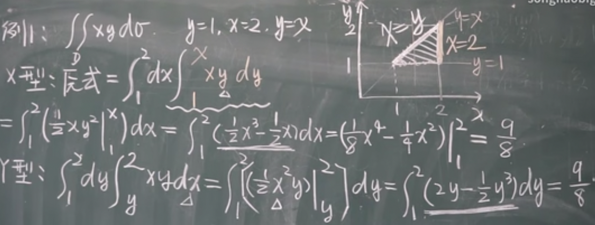

# 高等数学2

## 二重积分的性质

1. $\int_D\int[\alpha f(x,y)+\beta g(x,y)]d\sigma=\alpha\int_D\int f(x,y)d\sigma+\beta\int_D\int g(x,y)d\sigma$
2. 将D分成两个区域 $D_1,D_2$ ， $\int_D\int f(x,y)d\sigma=\int_{D_1}\int f(x,y)d\sigma+\int_{D_2}\int f(x,y)d\sigma$ 。多个区域也同理
3. f(x,y)=1, $\int_D\int 1d\sigma=\sigma$ ( $\sigma$ 为底面积)
4. $f(x,y)\subseteq g(x,y)$ . $\int_D\int f(x,y)d\sigma\leq \int_D\int g(x,y)d\sigma$ . $|\int_D\int f(x,y)d\sigma|\leq \int_D\int |f(x,y)|d\sigma$
5. M和m分别为被积函数的最大值和最小值。则 $m\sigma\leq\int_D\int f(x,y)d\sigma\leq M\sigma$
6. $m\leq\frac{\int_D\int f(x,y)d\sigma}{\sigma}\leq M$ 。可以找到一点 $(\xi_i,\eta_i)$ ，使得这点的函数值等于 $\frac{\int_D\int f(x,y)d\sigma}{\sigma}$ 。和一重积分的中值定理类似

## 二重积分的计算（直角坐标系）

先y再x的二次积分（累次积分）： $\int _a^b[\int _{\phi _1(x)}^{\phi _2(x)}f(x,y)dy]dx=\int _a^bdx\int _{\phi _1(x)}^{\phi _2(x)}f(x,y)dy$ 。后面这个写法表示先积 $\int _{\phi _1(x)}^{\phi _2(x)}f(x,y)dy$ ，然后再把结果代入 $\int _a^bdx$ 。图像上面的函数放上限，下面的函数放下限

先x再y的二次积分： $\int _c^d[\int _{\phi _1(y)}^{\phi _2(y)}f(x,y)dx]dy=\int _c^ddy\int _{\phi _1(y)}^{\phi _2(y)}f(x,y)dx$ 。用这个公式要注意x是y的函数，图像左边的函数写在下边，右边的函数写在上边

实际做题时到底用哪种，取决于积分区域。将积分区域画在xoy平面，并垂直于x轴和y轴各画线段。若垂直于某个轴的所有线段与图像交点仅有2个，则选择相应的公式。如图像与垂直于x的所有线段只有2个交点，就选择x型积分

两种特殊的的二重积分：
1. 积分区域为长方形，直接把长方形四边的长度带进去即可。a和b为宽，c和d为长。 $\int _a^bdx\int _c^df(x,y)dy=\int _c^ddy\int _a^bf(x,y)dx$
2. 积分区域为长方形,且 $f(x,y)=f_1(x)f_2(y)$ 。 $\int _a^bf_1(x)dx\*\int _c^df_2(y)dy$

## 极坐标介绍1

这块为极坐标系介绍，可在[维基百科](https://zh.wikipedia.org/wiki/%E6%9E%81%E5%9D%90%E6%A0%87%E7%B3%BB)查看

## 极坐标介绍2

利用极坐标表示线只需记住公式：
- $x=\rho\cos\theta$
- $y=\rho\sin\theta$

以后对于任何线段，写出那个线段的方程，然后将 $\rho$ 隔离到左边即可

## 二重积分（极坐标）

极坐标上的二重积分公式： $\int_D\int f(x,y)d\sigma=\int_D\int f(\rho\cos\theta,\rho\sin\theta)\rho d\rho d\theta$

极坐标分割小块的方式是，从原点射出多个射线，并围绕原点画圆。假设 $\alpha$ 是积分区域内最低射线的角度， $\beta$ 是积分区域内最高射线的角度； $\phi_1(\theta)$ 是积分区域内最低的圆， $\phi_2(\theta)$ 是积分区域内最高的圆（当然也不一定是圆，更一般的应该说是最外/内围的函数图像），则有公式 $\int_{\alpha}^{\beta}d\theta\int_{\phi_1(\theta)}^{\phi_2(\theta)}f(\rho\cos\theta,\rho\sin\theta)\rho d\rho$

一个公式： $\int_0^{+\infty}e^{-x^2}dx=\frac{\sqrt{\pi}}{2}$

什么时候用极坐标求二重积分：
1. 积分区域为圆，圆环，扇形
2. 被积表达式为 $f(x^2+y^2),f(\frac{x}{y}),f(\frac{y}{x})$

## 二重积分的换元法

定理：f(x,y)在闭区域D上连续且有变换x=x(u,v),y=y(u,v)。当变量为x，y时，积分区域为D；变量换元为u，v后，积分区域为D'。满足：
1. x(u,v)和y(u,v)具有一阶偏导
2. 其雅可比行列式:

$$J(u,v)=\frac{\partial(x,y)}{\partial(u,v)}=\begin{vmatrix}\frac{\partial x}{\partial u}&\frac{\partial x}{\partial v}\cr \frac{\partial y}{\partial u}&\frac{\partial y}{\partial v}\end{vmatrix}\not ={0}$$

如果雅可比行列式只在D'内个别点或者一条曲线上为0，在其他点不为0，该公式仍然成立

3. D'到D的点一一对应

则 $\int_D\int f(x,y)dxdy=\int_{D'}\int f(x(u,v),y(u,v))|J(u,v)|dudv$ ，竖线表示绝对值

当：
1. 被积函数不好积
2. 积分区域不好表示

使用换元法

## 三重积分的定义

二重积分求的是体积，原理相当于底面积乘高。这时求重量就是体积乘上物体密度。但假如所求物体在每点的质量不相同呢？答案是使用三重积分。把要求的物体任意分割成多块，每块体积为 $\Delta v_i$ 。任取一点 $f(\xi_i,\eta_i,\zeta_i)$ ，将这点的质量近似地看作这块物体上每点的质量。则整块物体的质量为 $lim_{\lambda\rightarrow 0}\Sigma^n_{i=1}f(\xi_i,\eta_i,\zeta_i)\Delta v_i$ 。 $\lambda$ 表示每块的直径，和二重积分定义一致。于是便有了三重积分： $\int_{\Omega}\int\int f(x,y,z)dv=\int_{\Omega}\int\int f(x,y,z)dxdydz$ 。 $\Omega$ 是积分区域，为立体图形

## 三重积分的计算（直角坐标系）

假如在三维物体的下面摆放一道激光，激光一定会穿过该三维物体的上下两面。假设上面的方程为 $Z=Z_2(x,y)$ ，下面的方程为 $Z=Z_1(x,y)$ 。则三重积分为 $\int_{D_{xy}}\int[\int_{Z_1(x,y)}^{Z_2(x,y)}f(x,y,z)dz]dxdy$ 。用二重积分x型区域拆开后就是 $\int_a^bdx\int_{y_1(x)}^{y_2(x)}dy\int_{Z_1(x,y)}^{Z_2(x,y)}f(x,y,z)dz$

其实从哪个面用激光笔照都行，只要保证交点只有两个即可

## 柱面坐标

柱面坐标：z仍然用z表示，但x和y用极坐标表示。此时求三重积分用的 $dv=\rho d\rho d\theta dz$

## 三重积分球面坐标

转换公式：
- $x=r\sin\phi\cos\theta$
- $y=r\sin\phi\sin\theta$
- $z=r\cos\phi$

r是空间上任意一点连接原点的线段的长度； $\phi$ 是r这条线段与z轴的夹角； $\theta$ 是线段r在xoy平面上的投影向量与x轴的夹角

此时三重积分 $dv=dxdydz=r^2\sin\phi drd\phi d\theta$

## 三重积分的应用——曲面面积
 
假设三维空间上有一曲面，其面积为dA，其在xoy平面上的投影的面积为 $d\sigma$ 。两者的夹角为 $\gamma$ 。则 $dA=\frac{d\sigma}{\cos\gamma}$ 。略过证明， $\cos\gamma=\frac{1}{\sqrt{1+(f'_x)^2+(f'_y)^2}}$ ，于是 $dA=\sqrt{1+(f'_x)^2+(f'_y)^2}d\sigma$ ，最后 $A=\int_D\int\sqrt{1+(f'_x)^2+(f'_y)^2}d\sigma$ 。D是曲面在xoy平面上的投影

## 重积分应用——质心

$\overline{x}=\frac{\int_D\int x\mu(x,y)d\sigma}{\int_D\int\mu(x,y)d\sigma}$ , $\overline{y}=\frac{\int_D\int y\mu(x,y)d\sigma}{\int_D\int\mu(x,y)d\sigma}$ 。 $\mu(x,y)$ 是其在(x,y)处的密度。如果物体密度均匀，即 $\mu(x,y)=\mu$ ，则公式可简化为 $\frac{1}{A}\int_D\int xd\sigma$ 和 $\frac{1}{A}\int_D\int yd\sigma$ ，A为区域D的面积

## 重积分应用——转动惯量

转动惯量在旋转动力学中的角色相当于线性动力学中的质量，可形式地理解为一个物体对于旋转运动的惯性。 $\mu(x,y)$ 表示密度， $I_x=\int_D\int y^2\mu(x,y)d\sigma$ ， $I_y=\int_D\int x^2\mu(x,y)d\sigma$

## 重积分应用——引力

$dF=(G\frac{\rho(x,y,z)(x-x_0)dv}{r^3},G\frac{\rho(x,y,z)(y-y_0)dv}{r^3},G\frac{\rho(x,y,z)(z-z_0)dv}{r^3})$

$F=(\int_{\Omega}\int\int G\frac{\rho(x,y,z)(x-x_0)dv}{r^3},...,...)$ (省略后两项)。G是物理里的常数

## 对弧长的曲线积分（概念与性质）

假设有一条曲线每处的密度都不同，求这条曲线的质量时可以将其分为若干小段，每一小段每点的质量用其中一点 $\mu(\xi_i,\eta_i)$ 近似。假设这条小曲线长度为 $\Delta S_i$ ，则这条小曲线的质量是 $\mu(\xi_i,\eta_i)\Delta S_i$ 。那么整条曲线的质量为 $lim_{\lambda\rightarrow 0}\Sigma_{i=1}^n\mu(\xi_i,\eta_i)\Delta S_i$ , $\lambda$ 的定义与之前相同。极限定义为 $\int_L f(x,y)ds$ 。如果是三维空间里的曲线： $\int_L f(x,y,z)ds$

性质：
1. $\int_L[\alpha f(x,y)+\beta g(x,y)]ds=\alpha\int_L f(x,y)ds+\beta\int_L g(x,y)ds$
2. $\int_{L_1+L_2} f(x,y)ds=\int_{L_1} f(x,y)ds+\int_{L_2} f(x,y)ds$
3. $f(x,y)\leq g(x,y)$ ,则 $\int_L f(x,y)ds\leq\int_L g(x,y)ds$
4. $|\int_L f(x,y)ds|\leq\int_L|f(x,y)|ds$

## 曲线积分的计算

假设曲线L有参数方程：
- $x=\phi(t)$
- $y=\psi(t)$

且 $\alpha\leq t\leq\beta,[\phi'(t)]^2+[\psi'(t)]^2\not ={0}$ ,则 $\int_L f(x,y)ds=\int_{\alpha}^{\beta}f(\phi(t),\psi(t))\sqrt{(\phi'(t))^2+(\psi'(t))^2}dt$ ( $\alpha$ < $\beta$ )

几种变种：
1. $y=\psi(x)(x_0\leq x\leq x_1)$ 。此时构造参数方程：
- x=x
- $y=\psi(x)$

于是有 $\int_{x_0}^{x_1}f(x,\psi(x))\sqrt{1+(\psi'(x))^2}dx$ ( $x_0$ < $x_1$ )

2. $x=\phi(y)(y_0\leq y\leq y_1)$ 。此时构造参数方程：
- $x=\phi(y)$
- y=y

于是有 $\int_{y_0}^{y_1}f(\phi(y),y)\sqrt{(\phi'(y))^2+1}dy$ ( $y_0$ < $y_1$ )

三维空间的曲线也差不多。假设曲线的参数方程为：
- $x=\phi(t)$
- $y=\psi(t)$
- $z=\omega(t)$

得到 $\int_{\alpha}^{\beta}f(\phi(t),\psi(t),\omega(t))\sqrt{(\phi'(t))^2+(\psi'(t))^2+(\omega'(t))^2}dt$ ( $\alpha$ < $\beta$ )

## 对坐标的曲线积分（概念和性质）

沿曲线L有F(x,y)为变力，求做的总功。这块推导过程和一般曲线积分差不多，不过注意向量的数量积可以用来求做的功。 $\int_L P(x,y)dx=lim_{\lambda\rightarrow 0}\Sigma_{i=1}^n P(\xi_i,\eta_i)\Delta x_i$ ,叫做函数P(x,y)在有限曲弧L上对坐标x的曲线积分； $\int_L Q(x,y)dy=lim_{\lambda\rightarrow 0}\Sigma_{i=1}^n Q(\xi_i,\eta_i)\Delta y_i$ ,叫做函数Q(x,y)在有限曲弧L上对坐标y的曲线积分。L为有向积分弧段。可推广至三维： $\int_{\Gamma}P(x,y,z)dx=lim_{\lambda\rightarrow 0}\Sigma_{i=1}^n P(\xi_i,\eta_i,\zeta_i)\Delta x_i$ 。同理也有 $\int_{\Gamma}Q(x,y,z)dy$ 和 $\int_{\Gamma}R(x,y,z)dz$

两个积分可以和在一起写： $\int_L P(x,y)dx+\int_L Q(x,y)dy=\int_L P(x,y)dx+Q(x,y)dy=\int_L F(x,y)\*dr$ (此为数量积)。F(x,y)为P(x,y)i+Q(x,y)j,dr为dxi+dyj

性质：
1. $\int_L(\alpha F_1(x,y)+\beta F_2(x,y))\*dr=\alpha\int_L F_1(x,y)\*dr+\beta\int_L F_2(x,y)\*dr$ 。一个 $\alpha$ 倍的力和 $\beta$ 倍的另一个力在同一曲线上做功
2. $\int_L F(x,y)\*dr=\int_{L_1}F(x,y)\*dr+\int_{L_2}F(x,y)\*dr$
3. 如果 $L^-$ 是L的反向曲线弧，则 $\int_{L^-}F(x,y)\*dr=\int_L F(x,y)\*dr$ 。反向指还是同一条弧线，但是方向反了

## 对坐标的曲线积分（计算）

假设曲线可以用参数方程表示：
- $x=\phi(t)$
- $y=\psi(t)$

t的值从 $\alpha$ 到 $\beta$ 。则 $\int_L P(x,y)dx+Q(x,y)dy=\int_{\alpha}^{\beta}[P(\phi(t),\psi(t))\phi'(t)+Q(\phi(t),\psi(t))\psi'(t)]dt$ 。注意 $\alpha$ 不一定比 $\beta$ 小， $\alpha$ 对应起始点而 $\beta$ 对应终点。注意起始点和终点不能弄反

特殊情况：
1. $y=\psi(x)$ 。那么此时的参数方程变为：
- x=t
- $y=\psi(t)$

公式为 $\int_{\alpha}^{\beta}[P(t,\psi(t))+Q(t,\psi(t))\psi'(t)]dt$

2. $x=\phi(y)$ 。那么此时的参数方程变为：
- $x=\phi(y)$
- y=t

公式为 $\int_{\alpha}^{\beta}[P(\phi(t),t)\phi'(t)+Q(\phi(t),t)]dt$

三维的情况：
- $x=\phi(t)$
- $y=\psi(t)$
- $z=\omega(t)$

则 $\int_L P(x,y,z)dx+Q(x,y,z)dy+R(x,y,z)dz=\int_{\alpha}^{\beta}[P(\phi(t),\psi(t),\omega(t))\phi'(t)+Q(\phi(t),\psi(t),\omega(t))\psi'(t)+R(\phi(t),\psi(t),\omega(t))\omega'(t)]dt$

## 格林公式的定义和证明

单连通区域：D为一个平面区域。若D内任意闭曲线围成的部分都属于D，则称D为单连通区域。否则就叫复连通区域

正方向：沿着区域D的边缘走，若D始终在左侧，即为正方向

假设闭区域D由分段光滑曲线（区域由几段光滑曲线组成，但是曲线之间的交界点不一定光滑）L围成；P(x,y)和Q(x,y)在D上有一阶连续偏导。那么 $\int_D\int(\frac{\partial Q}{\partial x}-\frac{\partial P}{\partial y})dxdy=\oint_L Pdx+Qdy$ (积分符号加个圈，表示是闭曲线上的积分，也可以只写积分符号)。L表示D的正方向边界曲线

## 格林公式的计算

假如x和y的表达式均已知，即可用公式直接求x表达式与y表达式所围成的面积： $A=\frac{1}{2}\oint_L xdy-ydx$

如果区域内某点一阶偏导不存在，处理方法是在不存在的点周围画一个圆。视频41:00处可以看到完整例题的板书

## 对面积的曲面积分

有一个曲面，其连续面密度函数为 $\rho(x,y,z)$ ，求质量M。因为曲面的密度是个函数而不是常量，不能直接用“密度乘上面积”的方法求质量。所以我们将其分割成n个小曲面 $\Delta S_k$ ，每个小曲面上取一个坐标处的密度近似为整个小曲面的密度，即 $\Delta S_k$ 整个小曲面的密度为 $\rho(\xi_k,\eta_k,\zeta_k)$ 。那么全部的小曲面的质量加起来就是整个大曲面的质量了。 $M=lim_{\lambda\rightarrow 0}\Sigma_{k=1}^n\rho(\xi_k,\eta_k,\zeta_k)\Delta S_k$ 。其中 $\lambda$ 表示n小块曲面的直径的最大值

设 $\Sigma$ 为光滑曲面，f(x,y,z)是定义在 $\Sigma$ 上的一个有界函数，若对 $\Sigma$ 做任意分割和局部区域任意取点，下面的“乘积和式极限” $lim_{\lambda\rightarrow 0}\Sigma_{k=1}^nf(\xi_k,\eta_k,\zeta_k)\Delta S_k$ 都存在，则称此极限为函数f(x,y,z)在曲面 $\Sigma$ 上对面积的曲面积分或第一类曲面积分。记作 $\int\int_{\Sigma} f(x,y,z)dS$ 。f(x,y,z)叫做被积函数， $\Sigma$ 叫做积分曲面

性质：
1. 若f(x,y,z)在光滑曲面 $\Sigma$ 上连续，则对面积的曲面积分存在
2. $\int\int_{\Sigma_1+\Sigma_2} f(x,y,z)dS=\int\int_{\Sigma_1} f(x,y,z)dS+\int\int_{\Sigma_2} f(x,y,z)dS$ (将一块曲面分成两块后求积分再相加等于直接求那块曲面的积分)
3. 设 $k_1,k_2$ 为常数。则 $\int\int_{\Sigma} [k_1f(x,y,z)\pm k_2g(x,y,z)]dS=k_1\int\int_{\Sigma} f(x,y,z)dS\pm k_2\int\int_{\Sigma} g(x,y,z)dS$
4. 若曲面 $\Sigma$ 关于xoy面对称。则 $\int\int_{\Sigma}f(x,y,z)dS$ 等于：
- f(x,y,z)关于z为偶函数： $2\int\int_{\Sigma_i}f(x,y,z)dS$ （ $\Sigma_i$ 为原先曲面的一半）
- f(x,y,z)关于z为奇函数：  0
- 具体关于什么坐标为偶/奇函数，取决于投影到哪个平面

设有光滑曲面 $\Sigma:z=z(x,y),(x,y)\in D_{xy}$ ( $D_{xy}$ 为 $\Sigma$ 在xoy平面上的投影面积)且f(x,y,z)在 $\Sigma$ 上连续。则 $\int\int_{\Sigma} f(x,y,z)dS=\int\int_{D_{xy}}f(x,y,z(x,y))\sqrt{1+z_x^2(x,y)+z_y^2(x,y)}dxdy$ 。投影不一定非要投到xoy平面上，也可以投到yoz，zox平面。但是前者会没有x，要用x(y,z)替代x，面积元素dS的变换也会不同；后者会没有y，要用y(x,z)代替，同样面积元素dS的变换会不同。总之投影平面上缺哪个坐标， $\sqrt{1+z_x^2(x,y)+z_y^2(x,y)}dxdy$ 中根号下就换成那个缺失的坐标的偏导，dxdy换成存在的坐标。注意当 $\Sigma$ 投影的面积为0时，不可投;如果各个面的投影有重叠，分片计算

若曲面为参数方程，只要求出在参数意义下dS的表达式，也可将对面积的曲面积分转化为对参数的二重积分。讲例题时提到了[轮换对称性](https://zhuanlan.zhihu.com/p/371226059)