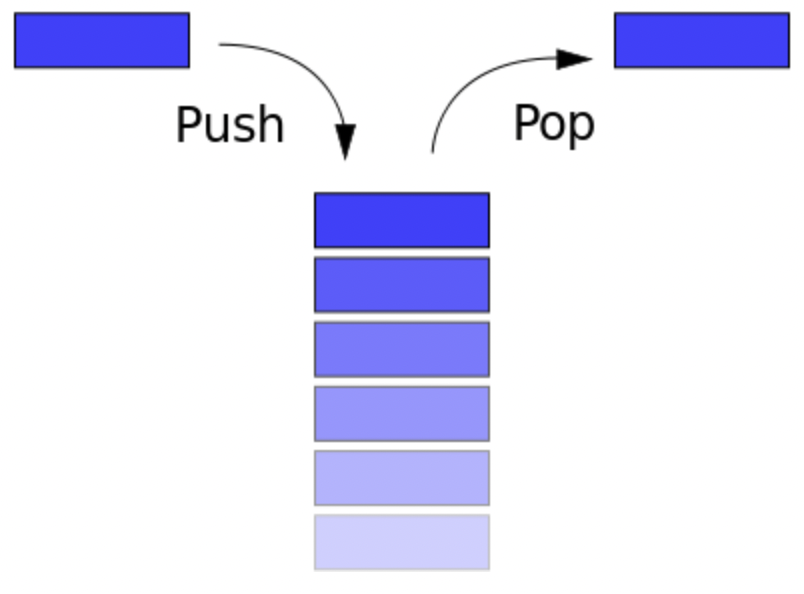
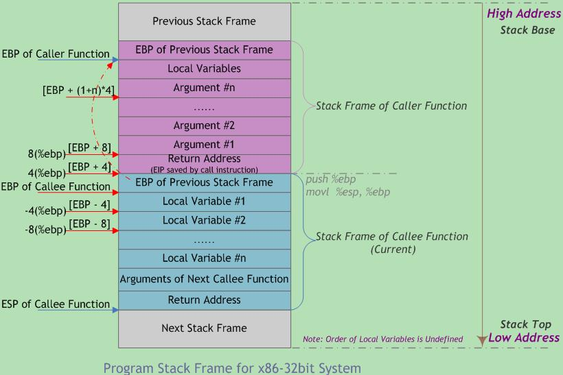

# 什么是栈？

pwn一直不好，今天攻防世界网站在维护，没法做题，那就趁今天以小白的视角讲解一下各种pwn基础教程（所以会非常啰嗦！还可能错，错了记得告诉我）。

pwn是一个黑客语法的俚语词 ，是指攻破设备或者系统 。发音类似"砰"，对黑客而言，这就是成功实施黑客攻击的声音--砰的一声，被"黑"的电脑或手机就被你操纵了。说到pwn入门，栈溢出肯定是无法绕过的点。那什么是栈呢？

以下来自[CTF Wiki](https://ctf-wiki.org/en/pwn/linux/user-mode/stackoverflow/x86/stack-intro/),加上一些自己的理解。

栈是一种典型的后进先出 (Last in First Out) 的数据结构，其操作主要有压栈 (push) 与出栈 (pop) 两种操作，如下图所示（维基百科）。两种操作都操作栈顶，当然，它也有栈底。

很好理解，大家有没有那种装书的大纸箱？我每年都会把用不着的书一股脑塞进去，那怎么取出书？为了不把房间弄得一团糟，就只能从上往下一本一本拿出来。最底下的书所对应的就是栈底，是最早放进箱子里的；最上面的书对应的就是栈顶，是最晚放进箱子里的。放书就是压栈，取书就是出栈。

高级语言在运行时都会被转换为汇编程序，在汇编程序运行过程中，充分利用了这一数据结构。每个程序在运行时都有虚拟地址空间，其中某一部分就是该程序对应的栈，用于保存函数调用信息和局部变量。此外，常见的操作也是压栈与出栈。需要注意的是，程序的栈是从进程地址空间的高地址向低地址增长的。

你会在往后的路中和汇编成为朋友（好不好就不一定了啊ʕ •ᴥ•ʔ）。入门pwn无需专门去学汇编，知道一点基础的汇编知识就行了。程序是由很多函数组成的，既然现在你对什么是栈有了一些基本的理解，是时候该看看函数调用栈了。

以下来自[C语言函数调用栈（一）](https://www.cnblogs.com/clover-toeic/p/3755401.html),加上一些自己的理解。

程序的执行过程可看作连续的函数调用。当一个函数执行完毕时，程序要回到调用指令的下一条指令(紧接call指令)处继续执行。函数调用过程通常使用堆栈实现，每个用户态进程对应一个调用栈结构(call stack)。编译器使用堆栈传递函数参数、保存返回地址、临时保存寄存器原有值(即函数调用的上下文)以备恢复以及存储本地局部变量。

不同处理器和编译器的堆栈布局、函数调用方法都可能不同，但堆栈的基本概念是一样的。

call指令指的是汇编中的call，跟在编程时调用一个函数差不多。用户态指非特权状态，此处不是重点。我们在编程时调用函数非常简单，比如python里面定义一个函数，调用就写个函数名，传参就往括号里填。但是底层可就忙了，参数怎么给？底层可没有括号这个东西。执行完了程序该去哪？总不能执行个函数结果就回不去了吧？本地变量存在哪？等等问题。继续往下看就知道了。

寄存器是处理器加工数据或运行程序的重要载体，用于存放程序执行中用到的数据和指令。因此函数调用栈的实现与处理器寄存器组密切相关。

Intel 32位体系结构(简称IA32)处理器包含8个四字节寄存器，如下图所示：

4个字节什么概念？现在大部分应用最少都要100mb，而字节的单位是b，差了可不是一点。但就是这样小的寄存器帮助了函数返回，声明本地变量等重要操作。它们的名字有点难记，还有别名。之后看汇编可能遇见al等名字，通过上面的图就可以知道本质上还是eax了。不需要专门记忆他们，遇见了查一下就行。虽然每个都有特殊用途（寄存器名称反映其不同用途），但是并不是所有的寄存器都很重要。它们的值是pwn魔法的关键，下次遇见了跟他们打个招呼，然后就可以开始利用他们了！（非常有礼貌）

在x86（32位）处理器中，EIP(Instruction Pointer)是指令寄存器，指向处理器下条等待执行的指令地址(代码段内的偏移量)，每次执行完相应汇编指令EIP值就会增加。ESP(Stack Pointer)是堆栈指针寄存器，存放执行函数对应栈帧的栈顶地址(也是系统栈的顶部)，且始终指向栈顶；EBP(Base Pointer)是栈帧基址指针寄存器，存放执行函数对应栈帧的栈底地址，用于C运行库访问栈中的局部变量和参数。

注意，EIP是个特殊寄存器，不能像访问通用寄存器那样访问它，即找不到可用来寻址EIP并对其进行读写的操作码(OpCode)。EIP可被jmp、call和ret等指令隐含地改变(事实上它一直都在改变)。

啰嗦一下讲下eip。eip存储着cpu要读取指令的地址，工作逻辑大概是这样的。假设一个程序入口点是0x00080400，程序执行时PE loader会告诉eip：“0x00080400，记住这个地址”。接下来cpu过来找eip，eip把地址告诉cpu，cpu就可以去读取那个地址对应的二进制了。再假设现在执行的指令长4字节，eip在cpu来过后会自动增加读入指令的长度，这时自己记住的地址就变成了0x00080404，最后默默等待cpu的下次来访，一直循环。这里我是极其简化版本，完整请看[这里](https://www.cnblogs.com/johnpher/archive/2011/05/28/2570683.html)。

不同架构的CPU，寄存器名称被添加不同前缀以指示寄存器的大小。例如x86架构用字母“e(extended)”作名称前缀，指示寄存器大小为32位；x86_64架构用字母“r”作名称前缀，指示各寄存器大小为64位。所以rbp和ebp作用相同，只是一个在64位，一个在32位。

等一下，寄存器们是不是忘了什么？局部变量谁记着呢？再仔细一想，好像没法记啊，在编程的时候爱放多少个参数就放多少个参数，可是寄存器是有限的，不可能记得完。这个寄存器们当然考虑到了，于是使用了一种“曲线救国”的形式——我不记变量的值，我放栈上，我记它在哪不就行了吗？

还记得前面的书箱子吗？我没法记住每本书的内容，但是我可以把书放在箱子里存起来，记住放在了哪里，等要用的时候拿出来看不就好了吗？以此类推，访问函数栈上局部变量的关键是定位每个变量。局部变量相对于堆栈指针ESP的位置在进入函数时就已确定，理论上变量可用ESP加偏移量来引用，但ESP会在函数执行期随变量的压栈和出栈而变动。尽管某些情况下编译器能跟踪栈中的变量操作以修正偏移量，但要引入可观的管理开销。而且在有些机器上(如Intel处理器)，用ESP加偏移量来访问一个变量需要多条指令才能实现。

因此，许多编译器使用帧指针寄存器FP(Frame Pointer)记录栈帧基地址。局部变量和函数参数都可通过帧指针引用，因为它们到FP的距离不会受到压栈和出栈操作的影响。有些资料将帧指针称作局部基指针(LB-local base pointer)。

在Intel CPU中，寄存器BP(EBP)用作帧指针。在Motorola CPU中，除A7(堆栈指针SP)外的任何地址寄存器都可用作FP。当堆栈向下(低地址)增长时，以FP地址为基准，函数参数的偏移量是正值，而局部变量的偏移量是负值。

这张图是一个pwn题里的。不难在里面发现RBP-0x8，和之前提到的AL。因为栈是向下增长的，所以越晚入栈的东西地址反而越低。ebp是栈底指针，在它后面入栈的局部变量自然比它低，故相对偏移为负。用ebp做基址也很好理解。假如拿esp，也就是栈顶指针，这个偏移是无法固定的。今天我的箱子里有20本书，明天25，后天15，还在箱子里的书相对顶部的书偏移每天都在变。但只要书还在箱子里，书与最底下的书的便偏移就永远不会改变。

寄存器是唯一能被所有函数共享的资源。虽然某一时刻只有一个函数在执行，但是还是有问题：一个函数执行到一半发现要调用另外的函数，另外的函数自然也要用寄存器，用完后里面的值不就变了吗？因此，IA32采用一套统一的寄存器使用约定，所有函数(包括库函数)调用都必须遵守该约定。

根据惯例，寄存器%eax、%edx和%ecx为主调函数保存寄存器(caller-saved registers)，当函数调用时，若主调函数希望保持这些寄存器的值，则必须在调用前显式地将其保存在栈中；被调函数可以覆盖这些寄存器，而不会破坏主调函数所需的数据。寄存器%ebx、%esi和%edi为被调函数保存寄存器(callee-saved registers)，即被调函数在覆盖这些寄存器的值时，必须先将寄存器原值压入栈中保存起来，并在函数返回前从栈中恢复其原值，因为主调函数可能也在使用这些寄存器。此外，被调函数必须保存寄存器%ebp和%esp，并在函数返回后将其恢复到调用前的值，亦即必须恢复主调函数的栈帧。

主调函数保存寄存器意为，这些寄存器里的值主调函数自己要记好，寄存器被调函数随便用；被调函数保存寄存器意为，这里面的值在使用寄存器前被调函数要帮主调函数记住，用完了还要记得给主调函数还原。被调函数必须保存寄存器%ebp和%esp，因为在使用前这里面保存着被调函数的栈顶和栈底地址。你现在拿去记自己的栈顶和栈底可以，但必须要给人家恢复原状。不能自己用完了然后就撒手不管了，你被调函数执行完了可以回家了留下主调函数独自懵逼——不是我栈顶和栈底呢？

函数调用经常是嵌套的，在同一时刻，堆栈中会有多个函数的信息。每个未完成运行的函数占用一个独立的连续区域，称作栈帧(Stack Frame)。栈帧是堆栈的逻辑片段，当调用函数时逻辑栈帧被压入堆栈, 当函数返回时逻辑栈帧被从堆栈中弹出。栈帧存放着函数参数，局部变量及恢复前一栈帧所需要的数据等。

编译器将控制权移交函数本身之前，插入特定代码将函数参数压入栈帧中，并分配足够的内存空间用于存放函数中的局部变量。由上可知，堆栈中会有很多逻辑栈帧，整个栈也非常忙碌。一个函数进来了又出去，以此往复循环，让栈在忙碌情况下保持条理就靠寄存器了。这种情况下理解递归就很容易了。递归是函数自己调用自己，但在栈上就是不同的逻辑栈帧，各自有各自的当前状态，互不干扰。调用就是不停往栈上压栈帧，一个接一个，返回就一个一个弹，根本不绕。

栈帧的边界由栈帧基地址指针EBP和堆栈指针ESP界定(指针存放在相应寄存器中)。EBP指向当前栈帧底部(高地址)，在当前栈帧内位置固定；ESP指向当前栈帧顶部(低地址)，当程序执行时ESP会随着数据的入栈和出栈而移动。因此函数中对大部分数据的访问都基于EBP进行。

函数调用栈的典型内存布局如下图所示：

图中给出主调函数(caller)和被调函数(callee)的栈帧布局，"m(%ebp)"表示以EBP为基地址、偏移量为m字节的内存空间(中的内容)。该图基于两个假设：第一，函数返回值不是结构体或联合体，否则第一个参数将位于"12(%ebp)" 处；第二，每个参数都是4字节大小(栈的粒度为4字节)。 此外，函数可以没有参数和局部变量，故图中“Argument(参数)”和“Local Variable(局部变量)”不是函数栈帧结构的必需部分。

从图中可以看出，函数调用时入栈顺序为:实参N~1→主调函数返回地址→主调函数帧基指针EBP→被调函数局部变量1~N

为啥是”实参N~1“呢？因为参数虽然编程时从左往右写，但参数在底层入栈是从右往左的。

（维护完成了，今天就先到这里了，之后有时间再更新）